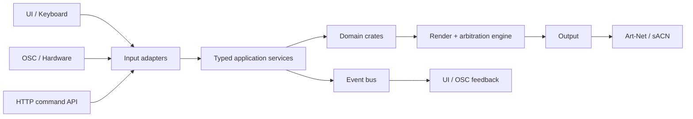

# ToskLight

ToskLight is a show-lighting control desk: the software an operator runs a live performance from.

Two facts about that shape most decisions here.

1. Output goes out on a hard clock. A dropped frame is visible on stage.
2. Keypad layout, command grammar, OSC paths, and desk geometry are operator muscle memory.
   Changing them is a product decision, not a refactor.

## Start here

New to the repository, read **Orientation**. New to Rust, read **Rust by Example**. Changing one
area, read that component page.

## System shape



| Layer | Path | Constraint |
| --- | --- | --- |
| Adapters | `crates/server/`, UI transports | Parse, authenticate, translate. No business rules. |
| Application | `crates/application/` | Transport-independent use cases. Owns state, exposes commands and immutable projections. |
| Domain | `crates/{core,fixture,playback,programmer,output,control,show,media,mvr}` | No HTTP, WebSocket, SQLite, or Tauri. |
| Wire | `crates/wire/` | Leaf. Versioned DTOs only. |
| Frontend | `apps/control-ui/`, `apps/hardware-controls/` | Renders authoritative projections. Never an authority. |

`tools/check-architecture.mjs` enforces the dependency direction in CI.

## Two rules to read first

[One action, one authority](glossary:one-action-one-authority) — six input surfaces, one typed
command, one service, one event.

[State lifetimes](glossary:state-lifetimes) — six lifetimes, and seven questions to answer before
adding a field.

## Both architectures are visible at once

The codebase is mid-refactor. You will find two shapes for the same job.

| Converging on this | Being removed |
| --- | --- |
| `crates/application/src/<capability>/` | `crates/server/src/runtime/ws_*`, v1 routes |
| `apps/control-ui/src/features/<capability>/` | `api/ServerContext.tsx`, `features/server/` |
| typed command + typed event + narrow store | `useServer()`, broad bootstrap refresh, polling |

`macro_runtime/`, `timeline/`, `managed_assets/`, and `scheduling/` are extension seams tested with
fakes. Macros and timecode do not exist as products.

State: `docs/plans/refactoring-progress.md`. Target: `docs/plans/major-refactoring.md`.

## Authorities

These outrank this tour. It links into them rather than restating them.

| Source | Authority over |
| --- | --- |
| `AGENTS.md` | Working agreements, operator semantics, scope |
| `docs/help/` | Operator behavior; source for the manual and in-app help |
| `docs/testing/` | Acceptance contracts and stable scenario IDs |
| `docs/engineering/` | Architecture rules, state ownership, boundaries, extension recipes, test map |
| `docs/acceptance-criteria.md` | Persisted show and desk data |

## Verification

```sh
./test architecture     # dependency direction + source size
./test unit             # + cargo + vitest + tsc/vite
./test e2e-api
./test e2e-ui
./build open            # required when operator-visible behavior changed
```

Use `cargo fmt`, not standalone `rustfmt`. `docs/engineering/build-and-test-commands.md` covers
every subcommand and which check to run for which change.

## Maintaining this tour

Tour steps are `@tour <slug>:<order> <Title>` comments in the source, so they move with the code.
The pages under `.tour/` hold the narrative. Update the component page in the same commit as the
boundary change.
