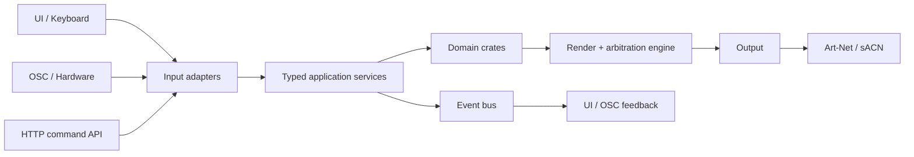

# ToskLight

ToskLight is a show-lighting control desk: the software an operator runs a live performance from.

Two facts about that shape most decisions here.

1. Output goes out on a hard clock. A dropped frame is visible on stage.
2. Keypad layout, command grammar, OSC paths, and desk geometry are operator muscle memory.
   Changing them is a product decision, not a refactor.

## Start here

New to the repository, read **Orientation**. New to Rust, read **Rust by Example**. Changing one
area, read that component page.

## System shape


```mermaid
flowchart LR
  UI["UI / Keyboard"] --> AD["Input adapters"]
  OSC["OSC / Hardware"] --> AD
  HTTP["HTTP command API"] --> AD
  AD --> APP["Typed application services"]
  APP --> DOM["Domain crates"]
  APP --> BUS["Event bus"]
  DOM --> ENG["Render + arbitration engine"]
  ENG --> OUT["Output"]
  OUT --> DMX["Art-Net / sACN"]
  BUS --> CLIENTS["UI / OSC feedback"]
```

| Layer | Path | Constraint |
| --- | --- | --- |
| Adapters | `crates/light/adapters/headless/`, UI transports | Parse, authenticate, translate. No business rules. |
| Application | `crates/light/` | Transport-independent use cases. Owns state, exposes commands and immutable projections. |
| Domain | `crates/{core,fixture,playback,programmer,output,control,show,media,mvr}` | No HTTP, WebSocket, SQLite, or Tauri. |
| Wire | `crates/light/contracts/wire/` | Leaf. Versioned DTOs only. |
| Frontend | `apps/light-desktop/`, `apps/light-hardware-controls/` | Renders authoritative projections. Never an authority. |

`tools/check-architecture.mjs` enforces the dependency direction in CI.

## Two rules to read first

[One action, one authority](glossary:one-action-one-authority) — six input surfaces, one typed
command, one service, one event.

[State lifetimes](glossary:state-lifetimes) — six lifetimes, and seven questions to answer before
adding a field.

## The refactored shape

No served application route remains under `/api/v1`, and production has no `useServer()` consumer.
New work follows one vertical capability slice:

| Layer | Home |
| --- | --- |
| use case and authority | `crates/light/src/<capability>/` |
| serialized contract | `crates/light/contracts/wire/src/v2/` |
| adapter/composition | `crates/light/adapters/headless/src/runtime/` |
| frontend projection | `apps/light-desktop/src/features/<capability>/` |
| acceptance | root `tests/` plus feature-local unit tests |

`macro_runtime/`, `timeline/`, `managed_assets/`, and `scheduling/` are extension seams tested with
fakes. Macros and timecode do not exist as products.

The completed history is under `docs/plans/refactoring/done/`; the durable handoff is
`REFACTORING-SUMMARY.md`.

## Guided learning paths

| Path | Question |
| --- | --- |
| One Value: From Desk Input to DMX and Back | How does one software/OSC value traverse every layer? |
| Cue Tracking and Goto | How can a direct jump reconstruct the same stage as sequential GO? |
| Ordered Selection | Why do fixture/head identity, Group emptiness, and DEGRP preserve order? |
| Value Spreading | Where are multi-point curves validated and sampled? |
| The Portable Show | How do lossless data, migration, revision, compile, and install stay ordered? |
| Recording and Live References | What becomes portable when Record or Update runs? |
| Fixture Semantics | How does an attribute become mode-specific coarse/fine DMX? |
| Playback Runtime | How do Cues, masters, speed, and arbitration meet? |
| State Ownership to Pixels | How do snapshots, events, overlays, gaps, and replacement reach React? |
| Rust and Tauri for TypeScript Developers | Which Rust/native concepts matter in this repository? |

## Developer reference guides

These guides are Code Safari source and are published with the tour:

- [Architecture overview](tours/01-architecture-overview.md)
- [Architecture boundaries](tours/02-architecture-boundaries.md)
- [State ownership](tours/19-state-ownership.md)
- [Selective Show Import](tours/23-selective-show-import.md)

## Authorities

These outrank this tour. It links into them rather than restating them.

| Source | Authority over |
| --- | --- |
| `AGENTS.md` | Working agreements, operator semantics, scope |
| `docs/help/` | Operator behavior; source for the manual and in-app help |
| `docs/testing/` | Acceptance contracts and stable scenario IDs |
| `.tour/tours/` | Developer architecture, state ownership, and import guides published by Code Safari |
| `docs/engineering/` | Agent-facing API, build, model, performance, and test contracts |
| `docs/acceptance-criteria.md` | Persisted show and desk data |

## Verification

```sh
npm run test:architecture
npm run test:unit
npm run test:e2e-api
npm run test:e2e-ui
npm run open
```

Use `cargo fmt`, not standalone `rustfmt`. `docs/engineering/build-and-test-commands.md` covers
every subcommand and which check to run for which change.

## Maintaining this tour

Tour steps are `@tour <slug>:<order> <Title>` comments in the source, so they move with the code.
The pages under `.tour/` hold the narrative. Validate and export them with:

```sh
npm run codesafari
npx --yes "@tobisk/codesafari@1.0.0" validate .
npm run pages:generate
```

The Pages workflow layers the repository's narrow-layout stylesheet over the pinned static export.
Update the relevant safari, source anchors, and component page in the same commit as a boundary
change.
