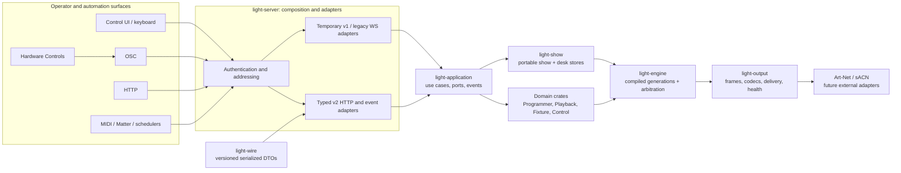

# Architecture Overview

This is the starting point for engineering work in ToskLight. It describes the architecture that
is present in the repository, including the remaining migration facades; it is not a picture of a
future tree in which every v1 caller has already disappeared.

Read these companion documents for detail:

- [Architecture boundaries](architecture-boundaries.md) defines dependency, action, concurrency,
  event-delivery, and compatibility rules.
- [State ownership](state-ownership.md) assigns every state field to one of six lifetimes.
- [Code tour](code-tour.md) explains where the implementation lives.
- [Extension recipes](extension-recipes.md) gives repeatable end-to-end change sequences.
- [Test map](test-map.md) maps a change to the smallest useful verification.
- [Frontend performance baseline](frontend-performance-baseline.md) records the request pressure
  that the view-scoped stores replace.
- [Selective Show Import](selective-show-import.md) documents the cross-show object workflow.

## System shape

Dependencies point from adapters toward application and domain boundaries. `light-wire` is a
serialization leaf: no application behavior belongs there and no domain or application crate may
depend on it. The enforced graph and exceptions live in
`tools/check-architecture.mjs`; run `./test architecture` after changing a boundary.

## One action, one authority

An input adapter authenticates the caller, resolves desk and object addressing, constructs an
`ActionContext`, and invokes one bounded application service. UI, HTTP, OSC, attached hardware,
Matter, MIDI, automatic Playback, and future Macro or Timecode sources do not own parallel business
rules. The application service owns ordering and returns a typed outcome; a compatibility adapter
may translate that result but may not repeat the mutation.

The common mutation path is:

1. Decode and validate at the adapter boundary.
2. Authorize and execute one typed application command.
3. Validate optimistic revisions before changing authoritative state.
4. Commit, install runtime state, and reconcile adapters in service-owned order.
5. Publish one typed semantic event with source, correlation identity, stable object routes, and a
   monotonic sequence.
6. Reconcile only subscribed frontend projections; command responses and events meet by request
   identity and revision.

For active-show writes, `crates/application/src/active_show/service.rs` is the shared ordered
lifecycle. Capability services prepare typed changes, while `light-show` retains unknown JSON and
commits a revisioned `PortableShowTransaction` atomically. Runtime preparation happens before the
commit; runtime installation and event publication remain ordered after it.

## Query and event model

Commands and queries return immutable projections rather than locks, registries, or transport
objects. `crates/application/src/event/` owns the bounded event bus. A subscription may filter by
desk, capability, class, and stable object identity. Lossless transitions cause an explicit gap on
overflow; replaceable projections may coalesce or be rate-limited.

The v2 WebSocket adapter is `crates/server/src/runtime/event_transport.rs`. A frontend session
hydrates an authoritative snapshot, subscribes from its cursor, applies relevant events, and, on a
gap, installs a coverage-complete snapshot before requesting repair. It is valid to have no
subscription when a view is not mounted.

The reference frontend implementations are:

- `apps/control-ui/src/features/showObjects/` for kind-wide and exact-object show projections;
- `apps/control-ui/src/features/playbackRuntime/` for Playback and selected-Cuelist runtime;
- `apps/control-ui/src/features/patch/` for revisioned optimistic Patch mutations; and
- `apps/control-ui/src/api/` for generated DTO consumption, decoding, and HTTP/WebSocket adapters.

Feature stores keep the authoritative base separate from pending optimistic overlays. A failed
command rolls back its overlay; a successful response or matching event reconciles it. Components
select the smallest projection with `useSyncExternalStore` or a narrow context so unrelated events
do not rerender the application.

## Render and output path

`light-show` is decoded, migrated, and compiled into an immutable `EngineSnapshot`. The engine
installs a coherent runtime generation and resolves Programmer, Playback, Preload, Group, control,
and optional sampled contribution batches at a render instant. Stateful producers remain outside
the deterministic render core and provide finite semantic fixture-and-attribute samples through
`crates/engine/src/contribution_batch.rs`.

`Engine::render_with_contribution_batches` produces semantic projections and complete DMX frames
without persistence, JSON, fixture-library reads, frontend work, or client backpressure. The output
scheduler in `crates/server/src/runtime/output_scheduler.rs` encodes and delivers routes through
`light-output`. Automatic Playback transitions are returned from the render boundary and published
after domain locks are released.

## Persistence and process ownership

The configured data directory contains `desk.sqlite`, portable `.show` SQLite files, revisions,
fixture-library state, media/cache data, and the server log. `crates/show/src/desk/` owns desk
installation data; `crates/show/src/portable/` owns portable show data. They must never be copied as
one undifferentiated database. See [State ownership](state-ownership.md) before adding a field.

`crates/server/src/main.rs` only calls `light_server::run()`. Startup, router composition,
background input tasks, the output scheduler, cancellation, and graceful shutdown live under
`crates/server/src/runtime/`. The main Tauri host is `apps/control-ui/src-tauri/`; the sibling
Hardware Controls host is `apps/hardware-controls/src-tauri/`. Browser tests use the typed desktop
adapter under `apps/control-ui/src/platform/desktop/` rather than importing Tauri globally.

## Deliberate transition seams

The repository still contains REST/WebSocket v1 routes, `apps/control-ui/src/api/ServerContext.tsx`,
and `apps/control-ui/src/features/server/`. They are migration facades for capabilities without a
narrow replacement, not extension points. Do not add a new feature to the global context, broad
`refresh()`, generic show-object mutation, or string event routing. Add a bounded v2 capability and
migrate its callers vertically, then remove the obsolete facade path.

The current typed slices include command-line HTTP, filtered events, Patch, Playback runtime,
global Output runtime, active-show object changes, and Selective Show Import. Exact OSC paths,
aliases, feedback indices, desk sharing, persisted show behavior, and operator-visible layout remain
compatibility surfaces even while internal v1 HTTP and legacy WebSocket adapters are retired.
