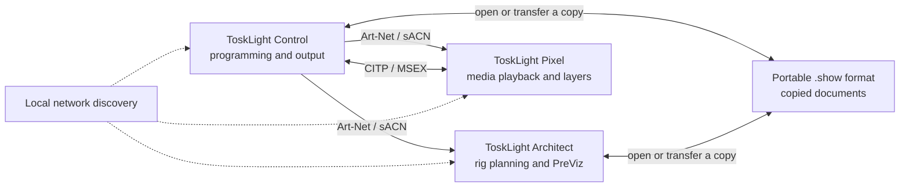
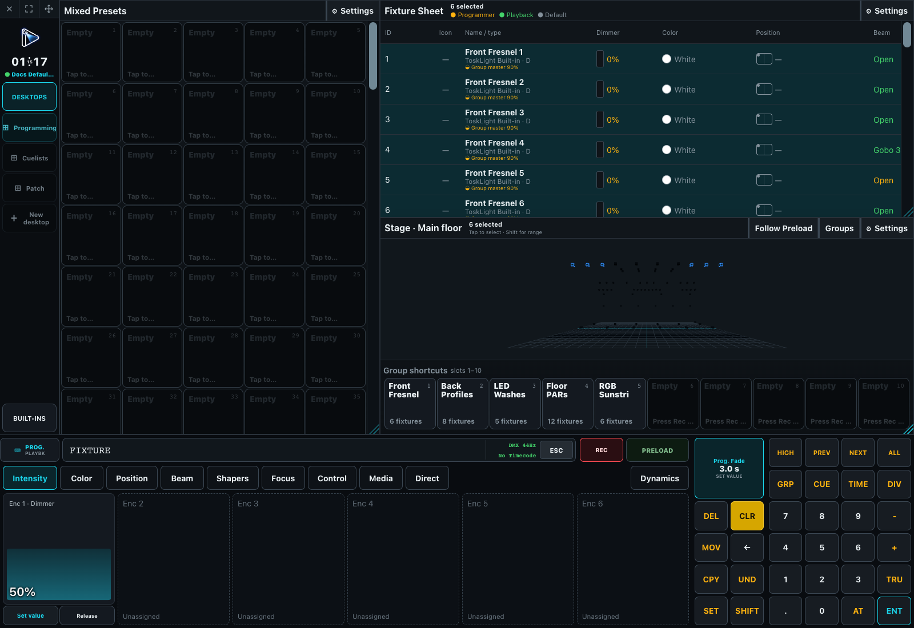

# Quick Start

## Intro

ToskLight is open-source show-control software, built with open-source Rust, JavaScript, and other
third-party components. The source is published in the [ToskLight GitHub repository](https://github.com/kellertobias/tosklight). Read the [ToskLight Community License](https://github.com/kellertobias/tosklight/blob/main/LICENSE) and the generated [third-party license notices](https://kellertobias.github.io/tosklight/third-party-licenses.html) before distributing a bundled build.

> [!danger] ToskLight is still under active development.
> Rehearse the complete production workflow, keep recoverable show copies, and verify physical output before relying on a testing build for a live event.

### The ToskLight Suite

The ToskLight bundle contains three operator products:

- **ToskLight Control** is the lighting-control application. It owns the Programmer, Groups, Presets, Cuelists, Cues, Playbacks, Dynamics, patch, output routes, users, and screen layouts.
- **ToskLight Architect** combines CAD-based venue and rig planning with a standalone 3D visualizer. Its Rig Editor plans and patches a rig; its renderer draws it from live Art-Net or sACN, from the editor's preview, or from its built-in demonstration source.
- **ToskLight Pixel** is the media server. It plays video, pictures, text, generated visuals, and effects on configured displays. Control operates its master and layers through patched Media fixtures and can use CITP/MSEX for names, thumbnails, libraries, and previews.

Control and Architect use the same portable `.show` format. **Load from Desk** and **Load from
Visualizer** transfer a copy, not a shared live file. For live visualization, send the matching
Art-Net or sACN universe to Architect. For Pixel, patch the Media fixture and configure its CITP
address under **Show Patch → Media Servers**; numeric control remains available without CITP.

### Start from the Demo Show

The bundled **Demo Show** is built as a useful starting point. It follows the lead programmer's showfile setup philosophy, developed over years of work on professional lighting consoles:

1. Stable Groups describe the physical rig, such as stage Profile fixtures, stage Wash fixtures, audience lights, or Sunstrips.
2. Those physical Groups are combined or referenced to create the Groups used while busking.
3. Presets store reusable Intensity, Color, Position, Beam, Shapers, Focus, Control, Media, or mixed looks for those selections.
4. Cues, Cuelists, Dynamics, and Playbacks build the running show on top of that structure.

Open the Demo Show, inspect how its Groups lead to Presets and Playbacks, and adapt that structure to the production. Use **Load Clean Built-in Default** when a fresh working copy is needed; it leaves the untouched bundled source available for the next reset.

### First Control look

This example turns on a range of fixtures, records the Programmer to a playback, and then proves that the playback can reproduce the look.

1. Start **ToskLight Control** and load the Demo Show.
2. Select the intended fixtures in the Fixture Sheet, Stage, or Group Pool. A simple command-line example is `1 [THRU] 12 [AT] 100 [ENT]`, which selects Fixtures 1 through 12 and gives them 100% Intensity in the Programmer.
3. Press `[REC]`, then choose an empty playback. On the touch playback surface the complete playback is the Record target. On an attached desk, use its topmost playback button; the hardware fader is never intercepted by Record.
4. The Desk creates a Cuelist, records its first Cue, and assigns that Cuelist to the playback.
5. Press `[CLR]` once to clear the selection and again to clear the Programmer values.
6. Press the playback's GO or Toggle button. The fixtures now come from the recorded Cue rather than from the Programmer.

What is in the Programmer is what gets stored in the Cue. A resolved output value, Highlight, a running playback, or a fixture default is not recorded merely because it can be seen. Continue with [Show Setup and Patching](../10-Desk/10-Show-Setup/index.md), [Programmer and Cues](../10-Desk/20-Programmer-and-Cues/index.md), and the precise [Command Line Reference](../10-Desk/20-Programmer-and-Cues/01-command-line.md).

### First Media output

Start **ToskLight Pixel**, select and test its output, upload content, and wait for conversion to
finish. Verify the physical display before patching the matching Media Server fixture in Control.
Configure the corresponding Art-Net or sACN address and CITP endpoint in Show Patch.

Network, monitor, resolution, presentation-rate, and audio-device changes are saved configuration and take effect after the Media Server restarts. Layer, playback, and takeover changes are live.

### First Architect rig

1. Start **ToskLight Architect**. A standalone launch opens the **PreViz Rig Editor** first.
2. Use its writable Demo Show copy, open another `.show` file, import MVR, or choose a discovered Desk and **Load from Desk**.
3. Patch and position fixtures in the Rig Editor, then choose **Open Viz** to start the PreViz Renderer against that planning document.
4. Use the editor's fixture preview for a quick check without a lighting desk. For live operation, configure the Art-Net or sACN inputs and send the matching universes from the Desk or another console.
5. If discovery is unavailable, open the same portable show file directly or enter the Desk host and port manually. Discovery is a convenience, not a requirement.

Continue with [ToskLight Architect](../20-ToskLight-PreViz/index.md).

### Before doors

- Save a named revision and prove that the intended show reopens.
- Verify the active user, show, playback page, output routes, universes, and physical destinations.
- Clear temporary Programmer, Highlight, Freeze, FixAT, and Preload states that are not part of the show.
- Run every required Cuelist, Macro, Timecode, Dynamic, Preload transition, and release path.
- Confirm Media displays, audio, CITP previews, and content slots from the production machine.
- Confirm Architect scene data and every required Art-Net or sACN universe from the production network.
- Keep the generated PDF manual with the release, or open **Help** from ToskLight Control.

Continue with [Installation and First Start](01-installation-and-first-start.md), [ToskLight Control](../10-Desk/index.md), and [Windows and Panes](../10-Desk/30-Windows/index.md).
