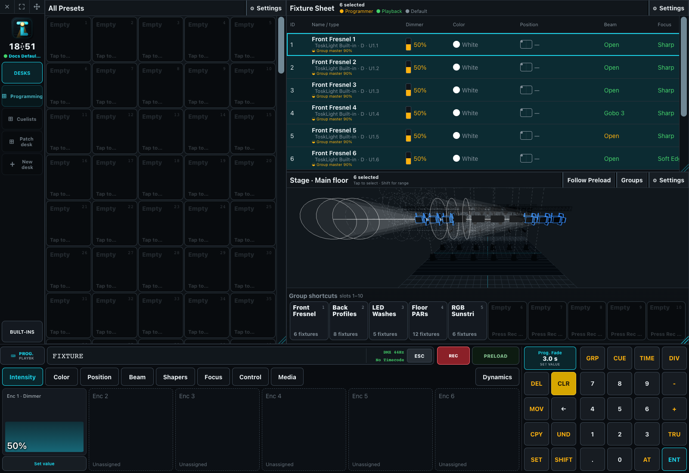

# Quick Start

ToskLight is organized around a desk configuration, a portable show file, one programmer per operator, and playbacks that turn stored programming into live output.

## Set up the desk

- Install and start ToskLight, then open **Desk Setup** from the Show menu.
- In **Screens & playback**, assign each connected screen and choose whether its playback page follows the main page or remains independent.
- In **Inputs**, enable only the MIDI, RTP-MIDI, OSC, and software-keypad controls used on this desk.
- In **Outputs**, set the engine frame rate and bind address, then create and verify Art-Net or sACN universe routes in **DMX**.

Continue with [Installation and First Start](02-installation.md), [Application Layout and Window Manager](01-application-layout.md), and [Desk Setup](10-Desk-Setup/index.md).

## Create or patch the show

- Open the Show menu and choose **New Show**, **Load Show**, or import an MVR as a new show.
- In **Fixture library**, import GDTF profiles or create a local fixture and its DMX modes.
- Open **Patch**, choose a fixture mode, and enter fixture IDs and DMX addresses. Add multi-patch instances only when one logical fixture drives more than one physical address.
- Open **Stage**, switch to **Setup positions**, and place fixtures and scenery in the 2D or 3D plan.
- Export an MVR after checking unresolved fixtures, retained GDTF sources, addressing, and scenery.

Continue with [Show File Setup](20-Show-Setup/index.md), [Shows, Revisions, and MVR](20-Show-Setup/02-shows-revisions-and-mvr.md), and [Fixture Library](20-Show-Setup/03-fixture-library.md).

## Program and run the show

- Select fixtures from Stage, Fixtures, Groups, or the command line; set intensity and attributes in the programmer.
- Record reusable Groups and Presets, then record Cues into a Cuelist.
- Assign the Cuelist or a Group to playback controls and configure its fader and button actions.
- Clear the programmer and run the Cues with GO. Check tracking, fade/delay, HTP/LTP ownership, output, and release behavior.
- Use Preload when changes or playback actions must be prepared without immediately changing the live scene.

Continue with [The Programmer](30-Programmer/index.md), [Programming Cues](30-Programmer/03-programming-cues.md), and [Running a Show](40-Running-a-Show/index.md).

## Before doors

- Save a named revision, then load the latest autosave again to prove recovery.
- Check the active user, selected show, output routes, universe values, and playback page.
- Run every Cuelist in order, including GO minus, pause, release, follow/timecode triggers, and Preload where used.
- Keep the generated PDF manual with the release or open **Help** from the Show menu during operation.
