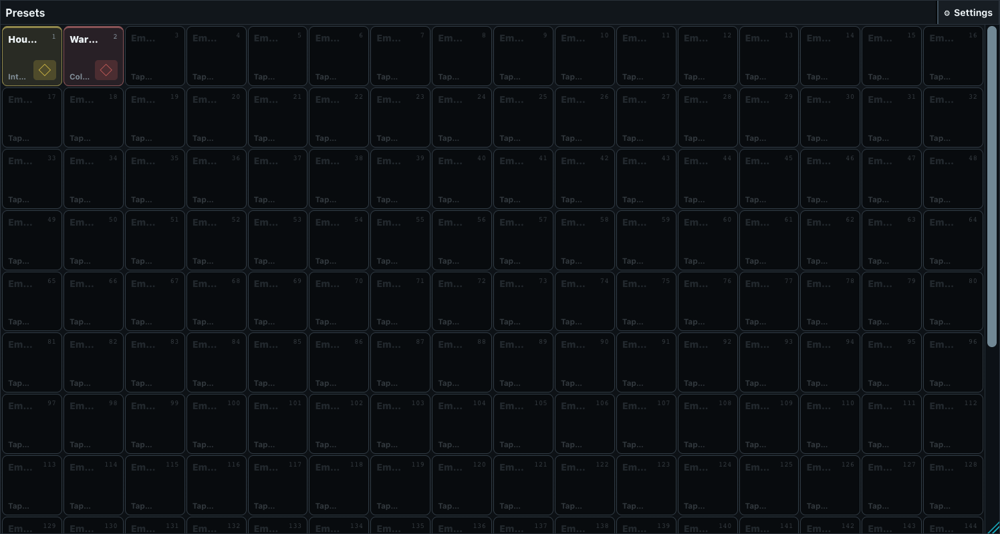
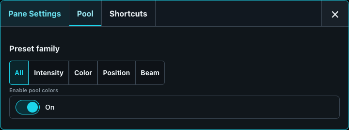
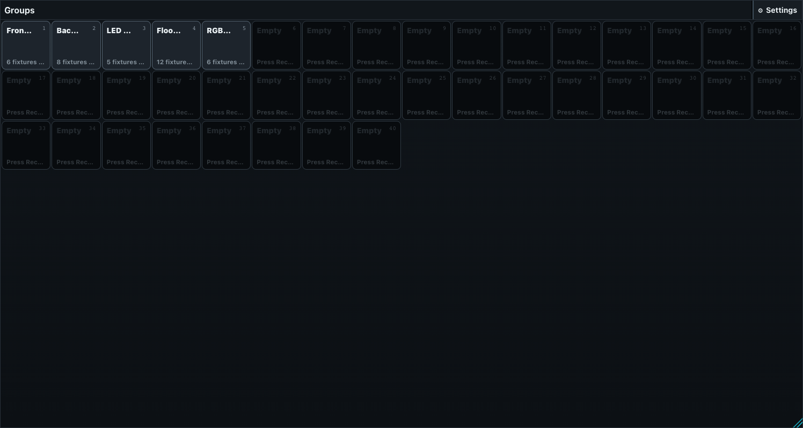
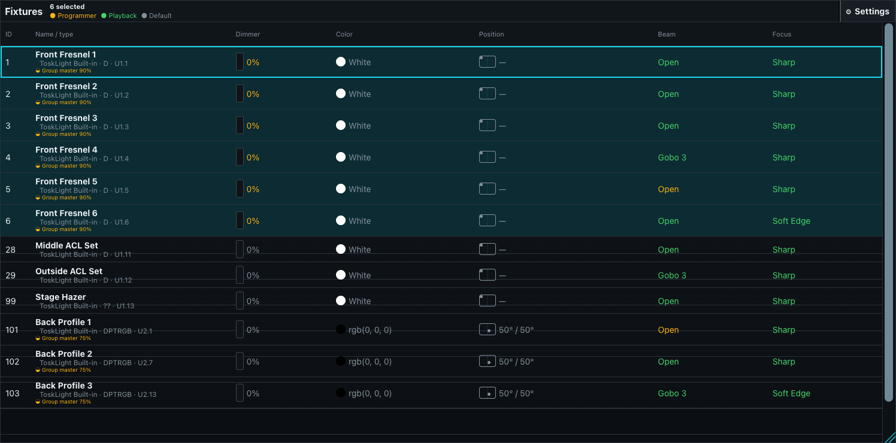
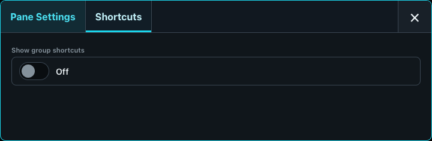
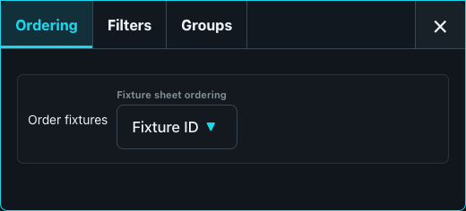
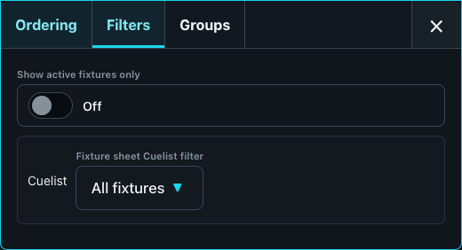
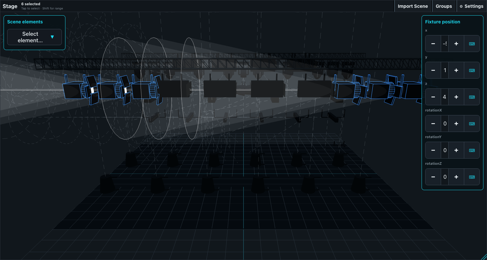
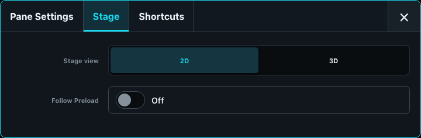
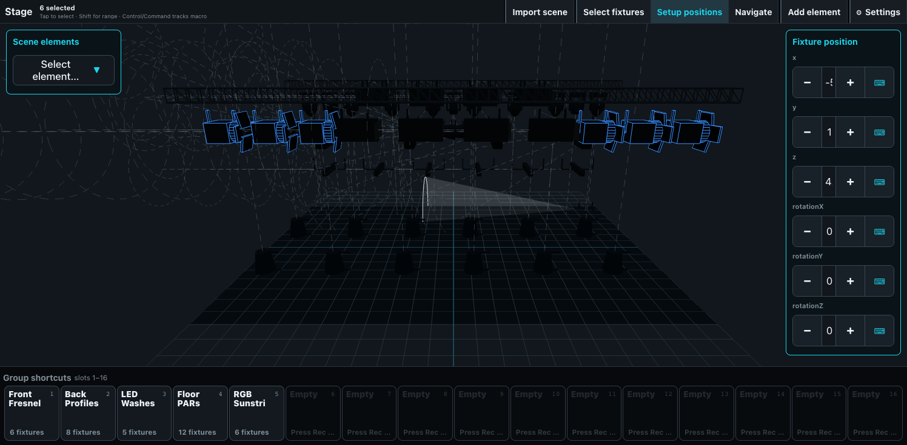

# Programming and Visualization Panes

## Preset pool

The Preset pool recalls reusable attribute values into the programmer. A preset can contain Intensity, Color, Position, or Beam values for one or more fixtures; it does not execute a Cue by itself. Tap a populated tile to apply it to the current fixture selection. With Record armed, an empty tile stores a new preset and a populated tile offers overwrite or merge.

Each tile shows its number, title, family, icon or artwork, and how many fixture-value entries it contains. The pool provides at least 200 numbered positions and grows to include the highest stored preset number. Filtering to one family disables tiles from the other families instead of deleting or renumbering them.

**Pane configuration:**

- **Preset family** selects All, Intensity, Color, Position, or Beam for this pane only. Two Preset panes can therefore show different families.
- **Enable pool colors** enables the family and custom-button color treatment.
- **Show group shortcuts** adds the Group strip below the pool so fixtures can be selected before a preset is recalled or recorded.

The full Presets window additionally exposes family buttons in its header. With Set armed, tapping a preset opens its local button presentation settings: title, icon, and button color. Those presentation choices belong to the operator interface and do not change the stored preset values.

## Group pool

The Group pool stores ordered fixture selections. Order matters for operations such as value spreading, and an intentionally stored empty Group remains different from an unused pool position. Tap a populated Group to select its current ordered members. Record plus an empty tile stores the current selection; recording over an existing Group offers overwrite or merge.

A populated tile shows its number, name, member count, and status information such as missing members, portable stored attributes, unsupported values, or whether it is derived or frozen. A selected Group is highlighted. Hold a populated tile to open its operational controls: adjust its Group master, select the live or frozen membership, refresh a frozen snapshot, detach a derived Group, replace membership, or undo the latest membership/programming change.

The Group master limits the intensity of members when that Group is assigned to a playback fader. It does not rewrite their programmer or Cue values. Missing fixture IDs are reported and skipped; they do not turn the Group into an empty Group.

**Pane configuration:** the Group pool has only the common size and removal settings. Its membership and Group-master controls are content operations, not pane-layout settings.

## Fixture sheet

The Fixture sheet is the detailed live inspection and selection table. It refreshes resolved output values continuously and, while Preload is active, adds the pending Preload values for comparison. Activating a row selects that fixture or logical head. A compact pane shows the first 12 rows after its active ordering and filters have been applied.

Simple fixtures use one row. Multi-head fixtures can expose a `.0` master row for shared parameters and `.1`, `.2`, and following logical-head rows for the individual heads.

During PREV/NEXT stepping, every row in the remembered base selection remains visibly selected with a subdued patterned treatment, while the actual current fixture or head uses the prominent selected treatment and a stronger left marker. This distinction does not rely on color alone and remains visible whether HIGH is off or on. PREV and NEXT move the prominent marker without hiding the base; ALL restores ordinary complete-selection styling, and an external selection replaces both indications. Multi-head state appears on the actual head rows. Collapse the heads when more space is needed; the parent row then retains a contained-base or contained-step indication so the active state is not hidden.

### Fixture sheet columns

| Column | What it shows |
| --- | --- |
| **ID** | The fixture number. Multi-head targets add `.0` for the master and `.1` onward for logical heads. |
| **Name / type** | Operator name, manufacturer, mode, and patch address in `Uuniverse.address` form. A Group-master badge appears when a playback-fader Group is limiting this fixture. |
| **Dimmer** | A level meter and resolved intensity percentage. During Preload, an arrow shows the pending target percentage. |
| **Color** | An RGB swatch and label. Every swatch has the same thin light-grey boundary so black, dark, bright, absent, and mixed colors remain distinct from the table without changing the resolved fill. During Preload, a second swatch identifies the pending color. Fixtures without color parameters show the neutral fallback. |
| **Position** | A position glyph and pan/tilt values. Fixtures without position parameters show a dash. During Preload, the pending pan/tilt values appear below. |
| **Beam** | Reserved beam-summary column. Its current compact summary is not yet an authoritative live engine value. |
| **Focus** | Reserved focus-summary column. Its current compact summary is not yet an authoritative live engine value. |

The source colors currently distinguish resolved programmer data from defaults for Dimmer, Color, and Position. Do not use this table alone as proof of complete cross-source ownership; detailed playback/programmer arbitration is documented separately.

**Pane configuration:** **Show group shortcuts** adds the Group strip. The common size and removal controls also apply. Ordering and filters are available only in the full Fixture Sheet window: order by Fixture ID or put active programmer fixtures first; show only active fixtures; filter membership to one Cuelist; and enable the Group strip.

## Stage

The Stage is the spatial selection and visualization surface. In 2D it shows fixture symbols, position, color, intensity, and direction. In 3D it renders patched fixtures, multi-patch physical instances, beams, and imported or built-in scenery. Tap or marquee fixtures to select them; Shift extends a range and Control/Command toggles fixtures. **Follow Preload** changes the Stage from live output to the pending Preload visualization.

**Pane configuration:**

- **Stage view** selects 2D or 3D for this pane.
- **Follow Preload** makes this pane a dedicated preview surface while another Stage pane can remain live.
- **Show group shortcuts** adds the Group strip.
- The common size and removal controls apply per pane.

### Stage setup is a full-window workflow

Only the full Stage window exposes **Select fixtures**, **Setup positions**, and **Navigate**. A Stage pane reflects the global mode and can therefore visibly enter setup mode, but it does not contain the controls that enter that mode.

In 2D **Setup positions**, drag fixtures to their show positions. In 3D setup, selected fixtures expose X, Y, Z and three rotation controls. Physical patch and multi-patch positions provide the starting point when no separate Stage transform exists. **Import scene** accepts supported scene assets; **Add element** opens the element chooser and then inserts a built-in truss, platform, curtain, or other scenery element. Selected elements can be translated, rotated, scaled, and removed.

The full Stage settings also control the 2D/3D view, Group shortcuts, selection visibility, and environment brightness. Element choice belongs to the **Add element** action, not Stage Settings. These are full-window controls, not extra pane-settings tabs.

## Channels

The Channels pane is a direct intensity-programming bank. It assigns one fader to each fixture in patch order, 20 channels per page in two rows. Each fader shows its channel number, fixture name, and resolved percentage. Moving it writes an intensity value into the programmer; tapping its card selects the fixture. Empty positions are disabled.

The full Channels window has previous/next controls and a page picker with at least eight channel pages. The compact pane hides that header, so it remains on channels 1-20 and cannot change pages from inside the pane. Use the full window when access beyond the first bank is required.

**Pane configuration:** only the common size and removal controls.

## Dynamics

> **Dynamics is a future feature.**
