# Programming and Visualization Panes

## Preset pool

The Preset pool recalls reusable attribute values into the programmer. Intensity, Color, Position, and Beam presets contain only attributes from that family. A Mixed preset can contain any combination of attributes. A preset does not execute a Cue by itself. Tap a populated tile to apply it to the current fixture selection. With Record armed, an empty tile stores a new preset and a populated tile offers overwrite or merge.

Each tile shows its number, title, family, icon or artwork, and how many fixture-value entries it contains. The pool provides at least 200 numbered positions and grows to include the highest stored preset number. Filtering to one family disables tiles from the other families instead of deleting or renumbering them.

**Pane configuration:**

- **Preset family** selects Mixed, Intensity, Color, Position, or Beam for this pane only. Mixed is a family for presets containing any combination of attributes; it is not an aggregate list of the other families. Two Preset panes can therefore show different families.
- **Type colors / Individual colors** chooses the color source for this pane. Type mode uses the configured Preset-family default. Individual mode shows only an explicit button color and leaves uncolored tiles grey.
- **Show group shortcuts** adds the Group strip below the pool so fixtures can be selected before a preset is recalled or recorded.

The full Presets window additionally exposes family buttons and pool-color settings in its header. With Set armed, tapping a preset opens its local button presentation settings: title, icon, and button color. Those presentation choices are stored in desk data, scoped to the active show identity, and do not change the stored preset values.

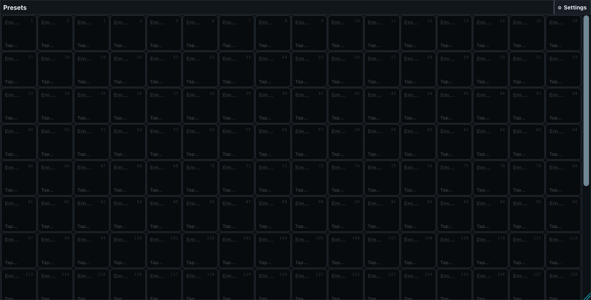

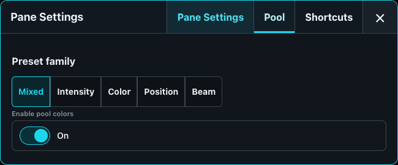

## Group pool

The Group pool stores ordered fixture selections. Order matters for operations such as value spreading, and an intentionally stored empty Group remains different from an unused pool position. Tap a populated Group to select its current ordered members and place that Group reference on the command line, ready for an operation such as **DIV**. Record plus an empty tile stores the current selection; recording over an existing Group offers overwrite or merge.

A populated tile shows its number, name, member count, and status information such as missing members, portable stored attributes, unsupported values, or whether it is derived or frozen. A selected Group is highlighted. Hold a populated tile to open its operational controls: adjust its Group master, select the live or frozen membership, refresh a frozen snapshot, detach a derived Group, replace membership, or undo the latest membership/programming change.

The Group master limits the intensity of members when that Group is assigned to a playback fader. It does not rewrite their programmer or Cue values. Missing fixture IDs are reported and skipped; they do not turn the Group into an empty Group.

**Pane configuration:** **Type colors / Individual colors** chooses the shared Group default or explicit item colors for this pane. Its membership and Group-master controls are content operations, not pane-layout settings. The common size and removal settings also apply.

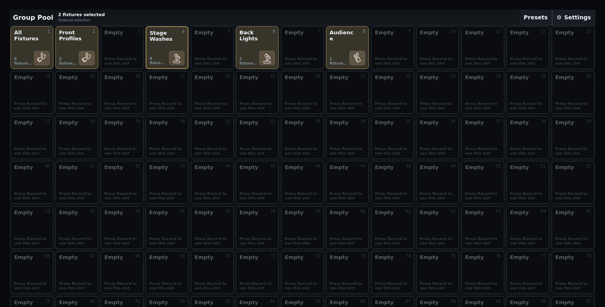

## Fixture sheet

The Fixture sheet is the detailed programming-state inspection and selection table. Each value cell shows the winning ordinary static base before Dynamic/FAT modulation. A running Dynamic keeps its icon and pool number beside the affected member but does not replace the base with its continuously sampled value. Open **DMX output** to inspect the changing resolved DMX result. While Preload is active, the Fixture sheet adds the pending base and Dynamic identity for comparison. Activating a row selects that fixture or logical head. A compact pane shows every eligible row in Fixture ID order and scrolls when the rows exceed the available pane height.

Venue fixtures, `visual_only` profiles, and complete fixture IDs beginning `0.` remain in Show Patch, Stage, selection, MVR, and the portable show but never appear as Fixture sheet rows. These independent scenery checks run before active-only, Cuelist, ordering, and head filters. An authoritative selection containing only hidden scenery therefore selects no unrelated Fixture sheet row.

Simple fixtures use one row. Multi-head fixtures can expose a `.0` master row for shared parameters and `.1`, `.2`, and following logical-head rows for the individual heads.

During PREV/NEXT stepping, every row in the remembered base selection remains visibly selected with a subdued patterned treatment, while the actual current fixture or head uses the prominent selected treatment and a stronger left marker. This distinction does not rely on color alone and remains visible whether HIGH is off or on. PREV and NEXT move the prominent marker without hiding the base; ALL restores ordinary complete-selection styling, and an external selection replaces both indications. Multi-head state appears on the actual subhead rows. When subheads are hidden, the visible master row retains a contained-base or contained-step indication so the active state is not hidden.

### Fixture sheet columns

| Column | What it shows |
| --- | --- |
| **ID** | The fixture number. Multi-head targets add `.0` for the master and `.1` onward for logical heads. |
| **Icon** | The fixture profile's stage icon. This column normally appears between ID and Name. |
| **Name / type** | Operator name with optional manufacturer/mode. An assigned Group-master badge shows its effective fader/Flash state and explicitly reports when live Highlight output bypasses it. |
| **Patch** | The fixture's universe and address, or **Unpatched**. This dedicated column is off by default. |
| **Intensity** | The ordinary base level as a meter and percentage. During Preload, an arrow shows the pending base percentage. |
| **Color** | An RGB swatch and label. Every swatch has the same thin light-grey boundary so black, dark, bright, absent, and mixed colors remain distinct from the table without changing the resolved fill. During Preload, a second swatch identifies the pending color. Fixtures without color parameters show the neutral fallback. |
| **Position** | A position glyph and pan/tilt values. Fixtures without position parameters show a dash. During Preload, the pending pan/tilt values appear below. |
| **Beam** | Authoritative semantic Beam bases such as an open state or indexed gobo. |
| **Shapers** | Authoritative framing/shaper member bases. |
| **Focus** | Authoritative focus, edge, frost, or zoom member bases. |
| **Control** | Authoritative semantic fixture-control bases without exposing raw DMX. |
| **Media** | Distinct Media Folder/File and, where supported, Mask Folder/File base pairs. |

The **Columns** settings independently control ID, Icon, Name, Patch address, Intensity, Color, Position, Beam, Shapers, Focus, Control, and Media. At least one column remains visible. Existing saved **Dimmer** visibility migrates to **Intensity**; newly available group columns do not turn themselves on in an existing layout. Source styling distinguishes current Programmer, Playback, and profile-default bases.

A column only reports attributes the lantern actually carries. A fixture without colour or without Position shows **—** in that column with no colour swatch and no position crosshair, so a frost-only or dimmer-only lantern is never given a preview it cannot honour. Where the lantern does carry the group and nothing drives it, the column shows the profile home value: physical white for colour and centre for absolute Pan and Tilt.

**Pane configuration:** **Fixture Sheet → Compact mode** has exactly **Off**, **Icon only**, and **Text only**. Off keeps the detailed 43 px presentation. Icon only uses deterministic 32 px rows, retains graphical base/Preload summaries, and removes ordinary value text. Text only uses the same 32 px rows, retains concise semantic base/Preload text, and removes decorative value graphics. Both compact modes keep Dynamic identities, source ownership, Group-master/Highlight status, fixture type, selection, and step markers. Configured columns are never dropped at a breakpoint; a small pane scrolls horizontally when the selected set still cannot fit. Each pane, the full built-in, and each fixed external Fixture Sheet persist their own desk-local mode, defaulting to Off without changing portable show data.

**Show active fixtures only** limits that pane to fixtures carrying Programmer values; this is useful beside a Cuelist Pool while recording looks. **Show group shortcuts** adds the Group strip. The common size and removal controls also apply. In the full Fixture Sheet window, open **Fixture Sheet** settings and use **View** for Compact mode, fixture heads, ordering, and filters; **Columns** for visible data and optional Name details; and **Groups** for the Group strip. **Included heads** defaults to **All**. Choose **No sub heads** to show only master rows with the fixture's bare ID, or **No master heads** to show only subhead rows without indentation. There is no per-row expand or collapse button. These full-sheet choices persist with the desk layout. Ordering can use Fixture ID or put active programmer fixtures first; filters can show only active fixtures or limit membership to one Cuelist.

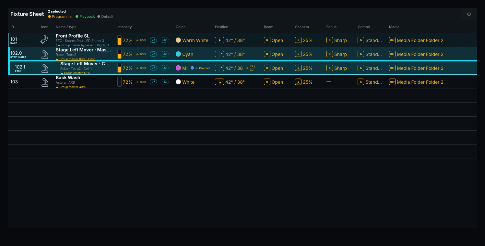

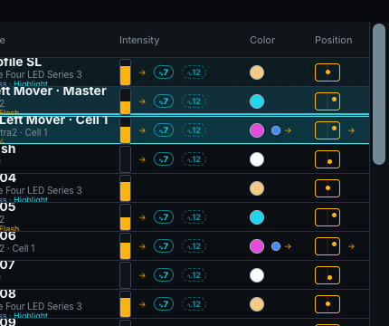

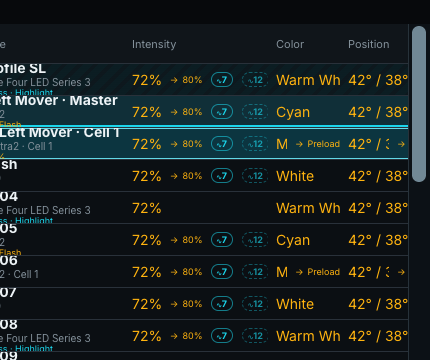

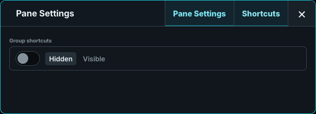

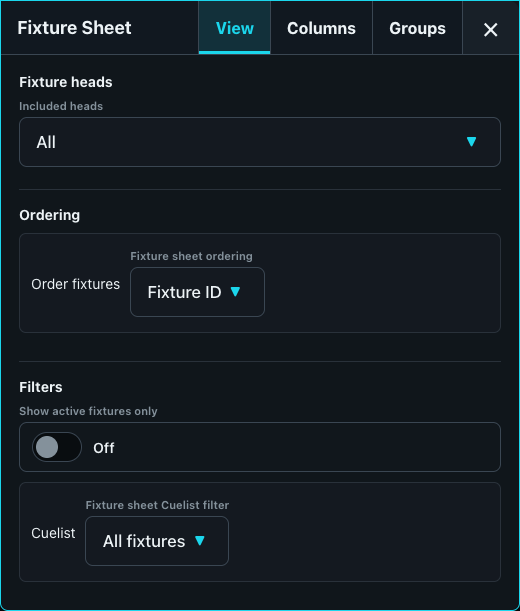

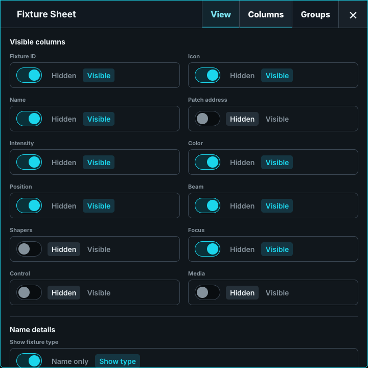

## Stage

The Stage is the spatial selection and visualization surface. In 2D it shows fixture symbols, position, color, intensity, and direction. In 3D it renders patched fixtures, multi-patch physical instances, beams, and visual-only Venue fixtures. Tap or marquee fixtures to select them; Shift extends a range and Control/Command toggles fixtures. **Follow Preload** changes the Stage from live output to the pending Preload visualization.

**Pane configuration:**

- **Stage view** selects 2D or 3D for this pane.
- **Follow Preload** makes this pane a dedicated preview surface while another Stage pane can remain live.
- **Show group shortcuts** adds the Group strip.
- The common size and removal controls apply per pane.

### Which renderer draws the Stage

On the desktop application the Stage is drawn by the ToskLight renderer, in a separate process,
into the pane where the Stage sits. Every 3D view is drawn there, and a 2D view is too while its
layout is **Automatic** — an Automatic layout is the projection of the 3D positions, so the
renderer's own plan view of the same rig is the same picture. A **Manual** 2D layout is where an
operator put each fixture by hand, which no projection reproduces, so it stays with the desk's own
drawing. It runs beside the desk rather than inside it, so a graphics
driver that takes the renderer down takes only the picture with it — the Programmer, playback and
DMX output are untouched, and the Stage returns on its own.

Where that is not possible the desk draws the same Stage itself and nothing about the pane changes
for the operator. That is what happens in a browser, on an installation whose renderer is missing,
and wherever the two processes have no way to move a picture between them. It is also what happens
after a renderer stops: the pane goes back to the desk's own drawing rather than holding a still
picture of a rig that has since moved.

Drag over the pane to orbit and scroll to zoom, whichever renderer is drawing it. Where the
ToskLight renderer is drawing, the middle button also walks the camera across its own axes and the
secondary button slides the view without turning it.

**Follow Preload** draws the preload over the rig rather than instead of it. A fixture with nothing
preloaded goes on showing what it is doing now; one that is preloaded shows what it is about to do,
in every attribute the preload names — where it will point included. A preloaded **Dynamic** shows
its fixture's live state instead: a Dynamic is a running function rather than a value, and the Stage
does not reproduce one to guess at it.

### Stage is a selection and viewing surface

Only the full Stage window exposes **Select fixtures** and **Navigate**. A Stage pane reflects the global mode, but it does not contain the controls that switch it.

Positions are edited in **Show Patch**: physical patch and multi-patch placement provides every fixture's location and rotation, with **Preview Stage** for visual feedback while patching. Add a truss, platform, curtain, or other scenery object from the **Venue** manufacturer in **Show Patch**; these visual-only fixtures receive `0.x` fixture IDs and no DMX address.

The full Stage settings also control the 2D/3D view, Group shortcuts, selection visibility, 3D beam direction guides, the 3D floor grid, environment brightness, and **Render quality**. They identify whether the saved 2D layout is **Automatic** or **Manual** and show its current projection. On the writable primary desk, **Regenerate 2D layout** intentionally replaces the complete 2D layout from the saved 3D positions using **Top to Bottom**, **Bottom to Top**, **Front to Back**, **Back to Front**, **Left to Right**, or **Right to Left**. Ordinary 3D position changes keep an Automatic layout synchronized; once a 2D position is edited manually, later 3D edits preserve that manual placement until the operator explicitly regenerates it. Passive external screens and secondary desk surfaces can see the current provenance but cannot regenerate it.

A Stage pane stores its own viewing settings independently, so a Live pane and a **Follow Preload** pane can use different views and qualities. The 2D fixture layout itself remains portable show data shared by every Stage surface.

**Render quality** has four operational choices:

- **Lines only** draws each active directional source as a center line and a ground-footprint outline without a beam volume.
- **Lines + beams** adds the normal beam volume to those aiming lines and is the default for new and older layouts.
- **Beams** shows the normal beam volume without the active center line or footprint.
- **Improved beams** uses a feathered beam edge. Up to eight highest-contributing directional sources also illuminate opaque Stage surfaces, stop at their first opaque intersection, and cast bounded soft shadows; stable ownership prevents the light budget from rapidly changing. Other active sources keep their feathered volume without allocating another Stage light or shadow map.

The footprint shows where the authored field angle intersects the ground reference. It becomes elliptical when a beam strikes at an angle and stays visible when **Floor grid** is off. A beam aimed parallel to or away from the ground has a center line but no invented footprint.

**Beam direction guides** is separate from Render quality. It shows a dotted off-state aim line for every emitter configured as directional, including fixed conventional fixtures; broad strobes and Sunstrip-style emitters have no guide. Turn **Floor grid** off when the neutral base plane and its reference lines should not be rendered.

Stage receives authoritative Live and Preload output from the engine. The desk sends current values at a bounded cadence and the view moves smoothly between samples without predicting past the newest value. A disconnected view freezes its last coherent state and reconnects without blocking Programmer, Playback, command handling, or physical output. The built-in view is intended for selection, aiming, and show preparation; realistic materials, haze, photometric rendering, volumetric occlusion, and richer optical or shadow work belong to the separate Viz application.

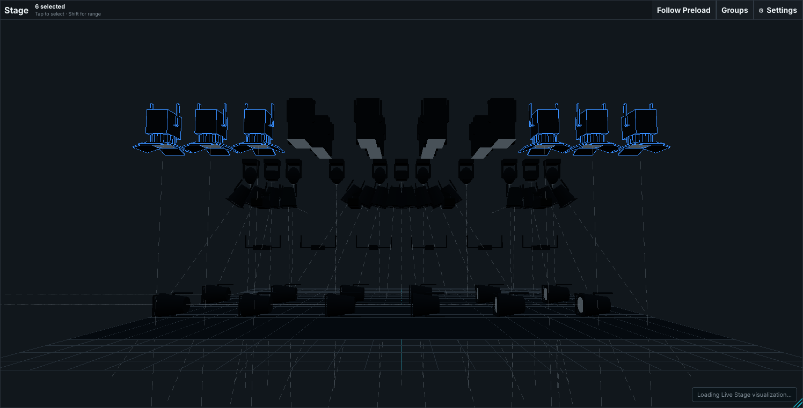

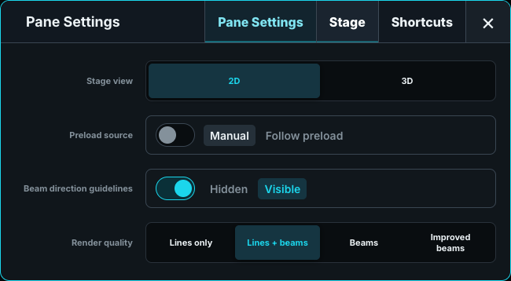

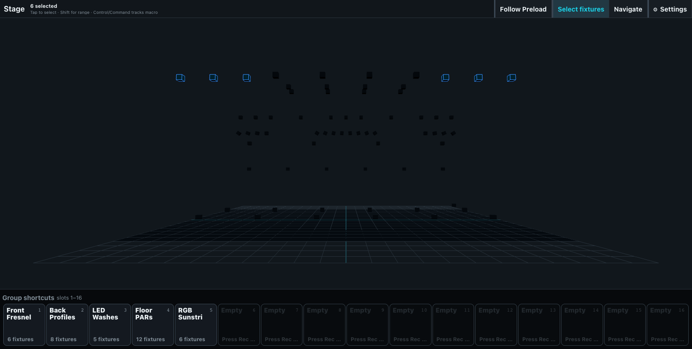

## Channels

The Channels pane is a direct programming bank ordered by Fixture ID. In the default **Intensity only** mode, it assigns one fader to each fixture. Faders fill each page from left to right across the first row and then continue on the second row. Each fader is labelled **Fixture _ID_**, followed by **Intensity**, and shows the resolved percentage. Moving it writes an intensity value into the programmer; tapping its card selects the fixture. Empty positions are disabled.

In **Pane Settings → Channels**, choose **Intensity only** or **All channels** for that pane. **All channels** keeps fixtures grouped in Fixture ID order and shows each fixture's attributes in profile-authored order. Each fader identifies the fixture and attribute it controls. The full Channels window offers the same display choice in **Channel Settings**, along with the number of faders per row.

The full Channels window has previous/next controls and a page picker with at least eight channel pages. The compact pane hides that header, so it remains on channels 1-20 and cannot change pages from inside the pane. Use the full window when access beyond the first bank is required.

**Pane configuration:** only the common size and removal controls.

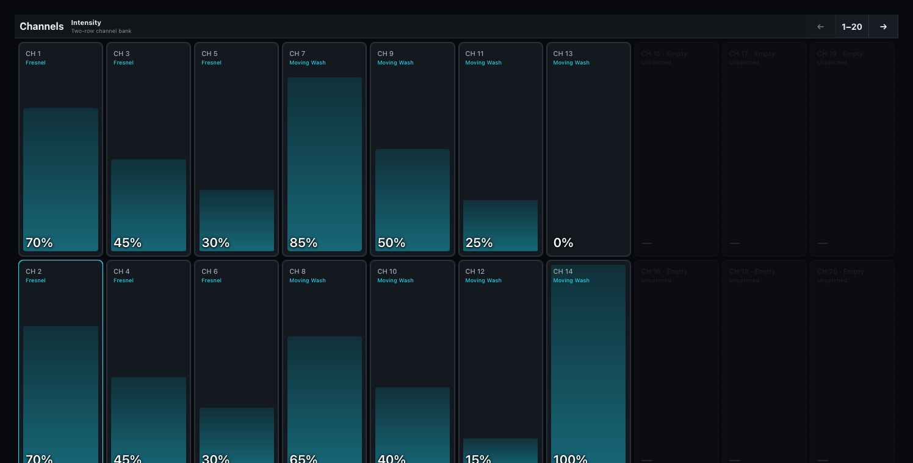

## Dynamics

The Dynamics pane is the numbered pool for animated values. Tap a populated tile to toggle that
Dynamic on the current ordered selection. A target-bound Dynamic always uses its stored target
scope; an explicit selection must match that scope exactly. Shift-click a populated tile to open
the production editor. With Set armed, touching a Dynamic and then a Playback assigns that Dynamic
to the Playback instead of starting it.

The pool uses the same square tile surface and sizing controls as the Preset and Group pools.
Empty positions remain available for future Dynamics without renumbering existing show data. A
populated tile reports its name and number; its running state comes from the authoritative runtime
rather than a browser-side animation. Press **Delete**, then a populated tile, to delete it.

The editor separates **Lanes**, **Phase**, and **Speed**. Lanes contain scalar curves for
fixture attributes. Click one lane to edit it, or Shift-click additional lanes for a shared edit.
The lane cog opens actions over that lane to change its attribute or delete it. The bottom composer switches between
Keyframes, Max/Min, and Middle/Amplitude while the normal Programmer encoder surface becomes the
Dynamics encoder surface; pressing an encoder-group tab advances its additional pages when present.
Phase controls ordered target projection, Offset/Span, Blocks, Repeats, Wings, and spatial
ordering. Choose **Uniform** to use one spread for every lane, or **Per lane** to select a lane and
give it its own spread. Switching to Per lane starts each lane with the current Uniform settings;
switching back to Uniform keeps the lane settings available for a later return. Speed uses either
fixed BPM or one authoritative Speed Group, with multiplier, run mode, activation, and boundary
controls. **One-shot** runs one complete effective cycle and then stops.
The editor contains no private fixture preview or browser-side evaluator: open a Stage pane and
choose Live or **Follow Preload** for authoritative visualization.

**Take Selection** stores the current target scope. One selected live Group remains a live Group
binding; any other selection becomes an exact frozen ordered target list. **Clear Selection**
returns the Dynamic to targetless operation. Both actions are disabled while any instance of that
Dynamic is running, so an active definition cannot silently retarget. These controls are available
in Dynamic Settings and in the Phase workspace.

**Pane configuration:** only the common size and removal controls.

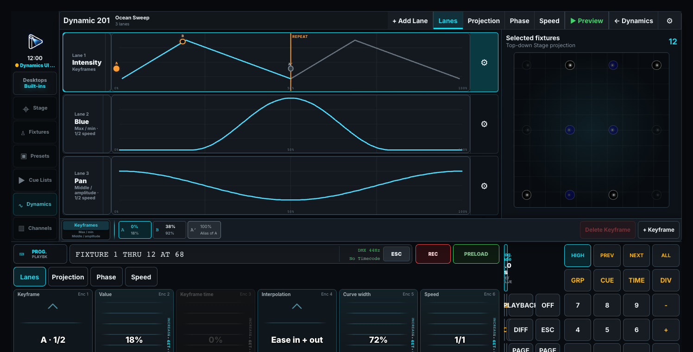
