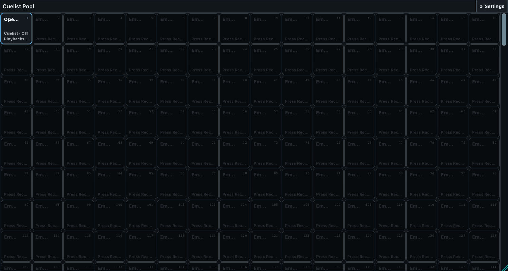
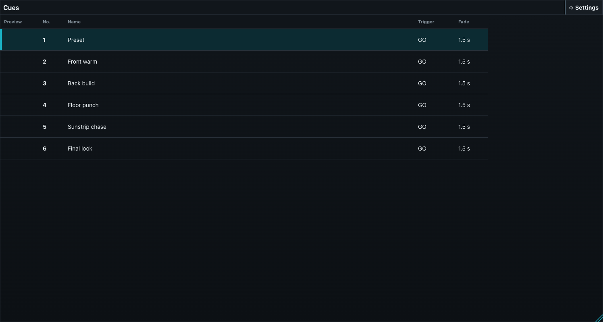
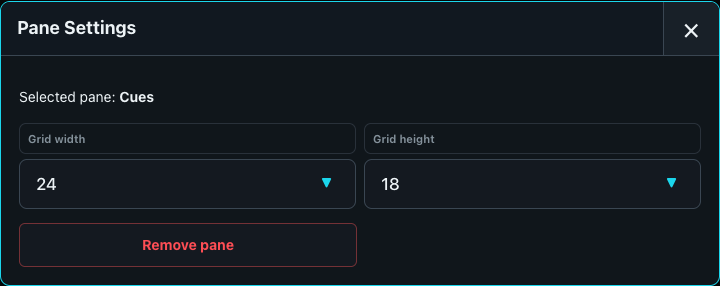
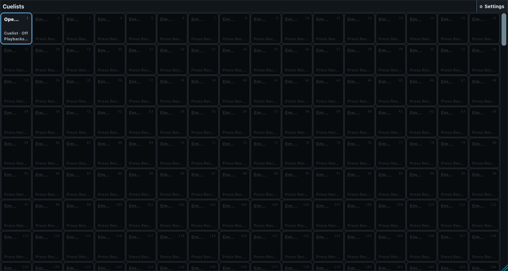
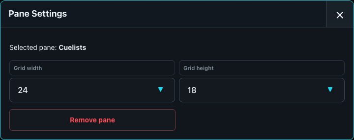
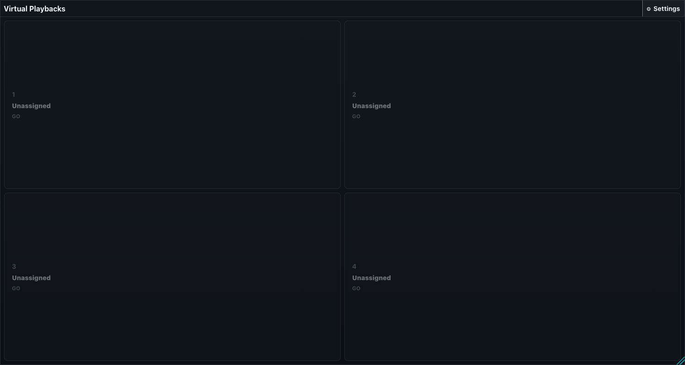
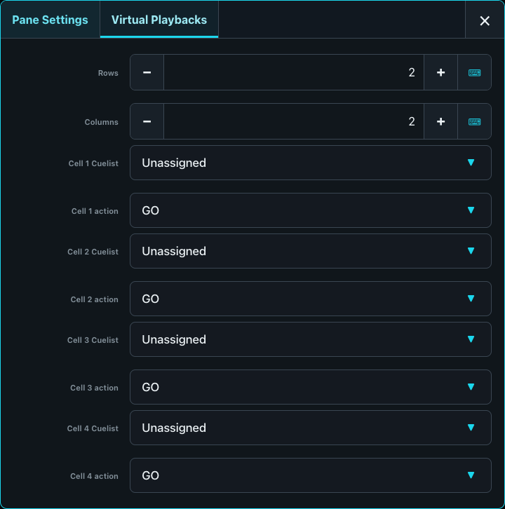

# Cue and Playback Panes

## Cuelist Pool

The Cuelist Pool is numbered storage for sequences and Chasers. A populated tile shows its Cuelist number and name, whether it is running, its master percentage, and any playback-page assignments. Tap a populated tile to open its Cues. Record plus a pool position creates or updates a Cuelist; Set workflows use the selected Cuelist as an assignment target.

The full window can search the 1,000-position pool by number or name. Holding a populated tile opens Cuelist configuration: Sequence or Chaser mode, priority, HTP/LTP intensity mode, wrap behavior, restart behavior, timing overrides, Cue renumbering, and Chaser speed, multiplier, and crossfade. These settings change the Cuelist itself and must not be confused with Pane Settings.

**Pane configuration:** only common size and removal controls. Search and Cuelist configuration belong to the full content window.

## Cues - Cuelist

This pane is a compact Cue overview for one Cuelist. Rows show the optional Stage preview, Cue number, Cue name, trigger type, and fade time. Running and next Cues receive status highlighting. Selecting a row changes the current row selection but does not execute it.

The compact pane omits the full-window header and the right-hand Cue editor. Use the full Cuelists window to change a Cue title, Fade, Delay, GO/FOLLOW/TIME trigger, trigger time, or to delete a Cue. The full window also provides navigation back to the Cuelist Pool and access to Cuelist configuration.

The compact pane starts with Cuelist 1 or the first available list and has no independent list selector. It is best used as a running overview for a desk whose Cuelist choice is already known.

**Pane configuration:** only common size and removal controls.

## Cuelists (tabs)

This pane currently opens the Cuelist Pool and then replaces it with the selected list's Cue table. Despite its legacy label, the current implementation does not display multiple tabs. In compact mode the full-window Back control is hidden, so returning to the Pool requires reopening or replacing the pane. Treat this as a current interface limitation rather than as a multi-tab workspace.

Use **Cuelist Pool** for a permanent pool surface and **Cues - Cuelist** for a permanent Cue overview. Use the full Cuelists built-in when the operator must move freely between pool, Cue editing, and Cuelist configuration.

**Pane configuration:** only common size and removal controls.

## Virtual Playbacks

Virtual Playbacks create a touch-button surface without consuming a physical playback fader position. Every cell points to a numbered playback-pool definition, which in turn targets a Cuelist or another supported playback function. The assignment is not tied to the currently visible playback page.

A cell displays its cell number, assigned playback name, and action. When that playback is active it also shows the current Cue and receives active styling. Unassigned cells are disabled.

**Pane configuration:**

- **Rows** and **Columns** independently accept 1-12, allowing 1 to 144 cells.
- **Cuelist** selects the numbered playback definition for each cell or leaves it Unassigned.
- **GO** starts the assigned Cue playback or advances it by one Cue on each press.
- **TOGGLE** switches the assigned playback on and off.
- Resizing the pane does not change its logical row/column count.

Virtual actions identify themselves as coming from the virtual surface. During Preload, **Preload virtual playback actions** in Desk Setup decides whether they execute immediately or are captured for Preload GO. This is independent from the switches for physical playback controls and programmer changes.

