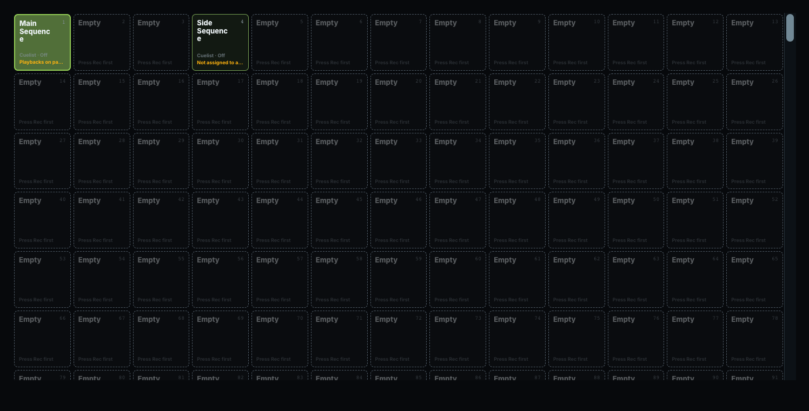
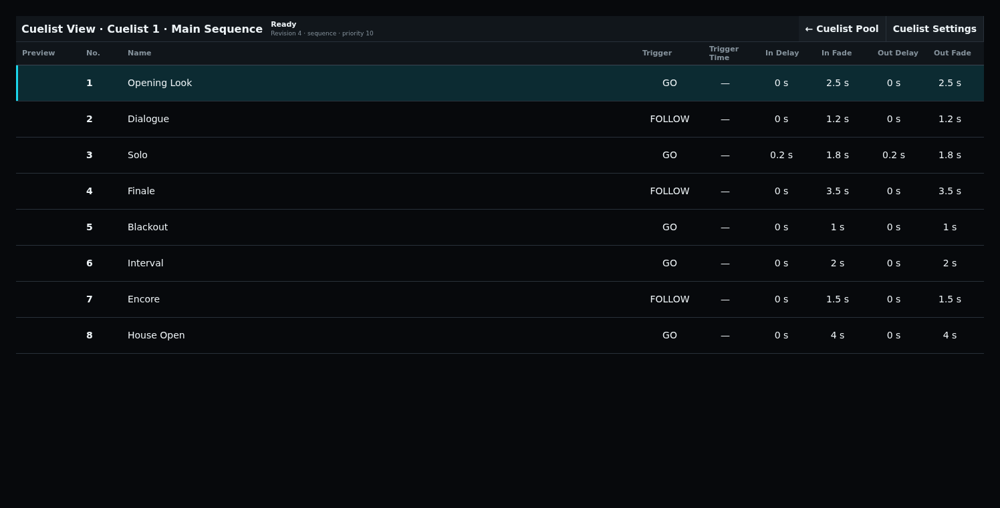
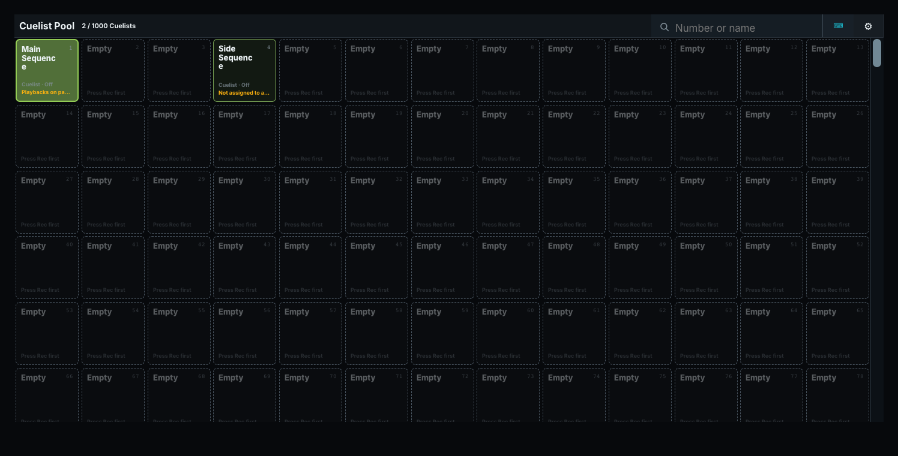
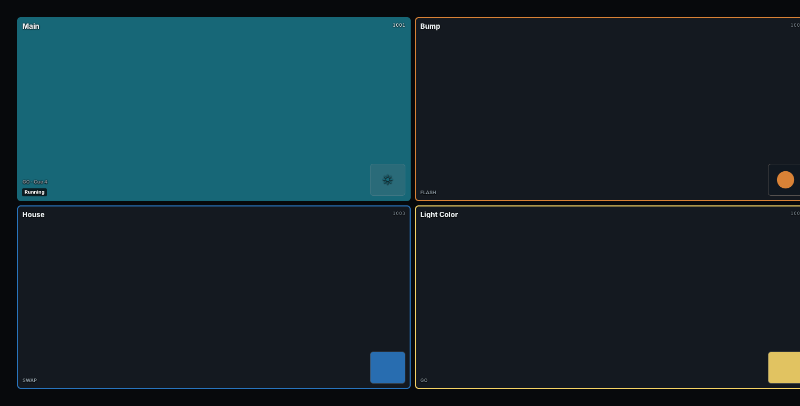
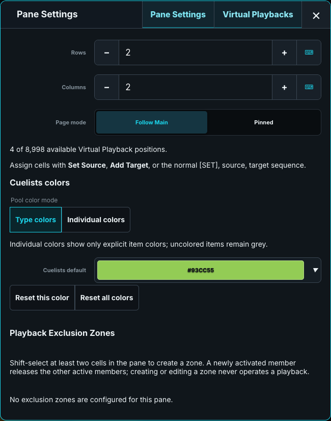

# Cue and Playback Panes

## Cuelist Pool

The Cuelist Pool is numbered storage for sequences and Chasers. A populated tile shows its Cuelist number and name, whether it is running, its master percentage, and any playback-page assignments. Tap a populated tile to open its Cues. Record plus a pool position creates or updates a Cuelist; Set workflows use the selected Cuelist as an assignment target. While Set is waiting for that source, every populated Cuelist tile receives the literal Set outline and the complete tile is the target; empty tiles remain ordinary and unoutlined.

The full window can search the 1,000-position pool by number or name using the shared [window search bar](../01-application-layout.md#search-bars). Holding a populated tile opens Cuelist configuration: Sequence or Chaser mode, priority, HTP/LTP intensity mode, wrap behavior, restart behavior, timing overrides, Cue renumbering, and Chaser speed, multiplier, and crossfade. **Chaser X-fade** is stored from `0%` to `100%` of the effective step: `0%` snaps, `50%` fades for half the interval, and `100%` fades for the complete interval. Changing the Speed Group BPM or multiplier changes the live fade duration without changing the stored percentage. These settings change the Cuelist itself and must not be confused with Pane Settings.

**Pane configuration:** **Type colors / Individual colors** chooses the configured lime Cuelist treatment or explicit item colors for this pane. Search and Cuelist configuration belong to the full content window. Common size and removal controls also apply.

## Cues - Cuelist

This pane shows the Cues of one Cuelist. By default every row shows these columns, in order: **Preview**, **No.**, **Name**, **Trigger**, **Trigger Time**, **In Delay**, **In Fade**, **Out Delay**, and **Out Fade**. All nine columns remain available without changing the pane settings. Running and next Cues receive status highlighting. Selecting a row changes the current row selection but does not execute it.

Stage previews are pictures, not live 3D views. Each one is drawn once — when the Cue is recorded, when it is edited, when a fixture moves on the Stage, or when a Group it uses changes — and is then stored in the show alongside the Cue. Opening a Cuelist therefore draws nothing: the desk shows the stored pictures. Because they travel inside the show file, a Cuelist opened on another desk arrives with its previews already drawn, and a desk without 3D rendering still shows them. A Cue recorded from a desk that cannot draw has no preview until a desk that can opens that Cuelist.

The compact editor at the right stays inline with the selected Cue. Its Stage preview uses the full sidebar width and carries a readable selected-Cue label over the image. The Cues pane settings can hide this sidebar when the Cue table needs the full pane width; the preference is stored with that pane. **Compact Cue rows** reduces the table-row height and hides only the Preview-column pictures; the selected Cue's full-width Stage preview remains in the sidebar. Under the preview, closely spaced frameless rows edit Title, Intensity **In Delay**, **In Fade**, **Out Delay**, **Out Fade**, GO/FOLLOW/TIME/LINK trigger, and trigger time or Link delay; text and numeric rows provide the desk keyboard or number pad at the right. LINK also shows **Link Cue**, whose choices display the destination number and name while storing its stable identity. Out timing controls decreasing or released Intensity independently, so an old look can overlap the entering look or leave an intentional black gap. Until explicitly edited, Out timing follows the effective In timing, including the Cue Fade master fallback. If all rows cannot fit below the preview, the sidebar does not scroll: it keeps the preview and replaces the form with the current attribute values and **Press SET, then press an attribute value to edit it**. Physical or software SET followed by an attribute value, Trigger, or Trigger time opens the corresponding keyboard, number pad, or choice modal. Selecting another row updates this same editor without executing either Cue, and the Cue table remains visible. Cue deletion is deliberately not a button in this editor; use the explicit Delete Cue command with a complete Cue address.

The timing cells use their background as a live progress display: empty means not started and filled means complete. **Trigger Time** starts at the authoritative beginning of the actual trigger interval: a TIME trigger begins when the preceding Cue receives GO, while FOLLOW and LINK begin after their source Cue finishes. **In Delay**, **In Fade**, **Out Delay**, and **Out Fade** each start when that phase actually starts and fill independently until that phase completes, including when incoming and outgoing work overlap. Pausing freezes every running fill; resuming continues it from the same point. A completed cell stays filled after the transition settles and while the operator changes rows or panes. It resets only when that Cue is triggered again as a new authoritative transition. These displays follow playback runtime rather than a browser-local timer, so reopening the view does not lose or restart progress.

Bare Copy or Move outlines every visible Cue row as a source; touching anywhere in one outlined row records its complete Cuelist-and-Cue address. The same rows become destinations after AT, including after navigating normally through the Cuelist Pool to another list. Bare Delete outlines each Cue row and touching anywhere inside the row executes the complete Delete Cue command. Set does not turn a Cue row into a target: it keeps ordinary row selection and, in the constrained-height editor, outlines only the exact editable value buttons with a literal SET badge. Cuelist navigation, Pane Settings, and table scrolling remain ordinary navigation while a target command is active.

The full window also provides navigation back to the Cuelist Pool and **Cuelist Settings**. Cuelist Settings opens as a modal over the view. Its title bar contains Save, Renumber Cues, and a two-line Mode menu showing the current Sequence or Chaser mode. The body groups numeric/intensity priority, wrap/restart behavior, and timing into three explained columns. Chasers additionally expose a typed Speed multiplier and a `0–100%` Chaser X-fade fader. Close leaves clean settings immediately; if settings are dirty, choose **Save changes**, **Discard changes**, or **Stay** explicitly. The pool's hold shortcut opens the same modal.

The compact pane starts fixed to Cuelist 1 or the first available list. In Pane Settings, **Displayed Cuelist** can keep the pane **Fixed** to any available Cuelist or **Follow selection**. Follow selection resolves the desk's explicitly selected playback and shows its Cuelist; selecting a Group playback or having no selected playback leaves the pane empty instead of switching to an unrelated list. While that Cuelist runs, the selected row and inline Cue editor follow its actual current Cue, including automatic Chaser steps. The fixed Cuelist choice and display mode are stored with that pane, so different Cues panes can remain on different lists while another follows the desk selection and active Cue.

**Pane configuration:** **Displayed Cuelist** selects Fixed or Follow selection, **Cuelist** chooses the fixed list, **Show Cue sidebar** controls the inline selected-Cue editor, and **Compact Cue rows** reduces table-row height without removing the selected-Cue preview. The common size and removal controls also apply. With the exact bare Delete command active, the complete Pane title receives a red DELETE target outline and removes that Pane after its normal confirmation; the Pane body, Settings control, resizing, and view navigation are never Delete targets.

## Cuelists (tabs)

This pane currently opens the Cuelist Pool and then replaces it with the selected list's Cue table. Despite its legacy label, the current implementation does not display multiple tabs. In compact mode the full-window Back control is hidden, so returning to the Pool requires reopening or replacing the pane. Treat this as a current interface limitation rather than as a multi-tab workspace.

Use **Cuelist Pool** for a permanent pool surface and **Cues - Cuelist** for a permanent Cue overview. Use the full Cuelists built-in when the operator must move freely between pool, Cue editing, and Cuelist configuration.

**Pane configuration:** only common size and removal controls.

## Running

The Running window collects one row for every independently stoppable runtime object. It shows running Cuelists, standalone Dynamics, Timecodes, and Macros by default. Several software, hardware, OSC, API, or playback controls that address the same shared runtime still produce one row.

A Cuelist row uses the Cuelist's own number and name and shows its current Cue number. It does not use a playback page or fader-assignment number. A Dynamic contained by that Cuelist is subordinate activity and does not receive another row; **Off** on the Cuelist row releases the containing Cuelist. A standalone Dynamic, running Timecode, or active Macro execution receives its own row, its own stable identity where defined, and the explicit **Cue —** value.

Every **Off** button targets exactly the object named by its row: release Cuelist, stop standalone Dynamic, stop Timecode, or cancel Macro execution. The button reports progress while that action is pending and cannot submit a duplicate action. Start, current-Cue, pause, resume, completion, release, cancellation, and stop changes reconcile from authoritative runtime state while the window remains open.

Use **All**, **Cuelists**, **Dynamics**, **Timecodes**, or **Macros** to restrict the list. An empty filtered list says which kind is not running instead of appearing broken.

**Pane configuration:** **Running kind** stores All, Cuelists, Dynamics, Timecodes, or Macros for this pane. Common size and removal controls also apply. The full built-in exposes the same filter in its window header.

## Macros

The Macro Pool stores portable, show-owned sequences of ordinary command-line commands. A normal tap runs the complete Macro immediately. Right-click, or press **SET** and then tap the Macro, to open its editor without running it. Copy, Move, Delete, pool numbering, naming, presentation, show export/import, and selective import follow the same show-object rules as the other pools.

The editor numbers every command line and validates the complete document through the desk's authoritative command grammar before Save or Run. Blank lines and comments are ignored. A command which needs another pool click, modal choice, hardware destination, or other interaction is invalid in a Macro. **Run line** executes only the selected complete line. After a successful compatible line, **Undo last run** remains available only while that exact execution is still the newest safe Undo entry for the same operator, show, and object revision.

A full run executes validated lines in source order with the initiating user's ordinary desk authority. It stops at the first runtime error; already accepted commands remain applied. **Cancel** is observed between lines. Another Macro or a manual command cannot interleave a partial command interaction. A Macro assigned to a physical or Virtual Playback starts on the Playback's press action and has no Cue, Pause, fader, or tracking state.

## Timecode

The Timecode Pool stores portable numbered timelines. Tap a Timecode to open its live editor. Transport provides **GO**, **Pause/Resume**, **Stop**, **Rewind**, and frame seek against the server-owned clock; reopening the window reconstructs the authoritative position. A duration-only timeline requires no audio. When a managed audio asset is linked, transport, seek, loop, and volume follow the same clock and the configured server audio output.

The editor timeline scrolls and zooms without changing live output. Touch or click the ruler to scrub the editor playhead. Use **Seek runtime to playhead** when the running Timecode should move to that exact frame. Add an audio-volume lane, one or more Speed Group lanes, or a lane for an existing Cuelist; the Cuelist lane creates clips from that Cuelist's real Cue identities. Clips, Speed Group keyframes, audio-volume keyframes, and markers show their target and trigger time directly on the lane. Drag an item horizontally for frame-accurate movement; it snaps to zero, the end, and nearby markers. The selection inspector edits BPM/phase, volume/fade/curve, marker name/color, and clip Cue range plus State/Cue Start and Release/Hold behavior. Touch-visible **Copy** and **Delete** actions apply to the exact selection. **Undo** and **Redo** cover the current unsaved editor history.

**Add marker at playhead** creates a non-executing marker. **Import marker CSV** accepts `position,name,color`, where position is a frame number or `HH:MM:SS:FF`; name and color are optional. Choose **Append** or **Replace** explicitly before applying the CSV. Importing WAV or MP3 stores managed portable audio, normalizes MP3 to WAV, sets the timeline duration, and displays decoded waveform peaks. The original file path is not needed after import.

The editor shows duration, transport offset, auto-start, markers, and ordered lanes. Markers label and snap positions but do not execute output. Cuelist clips, Speed Group keyframes, and audio-volume lanes reconstruct deterministically at any frame, so continuous play, seek, and loop reach the same state. Missing referenced show objects remain visible errors and are skipped rather than silently retargeted.

Choose the single desk Timecode source, frame rate, external-loss behavior, audio device, and latency trim in Desk Setup. Several software, physical, Virtual Playback, OSC, WebSocket, or HTTP controls addressing the same Timecode operate one shared runtime, not independent copies.

For Art-Net ArtTimeCode, configure **ArtTimeCode UDP bind** in Desk Setup and select the exact normalized external source identity reported by that input. ArtTimeCode is a Timecode source; CITP/MSEX remains the separate media-server preview and library protocol.

## Virtual Playbacks

Virtual Playbacks create a touch-button surface without consuming a physical playback
fader position. Every page owns a stable bank of 300 show-wide Virtual Playback
numbers: page 1 starts at 1001, page 2 at 1301, and page 3 at 1601. Cell position `n`
on page `p` addresses `1000 + 300 × (p - 1) + n`. Every desk that displays the same
number operates the same Playback.

A cell displays its cell number, assigned playback name, and action. When that playback is active it also shows the current Cue and receives active styling. An unassigned cell is inert during normal operation but remains available for Playback Configuration.

**Pane configuration:**

- **Rows** and **Columns** are positive integers whose product may not exceed 300. A
  20×15 surface displays one complete Virtual Playback page.
- **Page mode** is **Follow Main** or **Pinned**. Follow Main uses the control desk's current main page. Pinned stores one fixed page from 1 through 127.
- Resizing the pane does not change its logical row/column count.

Configure a cell exactly like a regular Playback: right-click the Virtual Playback, or press `[SET]` and then press the cell. Both paths open the standard Playback Configuration modal for that one-button, faderless target. Virtual Playbacks additionally support an icon or image background.

Pane Settings keeps grid and page configuration in **Virtual Playbacks** and zone management in **Exclusion Zones**. Playback colors remain part of the assigned Playback rather than a separate pane-level color mode.

Virtual actions carry their stable playback number and validated page qualifier. During
Preload, **Preload virtual playback actions** in Desk Setup decides whether they
execute immediately or are captured for Preload GO. This is independent from the
switches for physical playback controls and programmer changes.

