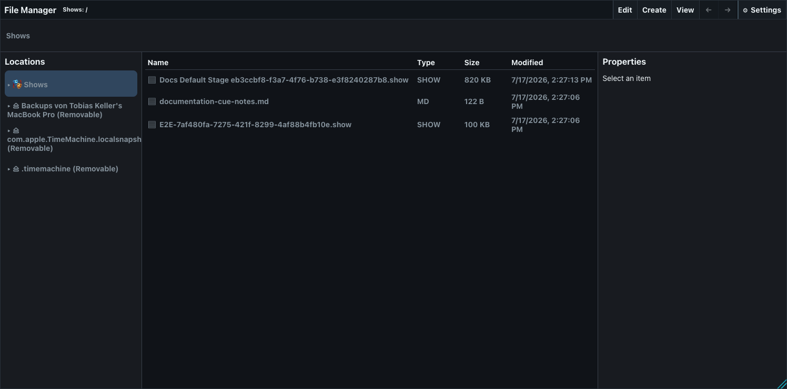
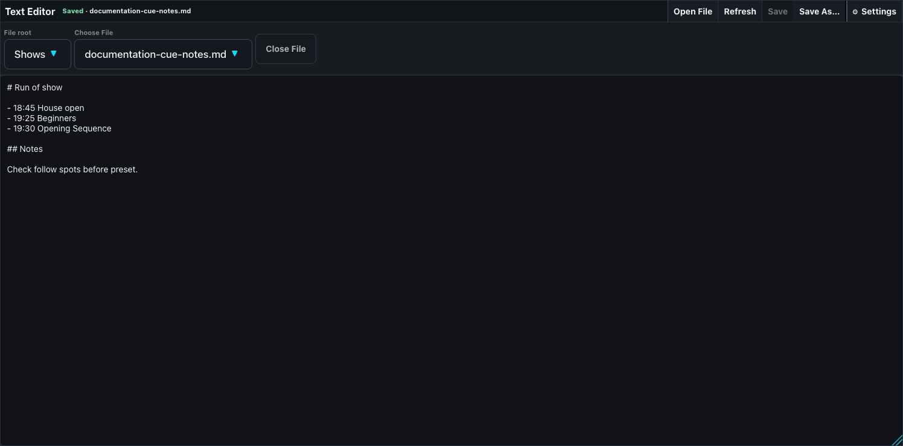
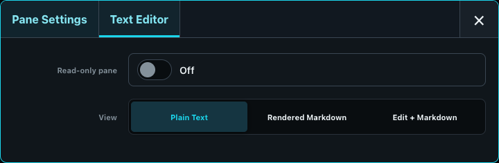
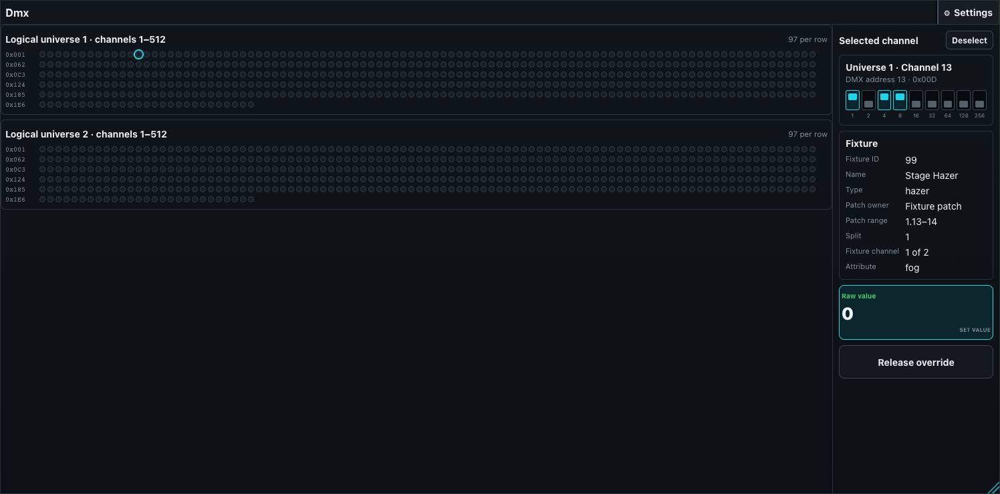
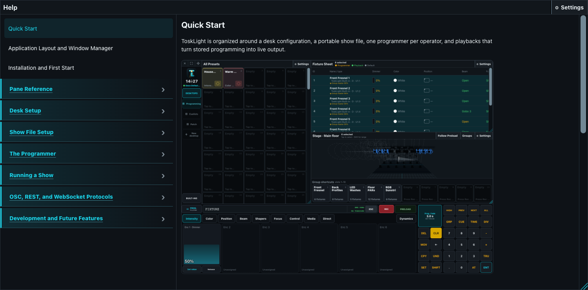

# Utility and Diagnostic Panes

## File Manager

The File Manager browses only roots explicitly exposed by the server; it cannot escape into arbitrary server paths. The Shows location is always available, installation-configured locations are supplied by the server, and connected removable drives appear automatically as temporary locations without changing Desk configuration. Open it from **Desk Setup > Shows & recovery > Open File Manager** or add it to a Desktop. If a drive disconnects, its location disappears and any affected operation reports a visible error instead of continuing against a stale path.

The normal workspace has a folder tree, a folders-first file list or thumbnail grid, and selection properties. Its standard window header shows **File Manager** at the left, the current task above the current root-relative path, and the action controls at the right. A picker uses the same controls in the standard modal title bar and adds the regular Close button; a File Manager pane uses window chrome without a Close button. **Edit** contains Rename, Copy, Move, and Delete. **New** contains New File and New Folder. **View** switches between List and Grid and toggles hidden files and the Properties sidebar. Back and Forward sit directly beside View. Control/Command enables multi-selection.

List view shows Name, Type, Size, and Modified time. The properties area previews common images and streams MP3 and WAV audio, including seeking, without loading the whole recording first. Supported text files can be opened in an embedded editor with Saved/Unsaved and read-only status. Delete uses the platform Trash where the selected filesystem supports it; otherwise the confirmation explicitly warns that deletion is permanent.

The same root-confined browser is used whenever a ToskLight form asks for a file or folder. An installation can enable **Open system file picker** as a secondary server-configured fallback. It is disabled by default; enabling it does not remove the ToskLight picker or the calling form's file-type and selection constraints.

Hidden-file visibility, Properties-sidebar visibility, List or Grid view, root, path, navigation history, and the embedded editor are File Manager content controls.

## Text Editor

The Text Editor keeps one UTF-8 `.txt`, `.md`, `.csv`, or `.log` file of up to 4 MiB available as part of a Desktop layout. **Open File**, **Refresh**, **Save**, and **Save As** are in the window header. Open File uses the root-confined ToskLight File Manager picker. The header also shows the selected path and Saved, Unsaved, read-only, or No file status. Leaving a dirty file asks before discarding changes, and closing the browser with unsaved work produces a warning.

The selected root, path, cursor, and scroll position are stored on this pane. Multiple Text Editor panes can therefore keep different files open and restore their useful view position. The editor is intentionally limited to exposed text files; it is not a general server filesystem or code-execution surface.

**Pane configuration:** choose read-only or read-write operation and Plain Text, Rendered Markdown, or a two-column Edit + Markdown view.

## DMX output

The DMX output pane is a live monitor and diagnostic override surface. Values view displays up to 512 slots per shown universe. Selecting a slot reveals its decimal and hexadecimal address, DIP-switch representation, patched fixture, fixture-channel position, attribute, current raw value, and a 0-255 override control. **Release override** returns that address to normal engine output.

With no slot selected, the information area summarizes output frame rate, packets, and send errors. A compact pane stays in Values view, limits the universe list to the first two universes, and uses the global DMX dot-size preference.

The full DMX built-in adds **Sources**, which lists and releases active raw overrides, and **DMX Settings**, which changes Small/Large dot size. Output-engine fields and editable logical-universe routes live under **Desk Setup > Outputs**, not in the DMX pane or Pane Settings.

**Pane configuration:** only common size and removal controls.

## Help

The Help pane renders the same numbered Markdown catalog used to build this manual. Folder navigation selects a topic, safe relative images are loaded from Help assets, and desk buttons, keyboard keys, tables, and links receive their documentation styling. When live Help is enabled, the catalog refreshes automatically.

The catalog remains in a left column and the selected topic remains in a right column, including when Help is embedded as a pane. External links are restricted to safe HTTPS targets and local images cannot traverse outside Help assets.

**Pane configuration:** only common size and removal controls. The selected topic is navigation state rather than a persistent pane-setting field.

