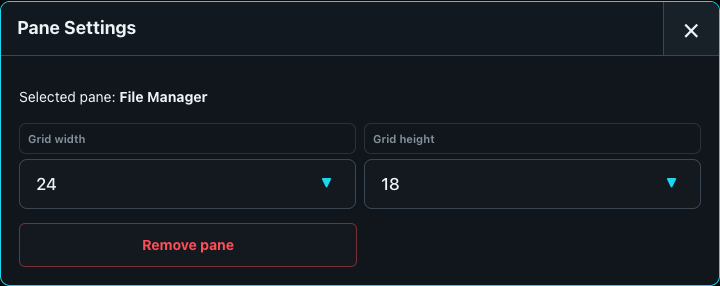
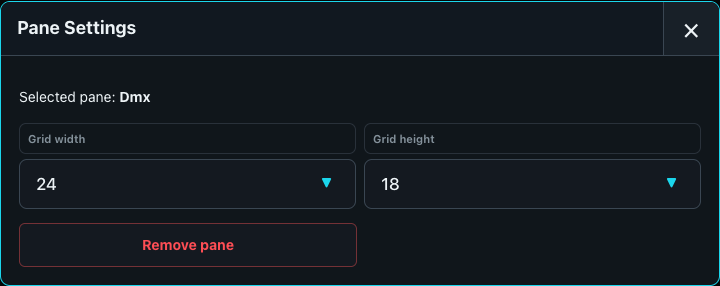
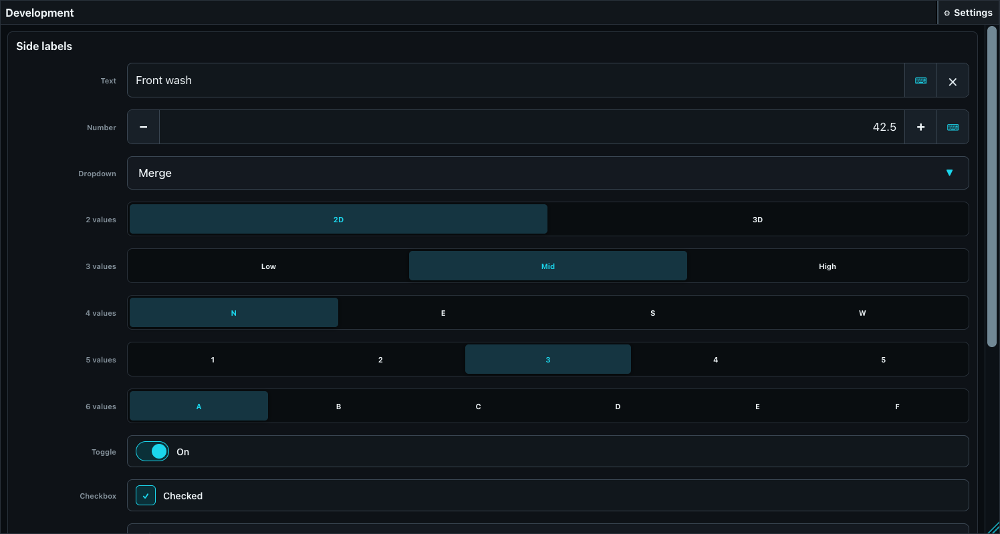
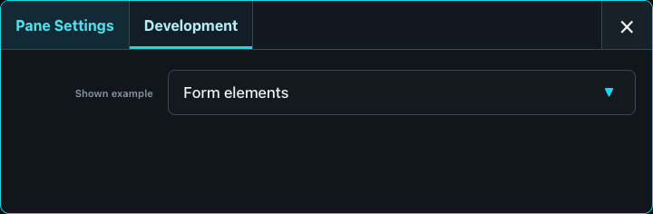

# Utility and Diagnostic Panes

## File Manager

The File Manager browses only roots explicitly exposed by the server; it cannot escape into arbitrary server paths. Use Back, Forward, breadcrumbs, and the location sidebar to navigate. Switch between List and Grid views, show hidden files, or create, rename, and permanently delete files and folders. Control/Command enables multi-selection.

List view shows Name, Type, Size, and Modified time. The properties area previews common images and audio. Supported text files can be opened in an embedded editor with Saved/Unsaved and read-only status. Deletion is permanent because the remote server exposes no desktop Trash.

**Pane configuration:** only common size and removal settings. Root, path, view, navigation history, and the embedded editor are controls inside the pane rather than Pane Settings.

## Text Editor

The Text Editor keeps one UTF-8 text file available as part of a desk layout. Choose one of the server-exposed roots and a file from that root, edit it, and press Save. The toolbar shows the selected path and Saved, Unsaved, read-only, or No file status. Leaving a dirty file asks before discarding changes, and closing the browser with unsaved work produces a warning.

The selected root and path are stored on this pane. Multiple Text Editor panes can therefore keep different files open. The editor is intentionally limited to exposed text files; it is not a general server filesystem or code-execution surface.

**Pane configuration:** only common size and removal controls. File selection is persisted from the pane toolbar, not from a separate settings tab.

## DMX output

The DMX output pane is a live monitor and diagnostic override surface. Values view displays up to 512 slots per shown universe. Selecting a slot reveals its decimal and hexadecimal address, DIP-switch representation, patched fixture, fixture-channel position, attribute, current raw value, and a 0-255 override control. **Release override** returns that address to normal engine output.

With no slot selected, the information area summarizes output frame rate, packets, and send errors. A compact pane stays in Values view, limits the universe list to the first two universes, and uses the global DMX dot-size preference.

The full DMX built-in adds **Sources**, which lists and releases active raw overrides; **Routes**, which inspects logical-universe protocol destinations; and **DMX Settings**, which changes Small/Large dot size. Routes are currently read-only in the application. Output engine fields live in Desk Setup and are not Pane Settings.

**Pane configuration:** only common size and removal controls.

## Help

The Help pane renders the same numbered Markdown catalog used to build this manual. Folder navigation selects a topic, safe relative images are loaded from Help assets, and desk buttons, keyboard keys, tables, and links receive their documentation styling. When live Help is enabled, the catalog refreshes automatically.

In a wide pane the catalog is on the left and content on the right. In a compact pane, navigation stacks above the selected topic. External links are restricted to safe HTTPS targets and local images cannot traverse outside Help assets.

**Pane configuration:** only common size and removal controls. The selected topic is navigation state rather than a persistent pane-setting field.

## Development

The Development pane is an interactive UI component catalog for developers, not a show-control surface. **Shown example** selects Forms, Faders, or Buttons. Forms demonstrates label placement and supported fields; Faders shows vertical and horizontal control styles; Buttons shows semantic variants such as primary, warning, and danger. These examples use local demonstration state and do not operate the show.

**Pane configuration:** **Shown example** is stored per pane. Common size and removal controls also apply.

