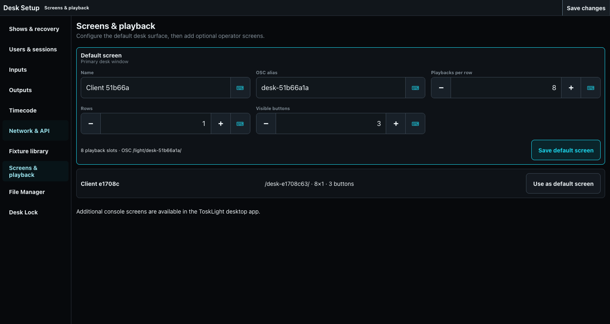

# Screens and Desktop Layouts

Open **Show > Desk Setup > Screens & playback** to configure the primary desk surface and, in the desktop application, optional operator screens.

## Configure a screen

For the default screen, set its operator-facing name and OSC alias. Choose **Configure Playbacks** to set the playbacks per row and add playback rows. Each row has its own first playback number, fader availability, and number of buttons. The default screen owns the Main Page. **Enable software keyboard shortcuts** controls the complete software shortcut layer for this screen; attached hardware disables that layer automatically. These changes take effect and save immediately. Choose **Undo** in the Screens & playback title bar to reverse the most recent actual default-screen change. Opening a modal or moving between setup sections does not create an undo step.

Choose **Choose default screen** to see every known client. Connected clients appear first, followed by disconnected clients; each group is ordered by the most recent connection. Every entry shows its stable client identity, connection state, last-connected time, and associated screen configuration. Older migrated entries show **Last connected unknown** until that client connects again. The current client and the screen this app currently uses are identified separately.

A disconnected historical client can be removed with **Remove client** and a named confirmation. The current client and any client or screen configuration with an active session cannot be removed. Removal clears that client's registration, default-screen configuration, per-show page and playback selection, desk lock, Update defaults, and virtual-playback exclusion settings. It does not change portable shows, users, optional screens, other clients, or installation-wide configuration. If the same removed client identity reconnects later, ToskLight registers it with a new default screen configuration instead of restoring the deleted settings.

Choose **Desk Lock** in the Screens & playback title bar to open its configuration modal. Set the lock message, unlock control, and optional wallpaper, then choose **Save Lock Configuration** in the modal title bar. The Show menu's **Lock Desk** action applies that saved configuration.

The Tauri desktop application can add optional screens. Each optional screen can show or hide the Dock, Playbacks, and Page Controls; select a physical display; and enter fullscreen. Its **Configure Playbacks** dialog provides the same row controls as the default screen and also selects its page mode. Choose **Follow Main** when its page tracks the primary page. Choose **Dedicated Page** for an independent operator surface. Browser-only operation displays the default-screen controls but cannot create native desktop windows.

Playback rows share all available playback height according to their controls. With attached playback hardware, a row without faders uses one height unit and a row with faders uses two. On a touch surface, a one-button row uses one unit and makes the whole playback section its button, with the function label at bottom-right. A two- or three-button faderless row uses two units and places its buttons side by side. A fader row uses four units. The unit size adapts so the configured rows fill the playback area.

## Build task Desktops

Create separate Desktops for common jobs such as Programming, Playback, Patch, and diagnostics. Add only the panes needed for that job. Use full built-ins for temporary work that should not change a Desktop. Layout changes are autosaved to desk data.

For pane geometry and available windows, see [Application Layout and Window Manager](../01-application-layout.md).
