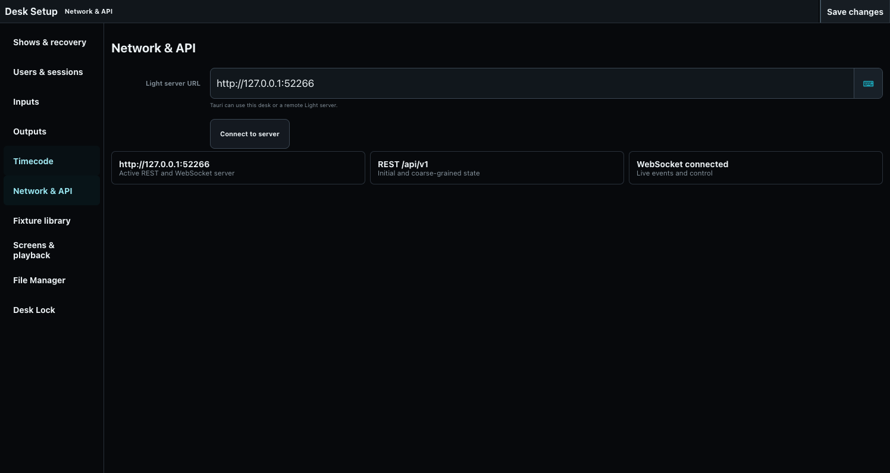

# OSC, MIDI, and Network Control

Input configuration lives in **Desk Setup > Inputs** and **Network & API**.

## OSC

The Inputs page currently reports the active OSC bind address; it does not edit that binding. Configure the server-side OSC bind through the installation configuration, then use Inputs to verify what the running desk loaded. Bind only to the trusted lighting-network interface. One ToskLight application and its attached OSC hardware form one desk and share the same authoritative command line and operator context. A separately named desk remains isolated.

After binding, test a harmless selection and confirm the command text and result in the application. Avoid exposing OSC to untrusted networks; OSC itself does not provide the desk-token boundary used by REST and WebSocket clients.

## MIDI and RTP-MIDI

Inputs reports selected native MIDI inputs and the active RTP-MIDI bind; those values are not editable from this screen. Configure them in the installation/server configuration and return here to verify the running state. Timecode source priority and fallback are reported separately under **Timecode**.

## Software keypad

Numpad digits and non-number shortcuts remain available in touch/software mode. The regular number row can be enabled or disabled in Inputs. Software shortcuts are disabled while hardware controls are connected so one physical action is not processed twice. The complete key map is in [Command Line Reference](../30-Programmer/01-command-line.md).

## REST, WebSocket, and remote servers

The desktop app normally connects to `http://127.0.0.1:5000`. Change **Light server URL** to operate a remote server, then press **Connect to server**. REST provides snapshots and coarse operations; WebSocket carries live events and typed controls. A LAN server should use `LIGHT_DESK_TOKEN`.

