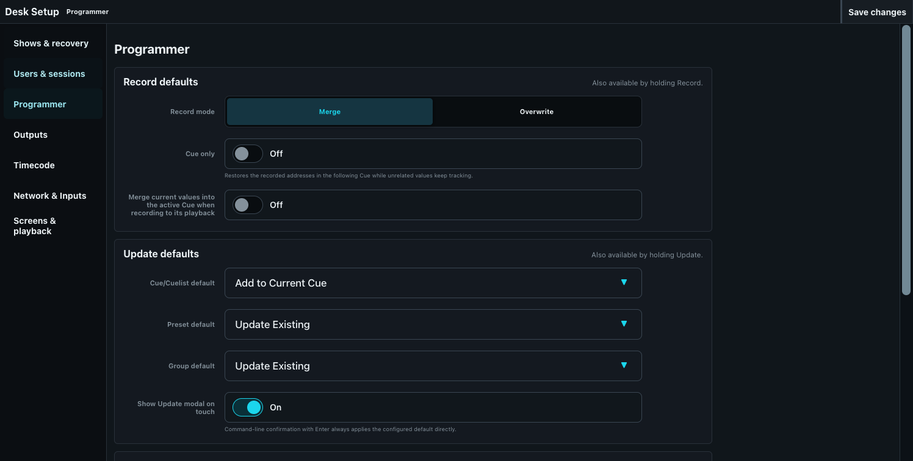
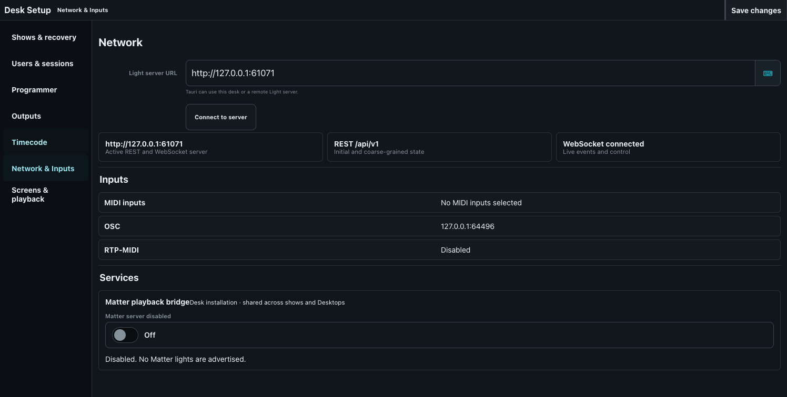

# OSC, Extensions, and Network Control

Preload capture configuration lives in **Desk Setup > Preferences > Others**. **Desk Setup > Network & Inputs** selects **Control & server**, **Sound**, or **Bridges** from the window title. Control & server contains the remote-server, native-extension, and OSC status; Sound contains Sound-to-Light input; Bridges contains Matter. Switching tabs keeps unfinished fields mounted and does not change which service owns them.

## Highlight look

Open **Desk Setup > Preferences > Highlight** to configure **Highlight look**, the transient identification look shared by every show and operator desk connected to this server. Intensity is required. Shutter is fixed to the fixture profile's authored **Open** function and cannot be changed to a raw, closed, or strobe value. Color can be Ignore or one named color; Iris, Zoom, Focus, and Frost independently use Ignore or a normalized value. Ignore leaves the current programmer, playback, default, or other lower-priority value visible.

This is installation data, not portable show content. The peer **Highlight patch** group chooses **Stage only** or **Stage and DMX** and only controls whether Patch Preview selection reaches physical output. A **NeedsReview** or **LegacyRaw** warning means an older show contains raw per-fixture Highlight data. Review the semantic settings before choosing **Use semantic Highlight Look**; that choice changes evaluation policy but preserves the original show data for compatibility.

## OSC

**Network & Inputs > Control & server** reports the active OSC bind address; it does not edit that binding. Configure the server-side OSC bind through the installation configuration, then return here to verify what the running desk loaded. Bind only to the trusted lighting-network interface. One ToskLight application and the OSC hardware subscribed to its alias form one desk: a physical button continues that desk's visible command and behaves like the corresponding UI button. A different desk alias retains its own command line, page, and button state. Programmer values are owned by the logged-in user instead, so a value that has been confirmed into that user's programmer is visible from the same user's sessions on every desk without copying the originating desk's unfinished interaction state.

After binding, test a harmless selection and confirm the command text and result in the application. Avoid exposing OSC to untrusted networks; OSC itself does not provide the desk-token boundary used by remote application connections.

## Native extensions

Built-in MIDI and RTP-MIDI transports have been removed from the server. Native device and protocol integrations are installed as separately approved extension packages. **Network & Inputs > Control & server > Native extensions** shows the effective package folder and configuration file, manifest and digest validation, local approval state, configured instances, process health, restarts, protocol errors, and bounded queue drops. A missing, invalid, unapproved, or crashing extension does not prevent the desk from becoming ready.

To install one, copy its complete package folder into the exact **Extensions folder** shown by diagnostics, then use the authenticated **Rescan extensions** action. Portable/headless archives normally use `extensions` beside the server executable; the desktop uses `extensions` in its application-data folder; repository development uses `.artifacts/runtime/extensions`. Do not copy individual files into a live package folder. Stage the complete folder elsewhere and replace it atomically so a rescan cannot observe half an update.

Approval and assignment are deliberately file-based in this version. Edit `extensions.json` in the reported Light data folder. Its version-1 document maps the extension's exact manifest ID to the package digest shown by diagnostics, then defines enabled instances with a stable local ID, desk ID or alias, stable device identity, extension settings, and logical control bindings. Restart or rescan after saving. A new digest is a new approval decision; ToskLight disables a changed package until the document names that digest. Never approve a digest copied from an untrusted source without comparing it to the validated local package.

Disable or remove an instance in `extensions.json` before unplugging or deleting its package. The host requests graceful release, then terminates a child that does not stop within the deadline. Removing the package without changing the file leaves an actionable missing-package diagnostic and does not affect software control. Device paths such as `/dev/tty*` and `COM4` are locators, not identities; use a USB serial, HID identity, MIDI endpoint identity, or another stable identifier supplied by the package. An ambiguous device remains unclaimed.

Platform trust remains the operator's responsibility. On macOS, review quarantine and input/device permissions for an unsigned package before approval. On Windows, review the publisher and device-driver requirements. HID, serial, USB, MIDI, and network permissions belong to the extension executable, not to shows or Macro code. Extension stderr and host health are bounded in the normal runtime log and authenticated diagnostics; no extension may add a settings page or render its own UI.

When an older installation is first opened, its exact MIDI input names and RTP-MIDI bind are preserved in **Diagnostics > Compatibility reports**. Older portable shows receive a recovery backup; unsupported MIDI Control Mappings are removed from the active object set and copied verbatim into the show compatibility report. OSC mappings remain unchanged. Recreate a removed integration only after installing and approving the intended extension package—ToskLight never guesses which package should receive legacy settings or mappings.

Timecode source priority and fallback remain server-owned and are reported separately under **Timecode**. Extension-provided timecode enters that same authoritative router under its extension/instance source identity. A telemetry-only extension reports typed channel values, units, quality, stale/loss, and rate errors in diagnostics; telemetry never enters fixture output or the DMX scheduler.

For package authors, the complete package, manifest, private IPC, input, feedback-output, telemetry,
timecode, lifecycle, and conformance contract is in
[Developing Native Hardware Extensions](../99-Development/05-native-extension-development.md).

## Sound-to-Light audio input

Under **Network & Inputs > Sound > Sound input**, request microphone access and choose the audio input used by Sound to Light. This is one browser-local selection for the current desk and is shared by Speed Groups A–E. It is not portable show data and is not sent to the server as a device identifier. Use **Refresh inputs** after connecting or renaming an audio interface.

Speed Group source, frequency region, gain, confidence, smoothing, tempo range, hold, and ratio remain in each Speed Group's settings. Open those settings with Shift-tap/Shift-click or a hold on the Speed Group control.

## Software keypad

On **Screens & playback**, the default-screen card can enable or disable all software keyboard shortcuts. Software shortcuts are also disabled automatically while hardware controls are connected so one physical action is not processed twice. The complete key map is in [Command Line Reference](../30-Programmer/01-command-line.md).

## Matter bridge

Open **Show > Enter Setup > Network & Inputs > Bridges > Matter bridge**, then use the **Matter server disabled** toggle. When enabled, its label changes to **Matter server enabled**. This is physical desk installation data, not Desktop layout or show data: changing a Desktop, changing or loading a show, or switching the current playback page does not change the setting, pairing identity, or commissioned fabrics. Disabling the setting stops Matter networking and advertising without deleting that persisted identity.

When the status says **Ready to commission**, enter the displayed **Manual pairing code** in the Matter controller. **QR payload** exposes the standard `MT:` payload for controller or integration tooling. A basic commissioning window is time-limited by Matter; if the desk has not yet been commissioned and the window expires, disable and re-enable the bridge to open a new window. **Starting Matter networking…** means the UDP and mDNS sockets are not ready yet. A displayed error, such as a port conflict or missing suitable network interface, means the desk is not advertising and is not commissionable.

Every assigned page/playback control becomes one dimmable Matter light, including one-button and faderless Virtual Playbacks. Its endpoint is derived from the explicit global page and playback address, so changing the page visible on an operator screen never retargets a Matter light. Empty page/playback slots and playback-pool entries that are not assigned to a page remain unexposed. Adding, removing, or renaming an assigned playback briefly restarts only Matter networking so controllers can rediscover the changed endpoint list.

Matter On/Off and Level Control writes use the same authoritative playback dispatcher as desk controls. A faderless assignment gains a Matter-only virtual master without adding a fader to its desk layout: a non-zero Level activates it at that master, Off or Level 0 reports off, and a later On restores the current non-zero level or starts at full. Where the assignment retains Temp or manual XFade behavior, the virtual master uses that same authoritative runtime position. Desk-side button actions, fader movement, tracking, automatic release, and other playback changes are read from the same authoritative runtime and mirrored back to subscribed Matter controllers. The standard Matter UDP port is exclusive; only one Matter service can own it on a host.

Current builds use the official `rs-matter` development vendor, product, and attestation credentials because ToskLight does not yet ship CSA-issued production credentials. Controllers that accept development devices can commission the bridge; a controller that requires certified production attestation may warn or reject it.

## Remote servers

The desktop app normally connects to `http://127.0.0.1:5000`. Change **Light server URL** to operate a remote server, then press **Connect to server**. A LAN server should use `LIGHT_DESK_TOKEN`.

For address structure, authentication, subscriptions, and current-page versus explicit-page playback addressing, continue to [OSC Protocol](../50-Protocols/01-osc-rest-and-websocket.md).

