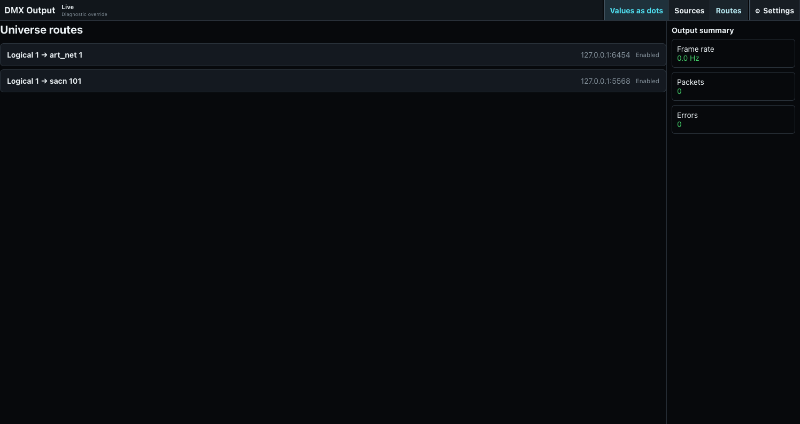

# DMX Output and Universe Routes

ToskLight renders logical universes and sends them through configured Art-Net or sACN routes. USB DMX and DMX input are extension points, not current output choices.

## Configure the engine

In **Desk Setup > Outputs**, choose a 40-44 Hz frame rate, the output bind address, and backup retention. Bind to the interface used by the isolated lighting network. Save and restart when requested.

## Create routes

Open **DMX** and select **Routes**. A route maps one logical show universe to an Art-Net or sACN destination universe and optional destination address; multicast is shown when there is no explicit destination. The current Routes page is an inspection view and does not create, edit, enable, or disable routes. Configure routes in the server/installation configuration, restart if required, and verify the loaded mapping here.

## Verify output

The Universe view shows the value for every DMX slot and identifies the patched fixture channel. Select a channel to see its fixture, attribute, DIP-switch address, and raw value. Diagnostic overrides write raw output outside normal programming; release every override after testing.

Before a show, confirm frame rate, packets sent, send errors, bind interface, route enablement, universe mapping, and representative fixture movement. Output is not proved merely because the programmer shows a value.
