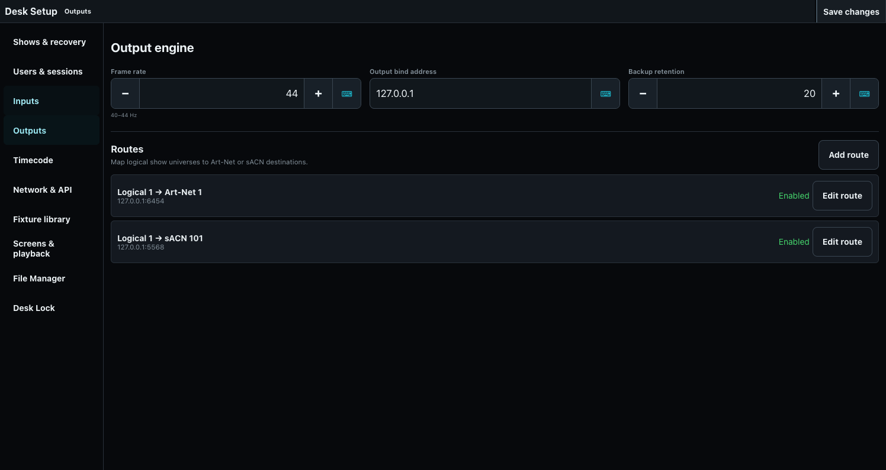

# DMX Output and Universe Routes

ToskLight renders logical universes and sends them through configured Art-Net or sACN routes. USB DMX and DMX input are extension points, not current output choices.

## Configure the engine

In **Desk Setup > Outputs**, choose a 40-44 Hz frame rate, the output bind address, and backup retention. Bind to the interface used by the isolated lighting network. Save and restart when requested.

## Create routes

Open **Desk Setup > Outputs > Routes**. A route maps one logical show universe to an Art-Net or sACN destination universe and an explicit, protocol-correct delivery mode. Create, edit, enable, disable, and verify routes beside the output-engine configuration rather than inside the DMX monitor.

Choose **Add route** to create one, or **Edit route** beside a versioned route to change its protocol, logical universe, destination universe, delivery mode, address, minimum universe size, or enabled state. **Art-Net Broadcast** uses the global `255.255.255.255:6454` destination. **Art-Net Unicast** requires an IPv4 address and port. **sACN Multicast** derives `239.255.x.y:5568` from the destination universe, while **sACN Unicast** requires an IPv4 address and port. Art-Net does not offer Multicast, and sACN does not offer Broadcast.

The output bind address selects the lighting-network interface. Use a specific IPv4 address on a multi-interface desk when the operating system must not choose the egress interface. An unavailable address prevents the output engine from starting with an actionable bind error; `0.0.0.0` deliberately leaves interface selection to the operating system. Runtime diagnostics report the configured bind address plus every route's resolved delivery mode and socket destination.

New routes start with a minimum of 128 slots. Every enabled route emits a frame on every output tick even when its logical universe has no patch; that idle payload contains zeros and is at least the configured minimum size. A patched fixture extends the payload through its complete footprint, and every patched channel contains its fixture default or zero when no default is configured.

For backward compatibility, a historical route with an explicit destination migrates to Unicast. A historical Art-Net route without a destination migrates to Broadcast; a historical sACN route without a destination migrates to Multicast. The explicit mode then survives save/reload, show switching, and restart. Disabling keeps the mapping in the show but stops its output, so another independent desk can own that destination universe. Art-Net stops without a final black frame; sACN sends its required stream-termination burst to the route's resolved Multicast or Unicast destination. Removing a route requires explicit confirmation.

## Verify output

The Universe view shows the value for every DMX slot and identifies the patched fixture channel. Select a channel to see its fixture, attribute, DIP-switch address, and raw value. Diagnostic overrides write raw output outside normal programming; release every override after testing.

Before a show, confirm frame rate, packets sent, send errors, bind interface, route enablement, delivery mode, resolved socket destination, universe mapping, and representative fixture movement. Output is not proved merely because the programmer shows a value.
