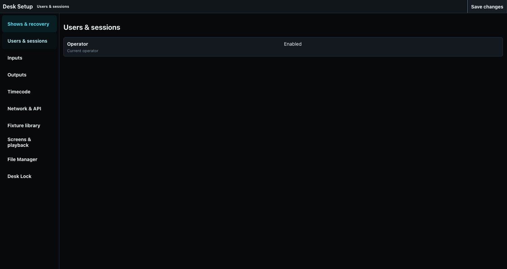
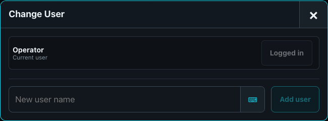
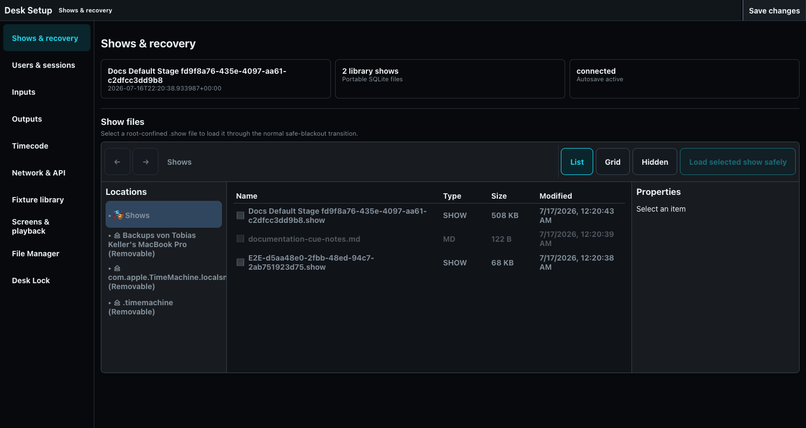

# Users, Sessions, and Recovery

Desk users separate operator programmers while sharing the same show and engine.

## Users and sessions

Open **Desk Setup > Users & sessions** to see enabled users and switch the current operator. Confirmed fixture- and Group-scoped values belong to that user's Programmer: once a value lands there, every session for the same user sees it, including sessions attached to different desks. A different user has an independent Programmer.

The desk owns the interaction that produces those values. Sessions attached to one desk share its unfinished command line, open ordered selection/source gesture, current playback page, and pressed-button state exactly as if the controls were on one physical console. The same user may simultaneously use another desk with a different partial selection or command. OSC hardware joins the interaction state of the desk alias to which it subscribes; pressing an OSC key therefore behaves like pressing the corresponding key in that desk's UI.

Use **Show > Change User** to switch or add an operator from the active show surface.

## Shows and recovery

**Shows & recovery** displays the active show, library count, server state, and autosave status. Its root-confined File Manager starts in the Shows location and accepts only `.show` files. Selecting **Load selected show safely** opens an indexed show or imports a valid file from another configured location, using the safe-blackout transition. Show mutations autosave to the portable `.show` file. Named revisions are explicit restore points; they do not disable later autosaves.

The desk database stores users, show-library index, active-show choice, configuration, desk interaction state, and durable user Programmers. Portable show files are stored separately. Keep both when backing up an installation.

If startup reports an invalid show, preserve the affected file, load a known revision or other show, and inspect diagnostics before overwriting anything. See [Shows, Revisions, and MVR](../20-Show-Setup/02-shows-revisions-and-mvr.md).
