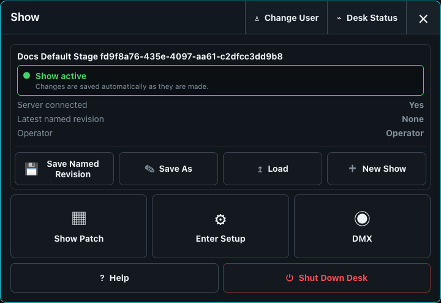

# Desk Setup

Desk Setup contains installation-specific configuration. It does not travel with a show file. Configure the desk before patching so operators, screens, control inputs, network binding, backups, and output behavior are predictable.

Open the Show menu and choose **Enter Setup**.

Work through these pages in order:

1. [Screens and Desktop Layouts](01-screens-and-layouts.md)
2. [OSC, MIDI, and Network Control](02-osc-midi-and-network.md)
3. [DMX Output and Universe Routes](03-dmx-output.md)
4. [Users, Sessions, and Recovery](04-users-sessions-and-recovery.md)

Saving some server settings reports **Restart required**. Finish the configuration, restart once, then recheck the status and output diagnostics.
