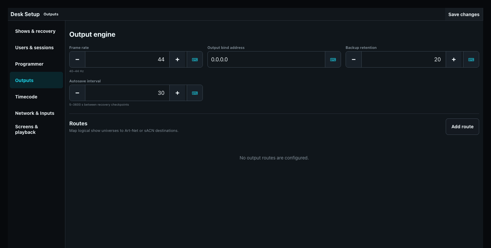

# DMX Output and Universe Routes

ToskLight renders logical universes and sends them through configured Art-Net, sACN, or built-in USB DMX routes. DMX input is not provided by these output transports.

## Configure the engine

In **Desk Setup > Outputs**, choose a 40-60 Hz frame rate, the output bind address, and backup retention. Backup retention limits how many automatic recovery checkpoints are kept; configure the checkpoint interval under **Shows & recovery**. Bind to the interface used by the isolated lighting network. Save and restart when requested.

## Create routes

Open **Desk Setup > Outputs > Routes**. A route maps one logical show universe to an Art-Net or sACN destination universe, or to one local USB DMX device. Create, edit, enable, disable, and verify routes beside the output-engine configuration rather than inside the DMX monitor.

Choose **Add route** to create one, or **Edit route** beside a versioned route to change its protocol, logical universe, destination universe, delivery mode, address, minimum universe size, or enabled state. **Art-Net Broadcast** uses the global `255.255.255.255:6454` destination. **Art-Net Unicast** requires an IPv4 address and port. **sACN Multicast** derives `239.255.x.y:5568` from the destination universe, while **sACN Unicast** requires an IPv4 address and port. Art-Net does not offer Multicast, and sACN does not offer Broadcast.

The output bind address selects the lighting-network interface. Use a specific IPv4 address on a multi-interface desk when the operating system must not choose the egress interface. An unavailable address prevents the output engine from starting with an actionable bind error; `0.0.0.0` deliberately leaves interface selection to the operating system. Runtime diagnostics report the configured bind address plus every route's resolved delivery mode and socket destination.

New routes start with a minimum of 128 slots. Every enabled route emits a frame on every output tick even when its logical universe has no patch; that idle payload contains zeros and is at least the configured minimum size. A patched fixture extends the payload through its complete footprint, and every patched channel contains its fixture default or zero when no default is configured.

## Configure USB DMX

Connect the interface, then open **Desk Setup > Outputs > Routes** and choose **Scan USB devices** beside **Add route**. Every discovered interface appears with its USB serial identity and an **Add route for device** action. That action opens the normal route editor with the device already selected. ToskLight chooses ENTTEC USB Pro or Open DMX automatically when the device metadata is conclusive; otherwise the editor asks which kind of interface is connected.

On macOS, one physical interface can appear under paired `/dev/cu.` callout and `/dev/tty.` dial-in prefixes. ToskLight recommends and selects the usable callout device automatically instead of presenting both as separate interfaces. Assign one logical universe and save the route. The desk remembers the exact USB serial identity when available; without one, it remembers the selected physical connection and never silently substitutes the first similar device.

Built-in support is intentionally limited to host-timed FTDI Open DMX interfaces and the documented ENTTEC DMX USB Pro v1.44 framing family. Open DMX continuously generates BREAK, mark-after-break, and the complete frame at 40 Hz. USB Pro interfaces retain their last buffered frame when output stops; Open DMX shutdown cannot promise a final electrical state. Disconnecting or failing one USB device does not block Art-Net, sACN, or another device. Diagnostics show Online/Reconnecting state, accepted frames, reconnect attempts, the last error, dropped frames, and the final shutdown outcome.

Do not select a driver based only on a similar product name. Unsupported, ambiguous, or duplicate device identities remain Offline with an actionable diagnostic. Electrical BREAK/MAB timing, isolation, and behavior after unplug still require validation with the actual interface before a production show.

For backward compatibility, a historical route with an explicit destination migrates to Unicast. A historical Art-Net route without a destination migrates to Broadcast; a historical sACN route without a destination migrates to Multicast. The explicit mode then survives save/reload, show switching, and restart. Disabling keeps the mapping in the show but stops its output, so another independent desk can own that destination universe. Art-Net stops without a final black frame; sACN sends its required stream-termination burst to the route's resolved Multicast or Unicast destination. Removing a route requires explicit confirmation.

## Verify output

The Universe view shows the value for every DMX slot and identifies the patched fixture channel. Select a channel to see its fixture, attribute, DIP-switch address, and raw value. Diagnostic overrides write raw output outside normal programming; release every override after testing.

Before a show, confirm the measured frame rate over the last 60 seconds, the frames delivered below rate, send errors, bind interface, route enablement, delivery mode, resolved socket destination, universe mapping, and representative fixture movement. Output is not proved merely because the programmer shows a value.
