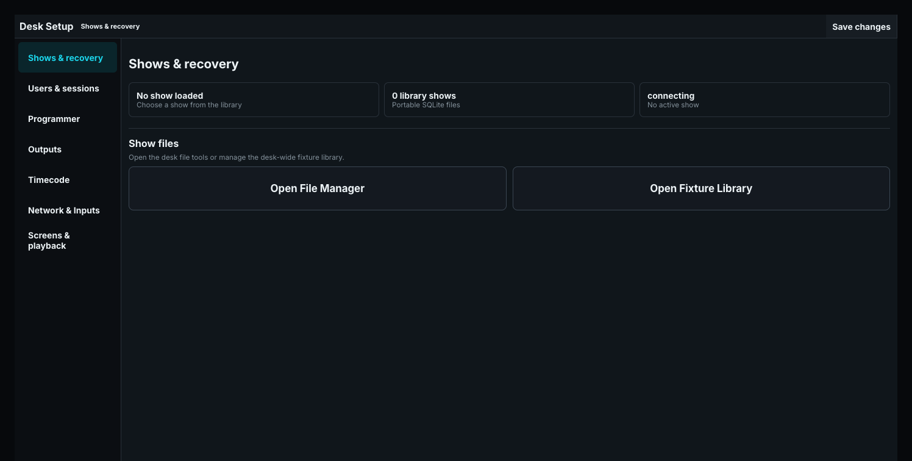

# Surfaces, Sessions, and Recovery

The desk has one Programmer. Every surface showing it is a view onto that one, not a copy.

## One desk, many surfaces

Whoever is standing at the desk — at the main window, an optional screen, a browser session, an
OSC wing, the keyboard — is operating the same command line, the same ordered selection, the same
Programmer values. A value confirmed on one surface is on all of them, because there is only one
place for it to be. Typing `GROUP 7` on a wing shows `G7` on the main screen, and finishing it
there finishes it everywhere.

There is no operator to switch to and none to add. What differs between surfaces is not who is
behind them but what they are allowed to do.

## Guest surfaces

Sometimes somebody else needs to work a light while you are programming. Two ways to let them,
neither of which gives them a Programmer of their own:

**Mark a screen Not Editable.** In a screen's settings, set **Programming** to *Not editable*. That
screen still shows the fixture sheet, the Stage and the desk's values, and still runs playbacks,
macros and timecodes — it simply cannot record, update or assign. Use it for a repeater in the
foyer, a monitor by the stage door, or a tablet somebody is holding.

**Connect an OSC remote on the remote-control path.** A surface that subscribes on `remote` works
playbacks and nothing else; one that subscribes on `desk` is a desk button and takes the full
command set including Record, Update and Assign. See [OSC](../../90-Protocols/01-osc.md).

A guest working a fader while you have Record armed moves the fader. It does not become the target
of your Record, because the guest never reaches the Programmer at all.

## Desk Lock

Desk Lock is one lock over the whole installation. Locking the desk in front of you locks every
screen and every attached control surface with it, including an OSC wing. Running output is
unaffected; only input is held.

## Shows and recovery

**Shows & recovery** displays the active show, library count, server state, and autosave status. Set the autosave interval from 5-3600 seconds (30 by default) to control how often the desk writes an automatic recovery checkpoint of the active show while you program. Its root-confined File Manager starts in the Shows location and accepts only `.show` files. Selecting **Load selected show safely** opens an indexed show or imports a valid file from another configured location, using the safe-blackout transition. Show mutations autosave to the portable `.show` file. Named revisions are explicit restore points; they do not disable later autosaves.

**Audio Player media library** selects the folder the Internal Audio Players read from. That folder is also offered in the File Manager as its own location beside **Shows**, named **Audio Library**, so audio files can be browsed, renamed, and copied without leaving the desk. Selecting a different folder replaces the location; clearing the selection removes it. A location configured under File Manager roots that already points at the same folder is not repeated.

The desk database stores the show-library index, active-show choice, configuration, desk
interaction state, and the desk's durable Programmer. Portable show files are stored separately.
Keep both when backing up an installation.

An installation from before the desk had one Programmer may hold several. On first start the desk
keeps the one touched most recently and writes the rest, whole, to `backups/desk-collapse-*.json`
under the data directory, so nothing programmed is lost. The log says what it kept and where the
rest went.

If startup reports an invalid show, preserve the affected file, load a known revision or other show, and inspect diagnostics before overwriting anything. See [Shows, Revisions, and MVR](10-shows-revisions-and-mvr.md).
