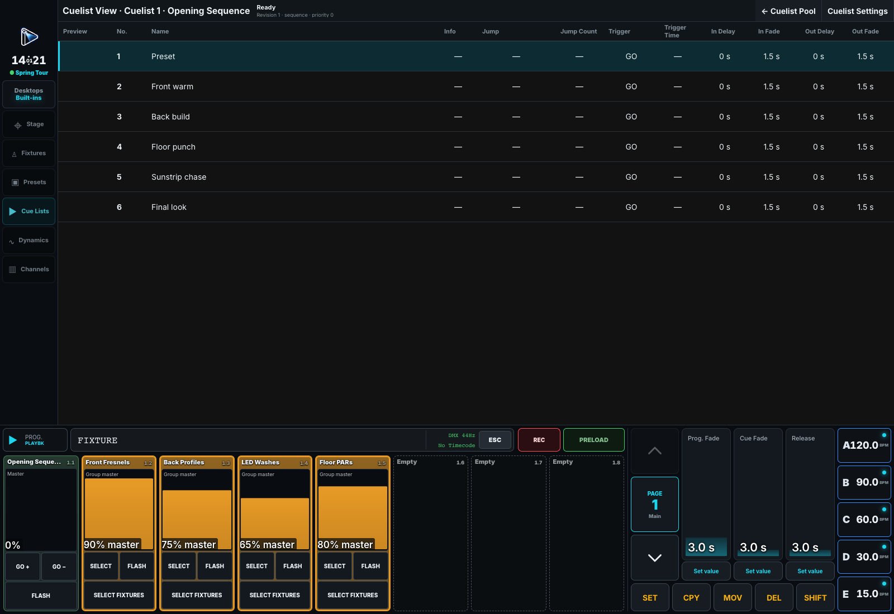

# Programming Cues

## Quick summary

1. Build a look in the Programmer, record it into a Cue, then clear the Programmer and run that Cue.
2. Set **In Fade/Delay** on the Cue being entered. Set **Out Fade/Delay** on the Cue being left for decreasing or released Intensity.
3. Stored per-value timing takes priority unless **Force Cue Timing** is on. An explicit per-value fade of zero means snap, even when the Cue has a longer fade.
4. For an automatic next step, set FOLLOW or TIME on that next Cue; see [Triggers, Chasers, and Speed Groups](13-triggers-chasers-and-speed.md).

A Cue stores what is currently in the programmer. Values that are merely visible from a playback, defaults, Highlight, or resolved output are not recorded. A Cue is one stored step inside a Cuelist; a playback is a control that may be assigned to that Cuelist, not the Cuelist itself.

## Record the first Cue

1. Select fixtures and build the intended look in the programmer.
2. Press `[REC]` and choose a Cuelist/playback target, or enter an explicit Cue address.
3. Name the Cue and set fade, delay, and trigger behavior in Cuelist View.
4. Clear the programmer and run the Cue to prove that the stored data is sufficient.

> [!danger] Missing graphic
> Add a Cue lifecycle diagram showing Programmer values being recorded into a Cue, the Cue inside a Cuelist, assignment to a playback, and playback output after the Programmer is cleared.

Recording onto an empty Cuelist creates its first Cue without assigning it to a playback. Recording onto an empty playback creates a Cuelist, records its first Cue, and assigns it. On touch, the whole visible playback is the Record target. On an attached desk, only its topmost playback button is the target; if no button is assigned, use the visible on-screen section. The fader is never a Record target, so it remains usable while programming.

When a target Cuelist contains exactly one Cue, the desk asks whether to **Add Cue**, **Merge Cue**, or **Overwrite Cue**. Once it contains two or more Cues, recording onto the Cuelist or its playback always appends a new Cue. This is the **Smart** Record behaviour.

Press `[REC]` twice to choose how this Record stores the programmer: **Smart**, **Merge** (into the Cue the playback is on, programmer values win), **Add Existing** (only what that Cue does not store yet), or **Add Cue** (always a new Cue). Press title-bar **Record** to use the choice once, or turn on **Set as default** first to make it the desk's Record default for every following plain `[REC]`. Choose **Smart** with **Set as default** on to return to the regular behaviour. See [Choosing How to Record](01-command-line.md#choosing-how-to-record-rec-rec).

From the command line, the default target is a Cuelist. `[REC][CUE][CUE] <Cuelist-number> [ENT]` appends there and selects it; later use `[REC][CUE][ENT]` to append to the selected Cuelist. `[REC][PBK] <playback-number> [ENT]` records through a physical playback, and `[REC][PBK][PBK] <virtual-playback-number> [ENT]` records through a Virtual Playback. A playback number without a dot uses the current page; `<page>.<playback>` selects an explicit page.

To choose the Cue number, use `[REC][CUE][CUE] <Cuelist-number> [CUE] <Cue-number> [ENT]`, or omit the Cuelist address for the selected Cuelist. An existing Cue is overwritten; an unused number is inserted. Cue numbers are paths, not decimals: `2`, `2.0`, `2.1`, `2.1.0`, and `2.2` are all distinct and sort in that order.

## Edit Cue contents

Normal Record overwrites the addressed Cue, `[REC][+]` merges programmer values, and `[REC][-]` removes their fixture/attribute addresses. Copy, Move, and Delete use explicit addresses. Renumbering and edits are protected as one show mutation; check the final Cue order before proceeding.

Use `[^REC]` to update existing programming. **Update** changes values stored directly in the current Cue; **Tracked** changes the earlier Cue supplying each tracked value; **Known** writes values into the current Cue only when their addresses already occur somewhere in the Cuelist; **All** also introduces new addresses. The command forms are plain `[^REC]`, `[^REC][-]`, `[^REC][+][+]`, and `[^REC][+]` respectively. Press `[^REC]` twice while holding Shift, then release Shift, to choose how to update: **Smart**, **Merge** (All), **Add Existing** (Known), or **Add Cue** (a new Cue in the touched Cuelist), once or as the desk's Update default. Its title-bar **Targets** opens the complete Update Targets modal. The preview explains eligible, ignored, source-Cue, and destination results before confirmation. See [Updating Existing Programming](01-command-line.md#updating-existing-programming) for exact targets and Preset updates.

For a temporary change, hold `[REC]` to open **Record Settings** and enable **Cue only** before recording. The following Cue automatically restores each Cue-only address to its previous tracked value, or releases an address that had no earlier value. Turn **Cue only** off again for ordinary tracking records. The setting and generated restoration data survive a show refresh or reopen. Record Settings saves each change immediately; press title-bar **Done** to close it. Each option explains its effect below its label: **Record default** is the desk's stored Record choice (**Smart**, **Merge**, **Add Existing**, or **Add Cue**) that every plain `[REC]` uses, and **Cue only** is kept on this screen. The former **Record mode** and **Merge into active Cue** settings were replaced by the Record default; a desk that had **Merge into active Cue** on starts with **Merge** as its default.

## Timing and triggers

### Which Cue owns the timing?

When moving from Cue 1 to Cue 2, **Cue 2's In Fade and In Delay** govern incoming changes. **Cue 1's Out Fade and Out Delay** govern decreasing or released Intensity. Editing Cue 2's Out timing changes what happens when you later leave Cue 2; it does not change the fall from Cue 1 into Cue 2. Other attributes use incoming timing.

For example, Cue 1 has one fixture at 80% and Cue 2 takes it to 20%. With Cue 1 Out Delay **0.3 seconds** and Out Fade **1 second**, it holds for 0.3 seconds after GO, then falls over 1 second, provided no stored per-value timing overrides those times. Another fixture rising into Cue 2 can fade at the same time using Cue 2's In timing. Independent delays can also leave a black gap.

### Per-value timing and timing masters

Cue timing is the fallback for values without their own fade or delay. A stored per-value fade or delay takes priority independently: an explicit fade of **0 seconds** snaps rather than inheriting the Cue fade. Enable **Force Cue Timing** in Cuelist Settings when the Cue's timing should govern all values instead. **Disable Cue Timing** is a rehearsal bypass that makes Cue and per-value timing immediate without changing the stored values; it takes priority over Force Cue Timing.

For a sequence Cue whose In Fade is zero, the desk's **Cue Fade** supplies the fallback. Explicit nonzero Cue In Fade remains its own time. Out Fade can link to the desk's **Release** master, and Out Delay can link to that Cue's effective **In Fade**. Linked cells show the source and current time. Returning to explicit timing restores the remembered explicit value. When Out timing has no independent value, it inherits the effective fade/delay fallback. Chasers use their single X-fade percentage timing.

**Programmer Fade** controls programming transitions and supplies the GO-time transition for queued Programmer values in Preload. It does not globally override ordinary Cue playback. Preloaded playback actions keep explicit Cue timing; without explicit timing they use the Programmer Fade captured at Preload GO. See [Preload](12-preload.md).

### Choose when to advance

Manual GO, FOLLOW, TIME, timecode, and Link determine when playback moves. FOLLOW waits for the latest actual incoming or outgoing work to settle, then adds the follow delay stored on the next Cue. TIME counts from the preceding Cue's start. [Triggers, Chasers, and Speed Groups](13-triggers-chasers-and-speed.md) gives a worked example.

Link is stored on its source Cue and jumps to a destination Cue by stable identity after actual completion plus its optional delay. Renumbering changes the displayed destination number without changing the Link. Missing destinations, self-links, and Link cycles are rejected before the show changes. Pause freezes a running transition. Releasing a whole playback removes its ownership immediately; Cue Out timing does not fade the release of the entire playback.

When a Cue appears inside a Cuelist clip in the Timecode editor it is drawn as two stacked bands: the out timing above the in timing, each a hollow delay block followed by its solid fade block, so one Cue reads as a single stepped shape. The boundary between a delay and its fade sets the delay, and the far edge of the fade sets its duration. These handles edit the same Cuelist-owned timing values. The Timecode clip stores its placement and playback behavior, not a duplicate of the Cue timing. A saved drag is therefore visible immediately in Cuelist View, and a later Cuelist edit changes the ranges shown in Timecode. Linked timing remains linked unless the operator explicitly chooses an independent value.

For exact commands and edge cases, see [Command Line Reference](01-command-line.md). For execution semantics, see [Cues and Playbacks](10-cues-and-playbacks.md).

The clip itself is dragged by the handle across its top third, which carries the Cuelist name and its playback number. Dragging either end of that handle scales the clip: the Cue delays and fades inside it, and any placed transition points, all stretch or compress in proportion, so a section keeps its shape at a new length. With a clip selected, **Prev Cue** and **Next Cue** step through the Cues it spans, and the encoders address the selected Cue as In delay, In fade, Out delay, Out fade, with the Cue selection beside them.
