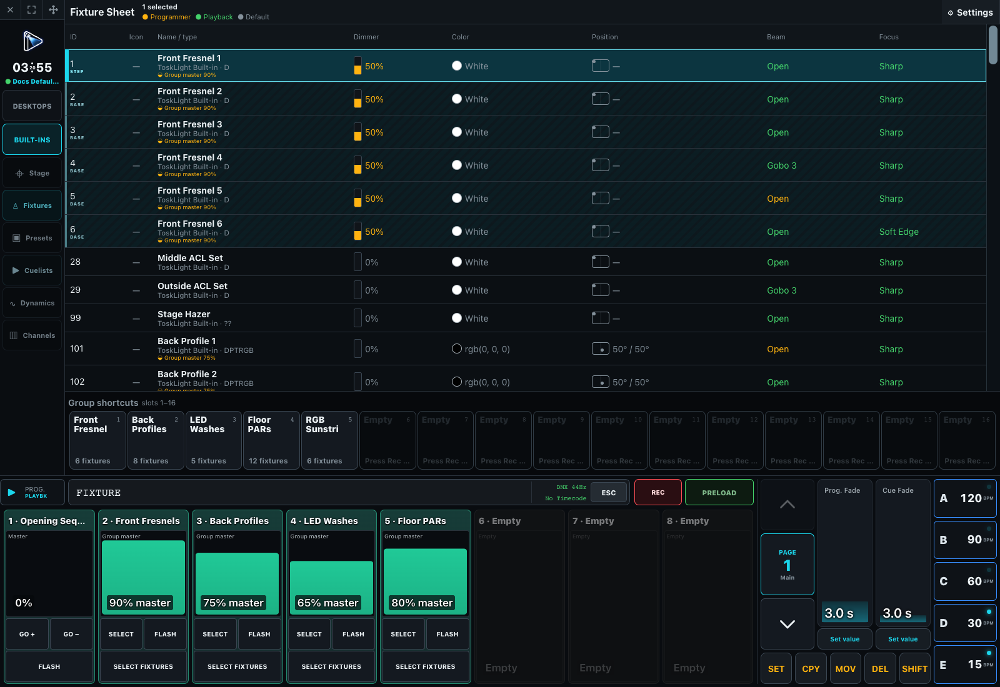

# Programmer and Cues

The Programmer is the operator's temporary working area. Selection, values, Presets, Dynamics, fade and delay times, FixAT, and Release become show programming only when they are recorded or used to Update an existing object.

Start with [Selecting and Setting Values](02-selecting-and-setting-values.md), then build reusable [Groups and Presets](03-groups-and-presets.md) and [Program Cues](04-programming-cues.md). The [Command Line Reference](01-command-line.md) is the precise keypad, button-layer, addressing, and command contract.

Running-show behavior continues with [Cues and Playbacks](10-cues-and-playbacks.md), [HTP, LTP, and Ownership](11-htp-ltp-and-ownership.md), [Preload and Preload GO](12-preload.md), [Triggers, Chasers, and Speed Groups](13-triggers-chasers-and-speed.md), [Virtual Playbacks](14-virtual-playbacks.md), and [Schedules](15-schedules.md).

Clear the Programmer after recording when the playback should be proved on its own. A visible stage look is not evidence that a Cue owns it; inspect the Fixture Sheet source, Running window, and final DMX when diagnosing ownership.
