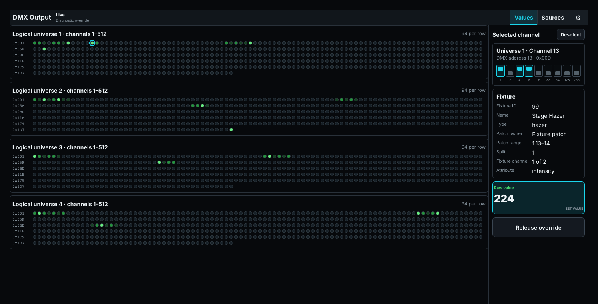
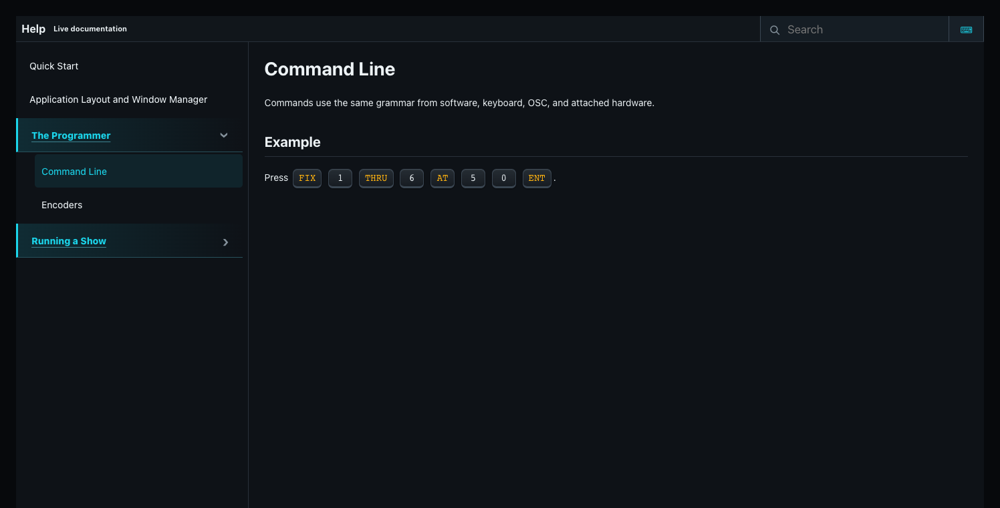

# Output and Help Windows

## DMX output

The DMX output pane is a live monitor and diagnostic override surface. Values view displays up to 512 slots per shown universe. Selecting a slot reveals its decimal and hexadecimal address, DIP-switch representation, patched fixture, fixture-channel position, attribute, current raw value, and a 0-255 override control. **Release override** returns that address to normal engine output.

With no slot selected, the information area summarizes output health over the last 60 seconds: the minimum, average, and maximum measured frame rate; a histogram counting the frames delivered below 20, 30, 38, 40, and 44 Hz; and the send errors in that window alongside the total since the current show was opened. The buckets are cumulative, so a frame at 25 Hz is counted below 30, 38, 40, and 44 Hz. A compact pane stays in Values view, limits the universe list to the first two universes, and uses the global DMX dot-size preference.

The full DMX built-in adds **Sources**, which lists and releases active raw overrides, and **DMX Settings**, which changes Small/Large dot size. Output-engine fields and editable logical-universe routes live under **Desk Setup > Outputs**, not in the DMX pane or Pane Settings.

**Pane configuration:** only common size and removal controls.

## Help

The Help pane renders the same numbered Markdown catalog used to build this manual. Folder navigation selects a topic, safe relative images are loaded from Help assets, and desk buttons, keyboard keys, tables, and links receive their documentation styling. When live Help is enabled, the catalog refreshes automatically.

The catalog remains in a left column and the selected topic remains in a right column, including when Help is embedded as a pane. External links are restricted to safe HTTPS targets and local images cannot traverse outside Help assets.

**Pane configuration:** only common size and removal controls. The selected topic is navigation state rather than a persistent pane-setting field.

