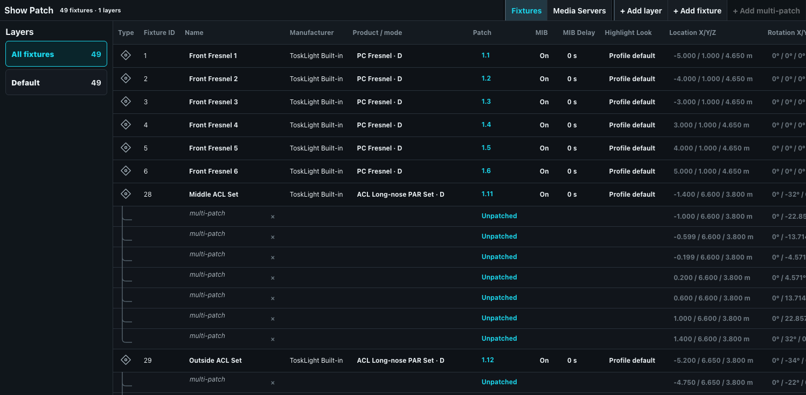
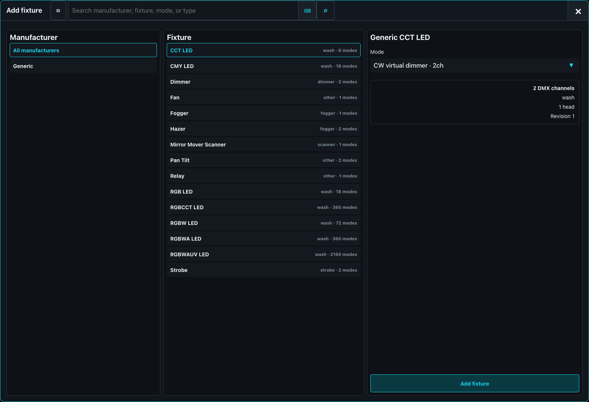

# Fixtures and Patch

The patch connects logical fixture IDs to fixture-library modes and physical DMX addresses. Open **Show > Show Patch**. Patch is a full built-in workflow and is not one of the addable desk panes.

## Patching Fixtures

After you have selected the fixture type you want, you can patch your fixtures with entering `<amount> [AT] <universe>.<address>`. This patches the amount of fixtures starting at the selected address with the offset of the amount of channels in the selected mode of the fixture. You can chain multiple of these before pressing [ENTER] if you want them across multiple addresses or universes.

The patch refuses addresses outside 1-512 and detects overlaps across primary and multi-patch instances. Unpatched fixtures remain valid show fixtures and can still be selected and programmed; they simply produce no routed DMX until addressed.

For a multi-split profile mode, the placement dialog shows **Independent split patches** with one optional `universe.address` field per split and its separate footprint. Clear a field to leave only that split unpatched. Batch placement advances every patched split by its own footprint, validates all split ranges independently, and rejects overlap between splits, fixtures, and multi-patch instances. The Patch table presents every split as its own `S<number> <universe>.<address>` or `—` target.

To repatch, select a split target and press `[SET]`, or press `[SET]` first and then touch the required split. Software SET, computer-keyboard Home, and attached-hardware SET all open the same selected-split editor. Changing or clearing that address preserves every other split and never deletes the logical fixture, its heads, selection, or programming. A one-split fixture keeps the ordinary single Address field and command behavior.

Use **+ Add fixture** to search by type, manufacturer, fixture family, and mode, then check the footprint and physical details before placement. Search sits in the Add Fixture title bar and filters automatically with every typed character; no Search-button confirmation is required. It follows the shared [search-bar layout](../01-application-layout.md#search-bars), and its optional Options dialog selects the fixture type. Clearing the query restores all fixtures. Manufacturer and fixture names align left, while type/mode counts and detail values align right for quick scanning. In the placement dialog, **Start fixture ID** is a regular number field alongside **Count** and **Address**. A batch starting at ID 100 receives 100, 101, 102, and so on; any ID already used in the show is skipped while the requested fixture count is preserved. **Cancel**, **Add fixtures**, and Close remain together in the placement title bar, with Add directly beside Close. Closing or cancelling after changing placement values asks for confirmation with **Yes, close** and **Stay in Add Fixture**; staying preserves every entered value.

The manufacturer column is ordered **All manufacturers**, **Generic**, **Venue**, then the actual manufacturers alphabetically. Venue profiles are scenic objects rather than DMX fixtures. Their placement dialog asks for fixture ID, name, count, and mode but has no Address field or universe grid; the Patch, MIB, MIB Delay, and Highlight cells show that no DMX patch applies. They remain ordinary transferable show objects with editable location, rotation, and layer.

The placement dialog shows all 512 addresses of the selected universe as a scrollable grid of square touch targets. Existing fixture ranges have a gray outline and translucent gray fill labeled with fixture ID and name. The proposed fixture range is blue, or red when it overlaps an existing fixture. Tap any address to move the proposed patch there, or drag the blue range with a mouse or touch; the Address field follows the dragged start address and the footprint remains inside the universe.

The **MIB** and **MIB Delay** columns configure fixture-level Move in Black behavior. Like the other editable patch cells, an ordinary click selects the fixture without changing show data. Press `[SET]` and then the cell to open its editor; confirm with **Set** or leave the stored value untouched with **Cancel**. MIB is On by default, and MIB Delay is a non-negative duration in seconds.

The **Highlight Look** column configures how one patched fixture identifies itself during [Highlight and Step Through](../30-Programmer/02-selecting-and-setting-values.md#highlight-and-step-through). Press `[SET]`, then the cell. Leave a channel blank to inherit its profile's **Highlight raw** value, or enter an exact raw value within that channel's resolution to override it for this fixture. The usual profile look is full intensity and physical white: RGB/RGBW and calibrated additive emitters produce white, CMY uses no filtration, and a discrete wheel uses a named Open/White slot when available. Non-identifying or unmatched wheel channels retain their safe/default raw value unless the profile deliberately opens a shutter or supplies another required value. A per-fixture override can instead produce a useful identification color such as blue. It belongs to the fixture, not its universe/address, so repatching does not change it.

Highlight Look is persisted in the portable show snapshot as a map from stable profile-channel IDs to raw overrides. Existing shows that have no override map load it as empty and inherit deterministic Highlight values from their embedded legacy definition or migrated profile. Saving the migrated show writes the current profile snapshot and override map; it does not add transient Highlight on/off, owner, remembered live selection source, or step position. Copying a fixture preserves the configured override map, while changing to a different mode validates overrides against that mode's channel identities and resolutions.

## Multi-patch

Multi-patch gives one logical fixture additional physical output instances. Use it when several physical units must always share the same logical programming. Every instance uses the same embedded fixture profile and values but has its own per-split universe/address assignments and optional stage position. The same independent footprint and overlap checks apply to every instance. Do not use multi-patch for separately selectable heads; use a multi-head fixture definition instead.

For a visual-only Venue profile, **+ Add multi-patch** adds another independently positioned and rotated scenic instance but deliberately provides no address action. This is useful for building a complete truss, deck, stair, pipe, or curtain arrangement from one selected library profile and mode.

## Multi Head Fixtures

Multi-Head Fixtures are lamps that have more than one individually controllable light source. Good examples are LED strips with individual controllable segments, LED PAR-Bars with 4 individually controllable heads, etc.

Every of these heads acts like a single fixture, but they are grouped together and patched together.

You give a multi-head fixture one fixture ID, such as 100. Its master uses sub-address `100.0`, while its individually controllable heads automatically receive `100.1`, `100.2`, and so on.

For a ten-head Sunstrip with shared tilt, `100 [ENTER]` selects `100.0` followed by `100.1` through `100.10`. Use `100.0 [ENTER]` when you want only the master and its shared tilt parameters.

Bare fixture ranges intentionally select controllable heads without their masters: `100 [THRU] 110 [ENTER]` expands to the child heads of fixtures 100 through 110. To select the shared masters instead, use `100.0 [THRU] 110.0 [ENTER]`.

In the fixture sheet, a multi-head fixture appears as separate `.0`, `.1`, `.2`, and subsequent rows. There is no additional aggregate row.

## Patch check

After patching, inspect **DMX > Universe** for footprint and channel ownership, then set a safe test value and verify the real output. Save a named revision before a large repatch.
