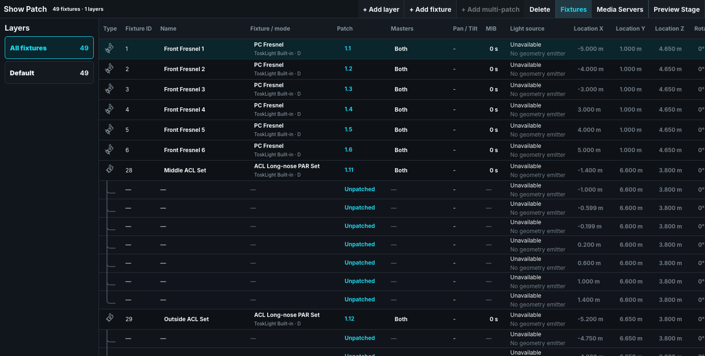
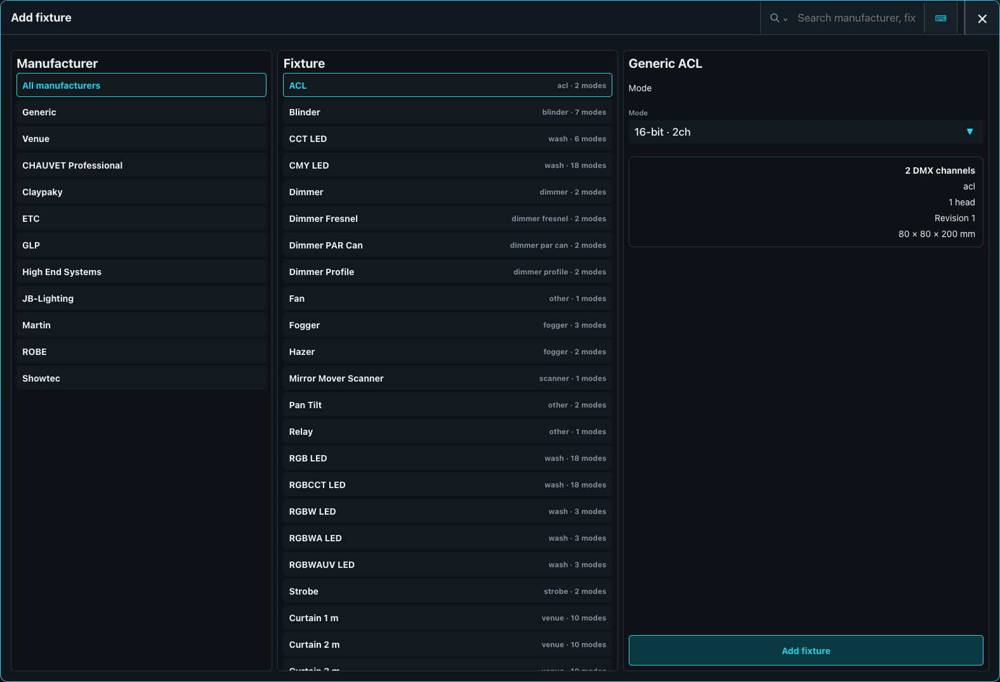

# Fixtures and Patch

The patch connects logical fixture IDs to fixture-library modes and physical DMX addresses. Open **Show > Show Patch**. Patch is a full built-in workflow and is not one of the addable desk panes.

## Patching Fixtures

After you have selected the fixture type you want, you can patch your fixtures with entering `<amount> [AT] <universe>.<address>`. This patches the amount of fixtures starting at the selected address with the offset of the amount of channels in the selected mode of the fixture. You can chain multiple of these before pressing [ENTER] if you want them across multiple addresses or universes.

The patch refuses addresses outside 1-512 and detects overlaps across primary and multi-patch instances. Unpatched fixtures remain valid show fixtures and can still be selected and programmed; they simply produce no routed DMX until addressed.

For a multi-split profile mode, the placement dialog shows **Independent split patches** with one optional `universe.address` field per split and its separate footprint. Clear a field to leave only that split unpatched. Batch placement advances every patched split by its own footprint, validates all split ranges independently, and rejects overlap between splits, fixtures, and multi-patch instances. The Patch table presents every split as its own `S<number> <universe>.<address>` or `—` target.

To repatch, select a split target and press `[SET]`, or press `[SET]` first and then touch the required split. Software SET, computer-keyboard Home, and attached-hardware SET all open the same **Fixture Address** screen. It shows the fixture's complete footprint, current and pending patch, every split, and all 512 slots of the selected universe. Existing ranges are marked separately from the pending range; the fixture's own current slots remain available while it is moved. Tap a free start slot or use the integrated number block to enter `universe.address`. Both paths update the same pending value and validate the complete split footprint.

For a split fixture, choose any split tab and edit every split before confirming once. **Clear address · Unpatch** explicitly clears the active split. **Set Address** applies the complete validated patch atomically; it sits in the title bar directly beside Close. Close and Escape leave the patch unchanged. An overlap, malformed address, universe overflow, incompatible split assignment, or concurrent server rejection remains visible and cannot partially patch. Clearing an address preserves every other split and never deletes the logical fixture, its heads, selection, or programming. A one-split fixture uses the same screen without split tabs.

The table uses one fixed sixteen-column grid for primary fixtures and multi-patch rows: **Type**, **Fixture ID**, **Name**, **Fixture / mode**, **Patch**, **Masters**, **Pan / Tilt**, **MIB**, **Light source**, the six **Location**/**Rotation** axes, and **Layer**. Product/mode plus manufacturer, both master policies, and both inversion policies use compact two-row cells rather than separate columns. A multi-patch keeps the same grid, displays `—` in Fixture ID and Name, and places its actual address in Patch; its stored copy name remains available to editors and accessibility tools.

The six transform columns remain direct SET targets. Selecting one exact primary or multi-patch row also opens two six-encoder groups. **Location** provides Location X/Y/Z in metres and Rotation X/Y/Z in degrees. **Visualization** provides Bracket, Shaper 1–4 Angle, and Shaper Module Rotation. Touch turns, attached hardware, and encoder press/Set Value address the same selected physical instance. Unsupported visualization roles remain visible but unavailable. If a fixture has a live DMX blade-angle or shaper-rotation attribute, that live value owns the matching visualizer role and the static encoder is unavailable.

Bracket and shaper values describe how the physical fixture is installed; they are not Programmer attributes and never affect DMX. They are recorded independently for the primary fixture and every physical copy, travel with the show, and drive supported semantic visualizer geometry. Re-importing MVR retains these desk-owned installed values.

Use **+ Add fixture** to search by type, manufacturer, fixture family, and mode, then check the footprint and physical details before placement. Search sits in the Add Fixture title bar and filters automatically with every typed character; no Search-button confirmation is required. It follows the shared [search-bar layout](../01-application-layout.md#search-bars), and its optional Options dialog selects the fixture type. Clearing the query restores all fixtures. Manufacturer and fixture names align left, while type/mode counts and detail values align right for quick scanning. In the placement dialog, **Start fixture ID** is a regular number field alongside **Count** and the **Address**/**Empty** choice. Choose **Empty** to add every requested fixture unpatched: the fixtures retain their IDs, profiles, modes, layers, positions, and programming surfaces but send no DMX until patched later. Switching back to **Address** restores the normal footprint preview and collision validation. A batch starting at ID 100 receives 100, 101, 102, and so on; any ID already used in the show is skipped while the requested fixture count is preserved. **Cancel**, **Add fixtures**, and Close remain together in the placement title bar, with Add directly beside Close. Closing or cancelling after changing placement values asks for confirmation with **Yes, close** and **Stay in Add Fixture**; staying preserves every entered value.

The manufacturer column is ordered **All manufacturers**, **Generic**, **Venue**, then the actual manufacturers alphabetically. Venue profiles are scenic objects rather than DMX fixtures. Their placement dialog assigns fixture IDs from the reserved `0.x` range, beginning at `0.1`, and asks for name, count, and mode but has no Address field or universe grid. The Patch, MIB, MIB Delay, and Highlight cells show that no DMX patch applies. They remain ordinary transferable show objects with editable location, rotation, and layer. They appear in Show Patch and Stage but are excluded from the Fixture Sheet, which contains programmable fixtures only. The same exclusion applies independently to every `visual_only` profile and every complete fixture ID beginning `0.` so imported or legacy scenery cannot leak into the programming table.

The placement dialog shows all 512 addresses of the selected universe as a scrollable grid of square touch targets. Existing fixture ranges have a gray outline and translucent gray fill labeled with fixture ID and name. Every fixture requested by **Count** appears as its own blue proposed range, arranged consecutively by default; a range turns red if it overlaps an existing or proposed fixture. Grab any blue range with a mouse or touch to move that fixture independently, or select one and tap a free address. The batch is created from the individual displayed addresses, and every footprint remains inside its universe.

The combined **MIB** cell shows **Off** or one non-negative delay in seconds. `0 s` means Move in Black is enabled with no delay and is distinct from Off. One SET action writes enabled state and millisecond delay atomically; fractional seconds are accepted when representable.

The two-row **Masters** cell shows Group Masters and Grand Master participation. Its one editor chooses **Not controlled**, **Group Master**, **Grand Master**, or **Both** and atomically applies the eligible policies. Ignoring a master is an intentional live-output exception: eligible intensity channels can remain live while that master is reduced. It does not bypass Blackout, output-route disable, hazardous-fixture safety, or emergency suppression. Multi-patch rows show this logical-fixture value as shared.

The two-row **Pan / Tilt** cell shows each physical instance's inversion. Its one editor chooses **None**, **Invert Pan**, **Invert Tilt**, or **Invert Both** without changing Programmer, Preset, Cue, or tracking values. Inverted maps 0% to the high endpoint and 100% to the low endpoint while leaving 50% unchanged. The main fixture and each multi-patch instance can use different values. Inapplicable axes stay visibly unavailable and retain their dormant value.

The **Light source** cell shows the selected installed source and effective color temperature above its gel/filter. SET opens one physical-instance editor for Profile default or a typed lamp source, whole-kelvin CCT from 1,000–25,000 K, Open white, an installation catalog entry, or a named custom color. Every installation starts with the **Generic gels** catalog (G00–G15), which can be edited like any other installation-owned catalog. Catalog CSV import uses exactly `number,name,display_rgb,visualizer_rgb` and presents additions, replacements, conflicts, and row-specific errors before explicit confirmation. Assigning a catalog entry embeds its number, name, display color, and separate visualizer color in the show, so another desk can render the look without that installation catalog. Fixtures without light-emitting geometry leave this cell unavailable.

Press **Preview Stage** in the Show Patch title bar to open a read-only 16:9 Stage overlay in the lower-right corner. It occupies no more than half the Patch window, and its top grip bar can be dragged to move the overlay anywhere over the Patch. On the desktop app, holding **Preview Stage** (long press) instead opens a dedicated **Stage View** OS window — a view-only 3D stage that can live on another display; selecting fixtures there drives the shared desk selection, highlighting the same rows in the Patch table. The overlay shows the live Stage scene and resolved values; every fixture selected in the Patch table is illuminated virtually at full intensity so its current direction is visible. Plain click selects one fixture, Control/Command-click adds or removes a fixture, and Shift-click selects the ordered range from the previous Patch selection. The virtual identification affects only this embedded Stage view and does not alter programmer values, cues, the normal HIGH state, or DMX output.

The fixture table adds scroll clearance equal to the overlay, so its final rows can always be scrolled fully above the preview instead of remaining hidden underneath it. **Desk Setup > Programmer > Highlight patch selection via DMX** can additionally apply the selected fixtures' configured Highlight Look to physical output. This installation-specific setting is off by default, is not stored in the portable show, and its scoped output is released when Preview Stage closes, Show Patch closes, the session disconnects, the show changes, or the setting is disabled.

The ordinary Patch table does not edit Highlight values. Configure one installation-wide semantic look under **Desk Setup > Programmer > Highlight Look**; the fixture profile translates it into the fixture's authored functions, color system, physical ranges, and exact DMX.

Older portable shows may still contain raw per-fixture Highlight override maps. ToskLight preserves those maps losslessly and continues evaluating them while the installation is in **LegacyRaw** or **NeedsReview** compatibility mode. They remain hidden from ordinary Patch editing; changing a fixture mode retains only overrides whose stable channel identities and resolutions are still compatible. Choosing **Use semantic Highlight Look** is the explicit decision to stop evaluating the legacy raw maps. It does not delete or rewrite them, add new maps to the show, or store transient Highlight state.

## Multi-patch

Multi-patch gives one logical fixture additional physical output instances. Use it when several physical units must always share the same logical programming. Every instance uses the same embedded fixture profile and values but has its own per-split universe/address assignments, optional stage position, and physical Pan/Tilt inversion. The same independent footprint and overlap checks apply to every instance. Do not use multi-patch for separately selectable heads; use a multi-head fixture definition instead.

Repatch a multi-patch instance through the same **Multi-patch Address** screen used for a fixture address. It shows all 512 slots of the selected universe, supports selecting a free start slot by touch, and allows dragging the pending footprint to another address. **Set Address** and Close remain together in the title bar; only the edited instance is excluded from the occupied-address display, so the fixture's primary patch and its sibling multi-patches remain protected from overlap.

For a visual-only Venue profile, **+ Add multi-patch** adds another independently positioned and rotated scenic instance but deliberately provides no address action. This is useful for building a complete truss, deck, stair, pipe, or curtain arrangement from one selected library profile and mode.

## Multi Head Fixtures

Multi-Head Fixtures are lamps that have more than one individually controllable light source. Good examples are LED strips with individual controllable segments, LED PAR-Bars with 4 individually controllable heads, etc.

Every of these heads acts like a single fixture, but they are grouped together and patched together.

You give a multi-head fixture one fixture ID, such as 100. Its master uses sub-address `100.0`, while its individually controllable heads automatically receive `100.1`, `100.2`, and so on.

For a ten-head Sunstrip with shared tilt, `100 [ENTER]` selects `100.0` followed by `100.1` through `100.10`. Use `100.0 [ENTER]` when you want only the master and its shared tilt parameters.

Bare fixture ranges intentionally select controllable heads without their masters: `100 [THRU] 110 [ENTER]` expands to the child heads of fixtures 100 through 110. To select the shared masters instead, use `100.0 [THRU] 110.0 [ENTER]`.

In the fixture sheet, a multi-head fixture appears as separate `.0`, `.1`, `.2`, and subsequent rows. There is no additional aggregate row.

## Patch check

After patching, inspect **DMX > Universe** for footprint and channel ownership, then set a safe test value and verify the real output. Save a named revision before a large repatch.
