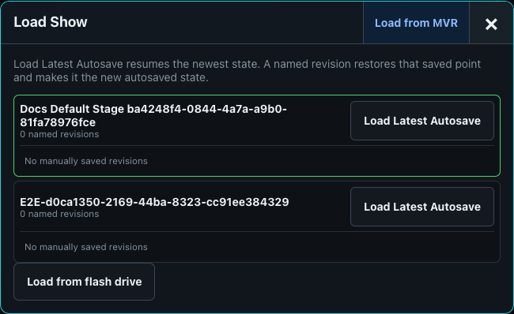
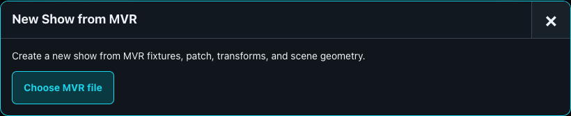
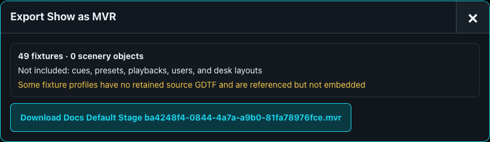

# Shows, Revisions, and MVR

A `.show` file is the portable source for patch, stage layout, groups, presets, Cuelists, playbacks, and other show objects. Desk configuration and operator identity do not travel with it.

## Create, load, and revise

Use the Show menu to create a show, upload/open a show from the library, or save a copy under a new name. **Save Named Revision** creates a numbered manual restore point. **Load Latest Autosave** resumes current work; selecting a named revision restores that saved state. Use Save As before adapting a touring or template show.

## Import MVR

Choose **New Show > Load from MVR** and review the preview before creating the show. The preview reports matched profiles, missing GDTF modes, address conflicts, and scenery. Resolve each conflict by choosing a safe address, importing unpatched, or skipping it. Apply only after checking the result. Merge-into-existing-show support exists internally but currently has no operator control and must not be relied on as an available workflow.

Embedded GDTF files are imported into the desk fixture library. Fixtures without a matching definition remain visible as unresolved import records instead of being silently discarded.

## Export MVR

Export preview reports fixture and scenery counts, embedded profiles, missing retained source profiles, omissions, and warnings. The export includes fixture UUIDs, patch, transforms, supported scenery, and retained GDTF sources where available. Resolve warnings before relying on the archive as an interchange master.

MVR is an exchange format, not a replacement for the native `.show` history. Keep the native show and named revisions as the operational source.
