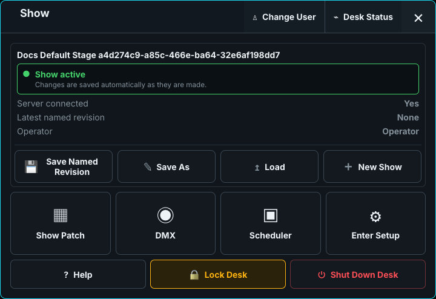
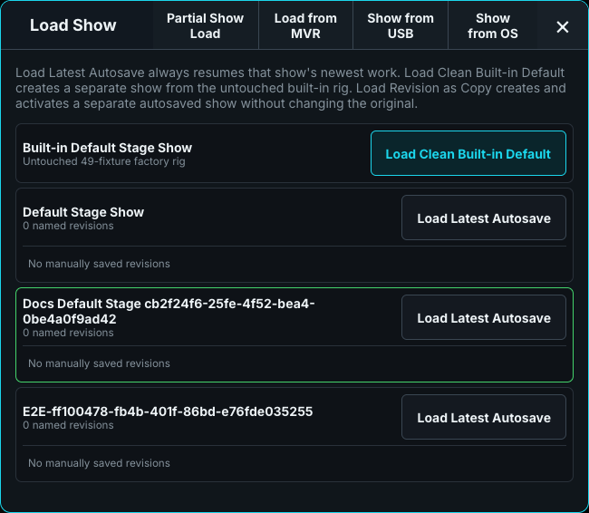
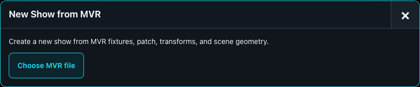
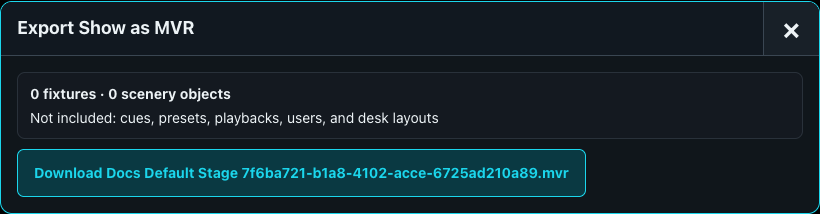

# Shows, Revisions, and MVR

A `.show` file is the portable source for patch, stage layout, groups, presets, Cuelists, playbacks, and other show objects. Desk configuration and operator identity do not travel with it.

## Create, load, and revise

Use the Show menu to create a show, upload/open a show from the library, or save a copy under a new name. In **Load Show**, choose **Show from USB** to browse ToskLight's confined file manager for a USB show file or **Show from OS** to open the operating system's native file picker directly; both accept portable `.show` files. Creating an empty show immediately creates, activates, and autosaves a real show named **New Empty Show** (with a number when needed); programming is protected before you choose a final name. The first **Save As** on that provisional show renames the same show, preserving its identity and current programming. **Save Named Revision** creates an immutable numbered restore point. **Load Latest Autosave** always resumes that show's newest work. **Load Revision as Copy** creates and activates a separate show from the selected restore point; it never rewinds or replaces the original show's Latest Autosave.

The server always provisions **Default Stage Show** from the completed portable demo show and opens it when a new desk has no active show. That library entry is a normal autosaved working show, so operator changes remain there. **Load Clean Built-in Default** always generates and activates a new, separately named working copy from the untouched completed demo show. It does not copy changes from the working Default Stage Show, so the shipped rig remains recoverable after edits, fixture deletion, renaming, or show-data relocation. Release CI regenerates the source show directly through the desk API without browser choreography or artificial pacing, packages it into the desk, and attaches it to the release. Product-demo video capture remains an offline operator action run on an operator computer.

The generated copy name includes the source show, revision number, and copy date. The Show menu identifies it as a separate revision copy and keeps the source show name, revision number and name, and creation time visible. The left dock also labels the active show as a revision copy. All subsequent changes autosave to the copy, not the original. The copy remains in the show library after switching shows or restarting the desk, and it can have its own named revisions.

## Save a revision copy

Because autosave already protects the active copy, **Save** asks where the copy should remain. Choose **Keep as Separate Show** to leave it independent, or **Overwrite Original Show** to replace the original show's mutable Latest Autosave. If the original was deleted, the overwrite-original choice is unavailable and the copy remains fully usable.

For an established, named show, **Save As** can create another named show or select the original or another existing show as a destination. Choosing an existing destination opens a separate destructive confirmation; cancel is the safe default. A confirmed overwrite first creates an internal recovery backup, replaces only the destination's Latest Autosave, and preserves the destination identity and all of its named revisions. The revision copy and immutable source revision are retained until explicitly deleted.

## Load from a Visualizer on the network

The ToskLight Viz Editor plans a rig against the same patch sheet the desk uses, and a rig planned there is a show the desk can run. When a Viz Editor with a document open is on the same network, **Load Show** offers **Load from Visualizer** naming that editor and the document it is holding. Pressing it copies the document across, imports it into the show library like any other portable show, and opens it.

What arrives is a copy. Patching in the editor afterwards does not reach this desk, and programming here does not reach the editor. Two editors on the network are two separate offers, named after the machines they are running on.

The offer only appears when there is something to load: an editor with nothing open, a network without discovery, or a firewall that blocks it costs the button, not the desk. Nothing else about the desk depends on it. The other direction — the editor loading this desk's show — is described in [Planning a Rig in the Viz Editor](../45-Visualizer/06-planning-and-transfer.md).

## Import MVR

Choose **New Show > Load from MVR** and review the preview before creating the show. The preview reports matched profiles, missing GDTF modes, address conflicts, and unsupported standalone scene geometry. Resolve each fixture conflict by choosing a safe address, importing unpatched, or skipping it. Standalone geometry is not imported; recreate required scenery with visual-only Venue fixtures in Show Patch. Apply only after checking the result. Merge-into-existing-show support exists internally but currently has no operator control and must not be relied on as an available workflow.

Embedded GDTF files are imported into the desk fixture library. Fixtures without a matching definition remain visible as unresolved import records instead of being silently discarded.

## Export MVR

Export preview reports fixture counts, embedded profiles, missing retained source profiles, omissions, and warnings. The export includes fixture UUIDs, patch, transforms, and retained GDTF sources where available. Visual-only Venue fixtures are exported as fixtures; there is no separate Stage scene-asset collection. Resolve warnings before relying on the archive as an interchange master.

MVR is an exchange format, not a replacement for the native `.show` history. Keep the native show and named revisions as the operational source.
