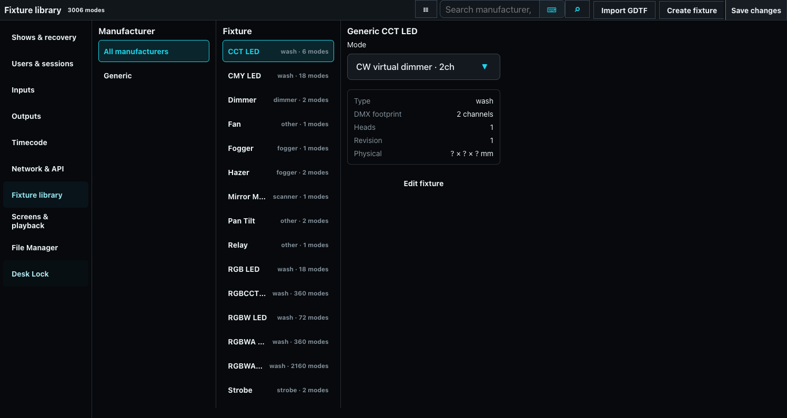
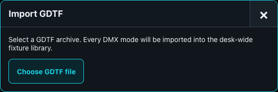
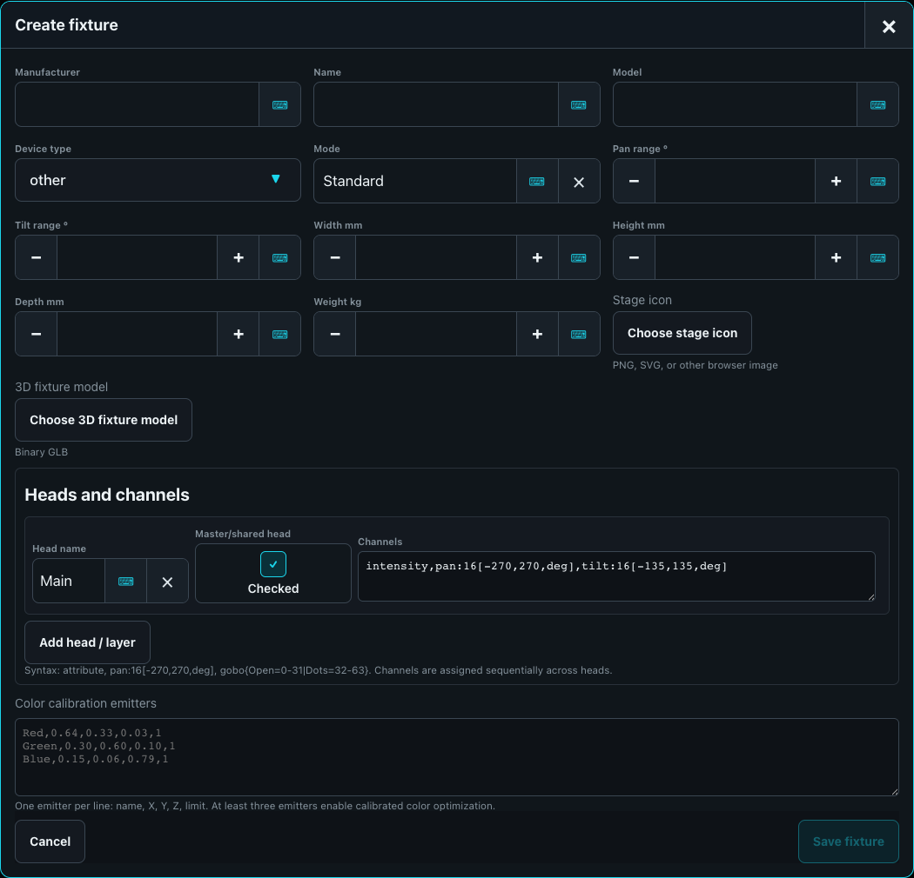

# Fixture Library

The fixture library is desk-wide and persists independently of show files. Open **Desk Setup > Fixture library** to search, import, create, and revise fixture modes. Search, **Import GDTF**, and **Create fixture** live together in the window title. Manufacturer and fixture names align left while secondary mode and detail information aligns right.

## Import GDTF or Fixture Share downloads

Download the required `.gdtf` file from GDTF Fixture Share or obtain it from the manufacturer, then choose **Import GDTF**. Every DMX mode in the archive becomes a library mode. ToskLight retains supported physical information, emitters, channel capabilities, and a GLB model when present.

The application does not silently fetch Fixture Share content by name. Keep the original GDTF file with the production package so another desk can reproduce the library.

## Create a local fixture

Choose **Create fixture**, enter manufacturer, model, device type, mode, physical dimensions, and optional stage icon/GLB model. Define heads and channels with the editor syntax shown below the field, for example `intensity, pan:16[-270,270,deg], tilt:16[-135,135,deg]`. Add a master/shared head for common parameters and child heads for individually selectable segments.

At least three XYZ emitters enable calibrated color optimization. Capabilities can label DMX ranges such as shutter or gobo slots.

## Revisions and management

Editing saves a new revision; existing patched fixtures retain the definition data stored in the show. Search and filter by fixture type, manufacturer, model, or mode. Confirm footprint, head count, physical data, and channel order against the manufacturer manual before patching.
