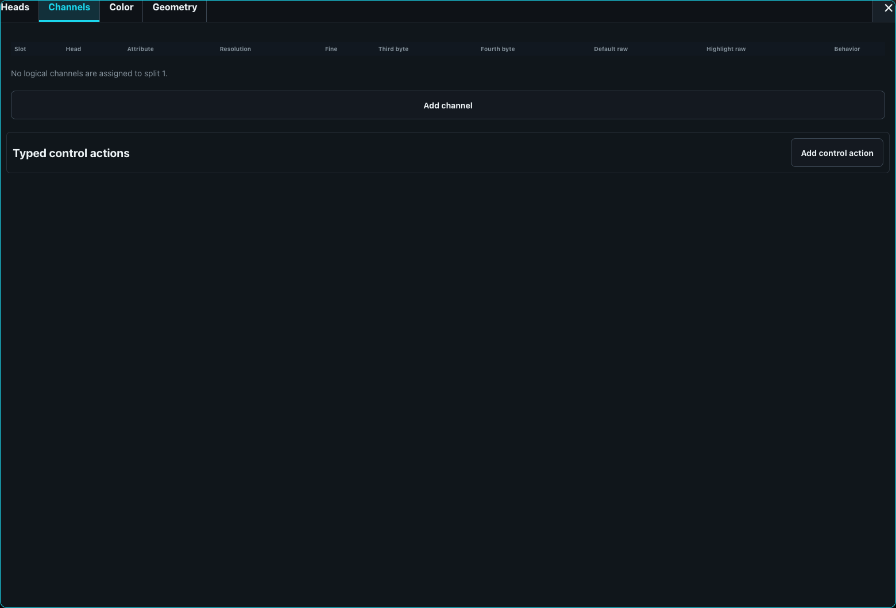

# Fixture Library

The fixture library is desk-wide and persists independently of show files. Open **Desk Setup > Fixture library** to search, import, create, revise, and inspect complete fixture profiles. A profile is one revisioned fixture containing Generic information and an ordered set of modes; a patched show embeds the selected profile revision and mode so later library edits or deletion cannot change that show.

## Import GDTF

Choose **Import GDTF** and select a `.gdtf` archive. ToskLight normalizes the supported modes, channels, physical information, emitters, capabilities, geometry, and model into a fixture profile and retains the original GDTF bytes beside every resulting immutable revision. MVR export can therefore use the retained source instead of reconstructing an archive from lossy normalized data.

An import or migration error leaves the original data untouched and appears as an actionable warning in the Fixture Library. Do not delete the source row until the warning has been investigated or the fixture has been recovered.

## Create or edit a fixture profile

**Create fixture** opens a blank profile with one mode named **Default** and one editable main head. **Edit as new revision** opens the same editor with the chosen revision. The title bar contains **Generic**, **Modes**, **Save fixture**, and Close; there is no footer Cancel action.

Closing an unchanged editor is immediate. Closing a changed editor through Close, Escape, or the backdrop asks whether to **Stay** or **Discard changes**. Saving an existing profile first asks to **Save and create revision**. A failed or stale save keeps the editor open and explains the problem.

### Generic

Generic information includes manufacturer, full and short names, fixture type, notes, stage icon, photograph, optional visualizer GLB model, dimensions, weight, and power consumption. Manufacturer remains free text. Use its lookup button to search the unique desk-library manufacturers with the shared full-text keyboard and fill the field without saving the editor.

### Modes and heads

Modes have stable identities, names, notes, and complete channel configuration. Add, remove, and reorder modes with drag-and-drop or the explicit move buttons; the final mode cannot be removed. **Edit channels** opens the nested tabs in this order: **Heads**, **Channels**, **Color**, and **Geometry**.

Every head has a stable identity, one split, and an optional master/shared designation. At most one head is master/shared. Several heads may share a split. A head that still owns channels cannot be removed until those channels are reassigned or removed.

A split is an independently patchable address block. Give each split its footprint here; each gets its own optional universe and address in Show Patch. An unpatched split remains selectable, programmable, and visible but emits no DMX.

### Channels

For multi-split modes, Channels shows one accordion per split and keeps exactly one open. A single-split mode shows its table directly. Rows support touch drag-and-drop and explicit keyboard/accessibility move controls.

The primary DMX slot is derived from row order. Fine, Third byte, and Fourth byte contain explicit component slots for 16-, 24-, and 32-bit channels; reserved component slots are skipped when later primary slots are calculated. Default, Highlight, function ranges, and fixed values are exact raw integers at the selected resolution. Saving is blocked when slots overlap, exceed 512, do not fit the resolution, or lie outside the split footprint.

**Highlight raw** defines the profile-level identification look used while that channel's fixture or logical head is highlighted. A newly derived default uses full conventional intensity and physical white: direct RGB/RGBW white endpoints, calibrated additive or subtractive D65 white, zero CMY filtration, and the midpoint of a discrete wheel slot explicitly named Open, White, Clear, or No Color. Inversion is included when choosing a raw endpoint. If no white wheel slot can be identified, that channel keeps its safe default instead of using an arbitrary maximum. Set any required shutter-open channel deliberately, and leave Position and unrelated or hazardous functions at an appropriate safe/default raw value. Validate the complete look on the real fixture; Highlight raw is physical output configuration, not a normalized programmer value.

Changing a newly added channel's attribute, additive/subtractive calibration, or discrete-wheel Open/White slot recalculates its semantic Highlight default only while the field still contains the previous automatic value. This lets an untouched wheel channel move from its safe default to the Open/White midpoint when that slot is defined. Once an operator enters an exact Highlight raw value, later channel or Color-tab edits preserve it. Existing schema-v2 revisions are likewise never renormalized on load or save.

Each channel chooses its head and canonical attribute and can configure physical range/unit, invert, snap, virtual-intensity reaction, sequence/group/grand-master reactions, and prioritized functions. **Static** channels normally output their default and use their Highlight value only while identified. Snap channels bypass programmer, Cue, Move in Black, and safety transitions.

A physical channel may contain ordered continuous, fixed, indexed-color/gobo, or control functions. Only an explicitly programmed function claims it; the highest configured priority wins, and releasing it reveals the next claim or channel default. Typed control actions can atomically set several channels and be latched, momentary, or timed. Fixed and indexed functions appear in the direct programmer picker.

### Color

Color remains an abstract XYZ request across fixtures. Additive systems bind measured XYZ or xyY emitters, maximum level, response curve, and visible-color participation. Subtractive systems bind CMY channels. Discrete wheels store portable semantic color IDs, local labels, DMX ranges, and optional measured color. The engine uses bounded non-negative mixing and deterministic gamut clipping, with direct RGB or CMY fallback when calibration is unavailable. UV and other non-visible emitters participate only when explicitly programmed.

Portable presets are never created merely by patching. Use the explicit **Generate portable presets** action for the selected fixtures to add stable fixed/indexed semantic choices to the show.

### Geometry

Start with **Fixed fixture**, **Moving head**, **Bar**, **Matrix**, or **Shared-pan multi-head**, then edit the generated hierarchy. Parts have parents, transforms, pivots, optional GLB-node bindings, and attribute-driven rotation or translation. Emitters attach to any part and define logical head, origin, orientation, beam and field angles, feather, focus, and point/matrix/ring/strip/explicit-pixel layout.

The editor preview and Stage visualizer use the configured graph, multiple emitters, resolved motion attributes, and the same resolved color used for output. This supports a shared pan ancestor with independent tilt children and multiple offset beam sources instead of assuming one hard-coded beam.

## Revisions and compatibility

The server assigns revision numbers atomically and rejects concurrent edits. Open **Revision history** to inspect immutable revisions, edit an older revision as a new one, or delete an unused revision. Deletion warns when a patched show embeds that revision; the show's snapshot remains intact even if deletion is confirmed.

Legacy library entries migrate through an explicit schema-v1 reader. Compatible modes are combined only when their fixture-family metadata agrees; conflicts remain separate and produce a visible warning. Built-in Generic profiles are regenerated as reserved-source entries without deleting user-authored fixtures that also use `Generic` as manufacturer.

During legacy or GDTF migration, intensity, RGB/RGBW/additive, CMY/subtractive, and identifiable Open/White wheel channels receive the same deterministic physical Highlight defaults; unmatched wheel, Position, and unrelated channels retain their source defaults. Existing authored schema-v2 Highlight raw values are preserved exactly. A patched fixture without a per-instance Highlight override map inherits those values from its embedded profile revision. Later desk-library edits therefore do not silently change the Highlight Look already stored with a show.

