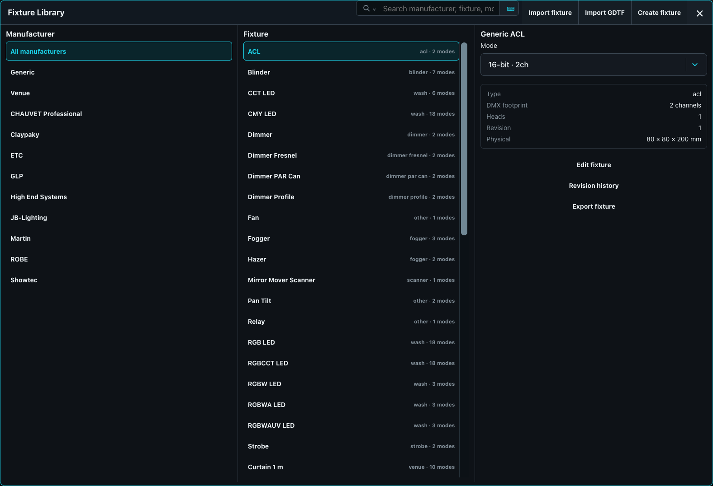
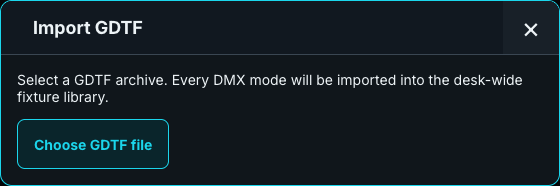
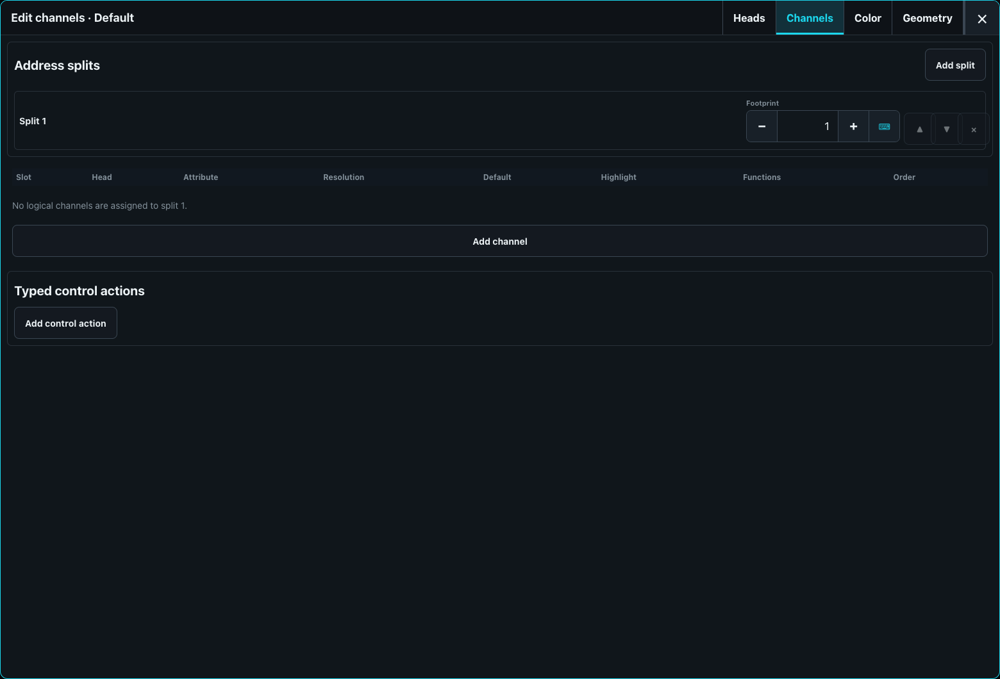
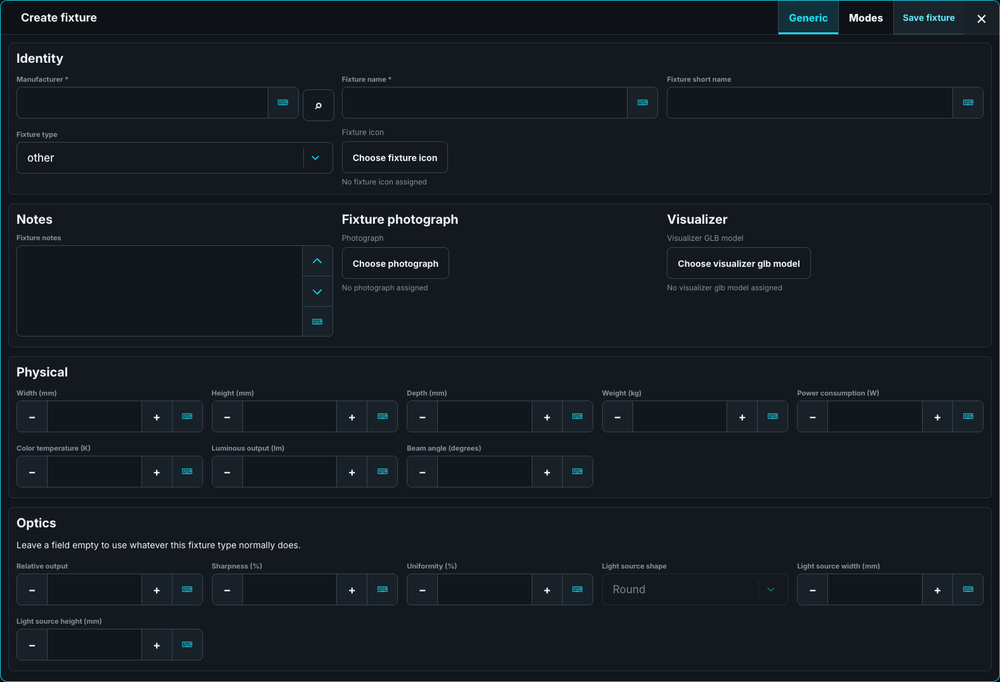

# Fixture Library

The fixture library is desk-wide and persists independently of show files. Open **Desk Setup > Shows & recovery > Open Fixture Library** to launch its modal and search, import, create, revise, and inspect complete fixture profiles. Library search follows the shared [search-bar layout](../01-application-layout.md#search-bars) and filters automatically with every typed character. Its optional Options dialog selects the fixture type. A profile is one revisioned fixture containing Generic information and an ordered set of modes; a patched show embeds the selected profile revision and mode so later library edits or deletion cannot change that show.



The shipped library includes separate conventional **Dimmer PAR Can**, **Dimmer Profile**, and **Dimmer Fresnel** fixture profiles, each with 8-bit and 16-bit dimmer modes. Their transferred GLB models use a PAR housing with a square gel frame, an elongated ellipsoidal-profile housing, and a Fresnel housing with four external barn doors respectively. Choose the fixture profile for the physical lantern rather than treating these appearances as modes of one Dimmer profile.

## Transferable fixture packages

ToskLight has no fixture definitions compiled into the application. Every fixture supplied with the desk is an ordinary `.toskfixture` package, loaded through the same package reader used by **Import fixture**. You can export it, move it to another desk, keep it with a test, unpack and edit it, or replace it with a corrected package without rebuilding ToskLight.

Select a fixture and choose **Export fixture** to download its complete immutable revision. On another desk, choose **Import fixture** and select that file. A package keeps the stable fixture, mode, head, channel, function, split, and geometry IDs. Importing identical content is a no-op; importing changed content with the same fixture ID and manufacturer/name creates the next local revision. Reusing an existing ID for a different fixture family is rejected.

The shipped package directory currently provides an operator-focused Generic family and these manufacturer profiles with complete ordered mode lists:

- **Generic ACL** — a compact 200 mm-long, 80 mm-diameter conventional ACL lamp with aligned lens and beam geometry. **Blinder** provides the seven requested two-, four-, and eight-lamp one-, two-, and four-channel groupings. Each dimmer channel owns a non-master logical head and the corresponding physical emitters. **Fogger** provides Fog, Fan/Fog, and Fog/Fan modes; **Hazer** provides both two-channel orderings.
- **Generic RGBW, RGBWA, and RGBWAUV LED** — one canonical RGB-first emitter order with an 8-bit dimmer first, an 8-bit dimmer last, or a virtual dimmer. **Generic RGBCCT LED** provides the six useful placements of the RGB block, cold white, and warm white (`RGBCW`, `RGBWC`, `CRGBW`, `CWRGB`, `WRGBC`, and `WCRGB`), each with those same three dimmer choices. The library deliberately avoids factorial permutations of individual RGB emitters that do not represent normal fixture personalities.
- **Generic rare-capability references** — **Endless Pan Tilt** retains endless 16-bit axis representation on the canonical Pan and Tilt controls; **Beam Size and Edge** keeps Zoom independent from Softness; **Media Positioning** provides independent media-layer X and Y axes; **Flame Jet** supplies a ToskLight-authored single-nozzle demonstration; and **Kabuki Curtain** maps one raw slot to Reset, Hold, and a latched Release through its portable physics script. These are explicit transferable reference personalities: match their documented channel order to the device rather than treating them as manufacturer profiles.
- **Venue** visual-only profiles — 1 × 1 m, 2 × 1 m, and 1 × 0.5 m stage elements; correctly rising stage stairs; one-, two-, three-, and four-point truss; 1 m, 2 m, 3 m, 5 m, and 6 m curtains; **Disco Ball 50 cm**; and **Crowd Area**. Crowd Area supplies all nine Sitting, Standing still, and Dancing × Sparse, Medium, and Dense modes and stores independent width and depth with the show. The conventional scenery archives include portable icon, photograph, and metre-authored GLB geometry; Crowd Area is rendered procedurally from its portable crowd contract.
- **ToskLight** product and Visualizer profiles — **Audio Player** is an Internal fixture: one independently programmable Audio service voice with Audio Folder/File, Transport, Repeat, and Volume, a regular fixture ID, and no DMX address. **Media Server** provides two complete personalities: 75 slots for two layers and 279 slots for eight layers. Each 34-slot layer is an independently programmable logical head; the trailing 7-slot output block belongs to the shared master head. Existing shows retain embedded snapshots of the former separate Layer and Master profiles, and desks that previously installed those profiles keep them for compatibility, but new patches use this combined fixture. **Visualizer Camera** keeps the stable 17-slot X/Y/Z, Yaw/Pitch/Roll, and Zoom wire contract, while **Visualizer Laser** provides the packaged demo laser and its scan program. This manufacturer is reserved for implemented ToskLight-owned product fixtures; planned further Visualizer fixtures do not appear until their capabilities exist.

- **JB-Lighting JBLED A7** — Standard and Compressed RGB personalities in 8-bit and 16-bit color,
  with the complete shutter-effect table and a documented open shutter as the safe home and
  Highlight look.
- **Martin MAC 250 Entour** — 16 Bit and 16 Bit Extended.
- **High End Systems Trackspot** — the classic seven-channel mirror scanner in low- and high-resolution DMX personalities.
- **Showtec Sunstrip Active DMX** — ten independently controlled tungsten lamps.
- **Showtec Sunstrip LED RGB 42206** — ten independently controlled RGB pixels.
- **ROBE Robin DLS Profile**, **Robin 600X LEDWash**, **Robin LEDBeam 150**, **Robin 300 LEDWash**, and **Robin DLF Wash** — every documented manufacturer personality. The 600X and 300 zone modes expose their three concentric RGBW zones as logical heads.
- **Claypaky Sharpy**, **ETC Source Four LED Series 2 Lustr**, **CHAUVET Professional COLORado 1 Solo**, and **GLP JDC1**. JDC1 SPix modes expose all twelve RGB plate pixels and twelve white beam segments as logical heads.

The Source Four LED Series 2 configuration can independently enable Strobe, Fan Control, and Plus Seven. Its package contains the canonical console personalities, including the common fully enabled and Plus Seven variants, instead of multiplying every fixture-menu option permutation into a separate mode.

Channel order, footprints, fine-byte slots, safe defaults, and physical ranges come from the corresponding manufacturer DMX charts. Shipped packages are not privileged or reserved: after loading, they are normal desk-library profiles. When a newer shipped package is installed, ToskLight updates it only if its last package-installed revision is still current. An operator-created later revision is preserved and reported instead of being overwritten.

### Package layout

A `.toskfixture` file is a ZIP archive with this portable layout:

```text
fixture.json
assets/photograph.png    optional PNG, JPEG, or WebP
assets/icon.png          optional PNG, JPEG, or WebP stage icon
assets/model.glb         optional self-contained glTF Binary 2.0 model
assets/projections/top.svg    optional generated physical-scale vector views
assets/projections/left.svg
assets/projections/right.svg
assets/projections/front.svg
assets/projections/back.svg
assets/gobo-3.png        optional artwork for gobo slot 3, and one file per further slot
assets/scan.js           a laser's scan engine, and only a laser's
```

### The gobo wheel

A gobo channel says which slot is in the beam. Nothing else in a profile can say what is etched on
the glass, so a fixture with a wheel declares it:

```json
"gobos": [
  { "slot": 1, "name": "Breakup", "artwork_asset": "assets/gobo-1.png" },
  { "slot": 2, "name": "Rings",   "artwork_asset": "assets/gobo-2.png" }
]
```

Slot zero is the open slot and is never declared. The artwork is a mask — light passes where the
image is white — and its colour is ignored, because a gobo takes the colour of whatever the
fixture puts through it. A slot may be named without carrying artwork.

Declaring the wheel is worth doing even with no artwork to hand: it tells the Visualizer how many
slots the channel is divided into, which is otherwise a guess. A profile that declares no wheel is
drawn with the Visualizer's own patterns, as the whole library was before packages could carry
glass.

`fixture.json` is UTF-8 JSON. The outer document is deliberately small and can be produced with a normal text editor or an AI fixture-building workflow:

```json
{
  "$schema": "https://tosklight.app/schemas/fixture-package-v1.json",
  "format": "tosklight.fixture",
  "format_version": 1,
  "profile": {
    "schema_version": 3,
    "id": "a-stable-uuid",
    "revision": 1,
    "manufacturer": "Example",
    "name": "Example Profile",
    "patch_policy": "dmx",
    "photograph_asset": "assets/photograph.png",
    "stage_icon_asset": "assets/icon.png",
    "model_asset": "assets/model.glb",
    "model_units": "metres",
    "modes": []
  }
}
```

The `profile` is the same schema-v3 fixture profile edited by the Fixture Library and embedded in patched shows. Schema-v2 profiles normally load through an explicit identity-mapping migration; the unambiguous legacy aliases in the [Attribute Reference](06-attribute-reference-and-activation.md) instead project to their documented canonical identity. A DMX profile uses `"patch_policy": "dmx"`, a 1–512 slot split footprint, and its channels. A scenic object uses `"patch_policy": "visual_only"`, a zero-footprint split, no channels/color/control actions, and geometry; the desk then guarantees that it cannot receive a universe, address, or direct-control endpoint. An application-owned virtual device uses `"patch_policy": "internal"`, zero-footprint splits, and semantic channels without DMX component slots. Internal fixtures use normal positive fixture IDs, cannot receive DMX/direct-control/multipatch assignments, and remain programmable when their desk-local service binding is unavailable. `"model_units": "metres"` preserves authored GLB dimensions exactly, while the backward-compatible `"auto"` value normalizes a conventional lamp model to its profile dimensions. Use an exported package as the safest complete template. Asset fields are either `null` or relative paths under `assets/`. Do not use absolute paths, parent paths, data URLs, external GLB textures, or network URLs inside a package. The package must contain exactly the referenced files and no unreferenced extras.

### Generated plan projections

A package with a 3D model may also carry exactly five generated SVG drawings: top, left, right,
front, and back. Generate them without changing the installed library revision:

```sh
cargo run -p viz-project --bin fixture-projection -- generate source.toskfixture --output projected.toskfixture
```

The command refuses to overwrite its input. Importing the new package follows the normal immutable
revision flow. Each SVG uses millimetres, records its physical `viewBox`, fixture origin, page
orientation, named view, deterministic pose, source-model SHA-256, generator version, and pose
contract version. Front and side drawings pose a moving head down; top poses it toward the front;
fixed fixtures retain their authored home pose.

SVG is the canonical artwork. Printed or bitmap output is rasterized from that SVG and is never a
second authored package asset. The package accepts only opaque move/line paths: no script, event
handler, CSS, font, image, external resource, link, transform, animation, filter, or
environment-dependent reference is allowed. A changed source-model hash or generator/pose version
makes the stored projection cache stale. Regeneration produces a new package; it never rewrites an
operator's installed revision.

To author one manually, export a similar fixture, rename `.toskfixture` to `.zip`, unpack it, edit `fixture.json`, add or replace assets, ZIP `fixture.json` and `assets/` at the archive root, then restore the `.toskfixture` extension. Keep existing UUIDs when correcting the same fixture; generate new UUIDs for a genuinely different fixture, mode, head, channel, or function. Never derive identity from display text or DMX row position.

For safety, import rejects unsafe or duplicate paths, symbolic links, unsupported compression, undeclared files, invalid raster data, unsafe or metadata-mismatched SVGs, stale projection hashes, non-self-contained GLBs, archives over 64 MiB compressed or 128 MiB expanded, more than 32 entries, and manifests over 64 MiB. The supported MIME type is `application/vnd.tosklight.fixture+zip`.

If a new package uses a canonical attribute ID that the active show does not know, import pauses
without storing the profile. The import dialog names every unknown ID and lets you map each one to
an active configured descriptor with the same value type. The fixture-facing ID remains in the
package revision while the chosen descriptor becomes its canonical Programmer identity. To retain
a new identity instead, create a custom descriptor with a unique encoder position and activation
group under **Show → Desk Setup → Programmer → Attributes**, then choose the unchanged source file
again. Existing profile revisions with preserved unknown IDs remain readable and exportable; this
preflight applies when new fixture data enters the library.

## Import GDTF

Choose **Import GDTF** and select a `.gdtf` archive. ToskLight normalizes the supported modes, channels, physical information, emitters, capabilities, geometry, and model into a fixture profile and retains the original GDTF bytes beside every resulting immutable revision. MVR export can therefore use the retained source instead of reconstructing an archive from lossy normalized data.

The same canonical-attribute preflight applies before a newly normalized GDTF profile is stored. An
import or migration error leaves the original data untouched and appears in the open import dialog
or as an actionable warning in the Fixture Library. Do not delete the source row until the warning
has been investigated or the fixture has been recovered.



## Create or edit a fixture profile

**Create fixture** opens a blank profile with one mode named **Default** and one editable main head. **Edit as new revision** opens the same editor with the chosen revision. The title bar contains **Generic**, **Modes**, **Save fixture**, and Close; the Modes tab also adds **Add mode** at the top right. There is no footer Cancel action.

Closing an unchanged editor is immediate. Closing a changed editor through Close, Escape, or the backdrop asks whether to **Stay** or **Discard changes**. Saving an existing profile first asks to **Save and create revision**. A failed or stale save keeps the editor open and explains the problem.

### Generic

Generic information includes manufacturer, full and short names, fixture type, notes, stage icon, photograph, optional visualizer GLB model, dimensions, weight, power consumption, color temperature, luminous output, and beam angle. Notes, photograph, and visualizer are shown side by side; drag the visualizer preview to inspect the GLB from another angle and scroll to zoom. Manufacturer remains free text. Use its lookup button to search the unique desk-library manufacturers with the shared full-text keyboard and fill the field without saving the editor.

### Optics

Optics decide what light out of this fixture looks like in the visualizer, as against how the
fixture is built. Two lanterns at the same angle, at the same level, do not look alike: a profile
lays down a flat disc with a rim you could cut paper on, a PAR is hot in the middle inside a soft
halo, a flood has no rim at all.

- **Relative output** is how much light the engine makes, `1` being an ordinary fixture of its
  type. A 400 W head against a 100 W one, before anyone touches a dimmer.
- **Sharpness** is how hard the rim of the field is. 100% cuts; 0% has no edge to speak of. A focus
  or frost channel softens whatever is set here, so a profile out of focus still reads as a
  profile.
- **Uniformity** is how evenly the field is filled: 100% is flat to the rim, 0% a bright centre
  that falls away quickly. It is separate from sharpness — a good LED wash has no rim at all and is
  still even across the middle.
- **Light source** is the lit surface itself: its shape, and its width and height in millimetres.
  It belongs to the fixture rather than to one patched lamp, because every lantern of this type has
  the same lens. A shaft leaves it at that width instead of springing from a point. A lens needs
  both dimensions; clearing either one hands the fixture back to its type.

Every field is optional, and an empty field means *whatever this fixture type normally does*. The
shipped library leaves them empty, so a profile is treated as a profile, a Fresnel as a Fresnel,
and a cyc flood as a flood, from the fixture type alone. Fill them in when the type's answer is not
right for the lantern in front of you.

### Modes and heads

Modes have stable identities, names, notes, and complete channel configuration. Each row in the full-width Modes list edits that mode's name and notes directly and summarizes its heads, logical channels, and splits. Add modes from the title bar; remove and reorder them with drag-and-drop or the explicit move buttons. The final mode cannot be removed. **Edit channels** opens the nested tabs in this order: **Heads**, **Channels**, **Color**, and **Geometry**.

Every head has a stable identity and an optional master/shared designation. Heads describe logical emitters, not patch blocks: one head may own channels in several independently patched splits. At most one head is master/shared. A head that still owns channels cannot be removed until those channels are reassigned or removed.

A split is an independently patchable address block configured in Channels. Give each split its footprint there and assign every physical channel to a split; each split gets its own optional universe and address in Show Patch. An unpatched split remains selectable, programmable, and visible but emits no DMX.



### Channels

For multi-split modes, Channels shows one accordion per split and keeps exactly one open. A single-split mode shows its table directly. The table uses large touch-sized summary cells; selecting a cell opens the labeled channel editor. Channel role is selected from the desk's supported attribute registry, with Static output as an explicit role, rather than entered as free text. Channel functions open in their own nested modal. Rows support touch drag-and-drop and explicit keyboard/accessibility move controls.

The primary DMX slot is derived from row order. Fine, Third byte, and Fourth byte contain explicit component slots for 16-, 24-, and 32-bit channels; reserved component slots are skipped when later primary slots are calculated. Default, Highlight, function ranges, and fixed values are exact raw integers at the selected resolution. Saving is blocked when slots overlap, exceed 512, do not fit the resolution, or lie outside the split footprint.

**Default raw** is the home value a channel holds while no Programmer value, Cue, or function drives it. Across the shipped library that home look is deliberate rather than arbitrary: colour rests at physical white and absolute Pan and Tilt rest at their mechanical centre. Direct Red, Green, Blue, White, Cold White, and Warm White emitters sit at their full endpoint; subtractive Cyan, Magenta, and Yellow sit at zero filtration, which is canonical white after the inverse mapping; a discrete wheel sits on its Open/White slot. Amber, UV, and other tinting emitters stay off so the home look is neutral, endless Pan and Tilt stay stopped, and hazardous or unrelated functions keep their safe value. Because it is a raw wire value, a channel's own inversion and its canonical mapping are both read back before the desk shows a home value, so an unprogrammed CMY lantern reports white rather than black. A home colour is not extra output: intensity still homes to zero, and a head with a derived virtual dimmer stays dark until that dimmer is raised.

**Highlight raw** defines the profile-level identification look used while that channel's fixture or logical head is highlighted. A newly derived default uses full conventional intensity and physical white: direct RGB/RGBW white endpoints, calibrated additive or subtractive D65 white, zero CMY filtration, and the midpoint of a discrete wheel slot explicitly named Open, White, Clear, or No Color. Inversion is included when choosing a raw endpoint. If no white wheel slot can be identified, that channel keeps its safe default instead of using an arbitrary maximum. Set any required shutter-open channel deliberately, and leave Position and unrelated or hazardous functions at an appropriate safe/default raw value. Validate the complete look on the real fixture; Highlight raw is physical output configuration, not a normalized programmer value.

Changing a newly added channel's attribute, additive/subtractive calibration, or discrete-wheel Open/White slot recalculates its semantic Highlight default only while the field still contains the previous automatic value. This lets an untouched wheel channel move from its safe default to the Open/White midpoint when that slot is defined. Once an operator enters an exact Highlight raw value, later channel or Color-tab edits preserve it. Existing schema-v2 revisions are likewise never renormalized on load or save.

Each channel retains its fixture-facing attribute identity and explicitly maps it to one canonical Programmer attribute. The mapping is normally identity; subtractive Cyan, Magenta, and Yellow filtration map inversely to canonical Red, Green, and Blue. It also configures physical range/unit, fixture-channel inversion, snap, virtual-intensity reaction, sequence/group/grand-master reactions, and prioritized functions. Exact raw and typed control values are never reinterpreted by the canonical normalized mapping. **Static** channels normally output their default and use their Highlight value only while identified. Snap channels bypass programmer, Cue, Move in Black, and safety transitions.

A physical channel may contain ordered continuous, fixed, indexed-color/gobo, or control functions. Each function keeps its stable ID, semantic attribute, name, exact raw range/value, priority, and action behavior in the portable profile. Fixed, indexed, and control are behaviors inside that semantic attribute, not separate Programmer attributes or encoder families. The encoder's **Set Value → Indexed Presets** tab projects those functions from the exact profile revision embedded in the active show.

Only an explicitly programmed function claims its channel; the highest configured priority wins, and releasing it reveals the next claim or channel default. Typed control actions can atomically set several channels and be latched, momentary, or timed. Assign their operator meaning explicitly as Lamp On, Lamp Off, Reset, Fan Auto, Fan Low, Fan High, Fan Max, or Custom. Lamp On is the fixture manufacturer's discharge-lamp ignition/strike command; it does not set intensity or color and fixtures without that authored action are skipped. Lamp On, Lamp Off, and Reset are normally momentary or timed runtime overrides and are never recorded or persisted as programmer values. Releasing them reveals the latest underlying value on a shared control channel, so a latched fan mode remains in force. Fan modes are normally latched. Highlight is a separate transient identification look and is toggled off with Highlight itself; it is not a control action or programmer value. All authored control actions appear by name in **Control → Special Dialog** and under their semantic encoder's **Indexed Presets** tab.

### Color

Color remains an abstract XYZ request across fixtures. Additive systems bind measured XYZ or xyY emitters, maximum level, response curve, and visible-color participation. Subtractive systems bind CMY channels. Discrete wheels store portable semantic color IDs, local labels, DMX ranges, and optional measured color. The engine uses bounded non-negative mixing and deterministic gamut clipping, with direct RGB or CMY fallback when calibration is unavailable. UV and other non-visible emitters participate only when explicitly programmed.

Portable presets are never created merely by patching. Use **Generate portable presets** in **Control → Special Dialog** for the selected fixtures to add stable fixed/indexed semantic choices to the show.

### Geometry

Start with **Fixed fixture**, **Moving head**, **Bar**, **Matrix**, or **Shared-pan multi-head**, then edit the generated hierarchy. Parts have parents, transforms, pivots, optional GLB-node bindings, and attribute-driven rotation or translation. Emitters attach to any part and define logical head, origin, orientation, beam and field angles, feather, focus, point/matrix/ring/strip/explicit-pixel layout, and whether the source projects a directional beam. Disable **Projects a directional beam** for broad sources such as strobes and Sunstrip-style emitters; their inactive lens remains visible in Stage without receiving an aim guide.

The editor preview and Stage visualizer use the configured graph, multiple emitters, resolved motion attributes, and the same resolved color used for output. This supports a shared pan ancestor with independent tilt children and multiple offset beam sources instead of assuming one hard-coded beam.

## Revisions and compatibility

The server assigns revision numbers atomically and rejects concurrent edits. Open **Revision history** to inspect immutable revisions, edit an older revision as a new one, or delete an unused revision. Deletion warns when a patched show embeds that revision; the show's snapshot remains intact even if deletion is confirmed.

Legacy library entries migrate through an explicit schema-v1 reader. Compatible modes are combined only when their fixture-family metadata agrees; conflicts remain separate and produce a visible warning. Installations that predate transferable packages remove only the historical code-owned catalog rows, then load the equivalent `.toskfixture` files as ordinary profiles. User-authored profiles are never claimed by manufacturer or model name.

During legacy or GDTF migration, intensity, RGB/RGBW/additive, CMY/subtractive, and identifiable Open/White wheel channels receive the same deterministic physical Highlight defaults; unmatched wheel, Position, and unrelated channels retain their source defaults. Existing authored schema-v2 Highlight raw values are preserved exactly. A patched fixture without a per-instance Highlight override map inherits those values from its embedded profile revision. Later desk-library edits therefore do not silently change the Highlight Look already stored with a show.


