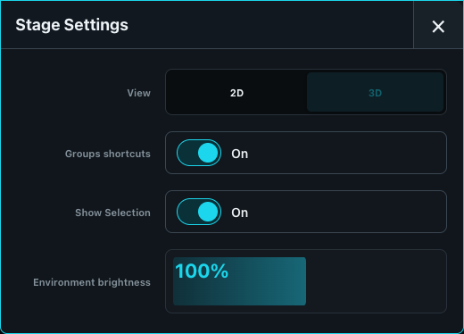

# Stage Positions and Scenery

Stage provides both an operator selection surface and a saved spatial model.

## Position fixtures

Open **Stage**, choose 2D or 3D in settings, and switch to **Setup positions**. Drag fixtures to their intended locations. In 3D, use the position and rotation controls for accurate meter-based placement. Multi-patch instances can have their own physical positions while sharing logical programming.

Switch back to **Select fixtures** for programming or **Navigate** to orbit and inspect without moving show objects. The position data is stored in the show.

In 3D, **Beam direction guides** adds a dotted aim line while a directional emitter is off. This applies to fixed Profiles, Fresnels, PARs, washes, and moving fixtures alike. Emitters marked as broad sources, such as strobes and Sunstrip-style fixtures, remain visibly distinct from their dark housings but do not receive an aim line. The full Stage and every Stage pane can disable these guides independently in their settings.

The mode buttons exist only in the full Stage built-in. A Stage pane can display the current global setup mode, but it cannot enter Setup positions by itself.

## Add scenery and models

Add scenery through **Show > Show Patch**. Choose a visual-only profile from the **Venue** manufacturer, such as Stage, Truss, Pipe, or Curtain. Patch assigns these objects IDs in the reserved `0.x` range (`0.1`, `0.2`, and so on) and does not ask for a DMX address. Return to 3D **Setup positions** to position and rotate them.

Stage does not maintain a second scene-asset collection. Standalone MVR geometry is reported as an import warning; recreate required scenery with Venue fixtures so it remains visible and editable through Patch and the Fixture Library.

## Visualization limits

Stage is a programming aid, not a photometric proof. Check real fixtures and DMX output for focus, color, beam, and intensity. Use **Follow Preload** to choose whether Stage displays the live scene or the active Preload scene.
