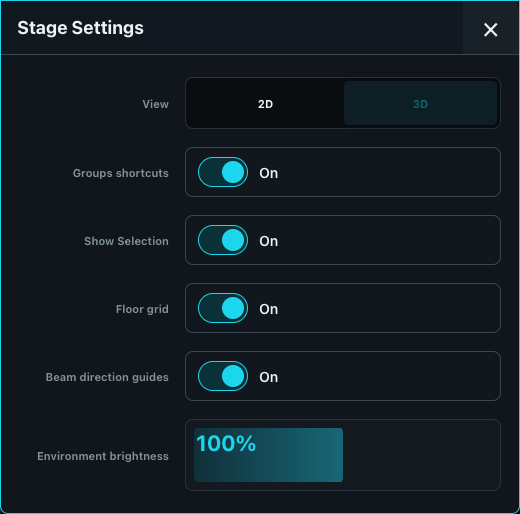

# Stage Positions and Scenery

Stage provides an operator selection surface for the saved spatial model; the model itself is edited in **Show Patch**.

When a show has 3D fixture positions but no manually authored 2D placement, ToskLight creates a deterministic 2D layout automatically. Open the full Stage settings to see whether the 2D layout is **Automatic** or **Manual**. The writable primary desk can deliberately choose one of the six named orthographic projections and press **Regenerate 2D layout**. This replaces the 2D placement; it does not move the fixtures in 3D. Manual 2D placement remains protected from later automatic updates until this command is used.

## Position fixtures

Fixture positions and rotations are part of the patch: open **Show > Show Patch** and edit a fixture's placement for accurate meter-based values. Multi-patch instances can have their own physical positions while sharing logical programming.

Press **Preview Stage** in the Show Patch title bar to check the result visually while patching. The overlay is movable — drag its top grip to reposition it over the Patch. On the desktop app, a long press on **Preview Stage** opens a dedicated **Stage View** window: a view-only 3D stage on its own OS window (for example on a second display). Clicking fixtures there selects them on the desk, so the matching Patch rows highlight in the main window.

The Stage built-in offers **Select fixtures** for programming and **Navigate** to orbit and inspect without moving show objects; it does not edit positions.

In 3D, **Beam direction guides** adds a dotted aim line while a directional emitter is off. This applies to fixed Profiles, Fresnels, PARs, washes, and moving fixtures alike. Emitters marked as broad sources, such as strobes and Sunstrip-style fixtures, remain visibly distinct from their dark housings but do not receive an aim line. The full Stage and every Stage pane can disable these guides independently in their settings.

## Add scenery and models

Add scenery through **Show > Show Patch**. Choose a visual-only profile from the **Venue** manufacturer, such as Stage, Truss, Pipe, or Curtain. Patch assigns these objects IDs in the reserved `0.x` range (`0.1`, `0.2`, and so on) and does not ask for a DMX address. Position and rotate them through their patch placement like any other fixture, with **Preview Stage** open for visual feedback.

Stage does not maintain a second scene-asset collection. Standalone MVR geometry is reported as an import warning; recreate required scenery with Venue fixtures so it remains visible and editable through Patch and the Fixture Library.

## Visualization limits

Stage is a programming aid, not a photometric proof. Check real fixtures and DMX output for focus, color, beam, and intensity. Use **Follow Preload** to choose whether Stage displays the live scene or the active Preload scene.
