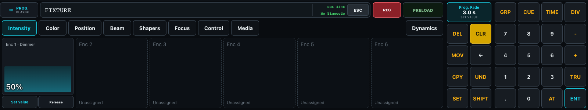

# Command Line Reference

You can program the entire desk from the command line.

With no active command, the command line contains the full editable default `FIXTURE` or `GROUP`. As soon as a selection is entered, those targets shorten to `F` and `G`: Fixture mode displays `F7 + F8`, while Group mode displays `G7 + G8`. Press `[GRP] [ENT]` by itself to change the persistent default; `[CLR]` and `[ESC]` restore its full word. After Plus, `[GRP]` selects the opposite target for that term, so Fixture mode can display `F7 + G8` and Group mode can display `G7 + F8`. Record operations are the exception: `[REC] [+] [GRP] 3` remains `RECORD + GROUP 3` because `[+]` selects the Merge operation and `GROUP` is the storage target.

## Inspect recent commands

Click or tap the Command Line to open **Command Line History** near the top of the desk. It lists this desk's 50 most recent completed commands newest-first, including whether each command was accepted or rejected, its result or error, execution time, and whether it came from the desk UI or attached OSC hardware. Software, keyboard, and attached-hardware input that shares the authoritative command line creates one entry when Enter is pressed.

Opening, closing, or inspecting history does not change the unfinished command in the normal command-line field. Choose **Reuse** to copy an earlier command into that field; it is not executed until you press `[ENT]`. Escape, the close button, and a pointer press outside the panel close it while preserving the current input.

History is transient desk state. Reconnecting to the same running desk restores its recent entries, while restarting the server starts a fresh history. Authentication-like command text containing password, passcode, token, secret, authorization, or API-key terms is retained only as a redacted entry.

## Syntax in this document

The examples below use the following notation:

| Notation | Meaning |
| --- | --- |
| `<part>` | A part of a command that usually consists of multiple button presses. |
| `<part*>` | A part entered on the touchscreen by selecting an element in the UI. |
| `<part+>` | A software element or physical control, such as a playback button. |
| `[KEY]` | Press a desk, console, or software-keypad button once. These use dark console keycaps. |
| `[KEY][KEY]` | Press the same desk button twice. |
| `[KEY+]` | Hold a desk button until its action occurs. |
| `[KEY*]` | An optional desk-button press. It is accepted, but not required. |
| `[KBD:KEY]` | Press a key on the computer keyboard. These use light keycaps marked **keyboard**. |
| `1.3` | A specific value; in this example, the same as `[1][ . ][3]`. |
| `\|` | Separates alternative command forms. |

## Available buttons and computer shortcuts

The **Desk key** is the button shown on the touchscreen keypad or console. The **Computer keyboard** column is a shortcut, not another console command. Keyboard positions describe a German keyboard; the physical key position remains stable if the browser reports a shifted glyph.

| Desk key | Button | Computer keyboard | What it does |
| --- | --- | --- | --- |
| `[0-9]` | Numbers | `[KBD:NUMPAD 0-9]`, optionally `[KBD:0-9]` | Enter numeric values. Regular number-row shortcuts can be disabled in settings. |
| `[TRU]` | Thru | `[KBD:ß]` | Define a range. |
| `[+]` | Plus | `[KBD:NUMPAD +]` or `[KBD:+]` | Add to a range or offset a subset. |
| `[-]` | Minus | `[KBD:NUMPAD -]` | Remove fixtures from a selection; after `[AT]`, subtract a value. |
| `[AT]` | At | `[KBD:#]` | Separate the selection from the value. Press `[AT][AT]` for `[AT][FULL][ENT]`. |
| `[TIME]` | Time | - | Give a value or recorded Cue an explicit fade time; press twice for `DELAY`. |
| `[SHIFT]` | Shift | - | Latch the shifted keypad layer for the next desk key. With Record it enters Update. |
| `[.]` | Dot | `[KBD:.]` | Separate address/value parts or enter a decimal point. Press `[.][.]` for `[AT] 0 [ENT]`. |
| `[HIGH]` | Highlight | `[KBD:ALT]` + `[KBD:H]` | Toggle the transient Highlight Look for the actual current selection without changing that selection. |
| `[PREV]` | Previous selection item | `[KBD:ALT]` + `[KBD:LEFT]` | From ALL, select the last item; while stepped, select the previous item and wrap at the start. |
| `[NEXT]` | Next selection item | `[KBD:ALT]` + `[KBD:RIGHT]` | From ALL, select the first item; while stepped, select the next item and wrap at the end. |
| `[ALL]` | Restore complete selection | `[KBD:ALT]` + `[KBD:A]` | Re-resolve the remembered live selection source and restore its complete current ordered membership. |
| `[DIV]` | Division | `[KBD:´]` | Edit a selection or separate multiple values. Hold for selection options. |
| `[GRP]` | Group | `[KBD:SHIFT]` + `[KBD:^]` | Select a group; press twice to reference its fixtures instead. |
| `[CUE]` | Cue | `[KBD:SHIFT]` + `[KBD:?]` | Separate a playback address from its cue number. |
| `[SET]` | Set | `[KBD:HOME]` | Set a value, assign a control, or open configuration. |
| `[REC]` | Record | `[KBD:END]` | Store cues, presets, and groups. Hold for record options. |
| `[DEL]` | Delete | `[KBD:SHIFT]` + `[KBD:´]` | Delete a cue, preset, or other supported element. |
| `[MOV]` | Move | `[KBD:SHIFT]` + `[KBD:#]` | Move a cue or preset. |
| `[CPY]` | Copy | `[KBD:SHIFT]` + `[KBD:+]` | Copy a cue or preset. |
| `[ENT]` | Enter | `[KBD:ENTER]` | Confirm the command. |
| `[PRE]` | Preload | `[KBD:^]` | Run Preload or Preload GO. Hold to clear Preload. |
| `[CLR]` | Clear | `[KBD:DELETE]` | Clear the selection first, then the programmer. |
| `[ESC]` | Escape | `[KBD:ESC]` | Close menus; with all menus closed, clear the command line. |
| `[BACKSPACE]` | Backspace | `[KBD:BACKSPACE]` | Remove the last command token. |
| `[SELECT]` | Select | `[KBD:SHIFT]` + `[KBD:Z]` | Enter the operator selection command. |
| `[UND]` | Undo | - | Undo the latest programming change; playback execution and fader changes are unaffected. |

Playback shortcuts are `[KBD:PAGEUP]` and `[KBD:PAGEDOWN]` for playback pages, `[KBD:F1]` through `[KBD:F8]` for the first button of paged Playbacks 1 through 8, and `[KBD:F9]` through `[KBD:F13]` for Speed Groups A through E.

## Typical layout on the software desk

The remaining `[PRE]` and `[ESC]` buttons are in or next to the command-line display. Shortcuts are disabled while console hardware is connected. They also pause while an ordinary text input is focused; command inputs still receive command shortcuts, `[ENT]` confirms them, and `[ESC]` closes the active input or dialog.

The num block places `[HIGH]`, `[PREV]`, `[NEXT]`, and `[ALL]` in one horizontal row directly above `[GRP]`, `[CUE]`, `[TIME]`, and `[DIV]` respectively. HIGH contains only the centered text `HIGH`: it uses the ordinary neutral key treatment while inactive and the same visibly lit armed/active treatment as SHIFT or SET while Highlight is active, including with an empty selection or safety-suppressed output. There is no Capture key and `Alt+C` has no Highlight action.

The command-bar space between the command line and the REC/Preload controls contains no Highlight status menu, selection summary, or suppression panel. Normal state is visible through the HIGH key's lit/unlit state and the Fixture Sheet's complete-versus-stepped selection treatment. An actionable Highlight error opens a dedicated dismissible alert above panes and modal surfaces without changing the num-block grid or the HIGH key's size.

On the software desk, **Programmer Fade** occupies exactly two button columns by two complete button rows. Its label, current value, unit, and touch/value interaction remain visible, and the next command row follows after the ordinary num-block grid gap.

The hardware simulator keeps the same HIGH/PREV/NEXT/ALL column alignment but uses the two-column-by-two-row command area for **RECORD** and **PRELOAD GO**: each button occupies one column and both rows. Its fader area shows equal full-height **Programmer Fade** and **Cue Fade** faders directly beside each other. The simulator has no separate Highlight display or status panel; authoritative selection and step details remain on the main desk's Fixture Sheet and in protocol feedback.

Except for `[KBD:SHIFT]` + `[KBD:Z]`, letter keys remain free for typing and future custom shortcuts.

The software shortcuts are disabled while hardware is connected.

`[ ^ ]` is latched for one following key on software/touch desks. Its software assignments are `[ ^ ][.]` Help, `[ ^ ] 0` Fixtures, `[ ^ ] 1` Groups, `[ ^ ] 2` Presets, `[ ^ ] 3` Cuelists, `[ ^ ] 4` the selected playback's Cue details, `[ ^ ] 5` Dynamics, `[ ^ ] 6` Channels, and `[ ^ ] 7` through `[ ^ ] 9` the first three saved Desktops.

On attached hardware, keep `[ ^ ]` pressed while pressing the modified button. Hardware shortcuts `[ ^ ] 1` through `[ ^ ] 9` open Stage, Fixtures, Groups, Presets, Cuelists, Channels, DMX, Dynamics, and Help respectively. Hardware `[ ^ ] 0` has no operator-window assignment; Development diagnostics are available only through the **Desk Status** developer menu.

`[ ^ ] 4` opens the Cue details for the active playback. The active playback is an operator selection, not merely the most recently running playback.

### Speed-group shortcut

Press `[SHIFT] [TIME]` to enter `SPD GRP`. The speed-group numbers `1` through `5` correspond to Speed Groups A through E.

| Action | Command | Result |
| --- | --- | --- |
| Set a whole-number BPM | `[SHIFT] [TIME] 1 [AT] 120 [ENT]` | Set Speed Group A to 120 BPM. |
| Set a fractional BPM | `[SHIFT] [TIME] 2 [AT] 127,5 [ENT]` | Set Speed Group B to 127.5 BPM. A comma may be used as the decimal separator. |
| Increase relatively | `[SHIFT] [TIME] 1 [AT] [+] 5 [ENT]` | Add 5 BPM to Speed Group A. |
| Decrease relatively | `[SHIFT] [TIME] 1 [AT] [-] 5 [ENT]` | Subtract 5 BPM from Speed Group A. |
| Synchronize two groups | `[SHIFT] [TIME] 1 [AT] [SHIFT] [TIME] 2 [ENT]` | Copy Speed Group A's BPM and phase to Speed Group B and keep A and B synchronized. |

The two speed groups remain synchronized until you set a BPM directly for either group or tap either group to set its tempo.

## Moving and copying Cues

Address a Cue through its pool playback number: `[CPY] [SET] 1 [CUE] 2 [AT] [SET] 2 [CUE] 2 [ENT]`, or begin with `[MOV]` to move it. Entering the complete command opens a required choice instead of guessing the transfer meaning:

- **Plain Copy** or **Plain Move** transfers only the selected Cue's stored commands and deltas.
- **Status Copy** or **Status Move** materializes the complete tracked source status for attributes touched at or before that Cue.
- **Cancel** closes the choice without changing either Cuelist.

Copy retains the source Cue. Move removes it and recalculates tracking from the remaining stored Cues. The Plain/Status choice independently controls the destination contents.

## Selecting fixtures

A number without `[GRP]` always identifies a fixture. `[ENTER]` completes the selection. Fixture IDs that do not exist are ignored; they do not make the command fail.

### Building a selection across the desk

Selection is additive until you replace or clear it. You can select one fixture, then another fixture, then a group, and all of them remain selected. This works the same way with Stage clicks, a Stage marquee, Fixture Sheet rows, the Groups pool, and command-line selections. You do not need to hold a modifier key when moving between those surfaces.

Each additional selection behaves like adding another range with `[+]`. Fixtures and groups can be combined, and overlapping fixtures appear only once in the resolved selection. Group selections remain identifiable as group references.

This open selection gesture belongs to the desk, not to the logged-in user globally. Two sessions attached to the same desk share the same consecutive clicks, ordered source references, and partial command exactly as if every button had been pressed on one physical console. A different desk used by the same operator may build a different selection. Once a value is confirmed, that fixture- or Group-scoped value lands in the operator's shared programmer and is visible from all of that user's sessions; it does not copy the originating desk's partial button or selection gesture to another desk.

The selection stays current after you add or change a programmer value, move an encoder, or recall a preset. That lets you continue directly: `1 [+] 2 [AT] 75 [ENTER]`, then `[AT] 50 [ENTER]`, changes the same two fixtures from 75% to 50%.

The next fixture or group selection replaces the current targets unless it begins with `[+]`. For example, after `1 [+] 2 [AT] 75 [ENTER]`, entering `3 [AT] 80 [ENTER]` leaves fixtures 1 and 2 at 75% and sets only fixture 3 to 80%. Entering `[+] 3 [AT] <value-or-preset> [ENTER]` instead continues the selection, so fixtures 1, 2, and 3 receive the new value or preset.

Press `[CLR]` once to clear the current selection explicitly without clearing its programmed values. If programmer values remain, the Clear button blinks; press `[CLR]` again to clear those programmer values.

| Selection | Command | Result |
| --- | --- | --- |
| One fixture | `1 [ENTER]` | Select fixture 1. |
| Complete multi-head fixture | `100 [ENTER]` | Select master 100.0 followed by every child head. |
| Multi-head masters | `100.0 [THRU] 110.0 [ENTER]` | Select only the masters of fixtures 100 through 110. |
| Multi-head children | `100 [THRU] 110 [ENTER]` | Select every child head in the range, excluding the masters. |
| One child head | `100.2 [ENTER]` | Select only child head 2 of fixture 100. |
| Fixture range | `1 [THRU] 10 [ENTER]` | Select every existing fixture with an ID from 1 through 10. |
| Combined ranges | `1 [THRU] 10 [+] 20 [THRU] 30 [ENTER]` | Select every existing fixture from 1 through 10 and from 20 through 30. |
| Remove from a range | `1 [THRU] 10 [−] 5 [ENTER]` | Select fixtures 1 through 10 except fixture 5. |

`[+]` extends the current selection. All parts joined with `[+]` form one ordered selection for any subsequent subsetting operation.

`[−]` removes the fixtures or ranges that follow it from the selection built on its left. It can be repeated, and the remaining ordered selection is then passed to `[DIV]`.

Child heads use one-based sub-addresses, while `.0` identifies the shared master. A standalone multi-head fixture ID expands to its master and children. A bare range expands multi-head fixtures to their children so effects run across their individually controllable light sources; a `.0` range selects the masters instead.

### Subsetting a selection

`[DIV]` selects fixtures by their position in the full ordered selection, not by their fixture ID. A missing divisor defaults to 2.

| Subset | Command | Result |
| --- | --- | --- |
| Every second fixture | `<selection> [DIV] 2 [ENTER]` | Select positions 1, 3, 5, and so on. `<selection> [DIV] [ENTER]` is equivalent. |
| Every third fixture | `<selection> [DIV] 3 [ENTER]` | Select positions 1, 4, 7, and so on. |
| Offset a subset | `<selection> [DIV] 2 [+] 1 [ENTER]` | Select positions 2, 4, 6, and so on. |
| Other offsets | `<selection> [DIV] 3 [+] 1 [ENTER]` `<selection> [DIV] 3 [+] 2 [ENTER]` | Shift the starting position of every-third-fixture selection by one or two positions. |
| Even-selection shortcut | `<selection> [DIV][DIV] [ENTER]` | Shortcut for `<selection> [DIV] 2 [+] 1 [ENTER]`. |

For example, when `<selection>` is `1 [THRU] 10 [+] 20 [THRU] 30`, `[DIV]` continues through that entire combined selection rather than restarting at fixture 20.

### Groups and group references

`[GRP] <group-number>` selects a group by reference. The reference remains connected to the source group: if the fixtures in the source group change later, programming and derived groups that retain this reference change with it.

| Group selection | Command | Result |
| --- | --- | --- |
| Reference a group | `[GRP] 1 [ENTER]` | Select group 1 as a live reference. |
| Reference a subset | `[GRP] 1 [DIV] 2 [ENTER]` | Select every second fixture in group 1 while retaining the group reference. |
| Dereference a group | `[GRP][GRP] 1 [ENTER]` | Select the fixtures currently in group 1 as individual fixtures. Later changes to group 1 do not affect this selection. |

Double-pressing a group in the Groups pool also dereferences it. A group recorded from a referenced or subdivided group retains that relationship; a group recorded from a dereferenced selection stores the individual fixtures instead.

## Setting values

`<selection> [AT] <value> [ENTER]` assigns a value to the selection. A plain number is an intensity value from 0 through 100. A value containing `[ . ]` references a preset.

| Value | Example | Result |
| --- | --- | --- |
| Intensity | `<selection> [AT] 75 [ENTER]` | Set the selected fixtures to 75% intensity. |
| Relative increase | `<selection> [AT] [+] 5 [ENTER]` | Add five percentage points to each selected fixture's current intensity. |
| Relative decrease | `<selection> [AT] [−] 5 [ENTER]` | Subtract five percentage points from each selected fixture's current intensity. |
| All preset | `<selection> [AT] 0.1 [ENTER]` | Apply All preset 1. |
| Intensity preset | `<selection> [AT] 1.1 [ENTER]` | Apply Intensity preset 1. |
| Color preset | `<selection> [AT] 2.1 [ENTER]` | Apply Color preset 1. |
| Position preset | `<selection> [AT] 3.1 [ENTER]` | Apply Position preset 1. |
| Beam preset | `<selection> [AT] 4.1 [ENTER]` | Apply Beam preset 1. |

Relative values are calculated independently for every selected fixture and clamped to the attribute's valid range. A live Group reference must be dereferenced with `[GRP][GRP]` before using a relative value so the per-fixture results can be retained.

An attribute touch encoder shows its new target immediately: moving it or entering `100` through **Set value** makes the encoder read 100% at once. The resolved value in the Fixture Sheet and the actual output still interpolate to that target over Programmer Fade. That fade belongs to the programmer value, so recording it into a scene/Cue retains the timing for later playback; an explicit `[TIME]` overrides it for that value.

### Value fade and delay times

Append `[TIME] <seconds>` to override Programmer Fade for only the values in this command. Pressing `[TIME]` twice changes the second press to `DELAY` in the command line; append the delay in seconds after it. Fade and delay may appear in either order because fading always begins after the delay.

| Timing | Command | Result |
| --- | --- | --- |
| Fade override | `<selection> [AT] 100 [TIME] 2 [ENTER]` | Fade these values over two seconds instead of using Programmer Fade. |
| Delay then fade | `<selection> [AT] 100 [TIME][TIME] 1 [TIME] 2 [ENTER]` | Display `DELAY 1 TIME 2`, wait one second, then fade for two seconds. |
| Fade then delay | `<selection> [AT] 100 [TIME] 2 [TIME][TIME] 1 [ENTER]` | Produce the same timing with the clauses entered in the opposite order. |

The programmer remembers fade and start delay on each changed value. When no `[TIME]` is entered, it resolves the current Programmer Fade when the value is written; recording therefore preserves that duration rather than looking up a possibly different setting during playback. Recording several values with different command times into one Cue preserves those individual timings. A legacy or imported value with no retained per-value fade uses the Cue's master Fade, then the configured Cue Fade fallback. A value without an explicit start delay uses the Cue's master Delay. Cue Delay is edited in the Cuelist View. `DELAY` has a different scope in a Cue-record command: there it stores the Cue's GO/FOLLOW/TIME trigger as described below, not Cue Delay or an attribute start delay.

## Recording

After building a scene in the programmer, press `[REC]` and choose a recordable target in the UI. Targets include presets, groups, and Cuelists in their pools, as well as playback buttons and faders on physical or simulated hardware. Recording a Cuelist in the pool does not assign it to any playback page.

The key immediately after `[REC]` chooses the record operation:

- no modifier means **Overwrite**;
- `[+]` means **Merge** the current selection or values into the target; and
- `[-]` means **Subtract** the current selection or values from the target.

For a Group or a specific Cue, `[-]` with an empty applicable source deletes the target instead. Thus `[REC] [-] [GRP] 3 [ENTER]` with an empty selection is exactly equivalent to `[DEL] [GRP] 3 [ENTER]`. `[REC] [+]` and `[REC] [-]` require an existing, explicit target; they never append to an implicitly chosen next Cue. Cancel in a recording dialog always cancels the operation and writes nothing.

### Presets and groups

| Target | Command | Result |
| --- | --- | --- |
| UI target | `[REC] <target+>` | Record the programmer into the chosen UI or hardware target. |
| Numbered preset | `[REC] <preset-type> [ . ] <preset-number> [ENTER]` | Record a preset. Types 0 through 4 are All, Intensity, Color, Position, and Beam. |
| Overwrite Group | `[REC] [GRP] <group-number> [ENTER]` | Replace the complete ordered membership with the resolved current selection. Recording a live reference back onto the same Group materializes concrete fixtures and cannot create a self-reference. |
| Merge into Group | `[REC] [+] [GRP] <group-number> [ENTER]` | Retain the existing order and append selected fixtures that are not already members. |
| Subtract from Group | `[REC] [-] [GRP] <group-number> [ENTER]` | Remove every currently selected fixture and retain the relative order of the other members. |
| Delete Group | `[REC] [-] [GRP] <group-number> [ENTER]` with an empty selection, or `[DEL] [GRP] <group-number> [ENTER]` | Delete the Group. Deletion is rejected while a derived Group depends on it. |

To merge fixtures 5 and 6 into Group 3 entirely from the keypad, first click fixture 5 and then fixture 6, without a modifier or value change. Press `[REC]`, `[+]`, `[GRP]`, `[3]`, `[ENTER]`. To overwrite Group 3 with the resolved selection `Group 3 + fixture 5 + fixture 6`, first press `[GRP] [3] [+] [5] [+] [6] [ENTER]`, then press `[REC] [GRP] [3] [ENTER]`.

### Updating existing programming

`[SHIFT] [REC]` arms **UPDATE**. Update reads only actual programmer changes; Highlight, defaults, resolved playback output, and unchanged tracked values are never pulled into storage. The same armed state is shared by the software desk and attached OSC hardware for that desk. While armed, an attached playback button or fader identifies that playback as the Update target and is intercepted before its normal playback action; the main desk opens the same touch-confirmation workflow.

The Record gesture has three mutually exclusive Update forms:

| Gesture | Result |
| --- | --- |
| Short `[SHIFT] [REC]` | Arm Update and wait for a target. |
| While Shift remains held, press `[REC]` a second time | Open **Update Update**, the eligible-target menu. |
| Hold `[SHIFT] [REC]` for 650 ms | Open **Update Settings** without arming or applying an Update. |

After arming Update, touch an existing Cuelist, assigned playback, Preset, or Group. Touch normally opens a preview that identifies the concrete target, current Cue when applicable, eligible changes, ignored changes, and the storage location. **Cancel** disarms Update and writes nothing. **Show Update modal on touch** can be disabled in Update Settings; touch then applies the configured default directly. Completing an address with `[ENT]` always applies that default directly.

For a playback target, `[UPDATE] [SET] <playback-number> [ENT]` addresses the slot on this desk's current page. `[UPDATE] [SET] <page> [ . ] <playback-number> [ENT]` pins the explicit page. Append `[CUE] <Cue-number>` to address a particular Cue. Changing the desk page changes only the current-page form; an explicit-page address remains pinned.

Cue targets offer exactly these modes:

| Mode | Result |
| --- | --- |
| **Existing Only** | Update eligible fixture/attribute values at the Cue events currently supplying the tracked values. New addresses are ignored. |
| **Existing in Current Cue** | Update only exact addresses already stored in the current Cue. |
| **Add to Current Cue** | Write eligible addresses that exist somewhere in the Cuelist into the current Cue. This is the initial default. |
| **Add New** | Merge all applicable programmer addresses into the current Cue, including addresses new to the Cuelist. |

Preset and Group targets offer **Update Existing** and **Add New**. Preset eligibility is per exact fixture/attribute address. For a Group, existing-only retains its ordered membership and does not introduce a fixture; add-new appends selected fixtures according to normal ordered Group Merge behavior without implicit removal or reordering.

**Update Update** initially shows **Eligible for Update Existing**. Switch to **Show All Active** to include active targets that would otherwise be no-ops and choose Update Existing or Add New per target. Distinct playbacks keep their concrete current-Cue context even when they share one Cuelist. No-op rows cannot report success.

Update Settings stores desk workflow preferences, not show programming. It controls the Cue, Preset, and Group defaults and whether touch opens the modal. A confirmed Update performs one revision-checked show mutation, retains the programmer like Record, and reports the changed object, changed Cue/source events, ignored values, and new revision. A preview also fingerprints the exact programmer contents and live playback/current-Cue context it displayed; changing either before confirmation rejects the stale operation and writes nothing. The single resulting object revision is one Undo step. Missing, ambiguous, stale, or empty targets fail atomically.

### Cuelists, Cues, and playbacks

Cuelist and Cue selection uses one unambiguous address grammar. A playback is the page slot containing the fader and buttons; a Cuelist is the ordered collection of Cues assigned to that playback.

Press `[KBD:SHIFT]` + `[KBD:Z]` to enter `SELECT`, then touch a playback to make it the selected playback. The selection is retained for that desk and show: another session attached to the same desk sees the same selection, while another desk used by the same operator may select a different playback. Running a different playback never changes it implicitly. The selected playback supplies the default Cuelist whenever a command omits both a playback address and a Cuelist Pool number. It is also the playback whose Cue details open with `[SHIFT] 4`.

- `[SET] <Cuelist-number>` selects a Cuelist.
- `[SET] <Cuelist-number> [CUE] <Cue-number>` selects a Cue in that Cuelist.
- `[SET] <playback-page> [ . ] <playback-number>` selects a playback by its page position.
- `[SET] <playback-page> [ . ] <playback-number> [CUE] <Cue-number>` selects a Cue in the Cuelist assigned to that playback.

| Target | Command | Result |
| --- | --- | --- |
| Go To on selected playback | `[CUE] <Cue-number> [ENTER]` | Make the Cue current immediately, activate an Off playback, set its fader to full, and use normal tracked state, timing, arbitration, Grand Master, and Blackout. |
| Load on selected playback | `[CUE] [CUE] <Cue-number> [ENTER]` | Mark the Cue as the loaded next Cue without changing current output, activation, or fader level. The next forward GO consumes it. |
| Explicit Go To | `[CUE] [SET] <Cuelist/playback-number> [CUE] <Cue-number> [ENTER]` | Go To on the concrete addressed playback. Page form: `[CUE] [SET] <page> [ . ] <playback> [CUE] <Cue> [ENTER]`. |
| Explicit Load | `[CUE] [CUE] [SET] <Cuelist/playback-number> [CUE] <Cue-number> [ENTER]` | Load on the concrete addressed playback. The same page form is accepted after the two initial Cue keys. |
| Cue on the active playback | `[REC] [CUE] <Cue-number> [ENTER]` | Record the numbered Cue in the Cuelist assigned to the active playback. The omitted playback/Cuelist address resolves only through the explicit active-playback selection. |
| Cuelist | `[REC] [SET] <Cuelist-number> [ENTER]` | Create a Cuelist in an empty pool slot, or append a Cue to an existing Cuelist. The Cuelist remains unassigned. |
| Specific Cue | `[REC] [SET] <Cuelist-number> [CUE] <Cue-number> [ENTER]` | Record at the specified Cue number. |
| Page playback | `[REC] [SET] <page> [ . ] <playback-number> [ENTER]` | Append a Cue to the Cuelist assigned to that playback. |
| Cue on a page playback | `[REC] [SET] <page> [ . ] <playback-number> [CUE] <Cue-number> [ENTER]` | Record at a specified Cue in the assigned Cuelist. |
| Cue with explicit fade | `[REC] [SET] <Cuelist-number> [CUE] <Cue-number> [TIME] 3 [ENTER]` | Record the Cue with a three-second default fade while retaining per-value timing overrides. |
| Cue with FOLLOW trigger | `[REC] [SET] <Cuelist-number> [CUE] <Cue-number> [TIME] [TIME] 0 [ENTER]` | The second consecutive Time becomes `DELAY`; zero, or `DELAY` confirmed without a number, stores FOLLOW. This Cue starts when the preceding Cue has finished all value delays and fades. |
| Cue with TIME trigger | `[REC] [SET] <Cuelist-number> [CUE] <Cue-number> [TIME] [TIME] 4 [ENTER]` | Store `DELAY 4`, displayed as a TIME trigger of four seconds. This Cue starts four seconds after the preceding Cue has completely finished. |
| Merge into a Cue | `[REC] [+] [SET] <Cuelist-number> [CUE] <Cue-number> [ENTER]` | Add the programmer's fixture/group attribute addresses to the existing Cue; an incoming address replaces the value already stored at that same address. |
| Subtract from a Cue | `[REC] [-] [SET] <Cuelist-number> [CUE] <Cue-number> [ENTER]` | Remove the fixture/group attribute addresses currently present in the programmer from that Cue. Values at all other addresses remain unchanged. |
| Delete a Cue with Record-minus | `[REC] [-] [SET] <Cuelist-number> [CUE] <Cue-number> [ENTER]` with no programmer values | Delete that Cue. The only Cue in a Cuelist cannot be deleted this way. |

Dots after `[CUE]` form decimal Cue numbers. For example, `[REC] [SET] 1 [CUE] 2 [ . ] 5 [ENTER]` records Cue `2.5` in Cuelist 1. The `Cues · Cuelist1` view can renumber the Cuelist later. A fully entered command uses its explicit operation without opening a confirmation dialog. Clicking an existing Cuelist pool cell records the next Cue; it does not target an existing Cue. Use the complete command-line address above to overwrite, merge, subtract, or delete a specific Cue.

The two initial Cue keys are the operation: one means Go To and two consecutive keys mean Load. The later Cue key after `SET ...` is only the address separator. Load is transient and visibly replaces the ordinary next Cue; GO minus preserves it, while Off or release clears it. Renumbering follows the Cue's stable identity, deleting the loaded Cue clears the override, and reopening the show does not persist a Load. A missing selection, missing Cue, incomplete address, unassigned target, or ambiguous Cuelist assignment is rejected without moving any playback or fader.

A Cue-record command without `DELAY` stores the Cue with a **GO** trigger, so it waits indefinitely for GO. Bare `DELAY` and `DELAY 0` normalize to **FOLLOW**. A positive `DELAY <seconds>` stores **TIME** with that duration. The trigger belongs to the Cue being recorded: if Cue 1 takes two seconds to finish and Cue 2 is TIME 4, Cue 2 starts six seconds after Cue 1's GO. FOLLOW and TIME always measure from the latest value `start delay + fade` endpoint of the preceding Cue.

The Cuelist setting **Force Cue Timing** makes each Cue's master Fade and Delay authoritative for every value during playback, ignoring stored per-value fades and start delays without deleting them. When the setting is disabled again, the original per-value timing applies on the next execution.

The Cuelist setting **Disable Cue Timing** is a rehearsal bypass. It treats per-value and Cue Fade/Delay, TIME-trigger waits, and Chaser X-fade as zero without rewriting them. Chaser step cadence remains active. Disable Cue Timing takes precedence over Force Cue Timing; turning it off restores every configured duration.

## Deleting, moving, and copying

### Groups

| Action | Command | Result |
| --- | --- | --- |
| Delete | `[DEL] [GRP] <group-number> [ENTER]` | Delete the Group if no derived Group depends on it. This is equivalent to empty-selection `[REC] [-] [GRP] <group-number> [ENTER]`. |

### Presets

| Action | Command | Result |
| --- | --- | --- |
| Delete | `[DEL] <preset-type> [ . ] <preset-number> [ENTER]` | Delete the specified preset. |
| Move | `[MOV] <preset-type> [ . ] <preset-number> [AT] <new-preset-number> [ENTER]` | Move the preset within its current type. |
| Copy | `[CPY] <preset-type> [ . ] <preset-number> [AT] <new-preset-number> [ENTER]` | Copy the preset within its current type. |

The destination omits the preset type because command-line copy and move operations cannot change a preset's type.

### Cues

Cue source and destination addresses both use the Cuelist/playback selection grammar above. A move or copy therefore has a complete `[SET] ... [CUE] ...` address on each side of `[AT]`.

| Action | Command | Result |
| --- | --- | --- |
| Delete a Cue from a Cuelist | `[DEL] [SET] <Cuelist-number> [CUE] <Cue-number> [ENTER]` | Delete a Cue from a Cuelist. |
| Delete a Cue through a playback | `[DEL] [SET] <page> [ . ] <playback-number> [CUE] <Cue-number> [ENTER]` | Delete a Cue from the Cuelist assigned to a playback. |
| Move or copy between Cuelists | `<operation> [SET] <Cuelist-number> [CUE] <Cue-number> [AT] [SET] <Cuelist-number> [CUE] <Cue-number> [ENTER]` | Move or copy a Cue between Cuelists. `<operation>` is `[MOV]` or `[CPY]`. |
| Move or copy using playbacks | `<operation> [SET] <page> [ . ] <playback-number> [CUE] <Cue-number> [AT] [SET] <page> [ . ] <playback-number> [CUE] <Cue-number> [ENTER]` | Move or copy a Cue using page-relative playback source and destination addresses. Cuelist and playback addresses may be mixed. |

Deleting the active Cue removes it from the stored Cuelist but holds its fully reconstructed output until another playback action occurs. GO executes the next surviving Cue; GO minus executes the previous surviving Cue. Navigation then reconstructs tracking from the modified Cuelist, so values introduced only by the deleted Cue release according to the destination Cue's timing. Deleting the sole Cue remains prohibited.

## Assigning and configuring playbacks

On the touch UI, press `[SET]`, tap an existing entry in the Cuelist Pool, then tap the target playback fader. The selected Cuelist replaces the current assignment at that page position. Playback pages accept Cuelists only; groups remain in the Groups pool.

In the Tauri app and browser UI, right-clicking an element is a shortcut for pressing `[SET]` and then left-clicking that same element. Use it wherever `[SET]` followed by a click configures an element or starts a SET assignment; the native context menu does not open. On a touchscreen, continue to press `[SET]` and then tap the element.

To configure an assigned page playback, press `[SET]` and then tap the playback, press `[SHIFT]` and then its first button, or right-click anywhere on the playback. All three gestures open the same Playback configuration modal. **Unassign Playback** removes the Cuelist or Group from that page position and leaves the playback slot empty.

| Action | Command | Result |
| --- | --- | --- |
| Assign a Cuelist | `[SET] <Cuelist-number> [AT] <page> [ . ] <playback-number> [ENTER]` | Assign a Cuelist to a playback on a page. |
| Configure a Cuelist | `[SET] <Cuelist-number> [ENTER]` | Open the Cuelist configuration. |
| Configure a page playback | `[SET] <page> [ . ] <playback-number> [ENTER]` | Open the configuration for the playback at that page position. |

## OSC playback addressing

Every keypad key is also accepted at `/light/{desk}/programmer/{key}` with a pressed value. The new inputs are `minus` (alias `subtract`), `time`, `delay`, and `shift`; digits use `digit-0` through `digit-9`. OSC `[SHIFT]` is latched exactly like the software key, so `shift` followed by `digit-1` opens Stage. Existing inputs such as `plus`, `at`, `thru`, `set`, `record`, `enter`, and `backspace` continue to use the same address family.

The desk alias scopes interaction, not ownership of programmer values. A Tauri or browser desk and the OSC controllers subscribed to its alias share one in-progress command line, page, and button state, so a physical key continues the command visible in that desk UI exactly as an on-screen key would. Different desk aliases keep those partial interactions separate. After a command is completed, its values land in the logged-in user's programmer and are therefore visible in every session for that same user, including sessions attached to other desks.

- `/light/{desk}/page-playback/{playback}/{fader-or-button}` addresses a numbered playback on the page currently active for that desk or screen.
- `/light/playback/{page}/{playback}/{fader-or-button}` addresses that page and playback globally, independent of every desk's current page.
- `/light/cuelist/{Cuelist}/{action}` directly operates a Cuelist when a page playback is not the intended target.

The hardware simulator uses `page-playback`. The former `paged-playback`, `/light/qlist/{number}/{action}`, and direct `/light/playback/{Cuelist}/{action}` forms remain compatibility aliases for existing integrations.
