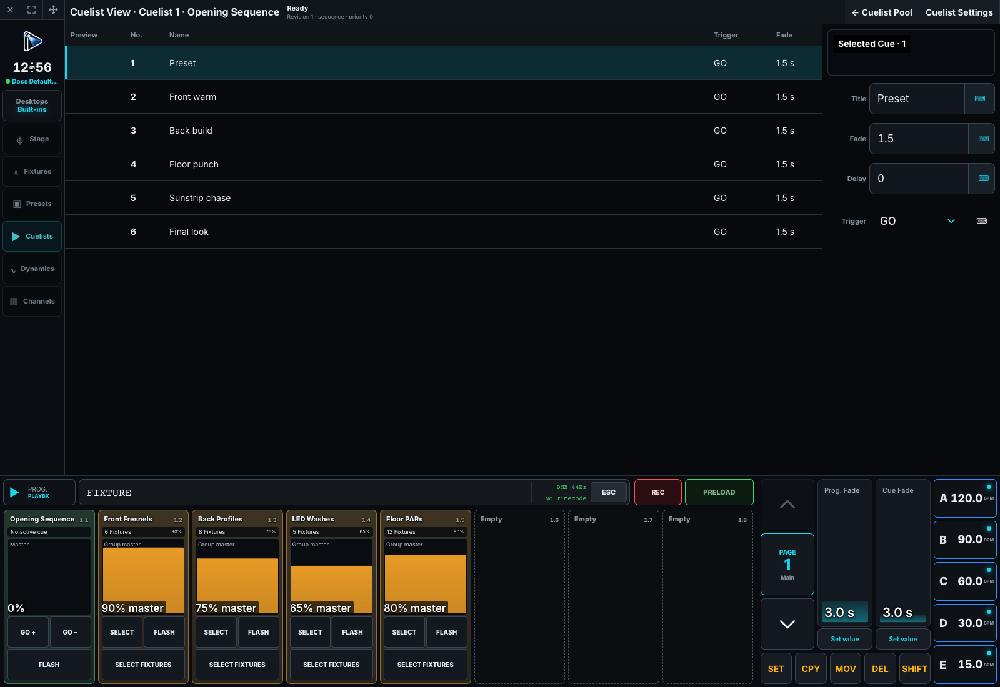

# Programming Cues

A Cue stores sparse changes inside a Cuelist. Unchanged values track from earlier Cues unless cue-only behavior restores them.

## Record the first Cue

1. Select fixtures and build the intended look in the programmer.
2. Press `[REC]` and choose a Cuelist/playback target, or enter an explicit Cue address.
3. Name the Cue and set fade, delay, and trigger behavior in Cuelist View.
4. Clear the programmer and run the Cue to prove that the stored data is sufficient.

Recording a Cuelist in its pool does not assign it to a playback. Assign it explicitly from playback configuration.

## Edit Cue contents

Normal Record overwrites the applicable stored data, Record Plus merges programmer values, and Record Minus subtracts them. Copy, Move, and Delete use explicit addresses. Renumbering and edits are protected as one show mutation; check the final Cue order before proceeding.

Use `[SHIFT] [REC]` when the intention is to Update existing programming instead of recording a replacement. For a running Cuelist, **Existing Only** changes the authoritative Cue events that supply the current tracked values; **Existing in Current Cue** touches only values explicitly stored in the current Cue; **Add to Current Cue** writes only addresses already known anywhere in the Cuelist; and **Add New** also stores new addresses. The Update preview shows each eligible, ignored, source-Cue, and current-Cue result before touch confirmation. Confirmation is bound to the shown object revision, normal-programmer contents, and touched playback/current-Cue context; if any of them changes, the desk rejects the stale confirmation and asks for a new preview. One confirmed Update is stored as one normal object revision and is therefore one Undo step. See [Updating existing programming](01-command-line.md#updating-existing-programming) for target gestures, defaults, Update Update, and address forms.

For a temporary change, hold `[REC]` to open **Record Settings** and enable **Cue only** before recording. The following Cue automatically restores each Cue-only address to its previous tracked value, or releases an address that had no earlier value. Turn **Cue only** off again for ordinary tracking records. The setting and generated restoration data survive a show refresh or reopen.

## Timing and triggers

Cue **In Fade** and **In Delay** provide the existing timing fallbacks. For decreasing or released Intensity, optional **Out Fade** and **Out Delay** provide an independent fade and hold; when they have not been separated, they follow the effective In timing. Individual values can retain their own fade and start delay and remain authoritative unless **Force Cue Timing** is enabled. **Disable Cue Timing** snaps both directions. Chasers retain their single X-fade percentage timing. Manual GO, Follow, timed delay, timecode, and Link triggers determine where and when playback moves. Follow timing begins after the latest incoming or outgoing work settles. Link is stored on its source Cue and jumps to a destination Cue by stable identity after that same actual completion point plus the optional Link delay. Renumbering therefore changes the displayed destination number without changing the Link. Missing destinations, self-links, and Link cycles are rejected before the show changes. Pause freezes a running transition; release removes playback ownership immediately according to its configured behavior rather than applying Cue out timing to the whole playback.

For exact commands and edge cases, see [Command Line Reference](01-command-line.md). For execution semantics, see [Cues and Playbacks](../40-Running-a-Show/01-cues-and-playbacks.md).

