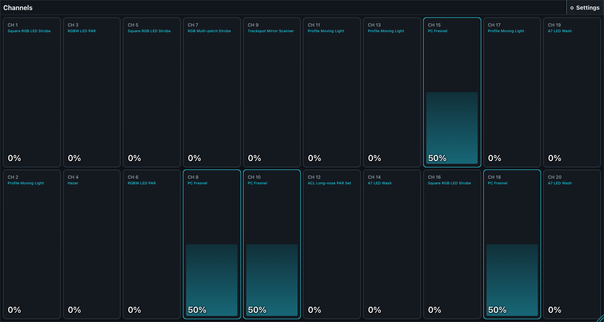

# Channel Faders

Channels presents patched fixtures as a two-row bank of 20 intensity faders per page.

Use the previous, page-range, and next controls to navigate. The page picker provides at least eight pages and grows when the patch needs more. Each populated channel shows its sequential channel number, fixture definition name, and current resolved intensity. Empty positions remain visible and disabled.

Touching a populated channel selects its fixture. Moving its fader writes that fixture's intensity into the current user's programmer; it does not record a Cue or change the fixture patch. Clear or record the programmer deliberately after using the bank.

Channel numbers are sequential positions in this view, not DMX addresses. Use **DMX** when diagnosing universes and physical slot ownership, and **Fixtures** when individual logical heads and non-intensity attributes matter.

The compact Channels pane does not show page controls and remains on channels 1-20. Open the full Channels built-in for other pages.

