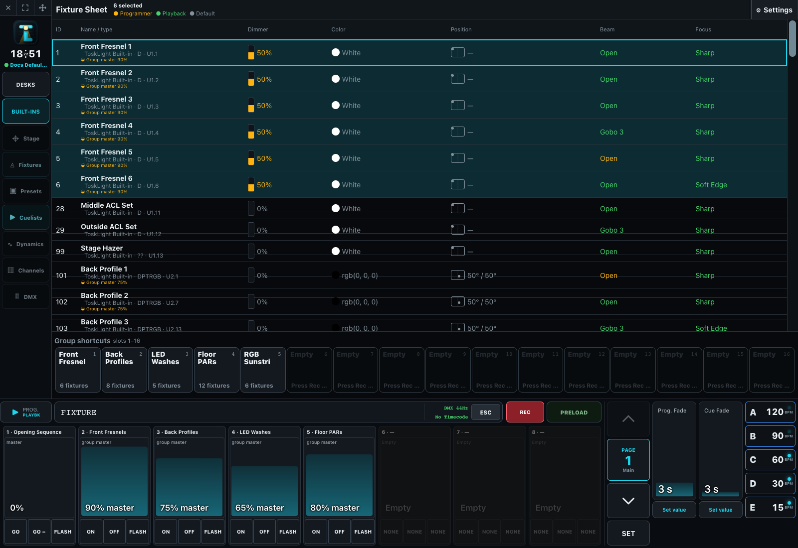

# The Programmer

The programmer is the operator's temporary working area. These topics cover selection, values, presets, groups, recording and editing cues, the command line, and how programmer output combines with playbacks.

Start with [Selecting and Setting Values](02-selecting-and-setting-values.md), then [Programming Cues](03-programming-cues.md). The [Command Line Reference](01-command-line.md) is the precise keypad contract.
