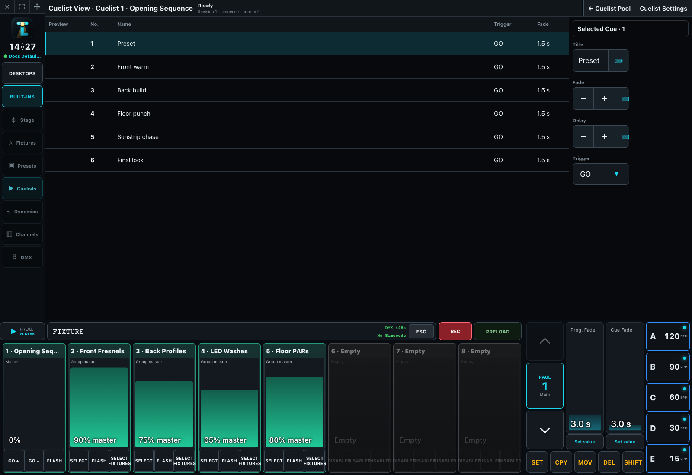

# Cues and Playbacks

A Cuelist contains ordered Cues. A playback is an operator control assigned to a Cuelist, Group, or specialized master.

## Assign controls

Arm **SET**, then choose a playback button or fader. Select the target, fader behavior, button actions, color, GO activation, auto-off, and crossfade time. Button actions include GO, GO minus, pause, release, flash, and temporary behavior where applicable. Assignment persists in the show and is page-aware.

## Manage playback pages

Touch the current **Page** control to open **Playback pages** and select an existing page. **Add new page** creates and selects the next numbered page. When the last page already contains an assigned playback, the Next Page control also creates and selects a new empty page automatically; it remains disabled while the last page is empty so the desk does not accumulate unused pages.

To rename the current page, press **SET** and then touch the **Page** control. Enter the new name and choose **Rename Page**. Page names and assignments are stored with the show, while each desk or independently paged screen retains its own current-page position.

## Run Cues

GO advances to the next Cue and applies its tracking state with configured timing. GO minus reconstructs the previous Cue rather than relying on programmer residue. A playback button configured as **Pause** freezes a transition and changes to **Resume** while paused; pressing it again continues the same Cue without advancing. GO also continues a paused transition. Release removes the playback's ownership and permits lower-priority sources to become visible.

The active playback is an explicit operator selection. Running another playback must not silently steal that selection. Cuelist View shows current/next state, Cue detail, and playback configuration.

## Restart behavior

First and Continue policies determine how a Cuelist starts after release or restart. Looping and chaser modes change end-of-list behavior. Test the exact production policy after a real server/app restart.
