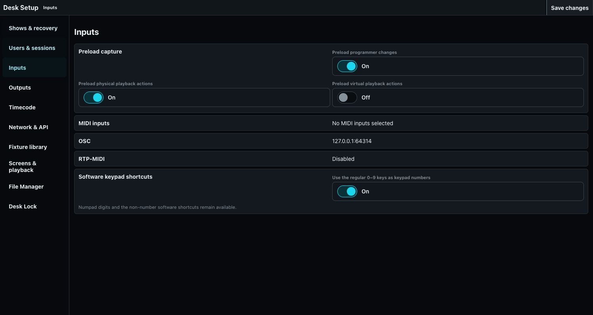

# Preload and Preload GO

Preload prepares a separate scene or queued playback actions without immediately disturbing normal live output.

## Capture domains

Desk Setup provides independent switches for programmer changes, physical playback actions, and virtual playback actions. All eight on/off combinations are meaningful. Disabled domains act live; enabled domains are captured in order for the pending Preload operation.

Physical capture retains only **Toggle**, **GO**, **GO minus**, **Off**, **On**, **Temp on**, and **Temp off**. Flash presses and releases, normal fader moves, and an On caused only by crossing zero remain live and are not captured. A configured **TEMP** button keeps its normal press-to-toggle gesture: one press queues Temp on and the next queues Temp off; it does not become a held button.

## Operator flow

1. Press Preload to enter the pending workflow.
2. Make programmer changes and/or execute configured playback actions.
3. Inspect Preload-aware Stage/Fixture views while separately verifying that live DMX has not changed unexpectedly.
4. Press **Preload GO** to apply the captured work atomically.
5. Hold Preload for release when only the Preload programmer scene must be cleared.

The Preload programmer, physical action queue, and virtual action queue are distinct. A combined GO uses one commit point so the prepared change does not tear across frames. Explicit value or Cue timing remains authoritative; otherwise Programmer Fade supplies the Preload transition time for both programmer values and captured playback results. Cue Fade is not substituted. Release removes only the temporary Preload programmer source, so playback actions committed by Preload GO remain in effect; a second Release is a no-op.

Use a dedicated Stage pane with **Follow Preload** for preview and another live-output pane for comparison.
