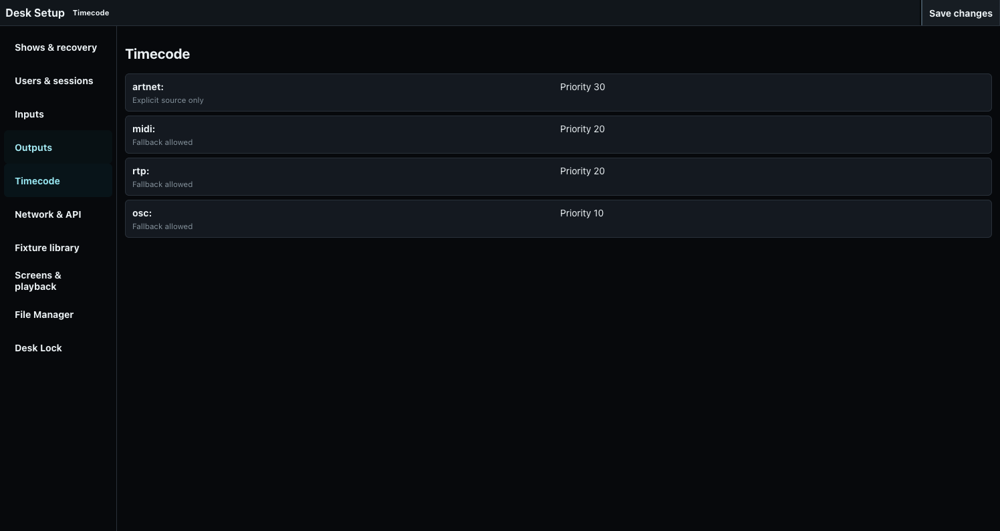

# Triggers, Chasers, and Speed Groups

Cuelists can advance manually, after a follow delay, at a timed delay, or from configured timecode.

## Follow and timed triggers

Follow starts its delay from the preceding Cue's execution and advances automatically. Timed triggers use the stored timing rule. Confirm pause, release, loop, and end-of-list behavior for every automatic sequence.

## Timecode

Configure timecode sources, priority, and fallback under Desk Setup. Supported transport includes configured ArtTimeCode and MIDI timecode paths. Verify source identity and fallback by disconnecting the preferred source during rehearsal; never assume visible time alone proves the intended source is driving.

The current Timecode page reports source prefixes, priority, and fallback state; it does not edit those sources.

## Chasers and speed groups

Chaser mode steps through its Cues using the configured interval or assigned Speed Group. Speed Groups A-E can be set numerically, tapped, or synchronized. Directly setting or tapping either synchronized group breaks that relationship and returns it to independent control.

Use `[SHIFT] [TIME]` for the `SPD GRP` command-line workflow documented in [Command Line Reference](../30-Programmer/01-command-line.md).

## Sound to Light

Switch the lower control section to Playbacks, then touch a Speed Group A–E control in Playback Tools to open that group's **Sound to Light** configuration. Opening it is a configuration action; it does not count as a Learn tap. The attached Speed Master **Learn** button and the modal's **Learn** action remain manual tap-tempo controls.

Choose **Audio input on this desk/browser** to grant microphone access and assign the input captured by this browser. The selected device ID stays in this browser, scoped to this desk and Speed Group. It is never written into the show, so another machine or browser starts unassigned instead of trying to open a device that may not exist there. If a saved local input still exists when the application reconnects, the browser resumes capture when Sound-to-Light is enabled.

The current analysis mode is **Tempo / BPM**. Choose a preset region—Sub 30–80 Hz, Low 60–180 Hz, Mid 180–2,000 Hz, High 2,000–12,000 Hz, or Full range 30–18,000 Hz—or enter a custom ordered range from 20 to 20,000 Hz. Use the live input and selected-band meters to set input gain. Confidence threshold rejects uncertain tempo estimates; Tempo smoothing reduces abrupt accepted changes; minimum and maximum tempo reject estimates outside the useful range.

The status strip distinguishes permission, input capture, and usable selected-band signal. The live panel shows detected tempo, confidence, effective speed, and the server's authoritative source. The browser analyzes at 100 ms intervals and sends normalized observations; normal request/network latency is additional. The server owns accepted tempo, smoothing, source selection, hold expiry, and the final Speed Group rate.

The Sound speed ratio maps the detected tempo from 0.125× through 8×. **Double** and **Half** change that ratio while Sound-to-Light is enabled; in manual mode they change the learned BPM instead. A Speed Master scale is applied after the Sound ratio. **Pause** freezes Speed Group phase without discarding its current rate. Attached OSC hardware receives the effective mapped BPM; its beat indication stops while paused, and its Speed Group encoder follows the same authoritative value.

If the input disappears, the selected band becomes quiet, confidence drops, or tempo leaves the accepted range, the group holds its last accepted Sound rate for the configured Signal-loss hold and then returns to its stored manual BPM. The modal reports the reason rather than failing silently. Disabling Sound-to-Light also returns to the stored manual rate. A direct BPM command or the first **Learn** tap deliberately takes manual ownership and disables Sound-to-Light.

Several sessions may control the same desk and submit observations for that desk's physical input. A different desk cannot take over the same Speed Group while the first desk's short capture lease is active. This desk ownership is separate from the user's Programmer: the Programmer is shared by that user's sessions, while button presses, page, command line, and attached OSC hardware belong to the selected desk.

Sound-derived speed follows the normal Chaser, playback, Grand Master, Blackout, and output paths. It does not bypass output safety or create a second browser-only playback state.
