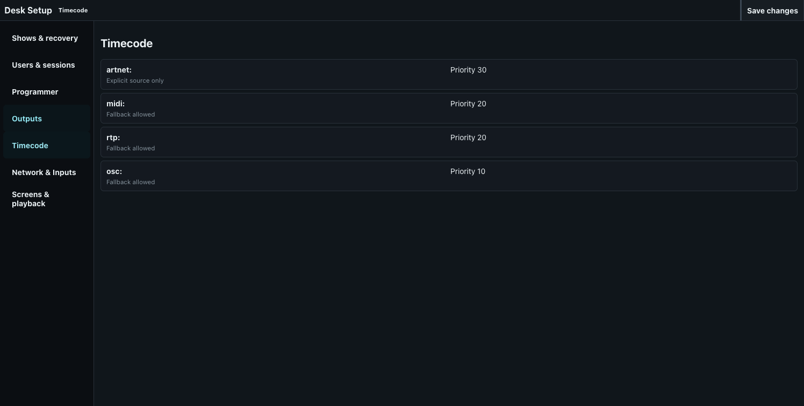

# Triggers, Chasers, and Speed Groups

Cuelists can advance manually, after a follow delay, at a timed delay, through a Link, or from configured timecode.

## Follow and timed triggers

FOLLOW starts after the preceding Cue's values have finished. TIME starts its stored duration immediately when the preceding Cue receives GO, so its Cue can begin while that preceding Cue is still fading. Confirm pause, release, loop, and end-of-list behavior for every automatic sequence.

## Link triggers

LINK belongs to the source Cue. After that Cue's latest real incoming or outgoing value has finished, the stored Link delay runs and playback jumps to the destination Cue. The destination is stored by stable Cue identity, so renumbering is safe. The desk rejects missing destinations, self-links, and direct or indirect Link cycles instead of guessing a fallback Cue. An explicitly loaded Cue remains the displayed effective next Cue and is retained for the next manual GO.

**Disable Cue Timing** treats both Cue completion and Link delay as zero without rewriting either value. A live configured Timecode source remains authoritative and suppresses Link execution; this prevents a held timecode frame and a Link from repeatedly moving playback back and forth. Link resumes when authoritative timecode is absent.

## Timecode

Choose exactly one Timecode source under **Desk Setup > General**: the desk's internal generator or one exact external source identity. There is no automatic priority list. Select whether loss of the chosen external source continues on the internal clock, pauses running Timecodes, or stops them; the selected source takes authority again as soon as it returns. The desk Timecode rate can follow the DMX rate or use an explicit whole-frame rate. A known incoming rate is converted and reported; an unusable sample is rejected rather than guessed.

The same Setup section selects the server audio-output device and its signed latency trim. Rehearse loss and return with the exact adapter and device used for the show; visible frames alone do not prove that the intended source or audible output is synchronized.

## Chasers and speed groups

Chaser mode steps through its Cues using the configured interval or assigned Speed Group. Speed Groups A-E can be set numerically, tapped, or synchronized. Directly setting or tapping either synchronized group breaks that relationship and returns it to independent control.

Use `[SHIFT] [TIME]` for the `SPD GRP` command-line workflow documented in [Command Line Reference](../30-Programmer/01-command-line.md).

## Sound to Light

Switch the lower control section to Playbacks. An ordinary tap or click on Speed Group A–E performs tap tempo immediately in both the touch-only and hardware-connected views. Hold the control, use Shift while tapping/clicking it, or right-click it to open that group's settings.

Tap tempo keeps a rolling calculation bucket. When the currently shown or calculated speed is 10 BPM or faster, a gap longer than 10 seconds makes the later tap the first tap of a new bucket. Below 10 BPM, that reset gap is longer than 30 seconds instead. The previous speed remains shown until the new bucket has enough taps to calculate a replacement.

Choose the microphone once under **Desk Setup > Network & Inputs > Inputs**. Permission and the selected device ID stay in this browser, scoped to the desk rather than to an individual Speed Group. They are never written into the show, so another machine or browser starts unassigned instead of trying to open a device that may not exist there. If a saved local input still exists when the application reconnects, the browser resumes capture for Speed Groups that use Sound to Light.

Each Speed Group source is exactly one of **Manual**, **Speed Group**, or **Sound to Light**. Manual hides source-specific settings. Speed Group follows another group; the current group is excluded and the desk rejects direct or indirect reference cycles. Sound to Light exposes the analysis settings and live feedback below.

The current analysis mode is **Tempo / BPM**. Choose a preset region—Sub 30–80 Hz, Low 60–180 Hz, Mid 180–2,000 Hz, High 2,000–12,000 Hz, or Full range 30–18,000 Hz—or enter a custom ordered range from 20 to 20,000 Hz. Use the live input and selected-band meters to set input gain. Confidence threshold rejects uncertain tempo estimates; Tempo smoothing reduces abrupt accepted changes; minimum and maximum tempo reject estimates outside the useful range.

The status strip distinguishes permission, input capture, and usable selected-band signal. The live panel shows detected tempo, confidence, effective speed, and the server's authoritative source. The browser analyzes at 100 ms intervals and sends normalized observations; normal request/network latency is additional. The server owns accepted tempo, smoothing, source selection, hold expiry, and the final Speed Group rate.

The Sound speed ratio maps the detected tempo from 0.125× through 8×. The title bar provides `÷2`, `×2`, and **Pause/Resume** as immediate actions; they do not dirty the settings form. A Speed Master scale is applied after the Sound ratio. Pause freezes Speed Group phase without discarding its current rate. Attached OSC hardware receives the effective mapped BPM; its beat indication stops while paused, and its Speed Group encoder follows the same authoritative value.

**Apply** is in the title bar. Closing an unchanged modal closes immediately. Closing after edits asks whether to **Close and discard**, **Close and save**, or **Stay**.

If the input disappears, the selected band becomes quiet, confidence drops, or tempo leaves the accepted range, the group holds its last accepted Sound rate for the configured Signal-loss hold and then returns to its stored manual BPM. The modal reports the reason rather than failing silently. Disabling Sound-to-Light also returns to the stored manual rate. A direct BPM command or the first **Learn** tap deliberately takes manual ownership and disables Sound-to-Light.

Several sessions may control the same desk and submit observations for that desk's physical input. A different desk cannot take over the same Speed Group while the first desk's short capture lease is active. This desk ownership is separate from the user's Programmer: the Programmer is shared by that user's sessions, while button presses, page, command line, and attached OSC hardware belong to the selected desk.

Sound-derived speed follows the normal Chaser, playback, Grand Master, Blackout, and output paths. It does not bypass output safety or create a second browser-only playback state.
