# Model Catalogue

Every model ToskLight ships with the Visualizer, with the name the fixture
library and the show file refer to it by. A fixture profile points at one of
these with `model_asset`; a fixture that points at nothing is given one
automatically, as described in [Default Models](01-default-models.md).

This page is generated by `npm run models:render` from `assets/models`. Edit the
builders under `tools/stage_models/`, not this file.

## Lamps

| Model | Name | Size (W x H x D) |
| --- | --- | --- |
| 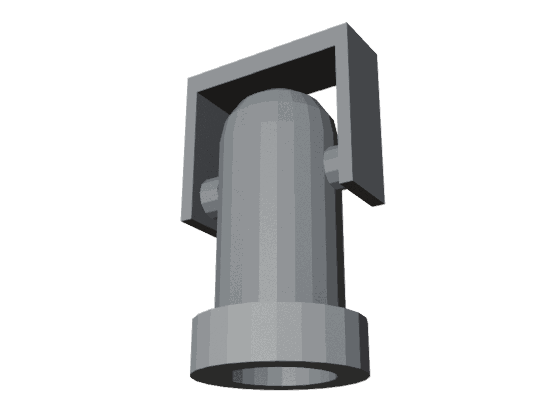 | `acl-par-16-no-clamp` ACL / PAR 16 narrow: hollow 55 can, 130 long, single-cell frame; no mounting hardware | 97 x 146 x 73 mm |
| 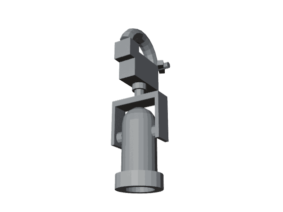 | `acl-par-16` ACL / PAR 16 narrow: hollow 55 can, 130 long, single-cell frame | 97 x 272 x 115 mm |
| 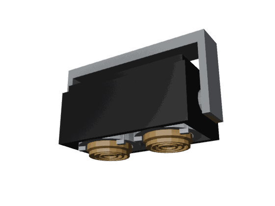 | `blinder-2-cell-no-clamp` Blinder 2 cell: frame 400 x 200 x 155, sealed beams in chromed rings; no mounting hardware | 468 x 291 x 200 mm |
| 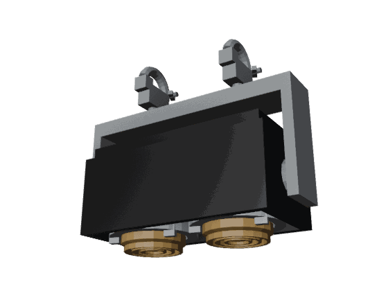 | `blinder-2-cell` Blinder 2 cell: frame 400 x 200 x 155, sealed beams in chromed rings | 468 x 417 x 200 mm |
| 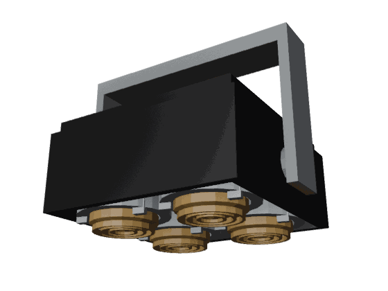 | `blinder-4-cell-no-clamp` Blinder 4 cell: frame 400 x 400 x 155, sealed beams in chromed rings; no mounting hardware | 468 x 372 x 400 mm |
| 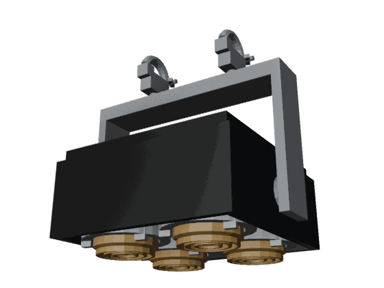 | `blinder-4-cell` Blinder 4 cell: frame 400 x 400 x 155, sealed beams in chromed rings | 468 x 498 x 400 mm |
| 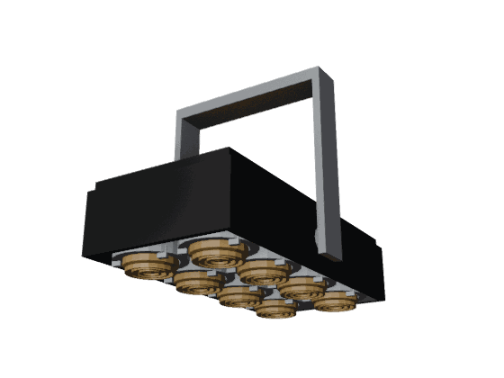 | `blinder-8-cell-no-clamp` Blinder 8 cell: frame 800 x 400 x 155, sealed beams in chromed rings; no mounting hardware | 868 x 372 x 400 mm |
| 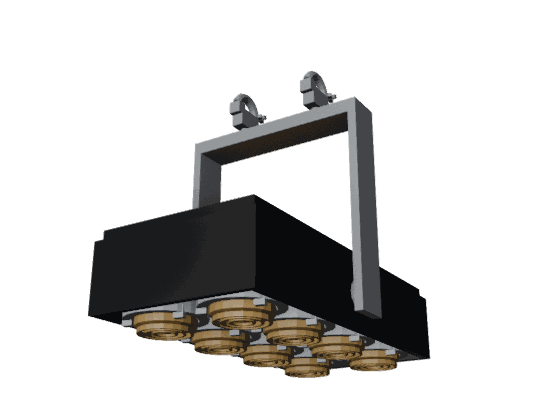 | `blinder-8-cell` Blinder 8 cell: frame 800 x 400 x 155, sealed beams in chromed rings | 868 x 498 x 400 mm |
| 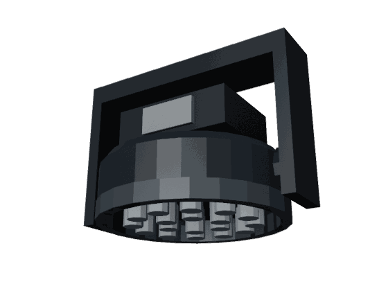 | `flat-led-par-no-clamp` Flat LED PAR: 230 disc, 95 deep, 18 proud emitters; no mounting hardware | 285 x 205 x 232 mm |
| 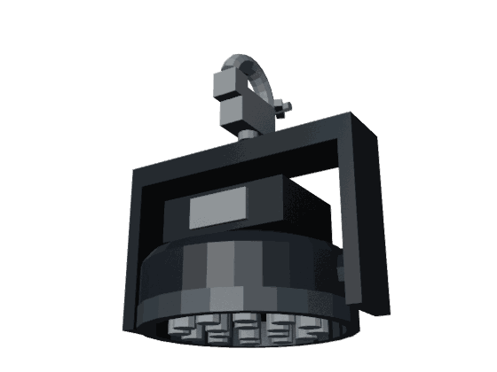 | `flat-led-par` Flat LED PAR: 230 disc, 95 deep, 18 proud emitters | 285 x 332 x 232 mm |
| 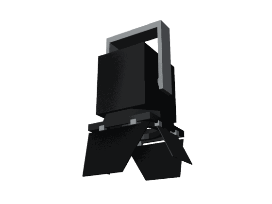 | `fresnel-barn-doors-no-clamp` Fresnel 260 x 300 x 300 with four barn doors; no mounting hardware | 520 x 752 x 517 mm |
| 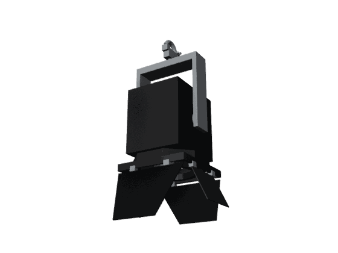 | `fresnel-barn-doors` Fresnel 260 x 300 x 300 with four barn doors | 520 x 879 x 517 mm |
| 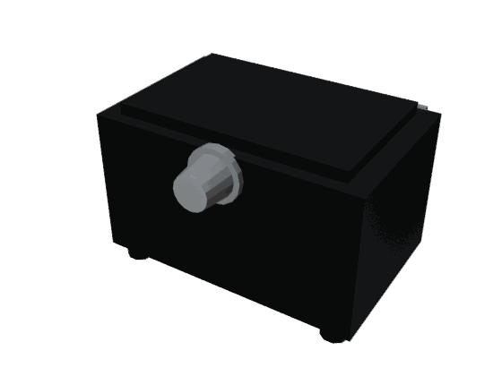 | `hazer` Hazer: 550 x 350 x 300 chassis on feet, nozzle at the front top | 588 x 354 x 441 mm |
| 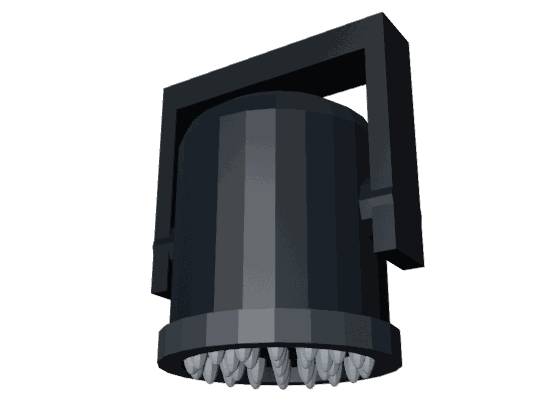 | `led-par-pizza-no-clamp` LED PAR pizza lamp: hollow 180 can, 230 long, 18 + 12 + 1 domed sources; no mounting hardware | 254 x 302 x 200 mm |
| 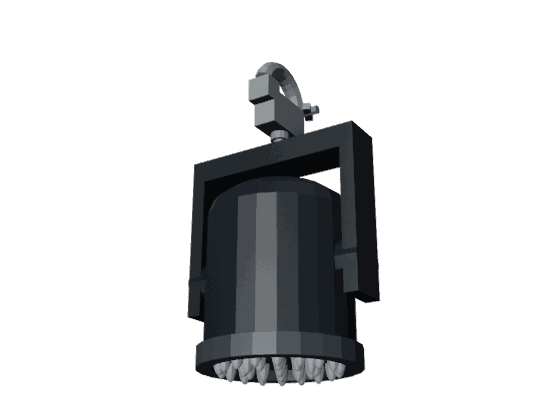 | `led-par-pizza` LED PAR pizza lamp: hollow 180 can, 230 long, 18 + 12 + 1 domed sources | 254 x 429 x 200 mm |
| 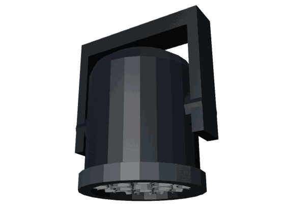 | `led-par-x-in-1-no-clamp` LED PAR x-in-1: hollow 180 can, 18 emitters of 20 in shallow cups; no mounting hardware | 254 x 294 x 200 mm |
| 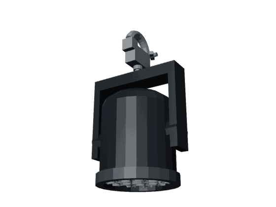 | `led-par-x-in-1` LED PAR x-in-1: hollow 180 can, 18 emitters of 20 in shallow cups | 254 x 421 x 200 mm |
| 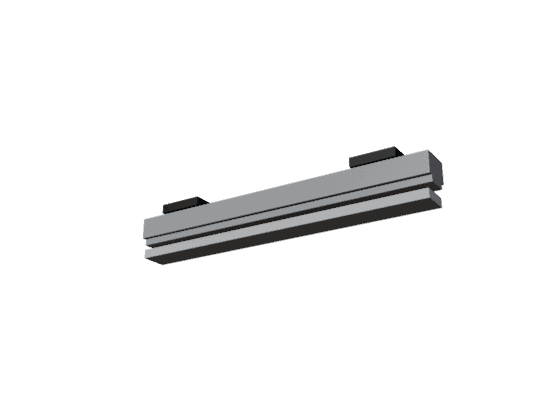 | `led-strip-rgbcct-0500-no-clamp` LED strip RGBCCT 500 mm: 50 x 45 extrusion with a milky diffuser; no mounting hardware | 500 x 81 x 62 mm |
| 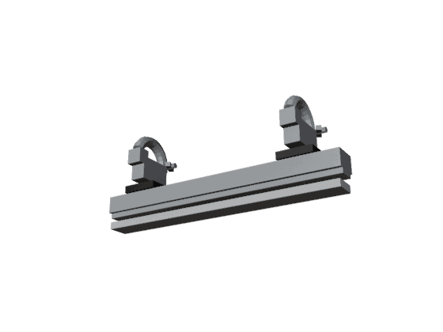 | `led-strip-rgbcct-0500` LED strip RGBCCT 500 mm: 50 x 45 extrusion with a milky diffuser | 500 x 190 x 115 mm |
| 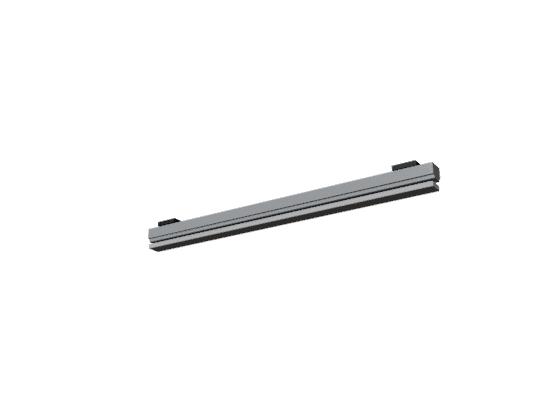 | `led-strip-rgbcct-1000-no-clamp` LED strip RGBCCT 1000 mm: 50 x 45 extrusion with a milky diffuser; no mounting hardware | 1000 x 81 x 62 mm |
|  | `led-strip-rgbcct-1000` LED strip RGBCCT 1000 mm: 50 x 45 extrusion with a milky diffuser | 1000 x 190 x 115 mm |
| 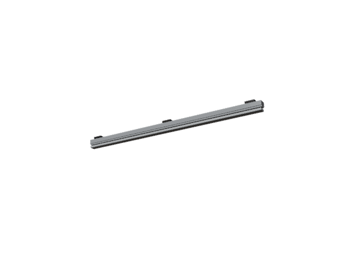 | `led-strip-rgbcct-1500-no-clamp` LED strip RGBCCT 1500 mm: 50 x 45 extrusion with a milky diffuser; no mounting hardware | 1500 x 81 x 62 mm |
| 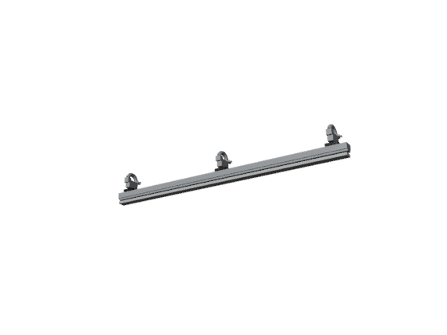 | `led-strip-rgbcct-1500` LED strip RGBCCT 1500 mm: 50 x 45 extrusion with a milky diffuser | 1500 x 190 x 115 mm |
|  | `led-strip-rgbcct-2000-no-clamp` LED strip RGBCCT 2000 mm: 50 x 45 extrusion with a milky diffuser; no mounting hardware | 2000 x 81 x 62 mm |
| 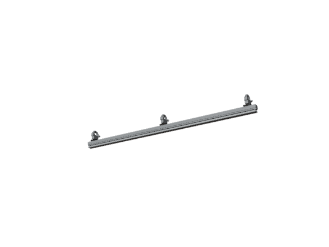 | `led-strip-rgbcct-2000` LED strip RGBCCT 2000 mm: 50 x 45 extrusion with a milky diffuser | 2000 x 190 x 115 mm |
| 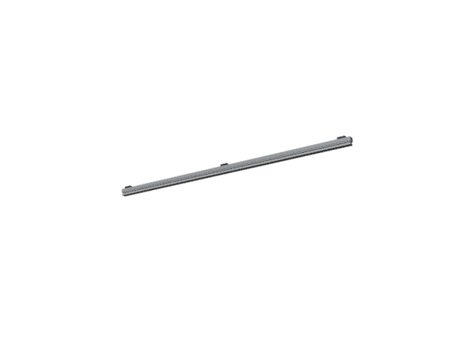 | `led-strip-rgbcct-2500-no-clamp` LED strip RGBCCT 2500 mm: 50 x 45 extrusion with a milky diffuser; no mounting hardware | 2500 x 81 x 62 mm |
| 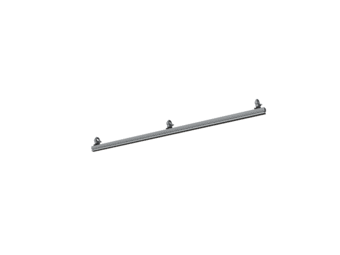 | `led-strip-rgbcct-2500` LED strip RGBCCT 2500 mm: 50 x 45 extrusion with a milky diffuser | 2500 x 190 x 115 mm |
|  | `led-strip-rgbcct-3000-no-clamp` LED strip RGBCCT 3000 mm: 50 x 45 extrusion with a milky diffuser; no mounting hardware | 3000 x 81 x 62 mm |
| 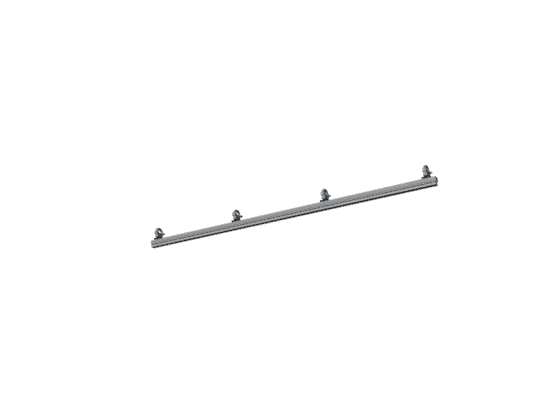 | `led-strip-rgbcct-3000` LED strip RGBCCT 3000 mm: 50 x 45 extrusion with a milky diffuser | 3000 x 190 x 115 mm |
| 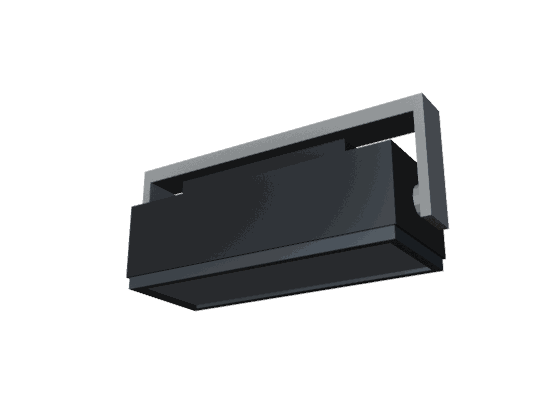 | `led-strobe-no-clamp` LED strobe: 500 x 130 x 200, flat diffusion plane; no mounting hardware | 560 x 314 x 130 mm |
| 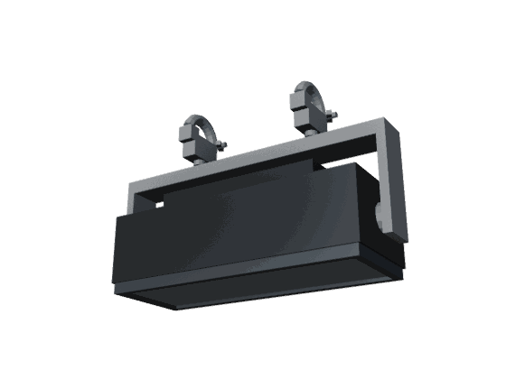 | `led-strobe` LED strobe: 500 x 130 x 200, flat diffusion plane | 560 x 440 x 130 mm |
| 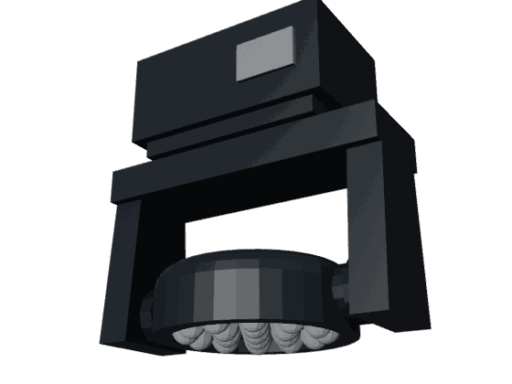 | `moving-head-led-wash-300-no-clamp` Moving head LED wash 300: turned head 300 across, 100 deep, proud emitter domes on a sunk front face; no mounting hardware | 472 x 473 x 300 mm |
| 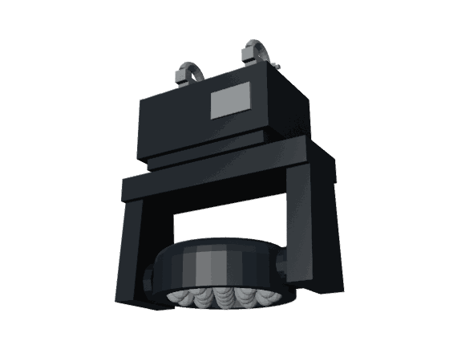 | `moving-head-led-wash-300` Moving head LED wash 300: turned head 300 across, 100 deep, proud emitter domes on a sunk front face | 472 x 600 x 300 mm |
| 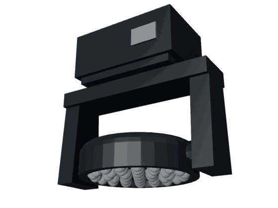 | `moving-head-led-wash-400-no-clamp` Moving head LED wash 400: turned head 400 across, 110 deep, proud emitter domes on a sunk front face; no mounting hardware | 586 x 547 x 400 mm |
| 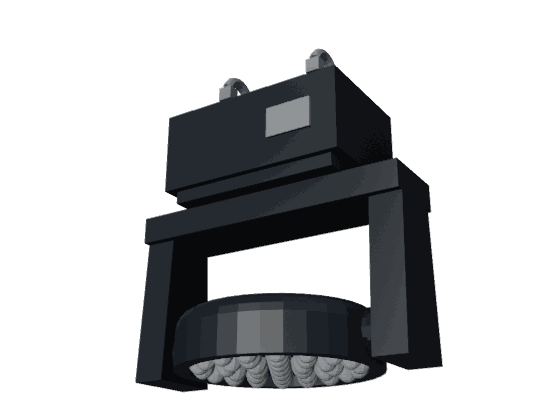 | `moving-head-led-wash-400` Moving head LED wash 400: turned head 400 across, 110 deep, proud emitter domes on a sunk front face | 586 x 674 x 400 mm |
| 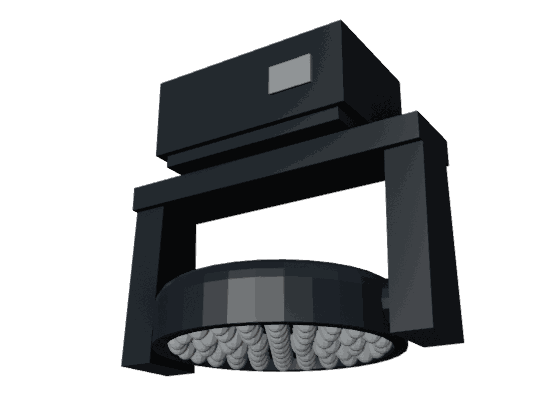 | `moving-head-led-wash-500-no-clamp` Moving head LED wash 500: turned head 500 across, 120 deep, proud emitter domes on a sunk front face; no mounting hardware | 698 x 614 x 500 mm |
| 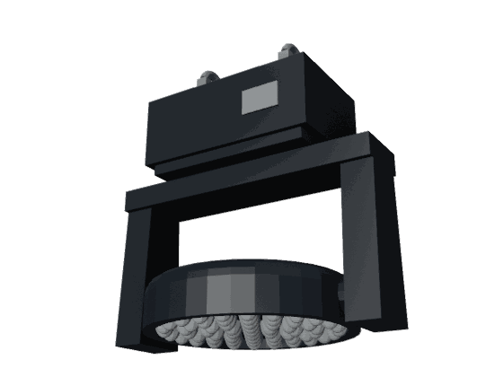 | `moving-head-led-wash-500` Moving head LED wash 500: turned head 500 across, 120 deep, proud emitter domes on a sunk front face | 698 x 741 x 500 mm |
| 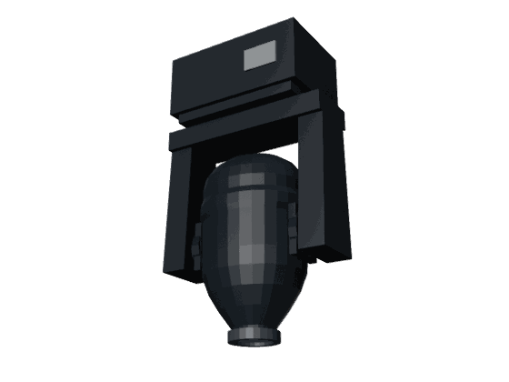 | `moving-head-profile-no-clamp` Moving head profile: 400 x 250 x 175 base, turned 300 x 480 head on a full-travel yoke; no mounting hardware | 482 x 808 x 268 mm |
| 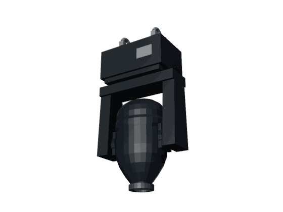 | `moving-head-profile` Moving head profile: 400 x 250 x 175 base, turned 300 x 480 head on a full-travel yoke | 482 x 935 x 268 mm |
| 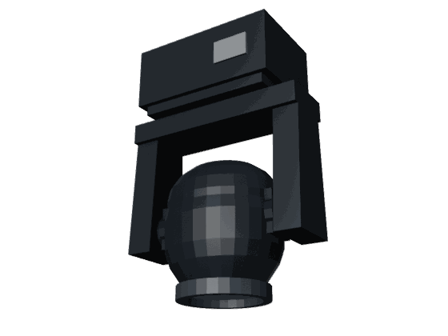 | `moving-head-wash-no-clamp` Moving head wash: turned 320 x 330 head with a 210 front lens on a full-travel yoke; no mounting hardware | 502 x 704 x 280 mm |
| 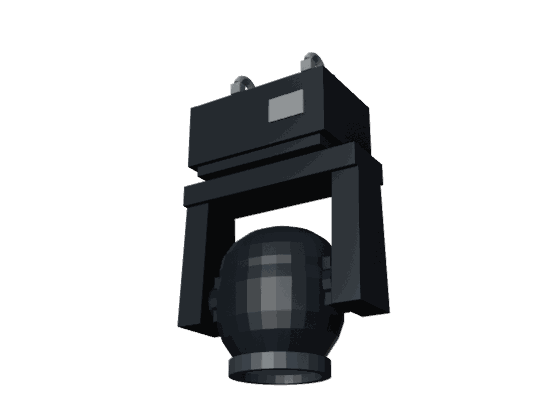 | `moving-head-wash` Moving head wash: turned 320 x 330 head with a 210 front lens on a full-travel yoke | 502 x 831 x 280 mm |
| 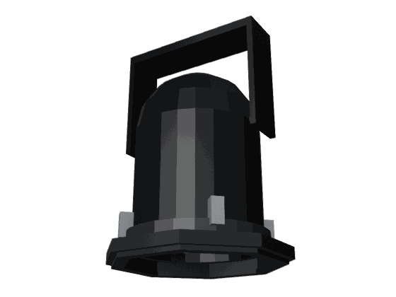 | `par-56-black-no-clamp` PAR 56, black: hollow 180 can, 260 long, octagonal gel frame; no mounting hardware | 274 x 337 x 236 mm |
| 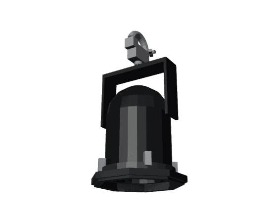 | `par-56-black` PAR 56, black: hollow 180 can, 260 long, octagonal gel frame | 274 x 464 x 236 mm |
| 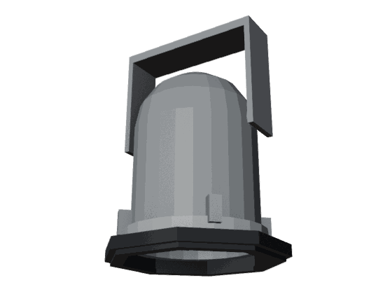 | `par-56-silver-no-clamp` PAR 56, silver: hollow 180 can, 260 long, octagonal gel frame; no mounting hardware | 274 x 337 x 236 mm |
| 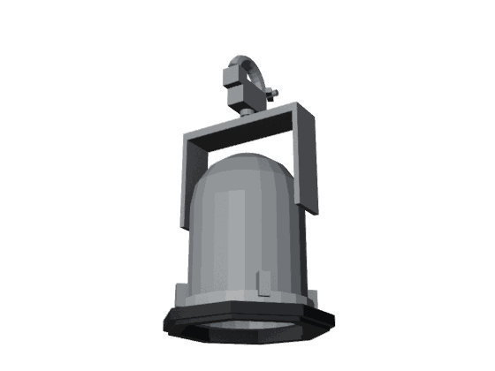 | `par-56-silver` PAR 56, silver: hollow 180 can, 260 long, octagonal gel frame | 274 x 464 x 236 mm |
| 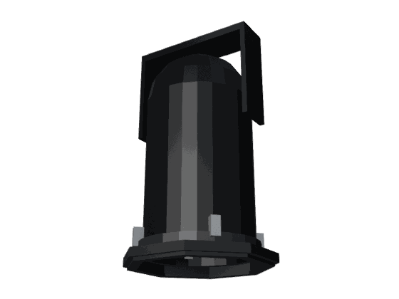 | `par-64-long-nose-black-no-clamp` PAR 64 long nose, black: hollow 205 can, 400 long, octagonal gel frame; no mounting hardware | 301 x 451 x 260 mm |
| 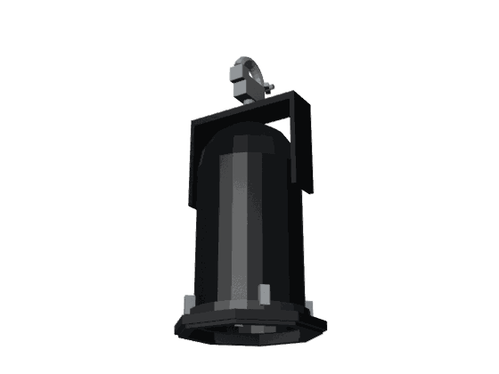 | `par-64-long-nose-black` PAR 64 long nose, black: hollow 205 can, 400 long, octagonal gel frame | 301 x 578 x 260 mm |
| 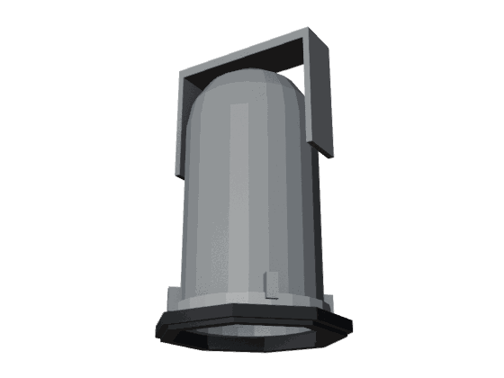 | `par-64-long-nose-silver-no-clamp` PAR 64 long nose, silver: hollow 205 can, 400 long, octagonal gel frame; no mounting hardware | 301 x 451 x 260 mm |
| 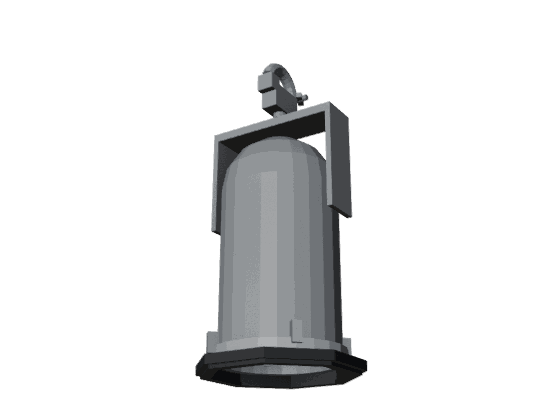 | `par-64-long-nose-silver` PAR 64 long nose, silver: hollow 205 can, 400 long, octagonal gel frame | 301 x 578 x 260 mm |
| 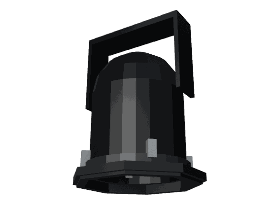 | `par-64-short-nose-black-no-clamp` PAR 64 short nose, black: hollow 205 can, 280 long, octagonal gel frame; no mounting hardware | 301 x 365 x 260 mm |
| 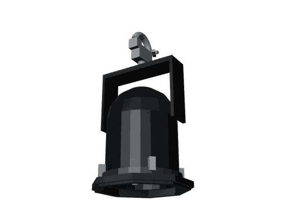 | `par-64-short-nose-black` PAR 64 short nose, black: hollow 205 can, 280 long, octagonal gel frame | 301 x 492 x 260 mm |
| 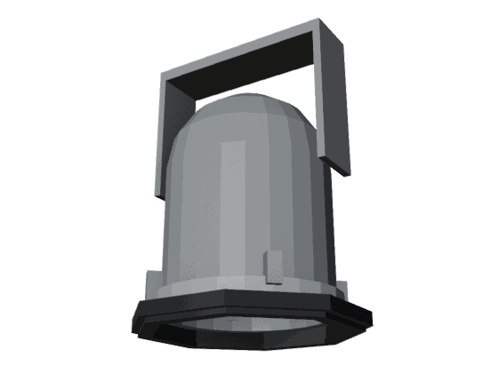 | `par-64-short-nose-silver-no-clamp` PAR 64 short nose, silver: hollow 205 can, 280 long, octagonal gel frame; no mounting hardware | 301 x 365 x 260 mm |
| 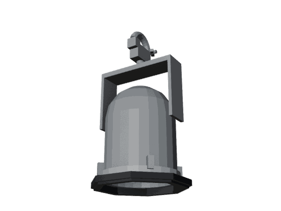 | `par-64-short-nose-silver` PAR 64 short nose, silver: hollow 205 can, 280 long, octagonal gel frame | 301 x 492 x 260 mm |
| 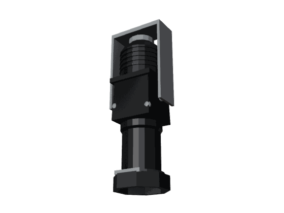 | `profile-spot-no-clamp` Profile spot: 640 long ellipsoidal, shutter barrel, lens tube, octagonal gel holder; no mounting hardware | 266 x 752 x 230 mm |
| 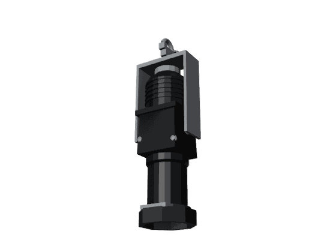 | `profile-spot` Profile spot: 640 long ellipsoidal, shutter barrel, lens tube, octagonal gel holder | 266 x 878 x 230 mm |
| 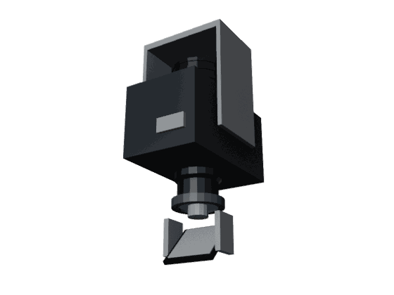 | `scanner-compact-no-clamp` Compact mirror scanner: 190 x 330 x 180 chassis, 110 gimbaled mirror; no mounting hardware | 227 x 565 x 340 mm |
| 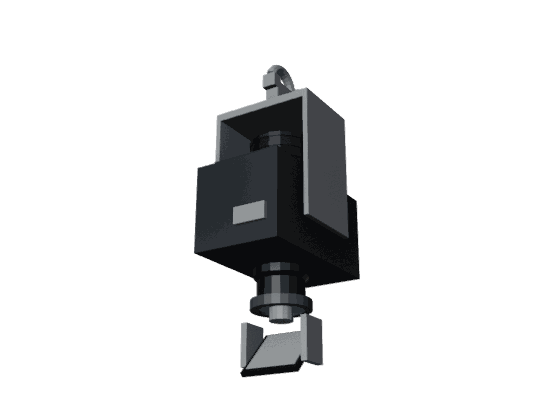 | `scanner-compact` Compact mirror scanner: 190 x 330 x 180 chassis, 110 gimbaled mirror | 227 x 692 x 340 mm |
| 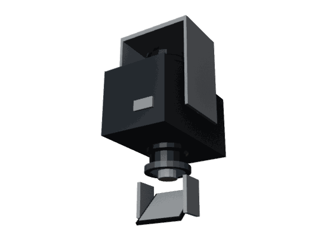 | `scanner-mirror-spot-no-clamp` Mirror scanner: 240 x 420 x 230 chassis, fixed lantern over a 150 gimbaled mirror; no mounting hardware | 282 x 688 x 430 mm |
| 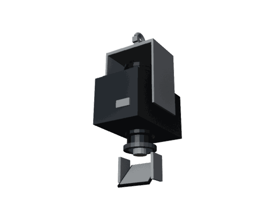 | `scanner-mirror-spot` Mirror scanner: 240 x 420 x 230 chassis, fixed lantern over a 150 gimbaled mirror | 282 x 815 x 430 mm |
| 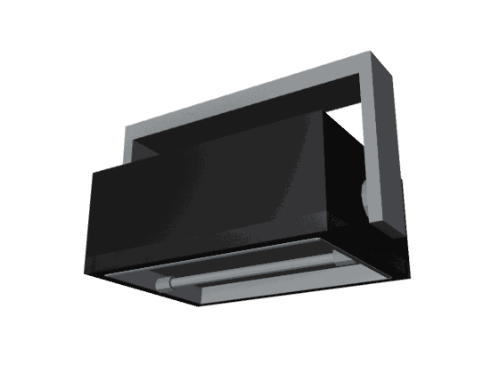 | `strobe-xenon-no-clamp` Strobe: 420 x 200 x 260, straight xenon tube in a white reflector well; no mounting hardware | 488 x 349 x 200 mm |
| 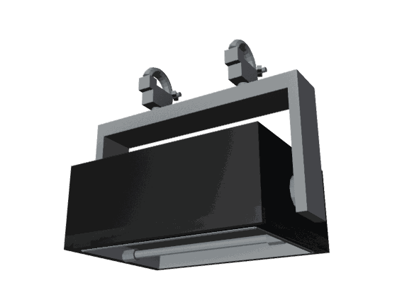 | `strobe-xenon` Strobe: 420 x 200 x 260, straight xenon tube in a white reflector well | 488 x 476 x 200 mm |
| 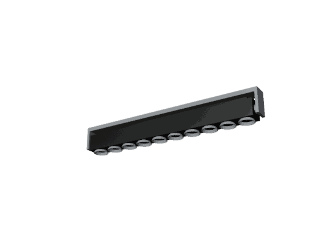 | `sunstrip-no-clamp` Sunstrip: 1000 x 90 x 90 bar, ten 84 reflector cells on 100 centres; no mounting hardware | 1056 x 157 x 90 mm |
| 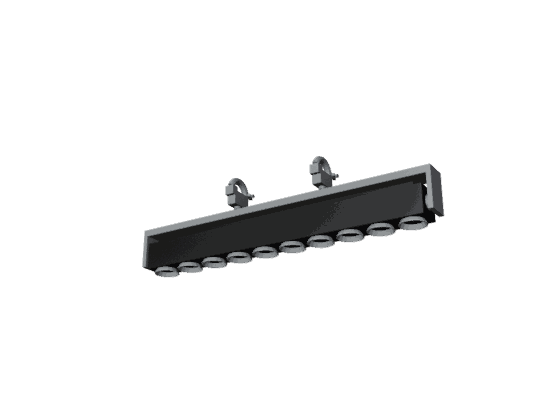 | `sunstrip` Sunstrip: 1000 x 90 x 90 bar, ten 84 reflector cells on 100 centres | 1056 x 284 x 115 mm |

## Projection and laser

| Model | Name | Size (W x H x D) |
| --- | --- | --- |
| 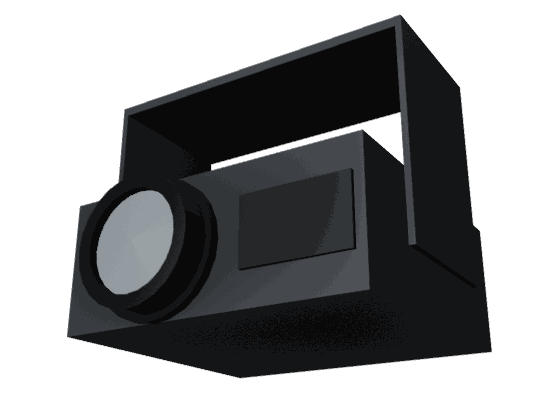 | `projector-large-no-clamp` Projector, large: 620 x 560 x 260 body with a 190 lens in the front face; no mounting hardware | 672 x 543 x 643 mm |
| 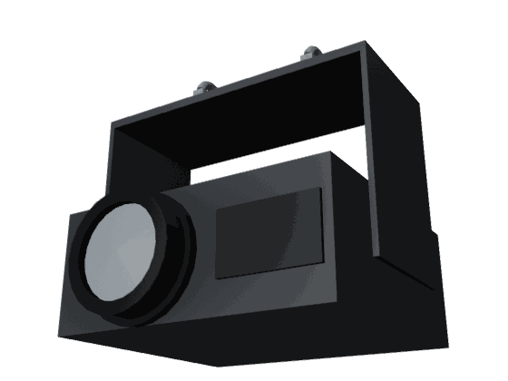 | `projector-large` Projector, large: 620 x 560 x 260 body with a 190 lens in the front face | 672 x 670 x 643 mm |
| 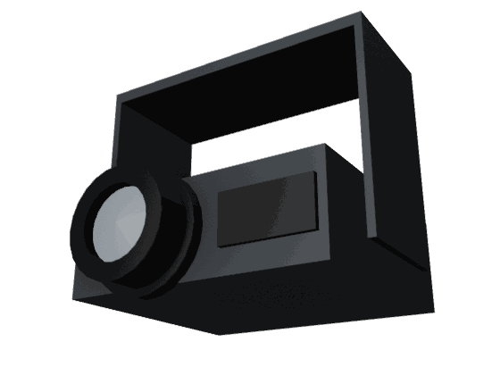 | `projector-small-no-clamp` Projector, small: 420 x 380 x 150 body with a 110 lens in the front face; no mounting hardware | 472 x 405 x 463 mm |
| 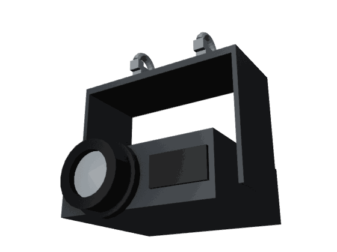 | `projector-small` Projector, small: 420 x 380 x 150 body with a 110 lens in the front face | 472 x 532 x 463 mm |
|  | `show-laser-no-clamp` Show laser: 340 x 300 x 170 body, square aperture in the front face, warning triangle; no mounting hardware | 392 x 304 x 331 mm |
| 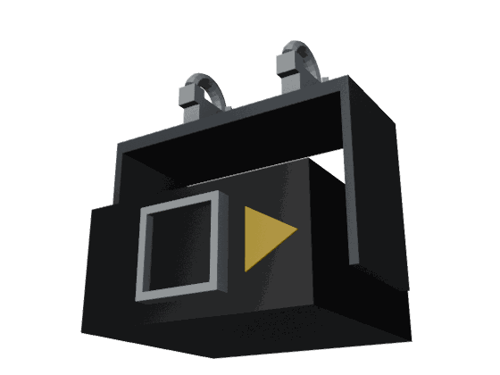 | `show-laser` Show laser: 340 x 300 x 170 body, square aperture in the front face, warning triangle | 392 x 431 x 331 mm |

## Truss and rigging

| Model | Name | Size (W x H x D) |
| --- | --- | --- |
| 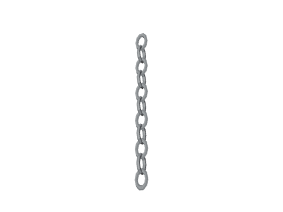 | `chain-0500` Load chain, 500 mm: simplified links in alternating planes | 44 x 497 x 44 mm |
| 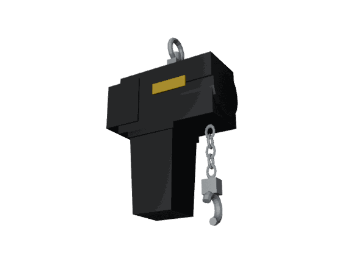 | `chain-motor` Electric chain hoist, 1 t: 430 x 200 x 250 body on a shackle, chain bag and load hook | 500 x 814 x 213 mm |
| 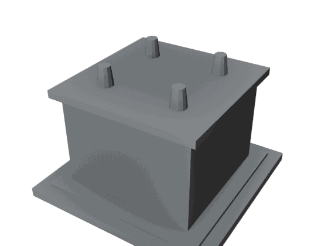 | `ground-support-base` Ground support base: 600 x 600 x 30 plate with a sleeve block for a 4-point tower | 600 x 426 x 600 mm |
| 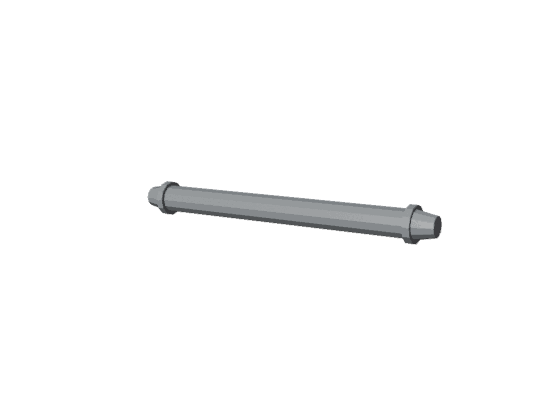 | `pipe-0500` Scaffold pipe, 500 mm: single 48.3 tube | 568 x 62 x 62 mm |
| 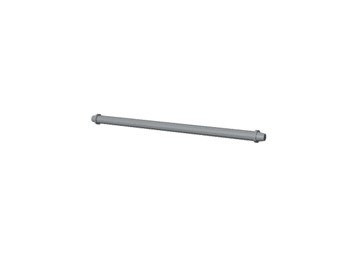 | `pipe-1000` Scaffold pipe, 1000 mm: single 48.3 tube | 1068 x 62 x 62 mm |
| 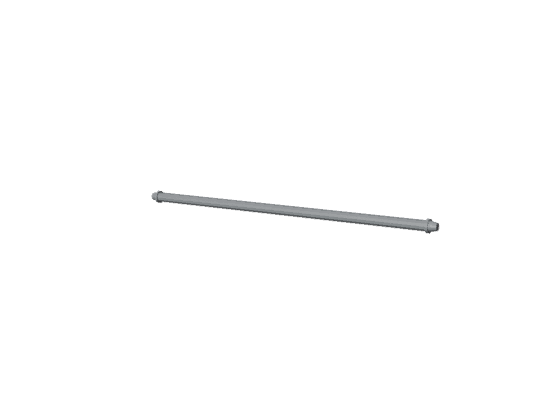 | `pipe-1500` Scaffold pipe, 1500 mm: single 48.3 tube | 1568 x 62 x 62 mm |
| 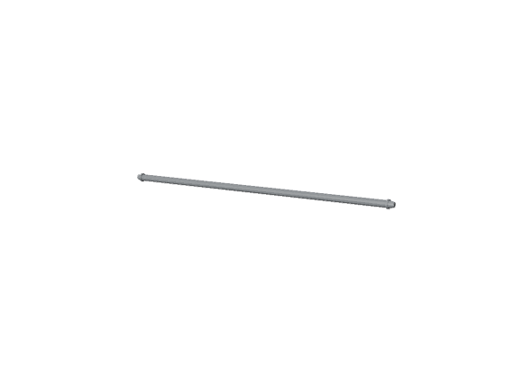 | `pipe-2000` Scaffold pipe, 2000 mm: single 48.3 tube | 2068 x 62 x 62 mm |
| 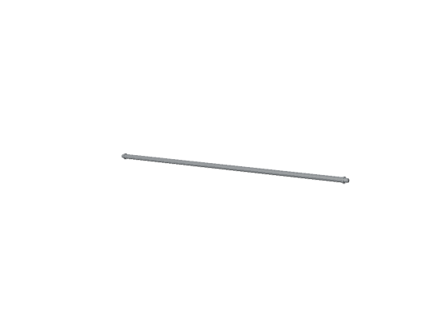 | `pipe-2500` Scaffold pipe, 2500 mm: single 48.3 tube | 2568 x 62 x 62 mm |
| 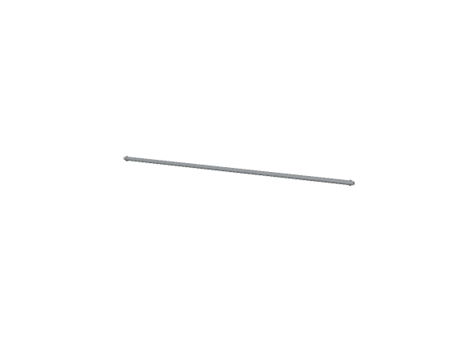 | `pipe-3000` Scaffold pipe, 3000 mm: single 48.3 tube | 3068 x 62 x 62 mm |
| 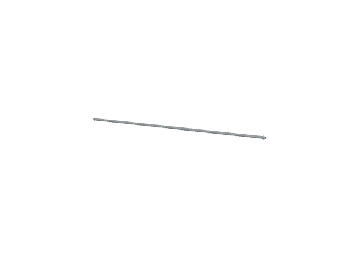 | `pipe-4000` Scaffold pipe, 4000 mm: single 48.3 tube | 4068 x 62 x 62 mm |
| 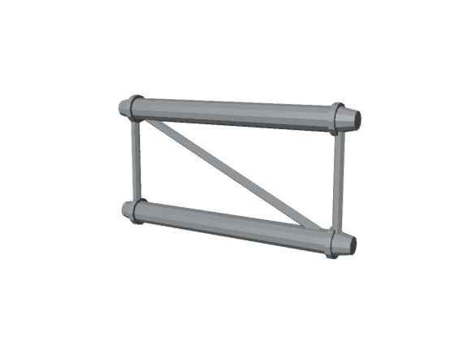 | `truss-2-point-0500` 2-point truss, 500 mm: 50 chords 240 apart, 20 braces, bay every 340 | 568 x 304 x 64 mm |
| 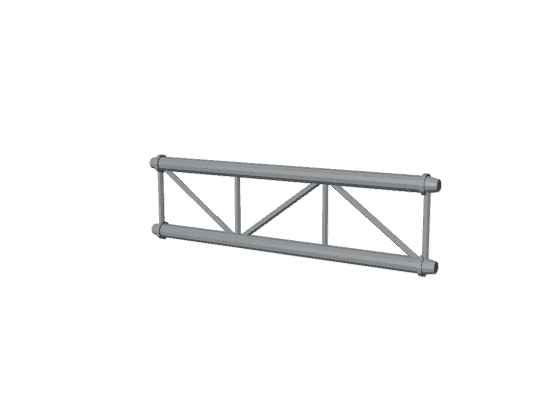 | `truss-2-point-1000` 2-point truss, 1000 mm: 50 chords 240 apart, 20 braces, bay every 340 | 1068 x 304 x 64 mm |
| 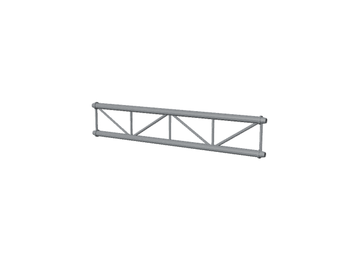 | `truss-2-point-1500` 2-point truss, 1500 mm: 50 chords 240 apart, 20 braces, bay every 340 | 1568 x 304 x 64 mm |
| 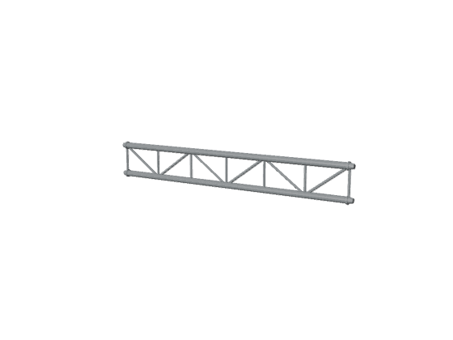 | `truss-2-point-2000` 2-point truss, 2000 mm: 50 chords 240 apart, 20 braces, bay every 340 | 2068 x 304 x 64 mm |
| 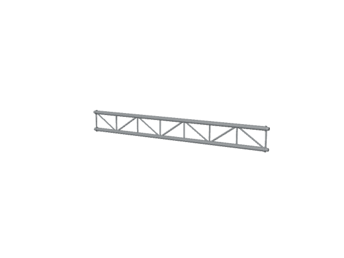 | `truss-2-point-2500` 2-point truss, 2500 mm: 50 chords 240 apart, 20 braces, bay every 340 | 2568 x 304 x 64 mm |
| 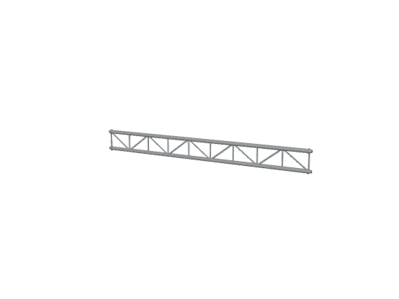 | `truss-2-point-3000` 2-point truss, 3000 mm: 50 chords 240 apart, 20 braces, bay every 340 | 3068 x 304 x 64 mm |
| 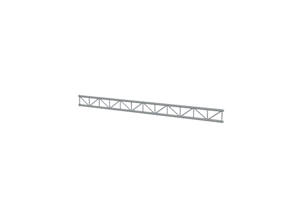 | `truss-2-point-4000` 2-point truss, 4000 mm: 50 chords 240 apart, 20 braces, bay every 340 | 4068 x 304 x 64 mm |
| 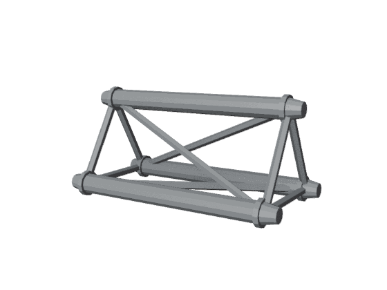 | `truss-3-point-0500` 3-point truss, 500 mm: 50 chords 240 apart, 20 braces, bay every 340 | 568 x 272 x 304 mm |
| 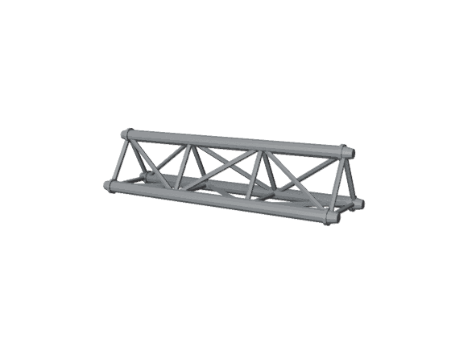 | `truss-3-point-1000` 3-point truss, 1000 mm: 50 chords 240 apart, 20 braces, bay every 340 | 1068 x 272 x 304 mm |
| 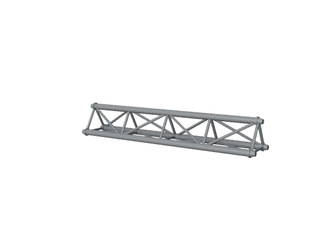 | `truss-3-point-1500` 3-point truss, 1500 mm: 50 chords 240 apart, 20 braces, bay every 340 | 1568 x 272 x 304 mm |
| 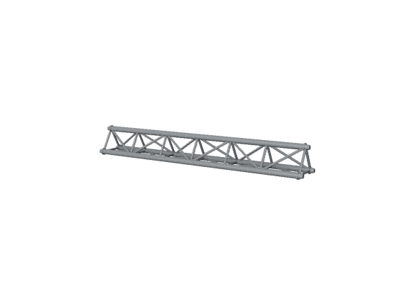 | `truss-3-point-2000` 3-point truss, 2000 mm: 50 chords 240 apart, 20 braces, bay every 340 | 2068 x 272 x 304 mm |
|  | `truss-3-point-2500` 3-point truss, 2500 mm: 50 chords 240 apart, 20 braces, bay every 340 | 2568 x 272 x 304 mm |
| 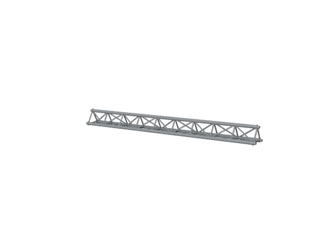 | `truss-3-point-3000` 3-point truss, 3000 mm: 50 chords 240 apart, 20 braces, bay every 340 | 3068 x 272 x 304 mm |
| 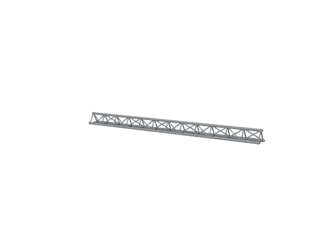 | `truss-3-point-4000` 3-point truss, 4000 mm: 50 chords 240 apart, 20 braces, bay every 340 | 4068 x 272 x 304 mm |
| 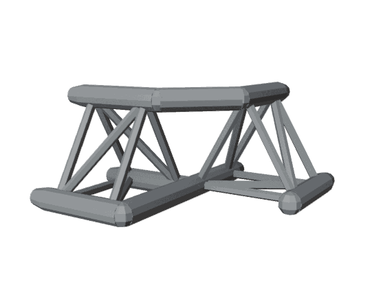 | `truss-3-point-corner-2-way` 3-point corner 2 way block, 500 mm arms | 679 x 258 x 679 mm |
| 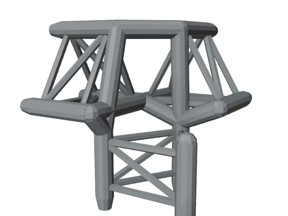 | `truss-3-point-corner-3-way-down` 3-point corner 3 way down block, 500 mm arms | 679 x 698 x 679 mm |
| 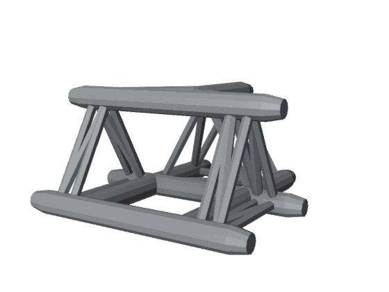 | `truss-3-point-corner-3-way-t` 3-point corner 3 way t block, 500 mm arms | 1068 x 258 x 679 mm |
| 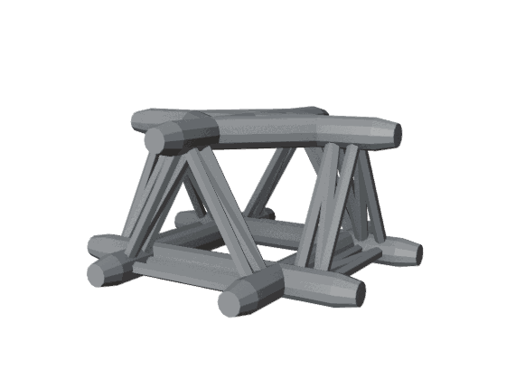 | `truss-3-point-corner-4-way-cross` 3-point corner 4 way cross block, 500 mm arms | 1068 x 258 x 1068 mm |
| 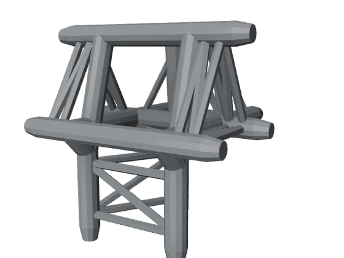 | `truss-3-point-corner-4-way-down` 3-point corner 4 way down block, 500 mm arms | 1068 x 698 x 679 mm |
| 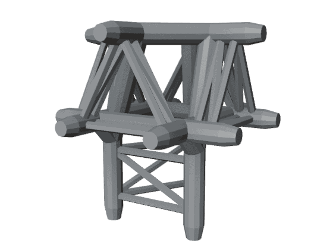 | `truss-3-point-corner-5-way` 3-point corner 5 way block, 500 mm arms | 1068 x 698 x 1068 mm |
| 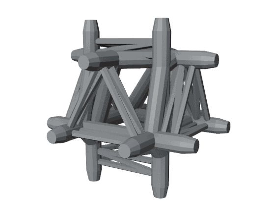 | `truss-3-point-corner-6-way` 3-point corner 6 way block, 500 mm arms | 1068 x 1068 x 1068 mm |
| 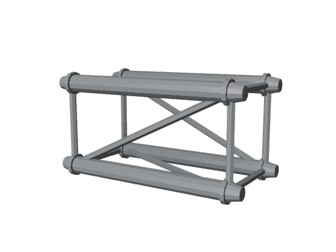 | `truss-4-point-0500` 4-point truss, 500 mm: 50 chords 240 apart, 20 braces, bay every 340 | 568 x 304 x 304 mm |
| 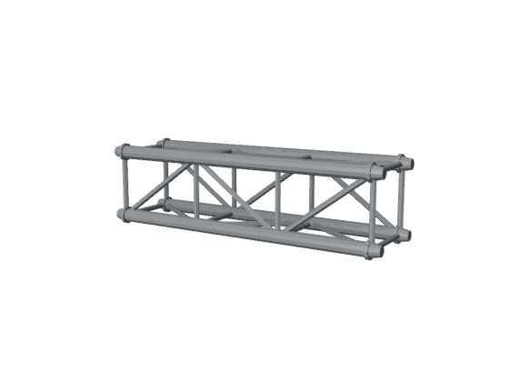 | `truss-4-point-1000` 4-point truss, 1000 mm: 50 chords 240 apart, 20 braces, bay every 340 | 1068 x 304 x 304 mm |
| 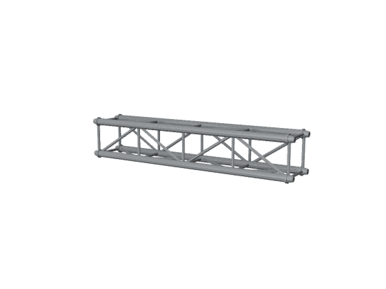 | `truss-4-point-1500` 4-point truss, 1500 mm: 50 chords 240 apart, 20 braces, bay every 340 | 1568 x 304 x 304 mm |
| 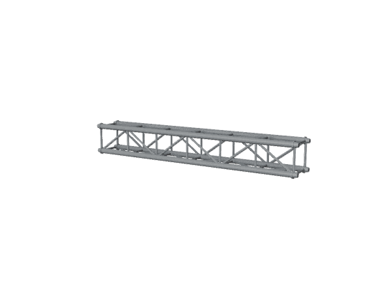 | `truss-4-point-2000` 4-point truss, 2000 mm: 50 chords 240 apart, 20 braces, bay every 340 | 2068 x 304 x 304 mm |
|  | `truss-4-point-2500` 4-point truss, 2500 mm: 50 chords 240 apart, 20 braces, bay every 340 | 2568 x 304 x 304 mm |
| 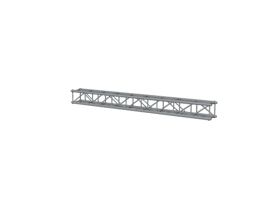 | `truss-4-point-3000` 4-point truss, 3000 mm: 50 chords 240 apart, 20 braces, bay every 340 | 3068 x 304 x 304 mm |
| 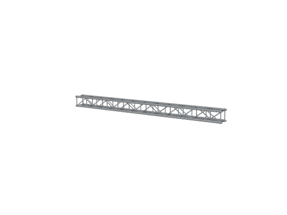 | `truss-4-point-4000` 4-point truss, 4000 mm: 50 chords 240 apart, 20 braces, bay every 340 | 4068 x 304 x 304 mm |
| 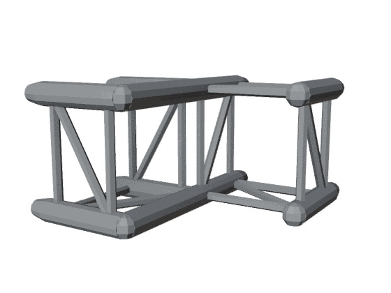 | `truss-4-point-corner-2-way` 4-point corner 2 way block, 500 mm arms | 679 x 290 x 679 mm |
| 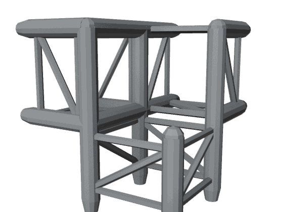 | `truss-4-point-corner-3-way-down` 4-point corner 3 way down block, 500 mm arms | 679 x 679 x 679 mm |
| 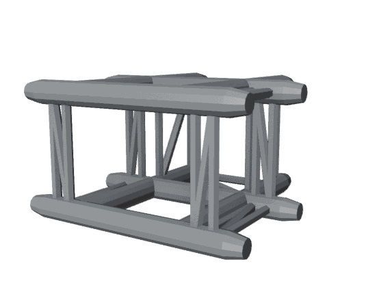 | `truss-4-point-corner-3-way-t` 4-point corner 3 way t block, 500 mm arms | 1068 x 290 x 679 mm |
| 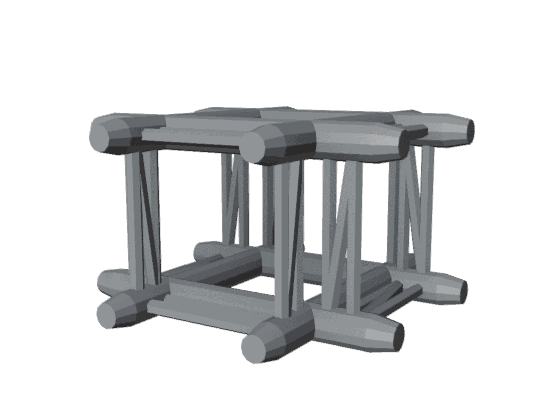 | `truss-4-point-corner-4-way-cross` 4-point corner 4 way cross block, 500 mm arms | 1068 x 290 x 1068 mm |
| 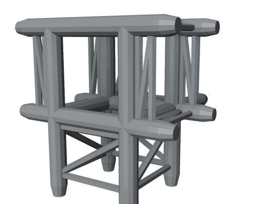 | `truss-4-point-corner-4-way-down` 4-point corner 4 way down block, 500 mm arms | 1068 x 679 x 679 mm |
| 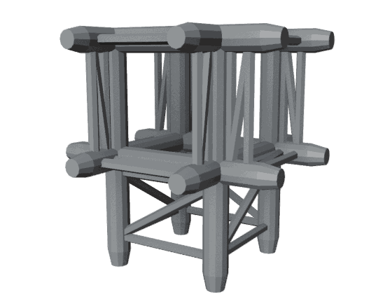 | `truss-4-point-corner-5-way` 4-point corner 5 way block, 500 mm arms | 1068 x 679 x 1068 mm |
| 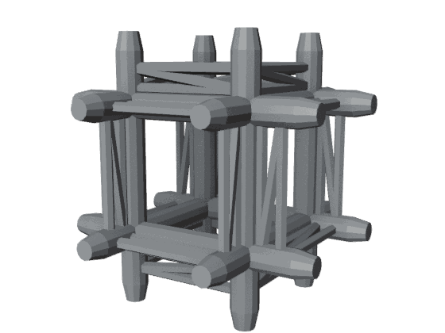 | `truss-4-point-corner-6-way` 4-point corner 6 way block, 500 mm arms | 1068 x 1068 x 1068 mm |
| 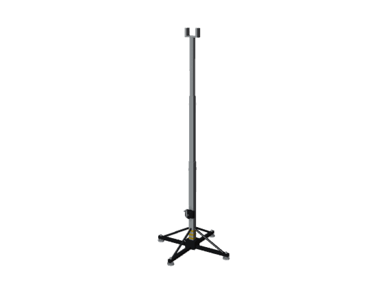 | `truss-lift` Truss lift: 4800 telescopic mast on a 1800 outrigger base with a winch | 1910 x 4970 x 1910 mm |

## Stage and venue

| Model | Name | Size (W x H x D) |
| --- | --- | --- |
| 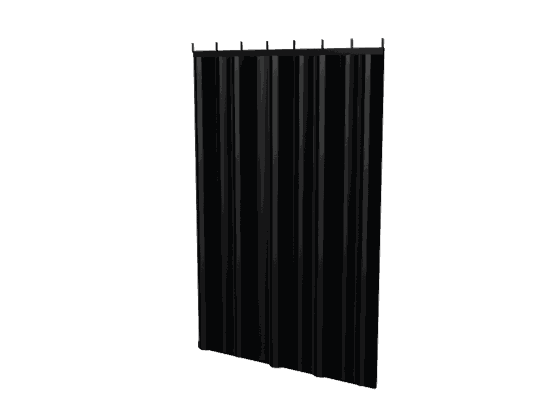 | `curtain-2000x3000-black` Drape 2000 x 3000 mm, black, 50% fullness gathered every 450 | 2016 x 3075 x 227 mm |
| 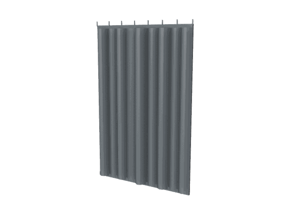 | `curtain-2000x3000-grey` Drape 2000 x 3000 mm, grey, 50% fullness gathered every 450 | 2016 x 3075 x 227 mm |
| 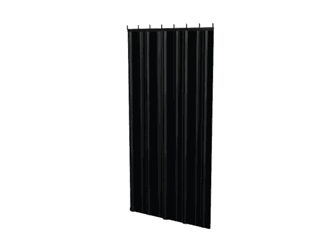 | `curtain-2000x4000-black` Drape 2000 x 4000 mm, black, 50% fullness gathered every 450 | 2016 x 4075 x 227 mm |
| 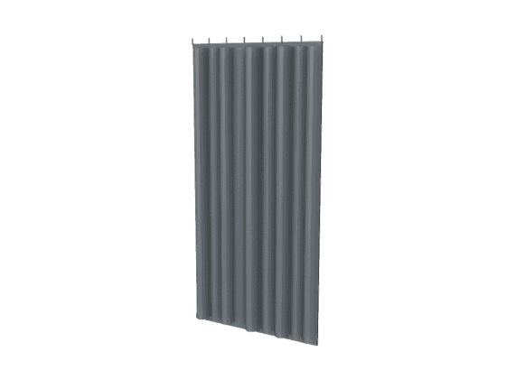 | `curtain-2000x4000-grey` Drape 2000 x 4000 mm, grey, 50% fullness gathered every 450 | 2016 x 4075 x 227 mm |
| 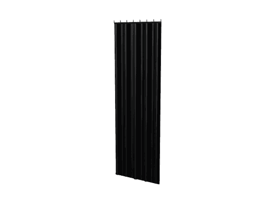 | `curtain-2000x6000-black` Drape 2000 x 6000 mm, black, 50% fullness gathered every 450 | 2016 x 6075 x 227 mm |
| 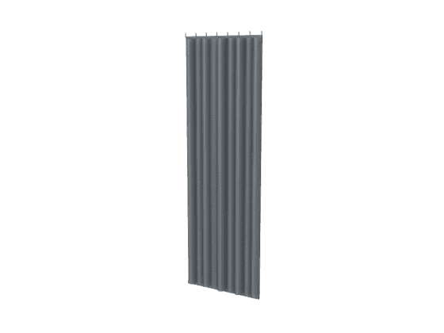 | `curtain-2000x6000-grey` Drape 2000 x 6000 mm, grey, 50% fullness gathered every 450 | 2016 x 6075 x 227 mm |
| 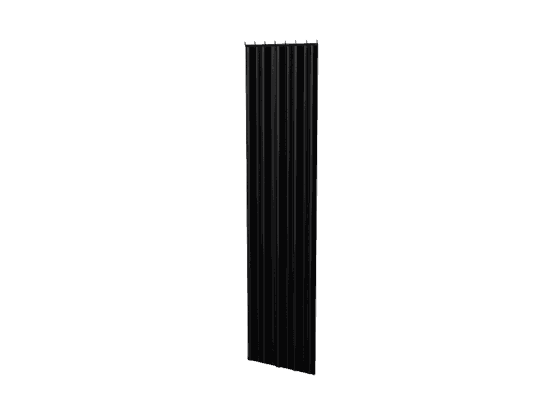 | `curtain-2000x8000-black` Drape 2000 x 8000 mm, black, 50% fullness gathered every 450 | 2016 x 8075 x 227 mm |
| 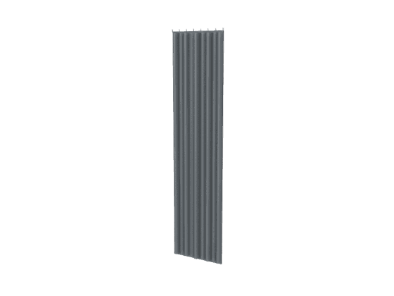 | `curtain-2000x8000-grey` Drape 2000 x 8000 mm, grey, 50% fullness gathered every 450 | 2016 x 8075 x 227 mm |
| 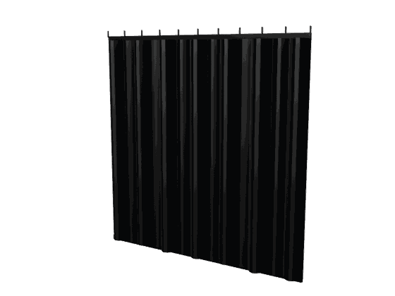 | `curtain-3000x3000-black` Drape 3000 x 3000 mm, black, 50% fullness gathered every 450 | 3016 x 3075 x 227 mm |
| 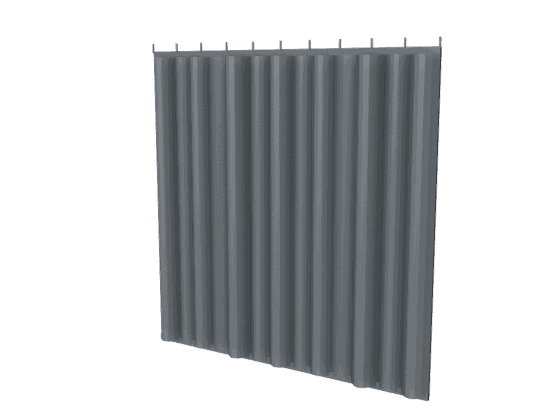 | `curtain-3000x3000-grey` Drape 3000 x 3000 mm, grey, 50% fullness gathered every 450 | 3016 x 3075 x 227 mm |
| 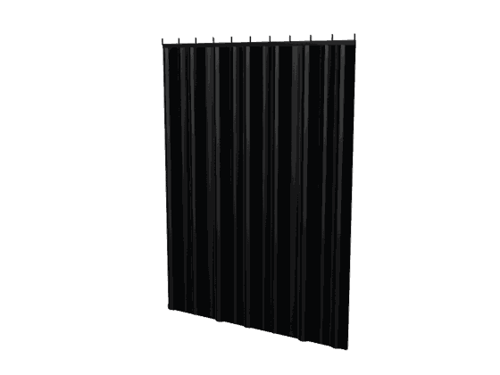 | `curtain-3000x4000-black` Drape 3000 x 4000 mm, black, 50% fullness gathered every 450 | 3016 x 4075 x 227 mm |
| 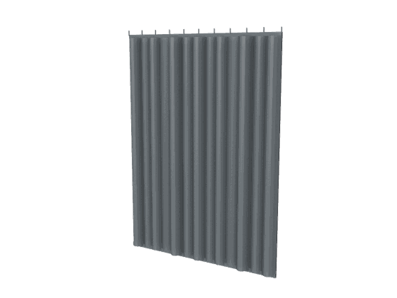 | `curtain-3000x4000-grey` Drape 3000 x 4000 mm, grey, 50% fullness gathered every 450 | 3016 x 4075 x 227 mm |
| 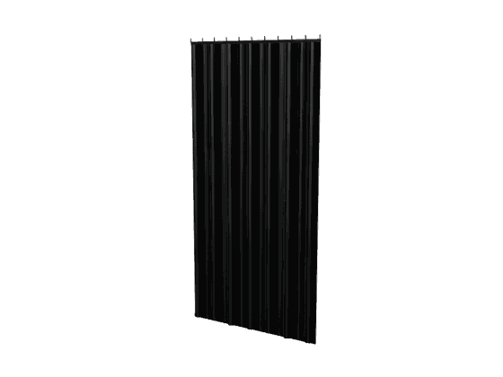 | `curtain-3000x6000-black` Drape 3000 x 6000 mm, black, 50% fullness gathered every 450 | 3016 x 6075 x 227 mm |
| 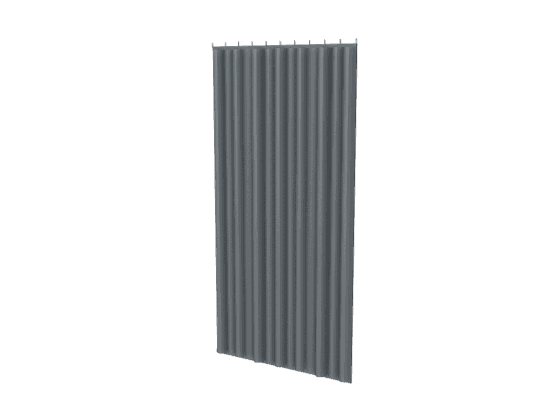 | `curtain-3000x6000-grey` Drape 3000 x 6000 mm, grey, 50% fullness gathered every 450 | 3016 x 6075 x 227 mm |
| 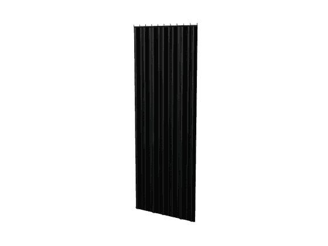 | `curtain-3000x8000-black` Drape 3000 x 8000 mm, black, 50% fullness gathered every 450 | 3016 x 8075 x 227 mm |
| 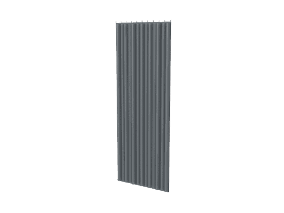 | `curtain-3000x8000-grey` Drape 3000 x 8000 mm, grey, 50% fullness gathered every 450 | 3016 x 8075 x 227 mm |
| 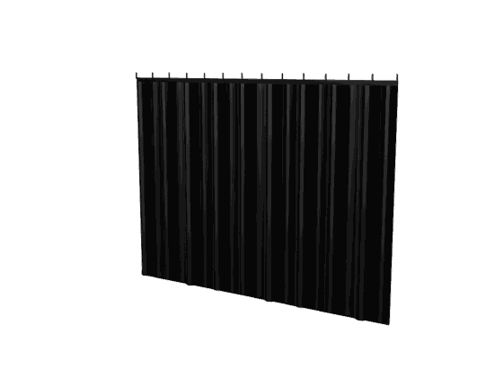 | `curtain-4000x3000-black` Drape 4000 x 3000 mm, black, 50% fullness gathered every 450 | 4016 x 3075 x 227 mm |
| 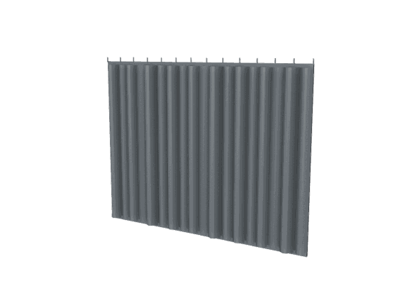 | `curtain-4000x3000-grey` Drape 4000 x 3000 mm, grey, 50% fullness gathered every 450 | 4016 x 3075 x 227 mm |
| 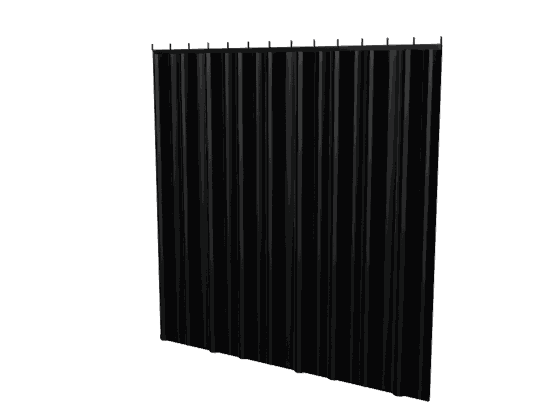 | `curtain-4000x4000-black` Drape 4000 x 4000 mm, black, 50% fullness gathered every 450 | 4016 x 4075 x 227 mm |
|  | `curtain-4000x4000-grey` Drape 4000 x 4000 mm, grey, 50% fullness gathered every 450 | 4016 x 4075 x 227 mm |
| 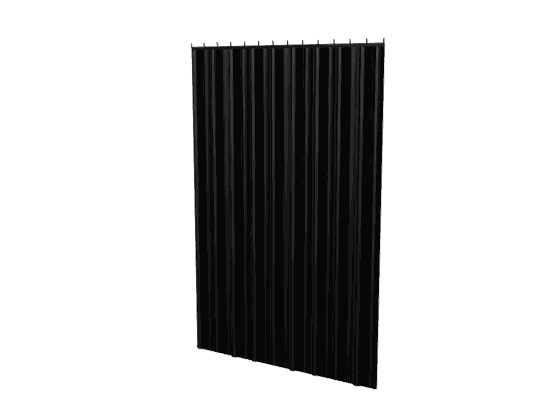 | `curtain-4000x6000-black` Drape 4000 x 6000 mm, black, 50% fullness gathered every 450 | 4016 x 6075 x 227 mm |
| 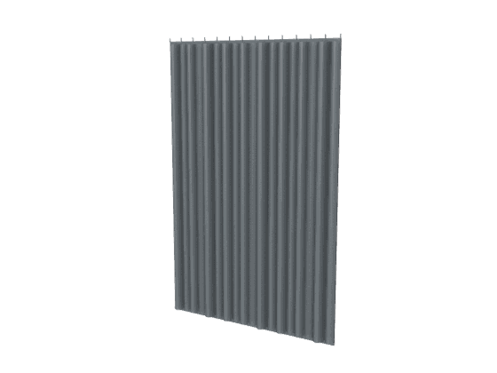 | `curtain-4000x6000-grey` Drape 4000 x 6000 mm, grey, 50% fullness gathered every 450 | 4016 x 6075 x 227 mm |
| 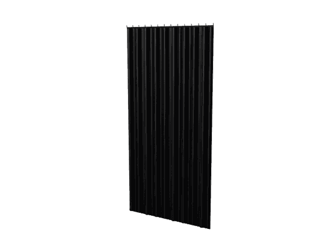 | `curtain-4000x8000-black` Drape 4000 x 8000 mm, black, 50% fullness gathered every 450 | 4016 x 8075 x 227 mm |
| 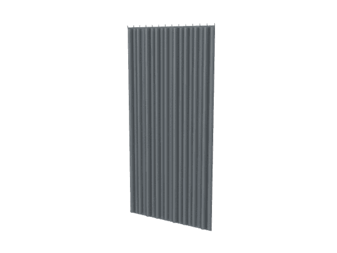 | `curtain-4000x8000-grey` Drape 4000 x 8000 mm, grey, 50% fullness gathered every 450 | 4016 x 8075 x 227 mm |
| 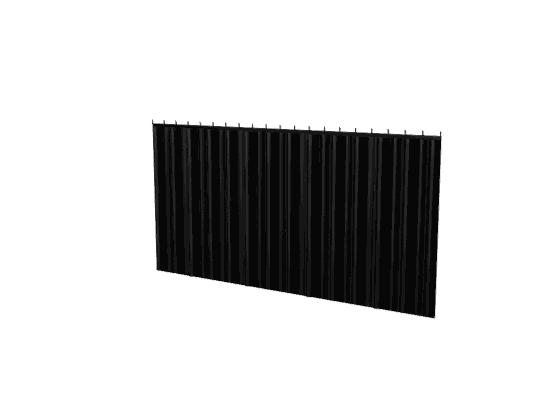 | `curtain-6000x3000-black` Drape 6000 x 3000 mm, black, 50% fullness gathered every 450 | 6016 x 3075 x 227 mm |
| 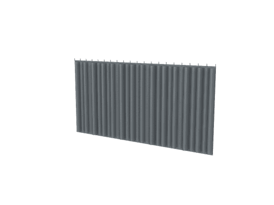 | `curtain-6000x3000-grey` Drape 6000 x 3000 mm, grey, 50% fullness gathered every 450 | 6016 x 3075 x 227 mm |
| 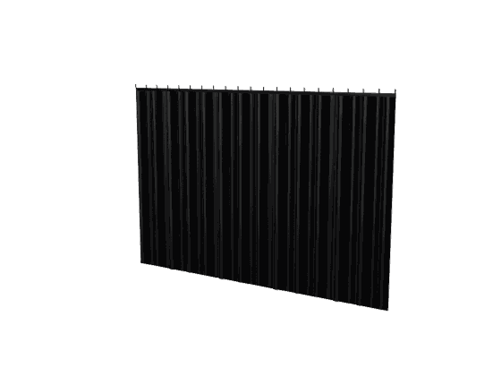 | `curtain-6000x4000-black` Drape 6000 x 4000 mm, black, 50% fullness gathered every 450 | 6016 x 4075 x 227 mm |
| 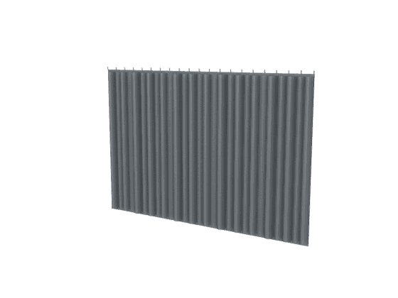 | `curtain-6000x4000-grey` Drape 6000 x 4000 mm, grey, 50% fullness gathered every 450 | 6016 x 4075 x 227 mm |
| 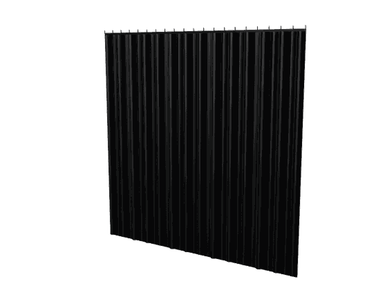 | `curtain-6000x6000-black` Drape 6000 x 6000 mm, black, 50% fullness gathered every 450 | 6016 x 6075 x 227 mm |
| 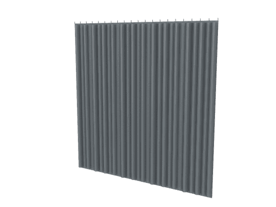 | `curtain-6000x6000-grey` Drape 6000 x 6000 mm, grey, 50% fullness gathered every 450 | 6016 x 6075 x 227 mm |
|  | `curtain-6000x8000-black` Drape 6000 x 8000 mm, black, 50% fullness gathered every 450 | 6016 x 8075 x 227 mm |
| 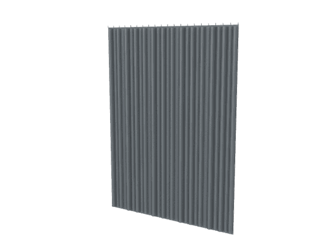 | `curtain-6000x8000-grey` Drape 6000 x 8000 mm, grey, 50% fullness gathered every 450 | 6016 x 8075 x 227 mm |
| 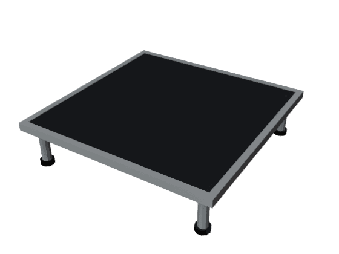 | `deck-1000x1000-legs-0200` Stage deck 1000 x 1000 at 200 mm leg height | 1000 x 240 x 1000 mm |
| 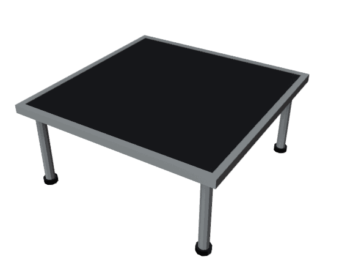 | `deck-1000x1000-legs-0400` Stage deck 1000 x 1000 at 400 mm leg height | 1000 x 440 x 1000 mm |
| 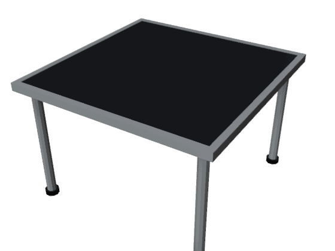 | `deck-1000x1000-legs-0600` Stage deck 1000 x 1000 at 600 mm leg height | 1000 x 640 x 1000 mm |
| 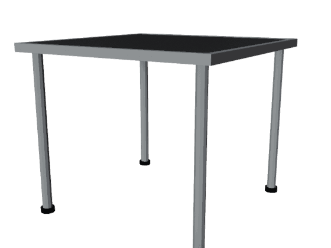 | `deck-1000x1000-legs-0800` Stage deck 1000 x 1000 at 800 mm leg height | 1000 x 840 x 1000 mm |
| 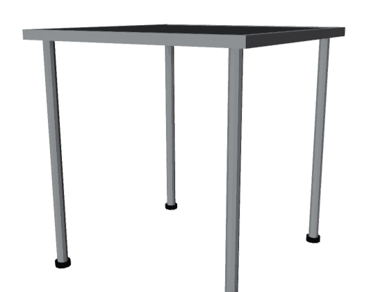 | `deck-1000x1000-legs-1000` Stage deck 1000 x 1000 at 1000 mm leg height | 1000 x 1040 x 1000 mm |
| 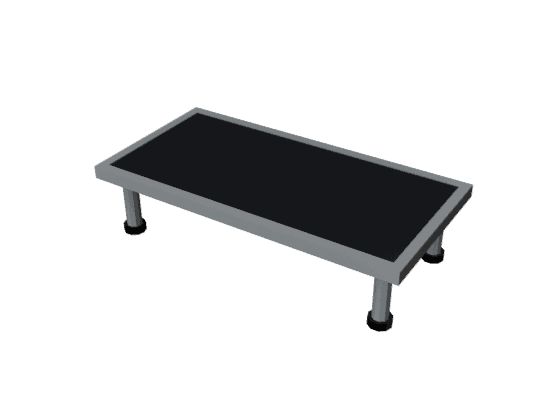 | `deck-1000x500-legs-0200` Stage deck 1000 x 500 at 200 mm leg height | 1000 x 240 x 500 mm |
| 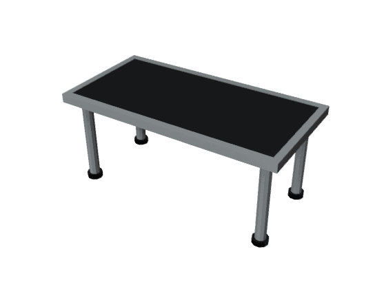 | `deck-1000x500-legs-0400` Stage deck 1000 x 500 at 400 mm leg height | 1000 x 440 x 500 mm |
| 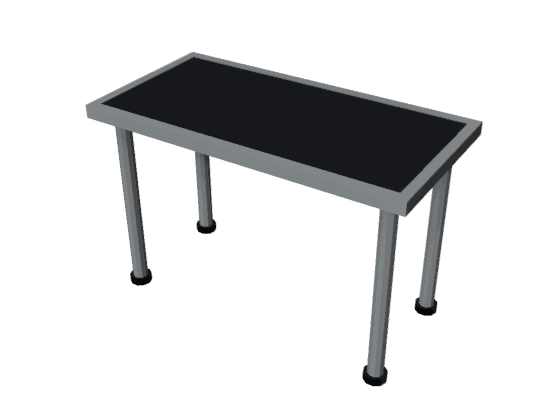 | `deck-1000x500-legs-0600` Stage deck 1000 x 500 at 600 mm leg height | 1000 x 640 x 500 mm |
| 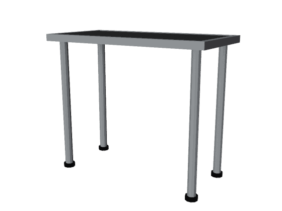 | `deck-1000x500-legs-0800` Stage deck 1000 x 500 at 800 mm leg height | 1000 x 840 x 500 mm |
| 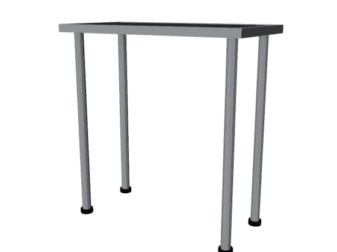 | `deck-1000x500-legs-1000` Stage deck 1000 x 500 at 1000 mm leg height | 1000 x 1040 x 500 mm |
| 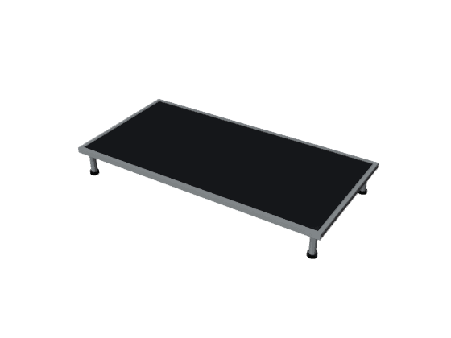 | `deck-2000x1000-legs-0200` Stage deck 2000 x 1000 at 200 mm leg height | 2000 x 240 x 1000 mm |
| 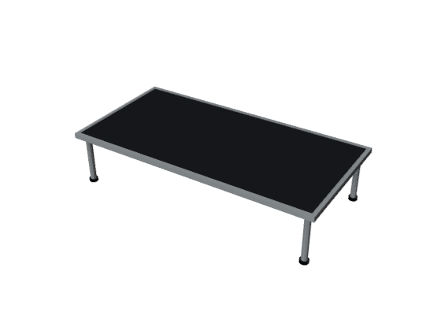 | `deck-2000x1000-legs-0400` Stage deck 2000 x 1000 at 400 mm leg height | 2000 x 440 x 1000 mm |
| 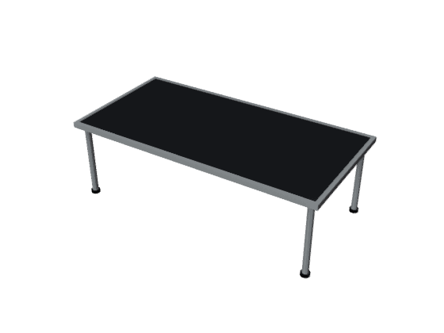 | `deck-2000x1000-legs-0600` Stage deck 2000 x 1000 at 600 mm leg height | 2000 x 640 x 1000 mm |
| 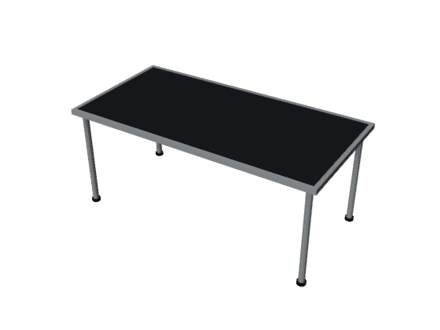 | `deck-2000x1000-legs-0800` Stage deck 2000 x 1000 at 800 mm leg height | 2000 x 840 x 1000 mm |
| 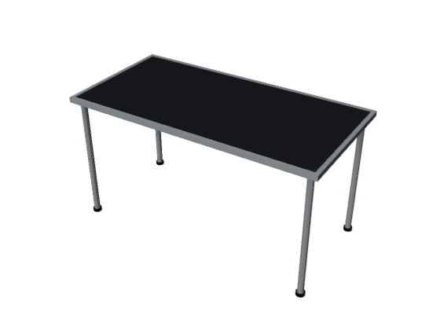 | `deck-2000x1000-legs-1000` Stage deck 2000 x 1000 at 1000 mm leg height | 2000 x 1040 x 1000 mm |
| 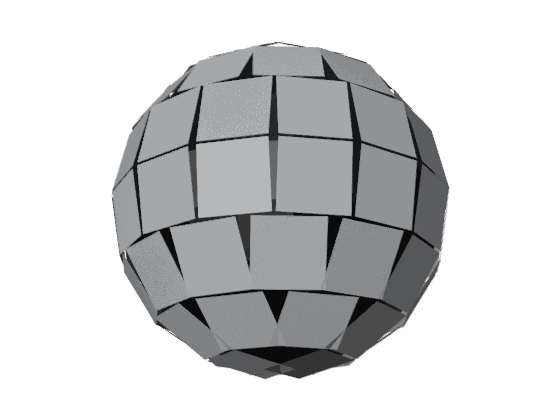 | `mirror-ball-0200-no-clamp` Mirror ball 200 mm on a 250 drop chain, faceted with 40 mm tiles; no mounting hardware | 207 x 206 x 208 mm |
| 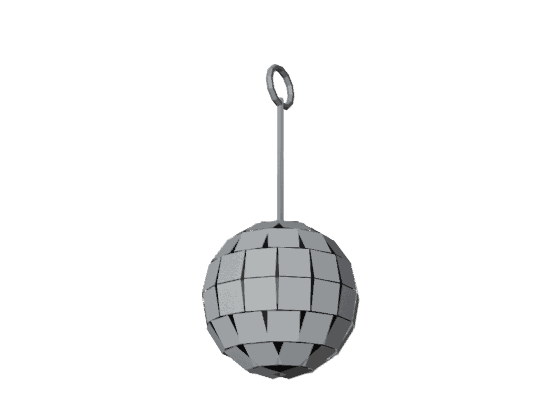 | `mirror-ball-0200` Mirror ball 200 mm on a 250 drop chain, faceted with 40 mm tiles | 207 x 458 x 208 mm |
| 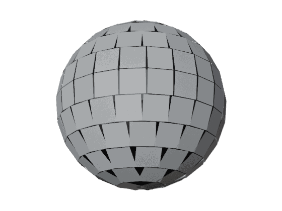 | `mirror-ball-0300-no-clamp` Mirror ball 300 mm on a 250 drop chain, faceted with 40 mm tiles; no mounting hardware | 306 x 304 x 306 mm |
| 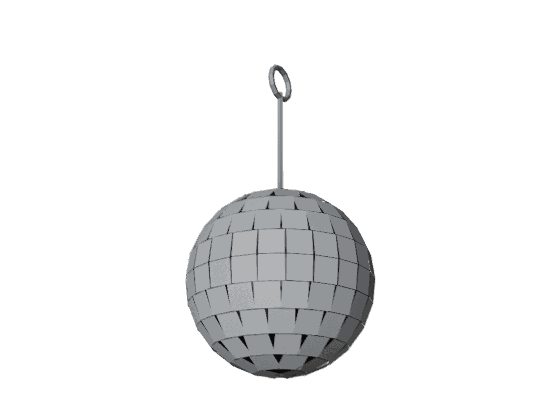 | `mirror-ball-0300` Mirror ball 300 mm on a 250 drop chain, faceted with 40 mm tiles | 306 x 557 x 306 mm |
| 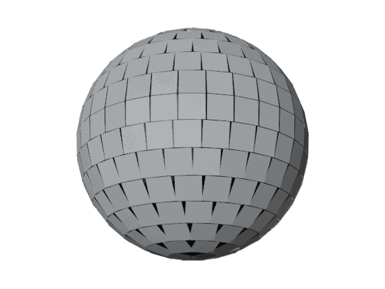 | `mirror-ball-0400-no-clamp` Mirror ball 400 mm on a 250 drop chain, faceted with 40 mm tiles; no mounting hardware | 405 x 404 x 405 mm |
| 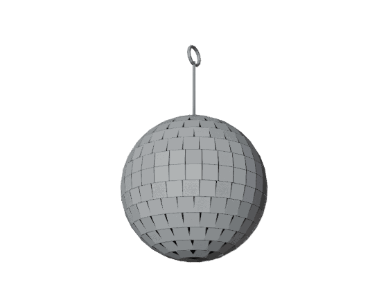 | `mirror-ball-0400` Mirror ball 400 mm on a 250 drop chain, faceted with 40 mm tiles | 405 x 657 x 405 mm |
| 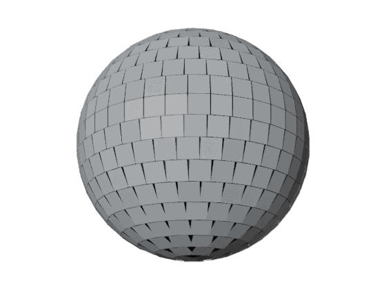 | `mirror-ball-0500-no-clamp` Mirror ball 500 mm on a 250 drop chain, faceted with 40 mm tiles; no mounting hardware | 504 x 504 x 505 mm |
| 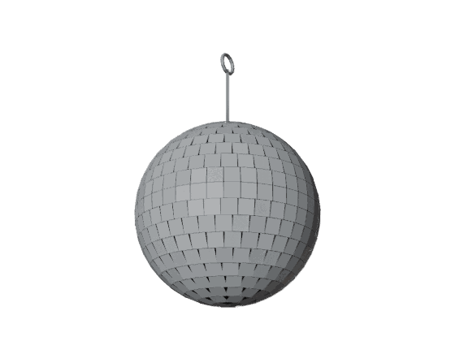 | `mirror-ball-0500` Mirror ball 500 mm on a 250 drop chain, faceted with 40 mm tiles | 504 x 757 x 505 mm |
| 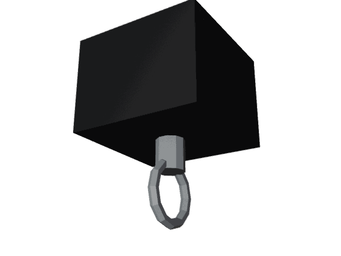 | `mirror-ball-motor-no-clamp` Mirror ball motor: 120 x 120 x 90 with a rotating hook; no mounting hardware | 120 x 180 x 120 mm |
| 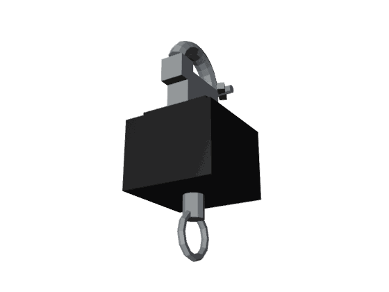 | `mirror-ball-motor` Mirror ball motor: 120 x 120 x 90 with a rotating hook | 120 x 285 x 124 mm |
| 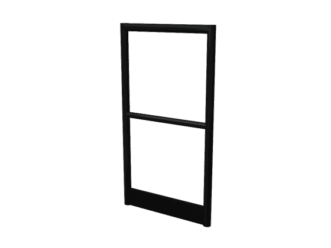 | `railing-0500` Guardrail 500 mm: 1000 high, 40 top rail, 32 knee rail, 100 toe board | 540 x 1000 x 38 mm |
| 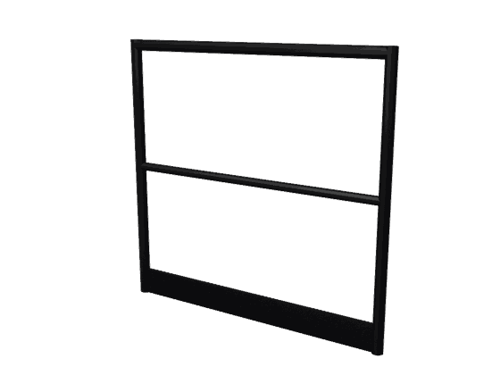 | `railing-1000` Guardrail 1000 mm: 1000 high, 40 top rail, 32 knee rail, 100 toe board | 1040 x 1000 x 38 mm |
| 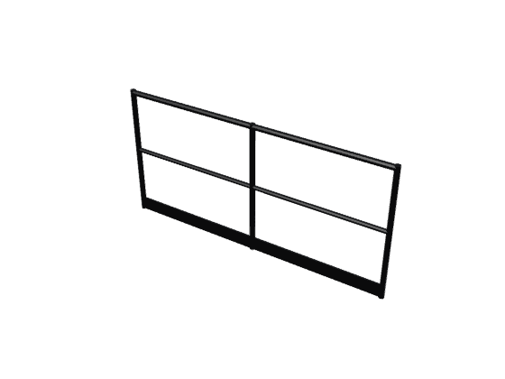 | `railing-2000` Guardrail 2000 mm: 1000 high, 40 top rail, 32 knee rail, 100 toe board | 2040 x 1000 x 38 mm |

## Flight cases

| Model | Name | Size (W x H x D) |
| --- | --- | --- |
| 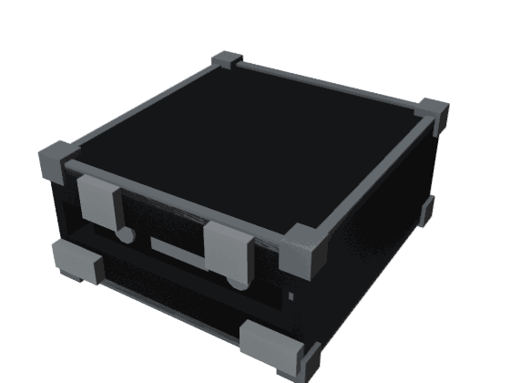 | `rack-02u` Flight case rack, 2U: 600 x 640 shell, open front and back | 620 x 319 x 677 mm |
| 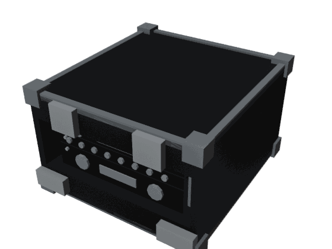 | `rack-04u` Flight case rack, 4U: 600 x 640 shell, open front and back | 620 x 408 x 677 mm |
| 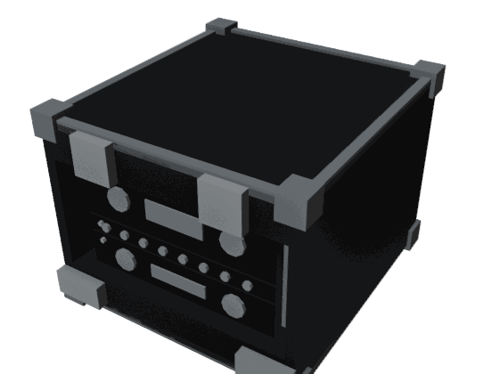 | `rack-06u` Flight case rack, 6U: 600 x 640 shell, open front and back | 620 x 497 x 677 mm |
| 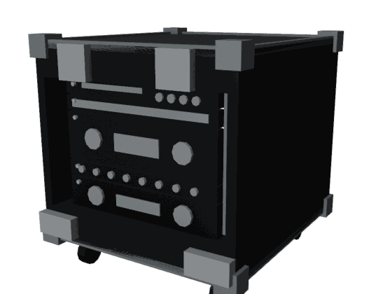 | `rack-08u-wheels` Flight case rack, 8U on castors: 600 x 640 shell, open front and back | 620 x 656 x 677 mm |
| 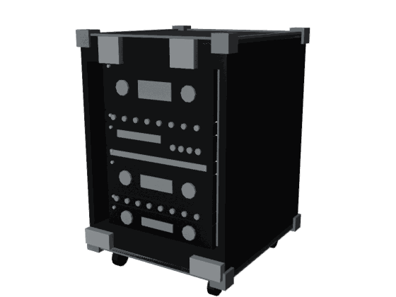 | `rack-14u-wheels` Flight case rack, 14U on castors: 600 x 640 shell, open front and back | 620 x 922 x 677 mm |
| 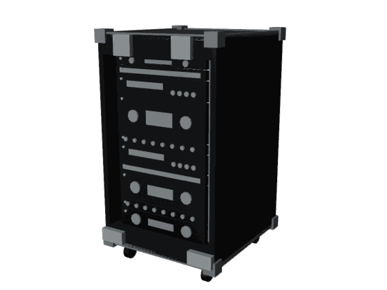 | `rack-18u-wheels` Flight case rack, 18U on castors: 600 x 640 shell, open front and back | 620 x 1100 x 677 mm |

## Backline and PA

| Model | Name | Size (W x H x D) |
| --- | --- | --- |
| 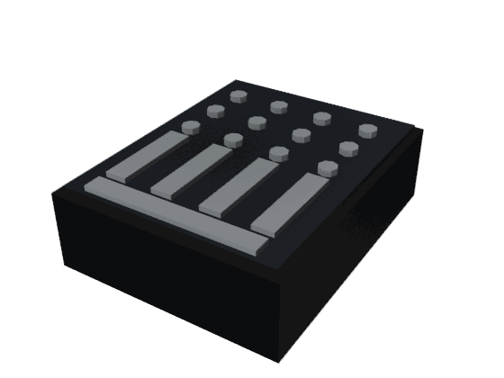 | `dj-mixer` DJ mixer: 320 x 400 x 110 club unit | 320 x 127 x 400 mm |
| 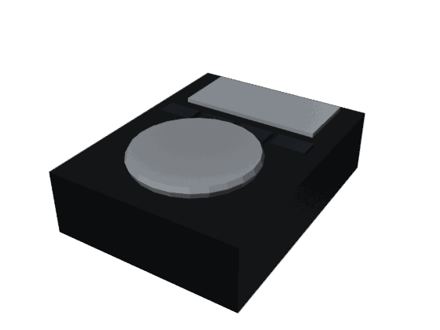 | `dj-player` DJ media player: 320 x 420 x 110 with a jog wheel | 320 x 128 x 420 mm |
| 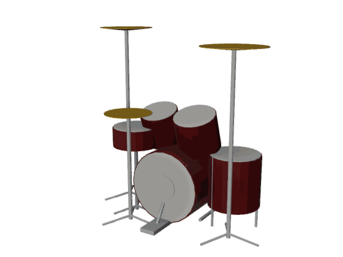 | `drum-kit` Drum kit: 22 kick, snare, two toms, floor tom, three cymbals | 1521 x 1455 x 804 mm |
| 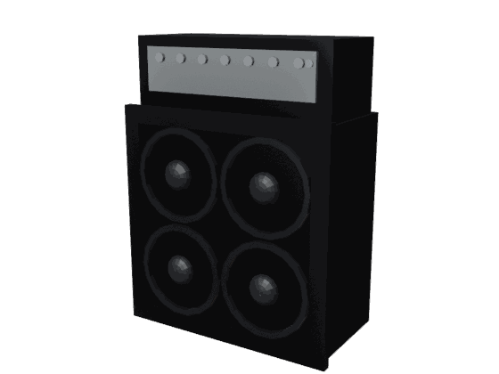 | `guitar-amp` Guitar stack: 4x12 cabinet with a head | 790 x 1030 x 420 mm |
| 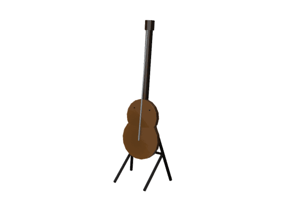 | `guitar-in-stand` Electric guitar on an A-frame stand | 445 x 1387 x 372 mm |
| 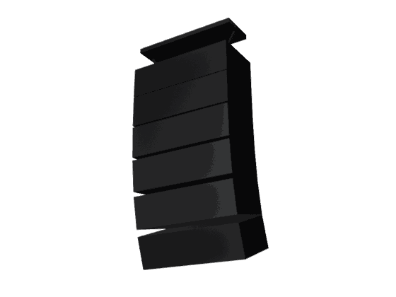 | `line-array-hang-no-clamp` Line array: six 900 x 420 elements flown from a frame; no mounting hardware | 900 x 1920 x 611 mm |
| 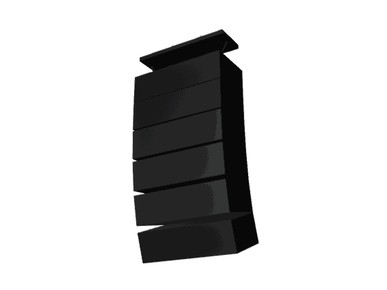 | `line-array-hang` Line array: six 900 x 420 elements flown from a frame | 900 x 2027 x 611 mm |
| 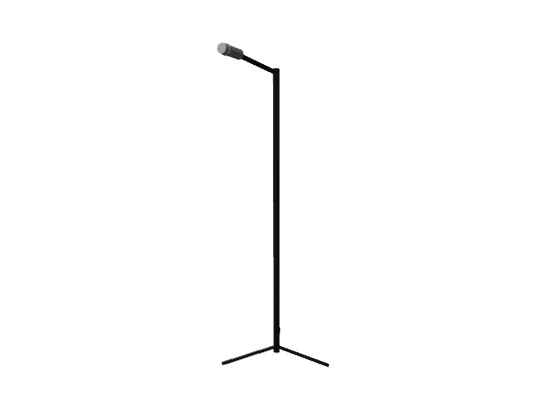 | `microphone-stand` Boom microphone stand at 1500 | 458 x 1559 x 693 mm |
| 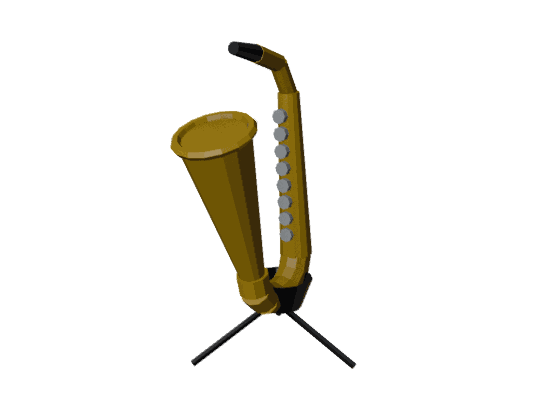 | `saxophone-in-stand` Tenor saxophone on a stand | 372 x 823 x 564 mm |
| 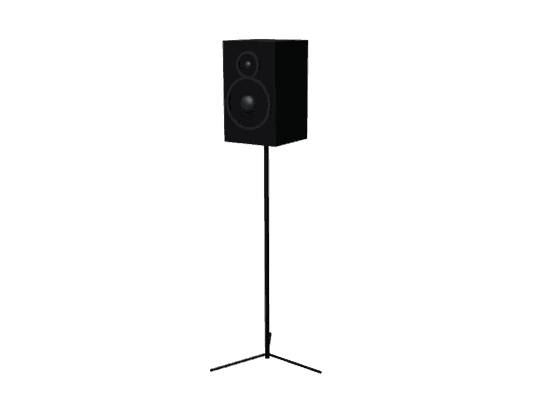 | `speaker-on-pole` PA top on a tripod pole stand | 638 x 2129 x 736 mm |
| 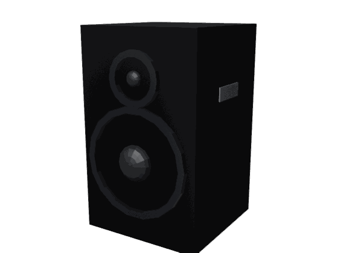 | `speaker-top` PA top: 380 x 380 x 620 two-way on a pole socket | 386 x 620 x 416 mm |
| 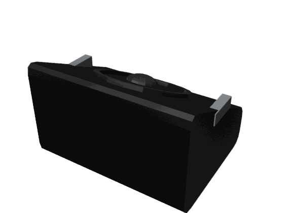 | `stage-monitor` Stage monitor wedge: 560 x 440 x 360 | 566 x 346 x 440 mm |
| 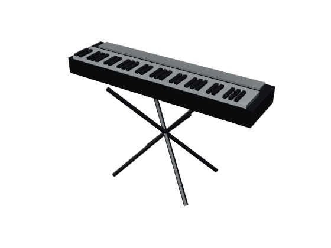 | `stage-piano` Stage piano 1320 x 340 on an X stand | 1320 x 858 x 467 mm |
| 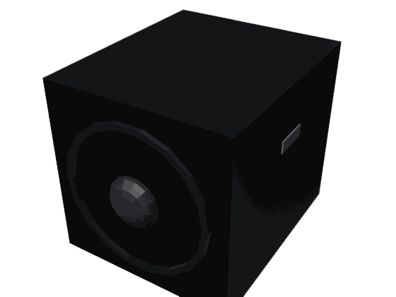 | `subwoofer` Subwoofer: 600 x 700 x 600 with an 18 driver | 606 x 600 x 752 mm |

## Figures

| Model | Name | Size (W x H x D) |
| --- | --- | --- |
| 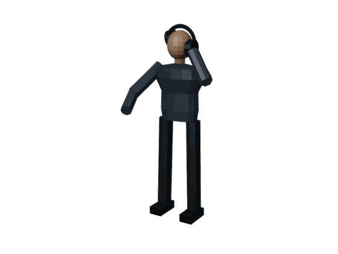 | `figure-deejay` Deejay at the booth, 1750 tall, cueing one ear | 751 x 1726 x 611 mm |
| 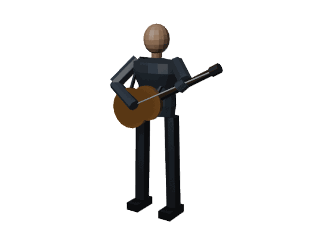 | `figure-guitarist` Guitar player, 1750 tall, guitar in hand | 1077 x 1676 x 421 mm |
| 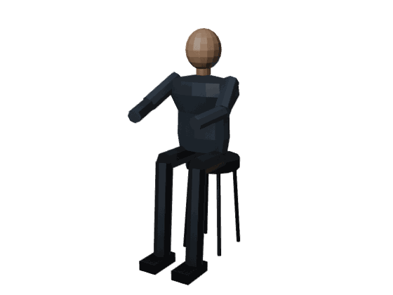 | `figure-pianist` Pianist seated at a keyboard, 1300 seated height | 616 x 1457 x 756 mm |
| 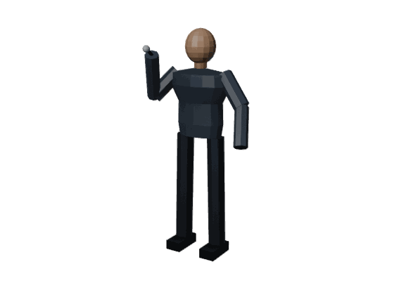 | `figure-singer` Singer, 1750 tall, microphone in hand | 853 x 1676 x 520 mm |

