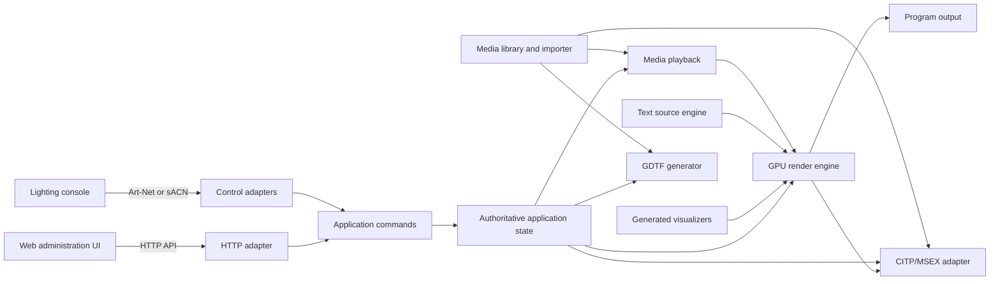

# Media Server Application Behavior

This document defines what ToskLight Media Core is, how the current application behaves, which declared capabilities are not complete yet, and how a new implementation should be structured from the beginning.

It is both:

- a behavioral contract for preserving and completing the product; and
- an architecture brief for a clean, cross-platform Rust rebuild.

The current C++/openFrameworks application remains the implementation reference where its behavior is intentional. Accidental limitations, duplicated implementations, stale documentation, and platform-specific omissions are not part of the desired product contract.

## Plan status

**Later — specification only.** This document is the canonical Media behavior plan at `docs/plans/Later/media/02-media-server-application-behavior.md` in `/Users/keller/repos/light`. It does not authorize Media production implementation, changes to the active Light refactor, protocol replacement, or desk UI integration. Move the relevant chunk to `docs/plans/Next` only after the target-baseline entry gate in this plan has been approved.

## Status vocabulary

This document uses the following terms deliberately:

- **Implemented**: the behavior exists in the current `/Users/keller/repos/media` source working tree unless a target implementation is explicitly named.
- **Partial**: some of the behavior exists, but it is incomplete, inconsistent, or platform-specific.
- **Declared**: the data model, DMX footprint, UI, or documentation reserves the behavior, but the runtime does not yet perform it.
- **Required**: the behavior belongs to the product contract for the rebuild, even if it is not implemented today.
- **Decision required**: the current sources disagree or do not define enough behavior to reproduce it safely.

An unimplemented feature is not assumed to be unwanted. It is recorded as unfinished work unless a later product decision explicitly removes it.

## Product principles

1. The application is a real-time media server controlled by a lighting console and by its web administration interface.
2. The basic current behavior is rebuilt first, before additional manipulation and effects capabilities.
3. A supported feature should behave consistently on macOS, Windows, and Linux whenever the underlying operating systems can provide the capability.
4. Platform differences belong behind adapters. Domain behavior, DMX behavior, APIs, file formats, and visual output must not fork by operating system.
5. Media manipulation is a first-class product capability, not an incidental renderer detail.
6. Art-Net, sACN, the web API, CITP, GDTF, and the renderer must describe and control the same state model.
7. Real-time paths must be bounded. Network bursts, slow decoders, uploads, thumbnail work, and logging must not stall rendering or accumulate unbounded work.
8. Persisted formats and external protocols are versioned compatibility contracts.
9. The administration frontend is written in React.
10. The shared UI library comes from the ToskLight application. Media Core will be rebuilt into `/Users/keller/repos/light`, composing those primitives into media-server features instead of creating a competing local component library.

## Repository roles and migration boundary

This work spans two repositories with deliberately different roles:

| Repository | Role during migration | May become a target dependency? |
|---|---|---|
| `/Users/keller/repos/media` | Legacy/source Media implementation, behavior reference, and asset/configuration source | No |
| `/Users/keller/repos/light` | New Light application, existing Rust/React workspace, home of this canonical migration plan, and the only production target for the rebuilt Media application | Yes; it is the target workspace itself |

All relative current-implementation paths such as `apps/server-core` and `apps/web-ui` refer to `/Users/keller/repos/media`. All target paths under `apps/`, `crates/`, and `packages/` refer to `/Users/keller/repos/light`.

The migration is one-way. The target repository must not use Cargo path dependencies, npm links, runtime file lookups, Git submodules, or build steps that reach back into `/Users/keller/repos/media`. Code, tests, fixtures, and assets are transferred into owned target locations with provenance and licensing recorded. Once a behavior slice is accepted in Light, its target tests and documentation become authoritative for that slice; it is not synchronized back into the C++ application.

The legacy repository remains runnable as a comparison oracle until cutover. Changes there during migration are limited to characterization fixtures/tests and narrowly justified fixes required to establish observable behavior. New product architecture, canonical planning, and production Rust implementation belong only in `/Users/keller/repos/light`.

### Coordination with the active Light refactor

`/Users/keller/repos/light` is currently undergoing a major refactor on its `refactoring` branch. Media migration must not be developed directly on top of an uncommitted or moving checkout.

Before target implementation begins:

1. Record the exact Light commit that is the approved Media integration baseline.
2. Confirm the relevant Light refactor gates pass at that commit: workspace build/tests, architecture ratchets, generated wire contracts, and the shared UI/Storybook checks needed by Media.
3. Create a dedicated Media integration branch and Git worktree from that approved baseline.
4. Keep the existing Light refactor checkout and all unrelated dirty files untouched.
5. Rebase or merge later Light refactor milestones deliberately, rerunning both Light and Media acceptance suites after each integration.

The presence of this plan in `/Users/keller/repos/light` authorizes only this documentation move. It does not authorize production changes, declare the ongoing refactor complete, or make the current dirty checkout an integration baseline.

## Target workspace decision

The target is the existing workspace at **`/Users/keller/repos/light`**, containing two separate products plus shared capability crates:

- the existing Light control desk remains its own runnable application;
- the Media Server becomes another independently runnable application;
- genuinely shared protocol, fixture, audio-analysis, domain, and UI capabilities live in narrowly owned shared crates/packages; and
- product orchestration, state, APIs, and operator workflows remain in their respective application slices.

This is a repository/workspace merge, not a forced process merge and not one large Rust crate. A Cargo workspace can contain any number of library crates and binary applications. The `apps/` and `crates/` names are repository conventions: Cargo packages may expose library targets, binary targets, or both.

This structure is preferable to either extreme:

- keeping two repositories would duplicate GDTF, CITP, audio analysis, release tooling, and UI infrastructure; and
- combining both products into one application would couple their lifecycles, failure modes, state models, and deployment needs unnecessarily.

The vertical slices are therefore `Light Desk`, `Media Server`, and `shared capabilities`. Sharing happens only where the concepts and behavior are actually the same.

## Product overview

ToskLight Media Core presents one or more outputs that each composite media layers. A layer can select an indexed image, video, generated text source, or generated visualizer. Each layer has independent playback, geometry, color, visibility, audio, mask, and effect controls. A master section applies final controls to the combined output.

The application can be controlled through:

- Art-Net DMX;
- sACN/E1.31 DMX;
- the local HTTP API and React administration UI; and
- CITP/MSEX consumers such as a lighting console, for discovery, media browsing, thumbnails, layer status, and output preview.

The application also manages the media library: it indexes folders and files, accepts uploads, normalizes media, generates thumbnails, renames and reindexes entries, exposes the library to the web UI and CITP, and generates GDTF profiles matching the DMX footprint.

## System context



## Current source-repository and process overview

The current C++ project in `/Users/keller/repos/media` consists of two production components and one obsolete development utility:

| Component | Path | Purpose | Product status |
|---|---|---|---|
| Server core | `apps/server-core` | Window, rendering, playback, protocols, HTTP API, media management, text, audio, visualizers, CITP, and GDTF | Main product |
| Web UI | `apps/web-ui` | React administration interface served by the core | Main product |
| Lighting-console simulator | `apps/lighting-console` | Historical Art-Net sender and CITP client | Excluded from the target; the real Light desk replaces it |

Behavioral protocol fixtures from the simulator may be migrated into automated tests, but the simulator application itself should not be rebuilt.

The current server entry point is `apps/server-core/src/main.cpp`. It creates a resizable 1920×1080 openFrameworks window. `ofApp::setup()` then loads configuration and constructs the subsystems.

### Current startup sequence

1. Request vertical synchronization and a nominal 60 fps frame rate.
2. Load `media/.info` into `Config`.
3. Install the in-memory log capture channel.
4. Load persisted text sources.
5. Initialize the configured audio input device.
6. Initialize the renderer and media resolver.
7. Start Art-Net and sACN listeners.
8. Start the background media-ingestion worker.
9. Start the HTTP server on port 8080.
10. Start CITP discovery, TCP service, and preview service on port 4809.
11. Initialize eight layers.

### Current frame sequence

On each application update:

1. Update dynamic text sources.
2. Analyze the latest audio input.
3. Advance loaded videos.
4. Update every generated visualizer.

On each draw:

1. Take a snapshot of the application state.
2. Apply the master horizontal/vertical flip to the output coordinate system.
3. Draw layers 0 through 7 in ascending order.
4. Apply the master dimmer as a final black overlay.
5. Capture and publish a CITP live-preview frame when a client has subscribed.
6. Draw the local status overlay when enabled and no configured DMX source is active.

Because later layers are drawn after earlier layers, a later layer appears above an earlier layer wherever it is opaque.

The fixed 60 fps request is current behavior, not the target timing contract. In the target, each output has its own configurable render clock. The default clock is `DisplaySynchronized`: presentation follows the actual refresh timing of the monitor that owns that output. `FixedFps` is available for off-screen, streaming, and test use, and `Unlocked` is a diagnostic mode. Playback and animation advance from monotonic timestamps rather than assuming one update equals 1/60 second. Outputs on displays with different refresh rates must not share one global frame counter or render clock.

## Authoritative state model

The product state has eight layers and one master. Both DMX protocols and the HTTP control endpoint mutate the same conceptual state.

### Layer state

| Field | Meaning | Current status |
|---|---|---|
| `folder` | Media-library folder or generated-source bank | Implemented |
| `file` | Item within the selected folder | Implemented |
| `playmode` | Loop, reverse, bounce, once, their synchronized variants, stop, or pause | Loop/bounce/once/stop/pause implemented; reverse and synchronized modes required |
| `scaleX`, `scaleY` | Independent layer scaling | Implemented |
| `scalingMode` | Fit, fill, original, or stretch | Implemented |
| `posX`, `posY` | Layer center position relative to the output | Implemented |
| `rotation` | Rotation around the layer center | Implemented |
| `dimmer` | Layer alpha/visibility | Implemented |
| `volume` | Per-layer media-audio level | Implemented |
| `tint` | Multiplicative RGB color | Implemented |
| `grayscale` | Blend from source color to luminance | Implemented |
| `maskFolder`, `maskFile` | Media item used as this layer's mask | Declared |
| `maskScaleX`, `maskScaleY` | Independent 16-bit horizontal and vertical mask scaling | Required; replaces the single declared mask scale |
| `maskInvert` | Invert mask luminance/alpha | Declared |
| `maskOpacity` | Strength of the mask | Declared |
| `effects[4]` | Four ordered effect-control values | Declared; effect identities are not yet defined |
| `paused` | Historical Web/API pause override, duplicating `playmode = Pause` | Decision required; recommended removal from canonical state |
| `black` | Historical immediate layer blackout | Decision required; retain only if renamed `blackout` and specified as an independent operator latch |
| `speedMultiplier` | Quantized division/multiplication of effective playback rate, centered at 1× | Required |
| `playbackBpm` | Per-layer DMX target tempo used when the application is configured for channel BPM rather than a desk Speed Group | Required; exact byte mapping is decision required |
| `sourceStatus` | Runtime source lifecycle: Unselected, Loading, Ready, or Failed with a safe error code/summary | Required |
| `resetTriggerId` | Trigger for restarting media | Present in state but not fully connected |

### Master state

| Field | Meaning | Current status |
|---|---|---|
| `dimmer` | Final output intensity | Implemented |
| `volume` | Multiplier for every layer's audio | Implemented |
| `tint` | Multiplicative RGB tint for all layers | Implemented |
| `flipMirror` | None, horizontal, vertical, or both | Implemented |
| `masterMask` | Mask applied to the completed composite | Declared |

### Command ownership

The current web UI becomes read-only when packets are active on the configured DMX protocol and universe. This prevents the UI from appearing to own state that will immediately be overwritten by DMX.

The rebuild must make this an explicit policy:

- All mutations enter through typed application commands.
- The command contains its source (`ArtNet`, `sACN`, `Web`, `Internal`, or `Recovery`) and timestamp.
- The application reducer determines whether a command is accepted.
- Active external DMX owns continuously controlled values.
- The web UI remains able to inspect state and perform explicitly allowed administrative actions.
- DMX activity expires after a documented timeout, after which web control becomes available again.
- Art-Net and sACN translate into identical domain commands and cannot contain separate copies of the DMX mapping logic.

## Media addressing and library behavior

### Address spaces

| Folder range | Target meaning | Status |
|---:|---|---|
| `000` | No media | Required; compatible with current blank behavior |
| `001–199` | Images and videos from the filesystem library | Required; implemented today |
| `200–219` | Twenty text-source banks, each containing a full file-addressed set of text entries | Required; expands current text behavior |
| `220–255` | Generated-visualizer banks | Required; all folders in this range belong to generated sources, not a reserved area |
| Any folder, file `000` | No media/blank selection | Required |
| Any folder, file `255` | No media/blank selection | Required; compatible with current behavior |

Files `001–254` are the usable entries inside a nonzero bank. For text, `(folder, file)` directly identifies a text bank and its entry; it is not converted into an unrelated global slot number. For generated visualizers, each folder is a generated-source namespace whose entries are defined by the generated-source catalog. The catalog may initially populate only part of this address space, but no portion of folders `220–255` is described as reserved media space.

### On-disk layout

Normal media uses this structure:

```text
media/
  .info                         global configuration
  .text-sources.json            text-source definitions
  .system/                      generated system thumbnails
  visualizer_<id>.json          visualizer configuration
  NNN/
    .info                       optional folder name
    .thumbs/
      III-thumb.jpg
    III-Optional-Name.png
    III-Optional-Name.jpg
    III-Optional-Name.jpeg
    III-Optional-Name.mp4
    III-Optional-Name.mov
```

`NNN` is a three-digit folder index. `III` is a three-digit item index. Media variants with the same item index are grouped as one logical item.

### Variant selection

The current resolver chooses a still-image variant before any video variant in this order:

1. PNG
2. JPEG with `.jpg`
3. JPEG with `.jpeg`
4. Preferred video codec (`.mov` for ProRes mode or `.mp4` for H.264 mode)
5. MP4 fallback
6. MOV fallback

The target architecture must model an asset and its variants explicitly. Variant choice belongs to playback capability and configuration, not filesystem iteration order.

### Media manipulation layers

Media manipulation occurs at four different levels and should remain separated:

1. **Library manipulation**: upload, import, validate, transcode, create variants, rename, reindex, reorder, move between folders, name folders, and generate thumbnails.
2. **Playback manipulation**: select, load, start, stop, pause, resume, loop, bounce, play once, seek/reset, and control audio level.
3. **Visual layer manipulation**: scale, scaling mode, position, rotation, tint, grayscale, dimmer, mask, and effect chain.
4. **Master manipulation**: master dimmer, volume, tint, flip/mirror, and master mask.

This separation is important: editing an asset must not silently alter a live layer, and changing a live layer must not rewrite the source asset.

### Upload and ingestion

The current upload endpoint accepts multipart form data containing `file`, `folder`, and optional `fileIdx`.

Current behavior:

1. Save the upload in a temporary directory.
2. Use the requested index, or find the first free `0–255` index.
3. Reserve the output filename immediately.
4. Copy PNG/JPEG files or transcode videos using the selected target codec.
5. H.264 output uses MP4, `libx264`, AAC audio, a fast-decode tune, and a 30-frame GOP.
6. ProRes output uses MOV, ProRes Proxy, and PCM audio.
7. Generate a 128-pixel-wide JPEG thumbnail.
8. Remove the temporary source.
9. Refresh the media resolver.
10. Regenerate the current GDTF file.

The rebuild must improve this into an explicit job model with IDs, typed progress, cancellation, bounded concurrency, failure retention, and atomic publication. A failed conversion must not leave a zero-byte asset that appears valid.

### Rename and reindex

The current web UI can:

- rename a folder through its `.info` file;
- move a folder to another index;
- swap two folder directories when the target index already exists;
- rename a file while preserving its three-digit index;
- move a file to a different index;
- rename the corresponding thumbnail; and
- drag folders or files to initiate reindexing.

The target library service must perform each operation transactionally. It must validate address classes, blank sentinel values, collisions, filename safety, paired codec variants, thumbnails, and any live layer references before publishing the new library snapshot.

## Layer behavior

### Source resolution

For each visible layer, the renderer resolves `(folder, file)` to one of:

- a cached still image;
- a cached video player;
- a text-source texture;
- a generated visualizer texture; or
- no visual, which produces transparent black for that layer.

Videos and images are loaded lazily when first selected. Loaded videos remain cached and are advanced every frame.

Source selection and source health are separate. Selecting a valid address immediately preserves that `(folder, file)` as the layer's selected source while its runtime status moves through `Loading` to either `Ready` or `Failed`. A load failure contains a stable machine-readable code, a short path-safe operator message, failure time, and retryability. It must not clear the selected address or make the layer appear merely unselected. The renderer draws that layer as transparent, while the API, React UI, logs, and CITP report the same failure projection. A later successful retry changes the status to `Ready` without requiring the desk to select a different source first.

### Playback modes

The target v2 personality contains forward, reverse, bounce, and once playback, with a synchronized variant of each. The first 192 values are divided into eight stable 24-value bands, preserving the existing Stop and Pause ranges.

| Mode | DMX range | Intended behavior | Status |
|---|---:|---|---|
| Loop | `0–23` | Play forward and restart at the end | Implemented behavior; v2 range |
| Reverse | `24–47` | Play backward and restart from the end | Required |
| Bounce | `48–71` | Alternate forward and reverse playback | Implemented behavior; v2 range and cross-platform parity required |
| Once | `72–95` | Play forward once and hold/end according to a defined end-state policy | Implemented behavior; v2 range and exact end frame requires tests |
| Loop Synced | `96–119` | Loop using the configured tempo source and synchronized phase | Required |
| Reverse Synced | `120–143` | Play backward using the configured tempo source and synchronized phase | Required |
| Bounce Synced | `144–167` | Bounce using the configured tempo source and synchronized phase | Required |
| Once Synced | `168–191` | Start on synchronized phase and play forward once at the derived rate | Required |
| Stop | `192–223` | Pause and seek to the beginning | Implemented |
| Pause | `224–255` | Hold the current frame | Implemented |

Changing the original Loop/Bounce/Once ranges and adding Reverse are deliberate versioned personality changes. Existing show data must select the legacy personality or be migrated; the GDTF export, API metadata, and DMX tests must identify the personality version.

### Tempo-synchronized playback

A video may have an intrinsic BPM. Import recognizes an uppercase filename token such as `BPM119_95` in `My_Loop_BPM119_95.mp4`, meaning `119.95 BPM`. The parsed value is persisted as typed asset metadata and may be corrected or removed in the React UI; runtime playback must not repeatedly infer authoritative metadata from a filename. The parser must be boundary-tested so unrelated digits are not consumed.

When intrinsic BPM exists, the media is assumed to begin on beat 1 of bar 1 at media timestamp zero. The Light desk supplies a future Speed Group signal containing at least group identity, BPM, phase/beat position, monotonic observation time, and freshness. The shared Speed Group wire contract belongs in the workspace's protocol/domain boundary; Light remains the authority and Media consumes it.

The application has one explicit tempo-source setting per output:

- `SpeedGroup(groupId)`: consume the selected Light-desk Speed Group; the application settings expose the Speed Group selector only in this mode; or
- `PlaybackBpmChannel`: ignore desk Speed Groups and use each layer's Playback BPM DMX channel.

There is no implicit priority race between these sources. Selecting channel BPM disables Speed Group consumption for that output. Selecting a Speed Group makes that group authoritative; loss/staleness is reported rather than silently changing to the channel. Whether an optional automatic fallback is desirable can be decided later as a separately named mode.

Unsynchronized modes ignore both intrinsic BPM and the configured tempo source:

```text
effectiveRate = direction × speedMultiplier
```

For synchronized playback with intrinsic BPM:

```text
effectiveRate = direction × targetBpm / intrinsicBpm × speedMultiplier
```

For synchronized playback without intrinsic BPM, the incoming target BPM is also treated as the video's reference BPM. The ratio is therefore exactly one and the BPM source does not change playback speed:

```text
referenceBpm = targetBpm
effectiveRate = direction × targetBpm / referenceBpm × speedMultiplier
              = direction × speedMultiplier
```

This deliberately leaves the speed multiplier as the only speed change for media without BPM metadata. It is not an error and must not produce `MissingIntrinsicBpm`.

With intrinsic BPM, the player derives expected media position from the selected tempo source's phase and asset duration rather than accumulating frame deltas indefinitely. It gently corrects small drift and seeks/reanchors after a discontinuity, newly selected asset, explicit reset, stale-to-live transition, or configured phase-error threshold. Loop, Reverse, and Bounce map phase into their repeating timelines. Once Synced starts from the corresponding synchronized phase and does not silently become a loop.

The Playback BPM channel supplies tempo but no externally shared bar phase, so its local phase anchor is the time the media is selected, reset, or explicitly resynchronized. A source without intrinsic BPM has no known beat count or bar structure; synchronized mode can follow the chosen clock and direction, but must not invent beat positions within the file from its duration. The exact resynchronization behavior for metadata-free media is a remaining product decision.

### Speed multiplier

DMX value `127` is exactly `1×`. The channel is quantized into broad bands so ordinary DMX jitter does not continually change speed. A proposed v2 mapping is:

```text
0–119    → divisors /16 through /2 in fifteen 8-value bands
120–134  → 1× deadband (includes value 127)
135–255  → multipliers 2× through 16× in fifteen approximately 8-value bands
```

This gives every integer multiplier from `2×` to `16×` and every divisor from `/2` to `/16`. Boundary values must be generated from one canonical table used by Rust, the UI, tests, and GDTF rather than reimplemented with slightly different formulas. This is a proposed mapping and should be confirmed with desk programming tests before the v2 personality is frozen.

Selecting new media clears blackout and pause and changes stop mode back to loop.

The effective video volume is:

```text
clamp(layer.volume × master.volume, 0, 1)
```

### Visibility

A layer does not draw when:

- `dimmer <= 0`;
- the optional independent `blackout` latch is retained and active;
- no source resolves for `(folder, file)`; or
- the selected source cannot be loaded.

Otherwise, layer dimmer becomes the alpha component of the layer tint.

### Geometry

The layer is positioned around its own center.

DMX position maps a 16-bit value to `-2.0…2.0`. Rendering converts it to screen coordinates:

```text
screenX = outputWidth  / 2 + posX × outputWidth  / 2
screenY = outputHeight / 2 + posY × outputHeight / 2
```

Therefore:

- `0.0` is centered;
- `-1.0` and `1.0` place the center at the left/top and right/bottom edges; and
- `-2.0` and `2.0` move the center a further half-screen outside the output.

Rotation is applied around the positioned layer center. DMX maps 16-bit rotation from `-360°` to `+360°`, with the midpoint at `0°`.

### Scale mapping

DMX scale uses a piecewise 16-bit mapping:

```text
0      → 0.0×
32768  → 1.0×
65535  → 10.0×
```

The lower half maps linearly from `0…1`; the upper half maps linearly from `1…10`.

This user scale multiplies the selected scaling mode:

| Mode | Behavior |
|---|---|
| Fit | Uniformly scale until the complete source fits inside the output |
| Fill | Uniformly scale until the source covers the complete output, cropping overflow |
| Original | One source pixel maps to one output pixel before user scale |
| Stretch | Independently scale width and height to the output before user scale |

### Color processing

The source texture is converted to luminance using:

```text
gray = 0.299 × red + 0.587 × green + 0.114 × blue
```

`grayscale` interpolates between the original RGB value and that luminance. The result is multiplied by the layer tint and master tint. Layer dimmer multiplies alpha.

DMX exposes tint as subtractive CMY controls:

```text
red   = 1 - cyanDMX / 255
green = 1 - magentaDMX / 255
blue  = 1 - yellowDMX / 255
```

### Compositing

The current compositor uses normal alpha blending and draws Layer 1 first and Layer 8 last. The rebuild must preserve this default and make any future blend modes explicit layer state rather than overloading the volume channel or an unrelated GDTF attribute.

The intended per-layer pipeline is:

```text
source frame
  → playback timing
  → source/mask alignment
  → mask application
  → ordered effect chain
  → grayscale and tint
  → geometry transform
  → dimmer/alpha
  → composite over previous layers
```

The current renderer implements source, playback, grayscale/tint, geometry, dimmer, and compositing. Mask application and the four layer-effect slots are declared but not yet connected.

## Masks and effects

### Masks

The DMX model reserves a second folder/file selection for a layer mask, plus scale, invert, and opacity.

The required behavior is:

1. Resolve `maskFolder` and `maskFile` through the same source system as normal media unless a later specification deliberately restricts mask source types.
2. Transform the mask around the same layer center using independent 16-bit `maskScaleX` and `maskScaleY`. Each uses a coarse/fine pair with `0 = 0×`, midpoint `32768 = 1×`, and `65535 = 2×`, unless later visual tests justify a wider range.
3. Derive a mask value from the mask texture's alpha or luminance according to one documented rule.
4. Invert that value when `maskInvert` is active.
5. Blend between an unmasked layer and the masked result using `maskOpacity`.
6. Treat a missing mask as no mask, not as a black layer.

The exact alpha-versus-luminance rule and mask positioning controls are **decision required** because the current runtime does not define them.

### Layer effect slots

DMX channels 27–30 currently populate four normalized values, but no renderer consumes them. Their presence establishes that the layer should support an ordered effect chain; it does not define which four effects they represent.

The rebuild must not hard-code four unrelated shader parameters directly into DMX parsing. It should model:

```text
EffectSlot {
    effect_type,
    enabled,
    mix,
    parameters
}
```

The four current DMX bytes can initially map to the primary amount/mix parameter of four configured slots. Effect identity and additional parameters can be supplied by show configuration or a later expanded DMX personality. The initial effect set is **decision required**.

### Generated visualizers are sources, not layer effects

The visualizers in folders `220–255` generate complete output-sized source textures. They can be selected on a layer and then receive the same transform, tint, dimmer, mask, and effect processing as an image or video. They are distinct from the four layer effect slots.

## Audio analysis

The application captures a mono input stream and exposes:

- a 512-sample waveform;
- 64 logarithmically distributed spectrum bands;
- bass, mid, and treble energy;
- overall and peak energy;
- bass, snare/mid, and treble transient flags;
- beat detection; and
- estimated BPM from recent beat intervals.

Input gain uses a nonlinear curve to provide more precision at low settings. User EQ scales bass, mid, and treble analysis. Sensitivity changes the dynamic beat threshold.

Current FFT computation uses Apple Accelerate and is therefore partial. The required product behavior is platform-independent analysis with equivalent band definitions, smoothing, thresholds, timing, and numerical tolerances on macOS, Windows, and Linux.

Audio capture must never perform FFT, allocation, logging, device switching, or blocking locks in the real-time audio callback. The callback publishes samples into a bounded ring buffer; analysis runs on a dedicated worker.

## Generated visualizers

All visualizers render into an off-screen texture and consume the latest audio-analysis snapshot. Their saved configuration lives in `media/visualizer_<id>.json`.

The IDs below are current internal visualizer type IDs, not target DMX file numbers. Because target file `0` and `255` are blank, a versioned generated-source catalog assigns each visualizer/configuration a usable address in folders `220–255`, files `1–254`. This avoids changing stable internal type IDs merely to satisfy wire addressing.

| ID | Name | Behavior | Parameters |
|---:|---|---|---|
| 0 | Equalizer Bars | Spectrum bars with smoothing, gradient, optional mirror and additive glow | bar count, width, low/high colors, glow, smoothing, mirror |
| 1 | Waveform Oscilloscope | Draws the 512-sample waveform as a line or filled shape | line width, amplitude, color, filled, stabilize |
| 2 | Circular Spectrum | Maps spectrum bins to radial bars with optional inward mirroring | radius, bar count, maximum height, color, mirror |
| 3 | Wave Terrain | Animated 50×50 noise terrain whose depth responds to bass | speed, height, zoom, color, wireframe |
| 10 | Pulsing Circles | Concentric rings whose radius follows bass and bass hits | count, spacing, color, fill, reactivity, decay |
| 11 | Morphing Polygon | Polygon vertices deform using spectrum bins and bass hits | vertices, radius, thickness, color, fill, deformation |
| 12 | Minimalist Shapes | Beat-spawned rotating boxes or circles that fade over time | count, size, speed, color, type |
| 13 | Kaleidoscope | Repeated rotating radial motif reacting to bass | segments, speed, zoom, color |
| 20 | Beat Explosions | Bass-hit particle explosions with additive blending and gravity | particle count, speed, lifetime, color, gravity |
| 21 | Dancing Swarm | Noise-driven particle swarm; bass changes radius and mids change particle size | count, speed, radius, color |
| 22 | Starfield | Perspective starfield; treble and bass hits increase travel speed | count, speed, color |
| 23 | Lightning Tendrils | Recursive randomized bolts triggered by bass or chance | branch factor, length, color |
| 30 | Radiating Rays | Rotating radial lines whose length grows with bass | count, length, width, speed, color |
| 31 | Strobe Flash | Full-frame flash on bass/snare energy over a threshold | color, threshold, decay, invert |
| 32 | Color Cycling | Full-frame hue cycle with bass-controlled brightness | speed, saturation |
| 33 | Crossing Lines | Animated line field using rotate, scale, or shift audio reaction | count, speed, two colors, reaction mode |
| 40 | Digital Glitch | Procedural block displacement and channel-pattern glitch shader | amount, speed |
| 41 | CRT Scanline | Procedural curved CRT grid, scanlines, vignette, and bass flash | line density, curvature |
| 50 | Rotating 3D Shape | Audio-scaled rotating box, sphere, or icosphere | type, speed, size, color, wireframe |
| 51 | Fractal Morph | Animated Julia-style shader whose parameter responds to bass | zoom, iterations |

All of these visualizers are required to use the same portable renderer/shader language and audio-analysis contract in the rebuild. If a GPU backend cannot compile an effect, startup capability validation must report it clearly instead of silently producing an empty source.

## Text sources

The current text-source service persists slots `200–249` and exposes them as files `0–49` inside folder `200`. This is historical behavior only. The target catalog addresses text directly as folders `200–219`, files `1–254`; existing entries need a deterministic migration and file `0` becomes blank.

Supported concepts are:

- static text;
- clock values;
- countdown values;
- countdown from a duration when the layer becomes visible;
- countdown to a target date/time;
- rich text as a flat sequence of spans;
- per-span text, font size, weight, style, and line break;
- global font family, font size, and alignment; and
- enabled/disabled state.

Dynamic rich-text spans recognize clock and countdown tags. Text is rendered at a higher internal scale and exposed as a texture.

### Countdown lifecycle

For an on-visible countdown selected on a layer:

- hidden → visible in any forward, reverse, bounce, once, or synchronized playing mode starts the countdown;
- stop → running starts from the configured duration;
- pause → running resumes;
- running → pause freezes it;
- running/pause → stop resets it;
- visible → hidden resets it; and
- reaching zero holds at zero.

Target-date countdowns continuously compute the difference from wall-clock time and hold at zero after the target.

The current renderer only performs countdown visibility control when `folder == 200`. The target applies the relevant text-source behavior throughout folders `200–219` based on the selected text entry's type, not one hard-coded folder.

## DMX footprint

Art-Net and sACN use the same payload mapping. The configured start address is one-based in the UI/configuration and converted to a zero-based payload offset.

The target v2 personality expands each layer from 32 to 34 consecutive DMX slots so both mask axes can be 16-bit without removing effect or playback controls. Fine channels use big-endian coarse/fine pairs.

### Layer footprint

| Local channel | Offset | Function | Resolution/range | Runtime status |
|---:|---:|---|---|---|
| 1 | 0 | Folder | `0–255` | Implemented |
| 2 | 1 | File | `0–255`; `0` and `255` mean blank | Target v2; `255` is implemented today |
| 3 | 2 | Play mode | Eight 24-value playback bands followed by 32-value Stop and Pause bands | Target v2; basic modes implemented |
| 4 | 3 | Scale X coarse | 16-bit with channel 5 | Implemented |
| 5 | 4 | Scale X fine | `0×…10×`, midpoint `1×` | Implemented |
| 6 | 5 | Scale Y coarse | 16-bit with channel 7 | Implemented |
| 7 | 6 | Scale Y fine | `0×…10×`, midpoint `1×` | Implemented |
| 8 | 7 | Scaling mode | Fit, Fill, Original, Stretch in four 64-value ranges | Implemented |
| 9 | 8 | Position X coarse | 16-bit with channel 10 | Implemented |
| 10 | 9 | Position X fine | `-2…2`, midpoint centered | Implemented |
| 11 | 10 | Position Y coarse | 16-bit with channel 12 | Implemented |
| 12 | 11 | Position Y fine | `-2…2`, midpoint centered | Implemented |
| 13 | 12 | Rotation coarse | 16-bit with channel 14 | Implemented |
| 14 | 13 | Rotation fine | `-360°…+360°`, midpoint `0°` | Implemented |
| 15 | 14 | Dimmer | `0…1` | Implemented |
| 16 | 15 | Volume | `0…1` | Implemented |
| 17 | 16 | Cyan | Subtractive tint | Implemented |
| 18 | 17 | Magenta | Subtractive tint | Implemented |
| 19 | 18 | Yellow | Subtractive tint | Implemented |
| 20 | 19 | Grayscale | `0…1` | Implemented |
| 21 | 20 | Mask folder | `0–255` | Declared |
| 22 | 21 | Mask file | `0–255` | Declared |
| 23 | 22 | Mask scale X coarse | 16-bit with channel 24 | Required |
| 24 | 23 | Mask scale X fine | `0×…2×`, midpoint `1×` | Required |
| 25 | 24 | Mask scale Y coarse | 16-bit with channel 26 | Required |
| 26 | 25 | Mask scale Y fine | `0×…2×`, midpoint `1×` | Required |
| 27 | 26 | Mask invert | Off `0–127`, on `128–255` | Required |
| 28 | 27 | Mask opacity | `0…1` | Required |
| 29 | 28 | Effect 1 | `0…1` primary amount | Declared |
| 30 | 29 | Effect 2 | `0…1` primary amount | Declared |
| 31 | 30 | Effect 3 | `0…1` primary amount | Declared |
| 32 | 31 | Effect 4 | `0…1` primary amount | Declared |
| 33 | 32 | Speed multiplier | Quantized `/16…/2`, `1×` deadband at 127, then `2×…16×` | Required; proposed v2 bands |
| 34 | 33 | Playback BPM | Used only when output tempo source is `PlaybackBpmChannel` | Required; exact byte-to-BPM mapping is decision required |

### Master footprint

The master begins immediately after the configured number of controlled layers.

| Master channel | Offset | Function | Behavior | Runtime status |
|---:|---:|---|---|---|
| 1 | 0 | Master dimmer | Final output intensity | Implemented |
| 2 | 1 | Master volume | Multiplies every layer's media audio | Implemented |
| 3 | 2 | Master cyan | Subtractive red control | Implemented |
| 4 | 3 | Master magenta | Subtractive green control | Implemented |
| 5 | 4 | Master yellow | Subtractive blue control | Implemented |
| 6 | 5 | Flip/mirror | `0` none, `1` horizontal, `2` vertical, `3` both | Implemented; other byte values must be normalized |
| 7 | 6 | Master mask | Selects/configures a final composite mask | Declared; exact mapping requires a decision |

### Total footprint

| Mode | Layer slots | Master slots | Total slots |
|---|---:|---:|---:|
| Two controlled layers | 68 | 7 | 75 |
| Eight controlled layers | 272 | 7 | 279 |
| Single-layer GDTF export | 34 | 0 | 34 |
| Master-only GDTF export | 0 | 7 | 7 |

The current renderer always contains eight layers; `fullMode` changes how many layers DMX updates and which advanced controls the web UI shows. This split is inconsistent. The rebuild should model layer count and DMX personality explicitly and ensure rendering, API state, UI, CITP, and GDTF all agree.

The current implementation reads only one DMX universe and does not span a footprint across universes. The target eight-layer v2 mode requires a start address that leaves 279 contiguous slots in the universe. The rebuild must validate this at configuration time or deliberately specify multi-universe spanning.

## Art-Net behavior

The server listens for ArtDmx packets on UDP port 6454. It validates the Art-Net identifier and ArtDmx opcode, tracks observed universes, source IP, packet rate, activity, and the latest payload, and applies only the configured universe when Art-Net is the selected control protocol.

The current parser handles only the low universe byte. Complete Art-Net addressing, sequence behavior, source arbitration, packet timeouts, and conformance are required design work for the rebuilt adapter. The implementation must follow the current official Art-Net specification and include required product attribution/OEM registration.

## sACN behavior

The server listens on UDP port 5568 and joins the multicast group `239.255.<universe-high>.<universe-low>` for the configured universe. It validates the main E1.31 data vectors, reads the universe and DMX property values, tracks observed universe status, and applies only the configured universe when sACN is selected.

The current receiver does not implement the complete E1.31 behavior for priorities, multiple sources, sequence numbers, synchronization, preview data, stream termination, source loss, or universe discovery. These are adapter requirements, not domain-layer responsibilities.

## Same-computer deployment and IP configuration

The Light desk and Media Server must work when they run as separate processes on the same macOS, Windows, or Linux computer. Same-computer operation uses explicit IPv4 loopback unicast and does not depend on broadcast or multicast packets being reflected back to the sending host.

The recommended configuration is:

| Connection | Light desk configuration | Media Server configuration |
|---|---|---|
| Art-Net DMX | Unicast destination `127.0.0.1:6454` | Listen on UDP `127.0.0.1:6454`, or `0.0.0.0:6454` when remote senders must also be accepted |
| sACN DMX | Unicast destination `127.0.0.1:5568` | Listen on UDP `127.0.0.1:5568`, or `0.0.0.0:5568` when remote senders must also be accepted |
| CITP/MSEX | Static Media Server endpoint `127.0.0.1:<configured-citp-port>` | Listen on the configured loopback or all-interface address and advertise the same port |
| Speed Group stream | Publish Speed Group events on `127.0.0.1:<configured-light-event-port>` when local-only | Connect as a client to the Light desk's configured loopback event endpoint, or consume the equivalent authenticated local event stream |
| Media HTTP/UI | Browser opens `http://127.0.0.1:<configured-http-port>` | Bind to loopback for local-only use or an explicitly selected LAN interface for remote administration |

Use the literal IPv4 address `127.0.0.1` in persisted protocol configuration rather than `localhost`; `localhost` may resolve to IPv6 `::1` while the current lighting protocols and sockets are configured for IPv4. IPv6 support can be added deliberately, but it must not make same-host IPv4 behavior ambiguous.

The concepts **listen address** and **destination address** remain separate:

- a Light output route owns the destination to which it sends;
- the Media Server owns the local address/port on which it listens; and
- choosing `0.0.0.0` as a listen address means all local IPv4 interfaces, not a destination to which packets may be sent.

The Light desk also has an outbound **source/bind interface**. For a loopback route it binds the sending socket to `127.0.0.1` or an OS-selected wildcard source that resolves to loopback; it must not reuse a socket bound only to a physical LAN address. If one desk publishes both loopback and LAN routes, the output layer maintains transport sockets for the required interfaces or uses a proven wildcard binding, while preserving independent route diagnostics.

The React settings UI should offer a `Same computer` preset that fills the loopback destinations, but it must still display the resolved protocol, address, port, and universe. Switching the preset off restores editable network-interface and destination controls; it must not destroy the operator's previous LAN configuration.

### Discovery and direct connection

Art-Net broadcast, sACN multicast, and CITP multicast discovery are useful on a LAN but have inconsistent same-host loopback behavior across operating systems and socket implementations. They remain enabled when configured for LAN operation, but they are not the primary same-computer path. CITP therefore supports both discovery and a persisted static endpoint. A direct CITP connection behaves identically after connection: version negotiation, library browsing, thumbnails, layer status, and previews use the same protocol implementation.

The current repositories disagree on the historical CITP default port, so the target must not duplicate a port constant in Light and Media. The Media Server owns one configured CITP listen port, publishes it in discovery/status, and the Light desk stores or discovers that endpoint. Shared configuration types may define the default, but neither process may silently substitute a different port.

### Port ownership and multiple processes

In the normal same-computer arrangement, the Light desk's DMX sender uses an ephemeral local UDP source port and the Media Server alone owns the protocol receive ports. This avoids a bind conflict on Art-Net `6454` or sACN `5568`.

Only one process can normally own a particular address/port pair. Starting a second Media Server on the same computer therefore requires one of:

- separate local IP addresses with explicit Light unicast routes;
- one shared host-level Art-Net/sACN ingress that routes universes to multiple Media Server instances; or
- one Media Server process hosting multiple output instances, which is the preferred topology.

The application must not rely on platform-specific UDP port-reuse behavior. A bind conflict prevents that protocol adapter from starting, reports the exact address/port and owning-instance context when available, and appears in health status and the React UI.

### Local and remote traffic together

When the Media Server must accept the co-located Light desk and external desks simultaneously, it listens on `0.0.0.0` or explicitly configured loopback and LAN sockets. The local Light desk still sends unicast to `127.0.0.1`; external senders use the machine's LAN address. Both inputs pass through the same source identity, universe routing, priority/merge, timeout, and ownership policy. Loopback traffic does not receive hidden priority merely because it is local.

The settings and diagnostics expose:

- configured and resolved listen addresses;
- Light route destinations and delivery mode;
- detected source address and identity;
- last packet time, packet rate, universe, and sequence health;
- bind, firewall/permission, discovery, and connection errors; and
- whether the active path is loopback, LAN unicast, broadcast, or multicast.

## CITP/MSEX behavior

The current CITP service uses port 4809 for UDP discovery and TCP MSEX communication.

Implemented capabilities include:

- PINF peer location/discovery;
- server information describing eight layers;
- periodic layer status;
- media-library/folder information;
- media-element/file information;
- folder thumbnails;
- file thumbnails;
- one named video source (`Output 1`);
- subscription to output preview frames; and
- multicast JPEG preview frames captured from the output.

The current implementation responds in MSEX 1.0 or 1.1 shapes depending on the request. The target adapter must explicitly negotiate supported versions, return negative acknowledgements for unsupported or malformed requests, bound packet/message sizes, and have captured interoperability tests against the supported lighting consoles.

The media library exposed through CITP must be the same immutable library snapshot used by the web UI and renderer. CITP must not rescan or reinterpret filenames independently.

### CITP source-load failure reporting

Layer status must distinguish these cases:

- no source selected;
- source selected and loading;
- source selected and ready;
- source selected but failed to load.

For a failed source, CITP continues to publish the requested library/folder and element identifiers so the lighting desk can identify the selected media. It marks the layer as not playing and exposes a concise operator-facing label such as `LOAD FAILED: My_Loop` in the layer-status name/error surface supported by the negotiated MSEX version. When a negotiated version defines a standard error/status field, that field is used as well; no private status bit may be invented without an explicitly versioned, interoperability-tested extension.

The CITP message contains only the stable error category and safe summary—for example `MissingFile`, `UnsupportedCodec`, `DecodeFailed`, or `GpuUploadFailed`. It must not expose absolute filesystem paths, decoder internals, or arbitrary exception text. Detailed diagnostics remain in correlated server logs and the HTTP API. CITP republishes layer status immediately when loading fails or subsequently recovers; it must not wait only for the normal periodic status interval.

The program-output preview remains an honest preview of the composite, so the failed layer contributes transparent pixels rather than an error card. The failure is communicated through layer status, not burned into the rendered show output.

## GDTF behavior

The HTTP API can generate:

- a complete fixture containing all configured layers plus master;
- a reusable single-layer fixture; and
- a master-only fixture.

The generated GDTF is intended to describe the same channel map as the runtime and allow MagicQ to recognize media-server layers, browse media folders/files, and display thumbnails.

The current `/Users/keller/repos/media` source working tree contains two historical generation paths (`DmxMap` XML generation and `GDTFGenerator`). The target architecture must have one canonical `FixtureDefinition` derived from the same typed DMX personality used by the receivers. XML/ZIP rendering is a pure output adapter over that model.

GDTF archives must be validated structurally and tested by importing them into the supported console software. Dynamic media thumbnails should be included only through this single generator.

## HTTP API and web UI

The server listens on port 8080, serves the built React application, and falls back to `index.html` for client-side routes.

### API surface

| Area | Endpoints | Purpose |
|---|---|---|
| Status/logging | `GET /api/status`, `GET /api/logs`, `POST /api/settings/log-level` | FPS/version and captured application logs |
| State/control | `GET /api/state`, `POST /api/control` | Inspect and manipulate layers |
| Protocol status | `GET /api/artnet`, `GET /api/sacn` | Observed universes, activity, packet rate, and source |
| DMX | `GET /api/dmx-map`, `GET /api/dmx-values` | Personality metadata and latest payload values |
| Settings | `GET /api/settings`, `POST /api/settings` | Persistent application configuration |
| Media | `GET /api/media`, `GET /api/media/thumbnail` | Indexed library and thumbnails |
| Media editing | `POST /api/media/folder/update`, `POST /api/media/file/update` | Rename and reindex folders/files |
| Ingestion | `POST /api/upload`, `GET /api/ingest/status`, `POST /api/settings/reencode` | Upload, transcode status, and codec normalization |
| Audio | `GET /api/audio/devices`, `POST /api/audio/device`, `GET /api/audio/status`, `GET/POST /api/audio/settings` | Device selection, analysis, gain, EQ, sensitivity |
| Visualizers | `GET /api/visualizers`, `GET/POST /api/visualizer/:id/config` | Metadata and persistent parameters |
| Text | `GET /api/text-sources`, `GET/POST/DELETE /api/text-sources/:slot`, `POST /api/text-sources/:slot/reset` | Text-source CRUD and countdown reset |
| GDTF | `GET /api/gdtf?mode=full|layer|master` | Download generated fixture profiles |

The rebuild should specify this API using an explicit schema, version incompatible changes, validate every request at the boundary, and serialize through typed response models. Output-scoped resources live below a stable output identifier, for example `/api/v2/outputs/{outputId}/state`; process-wide catalog and health resources remain process-scoped. Hand-built JSON strings are not part of the target architecture.

### Web UI behavior

The web application provides:

- overview, FPS, uptime, DMX-control state, and layer cards;
- compact read-only layer monitoring while external control is active;
- media selection and direct assignment to Layer A or B;
- layer dimmer and, in full mode, playback, scale, scaling mode, rotation, position, tint, grayscale, pause, blackout, and reset controls;
- media upload, thumbnail display, folder/file rename, and drag reindexing;
- text-source editing;
- application, DMX, codec, overlay, mode, and audio settings;
- observed protocol universes and live DMX values;
- audio levels, detected beat, BPM, device, gain, sensitivity, and EQ;
- generated-visualizer configuration;
- logs; and
- the DMX map and GDTF downloads.

The web UI is an adapter over application use cases. It must not recreate DMX conversion, media addressing, validation, or state-transition rules in TypeScript.

## Configuration and persistence

Global settings currently persist in `media/.info`:

- target monitor;
- Art-Net start universe;
- DMX start address;
- target codec;
- status overlay visibility;
- two/eight-layer full mode;
- selected DMX protocol;
- sACN universe;
- audio device ID;
- audio input gain;
- beat sensitivity; and
- bass/mid/treble EQ.

Target-monitor selection is currently stored but not applied during initial window creation. This is a partial feature that must be completed across supported operating systems.

The rebuild must introduce a versioned configuration document and migrations. Process-wide configuration contains network listen addresses, advertised/static endpoints, same-computer preset state, shared library paths, and service settings. An `outputs` collection contains stable output ID, name, enabled state, monitor/off-screen binding, window/fullscreen geometry, presentation mode (`DisplaySynchronized`, `FixedFps`, or diagnostic `Unlocked`), resolution, layer/personality selection, DMX universe/start address, CITP identity, and tempo source. Tempo source is either `SpeedGroup(groupId)` or `PlaybackBpmChannel`; the Speed Group selector is enabled and persisted only for the former. Configuration parsing happens before subsystem startup. Invalid required configuration prevents startup with an actionable error; it must not silently choose a dangerous or incompatible value.

## Cross-platform product contract

The supported target operating systems are:

- macOS;
- Windows; and
- Linux.

The following must have equivalent behavior on all three:

- window/output selection, sizing, fullscreen, and monitor selection;
- GPU compositing and shaders;
- supported still-image and video formats;
- playback modes and timing;
- audio playback and audio-input analysis;
- text rendering and font fallback;
- Art-Net and sACN;
- HTTP API and web UI;
- media import/transcoding and thumbnails;
- CITP/MSEX and GDTF;
- configuration and persisted library data; and
- logging, health, graceful shutdown, and recovery.

A feature may expose a capability error when the machine genuinely lacks a device, codec, or GPU capability. It may not be omitted simply because one platform adapter was left unimplemented.

CI must compile and test all three operating systems. Packaged smoke tests must exercise a real application bundle/executable on each platform.

## Cross-repository transfer map

The following map prevents ambiguous ownership during implementation. Target paths are proposed locations inside `/Users/keller/repos/light` and may be refined before the first target commit without changing the boundary.

| Source in `/Users/keller/repos/media` | Target in `/Users/keller/repos/light` | Migration treatment |
|---|---|---|
| `apps/server-core/src/StateStore.*`, `DmxMap.*` | `crates/media` domain and use-case modules | Re-express behavior as typed Rust state, commands, reducers, and one canonical personality; do not transliterate global state |
| `apps/server-core/src/Renderer.*`, `ofApp.*` render lifecycle | `crates/media` render adapter plus `apps/media` composition root | Rebuild renderer and composition root behind per-output lifecycle boundaries |
| `apps/server-core/src/MediaResolver.*` and ingestion/media operations | `crates/media` library adapter | Import behavior plus transactional catalog, stable identities, migrations, and bounded jobs |
| Video/image playback logic | `crates/media` playback adapter | Rebuild around independent sessions, timestamps, reverse/sync modes, and bounded frame delivery |
| `apps/server-core/src/AudioAnalyzer.*` | a capability crate under `crates/shared` if sharing is proven | Extract only platform-neutral waveform/spectrum/beat contracts shared with Light; keep capture adapters product/platform-owned |
| `apps/server-core/src/CITPResponder.*` | Media adapter in `crates/media`, shared codec seam with existing `crates/light/adapters/media` only where proven | Preserve captured behavior, then implement server/sender separately from Light's existing client/receiver orchestration |
| `apps/server-core/src/GDTFGenerator.*` and historical DMX XML generation | existing `crates/shared/fixture` plus Media personality adapter | Replace duplicate generators with the target's canonical fixture/GDTF model and writer |
| `apps/server-core/src/WebServer.*` | `crates/media` HTTP/API adapter and `apps/media` bootstrap | Replace hand-built transport behavior with versioned schemas and target server conventions |
| `apps/web-ui` | `apps/media` | Preserve React feature behavior inside the Media application while composing accepted `@tosklight/ui` presentation components from `apps/ui-library` |
| `apps/lighting-console` | No target application | Retain only valuable packet captures, protocol fixtures, and interoperability scenarios as automated tests |
| `media/` configuration and representative library data | versioned migration tool plus target test fixtures | Never copy operator data into Git; copy only sanitized deterministic fixtures and implement explicit config/catalog migration |
| CMake/openFrameworks/vendor/build artifacts | No direct target | Use only as implementation evidence; select Rust dependencies through target architecture and license review |
| Earlier draft of this document in the Media repository | this canonical `docs/plans/Later/media/02-media-server-application-behavior.md` plus [Media Server Rust Architecture](02b-media-server-rust-architecture.md) | Move into Light during planning; after the integration baseline is approved, promote the relevant chunk to `Next` and split stable engineering contracts into `docs/engineering/media/` as implementation requires |

### Source-of-truth transition

Authority changes per accepted vertical slice, not in one repository-wide flag day:

1. Before a slice starts, `/Users/keller/repos/media` implementation plus this contract define the observed and desired behavior.
2. The slice first gains characterization fixtures that can be evaluated against the source behavior.
3. The Rust/React implementation and acceptance tests are added in the dedicated `/Users/keller/repos/light` Media worktree.
4. After parity and the documented intentional changes are reviewed, the target tests/documentation become authoritative for that slice.
5. The migration ledger records source symbols, target symbols, fixture/test evidence, intentional differences, target commit, and reviewer acceptance.

There is no bidirectional code synchronization. If the source application changes an already migrated behavior, the change is treated as a new product requirement and implemented through the target's architecture rather than copied mechanically.


## Continued

The target Rust architecture, verification architecture, migration plan and rebuild order, open decisions, and research basis continue in [Media Server Rust Architecture](02b-media-server-rust-architecture.md).
