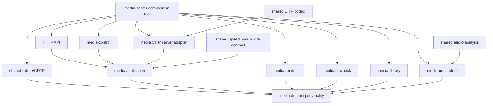
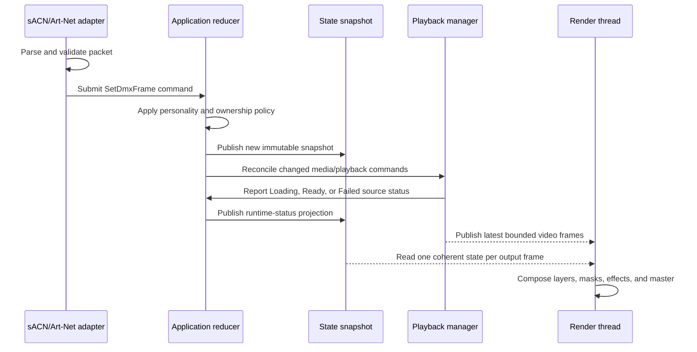

# Media Server Rust Architecture and Migration Plan

Continuation of [Media Server Application Behavior](02-media-server-application-behavior.md). The two files form the Media Server rebuild chunk.

## Target Rust architecture

The Media rebuild should join the existing ToskLight Cargo workspace at `/Users/keller/repos/light`. The layout below is relative to that repository. Crates are created for real ownership, dependency, runtime, or testing boundaries—not one crate per file and not one crate per product folder. The existing workspace already proves that a single `crates/` directory can contain packages used by multiple applications.

```text
apps/
  light-desktop/              existing React Light desk frontend and Tauri shell
  light-headless/             standalone Light backend entry point
  light-hardware-controls/    existing Light hardware-controls application
  media/                      Media server entry point and served React frontend

crates/
  light/                      Light use cases, domain crates, contracts, and adapters
  media/                      Media domain, use cases, and adapters; no executable entry point
  shared/
    core/                     shared suite value types
    fixture/                  canonical fixture/GDTF model, parser, writer, validation
    show/                     portable show definitions
    mvr/                      shared MVR interchange

packages/
  ui/                         presentation-only shared React component framework
```

The top-level names are fixed by the suite structure. Exact Cargo package
boundaries inside `crates/media` may be introduced when implementation starts,
but they must preserve visible `domain`, application/use-case, and `adapters`
ownership. The executable, HTTP-server startup, asset embedding, and other
composition-root code remain in `apps/media`.

Do not turn the existing `crates/light/adapters/media` into a dumping ground: it
owns bounded CITP/MSEX client primitives for Light. Extract a shared CITP
protocol kernel only when both client and server prove the same types/codecs;
keep Light's receiver/client orchestration and Media's sender/server
orchestration separate. Cargo dependency rules and ownership tests—not directory
depth alone—enforce the boundary.

### What is shared and what is product-owned

| Capability | Shared kernel | Light Desk owns | Media Server owns |
|---|---|---|---|
| CITP/MSEX | Framing, message types, encoding/decoding, negotiated capabilities | Receiver/client, thumbnail and preview consumption | Discovery/server, library publication, thumbnails, layer status, preview sending |
| GDTF | Fixture/personality model, validation, XML/archive reading and writing | Fixture library, editing, import/export workflows | Generate the Media and master fixtures from the canonical Media DMX personality |
| Audio analysis | Audio sample contract, waveform/spectrum, beat/tempo analysis | Sound-to-light mapping and desk controls | Generated visualizers and media-reactive parameters |
| Speed Groups | Typed identity, BPM/phase snapshot, freshness and wire schema | Authority, editing, synchronization and publication | Subscription, interpolation, loss handling and video synchronization |
| React UI | Presentational components, theme, accessibility, window/form primitives | Desk workflows, state and integrations | Media workflows, state and integrations |
| Product state | Only small stable value types when genuinely universal | Light show/programmer/playback state | Media layers, outputs, library and renderer state |

This allows shared code to mature without making either product depend on the other application's internal state machine.

### Dependency direction



Rules:

- `media-domain` depends only on the Rust standard library and small serialization/value dependencies where justified.
- Protocol, HTTP, filesystem, decoder, GPU, and OS types never enter domain state.
- `application` owns commands, state transitions, control-source ownership, and use-case coordination.
- Adapters translate external input into application commands and application results into external formats.
- Each executable is its own composition root. No global subsystem registry or singleton constructs dependencies implicitly.
- The canonical DMX personality is domain data used by Art-Net, sACN, the API, UI metadata, tests, and GDTF.
- The canonical media catalog is shared as an immutable snapshot; adapters never rescan independently.

### Process, instance, and multi-output model

The primary production topology is one Media Server process hosting one or more logical outputs. It is more reliable than launching one process per output because Art-Net normally uses the fixed UDP port 6454: one host-level ingress can bind once, validate packets once, then route universes/addresses to output instances without relying on platform-specific socket-reuse behavior.

```text
MediaServerProcess
  NetworkIngress (one Art-Net and/or sACN service)
  SharedAssetCatalog and immutable caches
  OutputInstance[]
    stable output ID and name
    selected monitor/window or off-screen target
    own render surface, renderer, render clock, and layer/master state
    own DMX universe/start-address/personality routing
    own playback sessions and CITP layer/output identity
```

Each output can bind to a different display and refresh rate. A slow or disconnected output must not stop another output from presenting. CPU-decoded immutable asset data and GPU-independent catalog metadata may be shared; mutable playback position, GPU surface resources, output state, and failure status may not be shared accidentally.

Running multiple Media Server processes remains supported. Each process has an explicit instance ID, configuration/data directory, API bind address/port, output identities, and network binding policy. Separate processes on separate hosts or IP addresses can each own Art-Net normally. Multiple processes attempting the same wildcard IP/UDP port on one host must fail with an actionable conflict unless an explicitly supported and cross-platform-tested dispatch/reuse mode is configured. Silent platform-dependent `SO_REUSEPORT` behavior is not an architecture.

The API, React UI, persistence schema, CITP announcements, logs, health state, and GDTF exports address outputs by stable ID. The initial rebuild can ship one output, but it must use this collection model from the start so adding output two does not require replacing singleton state throughout the codebase.

### Main data flow



### State and concurrency

- The application reducer is the only writer of domain state.
- Readers receive immutable snapshots or watch-channel updates.
- The render thread never waits for HTTP, filesystem, network, decoder, audio-analysis, or logging work.
- Video decoders publish into bounded latest-frame queues. When rendering falls behind, obsolete frames are dropped.
- Import jobs use a bounded worker pool and publish catalog changes atomically.
- Audio capture uses a bounded real-time-safe ring buffer.
- Shutdown is structured: stop accepting work, cancel jobs/tasks, stop decoders, flush required persistence, release GPU/window resources, and join threads.
- Every background task has an owner, cancellation path, and error-reporting destination.

### Renderer architecture

The renderer owns:

- one output surface, selected monitor, presentation mode, and render clock per output instance;
- one texture/frame input per active source;
- reusable render pipelines for images/video, text, masks, and effects;
- per-layer intermediate targets when an effect or mask requires them;
- final output and preview readback; and
- GPU capability validation.

It does not own:

- DMX parsing;
- HTTP requests;
- filesystem scanning;
- decoder control policy;
- text-source persistence;
- visualizer configuration persistence; or
- application control-source ownership.

Render stages should be explicit and measurable. GPU readback for CITP preview must be requested only when subscribed and must not synchronously block the program output.

The renderer queries the selected surface's supported presentation modes and refresh characteristics. `DisplaySynchronized` chooses the platform backend's supported vsync/FIFO-equivalent mode and records measured presentation cadence; it does not hard-code 60 Hz. Monitor changes, refresh-rate changes, sleep/wake, and surface loss recreate only the affected output. A fixed-rate output schedules against monotonic deadlines, while media decoding remains timestamp-driven in both modes.

### Playback architecture

Playback owns a session per selected asset variant, not one global cache entry with shared mutable playback state. This prevents two layers selecting the same video from unintentionally sharing position, pause state, loop state, or volume.

Each session owns:

- asset and variant identity;
- intrinsic BPM and first-beat-at-zero metadata;
- decoder/pipeline;
- playback clock;
- loop/reverse/bounce/once and synchronized-variant/stop/pause state;
- configured tempo-source mode, selected Speed Group snapshot/freshness or layer Playback BPM, phase anchor, and speed multiplier;
- seek/reset requests;
- decoded-frame queue;
- decoded audio; and
- health/error state.

Decoder implementation is selected behind a common trait. GStreamer is the leading cross-platform candidate, but the application contract must not expose GStreamer types.

### Media-library architecture

The library service owns:

- catalog discovery and persistence;
- folder/item/variant identities;
- address-class and blank-sentinel validation;
- import/transcode jobs;
- thumbnails;
- atomic rename/move/swap operations;
- asset validation and codec metadata;
- catalog revision numbers; and
- publication of immutable catalog snapshots.

Filesystem names are a storage adapter, not the domain model. Stable IDs and DMX folder/file addresses must be distinct concepts so reindexing can be handled deliberately.

### API architecture

- Define request/response schemas and generate or verify TypeScript types from them.
- Validate ranges and unknown fields at the HTTP boundary.
- Use stable error codes plus safe human-readable messages.
- Add request IDs and structured logs.
- Decide explicitly whether the server is local-only or network-accessible; authentication and authorization follow that deployment decision.
- Expensive operations return job IDs rather than holding HTTP connections until completion.

### React frontend architecture

React is a fixed product and architecture choice for the administration frontend. The Rust application serves the production frontend assets and exposes the versioned API; it does not render the administration UI or replace React with a Rust/WASM UI framework.

The frontend should be organized by application capability:

```text
apps/media/src/
  app/                    router, providers, global error/loading boundaries
  features/
    dashboard/            output status and layer overview
    layers/               layer controls and media selection
    media-library/        upload, jobs, thumbnails, rename and reindex
    text-sources/         text, clock and countdown editing
    visualizers/          generated-source selection and configuration
    audio/                input device, analysis and tuning
    dmx/                  protocol status, values, map and personality
    settings/             application and output configuration
    logs/                 operational log viewer
  entities/               typed layer, asset, job and configuration models
  shared/
    api/                  generated client, transport and boundary schemas
    lib/                  small application-specific helpers
```

The workspace's `packages/ui` is the required frontend dependency. It remains a presentation-only React package: it accepts typed view models and callbacks and does not import product contexts, APIs, Tauri integration, or persisted application state. Ownership is divided as follows:

| Shared UI framework owns | Media Core frontend owns |
|---|---|
| Buttons, inputs, selectors, sliders, tabs, cards, tables, dialogs, drawers, toasts, typography, icons, spacing, colors, focus styles, and accessibility behavior | Layer cards, media picker, library browser, ingest-job views, DMX map, visualizer editor, text-source editor, audio monitor, settings workflows, and application routing |
| Design tokens and themes | Media-specific semantic variants built from shared tokens |
| Reusable form and validation presentation | Media Core request schemas, commands, validation rules, and error mapping |
| Generic loading, empty, error, and confirmation patterns | Feature-specific decisions about when and why those states occur |

Frontend dependency rules:

- Feature code imports reusable visual components from the shared UI framework, not from copied source files.
- A thin local adapter is allowed when the shared framework needs Media Core defaults or when package-version changes should be isolated.
- Local shared components are created only for proven Media Core concepts that do not belong in the general framework.
- Feature modules do not deep-import another feature's internals.
- Pages/routes compose features and do not contain protocol conversion or large state machines.
- Server state uses one consistent query/cache mechanism; polling intervals and invalidation are owned by feature services rather than duplicated in components.
- Optimistic changes have typed rollback behavior and must reconcile with external DMX ownership.
- API types are generated from, or checked against, the Rust API schema. Manually duplicated TypeScript wire types are not authoritative.
- Accessibility, keyboard operation, focus restoration, reduced motion, responsive behavior, loading, empty, error, retry, and disconnected states are acceptance requirements.
- The shared component framework and Media Core frontend are tested together in the supported browsers before release.

The initial frontend migration should preserve React and replace existing bespoke primitives incrementally with the shared framework while keeping feature behavior stable. The Rust rebuild and the visual component migration are separate changes joined by the versioned API contract.

## Verification architecture

### Pure behavior tests

- Every DMX channel boundary and 16-bit mapping.
- Art-Net and sACN produce identical domain state for identical payloads.
- Playback state transitions.
- source lifecycle transitions, failure sanitization, retry, and recovery without losing the selected address.
- control-source ownership and timeout.
- media address validation, blank sentinel values, and generated-source ranges.
- layer geometry and color math.
- text countdown state transitions with controllable time.
- configuration migrations.

### Protocol tests

- Captured valid and malformed Art-Net packets.
- E1.31 priority, source merge/selection, sequence, termination, and timeout fixtures.
- CITP/MSEX version negotiation and every supported request/response.
- CITP layer status for unselected, loading, ready, failed, and recovered sources, including immediate failure publication and safe error text.
- GDTF schema/archive validation and console-import fixtures.
- Cross-platform same-computer tests using Art-Net and sACN unicast from an ephemeral sender to `127.0.0.1` receivers.
- Direct loopback CITP and Speed Group connections that succeed with multicast/broadcast discovery disabled.
- Bind-conflict tests proving a second receiver fails clearly rather than depending on UDP port reuse.
- Configuration tests separating listen addresses, destinations, advertised endpoints, and restoration of the previous LAN settings after leaving the same-computer preset.

### Rendering tests

- Deterministic still-image reference renders for scale modes, position, rotation, color, layer order, masks, each effect, master tint, and flip/mirror.
- Video timing tests with generated frame-number media.
- Long-running decoder and layer-switch stress tests.
- Performance gates for the supported output resolution, frame rate, layer count, and codec profile on each OS.

### Cross-platform CI and packaging

Every change must run formatting, linting, unit tests, integration tests, and builds on macOS, Windows, and Linux. Platform-specific adapters require contract tests shared across platforms. Release candidates additionally run packaged smoke tests with real resources, shader compilation, media decoding, web assets, and graceful quit/relaunch.

## Cross-repository migration plan and rebuild order

### Phase 0 — freeze scope in the source repository

Implementation/characterization work location: `/Users/keller/repos/media` only. Plan tracking remains in this file under `/Users/keller/repos/light`.

1. Resolve or explicitly defer this document's **decision required** items.
2. Inventory source behavior, representative media/configuration, licenses, platform assumptions, and every source-to-target entry in the transfer map.
3. Add only the characterization fixtures needed to distinguish intentional behavior from accidents. Keep the current Media application runnable as the comparison oracle.
4. Record the initial migration ledger, including features deliberately excluded such as the lighting-console simulator.

Exit gate: the behavior contract, transfer inventory, sanitized fixtures, and unresolved decisions are reviewable without requiring target implementation.

### Phase 1 — establish a safe target baseline

Work location: coordination in both repositories; target edits only in a new `/Users/keller/repos/light` worktree.

5. Complete the required upstream Light refactor milestones and select an exact approved commit from the `refactoring` line of work.
6. Verify that commit using the Light repository's native checks, including generated wire contracts and architecture ratchets. The shared React package must have completed its separate Storybook-first review before Media consumes it.
7. Create a dedicated Media integration branch/worktree from that commit; do not reuse or clean the actively dirty Light refactor checkout.
8. Move this numbered plan from `docs/plans/Later` to `docs/plans/Next`, add the migration ledger, and split stable behavior/engineering contracts into `docs/engineering/media/` as implementation begins.

Exit gate: clean recorded target commit, isolated worktree, passing baseline checks, canonical target documentation, and no dependency on `/Users/keller/repos/media`.

### Phase 2 — add target skeleton and shared seams

Work location: dedicated `/Users/keller/repos/light` Media worktree.

9. Add the Media application/frontend workspace members, dependency rules, versioned multi-output configuration, logging, shutdown, and cross-platform CI skeleton.
10. Implement and test the pure Media domain state, command reducer, v2 DMX personality, output collection, and control ownership.
11. Extract only proven shared seams: CITP wire codec, canonical fixture/GDTF model/writer, portable audio-analysis contracts, Speed Group wire model, and accepted `packages/ui` components. Keep Light and Media orchestration separate and retain compatibility adapters until existing Light callers migrate safely.

Exit gate: the complete Light workspace still passes its baseline checks, the empty Media application starts and shuts down, dependency-direction tests pass, and no legacy source path is referenced.

### Phase 3 — rebuild Media in verified vertical slices

Work location: dedicated `/Users/keller/repos/light` Media worktree; `/Users/keller/repos/media` remains a read-only runtime comparison oracle except for approved characterization work.

12. Build one cross-platform display-synchronized output with a still-image renderer, instantiated through the multi-output model.
13. Implement current layer geometry, color, dimmer, ordering, master behavior, and deterministic reference renders.
14. Add cross-platform video playback, intrinsic BPM import, all ten playback modes, both tempo-source configurations, and Speed Group loss behavior.
15. Add the media catalog, new folder/file ranges, versioned data migration, transactional operations, thumbnails, and bounded import jobs.
16. Add sACN and Art-Net through the canonical personality and route input to stable output IDs.
17. Implement the versioned HTTP API and React Media UI using accepted `packages/ui` components.
18. Add text sources, shared portable audio analysis, and all generated visualizers.
19. Implement layer masks, the selected effect chain, and master mask.
20. Add Media's CITP sender/server over the shared codec and generate GDTF only through the canonical fixture model.

Each slice must include source fixture/reference, target unit/integration/render tests, explicit intentional differences, full affected Light workspace checks, and a migration-ledger update before it is accepted.

### Phase 4 — integration, scale, and cutover

Work location: `/Users/keller/repos/light`; source repository used only for final comparison and migration input.

21. Enable multiple outputs per process and verify simultaneous displays with different refresh rates.
22. Prove same-computer and separate-computer Light/Media operation, real Light-desk Speed Groups, Art-Net/sACN, CITP, GDTF import, and any approved native Light–Media link.
23. Run cross-platform packaging, codec/shader capability checks, data migration rehearsals, long-running stress tests, and side-by-side output comparisons.
24. Declare target feature ownership complete only after acceptance evidence is recorded; stop product development in `/Users/keller/repos/media` and retain it as an archived historical/reference repository according to the chosen retention policy.

Exit gate: supported platforms and deployment topologies pass, operator data migration is recoverable, rollback/cutover is documented, and `/Users/keller/repos/light` is the sole production source of truth.

Every stage must remain runnable and testable. A later capability can be absent behind an explicit “not implemented in this build” status during development, but released platform builds must not silently diverge in behavior.

### Cross-repository change and verification rules

- Treat each repository as a separate Git history. Never stage or describe files from both repositories as one commit.
- Record the source commit and target commit independently in the migration ledger for every accepted slice.
- Do not discard, rewrite, or absorb unrelated Light refactor work. Integration conflicts are resolved in the dedicated Media worktree with the owning Light workstream.
- Passing legacy Media checks proves only the reference application. Passing focused Media target checks proves only that slice. Acceptance also requires the affected full `/Users/keller/repos/light` checks so shared-crate changes cannot regress the desk.
- Cross-repository parity tests use sanitized fixtures copied into the target repository. CI must not assume that `/Users/keller/repos/media` exists beside a Light checkout.
- Source and target may run side by side for manual comparison, but production target startup and tests must remain self-contained.
- Shared UI additions begin as Media-owned compositions. A component moves into `packages/ui` only when it is genuinely presentation-only, follows the package's review process, and does not introduce Media state or API dependencies.
- Shared Rust extraction follows callers, not speculation: add the target Media adapter first, identify identical stable behavior, extract a shared kernel, then keep separate Light and Media orchestration adapters.

## Known decisions to resolve

The code does not currently define these choices well enough. They should be decided before the relevant rebuild stage:

1. Is the production personality always eight layers, or are two- and eight-layer personalities both supported products?
2. May the 279-slot full v2 personality span multiple DMX universes, or must configuration constrain the start address?
3. What precise frame should Once mode hold at end-of-media?
4. Is bounce playback mandatory for every supported codec, or can import normalize assets to a bounce-capable codec?
5. Does a mask use alpha, luminance, or a selectable mode?
6. Beyond the now-required independent scale X/Y, is the mask positioned with the source, independently centered, or given independent position controls?
7. Which four initial layer effects occupy the DMX effect slots, and how are their additional parameters controlled?
8. What does the master-mask byte select and how is that mask configured?
9. Should folder `000` remain a disk-valid library folder even though DMX folder 0 means blank?
10. Which media codecs and pixel formats are guaranteed on all supported operating systems?
11. Is the HTTP service trusted-local-only, LAN authenticated, or both through configurable binding?
12. Which CITP/MSEX versions and lighting-console products define the interoperability target?
13. What is `packages/ui`'s versioning policy, theme entry point, and process for contributing generally useful Media components back to it?
14. Should the historical `paused` field be removed in favor of `playmode = Pause`, as recommended?
15. Is an independent layer blackout latch needed? If retained, what sources may clear it and how does it interact with dimmer and media selection?
16. What exact one-byte mapping should Playback BPM use, and what does byte `0` mean?
17. For synchronized media without intrinsic BPM, what phase operation should occur beyond the defined 1× BPM ratio—start on the next beat, reanchor only on explicit reset, or another rule?
18. Is tempo-source selection global or per output? This document recommends per output; in either case the Speed Group ID is an application setting, not another layer DMX channel.
19. If a selected Speed Group becomes stale, should playback hold the last clock, continue unsynchronized, pause, or use a separately configured automatic channel-BPM fallback?
20. How many outputs and layers per output must the first production release certify, at which resolutions and refresh rates?
21. Which features, if any, should the native Light–Media protocol own in its first version, and what explicit fallback relationship does it have with Art-Net/sACN and CITP?
22. After cutover, should `/Users/keller/repos/media` remain buildable as a frozen archive, be tagged and archived remotely, or be retained only through Git history and release artifacts?

These are product decisions, not reasons to remove the capabilities.

## Research basis

This architecture combines direct inspection of the current Media and Light repositories with the following primary references:

- [Cargo workspaces](https://doc.rust-lang.org/cargo/reference/workspaces.html): a workspace manages multiple related packages together, which supports keeping Light and Media independently runnable in one repository.
- [Cargo targets](https://doc.rust-lang.org/cargo/reference/cargo-targets.html): packages can expose library and binary targets; the repository's `apps/` and `crates/` folders are organizational conventions rather than a Cargo restriction.
- [wgpu presentation modes](https://docs.rs/wgpu/latest/wgpu/enum.PresentMode.html): a renderer can select a supported vsynchronized presentation mode from each surface's capabilities instead of assuming a fixed 60 Hz display.
- [Tokio synchronization primitives](https://docs.rs/tokio/latest/tokio/sync/): bounded queues and latest-value watch channels support the proposed back-pressure and immutable-snapshot patterns.
- [Official Art-Net site and specification](https://art-net.org.uk/): the protocol definition, required attribution, and OEM registration are external product contracts and must not be inferred solely from the current parser.
