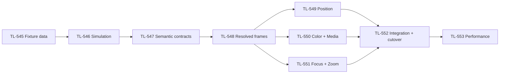

# Fixture-independent Position, Color and Focus programming

This document records the researched architecture and implementation plan. The Storybook mockup linked below demonstrates the proposed controls inside the application programmer and encoder area. It does not implement or validate the engine architecture.

**Implementation scope, revised 2026-09-27:** Position, Color (including its Media Server adapter), and Focus/Zoom. Start with fixture data and configuration, establish correct physical simulation, then deliver each complete feature across the application. **Gobos, Beam, iris, shutter/strobe, frost, framing, prism and intensity retain their current programming contracts and controls.** Existing prototype examples for these other attributes are historical explorations, not implementation commitments.

Read [the delivery sequence](#implementation-sequence), [the application-wide change map](#7-application-wide-change-map), [the shared value contract](#8-shared-semantic-value-and-operation-contract), [the frame and tracking architecture](#10-authoritative-frames-tracking-and-rendering), and [the implementation issues](#12-implementation-issues-and-dependencies) together. UI completion does not complete any engine feature.

## 1. Architecture and research conclusions

**Store what the operator wants; resolve how each fixture produces it at output time.** Presets, cues, groups and effects should retain physical or semantic values rather than fixture DMX percentages.

Separate three kinds of information:

| Layer | Owns |
|---|---|
| Fixture profile | Physical capabilities, emitters, filters, wheels, movement ranges, optics and DMX mappings |
| Installed fixture | Mounting pose, Position Reference, pan/tilt inversion and zero offsets, individual calibration |
| Programming | Requested color, angles or target, zoom opening and focus setting, including their Dynamics |

The repository already has useful foundations: XYZ color intent, emitter calibration, physical channel metadata, fine-byte resolution, 3D Points, Position References and tracking overrides. The main changes are to extend these models and preserve semantic intent throughout playback. Current aiming calculates angles once; persistent target aiming must become an engine operation.

**GDTF can supply much of the fixture information.** It supports emitter xyY colors, optional spectral measurements, filters, wheel slots, physical channel ranges, response curves and mode dependencies. Import quality remains dependent on the manufacturer's data. The current importer/exporter needs expansion to retain these relationships. [Physical descriptions](https://www.gdtf.eu/gdtf/file-spec/physical-descriptions/), [DMX channel functions](https://www.gdtf.eu/gdtf/file-spec/dmx-mode-collect/)

### Core interface changes

Introduce shared, typed programming values:

- `ColorIntent`: base visible color coordinates, white target and blend, emitter-allocation preferences and editing recipe; UV represented separately from visible color.
- `PositionIntent`: `Angles` or `Target`.
- Physical scalar values and spreads with explicit units.
- Typed Dynamics domains for the three in-scope families, preserving existing timing, phase and ownership behavior.

These values must survive programmer edits, presets, cue recording, transitions and group resolution. Native DMX conversion happens after those operations.

Compile fixture adapters when a profile, mode or calibration changes. Cache static mappings and color models; recompute only values affected by programming or live movement. Server logic remains authoritative across software encoders, hardware, keyboard, command line and OSC.

## 2. Color architecture and operator modes

### Common internal representation

Use **linear CIE XYZ** for the base visible color, with intensity controlled separately. Preserve the authoring recipe and allocation preference because several emitter combinations can produce the same XYZ while illuminating objects differently. XYZ alone cannot preserve a preference for white emitters or a particular RGBW mix. [CIE: metamers](https://cie.co.at/eilvterm/17-23-008)

The stored semantic components are the base color, white target and White Blend. A lamp's final requested XYZ is derived from those components; it is not a second independently stored color authority. Keep the base color at 100% White Blend because the Media Server still needs it as its tint. Editing the base color updates its recipe in the same transaction. Advanced edits can mark the Easy readout approximate without overwriting the requested base color.

The intent contains:

- Base visible color coordinates and their virtual editing recipe.
- Optional ordered semantic ranges for editable color components, resolved into each selected fixture's local recipe.
- White temperature and tint, defining the white target.
- White Blend, independent of the base color.
- Preference for dedicated white versus colored emitters.
- Optional explicit filter/wheel constraints.
- A separate UV request.

**UV is not folded into XYZ or substituted with violet.** Visible coordinates cannot describe its fluorescence effect. An unsupported UV request produces a capability indication.

### Programmer and encoder integration

Present attribute programming in the existing programmer area, using the production family tabs, four encoder slots, page indicator and Special Dialog control. Keep the upper workspace and its normal windows unchanged. Reuse the established fixture selection, presets and application settings entry points; do not add duplicate Presets tabs, Fixture details panels, Position tools or lower status bars to these editors.

Four encoders remain the default surface. When compact Color Special Dialog is open, clicking the active **Color** family closes it and restores the same encoder page. That click does not also advance the page; a subsequent click can cycle it using the existing `1 of 2` behavior. **Position and Focus Special Dialogs open directly as modals**, without compact or Expand states. Their standard modal close/Escape behavior returns to the encoders. Page navigation never changes programmed values or activates a Position variant. There is no separate Encoders return button.

The Color Special Dialog uses the measured encoder-area size. On the software surface it replaces that area inline only when the available container is at least **680 px wide and 210 px high**. A smaller area or a hardware-connected surface opens the full editor in the application's normal `ModalFrame`. This decision uses the actual area after the command line and family tabs, rather than viewport width alone. Closing the modal preserves the family, encoder page, recipe and programmed values.

The compact Color Special Dialog has two pages, **Color** and **White balance**. On Color, a **two-dimensional hue/saturation selector** fills the available left area; the **White Blend fader** sits at the top of the right area, with **White balance** and **Expand** buttons directly underneath it. There is no footer bar, extra header or tab row. Page 2 contains exactly **Temperature** and **Duv** faders and the page/expand actions. It has no White Blend control. Neither compact page shows color approximation.

Reuse the existing **`VerticalTouchFaderControl`** for every Color fader, presented horizontally with the relevant colored track and its touch-point indicator. This applies to saturation, White Blend, Temperature and Duv, preserving the established drag behavior and ordered Shift-range interactions. Do not replace these controls with an unrelated slider style.

White-balance gradients must contain a true white neutral center: warm → white → cool for temperature, and magenta → white → green for increasing Duv. The neutral point must not appear gray or retain an unintended tint. The values remain labeled in Kelvin and Duv. White balance is available in Easy Mode. Repeated presses of the existing **Special Dialog** button also cycle the compact Color/White balance pages. Each page fits without scrolling and preserves readable values and touch-sized slider interactions.

The expanded editor uses the normal `ModalFrame` chrome, with the title aligned flush to its standard title-bar layout. A full-width color area places a **large hue ring on the left** and horizontal **saturation, White Blend, Temperature and Duv faders stacked on the right**. The ring is approximately 340 px across, adapting within roughly 327–380 px in the intended modal layouts. The per-fixture approximation breakdown sits below. Keep all controls visible together at the established 761 px-high desktop viewport without vertical overflow. The ring's displayed hue, pointer geometry and selected value must agree. A page switch must not hide one set of controls. Hardware and narrow-layout fallback open the same complete editor. It contains no fixture tools or duplicate preset tabs. Wheel controls remain on Advanced encoder page 2.

Easy/Advanced and the Easy extended layout are application-settings preferences, reached through the existing settings entry. The isolated mockup may expose these values through Storybook controls or a dedicated configuration story for verification. Switching presentation preserves the color, recipe, ranges and other semantic components. Retain the production software and hardware-connected encoder arrangements and their normal typography; do not shrink encoder fonts to fit more controls.

### Easy Color: default operator view

Easy Color uses the full calibrated resolver. Its controls describe a fixed virtual light engine, so their meaning remains consistent across RGB, RGBW, RGBAL, CMY and wheel fixtures.

| Setting | First encoder page | Second encoder page |
|---|---|---|
| Easy RGBW | Red, Green, Blue, White Blend | — |
| Easy RGBWAUV | Red, Green, Blue, White Blend | Amber, UV, unassigned, unassigned |
| Advanced | Red, Green, Blue, White Blend | Color temperature, Duv, Wheel 1, Wheel 2 |

Preferences remain stable when the fixture selection changes. Unassigned encoder slots retain the standard empty appearance.

- RGB inputs use defined reference primaries and transfer functions.
- Amber adds a defined visible amber contribution; the resolver can synthesize it when no amber emitter exists.
- UV requests the separate UV capability.
- For lamps, White Blend mixes the base color—including Amber—with the white target.
- Easy Mode starts with white at **6500 K, neutral tint**. Advanced controls can edit that target.
- UI color pickers decode sRGB before linear color calculations. [W3C color-space definitions](https://www.w3.org/TR/css-color-4/)

Preserve the requested lamp White Blend behavior:

```text
colored contribution = min(1, 2 × (1 − blend))
white contribution   = min(1, 2 × blend)
lamp target XYZ      = colored contribution × base XYZ
                     + white contribution × white target XYZ
```

Thus:

- **0%:** full colored recipe, white off.
- **50%:** full colored recipe and full white contribution.
- **100%:** colored contribution off, white contribution full; the stored base color remains intact.

For a matching reference RGBW fixture, the allocation recipe reproduces those native levels. Other fixtures produce the closest supported result. Absolute brightness cannot be identical across different lamps without photometric calibration.

UV remains independent of White Blend. The Media Server interprets White Blend as source desaturation, as specified below.

### Advanced Color

Advanced Mode exposes the same intent through the second encoder page and Color Special Dialog:

- Color picker and chromaticity controls edit the base color.
- Temperature and green–magenta tint edit the white target.
- White allocation preference.
- Automatic or explicit wheel/filter selection.
- Requested versus achievable color and calibration quality.

Switching Easy/Advanced in Settings changes presentation only. It must not alter programming or stored presets, including the base color retained at 100% White Blend.

When an Advanced base color cannot be represented exactly by the Easy recipe, show an approximate Easy readout while retaining the original coordinates. The first Easy edit deliberately adopts the displayed recipe; entering Easy Mode alone does not.

Temperature uses Kelvin; tint uses signed **Duv**, positive toward green and negative toward magenta. Default request limits are 1000–20000 K and ±0.03 Duv, with fixture capability limits reported separately. White transitions interpolate reciprocal temperature and tint. [NIST: CCT and Duv](https://www.nist.gov/publications/practical-use-and-calculation-cct-and-duv)

### Ordered color ranges

The hue ring and color sliders support **first/last endpoint range editing**: either click the first value normally and Shift-click the second, or hold Shift for both clicks. Show a pending first marker, then both numbered endpoint markers and a range readout. Distribute the values across the existing ordered fixture selection, including intermediate fixtures. The result is a semantic spread, not a single value displayed with two decorative handles.

Keep the spread per attribute: hue, saturation, White Blend, Temperature or Duv. Editing one range preserves the other color components and ranges. An ordinary click or drag clears only that attribute's range and applies one value across the selection. Preserve endpoint order; do not sort the endpoints. Reversing them reverses their assignment to the selection. The same intent and range state must survive compact/full presentation changes and ordinary encoder access.

Hue interpolates over the **shortest circular arc**, with an exact 180° tie resolved clockwise. Equal endpoints produce a constant hue. Slider ranges interpolate numerically in selection order; descending ranges are valid. Per-fixture previews must use the actual interpolated local recipes. Resolve the resulting semantic color before predicting fixture output; never interpolate native DMX values as a substitute. This mockup does not add multi-turn wheel gestures; a future longer-arc choice would be explicit.

### Fixture resolution

Replace the current mutually exclusive color-system branches with a **per-head optical model**:

```text
light source / additive emitters
    → CMY and correction filters
    → one or more color wheels
    → predicted output color
```

- Additive fixtures use a bounded solver over all available visible emitters and their response curves.
- Resolution prioritizes chromaticity match, then requested allocation, then available output.
- RGB fixtures synthesize white; RGBW/RGBCCT fixtures use dedicated white where appropriate.
- Arbitrary emitters—lime, amber, mint, cold/warm white and others—use the same solver.
- Wheel fixtures choose the closest permitted steady combination.
- Hybrid fixtures solve emitters and filters together.
- Serial filter combinations require spectral information or measured combination data. Multiplying XYZ values is not a valid filter model.
- Every resolution explicitly writes or clears all participating channels to prevent residual colors from earlier programming.

For continuous-capable hybrids, prefer clear wheels when the target is already achievable. Wheel-only transitions snap at the configured cue timing; hybrids use continuous mixing during the fade and settle on the chosen filter combination without repeated wheel changes.

Fixture calibration changes the predicted output model. Diagnostics compare achieved output with the **original requested target**.

Color is one atomic LTP intent and one activation group. Base coordinates, the RGB/Amber editing recipe, White Blend, the white target, UV and wheel/filter constraints all belong to that group. Editing one Easy encoder updates the shared intent while preserving its other components, producing one undo step. Family activation, release, preset recall and recording operate on this coherent color value; the resolver must never combine independently active native channels from different representations.

Subparameter masks describe edits within one family owner. Seed untouched components from that owner's existing intent, otherwise adopt the effective semantic intent once at gesture start. Record, filter and release the complete Color family. Do not persist a separately competing Red, wheel or white contribution. The shared operation rules in section 8 apply to every input and recording path.

### Mixed-selection color feedback

One requested color can produce different results across a mixed selection. For a uniform request, show the **requested swatch once**, then a separate estimated output row for each fixture or genuinely equivalent fixture group. Each row identifies the fixture, predicted output swatch, mapping strategy, match status and data quality. When a semantic range is active, retain its visible endpoints and compare each fixture with its own interpolated local request. Do not show one aggregate achievable swatch: an average could conceal that a wheel fixture cannot produce the requested color.

Color approximation appears **only in the expanded Color modal**, alongside its complete controls. Neither compact page nor an added lower status bar carries the breakdown. Within the modal, summarize the worst reported mismatch and affected fixture count and retain the per-fixture rows. Keep match quality and data quality separate: an apparently close nominal estimate is not a measured physical match. Without calibrated data, use explicit estimated/unknown labels rather than precise-looking error scores. Unsupported UV remains an independent indication because visible swatches cannot represent its effect.

Group rows only when fixture profile, operating mode, relevant calibration and requested value are equivalent; split fixtures whose calibration, effective color capabilities or interpolated range values differ. Counts may compact repeated identical results. Grouping the display never merges the fixtures' actual resolver state.

The mockup demonstrates the following three-fixture selection:

| Fixture | Example capability | Magenta request | Warm-white request at 3200 K |
|---|---|---|---|
| JB-Lighting JBLED A7 | RGB mixing | Estimated RGB magenta | Estimated warm white synthesized with RGB |
| Cameo ROOT PAR 6 | RGBWAU additive emitters | Estimated RGB magenta; UV remains separate | Illustrative RGB + White + Amber allocation |
| Cameo Auro Spot, illustrative wheel | Open, Warm White, Red, Yellow, Light blue, Dark blue, Green | No magenta slot; show the chosen fixed slot visibly as an approximation | Illustrative Warm White filter selection |

The wheel choice is an estimated fallback under the example data, not a claim that a named physical slot is a calibrated nearest match. Do not invent native channel percentages for either mixer or claim that the three warm-white outputs have identical chromaticity or spectrum. The requested 3200 K target remains unchanged for all three fixtures.

Explicit wheel constraints remain part of the same color intent. The example resolves supported Open/Red/Blue choices for the Auro and reports unavailable slot or correction-wheel requests per fixture. An unsupported constraint stays visible and stored; it must not be accepted and then silently ignored by the match display.

The library's [ROOT PAR 6 package](../../assets/fixture-library/cameo--root-par-6.toskfixture) explicitly marks its emitters nominal and uncalibrated: sRGB primaries, a D65 white reference, a 590 nm amber reference and zero visible XYZ for UV. Its notes say manufacturer chromaticities, white CCT and UV wavelength are unavailable. These reference values support an estimate, not measured lamp output. The [JBLED A7 package](../../assets/fixture-library/jb-lighting--jbled-a7.toskfixture) supplies the RGB control model used for this scenario; its preview remains illustrative.

The actual [AURO SPOT Z300 library package](../../assets/fixture-library/cameo--auro-spot-z300.toskfixture) has nine fixed wheel positions and `measured_xyz: null` for its filter data. The user's seven-slot Auro Spot example above is therefore a separate illustrative scenario, not an exact inventory of that Z300 profile. Label that distinction in Storybook documentation and the data-quality breakdown.

An optional common-gamut operation may help an operator deliberately choose a target all selected fixtures can approximate. It must be an explicit action with visible consequences. Never silently clamp every fixture to the most limited fixture's gamut or replace the stored request when the selection changes.

## 3. Position, moving mounts and targets

### Two mutually exclusive position types

Use one Position preset family with a visible **Angles / Point (Target)** type. All position-related programming attributes belong to one activation group. Its active value is a tagged union: Angle and Target control the same pan/tilt output, so activating either atomically replaces and disables the other.

```text
PositionIntent =
    Angles { pan_degrees, tilt_degrees }
  | Target {
        WorldXYZ { metres }
      | PointReference { point_uuid, local_offset_metres }
    }
```

Store stable UUID references; fixture numbers remain operator-facing identifiers.

Angles describe calibrated fixture-local movement. Targets describe where the beam should point in the show's world coordinates: X across stage, Y upstage, Z upward. A fixture can have only one active Position variant at a time. The UI may retain an inactive editing draft for convenience, but recording, recall, group activation, playback and persisted active intent must not treat that draft as a parallel output.

Both variants support spread operations across the current ordered selection. Spread Angle values in degrees; spread Target world coordinates or point-local offsets in metres. Evaluate the spread on the semantic intent **before** resolving each fixture's target into pan/tilt. Keep point UUID references discrete; a numeric spread must not interpolate point identities. A Target spread remains a set of target intents when the mount or target subsequently moves, rather than becoming a set of frozen angle values.

The Position family has exactly two encoder pages:

| Page | Encoder 1 | Encoder 2 | Encoder 3 | Encoder 4 |
|---|---|---|---|---|
| 1 of 2 | Pan degrees | Tilt degrees | Unassigned | Unassigned |
| 2 of 2 | Point | X offset metres | Y offset metres | Z offset metres |

Clicking the active Position family switches between those pages. Page navigation alone does not activate a variant or replace the current intent. Editing or explicitly enabling Point/XYZ atomically activates Target and disables Angle. Editing or explicitly enabling Pan/Tilt atomically activates Angle and disables Target; when converting a live Target, adopt its current resolved Angles before applying the edit. Preset recall and group activation follow the same exclusive replacement rule.

As with Color, partial edits seed the complete family once and recording captures that family. A mask limits fields edited within the active Position variant; it cannot create a partial competing owner or persist the inactive variant. Cue transitions may evaluate source and destination internally, while one Position owner produces one resolved pan/tilt pair. Section 9 defines transitions and Dynamics precisely.

The Point encoder selects **Origin**, **Stage center**, **Performer** or **Moving truss** in the mockup. Origin is the default and makes the three offsets absolute world XYZ coordinates. The other choices refer to 3D Points by stable UUID; their offsets use the selected point's local frame and rotate with that point. In the application, populate this selector from the show's actual 3D Points and retain Origin as the fixed-coordinate option.

The Position Special Dialog is **modal only**, with an **unwrapped multi-turn pan circle above a regular Tilt fader on the left**, and a **square Aim joystick on the right**. It has no inline version, Expand step or GLB/moving-head visual. This supersedes the earlier model-based Position UI proposal; shared model geometry remains relevant to the future aiming engine, not this control's appearance.

The pan control preserves the complete signed angle across revolutions instead of reducing the programmed value modulo 360°. The example supports **−720° to +720°**, with explicit **−90° / Reset / +90° actions** and a turn readout. Reset sets Pan to zero and preserves Tilt; pressing Reset while Pan is already zero does not change the active Position intent. These are example programming limits, not a claim that every fixture can achieve them. The production resolver still applies each fixture's physical range and reports the difference. The circle may wrap its visual pointer, while the stored angle and turn count stay unwrapped.

An **Aim joystick** provides spring-centered velocity control. Deflection controls pan/tilt in degrees per second. Apply an 8% neutral deadband followed by a squared response curve for careful adjustment near center; outer deflection retains the full example rates of 120°/s Pan and 90°/s Tilt. While the pointer is held off center, the angles continue changing even without further pointer movement. Centering, release, pointer cancellation, modal close or window blur stops movement and centers the joystick. Use bounded frame elapsed time so a delayed frame or background pause cannot cause a large catch-up jump.

Point and X/Y/Z controls live **only on Position encoder page 2** and obey the exclusive Angle/Target contract. The modal has no duplicate **Aim reference** selector or XYZ row. It shows Pan, Tilt and the Aim joystick; existing value readouts can expose resolved angles and reachability without a Position tools panel or lower status bar. Editing Pan, Tilt or the joystick while Target is active atomically adopts its current solved Angle pose before applying motion. Keep gesture geometry stable throughout the active interaction; defer Angle-encoder-page changes until release. Merely opening the modal does not change the active variant.

While Target is active, the modal and Angle encoder page **must display the current achieved, calibrated, unwrapped commanded angles from the coherent frame**, labeled as resolved values. Convert that projection into the calibrated programming coordinate frame once; never apply installation offsets twice. Do not display a dormant Angle draft or claim a hardware-measured pose. Preserve mixed-selection readouts and per-fixture adoption. Mount/target movement, clipping and held/unreachable output update the readout without activation, a programmer revision, a modified-show flag or an undo step. The first actual edit adopts this sampled pose; opening or watching the controls is read-only.

Reuse standard modal close/Escape behavior and the existing preset UI. Closing stops every active motion before returning to the encoders. Do not add an Encoders button or separate preset tab.

### Distinguish mounting from aiming

A fixture can have two independent relationships:

| Relationship | Meaning |
|---|---|
| Position Reference | Moves and rotates the fixture's mounting frame |
| Aim Target | Determines where its beam points |

This directly supports the requested moving-truss example:

1. Lamps reference a truss movement point.
2. Their Target preset references the stage-center point.
3. Raising or rotating the truss changes their world mounting poses.
4. The engine recalculates pan/tilt continuously to keep aiming at stage center.

The target may also move through PSN. Both ends are evaluated from one coherent engine frame.

In the mockup, the tracked-target story retains independent mounting and aiming values. Demonstration movement can use Storybook controls or the relevant Position target presentation; it must not introduce a Position tools panel, duplicate preset browser or new upper workspace controls. Reuse the existing preset UI for storing and recalling Angle/Target values, retaining their explicit type.

Preserve the existing attachment contract in [Position Reference acceptance scenarios](../testing/30-position-reference-3d-points.md): rigged locations remain intact, attachments rotate about the reference point, and 3D Points do not themselves acquire Position References.

### Engine resolution order

```text
Coherent generation, clock and tracking snapshot
    → programmer/playback semantic base and ordered group spreads
    → typed Dynamics and family ownership resolution
    → resolved 3D Point values
    → tracking overrides
    → world mounting and target transforms
    → per-head aiming solution
    → installation calibration and physical limits
    → Color and Focus/Zoom adapters, explicit output holds
    → native channel values and DMX bytes
    → one published frame for output and value/visualization consumers
```

Extract attachment and aiming transforms into a shared geometry module. Currently, [the aim command](../../crates/light/adapters/headless/src/runtime/programmer_aim_command.rs) calls renderer placement mathematics. The engine and Stage should consume the same geometry calculations without requiring a Stage window.

Use real model pivots and profile geometry for the emitting head. Include bracket orientation and per-head kinematics; scanners require their own kinematic adapter.

Preserve tracking ownership: a bound source overrides programmed point values; its last received pose holds when packets stop. Bindings are persisted, incoming poses are runtime state. Unbinding restores normal programmed resolution.

### Movement and transition rules

- Model signed physical endpoints, mechanical zero, inversion and installation offsets explicitly.
- Apply calibration once; mount rotation and encoder-zero correction must remain distinct.
- Preserve requested values; clamp only the achievable output and report the difference.
- Choose the reachable equivalent aiming solution nearest the current joint position.
- At a pan singularity, retain the previous pan rather than jumping.
- An unresolved target holds the last valid aim and reports the missing reference. Before any valid solution, retain the existing/default position.
- Angle fades interpolate joint angles.
- Target fades interpolate evaluated world target positions; the destination retains its live reference after completion.
- Angle↔Target transitions blend solved joint positions and adopt the destination intent at completion.
- Manual Pan/Tilt editing converts an active target into its current realized Angles before applying the edit.

Distinguish bounded positioning, cyclic absolute positioning and continuous rotation in degrees/second. A speed-only endless-pan channel cannot reliably hold a target without position feedback or a documented homing/position mechanism.

Fixtures sharing one DMX output cannot independently aim from different mounting positions. Detect incompatible target solutions and report that independent heads or fixtures are required.

Design the Target schema now. Implement fixed targets with the shared geometry work; enable continuous tracked source/target operation after the attachment and PSN acceptance gates pass.

## 4. Fixture configuration, other attributes and Media Server

### Fixture and installation editors

Provide simple profile templates for RGB, RGBW, RGBCCT, arbitrary additive emitters, CMY, wheels and hybrids. Simple fixtures should work without manual color science configuration.

Use the existing fixture selection and configuration entry points. The dedicated configuration story can demonstrate physical ranges, emitters and calibration in the existing forms. Configuration does not add a Fixture details tab to Color or Position, replace the upper workspace, or compete with the four encoder slots. Preserve parity between software and hardware-connected layouts.

Advanced profile editing exposes:

- Emitter/filter identities, measurements and response curves.
- Wheel colors and valid combinations.
- Movement ranges and zero positions.
- Zoom convention and physical limits.
- Mode dependencies and mapping preview.

Mark data as **measured**, **manufacturer supplied**, **estimated** or **missing**. Template estimates provide a usable starting point without claiming calibrated matching.

Installed-fixture calibration provides:

- Pan/tilt inversion and zero offsets.
- Mounting and bracket orientation.
- Individual emitter/output correction.
- A guided position check and optional color-measurement import.

Keep profile updates explicit and preserve the profile snapshot needed by a portable show.

Expand GDTF import/export to resolve actual emitter/filter references, all relevant channel functions, fine-byte widths, wheel slots, conditional functions and physical curves. Preview missing or contradictory data before committing an import. GDTF distinguishes angle positioning, angular velocity, zoom angle and iris diameter. [GDTF attribute definitions](https://gdtf-development.com/help/developers/gdtf_1_2/annex/index.html)

### Deferred research: other useful abstractions

The following table records earlier research only. **Do not implement these changes in the current delivery.** Zoom and Focus are the exceptions and belong to the Focus feature below; existing Beam/iris/shutter/gobo behavior stays unchanged.

| Attribute | Programming unit or behavior |
|---|---|
| Zoom | Full opening angle in degrees, with Beam/Field convention recorded |
| Iris | Opening in percent of usable diameter; keep the operator readout in percent |
| Strobe | Hertz for measured periodic modes |
| Random strobe | Named Slow/Medium/Fast categories unless rate statistics are documented |
| Zoom/iris pulse | Physical base/depth, frequency, waveform and phase |
| Gobo/prism rotation | Angle or signed degrees/second |
| Focus | Current delivery: normalized 0–100%; physical focal distance is deferred |
| Framing | Relative insertion and blade angle |
| Frost | Relative amount unless meaningful physical calibration exists |
| Intensity | Relative level; optional future photometric calibration |

Future work would need to prove native effects reproduce their requested semantics. No new native pulse/strobe abstraction or dimmer-based strobe emulation is included here. Existing Dynamics will gain typed Zoom/Focus lanes as part of the Focus feature.

### Focus Special Dialog

Focus Special Dialog is **modal only**, with no inline version, Expand step or GLB visual. Retain its responsive **beam-angle drag** for zoom in degrees and separate **focus-position drag** with a 0–100% readout. The schematic and encoder values update together. Fit the schematic to the actual available width and height, with readable 12 px labels and at least 44 px drag targets. Preserve the grab offset so touching an edge does not jump the value.

Retain the profile's beam-opening convention. Focus percentage is a normalized control until a physical distance mapping is calibrated; the schematic does not claim a measured focal distance. Use normal modal close/Escape behavior without an extra status bar, tool panel or Encoders return button. Physical optics, calibration and DMX resolution remain engine implementation work.

### Media Server integration

Media layers and master color use the same stored base color, adapted to the renderer's RGB space. **White Blend is source desaturation on media**, so the four Color encoders remain Red, Green, Blue and White Blend. There is no separate grayscale encoder.

In linear RGB:

```text
luminance = 0.2126 × source.R + 0.7152 × source.G + 0.0722 × source.B
outputRGB = lerp(sourceRGB, (luminance, luminance, luminance), WhiteBlend)
          × baseRGBTint
          × intensity
```

The coefficients apply to linear sRGB/Rec.709 primaries; convert sources into the working color space before calculating luminance. At 0% White Blend, tint the original image. At 100%, tint the grayscale image. Red/Green/Blue remain active at both endpoints. A neutral grayscale result requires all three tint encoders at 100%; a red tint at 100% White Blend produces a red image, not a white image.

Lamp resolution uses the separately derived lamp target XYZ. Media resolution uses the retained base color and White Blend. Neither adapter overwrites the common stored intent, so recalling the same preset onto media never loses its RGB tint merely because a lamp had blended fully to white.

Apply consistent transfer handling across HAP, decoded video, images, generated text, previews, layers and master output. Apply alpha and masks without replacing the source alpha. Preserve black pixels; selecting white must not turn black image content white. Layer and master intensity remain independent.

This intentionally replaces the current `media/domain/src/color.rs` legacy luminance coefficients (0.299/0.587/0.114) for this color-managed path. Domain functions, WGSL shaders, DMX personality decoding, HTTP controls and snapshot previews must change together. Audit actual source transfer tagging and conversion boundaries; do not add another sRGB decode to already-linear textures. Acceptance uses reference image patches through each real decoder/render path. White temperature, Duv and lamp-only filter constraints remain retained but inapplicable to media; they must not overwrite its base tint.

UV has no corresponding visible media tint. Report it as unsupported for media output.

The Media Special Dialog preserves its separate interpretation of White Blend. Its first compact page contains the two-dimensional tint selector and a **White Blend fader**, which controls grayscale conversion while retaining RGB tint. Its second compact page is the media output preview, not lamp white-balance controls: it does not expose Temperature or Duv. The full media editor places the large hue ring left, saturation/White Blend faders right and the preview below, showing them together. These faders use the same horizontal `VerticalTouchFaderControl` presentation. RGB tint and White Blend remain on the normal Color encoder page; intensity stays in the Intensity family. The preview and required media feedback are reachable from the lower area without installing a new upper workspace panel.

## 5. Delivery, verification and explicit defaults

### Implementation sequence

1. **Fixture foundation:** physical capabilities, geometry/coordinate conventions, optical models, calibration, existing profile/installation editors, GDTF and shipped profile quality.
2. **Correct simulation:** shared forward physics from native output, calibrated world transforms, achieved color, zoom and honest focus visualization, on web and native Stage. This can be validated through existing native programming before new intent programming lands.
3. **Shared semantic foundation:** typed addresses/values, units, mandatory family activation, operation plans, Dynamics domains, transitions and wire contracts. Supply common mechanisms, not three partially functioning user features.
4. **Coherent runtime frames:** publish output and resolved physical state once, share it with consumers, compile dependency indices and bound tracking/subscription work.
5. **Position as one complete feature:** Angle/Target storage, physical fitting, tracked mount/target, Dynamics, all programming/recording/playback paths, production encoders and Position modal.
6. **Color as one complete feature:** retained recipe/white/UV/wheels, compiled fitting, all programming/playback/Dynamics paths, Media adapter, production encoders/settings/compact and full dialogs.
7. **Focus/Zoom as one complete feature:** focus percentage and zoom degrees, calibrated mapping, Dynamics, all value/recording/playback paths and production Focus modal/encoders.
8. **Show cutover and integration acceptance:** owned shows/seeds, import/references, recovery, end-to-end scenarios, help and physical operator evidence.
9. **Packaged performance acceptance:** simultaneous tracking, Dynamics, Color fitting, cue fades, Stage and visible readouts at the repository's established scales.

Each feature's calculation, fitting, input controls, readouts and persistence land together. The separate foundation issues enable this; a dialog or a new enum alone cannot close a feature issue. Detailed dependencies and dedicated issues are in section 12.

Universal presets store semantic values. Fixture-specific exceptions remain explicit. Group programming resolves against current ordered membership, allowing fixture replacement or additions without rewriting the preset when the requested capability is supported.

**Keep current materialized preset recall.** Recall copies semantic values into the programmer; cue recording retains those values. Updating a preset does not implicitly rewrite previously recorded cues. Fixture independence comes from resolving semantic values against the current profile and existing live Group membership. General live Cue→Preset links are deferred. Existing Dynamics Preset sources remain live references and require typed semantic extraction and dependency invalidation.

### Acceptance tests

- One color preset across RGB, RGBW, RGBCCT, RGBAL, CMY, single-wheel, dual-wheel and hybrid fixtures.
- Mixed JBLED A7/ROOT PAR 6/illustrative Auro Spot selections show one requested swatch and separate predicted outputs for magenta and 3200 K warm white, with mapping, match status and data quality for each row. The wheel's unsupported magenta is visible as an approximation; no aggregate achievable swatch hides it.
- Equivalent profiles/modes/calibrations with equivalent requested values may share a counted result row; heterogeneous instances remain distinguishable. The expanded Color modal reports the worst mismatch and affected count. Selection changes preserve the requested color; common-gamut changes require an explicit action and UV stays independent.
- Easy RGBW at 0/50/100% White Blend; Amber synthesis; supported and unsupported UV.
- Easy↔Advanced changes through application settings preserve all semantic components and ranges exactly; approximate Easy readouts do not rewrite them. Storybook controls or the configuration story may exercise this isolated preference.
- Four production encoders remain the default. Clicking active Color while its compact Special Dialog is open exits to the same encoder page without paging; a subsequent click pages normally. Position and Focus open directly as modals, with no inline or Expand state. Viewing or leaving a dialog does not alter programming or Position activation, and closing Position stops motion.
- Compact Color uses a two-dimensional hue/saturation selector on the left and White Blend high on the right, with White balance and Expand immediately underneath. There is no footer/status bar, extra title/tab row or Encoders return button. Compact White balance contains exactly Temperature and Duv faders; both gradients have a true white neutral center. Approximation appears only in the expanded modal.
- Every Color fader uses the existing `VerticalTouchFaderControl` in horizontal presentation with a colored track and visible touch-point indicator. Preserve Shift ranges and verify the actual control's pointer/drag path.
- Expand shows an accurate, approximately 340 px hue ring, saturation, White Blend, Temperature, Duv and per-fixture approximation together. Test hue-marker alignment with the ring's displayed colors. Standard modal chrome has no nested or offset title bar. Hardware/narrow fallback uses the same full editor. Values, ranges and recipe survive expansion and return; no page switch hides a control group.
- White balance remains accessible in Easy Mode; wheels stay on Advanced encoder page 2. Reuse the existing preset UI, fixture selection/configuration and settings entry. There are no duplicate Presets tabs, Fixture details or Position tools panels in the editors.
- Shift endpoint interactions work with an ordinary first click plus Shift second click, and with Shift held for both clicks. Pending/numbered markers and range readouts are visible. Verify intermediate fixture values, descending slider ranges, shortest-arc hue wrap, clockwise 180° tie and equal hue endpoints. A normal click/drag clears only that attribute's range.
- Complete routine attribute programming using the lower area and its modals. Existing preset/selection/settings workflows remain available without adding custom controls to the upper workspace.
- The upper workspace retains the normal production Fixture Sheet presentation throughout these flows. Changing a family, encoder page, color presentation or dialog never replaces its layout or adds feature-specific panels.
- At 1496×761, 1024×768 and 760×900, on both software and hardware-connected surfaces, inspect the actual available encoder area. Color uses a compact inline editor only on software at a measured minimum of 680×210; hardware and smaller layouts use the full `ModalFrame` editor. Position and Focus always use usable modals, without shrinking typography to fit.
- Every control and its label on an active inline page is fully visible within that panel, without scrolling, overlap or clipped feedback. Encoder text keeps the established size and all required actions retain usable touch targets.
- Modal pages remain usable at all three viewports; close and Escape restore the encoder presentation and focus, without altering the programmed intent.
- Visiting either Position page leaves activation unchanged. Editing or enabling Point/XYZ atomically replaces Angle with Target; editing or enabling Pan/Tilt replaces Target with Angle using the current resolved pose.
- Position is modal only, without a GLB. Its left pan circle preserves signed multi-turn values, exposes −90°/Reset/+90° actions and a turn readout, and handles the example −720°/+720° bounds; Tilt uses the regular fader underneath Pan; the square Aim pad sits to their right. Test crossing the circle's wrap without losing accumulated turns.
- The spring-centered Aim joystick integrates degrees per second while held off center, including when no additional pointer moves occur. Center, release, cancellation, close and blur all stop motion. Bounded frame time prevents catch-up jumps. Test these paths with real held-pointer interaction, including the gentler response near center and unchanged maximum edge speeds.
- A Position edit while Target is active atomically adopts the current solved Angle pose before changing it. Keep geometry stable during the gesture and switch layout/encoder page on release. Merely opening the modal keeps Target active.
- Every position-related attribute shares one activation group, and every color-related attribute shares one activation group. Partial-edit/record masks follow the shared merge contract; recording, recall, group activation and release cannot create competing outputs from inactive representations.
- Both Angle and Target support ordered spreads. Target spreads are applied to semantic coordinates/offsets before per-fixture aiming, retain discrete point references and continue tracking after mounting/target movement and save/load.
- Origin gives fixed world coordinates; Stage center, Performer and Truss choices give point-local offsets with stable references.
- Fixture replacement and group additions preserve preset meaning and ordered spreads.
- Calibration affects predicted output without modifying the requested color.
- Degree mapping, reversed ranges, offsets and 8/16/24/32-bit channels.
- Focus opens directly as a responsive modal without a GLB. Beam-angle drag updates zoom degrees and the matching encoder; focus-position drag updates a 0–100% value independently. Preserve grab offsets and readable controls at every required size. No physical focal distance or calibrated optical result is claimed by the prototype.
- Fixed-target aiming with translated and rotated moving mounts.
- Simultaneously moving source and target points, including PSN ownership, packet loss and unbinding.
- Reachability limits, singularities, missing targets and velocity-only endless motion.
- Target presets remain references after save/load and cue transitions.
- Media reference patterns verify White Blend desaturation at 0/50/100%, retained RGB tint at 100%, neutral grayscale only with full RGB, transfer functions, black, alpha and master/layer separation.
- Media's White Blend slider changes grayscale conversion; its second compact page shows the media preview without Temperature/Duv. Expanding displays tint/White Blend controls and the preview together.
- LTP, undo, release, unpatched fixtures and parity across every control surface.

Start with focused Rust/unit and API tests, then root Playwright scenarios and real hardware interactions. Rebuild and launch through `npm run build:open`, verify readiness, and measure engine/output independently of Stage. Use the current default/500 Stage gates, supported-scale 1,000-instance isolation gate and separate headless 2,000/4,000/4,148 workloads described in section 11; do not equate Stage FPS with DMX output frequency.

### Defaults and compatibility

- Easy RGBW is the default color presentation; use the existing application settings entry for Easy/Advanced and extended layout. Use existing presets and fixture configuration workflows without duplicates inside the Special Dialogs.
- Four encoders are the default. Clicking active Color exits its compact Special Dialog to the same encoder page; the next click may page. Position and Focus Special Dialogs are modal only, with no inline/Expand/GLB. There are no auxiliary lower status bars, Position tools, Fixture details or Encoders return buttons.
- Compact Color uses a two-dimensional hue/saturation selector left, White Blend upper right and White balance/Expand underneath. All Color faders reuse the existing horizontal `VerticalTouchFaderControl` presentation with colored tracks/touch indicators. Temperature and Duv retain true white gradient centers. Approximation is confined to the full modal; compact pages have no footer bar.
- Full Color uses standard chrome, an accurate approximately 340 px hue ring, saturation, White Blend, Temperature, Duv and per-fixture approximation together. Hardware and software areas below 680×210 px open it directly. White balance is available in Easy; wheel controls stay on Advanced encoder page 2.
- Color ranges use ordered Shift endpoints, shortest-arc hue interpolation with clockwise 180° ties, and numerical slider interpolation including descending ranges. Ordinary clicks/drags clear only their own attribute's range.
- Keep the upper workspace unchanged. Routine attribute changes use lower controls or modals; existing preset, fixture selection, configuration and settings entry points retain their usual roles.
- Position uses two pages: Pan/Tilt and Point/X/Y/Z. Origin is the default Point choice.
- Position's modal uses an unwrapped Pan circle with −90°/Reset/+90° actions and a turn readout, Tilt underneath, and a square spring-centered velocity joystick at right with a gentle center response. Any gesture ending, center, modal close or blur stops joystick motion. Target adoption is atomic; geometry and encoder-page changes wait until release.
- Focus's modal retains direct beam-angle and focus-position drags, using degrees and normalized percent respectively.
- Iris opening stays in percent. Media White Blend controls desaturation, with no separate grayscale encoder.
- Advanced and Easy share one semantic color system. Existing raw/native service controls must explicitly suspend the affected semantic family and report override ownership; they must not become a second normal Color mode. Adding a new native programming UI is outside this delivery.
- Position presets store either Angle or Point/Target in one mutually exclusive activation group; activating one replaces the other. Both support semantic spreads. Color likewise has one activation group across all of its components.
- Unknown physical ranges and spectral measurements remain unknown; approximation is visible.
- Live actions use the existing WebSocket path with HTTP equivalents; configuration edits follow typed, idempotent object updates.
- Declare a deliberate **pre-v1 persisted-format break**, as authorized. Regenerate all affected repository-owned demo, benchmark, example and test shows.
- Preserve invalid-show startup recovery and the original rejected file.

## 6. Storybook UI prototype

Open [ToskLight / Design / Fixture-independent programming — Easy RGBW](http://localhost:6006/?path=/story/tosklight-design-fixture-independent-programming--easy-rgbw) after starting Storybook with the repository's documented workflow.

The mockup is implemented in [FixtureAbstractionMockup.tsx](../../apps/light-desktop/src/features/fixtureAbstractionMockup/FixtureAbstractionMockup.tsx), with stories in [FixtureAbstractionMockup.stories.tsx](../../apps/light-desktop/src/features/fixtureAbstractionMockup/FixtureAbstractionMockup.stories.tsx).

The prototype covers:

| Story | Demonstrates |
|---|---|
| Easy RGBW | Four encoders, color preview and White Blend |
| Easy RGBWAUV | RGBW page plus Amber/UV page |
| Advanced Color | Compact two-dimensional hue/saturation selector and shared Color faders; large accurate modal hue ring, ordered ranges and per-fixture approximation |
| [Mixed Selection Magenta](http://localhost:6006/?path=/story/tosklight-design-fixture-independent-programming--mixed-selection-magenta) | One magenta request, estimated RGB mixer outputs and visibly approximate wheel output |
| [Mixed Selection Warm White](http://localhost:6006/?path=/story/tosklight-design-fixture-independent-programming--mixed-selection-warm-white) | One 3200 K request mapped illustratively to RGB, RGB + White + Amber and a Warm White filter |
| Position Angles | Modal multi-turn Pan and −90°/Reset/+90° actions above Tilt; square velocity joystick at right with gentle center response |
| Position Fixed Target | Position page 2 with Origin plus X/Y/Z offsets and resolved angles |
| Position Tracked Target | Position page 2 with a referenced 3D Point, independent mounting point and moving-truss demonstration |
| Fixture Configuration | Physical ranges, emitter configuration, calibration and GDTF data quality |
| Beam and Shutter | Focus modal: direct zoom-angle/focus-position drags and encoders. Earlier Beam/iris/shutter examples are outside the approved implementation scope |
| Media Color | White Blend as source desaturation, retained RGB tint and independent intensity |

The operator views sit in the actual application programmer encoder area with production family tabs and four encoder components, using local deterministic example state and software/hardware-connected presentations. The upper workspace retains the production Fixture Sheet layout and controls. Its existing rows and selection count update when the example fixture selection changes, so the selected fixtures agree with the color-match breakdown. Other programming operations leave this illustrative workspace unchanged; none requires a new upper control or panel.

Use the existing programmer and application entry points:

| Task | Location |
|---|---|
| Adjust RGB/White Blend, angles, targets, zoom, iris or shutter | Existing four encoders and family pages |
| Compare a mixed selection's estimated outputs and data quality | Expanded Color modal only, alongside the complete color controls |
| Pick a color or adjust White Blend | Compact Color: two-dimensional hue/saturation left, shared White Blend fader upper right, White balance/Expand directly underneath |
| Adjust the white target | Compact White balance: shared horizontal Temperature/Duv faders with true white centers; both also visible in the full editor |
| Open all color editing controls and approximation together | Expand, or automatic full-modal fallback for hardware/narrow layouts |
| Spread color over the ordered selection | Shift endpoint gestures on hue ring and sliders; visible numbered endpoints and interpolated local recipes |
| Select wheels | Advanced encoder page 2 |
| Adjust Angle position | Position modal: multi-turn Pan with −90°/Reset/+90° actions above Tilt, square spring-centered velocity joystick at right |
| Adjust zoom/focus | Focus modal: direct beam-angle drag in degrees and focus-position drag in percent |
| Compare media source/output | Second compact Media page; full media editor shows tint/White Blend controls plus preview |
| Change Easy/Advanced or extended Easy layout | Existing application settings entry; isolated Storybook controls/configuration story for mockup verification |
| Select fixtures and edit configuration | Existing fixture selection/configuration UI; dedicated profile/configuration story |
| Store or recall color, Angle and Target presets | Existing preset UI, with explicit preset types |
| Demonstrate independent mount/aim movement | Tracked-target story controls or relevant Position target presentation |
| Return to encoders | Click active Color to leave compact Color; use standard modal close/Escape for modal editors |

On software, Color Special Dialog measures the encoder container and uses compact pages at 680×210 px or larger. Compact Color uses a two-dimensional hue/saturation selector as wide as the left area allows, with White Blend high on the right and White balance/Expand underneath. White balance contains Temperature and Duv faders. Every Color fader reuses `VerticalTouchFaderControl` horizontally with its colored track and touch-point indicator. The neutral center of each white-balance gradient is visibly white. Neither page has approximation, an extra header, a footer/status bar or an Encoders button.

Expand uses standard modal chrome, placing the large accurate hue ring left, saturation/White Blend/Temperature/Duv faders stacked right and per-fixture approximation below. Hardware and narrow layouts use the same complete editor. Range gestures show pending and numbered first/last endpoints and interpolate actual recipes across the ordered selection. The modal does not duplicate fixture details, presets or settings. Media retains its grayscale interpretation of White Blend, a media preview on compact page 2 and a full modal with the ring left, saturation/White Blend right and preview below.

Position and Focus open directly in normal modals, without inline, Expand or GLB views. Position stacks unwrapped multi-turn Pan, −90°/Reset/+90° actions and a regular Tilt fader on the left. The square Aim joystick sits on the right; its deflection controls angular velocity with fine adjustment near center and full speed near the edges. Held deflection continues changing the values without additional pointer moves; center, release, cancel, close and blur stop it. Point/XYZ remain on encoder page 2; there is no Aim reference or coordinate row in the modal. Focus retains responsive beam-angle/focus-position drags. Position page navigation does not activate a variant. Editing or enabling a variant replaces the other within one activation group; when a gesture adopts Angle from Target, its geometry and encoder-page change wait until release. Keep mockup disclaimers in Storybook documentation; do not put a "design prototype" banner or implementation explanations into the operator view.

**Capability results, calibration measurements and output previews are illustrative.** This UI prototype is isolated from live routes and persisted shows. It does not implement the fixture-independent engine, validate physical color matching, or connect to real PSN sources. Engine implementation and acceptance verification follow the phases above.

### Prototype verification

**Current revision — remove duplicate Aim reference/XYZ from the Position modal (2026-09-27):**

- Desktop and UI-library TypeScript checks and `npm run storybook:build` passed.
- All **9 affected browser checks passed**: Position paging, independent mount motion, Target-to-Angle gesture behavior, and six software/hardware layout cases at 1496×761, 1024×768 and 760×900.
- Point/XYZ remain available on encoder page 2; the modal has only the angle controls and Aim joystick. No engine or persisted-show implementation is included.
- [Focused result](../../.artifacts/test/playwright-report/storybook/fixture-independent-programming-position-no-reference.json), [log](../../.artifacts/tmp/fixture-abstraction-position-no-reference.log) and [updated layout screenshots](../../.artifacts/test/visual-inspection/fixture-abstraction-mockup/operator-controls/).

**Preceding revision — shared horizontal touch faders, compact 2D Color, modal Position/Focus and square velocity joystick (2026-09-27):**

- Desktop and UI-library TypeScript checks passed; `npm run storybook:build` and all three Storybook actual-source coverage tests passed.
- All **55 distinct browser checks** have passing evidence on the final build: **52/55** in the full run, followed by **3/3** focused passes after correcting the test helper to wait for modal registration and initial focus. No UI changes were needed for that test synchronization fix. This is combined evidence, not a claim of one entirely green 55-check run.
- Direct pointer checks cover shared fader travel/indicators, compact 2D color ranges, full-ring ranges, multi-turn pan, −90°/Reset/+90°, held velocity, gentle center response, Tilt movement and stopping on center/release/blur/cancel/close. The full suite also retains recipe, target, mounting, media and capability checks.
- Bounds checks and screenshots cover **1496×761, 1024×768 and 760×900**, on software and hardware surfaces. Final visual inspection confirmed compact 2D Color and White balance, the large full-modal ring, Pan above Tilt at left with a square Aim pad at right, and the model-free Focus diagram. Fader values and touch indicators are separated in the compact layout.
- [Current verification summary](../../.artifacts/test/playwright-report/storybook/fixture-independent-programming-operator-controls-summary.md), [full run](../../.artifacts/test/playwright-report/storybook/fixture-independent-programming-operator-controls-final.json), [focused recheck](../../.artifacts/test/playwright-report/storybook/fixture-independent-programming-operator-controls-focus-ready.json), and [current screenshots](../../.artifacts/test/visual-inspection/fixture-abstraction-mockup/operator-controls/).


**Historical record — preceding direct visual controls and ordered-range revision (2026-09-27):**

- Desktop and UI-library TypeScript checks passed.
- `npm run storybook:build` passed; all three Storybook actual-source coverage tests passed.
- All **53 distinct browser checks** have passing evidence. The full run passed 52/53; the remaining check passed after the test waited for the existing modal initial-focus handoff. Following the responsive Focus revision, all **8 affected drag/layout checks passed** against the final build.
- Visual inspection covered compact and full Color, real-model Position, and Focus at the widest 48° / 100% state, including the 760 px hardware presentation. Focus uses the available width, readable labels and 44 px gesture targets.

This is not a claim that one final 53-check run was entirely green: the linked report records the full run and each focused recheck. Previous layouts and initial failures remain preserved as historical evidence.

Verification contract for the current revision:

- Desktop and UI-library TypeScript checks, `npm run storybook:build` and Storybook actual-source coverage.
- All mockup stories on software and hardware surfaces, without console errors or live API requests.
- Routine encoder, direct-control, paging and modal flows that do not require new upper workspace controls. The prototype does not duplicate preset, fixture-selection or settings workflows; Storybook controls change its example configuration.
- Exact color/recipe/range preservation through settings changes and compact/full transitions, hue/saturation pointer interaction, lamp White Blend 0/50/100%, unsupported UV and visible modal approximation.
- Compact two-dimensional hue/saturation width and pointer behavior, White Blend at the upper right with White balance/Expand underneath, no footer/status bars and no extra Encoders return control. Page 2 has exactly Temperature/Duv faders; inspect true white neutral centers. All Color faders reuse horizontal `VerticalTouchFaderControl` with colored tracks, visible touch-point indicators and preserved Shift ranges. Neither compact page contains approximation feedback.
- Clicking active Color exits its compact Special Dialog to the same encoder page; a following click pages normally. Position and Focus always open directly as modals, with no inline/Expand/GLB state. Closing returns to the encoders, and merely opening/closing does not alter Position activation.
- Full Color modal uses standard flush title chrome, a large accurate hue ring (approximately 327–380 px) on the left, saturation/White Blend/Temperature/Duv faders stacked right and per-fixture approximation below. Inspect hue/color/marker alignment and ensure the layout fits the 761 px-high desktop viewport. Hardware/narrow fallback uses the same editor; no page switch hides a control group and no duplicate Presets, Fixture details or Position tools UI appears.
- Both Shift-endpoint entry patterns, pending and numbered markers, range readouts and intermediate fixture values. Test hue wrap/shortest arc, the clockwise 180° tie, equal hue endpoints and descending slider ranges. Ordinary click/drag clears only its own attribute's range, and per-fixture previews use the interpolated recipes.
- Mixed Selection Magenta and Mixed Selection Warm White show the requested color and per-fixture estimated output rows with mapping/status distinctions and the illustrative-output label in the expanded modal. No numeric channel calibration or exact physical match is implied by the example swatches.
- Origin/named-point selection, exclusive Angle/Target activation on edit or enable, navigation without activation changes, mounting/target movement. Integration with existing Angle/Target preset storage/recall, semantic spread and activation-mask engine correctness requires implementation-phase tests; the isolated UI mockup does not establish these.
- Position's unwrapped pan circle, crossing wrap boundaries, example −720°/+720° bounds, −90°/Reset/+90° actions, turn readout and regular Tilt fader beneath Pan. Verify the square Aim pad is to the right and that Reset changes only Pan; no-op Reset preserves Target. Verify atomic Target-to-Angle adoption while geometry stays stable during a gesture and changes on release.
- Hold the Aim joystick off center without additional pointer movement and verify continued degrees-per-second motion. Test center, release, pointer cancellation, modal close and blur stopping motion and centering the control. Exercise bounded frame-time behavior so delayed frames do not produce catch-up jumps. Use real pointer/touch paths, not only encoder or keyboard changes.
- Focus modal beam-angle and focus-position drags; verify independent zoom degrees and normalized focus percent against the encoders, grab-offset preservation and responsive 44 px targets. Installation calibration, iris percentage, random shutter modes and independent media White Blend/tint/intensity remain covered. Media retains its grayscale fader and second-page preview without Temperature/Duv; its full modal places the hue ring left, saturation/White Blend faders right and preview below.
- Screenshots and bounds checks at 1496×761, 1024×768 and 760×900 for both surfaces. Confirm all controls on each active inline page are fully visible, the measured-size modal fallback works, and encoder typography has not been reduced to fit.
- Modal close/Escape behavior and focus restoration, plus upper-workspace layout stability throughout regular programming. Only explicit example-selection changes may update existing rows, selection counts and the standard table scrollbar; the workspace bounds, columns and other controls remain the same.

Historical evidence is retained under canonical artifact paths:

- [Verification summary](../../.artifacts/test/playwright-report/storybook/fixture-independent-programming-visual-controls-summary.md).
- [Full browser run](../../.artifacts/test/playwright-report/storybook/fixture-independent-programming-visual-controls-final.json) and [run log](../../.artifacts/test/playwright-report/storybook/fixture-independent-programming-visual-controls-final.log).
- [Modal focus recheck](../../.artifacts/test/playwright-report/storybook/fixture-independent-programming-visual-controls-focused.json).
- [Final responsive Focus recheck](../../.artifacts/test/playwright-report/storybook/fixture-independent-programming-responsive-focus.json).
- [Screenshots](../../.artifacts/test/visual-inspection/fixture-abstraction-mockup/).
- [Storybook build log](../../.artifacts/tmp/fixture-abstraction-storybook-build.log).

The historical results listed here predate the current revision; its verification is recorded above. All prototype evidence concerns local controls; physical color matching, motor/optical resolution, actual PSN transport and the engine architecture remain subsequent work.

Re-run the focused browser checks with:

```sh
node_modules/.bin/playwright test --config apps/ui-library/storybook/playwright.config.ts apps/ui-library/storybook/tests/fixture-abstraction-mockup.spec.ts
```

Start the interactive preview with `npm run storybook`. Its default port is 6006.

## 7. Application-wide change map

The following is a source audit from 2026-09-27. It distinguishes reusable foundations from behavior that still needs implementation. Links identify entry points; implementation must follow their callers, wire conversions and tests as well.

| Area and source | Current behavior | Required change |
|---|---|---|
| [Attribute values](../../crates/shared/core/src/attributes.rs), [interning](../../crates/shared/core/src/attributes/table.rs), [frame addresses](../../crates/shared/core/src/frame_address.rs) | Normalized scalar, scalar Spread, Discrete, ColorXyz and raw DMX; interned IDs and generation-tagged slots already exist | Add semantic family values, typed components/units and physical Zoom; preserve dense compiled addressing |
| [Activation configuration](../../crates/shared/core/src/attributes/configuration.rs) | Color Mix and the two wheels have separate groups; Position is a group of scalar channels | Mandatory whole Color and whole moving-head Position ownership; configurable groups cannot split these families |
| [Programming actions](../../crates/light/src/programming/values_action.rs), [value service](../../crates/light/src/programming/service/values.rs), [Align](../../crates/light/domain/programmer/src/alignment.rs) | Relative edits, spread endpoints and Align assume 0–1 | Shared typed mutation plans, physical bounds and complete-family edits for Normal, Blind and Preload |
| [Descriptor projection](../../crates/light/adapters/headless/src/runtime/attribute_configuration.rs), [commands](../../crates/light/adapters/headless/src/runtime/programmer_commands.rs) | Intent Color hides/rejects all `color.*`; FixAT parses percentages | Use explicit semantic/native descriptor roles, unit-aware parsing and virtual capability validation |
| [Parameter domain](../../apps/light-desktop/src/components/control/parameterControls/attributeDomain.ts), [parameter controls](../../apps/light-desktop/src/components/control/parameterControls/), [programmer values](../../apps/light-desktop/src/features/programmerValues/) | Selection-dependent physical displays still write normalized values; predictions compare old variants | Values, steps, limits, mixed states, prediction and authoritative reconciliation use the shared domain; retain gesture coalescing and revisions |
| [Dynamics model](../../crates/light/domain/dynamics/src/model.rs), [evaluation](../../crates/light/domain/dynamics/src/evaluate.rs), [projection](../../crates/light/adapters/headless/src/runtime/output_scheduler/dynamic_projection.rs) | Scalar lanes/sources/FixAT, normalized bounds and scalar Current | Typed domains, semantic Preset/Current extraction, family composition, exclusive Position variant and unchanged clocks |
| [Dynamics window](../../apps/light-desktop/src/windows/DynamicsWindow.tsx), [editor/preview](../../apps/light-desktop/src/windows/dynamics/) | Lane eligibility and graph values assume 0–1; preview assumes native RGB/Pan/Tilt | Shared descriptors for lane picker, source encoders, amplitude, graphs and semantic preview |
| [Presets](../../crates/light/domain/programmer/src/presets.rs), [recall plan](../../crates/light/src/programming/preset_recall_plan.rs), [capture](../../crates/light/domain/programmer/src/preset_capture.rs) | ColorXyz-only universal consolidation; preset-level `aim_at_fixture_number`; materialized recall | Generalize universal semantic values, retain explicit fixture exceptions, store ordinary Target content and preserve materialized recall |
| [Cue model](../../crates/light/domain/playback/src/model/cue.rs), [compilation](../../crates/light/domain/playback/src/compiled.rs), [transitions](../../crates/light/domain/playback/src/transition.rs), [programmer fades](../../crates/light/domain/engine/src/programmer_fade.rs) | Sparse per-attribute histories; fades support different subsets of values | Whole-family ownership/release/tracking and one transition implementation across all playback and programmer paths |
| [Update](../../crates/light/src/programming/update/), [group plans](../../crates/light/domain/engine/src/group_plan.rs), [preload recording](../../crates/light/domain/programmer/src/cue_recording.rs) | Source-aware edits and ordered group fan-out already exist | Preserve them at semantic ownership addresses; prepare/live/GO cannot bake tracked targets into angles |
| [Cue preview](../../crates/light/domain/engine/src/cue_preview.rs), [preset active counts](../../apps/light-desktop/src/features/presetRecording/presetFixtureCounts.ts) | Preview can build an isolated one-fixture engine; tiles compare old values with rendered output | Include reference context in previews; compare semantic intent/provenance, so motion and approximation do not deactivate a matching preset |
| [Profile model](../../crates/shared/fixture/src/profile/model.rs), [color model](../../crates/shared/fixture/src/profile/color_model.rs), [GDTF](../../crates/shared/fixture/src/gdtf/) | Existing physical ranges/color systems provide a foundation; optical models are mutually exclusive | Ordered per-head optical paths and complete physical/calibration mappings; measured/nominal/missing provenance |
| [Color intent fitting](../../crates/shared/fixture/src/profile/color_intent.rs), [forward color](../../crates/light/domain/engine/src/profile_color.rs), [projection](../../crates/light/domain/engine/src/profile_projection.rs) | Fitting allocates/searches during resolution; forward color picks a first system and has simple CMY fallback | Compile inverse and forward adapters from one model, share bounded workspaces, render achieved output and explicit uncertainty |
| [Aim command](../../crates/light/adapters/headless/src/runtime/programmer_aim_command.rs), [mount records](../../crates/light/src/show_patch/records.rs), [Point transforms](../../crates/viz/scene/src/points.rs) | Aiming is one-shot; mounts exist; child Euler rotations are added | Retained Target intent, shared quaternion/matrix transforms and per-physical-instance/head inverse kinematics |
| [Render](../../crates/light/domain/engine/src/render.rs), [runtime generation](../../crates/light/domain/engine/src/runtime_generation.rs), [output API](../../crates/light/adapters/headless/src/runtime/output_api.rs) | Pooled output and compiled slots exist; output API can read DMX then recompute Point state separately | Publish one coherent resolved frame and reuse it in value, Stage, monitor and snapshot paths |
| [PSN listener](../../crates/light/adapters/headless/src/runtime/psn/listener.rs), [bindings](../../crates/light/adapters/headless/src/runtime/psn/bindings.rs) | 20 ms listener tick scans fixtures for Point bindings; latest values override programming | Compile binding/reference indices; coalesce motion without portable-show edits or generation rebuilds |
| [Visualization hub](../../crates/light/adapters/headless/src/runtime/visualization_frame.rs), [transport](../../crates/light/adapters/headless/src/runtime/visualization_transport.rs), [desktop runtime](../../apps/light-desktop/src/features/visualizationRuntime/), [native provider](../../crates/viz/desk/src/provider/desk_output.rs) | Shared capacity-one publication and visibility-aware consumers exist; native provider decodes output | Both Stage paths consume matching physical state/frame identity, preserve backpressure and update retained resources |
| [Portable show](../../crates/shared/show/src/portable/), [compiler](../../crates/light/src/show_compiler/), [selective import](../../crates/light/src/selective_import/references/) | Portable objects and reference-remapping infrastructure exist | Version semantic programming, validate/remap nested point and Dynamics references, regenerate owned shows and test recovery |
| [Media color](../../crates/media/domain/src/color.rs), [layer](../../crates/media/domain/src/layer.rs), [personality decode](../../crates/media/domain/src/personality/decode.rs), [shaders](../../crates/media/adapters/render/src/shaders/) | Separate tint/grayscale with legacy coefficients | Shared Color intent adapter; White Blend feeds desaturation; domain, renderer, master/layer, control pane and previews agree |

“Scene” here means a programmed look carried by the existing programmer, Cue, Blind/Preload and preview paths. This plan does not invent an additional persisted Scene type. Tests must exercise all those paths, including cue thumbnails, prepared GO, temporary playback and manual crossfades.

## 8. Shared semantic value and operation contract

### Storage, editing and output are distinct addresses

Use one ownership address per logical head for `ColorIntent`, one for `PositionIntent`, and independent typed scalar addresses for Focus and Zoom. Preserve the public canonical attribute registry and numeric interning. An editable address is a descriptor-backed component of its owner, not a competing channel contribution.

| Owner | Editable components | Stored domain / operation |
|---|---|---|
| Color | RGB/Amber recipe, hue/saturation, White Blend, white temperature, Duv, UV, two wheel constraints | Complete intent; recipe and XYZ stay synchronized; visible color and UV remain distinct |
| Position: Angles | Pan, Tilt | Signed unwrapped degrees; no automatic modulo 360° |
| Position: Target | Point identity, X/Y/Z | Discrete Origin/UUID plus world or point-local metres |
| Focus | Focus | 0–1 internally, 0–100% in operator controls |
| Zoom | Zoom | Full opening degrees with explicit beam/field convention |

Descriptors declare owner/component, semantic versus native role, unit, edit step/fine step, bounds, clamp/wrap/interpolation rule, capability predicate, spread/Align/Dynamics eligibility and wire representation. Unknown fixture limits do not turn a degree request into percent. Registry aliases must resolve through this descriptor, including explicit attribute commands, family/page tuples, OSC and hardware. Do not infer roles from a `color.*` name prefix.

The generic infrastructure must continue accepting unchanged legacy-domain attributes outside this delivery. Mandatory moving-head Position atomicity does **not** absorb a 3D Point's own world translation/rotation, mounting configuration, camera controls or Media placement into that family's output ownership.

### Concrete partial-edit and ownership rules

1. Capture the edited source's complete existing intent. If absent, adopt the current effective semantic family value; use defaults only for genuinely absent fields. Capture this seed once for a gesture, never recopy a moving source on each pointer event.
2. Apply component changes to that seed and submit one family mutation, activation, revision and undo gesture. Preserve untouched components and spread definitions.
3. Editing an Angle component while Target is active adopts current solved unwrapped angles and replaces the variant atomically. Editing Point/XYZ installs Target. Navigation and presentation switches never activate values.
4. LTP resolves one complete family contribution. It cannot combine Pan from one playback with Tilt/Target from another, or a wheel from one Color source with RGB from another. Source metadata, priority and edit order belong to the family owner.
5. Record/filter/release/remove/copy/update operate on the complete Color or Position family. An initial semantic preset containing only “Red” is not a supported partial output authority. Component masks describe an edit, not independent persisted ownership.
6. Focus and Zoom stay independent values: editing Focus does not activate, replace or release Zoom solely because both controls share a Focus dialog. Preserve any documented linked activation behavior separately from value ownership.
7. Initially use one fade/delay per semantic family. Reject contradictory component timing with an actionable error instead of silently picking a timing. Components may have independent Dynamic trajectories inside one family contribution.
8. Existing expert raw/service control must explicitly suspend the affected semantic family while it owns output and restore the current eligible family on release. Raw writes cannot leak into normal semantic capture. Preserve unchanged attributes outside the suspended family.

Keep programmer LTP, existing Intensity/playback HTP, intentional empty groups, skipped missing groups, ordered membership, logical heads, unpatched programming, desk isolation and shared local OSC desk semantics. None changes as a side effect of abstraction.

### Spreads, presets and fixture replacement

Represent ordered control-point spreads in component domains. Preserve existing rank, alignment and group ordering, including spatial ranks and equal-rank behavior. Resolve spread values before the physical adapter. Pan remains unwrapped; hue uses the circular rule above; Kelvin slider spreads remain numerical as currently specified, while timed white-temperature fades use reciprocal temperature. Point UUIDs and wheel choices are discrete. RGB/Amber channels refer to the virtual recipe, never the selected fixture's emitter channels.

Universal presets can store Color, Angle, Target, Focus and Zoom semantic values when compatible. Preserve deliberate per-fixture exceptions with visible precedence. Recall materializes a complete semantic request; existing Update chooses which stored object changes. Group cues keep live group ownership and evaluate present ordered membership, including newly added fixtures. Missing capability yields per-fixture feedback and must not discard the stored request.

Preset active indicators compare intent, scope and provenance. A Target remains the same preset as solved angles move. A wheel-only approximation does not invalidate a matching semantic Color. A fixture replacement recompiles its adapter and addresses, without rewriting the cue/preset or restarting Dynamic phase.

## 9. Dynamics, transitions and every recording path

### Dynamics is part of each complete feature

Keep the current clock, phase, BPM, width, size, priority, instance overrides and controller lifecycle. Add typed value domains to Keyframe, Min/Max, Middle/Amplitude, Random, held samples, fallback values and FixAT. A waveform's timing is independent of whether its output is degrees, metres, Kelvin, Duv or normalized Focus.

- Position lanes address Pan/Tilt degrees **or** Target offsets in metres. Each Dynamic definition declares its Position variant; reject a bundle containing incompatible Angle and Target lanes.
- Starting an Angle Dynamic over a Target base is an explicit Angle-family takeover: seed missing components from the current solved pose, then run the Angle lanes. Starting Target lanes over an Angle base requires an authored target reference or explicit Target preset source; never invent a target distance. Releasing the Dynamic reveals the current underlying family, which may still be tracking.
- Color lanes address virtual recipe components, hue/saturation, White Blend, CCT, Duv or UV. Compose them into one coherent Color contribution before fixture fitting; do not run native RGB lanes in parallel with the intent. Discrete point/wheel selectors are not continuous scalar lanes.
- Zoom lanes use degrees and Focus lanes use normalized values with percent display. Existing Beam/gobo/shutter Dynamic domains remain unchanged.
- `Current` samples an immutable **pre-Dynamic semantic base** at the authoritative tick. It must not sample last-frame DMX or its own modulated output. Preserve the existing timing semantics of each source; repeated samples must not create feedback accumulation.
- Preset sources extract compatible typed components or complete semantic keyframes. Keep their current live dependency behavior and typed fallbacks; invalidate only affected compiled sources after preset/group edits.
- Whole Color/Position keyframes use the same transition evaluator as cues. Scalar graphs, source encoders and preview values use descriptor units; a Kelvin amplitude cannot silently be treated as a 0–1 fraction.
- FixAT masks the selected Dynamic contribution without advancing or pausing it differently; its underlying clock keeps running. Removing FixAT reveals current phase. A complete semantic Target FixAT continues tracking; **physical output Freeze** is a separate control.

**Color authoring representation:** each Dynamic family contribution declares exactly one base-color representation: virtual RGB/Amber recipe lanes, hue/saturation lanes, or whole semantic Color keyframes. Reject RGB/Amber plus hue/saturation lanes, or either of those plus whole Color keyframes, within one contribution. White Blend/CCT/Duv/UV are orthogonal lanes: apply their explicit samples after the chosen base representation/keyframe, then derive one complete intent. An orthogonal lane overrides that component of a whole keyframe; absent lanes retain the keyframe/base value. Enforce the same validation in editor, API, import and show load, with no implicit evaluation-order winner.

**Multiple Dynamic instances and FixAT:** arbitrate eligible Dynamic contributions at the complete Color/Position family address using existing priority, LTP and deterministic tie order. The winning Dynamic seeds untouched components from the pre-Dynamic family base and supplies its declared trajectories. A Pan-only and a Tilt-only Dynamic do not independently own two halves of Position: one wins the family, while the other keeps its clock and can become eligible again on release. Operators needing simultaneous Pan and Tilt trajectories author both lanes in one Dynamic; the same rule applies to hue and White Blend. This is an intentional consequence of mandatory family ownership and must be explained in Dynamics help/readouts.

A component FixAT mask replaces only that component **inside the winning complete contribution**, after lane evaluation; it does not create another output owner or recopy a moving base each tick. Unmasked lanes continue. Family FixAT masks the complete semantic intent. Mask release reveals the current running phase; suppressed Dynamic clocks also continue. An Angle component FixAT over a Target follows the explicit Angle-adoption rule and cannot leave a Target simultaneously driving joints. Test per-component and whole-family masks, winner changes and restoration together.

### One transition implementation

| Transition or operation | Required behavior |
|---|---|
| Angle → Angle | Linear unwrapped degrees; `0° → 720°` retains two turns; physical limit failures stay visible |
| Target → same target | Interpolate offsets in the declared frame; target and mount remain live each tick |
| Target → another target / Origin | Evaluate both world aim expressions at the tick, interpolate their world points and solve once; store the destination expression at completion |
| Angle ↔ Target | Transiently blend resolved joints on a continuous reachable branch; destination Target remains live; there is one output owner |
| Interrupted Position fade | Start from actual current solved pose and retain the new authored destination; no jump back to an obsolete source expression |
| Color | Complete-intent transition; preserve base recipe, White Blend and white target; interpolate visible coordinates/recipe according to authored component path; fit after interpolation |
| Color wheel/filter | Default steady selection snaps at fade completion; continuous hybrids fade without wheel hunting and settle once; respect profile settling data where available |
| Focus / Zoom | Focus interpolates normalized setting; Zoom interpolates opening degrees before its fixture curve |
| Release / temporary takeover end | Transition to next eligible whole-family owner/default, not an invented zero family |
| Pause | Pause transition/Dynamic time; live tracking still updates mount and target. Physical output Freeze separately stops emitted joint changes |
| Move in black | Prepare and follow the upcoming Target while dark; retain the live reference until lit |

For a whole-color crossfade without explicit component trajectories, interpolate the base in linear XYZ, White Blend linearly, white temperature in reciprocal Kelvin and Duv linearly; UV interpolates independently. Retain endpoint recipes for exact recall; intermediate Easy readouts may be marked approximate. Explicit hue/recipe trajectories use their declared component interpolation, then rebuild XYZ once. Wheel constraints switch at the defined completion boundary. Black/zero-luminance requests must not divide by zero or generate invalid chromaticity.

The shared evaluator must serve Cue GO/BACK/GOTO, tracking and Cue-only restoration, programmer fade, preset recall timing, manual X-fade, Preload GO, temporary/Flash/Temp playback, release, pause and transition interruption. Preload prepares intent and references; GO samples live mount/target state. Blind/preview has separate branch/continuity state and cannot perturb live output.

### Recording and editing coverage

Carry complete intent and stable references through Normal/Blind/Preload, gesture undo/redo, Record/Replace/Merge/Remove, Add Existing/subtract, preset ranges, Cue-only, Update/Tracked/Known/All, copy/move/delete, playback persistence and desk/session restore. Source-Cue eligibility uses family ownership addresses. Preserve sparse compiled cue histories and copy-on-write programmer snapshots; do not expand every cue into a full show state.

Point and mount dependencies also apply to cue thumbnails and fixture previews. Supply an evaluation context containing reference graph, profile/calibration generation, lane and sample time; an isolated one-fixture engine without its target cannot provide an accurate preview. Inspect requested semantic values in editing/recording UI and achieved values in physical/output readouts, with labels where the distinction matters.

## 10. Authoritative frames, tracking and rendering

### First establish shared physical math and simulation

Use one renderer-independent spatial core. Adopt the documented desk world frame **X across, Y upstage, Z up**, metres, with a specified handedness and local-axis convention. Convert PSN, MVR/patch and renderer coordinates at explicit boundaries. Current `aim.rs` tests and PSN calibration use a y-up convention while the aim command maps desk `(x,y,z)` to renderer `(x,z,-y)`; reconcile those paths with cardinal-axis fixtures and compound-rotation tests. Do not copy the present Euler-addition mounting shortcut into the new solver.

Compile quaternion/matrix transforms from reference pose, placement, bracket/hinge and head/lens pivots. Keep the current one-level attachment rule: 3D Points cannot themselves acquire Position References. Shared math must work with Stage closed and with missing GLB using explicit profile geometry/quality flags.

Before new programming lands, drive the existing native channels through this physical forward model. Verify pan/tilt, inversion/zero, multi-turn travel, achieved color through serial optical elements and Zoom aperture on both Stage paths. Reuse the existing motion-speed/acceleration simulation; it changes simulated movement, not the immediate commanded DMX values. Distinguish **commanded physical pose** from **simulated time-evolved pose**, and never call either hardware feedback.

Focus is a 0–100% lens setting, not measured target distance. Use actual focus/zoom optical data when available; otherwise provide a clearly nominal softness response without invented metres or claims of photometric accuracy. If a parameter has no model, show it as unsupported/unknown instead of falsely rendering a perfect result. Gobo content, iris, shutter, Beam and intensity retain their existing behavior around this new physical input model.

Color simulation must run the **forward model of the chosen channel solution**, not paint the requested XYZ. Retain source/filter order and nominal/measured provenance. Coarse/fine rounding and function boundaries belong to the forward verification loop, so inverse mapping → encoded bytes → predicted physical output agrees within declared quantization/model tolerance.

### Capture, resolve and publish once

```text
Immutable show/patch/calibration generation + monotonic tick + latest tracking snapshot
  → semantic playback/programmer base, ordered spreads, typed Dynamics, family arbitration
  → Point values + authoritative tracking overrides
  → dirty world mount / target transforms
  → per-instance/head aiming with lane-local branch continuity
  → compiled Color and Focus/Zoom fitting and physical output constraints
  → existing output modifiers with explicit physical Freeze semantics
  → native channel encoding and one retained resolved frame
       ├─ routed DMX / USB
       ├─ fixture values / channels / output monitor
       └─ web Stage / native Stage / snapshots / visible diagnostics
```

Retain an immutable frame with show/generation, frame sequence, sample time, tracking sample sequence/age, effective semantic ownership, resolved physical pose/color/optics, encoded output and quality flags. Store semantic provenance and dense changed slots without cloning a whole named show map. Consumers may skip frames, but must not join a retained DMX frame with independently recomputed newer Point values. Extend the existing `RenderResult`/scheduler/hub, rather than creating a second render loop in an HTTP handler or React.

Live and Preload each have their own evaluation context, caches and branch histories. Physical Freeze captures the affected physical output state after aiming/fitting and holds it; semantic Target holds keep tracking. Resume uses the documented transition path. Stage may animate mechanical settling from successive command frames, but annotates frame/sample identity and uses the same mounting data.

### Compile static work; invalidate only dependencies

- Extend `RuntimeGeneration`, interned attributes and generation-tagged `FrameAddress` with dense Point, physical-instance/head and semantic-owner indices.
- Compile Point→mounted instances, Point→aim dependents and instance→kinematic/calibration adapters. Reject invalid references/cycles transactionally. Retain the current one-level mount restriction.
- Precompute profile endpoints, signed inverses, monotone/piecewise curves, channel functions, widths, emitter matrices, wheel candidates, filter tables and head transforms. Share immutable adapters across identical profile/calibration data.
- A profile/mode/repatch/calibration edit rebuilds affected plans. A PSN sample changes runtime poses only: no show revision, WAL entry, schema regeneration, cue recompilation or broad show-object event.
- Resolve dirty transforms and affected aims once per tick, including per-instance/head placements. Do not scan every fixture for every packet, repeatedly search UUID/string lists, rebuild HashMaps or allocate emitter matrices in the output loop.
- Reuse existing render buffers and bounded solver workspaces. Color cache keys include recipe/XYZ, White Blend/white target, UV/constraints, profile/mode/calibration and policy. Bound work and memory even when every head has a different changing color.
- Detailed gamut geometry and approximation explanations run outside the scheduler. Publish compact achieved/quality values; calculate visible modal breakdowns at bounded rate.
- Unpatched fixtures still resolve semantic/physical values and remain selectable/recordable. Only their DMX transmission is suppressed.

Solve Target per **physical instance and relevant head**. Preserve equivalent-angle branch continuity, unwrapped turns, previous Pan at singularities and deterministic limits. If two physical instances share the same output channels but need incompatible angles, report the conflict instead of pretending they can aim independently.

Signed multi-turn absolute positioning and continuous angular velocity are different profile capabilities. Model both accurately in fixture data. An axis offering only endless speed cannot hold an Angle/Target without position feedback or a documented position mechanism; mark those requests unsupported. New generic speed-only rotation programming is deferred, while existing native rotation operation is preserved. This prevents a false claim that an infinite motor supplies infinite absolute angle feedback.

### Tracking input policy and failures

Keep source ownership and hold-last behavior from the current PSN contract. Use monotonic arrival time for age because sender clocks are not synchronized. Coalesce accepted packets into a latest runtime snapshot; never accumulate a backlog of aim jobs. Validate duplicate/out-of-order packets, 8-bit frame wrap, incomplete frames, sender restarts and competing-source freshness. Initially use hold-last without extrapolation. Any later smoothing/prediction needs an explicit bounded policy.

Unknown/deleted targets, unavailable tracking, coincident lens/target, unsupported axis and unreachable aims have distinct diagnostics. Hold the last valid physical aim; before a first valid solution retain the safe authored/default pose. Do not jump to Origin or emit NaN. Deleting/unbinding a mount reference follows existing stage-relative fallback rules with a visible diagnostic. Target deletion retains an unresolved reference for recovery until the operator replaces it; it does not silently become fixed XYZ.

### Frontend and visualization cost

Use the existing shared visibility-aware visualization session, capacity-one frame publication, coalesced installation and bounded transport. Preserve one unacknowledged publication/latest replacement and serialization outside the scheduler. The wire visualization cap is currently 10 Hz; that is distinct from output tick rate and display refresh rate. Smooth display transforms between coherent snapshots when appropriate without moving engine authority into the UI.

Subscribe value views by visible fixture/head/family and selected Live/Preload lane. Only install changed visible projections; hidden dialogs and duplicate windows do not multiply solver work. Keep high-rate tracking out of React's whole-show context and persistent patch stores. Preserve existing optimistic gesture prediction and authoritative revision reconciliation for edits; incoming motion is a transient frame stream, not an optimistic edit acknowledgement.

Update retained GPU transforms/beam data and instance buffers; never reload GLBs, recreate meshes or rebuild fixture-sheet rows for each Point movement. Rate-limit sample-age label updates independently of actual control data. Keep both native and web Stage consistent, including resize, suspend/resume, renderer restart and slow/disconnected consumers.

## 11. Verification and performance acceptance

### Functional integration matrix

| Concern | Required acceptance |
|---|---|
| Fixture data | GDTF round trip and native-byte forward/inverse checks for reversed ranges, zeros/inversion, piecewise functions, 8/16/24/32-bit channels, multi-head geometry, RGB/extra emitters/CMY/wheels/hybrids and zoom curves; missing data is visible |
| Position | Same Angle preset across travel ranges; Origin/Point targets; independently moving mount/target; offsets rotate correctly; compound transforms, multiple physical instances, multi-turn fades, singularities and unavailable targets |
| Color | RGB, RGBWAU, RGBAL, CMY+wheel and wheel-only magenta/3200 K; White Blend 0/50/100; Easy/Advanced round trip; wheel constraints, unsupported UV, nominal versus measured data; achieved simulation agrees with output |
| Focus/Zoom | Same opening across different optics; clamped output leaves requested degrees intact; Focus% independent; zoom curves/function boundaries and optional focus model quality |
| Dynamics | Typed Current/Presets/Random/keyframes, spread/Align, Angle/Target exclusivity, validated Color base representation, complete-family competition between separate Dynamics, component/family FixAT and release, cue assignment and mid-effect repatch without phase reset |
| Recording/playback | Every operation listed in section 9; complete family capture and Cue-only restoration; live groups/ordered spreads; semantic preset indicators; transitions across Angle/Target; no baked Preload target |
| Surfaces | Touch, software encoder, attached hardware, command line, keyboard and OSC share units/steps/errors; exact physical pointer gestures and desktop/hardware layout parity |
| Media | Decode/shader/preview agreement for original/grayscale blend, RGB tint at 100%, independent intensity, correct transfer handling, black, alpha and master/layer composition |
| Persistence | Save/restart preserves recipes/targets/Dynamics; selective import remaps nested references; old format rejection preserves original and allows recovery; every owned show producer regenerated |
| Frame consistency | Output monitor, fixture values and both Stage paths identify the same sampled frame; open Target-mode Angle encoders/modal show live resolved/held angles without any edit; one Point update reaches only dependents, does not mutate show data and cannot restart a Dynamic |
| Scope protection | Existing gobos, Beam, iris, shutter/strobe, prism, framing, frost and intensity scenarios retain current units, controls, ownership and output behavior |

Unit and API checks prove math/contracts; root Playwright scenarios prove operator flows; packaged runs and physical fixtures prove integration. Storybook evidence only proves the isolated controls. Use the repository-owned fixture-building skill and its contract when implementing profile/library changes, and the numbered help/testing documents for actual operator acceptance.

### Measured budgets and workloads

Use [engine render performance](../engineering/engine-render-performance-series.md), [Stage acceptance](../testing/16-stage-performance.md), [profile definitions](../../tools/packaged-stage-profile.mjs) and [the packaged runner](../../tools/run-packaged-stage-benchmark.mjs). Existing historical measurements are baselines, not claimed results for this feature.

- Engine: retain mixed 2,000/4,000 fixtures with 20 Dynamics at 60 Hz, and the sustained 4,148-fixture/125 Hz hard-floor workload. Alternate baseline/candidate binaries on the same host. Add timed phases for tracking capture, transform, aiming, Color fitting, projection and off-scheduler serialization.
- Default Stage is currently 264 records/306 physical instances. The 500-instance profile retains Live and Follow Preload at 10 Hz, source-to-presented p95 ≤120 ms, changing-frame and presentation gap ≤200 ms, no output deadline/send errors, and the paired scheduler-p99 regression gate (1 ms or 5%, as enforced by the runner).
- The supported-scale workload has 1,000 physical instances, including 500 moving fixtures, 40 Sunstrips and 20 Dynamics at 60 Hz output. It gates output isolation, operator feedback and bounded work. The current runner disables the strict 120/200 ms Stage gates at this scale; **do not claim 1,000-instance 60 FPS Stage acceptance**.
- Retained-resource runs: after warmup, growth ≤1 MiB/min, stable instance/draw/resource ownership and late CPU frame p95 ≤16.7 ms under the applicable established profile. Use the packaged unlocked foreground desktop/GPU; a browser-only or minimized run is not equivalent evidence.
- Proposed initial allocation: transform+aim p99 ≤1 ms for 1,000 moving heads. This is a design sub-budget to test, not an established benchmark or permission to exceed aggregate output deadlines. Record evidence before revising it.

Add moving-target workloads at 30/60/120 Hz tracking versus 44/60/125 Hz output: all heads move, only a small dependency subset moves, shared Points, separate mount/aim Points, mixed Color solvers, Focus/Zoom Dynamics and active cue fades. Run with Stage/readouts on and off, Live/Preload together, slow/hidden/duplicate consumers, network bursts/stalls, show switches, renderer restart and 30-minute resource retention. Verify real Art-Net/sACN capture and OSC/operator feedback. Capture zero redundant static aim solves, bounded cache/workspace allocation and no generation rebuild or portable-show writes from motion.

Use canonical `.artifacts/` destinations via the artifact-path tools for reports, fixtures, temporary configs and captures. Record CPU/GPU/platform, build identity, workload, rates, actual instance counts and source-to-presentation latency. A frame-rate average alone cannot establish output isolation or interactive responsiveness.

## 12. Implementation issues and dependencies

Parent plan: **[TL-544 — Deliver fixture-independent Position, Color and Focus programming](https://plans.tokenet.de/TL/544)**. All ten new items (parent plus nine children) are **Defined**, priority **High**, intentionally held for implementation scheduling. Every child has its own scope, code areas, observable acceptance criteria and dependency relationships. This planning pass does not claim or start engine work.

| Step / dedicated issue | Complete boundary | Blocked by |
|---|---|---|
| [TL-545 — Fixture data and configuration](https://plans.tokenet.de/TL/545) | Profile/installation schema, optical paths, ranges/curves/geometry, calibration, editors, GDTF and representative library quality | — |
| [TL-546 — Correct physical simulation](https://plans.tokenet.de/TL/546) | Shared spatial/optical forward model; calibrated native-output Position/Color/Focus/Zoom in web/native Stage | TL-545 |
| [TL-547 — Semantic contracts and Dynamics operations](https://plans.tokenet.de/TL/547) | Owner/component addresses, units, atomic activation, operation/transition/Dynamics infrastructure and generated wire contract | TL-546 |
| [TL-548 — Coherent resolved frames](https://plans.tokenet.de/TL/548) | One sampled output/physical state, compiled reference indices, PSN coalescing and bounded visible consumers | TL-547 |
| [TL-549 — Complete Position](https://plans.tokenet.de/TL/549) | Angle/Target fitting, continuous mounting/aim tracking, Dynamics, all value/record/playback paths, encoders and modal | TL-548 |
| [TL-550 — Complete Color and Media adapter](https://plans.tokenet.de/TL/550) | Recipe/white/UV/wheels, compiled fitting, Dynamics and all value paths, media processing, settings/encoders/dialogs | TL-548 |
| [TL-551 — Complete Focus/Zoom](https://plans.tokenet.de/TL/551) | Independent Focus% and physical Zoom, curves, Dynamics and all value paths, encoders and modal | TL-548 |
| [TL-552 — Show cutover and application integration](https://plans.tokenet.de/TL/552) | Import/reference audit, regenerated producers, recovery, cross-feature operator scenarios, help and rig evidence | TL-549, TL-550, TL-551 |
| [TL-553 — Packaged performance acceptance](https://plans.tokenet.de/TL/553) | Combined moving targets/Dynamics/fitting/fades, real output, visible readouts/Stage, latency and retained resources | TL-552 |



Order: fixture foundation → accurate simulation → semantic contracts → coherent frame publication → complete Position/Color/Focus features → show/integration cutover → packaged performance acceptance. The three feature issues share the same foundation; they need not block each other technically, but their shared contract changes must be coordinated through the foundation owner. Do not add artificial conflict relationships merely because files overlap.

Existing work is reused rather than rewritten: [TL-106 motion limits](https://plans.tokenet.de/TL/106), [TL-398 attribute domains](https://plans.tokenet.de/TL/398), [TL-399 3D Points](https://plans.tokenet.de/TL/399), [TL-447 per-head color simulation](https://plans.tokenet.de/TL/447), [TL-448 bracket geometry](https://plans.tokenet.de/TL/448), and [TL-496 Color Intent](https://plans.tokenet.de/TL/496). Their review status does not establish physical acceptance of the extended system. [TL-523](https://plans.tokenet.de/TL/523) remains the existing manual real-fixture Color/control-surface acceptance item.

Preserve [TL-445 fixture input units](https://plans.tokenet.de/TL/445) and [TL-499 Dynamic reuse acceptance](https://plans.tokenet.de/TL/499). Coordinate compiled runtime boundaries with [TL-372](https://plans.tokenet.de/TL/372); its broader instruction-stream rewrite is a separate future plan, not an invented prerequisite for this scope. Related links are context, not additional blocking dependencies.

[TL-497](https://plans.tokenet.de/TL/497) explores auto-generating Center/Cross/Fan presets from rig geometry. That generator is a separate future consumer of the Position runtime, with its own unresolved generation choices; it is not a duplicate of implementing persistent Angle/Target values here. General live Cue→Preset references, nested Point mounts and abstraction of other parameter families remain deferred.

## 13. Cutover, persisted data and completion criteria

Use the expressly authorized pre-v1 break. Introduce a programming contract/schema marker, reject incompatible old normalized-position/zoom or old Color programming with an actionable message, preserve its original file and allow a separate valid show to open. Do not silently reinterpret a percentage as degrees. Keep malformed-show/startup recovery and unrelated desk preferences intact. Apply the marker to portable show and session/programmer restore payloads.

Regenerate owned data and producers, including `assets/demo.show`, headless `default_show/{definition,seed,tests}.rs`, root tests `00-generate-show-files`, `40-semantic-generate-show-files`, `76-demo-show-generation`, `76-packaged-demo-asset`, `tests/bench/show/`, benchmark builders and unit/integration JSON. Search for obsolete serialized value forms to catch additional producers; do not merely patch one demo artifact.

Update each affected seed/test producer, programming marker and rejected-show recovery test in the same implementation change that introduces its schema break. Keep the working branch bootable and its focused tests using valid shows throughout the sequence. TL-552 performs the final exhaustive regeneration/import/recovery audit; it is not permission for earlier issues to leave the application unable to load its shipped data. A final cutover can enable the assembled feature contract only after its required producers and readers are ready together.

Selective import must enumerate and remap point/fixture/group identities nested inside universal/per-fixture/group intents, mounting references and Dynamics Preset/component sources. Retain dependency/conflict previews and atomic commit. Deletion must preserve unresolved-target diagnostics rather than leaving an uninspected JSON reference. Runtime input samples and solved frame values are never portable authored data.

Follow [API rules](../engineering/api-rules.md): shared wire schema and generated TypeScript, intent-shaped v2 operations, stable UUID references, desk-scoped undo/actions, revision-aware reconciliation and commit-ordered accepted writes. Live frame subscriptions are a bounded runtime stream, not repeated configuration PUTs. Maintain attached OSC hardware as the same authoritative desk and preserve separate desk aliases.

Update numbered operator help for attributes/activation, Color, Position/PSN, Dynamics, presets/recording/Update, Focus and Stage. Extend focused scenario Markdown before executable acceptance coverage; keep root Playwright tests tied to those scenarios. Generate mirrored help/manual/schema artifacts through the repository workflow only.

**A feature is complete only when** its fixture metadata, native fitting/forward simulation, semantic addressing, all value/record/playback/Dynamics paths, production encoders/dialogs, previews/readouts, persistence and documented failure behavior work together. Final delivery additionally needs regenerated shows, packaged performance evidence and physical/control-surface verification. Agent tests and Review/test status remain distinct from human acceptance. No part of the mockup alone satisfies these engine gates.
