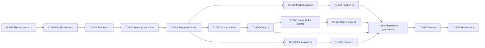

# Fixture-independent Position, Color and Focus programming

This document records the researched architecture and implementation plan. The Storybook mockup linked below demonstrates the proposed controls inside the application programmer and encoder area. It does not implement or validate the engine architecture.

**Implementation scope, revised 2026-09-28:** Position, Color (including its Media Server adapter), and Focus/Zoom. Start with fixture data and configuration, establish correct physical simulation, then deliver each complete feature across the application. **Gobos, Beam, iris, shutter/strobe, frost, framing, prism and intensity retain their current programming contracts and controls.** Existing prototype examples for these other attributes are historical explorations, not implementation commitments.

Read [the delivery sequence](#implementation-sequence), [the application-wide change map](#7-application-wide-change-map), [the shared value contract](#8-shared-semantic-value-and-operation-contract), [the frame and tracking architecture](#10-authoritative-frames-tracking-and-rendering), and [the implementation issues](#12-implementation-issues-and-dependencies) together. UI completion does not complete any engine feature.

## Current delivery checkpoint — 2026-10-01

The architecture sections below include the original codebase assessment; later implementation checkpoints supersede historical missing-prerequisite statements. UI/mockup completion and library verification are separate from production delivery and human acceptance.

The Position adapter now resolves its first complete common Resume cut across changing shared-motor peers and physical copies using captured original registries, conditioned endpoint cohorts and owned parent continuations. Requested intent/history stays separate from fitted values. Temporary retained evaluators can borrow episode-owned state, and bounded warm batch scratch survives frames independently per branch. Latest bounded Position verification: headless-runtime1585 passed with one existing ignored; the new complete whole Fixed-peer adapter tests passed3, output gate suite4, and corrected original cohort-rank assertion passed8 independent randomized runs. Four owned source hashes were stable; concurrent Claude changes are recorded separately. [Position Fixed-peer report](../../.artifacts/tmp/tl556-position-fixed-peer/integration-report.md) records scope and limits. Earlier [Position batch report](../../.artifacts/tmp/tl556-position-batch/integration-report.md) remains historical evidence.

**Still required before production:** general nested/multi-source and operation-local shared-motor cuts, persistent paired Pending episodes and accepted publication, compiled-emitter container ownership, active Target dependencies/readouts, all-family native producer/arbitration/publication, native Stage/operator and performance/cutover acceptance. Production `SUPPORTED_PROGRAMMING_CONTRACT=0`; TL556 remains In progress. The full initiative is not complete.

## 1. Architecture and research conclusions

**Store what the operator wants; resolve how each fixture produces it at output time.** Presets, cues, groups and effects should retain physical or semantic values rather than fixture DMX percentages.

Separate three kinds of information:

| Layer | Owns |
|---|---|
| Fixture profile | Physical capabilities, emitters, filters, wheels, movement ranges, optics and DMX mappings |
| Installed fixture | Mounting pose, Position Reference, pan/tilt inversion and zero offsets, individual calibration |
| Programming | Requested color, angles or target, zoom opening and focus setting, including their Dynamics |

The repository already has useful foundations: XYZ color intent, emitter calibration, physical channel metadata, fine-byte resolution, 3D Points, Position References and tracking overrides. The main changes are to extend these models and preserve semantic intent or an explicitly authored native Color recipe throughout playback. Current aiming calculates angles once; persistent target aiming must become an engine operation.

**GDTF can supply much of the fixture information.** It supports emitter xyY colors, optional spectral measurements, filters, wheel slots, physical channel ranges, response curves and mode dependencies. Import quality remains dependent on the manufacturer's data. The current importer/exporter needs expansion to retain these relationships. [Physical descriptions](https://www.gdtf.eu/gdtf/file-spec/physical-descriptions/), [DMX channel functions](https://www.gdtf.eu/gdtf/file-spec/dmx-mode-collect/)

### Core interface changes

Introduce shared, typed programming values:

- `ColorProgram`: exclusive Semantic `ColorIntent` or Direct native recipe with a derived portable estimate. Semantic Color retains base visible coordinates, white target/blend, allocation preferences and editing recipe; UV stays separate from visible color.
- `PositionIntent`: `Angles` or `Target`.
- Physical scalar values and spreads with explicit units.
- Typed Dynamics domains for the three in-scope families, preserving existing timing, phase and ownership behavior.

These values must survive programmer edits, presets, cue recording, transitions and group resolution. Native DMX conversion happens after those operations.

Compile fixture adapters when a profile, mode or calibration changes. Cache static mappings and color models; recompute only values affected by programming or live movement. Server logic remains authoritative across software encoders, hardware, keyboard, command line and OSC.

## 2. Color architecture and operator modes

### Common internal representation

Use **linear CIE XYZ** for the base visible color, with intensity controlled separately. Preserve the authoring recipe and allocation preference because several emitter combinations can produce the same XYZ while illuminating objects differently. XYZ alone cannot preserve a preference for white emitters or a particular RGBW mix. [CIE: metamers](https://cie.co.at/eilvterm/17-23-008)

The stored semantic components are the base color, white target and White Blend. A lamp's final requested XYZ is derived from those components; it is not a second independently stored color authority. Keep the base color at 100% White Blend because the Media Server still needs it as its tint. Editing the base color updates its recipe in the same transaction. Advanced edits can mark the Easy readout approximate without overwriting the requested base color.

The intent contains:

- Base visible color coordinates and their virtual editing recipe.
- A nonnegative finite `relativeOutput` factor, default 1, for Color-level output retained during native adoption; this includes zero/black and is independent of the Intensity family.
- Optional ordered semantic ranges for editable color components, resolved into each selected fixture's local recipe.
- White temperature and tint, defining the white target.
- White Blend, independent of the base color.
- Preference for dedicated white versus colored emitters.
- Optional explicit filter/wheel constraints.
- A separate UV request.

**UV is not folded into XYZ or substituted with violet.** Visible coordinates cannot describe its fluorescence effect. An unsupported UV request produces a capability indication.

### UV: controllable without spectral measurements

UV is a first-class component of the complete Color intent: `uv.amount` is finite, normalized
0–1, defaults to zero, and is displayed as **UV 0–100%**. It describes relative native UV drive,
not watts, irradiance or equal fluorescence across different lamps. This baseline works with
ordinary RGBWAUV fixtures and UV-only fixtures without an optical calibration exercise.

**Fixture configuration.** Declare the exact UV channel/function, off/full endpoint direction,
resolution and maximum allowed drive. The existing physical emitter `band: ultraviolet`
identifies its declared UV/effect purpose; it is not proof that every emitted wavelength is
below 400 nm. Optional XYZ describes its **visible** output, including violet leakage. An
unknown XYZ is `null`; a supported measured zero is zero. Both remain distinct through editor,
package and installed-calibration round trips. Optional spectra can cover the UV/visible
boundary. Preserve imported wavelength and source evidence without inventing a monochromatic
spectrum from a product label or dominant-wavelength number.

The authoring shortcut recognizes explicit `color.uv` / GDTF `ColorAdd_UV` identity even when
legacy metadata marks that emitter visible. It must not convert an old nonvisible zero swatch
into a measurement. ROOT PAR's UV control is known; its visible output, spectrum and UV power
remain unknown. Its operator control is supported despite those unknowns.

**Resolve control before visible fitting.** For each UV emitter on a head, start with a common
normalized drive `u`, clamp to its declared maximum, and map it into the exact native function,
respecting endpoint direction and 8/16/24/32-bit quantization. Thus a plain full-range U8
control gives 0, 128 and 255 at 0%, 50% and 100%; reversed functions reverse those raw values.
Configured response and gain describe predicted output; they must not silently redefine this
baseline drive percentage. Multiple UV emitters default to the same normalized drive, with
per-emitter clipping reported. Distinct native UV components remain available on Direct pages.

Freeze these UV drives while fitting the other Color controls. A request for purple must not
turn UV on. Known visible UV output contributes to the total forward XYZ and is included in
the constrained visible fit; UV may make a visible target unattainable. Unknown active UV
appearance leaves the controllable visible portion usable, but makes the **total** visible
prediction uncertain. Do not suppress the UV request or invalidate known RGBWA control just
because the UV spectrum is missing. Wavelength-dependent filter effects remain unknown without
the relevant coverage or measurements; visible filter transmission is not UV transmission.

A head without UV emits no synthetic violet substitute. It keeps the saved UV request and
reports **UV unsupported** separately from visible matching. Every Color solution owns/parks
all participating UV controls too: a zero request actively closes them, preventing a new
fixture's nonzero native default or prior cue from leaking through. Unsupported requests become
usable automatically when a UV-capable lamp joins the programmed group.

**Storage and editing.** UV belongs to the same atomic Color activation group, undo record,
preset/cue payload and semantic Dynamics value. Visible RGB, Amber, hue, white temperature,
Duv and White Blend edits preserve it. White Blend 100% does not erase it. UV-only output with
zero visible target is valid; visible black normalization must never turn it into white or
silence the UV. `relativeOutput` scales the visible target only; UV already has its independent
amount. Fixture/layer Intensity, applicable masters and blackout still attenuate visible and
UV output once through the normal output path.

Easy RGBWAUV keeps UV on page 2. Other settings can reach the same semantic UV control in the
expanded Color modal without changing the top workspace; Direct pages 3/4 provide actual native
control. Merely opening a page or switching Easy/Advanced never converts or clears the value.
The expanded modal reports requested UV, achieved normalized drive, clipping/unsupported status
and optical-data quality independently of the visible swatch. No extra compact status bar.

A Direct recipe keeps exact source values. Its portable estimate derives UV independently of
visible XYZ: a single/uniform UV bank has a recoverable normalized amount even with unknown
spectra. Unequal independently controlled UV emitters need an authored aggregation policy;
without one, retain the exact recipe and report the portable UV estimate as unknown. Never
infer UV amount from violet XYZ or let an unknown visible estimate erase a known UV estimate.
Direct/semantic adoption and fades preserve the independently known components; unavailable
components follow explicit native-only fallback rather than pretending to match. The visible
estimate is total predicted XYZ, including known UV leakage, so the destination resolver must
not add the same visible contribution a second time.

**Simulation.** Stage uses encoded drives to show known visible output and a separate UV
activity indication. Unknown leakage must not be presented as a physically matched purple
beam. Screen RGB cannot reproduce UV. Correct fluorescent scenery would require material
excitation/emission data and illumination spectra, so fluorescence rendering is outside this
iteration's guaranteed simulation. Media retains UV in the shared intent but reports it
unsupported; it does not tint the image purple as a substitute.

**Acceptance.** Test uncalibrated UV-only and RGBWAUV fixtures at 0/50/100, reversed and all four
channel widths, multi-emitter clipping, unknown versus measured-zero versus visible-leakage
models, and magenta with UV off. Record visible color plus UV, save/reload, replace RGBWAUV
with RGB/CMY and back, add fixtures to a live group, then exercise cues, updates, ranges and
Dynamics. Assert the stored UV amount never changes, unsupported destinations remain visible,
new UV channels start correctly, and UV-only black survives Direct/semantic adoption. Verify
Intensity/blackout and White Blend independence. These are delivery gates in TL-546, TL-547,
TL-557, TL-550, TL-559 and TL-560; fixture authoring regressions belong to TL-545.

Research basis: GDTF separates emitter identity from optional color/spectral measurements and
allows nonvisible emitters without an xyY color. [GDTF physical descriptions](https://www.gdtf.eu/gdtf/file-spec/physical-descriptions/)
CIE notes that the UV/visible boundary is not a hard visibility cutoff; fluorescent materials
absorb shorter-wavelength radiation and emit at longer wavelengths. [CIE ultraviolet radiation](https://cie.co.at/eilvterm/17-21-008),
[CIE fluorescent material](https://cie.co.at/eilvterm/17-24-041)


### Programmer and encoder integration

Present attribute programming in the existing programmer area, using the production family tabs, four encoder slots, page indicator and Special Dialog control. Keep the upper workspace and its normal windows unchanged. Reuse the established fixture selection, presets and application settings entry points; do not add duplicate Presets tabs, Fixture details panels, Position tools or lower status bars to these editors.

Four encoders remain the default surface. When compact Color Special Dialog is open, clicking the active **Color** family closes it and restores the same encoder page. That click does not also advance the page; a subsequent click can cycle it using the existing page indicator behavior. Color has four encoder pages; its compact Special Dialog still has only its two Color/White balance pages. **Position and Focus Special Dialogs open directly as modals**, without compact or Expand states. Their standard modal close/Escape behavior returns to the encoders. Page navigation never changes programmed values or activates a Position variant. There is no separate Encoders return button.

The Color Special Dialog uses the measured encoder-area size. On the software surface it replaces that area inline only when the available container is at least **680 px wide and 210 px high**. A smaller area or a hardware-connected surface opens the full editor in the application's normal `ModalFrame`. This decision uses the actual area after the command line and family tabs, rather than viewport width alone. Closing the modal preserves the family, encoder page, recipe and programmed values.

The compact Color Special Dialog has two pages, **Color** and **White balance**. On Color, a **two-dimensional hue/saturation selector** fills the available left area; the **White Blend fader** sits at the top of the right area, with **White balance** and **Expand** buttons directly underneath it. There is no footer bar, extra header or tab row. Page 2 contains exactly **Temperature** and **Duv** faders and the page/expand actions. It has no White Blend control. Neither compact page shows color approximation.

Reuse the existing **`VerticalTouchFaderControl`** for every Color fader, presented horizontally with the relevant colored track and its touch-point indicator. This applies to saturation, White Blend, Temperature and Duv, preserving the established drag behavior and ordered Shift-range interactions. Do not replace these controls with an unrelated slider style.

White-balance gradients must contain a true white neutral center: warm → white → cool for temperature, and magenta → white → green for increasing Duv. The neutral point must not appear gray or retain an unintended tint. The values remain labeled in Kelvin and Duv. White balance is available in Easy Mode. Repeated presses of the existing **Special Dialog** button also cycle the compact Color/White balance pages. Each page fits without scrolling and preserves readable values and touch-sized slider interactions.

The expanded editor uses the normal `ModalFrame` chrome, with the title aligned flush to its standard title-bar layout. A full-width color area places a **large hue ring on the left** and horizontal **saturation, White Blend, Temperature and Duv faders stacked on the right**. The ring is approximately 340 px across, adapting within roughly 327–380 px in the intended modal layouts. The per-fixture approximation breakdown sits below. Keep all controls visible together at the established 761 px-high desktop viewport without vertical overflow. The ring's displayed hue, pointer geometry and selected value must agree. A page switch must not hide one set of controls. Hardware and narrow-layout fallback open the same complete editor. It contains no fixture tools or duplicate preset tabs. Wheel controls remain on Advanced encoder page 2.

Easy/Advanced and the Easy extended layout are application-settings preferences, reached through the existing settings entry. The isolated mockup may expose these values through Storybook controls or a dedicated configuration story for verification. Switching presentation preserves the color, recipe, ranges and other semantic components. Retain the production software and hardware-connected encoder arrangements and their normal typography; do not shrink encoder fonts to fit more controls.

### Easy Color: default operator view

Easy Color uses the full calibrated resolver. Its controls describe a fixed virtual light engine, so their meaning remains consistent across RGB, RGBW, RGBAL, CMY and wheel fixtures.

| Setting | First encoder page | Second encoder page |
|---|---|---|
| Easy RGBW | Red, Green, Blue, White Blend | — |
| Easy RGBWAUV | Red, Green, Blue, White Blend | Amber, UV, unassigned, unassigned |
| Advanced | Red, Green, Blue, White Blend | Color temperature, Duv, Wheel 1, Wheel 2 |

These are semantic pages 1/2. Every setting also offers Direct pages 3/4 as specified below; those pages do not change the Easy/Advanced preference. Preferences remain stable when the fixture selection changes. Unassigned encoder slots retain the standard empty appearance.

- Virtual engine v1 uses the existing sRGB/D65 conversion matrix and sRGB transfer function for RGB.
- Virtual Amber v1 is explicitly defined as the linear XYZ of encoded sRGB `(1, 0.5, 0)`, multiplied by the Amber level and added to RGB XYZ. This is an authoring reference, not a spectral measurement or a claim about any fixture emitter. Amber level is linear; it does not change UV, White Blend or relativeOutput. Changing these constants requires a new virtual-model version.
- Coordinate input retains exact XYZ and derives a bounded RGB approximation for Easy controls (Amber starts at zero for that approximation). Presentation switches and reads leave XYZ intact; the first Easy base-color edit adopts the displayed virtual recipe.
- Amber adds a defined visible amber contribution; the resolver can synthesize it when no amber emitter exists.
- UV requests the separate UV capability.
- For lamps, White Blend mixes the base color—including Amber—with the white target.
- Easy Mode starts with white at **6500 K, neutral tint**. Advanced controls can edit that target.
- UI color pickers decode sRGB before linear color calculations. [W3C color-space definitions](https://www.w3.org/TR/css-color-4/)

Preserve the requested lamp White Blend behavior:

```text
colored contribution = min(1, 2 × (1 − blend))
white contribution   = min(1, 2 × blend)
lamp target XYZ      = relativeOutput × (colored contribution × base XYZ
                     + white contribution × white target XYZ)
```

Thus:

- **0%:** full colored recipe, white off.
- **50%:** full colored recipe and full white contribution.
- **100%:** colored contribution off, white contribution full; the stored base color remains intact.

For a matching reference RGBW fixture, the allocation recipe reproduces those native levels. Other fixtures produce the closest supported result. Absolute brightness cannot be identical across different lamps without photometric calibration.

UV remains independent of White Blend. The Media Server interprets White Blend as source desaturation, as specified below.

### Quiet capability feedback and expected no-ops

Expected limitations never interrupt programming. Approximate visible color, unsupported UV,
unknown calibration, clipping and native-only fallback are normal capability outcomes, not
operator errors. The Fixture Sheet may show one small, steady exclamation triangle next to its
Color value. Use the existing subdued status styling: no flashing, attention animation, error
banner, toast, sound, modal opening or confirmation. Keep the requested color swatch/value and
normal row geometry. A mixed selection must not produce one notification per fixture.

The triangle has an accessible label and a normal touch-sized hit area. On deliberate activation,
open the existing complete Color modal's per-fixture detail area; keyboard and touch work without
requiring hover. Its details describe the result calmly (for example, “UV unavailable on this
fixture” or “Estimated color”), keep visible-color match separate from UV, and require no
acknowledgement. The indicator has no live-announcement behavior on every frame or color change.
The compact special dialog still has no added status bar.

A valid requested intent can always be edited, recorded, recalled, faded and used in Dynamics
when a fixture cannot fully achieve it. Capability status accompanies the result; it must not
reject the operation or rewrite the intent. Use the defined deterministic achievable/hold/park
policy for output, retaining intent for later replacement or restored capability.

An empty fixture selection during ordinary encoder, picker, preset-apply, alignment or similar
selection-dependent operations is an expected no-op. A fixture-specific preset may still select
its stored fixtures according to its existing semantics; a universal preset with no targets does
nothing quietly. Syntactically valid AT/FixAT/Release/Aim actions with no applicable selection
follow the same quiet no-op rule. This explicit user requirement supersedes older help/test
expectations for empty-selection refusal messages. Keep ordinary empty selection/readout state;
do not emit “No fixtures selected” errors or toasts. It must not create a dummy edit, undo entry,
phantom activation or network error. Apply the same outcome to software, keyboard and hardware
paths. Model this as an explicit successful no-op where it crosses the API; do not suppress
arbitrary exceptions by string matching. Keep actionable failures such as unsaved changes,
failed storage/connection and invalid authored configuration distinguishable from capability
limitations and harmless no-ops. Explicitly invalid command syntax retains its command contract.

Acceptance: repeat edits with no selection, recall a preset onto mixed RGB/RGBWAUV/wheel fixtures,
request UV on unsupported fixtures, and change ranges/Dynamics continuously. No modal, toast,
alert, focus movement or acknowledgement appears. The quiet Color indicator can expose details
on demand; valid intent remains recordable and playback continues. TL-550 owns the operator
presentation and regression checks; shared mutation results in TL-547/TL-548 and resolvers in
TL-557/TL-559 must provide status without turning normal outcomes into failures.

Concrete existing paths to correct: `features/server/programmerAlignment.ts` emits a toast for
a successful Align no-op; `programming/preset_recall_plan.rs` emits an empty-universal-preset
warning that `features/presetRecall/writer.ts` wraps as an error. Correct those outcomes at their
owning boundary and update numbered help/tests 23 and 26. Preserve real persistence warnings.
Fixture Sheet status must come from the selected encoded frame, not per-row requests to the old
`color_report` path that independently re-runs fitting. An unprogrammed fixture must not receive
a warning from comparison with an invented white request.

### Advanced Color

Advanced Mode exposes the same intent through the second encoder page and Color Special Dialog:

- Color picker and chromaticity controls edit the base color.
- Temperature and green–magenta tint edit the white target.
- White allocation preference.
- Automatic or explicit wheel/filter selection.
- Requested versus achievable color and calibration quality.

Switching Easy/Advanced in Settings changes presentation only. It must not alter programming or stored presets, including the base color retained at 100% White Blend.

When an Advanced base color cannot be represented exactly by the Easy recipe, show an approximate Easy readout while retaining the original coordinates. The first Easy edit deliberately adopts the displayed recipe; entering Easy Mode alone does not.

Temperature uses Kelvin; tint uses signed **Duv**, positive toward green and negative toward magenta. Default request limits are 1000–20000 K and ±0.03 Duv, with fixture capability limits reported separately. White transitions interpolate reciprocal temperature and tint. [NIST: CCT and Duv](https://www.nist.gov/publications/practical-use-and-calculation-cct-and-duv)

### Direct Color: native pages 3 and 4

Direct Color is a normal, recordable programming representation inside the **same Color activation group**. It gives the operator access to a fixture's actual Red/Green/Blue/White/Amber/Lime/UV emitters, subtractive filters and wheel selections. It must not be implemented as a temporary raw override that disappears from presets or cue recording.

- Pages 1/2 keep the virtual semantic controls above. Pages 3/4 provide up to eight profile-derived native controls. More complex heads expose remaining channels through the existing Color modal; do not silently omit them or expand the upper workspace.
- In a mixed selection, use a clearly labeled reference head for native authoring, initially the first eligible head in the stable ordered selection. The lower area/modal provides reference selection. A selection change does not silently reseed an existing Direct recipe.
- Paging or opening a dialog is read-only. The first native edit adopts all participating channels from the current premaster solution once, applies the edit and replaces Semantic with Direct atomically. It preserves actual channel resolution and function identity, including CMY channels whose public canonical aliases may be RGB.
- The first semantic edit adopts the modeled appearance, relative output and UV of the Direct recipe before switching authority. Mark an approximate adoption; if appearance is unknown, expose the explicit starting value rather than claiming a lossless conversion. Easy/Advanced settings and merely viewing semantic controls never convert a recipe.
- Show requested native values for the reference and portable approximation for other fixtures. The full Color modal retains per-fixture achievable output and model-quality feedback. Unknown appearance and unsupported UV remain visible.

Store an exclusive tagged value, conceptually:

```ts
type ColorProgram =
  | { kind: 'semantic'; intent: ColorIntent }
  | { kind: 'direct'; recipe: NativeColorRecipe; portable: PortableColorEstimate };

interface NativeColorRecipe {
  sourceProfileRevision: string;
  sourceProfileDigest: string;
  modeId: UUID;
  headId: UUID;
  nativeLayoutSignature: string;
  channels: { channelId: UUID; functionId: UUID; raw: number }[];
}

interface PortableColorEstimate {
  modelRevision: string;
  visible: null | { xyz: XYZ; relativeOutput: number };
  uv: null | { amount: number; quality: DataQuality };
  quality: DataQuality;
  limitations: string[];
}
```

Semantic adoption explicitly retains the portable estimate's `relativeOutput` in ColorIntent, sets White Blend to zero and adopts its base visible coordinates/UV. Zero output remains zero through later serialization and mode changes; only an explicit color edit changes it. The factor is a visible-output envelope within Color (UV retains its separate amount), applied after the virtual White Blend calculation and before independent Intensity/master controls; it is not an activation of Intensity. Preserve its value when showing an approximate Easy recipe. Source/destination photometric differences still make cross-fixture output matching approximate.

The Direct recipe is authoritative. Derive the portable estimate from its pinned source forward model in the same edit transaction; it is not separately editable. Native values are premaster values at full 8/16/24/32-bit resolution. The source model defines the reference full-output normalization, so half-output recipes and black survive conversion. A chromaticity normalization that maps zero XYZ to D65 is invalid here. Independent fixture/layer intensity remains separate.

A verified matching native layout reproduces the recipe exactly. Compatibility requires channel/function identity and response meaning, not matching labels, canonical aliases or DMX offsets. An explicit verified mode mapping can extend compatibility. Calibration-only changes need not invalidate native layout compatibility, but must not silently recompute the saved portable appearance. Other fixtures fit the stored visible-color/output/UV estimate through the normal resolver and report best-effort results. Keep explicit per-fixture exceptions, even when two recipes have similar XYZ.

A recipe defines or resets **every participating Color channel**, including wheel/filter defaults, so stale semantic channels cannot remain active. Unsupported macros, split/rotating wheel states or missing optical information can make portable appearance unknown: retain exact native operation and label it native-only. For an incompatible fixture, resolve independently known portable components: apply a known UV amount (including zero) even when visible appearance is unknown; fit known visible XYZ when the portable UV amount is unknown, parking UV off with an explicit limitation. An unavailable visible component holds its last valid visible solution, or declared safe visible defaults before a first valid solution. Report any unknown active UV contribution in the total appearance. This is one complete resolved Color result, not independently activated native channels. Never invent white as a successful fallback.

Direct presets retain recipe plus portable estimate as a universal template; materialized recall and cue capture retain that data instead of baking destination-fitted channels into the stored preset. The complete value passes through all Normal/Blind/Preload, Cue, Update, undo, import and restore paths. Direct Dynamics recompute the changing recipe's source prediction once per tick before destination fitting; a static record-time fallback would incorrectly freeze the effect on other fixture types. Section 9 governs representation arbitration and transitions.

### Ordered color ranges

The hue ring and color sliders support **first/last endpoint range editing**: either click the first value normally and Shift-click the second, or hold Shift for both clicks. Show a pending first marker, then both numbered endpoint markers and a range readout. Distribute the values across the existing ordered fixture selection, including intermediate fixtures. The result is a semantic spread, not a single value displayed with two decorative handles.

Keep the spread per attribute: hue, saturation, White Blend, Temperature or Duv. Editing one range preserves the other color components and ranges. An ordinary click or drag clears only that attribute's range and applies one value across the selection. Preserve endpoint order; do not sort the endpoints. Reversing them reverses their assignment to the selection. The same intent and range state must survive compact/full presentation changes and ordinary encoder access.

Hue interpolates over the **shortest circular arc**, with an exact 180° tie resolved clockwise. Equal endpoints produce a constant hue. Slider ranges interpolate numerically in selection order; descending ranges are valid. Per-fixture previews must use the actual interpolated local recipes. Resolve the resulting semantic color before predicting fixture output; never interpolate native DMX values as a substitute. This mockup does not add multi-turn wheel gestures; a future longer-arc choice would be explicit.

### Fixture resolution

Replace the current mutually exclusive color-system branches with a **per-head optical model**:

```text
light source / additive emitters
    → CMY and correction filters
    → one or more color wheels
    → predicted output color
```

- Additive fixtures use a bounded solver over all available visible emitters and their response curves.
- Resolution prioritizes chromaticity match, then requested allocation, then available output.
- RGB fixtures synthesize white; RGBW/RGBCCT fixtures use dedicated white where appropriate.
- Arbitrary emitters—lime, amber, mint, cold/warm white and others—use the same solver.
- Wheel fixtures choose the closest permitted steady combination.
- Hybrid fixtures solve emitters and filters together.
- Serial filter combinations require spectral information or measured combination data. Multiplying XYZ values is not a valid filter model.
- Every resolution explicitly writes or clears all participating channels to prevent residual colors from earlier programming.

For continuous-capable hybrids, prefer clear wheels when the target is already achievable. Wheel-only transitions snap at the configured cue timing; hybrids use continuous mixing during the fade and settle on the chosen filter combination without repeated wheel changes.

Fixture calibration changes the predicted output model. Diagnostics compare achieved output with the **original requested target**.

Color is one atomic LTP intent and one activation group. Base coordinates, the RGB/Amber editing recipe, White Blend, the white target, UV and wheel/filter constraints all belong to that group. Editing one Easy encoder updates the shared intent while preserving its other components, producing one undo step. Family activation, release, preset recall and recording operate on this coherent color value; the resolver must never combine independently active native channels from different representations.

Subparameter masks describe edits within one family owner. Seed untouched components from that owner's existing intent, otherwise adopt the effective semantic intent once at gesture start. Record, filter and release the complete Color family. Do not persist a separately competing Red, wheel or white contribution. The shared operation rules in section 8 apply to every input and recording path.

### Mixed-selection color feedback

One requested color can produce different results across a mixed selection. For a uniform request, show the **requested swatch once**, then a separate estimated output row for each fixture or genuinely equivalent fixture group. Each row identifies the fixture, predicted output swatch, mapping strategy, match status and data quality. When a semantic range is active, retain its visible endpoints and compare each fixture with its own interpolated local request. Do not show one aggregate achievable swatch: an average could conceal that a wheel fixture cannot produce the requested color.

Color approximation appears **only in the expanded Color modal**, alongside its complete controls. Neither compact page nor an added lower status bar carries the breakdown. The Fixture Sheet may carry only the passive Color triangle described above. Within the modal, summarize the largest reported mismatch and affected fixture count and retain the per-fixture rows. Keep match quality and data quality separate: an apparently close nominal estimate is not a measured physical match. Without calibrated data, use explicit estimated/unknown labels rather than precise-looking error scores. Unsupported UV remains an independent indication because visible swatches cannot represent its effect.

Group rows only when fixture profile, operating mode, relevant calibration and requested value are equivalent; split fixtures whose calibration, effective color capabilities or interpolated range values differ. Counts may compact repeated identical results. Grouping the display never merges the fixtures' actual resolver state.

The mockup demonstrates the following three-fixture selection:

| Fixture | Example capability | Magenta request | Warm-white request at 3200 K |
|---|---|---|---|
| JB-Lighting JBLED A7 | RGB mixing | Estimated RGB magenta | Estimated warm white synthesized with RGB |
| Cameo ROOT PAR 6 | RGBWAU additive emitters | Estimated RGB magenta; UV remains separate | Illustrative RGB + White + Amber allocation |
| Cameo Auro Spot, illustrative wheel | Open, Warm White, Red, Yellow, Light blue, Dark blue, Green | No magenta slot; show the chosen fixed slot visibly as an approximation | Illustrative Warm White filter selection |

The wheel choice is an estimated fallback under the example data, not a claim that a named physical slot is a calibrated nearest match. Do not invent native channel percentages for either mixer or claim that the three warm-white outputs have identical chromaticity or spectrum. The requested 3200 K target remains unchanged for all three fixtures.

Explicit wheel constraints remain part of the same color intent. The example resolves supported Open/Red/Blue choices for the Auro and reports unavailable slot or correction-wheel requests per fixture. An unsupported constraint stays visible and stored; it must not be accepted and then silently ignored by the match display.

The library's [ROOT PAR 6 package](../../assets/fixture-library/cameo--root-par-6.toskfixture) explicitly marks its emitters nominal and uncalibrated: sRGB primaries, a D65 white reference, a 590 nm amber reference while its new physical path retains UV as a controllable emitter with unknown visible XYZ. The old nonvisible zero swatch is not a measurement. Its notes say manufacturer chromaticities, white CCT and UV wavelength are unavailable. These reference values support an estimate, not measured lamp output. The [JBLED A7 package](../../assets/fixture-library/jb-lighting--jbled-a7.toskfixture) supplies the RGB control model used for this scenario; its preview remains illustrative.

The actual [AURO SPOT Z300 library package](../../assets/fixture-library/cameo--auro-spot-z300.toskfixture) has nine fixed wheel positions and `measured_xyz: null` for its filter data. The user's seven-slot Auro Spot example above is therefore a separate illustrative scenario, not an exact inventory of that Z300 profile. Label that distinction in Storybook documentation and the data-quality breakdown.

An optional common-gamut operation may help an operator deliberately choose a target all selected fixtures can approximate. It must be an explicit action with visible consequences. Never silently clamp every fixture to the most limited fixture's gamut or replace the stored request when the selection changes.

## 3. Position, moving mounts and targets

### Two mutually exclusive position types

Use one Position preset family with a visible **Angles / Point (Target)** type. All position-related programming attributes belong to one activation group. Its active value is a tagged union: Angle and Target control the same pan/tilt output, so activating either atomically replaces and disables the other.

```text
PositionIntent =
    Angles { pan_degrees, tilt_degrees }
  | Target {
        WorldXYZ { metres }
      | PointReference { point_uuid, local_offset_metres }
    }
```

Store stable UUID references; fixture numbers remain operator-facing identifiers.

Angles describe calibrated fixture-local movement. Targets describe where the beam should point in the show's world coordinates: X across stage, Y upstage, Z upward. A fixture can have only one active Position variant at a time. The UI may retain an inactive editing draft for convenience, but recording, recall, group activation, playback and persisted active intent must not treat that draft as a parallel output.

Both variants support spread operations across the current ordered selection. Spread Angle values in degrees; spread Target world coordinates or point-local offsets in metres. Evaluate the spread on the semantic intent **before** resolving each fixture's target into pan/tilt. Keep point UUID references discrete; a numeric spread must not interpolate point identities. A Target spread remains a set of target intents when the mount or target subsequently moves, rather than becoming a set of frozen angle values.

The Position family has exactly two encoder pages:

| Page | Encoder 1 | Encoder 2 | Encoder 3 | Encoder 4 |
|---|---|---|---|---|
| 1 of 2 | Pan degrees | Tilt degrees | Unassigned | Unassigned |
| 2 of 2 | Point | X offset metres | Y offset metres | Z offset metres |

Clicking the active Position family switches between those pages. Page navigation alone does not activate a variant or replace the current intent. Editing or explicitly enabling Point/XYZ atomically activates Target and disables Angle. Editing or explicitly enabling Pan/Tilt atomically activates Angle and disables Target; when converting a live Target, adopt its current resolved Angles before applying the edit. Preset recall and group activation follow the same exclusive replacement rule.

As with Color, partial edits seed the complete family once and recording captures that family. A mask limits fields edited within the active Position variant; it cannot create a partial competing owner or persist the inactive variant. Cue transitions may evaluate source and destination internally, while one Position owner produces one resolved pan/tilt pair. Section 9 defines transitions and Dynamics precisely.

The Point encoder selects **Origin**, **Stage center**, **Performer** or **Moving truss** in the mockup. Origin is the default and makes the three offsets absolute world XYZ coordinates. The other choices refer to 3D Points by stable UUID; their offsets use the selected point's local frame and rotate with that point. In the application, populate this selector from the show's actual 3D Points and retain Origin as the fixed-coordinate option.

The Position Special Dialog is **modal only**, with an **unwrapped multi-turn pan circle above a regular Tilt fader on the left**, and a **square Aim joystick on the right**. It has no inline version, Expand step or GLB/moving-head visual. This supersedes the earlier model-based Position UI proposal; shared model geometry remains relevant to the future aiming engine, not this control's appearance.

The pan control preserves the complete signed angle across revolutions instead of reducing the programmed value modulo 360°. The example supports **−720° to +720°**, with explicit **−90° / Reset / +90° actions** and a turn readout. Reset sets Pan to zero and preserves Tilt; pressing Reset while Pan is already zero does not change the active Position intent. These are example programming limits, not a claim that every fixture can achieve them. The production resolver still applies each fixture's physical range and reports the difference. The circle may wrap its visual pointer, while the stored angle and turn count stay unwrapped.

An **Aim joystick** provides spring-centered velocity control. Deflection controls pan/tilt in degrees per second. Apply an 8% neutral deadband followed by a squared response curve for careful adjustment near center; outer deflection retains the full example rates of 120°/s Pan and 90°/s Tilt. While the pointer is held off center, the angles continue changing even without further pointer movement. Centering, release, pointer cancellation, modal close or window blur stops movement and centers the joystick. Use bounded frame elapsed time so a delayed frame or background pause cannot cause a large catch-up jump.

Point and X/Y/Z controls live **only on Position encoder page 2** and obey the exclusive Angle/Target contract. The modal has no duplicate **Aim reference** selector or XYZ row. It shows Pan, Tilt and the Aim joystick; existing value readouts can expose resolved angles and reachability without a Position tools panel or lower status bar. Editing Pan, Tilt or the joystick while Target is active atomically adopts its current solved Angle pose before applying motion. Keep gesture geometry stable throughout the active interaction; defer Angle-encoder-page changes until release. Merely opening the modal does not change the active variant.

While Target is active, the modal and Angle encoder page **must display the current achieved, calibrated, unwrapped commanded angles from the coherent frame**, labeled as resolved values. Convert that projection into the calibrated programming coordinate frame once; never apply installation offsets twice. Do not display a dormant Angle draft or claim a hardware-measured pose. Preserve mixed-selection readouts and per-fixture adoption. Mount/target movement, clipping and held/unreachable output update the readout without activation, a programmer revision, a modified-show flag or an undo step. The first actual edit adopts this sampled pose; opening or watching the controls is read-only.

Reuse standard modal close/Escape behavior and the existing preset UI. Closing stops every active motion before returning to the encoders. Do not add an Encoders button or separate preset tab.

### Distinguish mounting from aiming

A fixture can have two independent relationships:

| Relationship | Meaning |
|---|---|
| Position Reference | Moves and rotates the fixture's mounting frame |
| Aim Target | Determines where its beam points |

This directly supports the requested moving-truss example:

1. Lamps reference a truss movement point.
2. Their Target preset references the stage-center point.
3. Raising or rotating the truss changes their world mounting poses.
4. The engine recalculates pan/tilt continuously to keep aiming at stage center.

The target may also move through PSN. Both ends are evaluated from one coherent engine frame.

In the mockup, the tracked-target story retains independent mounting and aiming values. Demonstration movement can use Storybook controls or the relevant Position target presentation; it must not introduce a Position tools panel, duplicate preset browser or new upper workspace controls. Reuse the existing preset UI for storing and recalling Angle/Target values, retaining their explicit type.

Preserve the existing attachment contract in [Position Reference acceptance scenarios](../testing/30-position-reference-3d-points.md): rigged locations remain intact, attachments rotate about the reference point, and 3D Points do not themselves acquire Position References.

### Engine resolution order

```text
Coherent generation, clock and tracking snapshot
    → programmer/playback semantic base and ordered group spreads
    → typed Dynamics and family ownership resolution
    → resolved 3D Point values
    → tracking overrides
    → world mounting and target transforms
    → per-head aiming solution
    → installation calibration and physical limits
    → Color and Focus/Zoom adapters, explicit output holds
    → native channel values and DMX bytes
    → one published frame for output and value/visualization consumers
```

Extract attachment and aiming transforms into a shared geometry module. Currently, [the aim command](../../crates/light/adapters/headless/src/runtime/programmer_aim_command.rs) calls renderer placement mathematics. The engine and Stage should consume the same geometry calculations without requiring a Stage window.

Use real model pivots and profile geometry for the emitting head. Include bracket orientation and per-head kinematics; scanners require their own kinematic adapter.

Preserve tracking ownership: a bound source overrides programmed point values; its last received pose holds when packets stop. Bindings are persisted, incoming poses are runtime state. Unbinding restores normal programmed resolution.

### Movement and transition rules

- Model signed physical endpoints, mechanical zero, inversion and installation offsets explicitly.
- Apply calibration once; mount rotation and encoder-zero correction must remain distinct.
- Preserve requested values; clamp only the achievable output and report the difference.
- Choose the reachable equivalent aiming solution nearest the current joint position.
- At a pan singularity, retain the previous pan rather than jumping.
- An unresolved target holds the last valid aim and reports the missing reference. Before any valid solution, retain the existing/default position.
- Angle fades interpolate joint angles.
- Target fades interpolate evaluated world target positions; the destination retains its live reference after completion.
- Angle↔Target transitions blend solved joint positions and adopt the destination intent at completion.
- Manual Pan/Tilt editing converts an active target into its current realized Angles before applying the edit.

Distinguish bounded positioning, cyclic absolute positioning and continuous rotation in degrees/second. A speed-only endless-pan channel cannot reliably hold a target without position feedback or a documented homing/position mechanism.

Fixtures sharing one DMX output cannot independently aim from different mounting positions. Detect incompatible target solutions and report that independent heads or fixtures are required.

Design the Target schema now. Implement fixed targets with the shared geometry work; enable continuous tracked source/target operation after the attachment and PSN acceptance gates pass.

## 4. Fixture configuration, other attributes and Media Server

### Fixture and installation editors

Provide simple profile templates for RGB, RGBW, RGBCCT, arbitrary additive emitters, CMY, wheels and hybrids. Simple fixtures should work without manual color science configuration.

Use the existing fixture selection and configuration entry points. The dedicated configuration story can demonstrate physical ranges, emitters and calibration in the existing forms. Configuration does not add a Fixture details tab to Color or Position, replace the upper workspace, or compete with the four encoder slots. Preserve parity between software and hardware-connected layouts.

Advanced profile editing exposes:

- Emitter/filter identities, measurements and response curves.
- Wheel colors and valid combinations.
- Movement ranges and zero positions.
- Zoom convention and physical limits.
- Mode dependencies and mapping preview.

Mark data as **measured**, **manufacturer supplied**, **estimated** or **missing**. Template estimates provide a usable starting point without claiming calibrated matching.

Installed-fixture calibration provides:

- Pan/tilt inversion and zero offsets.
- Mounting and bracket orientation.
- Individual emitter/output correction.
- A guided position check and optional color-measurement import.

Keep profile updates explicit and preserve the profile snapshot needed by a portable show.

Expand GDTF import/export to resolve actual emitter/filter references, all relevant channel functions, fine-byte widths, wheel slots, conditional functions and physical curves. Preview missing or contradictory data before committing an import. GDTF distinguishes angle positioning, angular velocity, zoom angle and iris diameter. [GDTF attribute definitions](https://gdtf-development.com/help/developers/gdtf_1_2/annex/index.html)

### Deferred research: other useful abstractions

The following table records earlier research only. **Do not implement these changes in the current delivery.** Zoom and Focus are the exceptions and belong to the Focus feature below; existing Beam/iris/shutter/gobo behavior stays unchanged.

| Attribute | Programming unit or behavior |
|---|---|
| Zoom | Full opening angle in degrees, with Beam/Field convention recorded |
| Iris | Opening in percent of usable diameter; keep the operator readout in percent |
| Strobe | Hertz for measured periodic modes |
| Random strobe | Named Slow/Medium/Fast categories unless rate statistics are documented |
| Zoom/iris pulse | Physical base/depth, frequency, waveform and phase |
| Gobo/prism rotation | Angle or signed degrees/second |
| Focus | Current delivery: normalized 0–100%; physical focal distance is deferred |
| Framing | Relative insertion and blade angle |
| Frost | Relative amount unless meaningful physical calibration exists |
| Intensity | Relative level; optional future photometric calibration |

Future work would need to prove native effects reproduce their requested semantics. No new native pulse/strobe abstraction or dimmer-based strobe emulation is included here. Existing Dynamics will gain typed Zoom/Focus lanes as part of the Focus feature.

### Focus Special Dialog

Focus Special Dialog is **modal only**, with no inline version, Expand step or GLB visual. Retain its responsive **beam-angle drag** for zoom in degrees and separate **focus-position drag** with a 0–100% readout. The schematic and encoder values update together. Fit the schematic to the actual available width and height, with readable 12 px labels and at least 44 px drag targets. Preserve the grab offset so touching an edge does not jump the value.

Retain the profile's beam-opening convention. Focus percentage is a normalized control until a physical distance mapping is calibrated; the schematic does not claim a measured focal distance. Use normal modal close/Escape behavior without an extra status bar, tool panel or Encoders return button. Physical optics, calibration and DMX resolution remain engine implementation work.

### Media Server integration

Media layers and master color use the same stored base color, adapted to the renderer's RGB space. **White Blend is source desaturation on media**, so the four Color encoders remain Red, Green, Blue and White Blend. There is no separate grayscale encoder.

In linear RGB:

```text
luminance = 0.2126 × source.R + 0.7152 × source.G + 0.0722 × source.B
outputRGB = lerp(sourceRGB, (luminance, luminance, luminance), WhiteBlend)
          × baseRGBTint
          × intensity
```

The coefficients apply to linear sRGB/Rec.709 primaries; convert sources into the working color space before calculating luminance. At 0% White Blend, tint the original image. At 100%, tint the grayscale image. Red/Green/Blue remain active at both endpoints. A neutral grayscale result requires all three tint encoders at 100%; a red tint at 100% White Blend produces a red image, not a white image.

Lamp resolution uses the separately derived lamp target XYZ. Media resolution uses the retained base color and White Blend. Neither adapter overwrites the common stored intent, so recalling the same preset onto media never loses its RGB tint merely because a lamp had blended fully to white.

Apply consistent transfer handling across HAP, decoded video, images, generated text, previews, layers and master output. Apply alpha and masks without replacing the source alpha. Preserve black pixels; selecting white must not turn black image content white. Layer and master intensity remain independent.

This intentionally replaces the current `media/domain/src/color.rs` legacy luminance coefficients (0.299/0.587/0.114) for this color-managed path. Domain functions, WGSL shaders, DMX personality decoding, HTTP controls and snapshot previews must change together. Audit actual source transfer tagging and conversion boundaries; do not add another sRGB decode to already-linear textures. Acceptance uses reference image patches through each real decoder/render path. White temperature, Duv and lamp-only filter constraints remain retained but inapplicable to media; they must not overwrite its base tint.

UV has no corresponding visible media tint. Report it as unsupported for media output.

The Media Special Dialog preserves its separate interpretation of White Blend. Its first compact page contains the two-dimensional tint selector and a **White Blend fader**, which controls grayscale conversion while retaining RGB tint. Its second compact page is the media output preview, not lamp white-balance controls: it does not expose Temperature or Duv. The full media editor places the large hue ring left, saturation/White Blend faders right and the preview below, showing them together. These faders use the same horizontal `VerticalTouchFaderControl` presentation. RGB tint and White Blend remain on the normal Color encoder page; intensity stays in the Intensity family. The preview and required media feedback are reachable from the lower area without installing a new upper workspace panel.

## 5. Delivery, verification and explicit defaults

### Implementation sequence

1. **Fixture foundation:** physical capabilities, geometry/coordinate conventions, optical models, calibration, existing profile/installation editors, GDTF and shipped profile quality.
2. **Correct simulation:** shared forward physics from native output, calibrated world transforms, achieved color, zoom and honest focus visualization, in native Stage. This can be validated through existing native programming before new intent programming lands.
3. **Shared semantic foundation:** typed addresses/values, units, mandatory family activation, operation plans, Dynamics domains, transitions and wire contracts. Supply common mechanisms, not three partially functioning user features.
4. **Coherent runtime frames:** publish output and resolved physical state once, share it with consumers, compile dependency indices and bound tracking/subscription work.
5. **Position as one complete feature:** Angle/Target storage, physical fitting, tracked mount/target, Dynamics, all programming/recording/playback paths, production encoders and Position modal.
6. **Color as one complete feature:** retained recipe/white/UV/wheels, compiled fitting, all programming/playback/Dynamics paths, Media adapter, production encoders/settings/compact and full dialogs.
7. **Focus/Zoom as one complete feature:** focus percentage and zoom degrees, calibrated mapping, Dynamics, all value/recording/playback paths and production Focus modal/encoders.
8. **Show cutover and integration acceptance:** owned shows/seeds, import/references, recovery, end-to-end scenarios, help and physical operator evidence.
9. **Packaged performance acceptance:** simultaneous tracking, Dynamics, Color fitting, cue fades, Stage and visible readouts at the repository's established scales.

Each feature's calculation, fitting, input controls, readouts and persistence land together. The separate foundation issues enable this; a dialog or a new enum alone cannot close a feature issue. Detailed dependencies and dedicated issues are in section 12.

Universal presets store semantic values. Fixture-specific exceptions remain explicit. Group programming resolves against current ordered membership, allowing fixture replacement or additions without rewriting the preset when the requested capability is supported.

**Keep current materialized preset recall.** Recall copies semantic values into the programmer; cue recording retains those values. Updating a preset does not implicitly rewrite previously recorded cues. Fixture independence comes from resolving semantic values against the current profile and existing live Group membership. General live Cue→Preset links are deferred. Existing Dynamics Preset sources remain live references and require typed semantic extraction and dependency invalidation.

### Acceptance tests

- One color preset across RGB, RGBW, RGBCCT, RGBAL, CMY, single-wheel, dual-wheel and hybrid fixtures.
- Mixed JBLED A7/ROOT PAR 6/illustrative Auro Spot selections show one requested swatch and separate predicted outputs for magenta and 3200 K warm white, with mapping, match status and data quality for each row. The wheel's unsupported magenta is visible as an approximation; no aggregate achievable swatch hides it.
- Equivalent profiles/modes/calibrations with equivalent requested values may share a counted result row; heterogeneous instances remain distinguishable. The expanded Color modal reports the worst mismatch and affected count. Selection changes preserve the requested color; common-gamut changes require an explicit action and UV stays independent.
- Easy RGBW at 0/50/100% White Blend; Amber synthesis; supported and unsupported UV.
- Easy↔Advanced changes through application settings preserve all semantic components and ranges exactly; approximate Easy readouts do not rewrite them. Storybook controls or the configuration story may exercise this isolated preference.
- Four production encoders remain the default. Clicking active Color while its compact Special Dialog is open exits to the same encoder page without paging; a subsequent click pages normally. Position and Focus open directly as modals, with no inline or Expand state. Viewing or leaving a dialog does not alter programming or Position activation, and closing Position stops motion.
- Compact Color uses a two-dimensional hue/saturation selector on the left and White Blend high on the right, with White balance and Expand immediately underneath. There is no footer/status bar, extra title/tab row or Encoders return button. Compact White balance contains exactly Temperature and Duv faders; both gradients have a true white neutral center. Approximation appears only in the expanded modal.
- Every Color fader uses the existing `VerticalTouchFaderControl` in horizontal presentation with a colored track and visible touch-point indicator. Preserve Shift ranges and verify the actual control's pointer/drag path.
- Expand shows an accurate, approximately 340 px hue ring, saturation, White Blend, Temperature, Duv and per-fixture approximation together. Test hue-marker alignment with the ring's displayed colors. Standard modal chrome has no nested or offset title bar. Hardware/narrow fallback uses the same full editor. Values, ranges and recipe survive expansion and return; no page switch hides a control group.
- White balance remains accessible in Easy Mode; wheels stay on Advanced encoder page 2. Reuse the existing preset UI, fixture selection/configuration and settings entry. There are no duplicate Presets tabs, Fixture details or Position tools panels in the editors.
- Shift endpoint interactions work with an ordinary first click plus Shift second click, and with Shift held for both clicks. Pending/numbered markers and range readouts are visible. Verify intermediate fixture values, descending slider ranges, shortest-arc hue wrap, clockwise 180° tie and equal hue endpoints. A normal click/drag clears only that attribute's range.
- Complete routine attribute programming using the lower area and its modals. Existing preset/selection/settings workflows remain available without adding custom controls to the upper workspace.
- The upper workspace retains the normal production Fixture Sheet presentation throughout these flows. Changing a family, encoder page, color presentation or dialog never replaces its layout or adds feature-specific panels.
- At 1496×761, 1024×768 and 760×900, on both software and hardware-connected surfaces, inspect the actual available encoder area. Color uses a compact inline editor only on software at a measured minimum of 680×210; hardware and smaller layouts use the full `ModalFrame` editor. Position and Focus always use usable modals, without shrinking typography to fit.
- Every control and its label on an active inline page is fully visible within that panel, without scrolling, overlap or clipped feedback. Encoder text keeps the established size and all required actions retain usable touch targets.
- Modal pages remain usable at all three viewports; close and Escape restore the encoder presentation and focus, without altering the programmed intent.
- Visiting either Position page leaves activation unchanged. Editing or enabling Point/XYZ atomically replaces Angle with Target; editing or enabling Pan/Tilt replaces Target with Angle using the current resolved pose.
- Position is modal only, without a GLB. Its left pan circle preserves signed multi-turn values, exposes −90°/Reset/+90° actions and a turn readout, and handles the example −720°/+720° bounds; Tilt uses the regular fader underneath Pan; the square Aim pad sits to their right. Test crossing the circle's wrap without losing accumulated turns.
- The spring-centered Aim joystick integrates degrees per second while held off center, including when no additional pointer moves occur. Center, release, cancellation, close and blur all stop motion. Bounded frame time prevents catch-up jumps. Test these paths with real held-pointer interaction, including the gentler response near center and unchanged maximum edge speeds.
- A Position edit while Target is active atomically adopts the current solved Angle pose before changing it. Keep geometry stable during the gesture and switch layout/encoder page on release. Merely opening the modal keeps Target active.
- Every position-related attribute shares one activation group, and every color-related attribute shares one activation group. Partial-edit/record masks follow the shared merge contract; recording, recall, group activation and release cannot create competing outputs from inactive representations.
- Both Angle and Target support ordered spreads. Target spreads are applied to semantic coordinates/offsets before per-fixture aiming, retain discrete point references and continue tracking after mounting/target movement and save/load.
- Origin gives fixed world coordinates; Stage center, Performer and Truss choices give point-local offsets with stable references.
- Fixture replacement and group additions preserve preset meaning and ordered spreads.
- Calibration affects predicted output without modifying the requested color.
- Degree mapping, reversed ranges, offsets and 8/16/24/32-bit channels.
- Focus opens directly as a responsive modal without a GLB. Beam-angle drag updates zoom degrees and the matching encoder; focus-position drag updates a 0–100% value independently. Preserve grab offsets and readable controls at every required size. No physical focal distance or calibrated optical result is claimed by the prototype.
- Fixed-target aiming with translated and rotated moving mounts.
- Simultaneously moving source and target points, including PSN ownership, packet loss and unbinding.
- Reachability limits, singularities, missing targets and velocity-only endless motion.
- Target presets remain references after save/load and cue transitions.
- Media reference patterns verify White Blend desaturation at 0/50/100%, retained RGB tint at 100%, neutral grayscale only with full RGB, transfer functions, black, alpha and master/layer separation.
- Media's White Blend slider changes grayscale conversion; its second compact page shows the media preview without Temperature/Duv. Expanding displays tint/White Blend controls and the preview together.
- LTP, undo, release, unpatched fixtures and parity across every control surface.

Start with focused Rust/unit and API tests, then root Playwright scenarios and real hardware interactions. Rebuild and launch through `npm run build:open`, verify readiness, and measure engine/output independently of Stage. Use the current default/500 Stage gates, supported-scale 1,000-instance isolation gate and separate headless 2,000/4,000/4,148 workloads described in section 11; do not equate Stage FPS with DMX output frequency.

### Defaults and compatibility

- Easy RGBW is the default color presentation; use the existing application settings entry for Easy/Advanced and extended layout. Use existing presets and fixture configuration workflows without duplicates inside the Special Dialogs.
- Four encoders are the default. Clicking active Color exits its compact Special Dialog to the same encoder page; the next click may page. Position and Focus Special Dialogs are modal only, with no inline/Expand/GLB. There are no auxiliary lower status bars, Position tools, Fixture details or Encoders return buttons.
- Compact Color uses a two-dimensional hue/saturation selector left, White Blend upper right and White balance/Expand underneath. All Color faders reuse the existing horizontal `VerticalTouchFaderControl` presentation with colored tracks/touch indicators. Temperature and Duv retain true white gradient centers. Approximation is confined to the full modal; compact pages have no footer bar.
- Full Color uses standard chrome, an accurate approximately 340 px hue ring, saturation, White Blend, Temperature, Duv and per-fixture approximation together. Hardware and software areas below 680×210 px open it directly. White balance is available in Easy; wheel controls stay on Advanced encoder page 2.
- Color ranges use ordered Shift endpoints, shortest-arc hue interpolation with clockwise 180° ties, and numerical slider interpolation including descending ranges. Ordinary clicks/drags clear only their own attribute's range.
- Keep the upper workspace unchanged. Routine attribute changes use lower controls or modals; existing preset, fixture selection, configuration and settings entry points retain their usual roles.
- Position uses two pages: Pan/Tilt and Point/X/Y/Z. Origin is the default Point choice.
- Position's modal uses an unwrapped Pan circle with −90°/Reset/+90° actions and a turn readout, Tilt underneath, and a square spring-centered velocity joystick at right with a gentle center response. Any gesture ending, center, modal close or blur stops joystick motion. Target adoption is atomic; geometry and encoder-page changes wait until release.
- Focus's modal retains direct beam-angle and focus-position drags, using degrees and normalized percent respectively.
- Iris opening stays in percent. Media White Blend controls desaturation, with no separate grayscale encoder.
- Advanced and Easy share one semantic Color system. Direct pages 3/4 provide the separately tagged, recordable native recipe described above, within the same Color owner. Temporary raw/service overrides suspend that owner and remain excluded from recording.
- Position presets store either Angle or Point/Target in one mutually exclusive activation group; activating one replaces the other. Both support semantic spreads. Color likewise has one activation group across all of its components.
- Unknown physical ranges and spectral measurements remain unknown; approximation is visible.
- Live actions use the existing WebSocket path with HTTP equivalents; configuration edits follow typed, idempotent object updates.
- Declare a deliberate **pre-v1 persisted-format break**, as authorized. Regenerate all affected repository-owned demo, benchmark, example and test shows.
- Preserve invalid-show startup recovery and the original rejected file.

## 6. Storybook UI prototype

Open [ToskLight / Design / Fixture-independent programming — Easy RGBW](http://localhost:6006/?path=/story/tosklight-design-fixture-independent-programming--easy-rgbw) after starting Storybook with the repository's documented workflow.

The mockup is implemented in [FixtureAbstractionMockup.tsx](../../apps/light-desktop/src/features/fixtureAbstractionMockup/FixtureAbstractionMockup.tsx), with stories in [FixtureAbstractionMockup.stories.tsx](../../apps/light-desktop/src/features/fixtureAbstractionMockup/FixtureAbstractionMockup.stories.tsx).

The prototype covers:

| Story | Demonstrates |
|---|---|
| Easy RGBW | Four encoders, color preview and White Blend |
| Easy RGBWAUV | RGBW page plus Amber/UV page |
| Advanced Color | Compact two-dimensional hue/saturation selector and shared Color faders; large accurate modal hue ring, ordered ranges and per-fixture approximation |
| [Mixed Selection Magenta](http://localhost:6006/?path=/story/tosklight-design-fixture-independent-programming--mixed-selection-magenta) | One magenta request, estimated RGB mixer outputs and visibly approximate wheel output |
| [Mixed Selection Warm White](http://localhost:6006/?path=/story/tosklight-design-fixture-independent-programming--mixed-selection-warm-white) | One 3200 K request mapped illustratively to RGB, RGB + White + Amber and a Warm White filter |
| Position Angles | Modal multi-turn Pan and −90°/Reset/+90° actions above Tilt; square velocity joystick at right with gentle center response |
| Position Fixed Target | Position page 2 with Origin plus X/Y/Z offsets and resolved angles |
| Position Tracked Target | Position page 2 with a referenced 3D Point, independent mounting point and moving-truss demonstration |
| Fixture Configuration | Physical ranges, emitter configuration, calibration and GDTF data quality |
| Beam and Shutter | Focus modal: direct zoom-angle/focus-position drags and encoders. Earlier Beam/iris/shutter examples are outside the approved implementation scope |
| Media Color | White Blend as source desaturation, retained RGB tint and independent intensity |

The operator views sit in the actual application programmer encoder area with production family tabs and four encoder components, using local deterministic example state and software/hardware-connected presentations. The upper workspace retains the production Fixture Sheet layout and controls. Its existing rows and selection count update when the example fixture selection changes, so the selected fixtures agree with the color-match breakdown. Other programming operations leave this illustrative workspace unchanged; none requires a new upper control or panel.

Use the existing programmer and application entry points:

| Task | Location |
|---|---|
| Adjust RGB/White Blend, angles, targets, zoom, iris or shutter | Existing four encoders and family pages |
| Compare a mixed selection's estimated outputs and data quality | Expanded Color modal only, alongside the complete color controls |
| Pick a color or adjust White Blend | Compact Color: two-dimensional hue/saturation left, shared White Blend fader upper right, White balance/Expand directly underneath |
| Adjust the white target | Compact White balance: shared horizontal Temperature/Duv faders with true white centers; both also visible in the full editor |
| Open all color editing controls and approximation together | Expand, or automatic full-modal fallback for hardware/narrow layouts |
| Spread color over the ordered selection | Shift endpoint gestures on hue ring and sliders; visible numbered endpoints and interpolated local recipes |
| Select wheels | Advanced encoder page 2 |
| Adjust Angle position | Position modal: multi-turn Pan with −90°/Reset/+90° actions above Tilt, square spring-centered velocity joystick at right |
| Adjust zoom/focus | Focus modal: direct beam-angle drag in degrees and focus-position drag in percent |
| Compare media source/output | Second compact Media page; full media editor shows tint/White Blend controls plus preview |
| Change Easy/Advanced or extended Easy layout | Existing application settings entry; isolated Storybook controls/configuration story for mockup verification |
| Select fixtures and edit configuration | Existing fixture selection/configuration UI; dedicated profile/configuration story |
| Store or recall color, Angle and Target presets | Existing preset UI, with explicit preset types |
| Demonstrate independent mount/aim movement | Tracked-target story controls or relevant Position target presentation |
| Return to encoders | Click active Color to leave compact Color; use standard modal close/Escape for modal editors |

On software, Color Special Dialog measures the encoder container and uses compact pages at 680×210 px or larger. Compact Color uses a two-dimensional hue/saturation selector as wide as the left area allows, with White Blend high on the right and White balance/Expand underneath. White balance contains Temperature and Duv faders. Every Color fader reuses `VerticalTouchFaderControl` horizontally with its colored track and touch-point indicator. The neutral center of each white-balance gradient is visibly white. Neither page has approximation, an extra header, a footer/status bar or an Encoders button.

Expand uses standard modal chrome, placing the large accurate hue ring left, saturation/White Blend/Temperature/Duv faders stacked right and per-fixture approximation below. Hardware and narrow layouts use the same complete editor. Range gestures show pending and numbered first/last endpoints and interpolate actual recipes across the ordered selection. The modal does not duplicate fixture details, presets or settings. Media retains its grayscale interpretation of White Blend, a media preview on compact page 2 and a full modal with the ring left, saturation/White Blend right and preview below.

Position and Focus open directly in normal modals, without inline, Expand or GLB views. Position stacks unwrapped multi-turn Pan, −90°/Reset/+90° actions and a regular Tilt fader on the left. The square Aim joystick sits on the right; its deflection controls angular velocity with fine adjustment near center and full speed near the edges. Held deflection continues changing the values without additional pointer moves; center, release, cancel, close and blur stop it. Point/XYZ remain on encoder page 2; there is no Aim reference or coordinate row in the modal. Focus retains responsive beam-angle/focus-position drags. Position page navigation does not activate a variant. Editing or enabling a variant replaces the other within one activation group; when a gesture adopts Angle from Target, its geometry and encoder-page change wait until release. Keep mockup disclaimers in Storybook documentation; do not put a "design prototype" banner or implementation explanations into the operator view.

**Capability results, calibration measurements and output previews are illustrative.** This UI prototype is isolated from live routes and persisted shows. It does not implement the fixture-independent engine, validate physical color matching, or connect to real PSN sources. Engine implementation and acceptance verification follow the phases above.

### Prototype verification

**Current revision — remove duplicate Aim reference/XYZ from the Position modal (2026-09-27):**

- Desktop and UI-library TypeScript checks and `npm run storybook:build` passed.
- All **9 affected browser checks passed**: Position paging, independent mount motion, Target-to-Angle gesture behavior, and six software/hardware layout cases at 1496×761, 1024×768 and 760×900.
- Point/XYZ remain available on encoder page 2; the modal has only the angle controls and Aim joystick. No engine or persisted-show implementation is included.
- [Focused result](../../.artifacts/test/playwright-report/storybook/fixture-independent-programming-position-no-reference.json), [log](../../.artifacts/tmp/fixture-abstraction-position-no-reference.log) and [updated layout screenshots](../../.artifacts/test/visual-inspection/fixture-abstraction-mockup/operator-controls/).

**Preceding revision — shared horizontal touch faders, compact 2D Color, modal Position/Focus and square velocity joystick (2026-09-27):**

- Desktop and UI-library TypeScript checks passed; `npm run storybook:build` and all three Storybook actual-source coverage tests passed.
- All **55 distinct browser checks** have passing evidence on the final build: **52/55** in the full run, followed by **3/3** focused passes after correcting the test helper to wait for modal registration and initial focus. No UI changes were needed for that test synchronization fix. This is combined evidence, not a claim of one entirely green 55-check run.
- Direct pointer checks cover shared fader travel/indicators, compact 2D color ranges, full-ring ranges, multi-turn pan, −90°/Reset/+90°, held velocity, gentle center response, Tilt movement and stopping on center/release/blur/cancel/close. The full suite also retains recipe, target, mounting, media and capability checks.
- Bounds checks and screenshots cover **1496×761, 1024×768 and 760×900**, on software and hardware surfaces. Final visual inspection confirmed compact 2D Color and White balance, the large full-modal ring, Pan above Tilt at left with a square Aim pad at right, and the model-free Focus diagram. Fader values and touch indicators are separated in the compact layout.
- [Current verification summary](../../.artifacts/test/playwright-report/storybook/fixture-independent-programming-operator-controls-summary.md), [full run](../../.artifacts/test/playwright-report/storybook/fixture-independent-programming-operator-controls-final.json), [focused recheck](../../.artifacts/test/playwright-report/storybook/fixture-independent-programming-operator-controls-focus-ready.json), and [current screenshots](../../.artifacts/test/visual-inspection/fixture-abstraction-mockup/operator-controls/).


**Historical record — preceding direct visual controls and ordered-range revision (2026-09-27):**

- Desktop and UI-library TypeScript checks passed.
- `npm run storybook:build` passed; all three Storybook actual-source coverage tests passed.
- All **53 distinct browser checks** have passing evidence. The full run passed 52/53; the remaining check passed after the test waited for the existing modal initial-focus handoff. Following the responsive Focus revision, all **8 affected drag/layout checks passed** against the final build.
- Visual inspection covered compact and full Color, real-model Position, and Focus at the widest 48° / 100% state, including the 760 px hardware presentation. Focus uses the available width, readable labels and 44 px gesture targets.

This is not a claim that one final 53-check run was entirely green: the linked report records the full run and each focused recheck. Previous layouts and initial failures remain preserved as historical evidence.

Verification contract for the current revision:

- Desktop and UI-library TypeScript checks, `npm run storybook:build` and Storybook actual-source coverage.
- All mockup stories on software and hardware surfaces, without console errors or live API requests.
- Routine encoder, direct-control, paging and modal flows that do not require new upper workspace controls. The prototype does not duplicate preset, fixture-selection or settings workflows; Storybook controls change its example configuration.
- Exact color/recipe/range preservation through settings changes and compact/full transitions, hue/saturation pointer interaction, lamp White Blend 0/50/100%, unsupported UV and visible modal approximation.
- Compact two-dimensional hue/saturation width and pointer behavior, White Blend at the upper right with White balance/Expand underneath, no footer/status bars and no extra Encoders return control. Page 2 has exactly Temperature/Duv faders; inspect true white neutral centers. All Color faders reuse horizontal `VerticalTouchFaderControl` with colored tracks, visible touch-point indicators and preserved Shift ranges. Neither compact page contains approximation feedback.
- Clicking active Color exits its compact Special Dialog to the same encoder page; a following click pages normally. Position and Focus always open directly as modals, with no inline/Expand/GLB state. Closing returns to the encoders, and merely opening/closing does not alter Position activation.
- Full Color modal uses standard flush title chrome, a large accurate hue ring (approximately 327–380 px) on the left, saturation/White Blend/Temperature/Duv faders stacked right and per-fixture approximation below. Inspect hue/color/marker alignment and ensure the layout fits the 761 px-high desktop viewport. Hardware/narrow fallback uses the same editor; no page switch hides a control group and no duplicate Presets, Fixture details or Position tools UI appears.
- Both Shift-endpoint entry patterns, pending and numbered markers, range readouts and intermediate fixture values. Test hue wrap/shortest arc, the clockwise 180° tie, equal hue endpoints and descending slider ranges. Ordinary click/drag clears only its own attribute's range, and per-fixture previews use the interpolated recipes.
- Mixed Selection Magenta and Mixed Selection Warm White show the requested color and per-fixture estimated output rows with mapping/status distinctions and the illustrative-output label in the expanded modal. No numeric channel calibration or exact physical match is implied by the example swatches.
- Origin/named-point selection, exclusive Angle/Target activation on edit or enable, navigation without activation changes, mounting/target movement. Integration with existing Angle/Target preset storage/recall, semantic spread and activation-mask engine correctness requires implementation-phase tests; the isolated UI mockup does not establish these.
- Position's unwrapped pan circle, crossing wrap boundaries, example −720°/+720° bounds, −90°/Reset/+90° actions, turn readout and regular Tilt fader beneath Pan. Verify the square Aim pad is to the right and that Reset changes only Pan; no-op Reset preserves Target. Verify atomic Target-to-Angle adoption while geometry stays stable during a gesture and changes on release.
- Hold the Aim joystick off center without additional pointer movement and verify continued degrees-per-second motion. Test center, release, pointer cancellation, modal close and blur stopping motion and centering the control. Exercise bounded frame-time behavior so delayed frames do not produce catch-up jumps. Use real pointer/touch paths, not only encoder or keyboard changes.
- Focus modal beam-angle and focus-position drags; verify independent zoom degrees and normalized focus percent against the encoders, grab-offset preservation and responsive 44 px targets. Installation calibration, iris percentage, random shutter modes and independent media White Blend/tint/intensity remain covered. Media retains its grayscale fader and second-page preview without Temperature/Duv; its full modal places the hue ring left, saturation/White Blend faders right and preview below.
- Screenshots and bounds checks at 1496×761, 1024×768 and 760×900 for both surfaces. Confirm all controls on each active inline page are fully visible, the measured-size modal fallback works, and encoder typography has not been reduced to fit.
- Modal close/Escape behavior and focus restoration, plus upper-workspace layout stability throughout regular programming. Only explicit example-selection changes may update existing rows, selection counts and the standard table scrollbar; the workspace bounds, columns and other controls remain the same.

Historical evidence is retained under canonical artifact paths:

- [Verification summary](../../.artifacts/test/playwright-report/storybook/fixture-independent-programming-visual-controls-summary.md).
- [Full browser run](../../.artifacts/test/playwright-report/storybook/fixture-independent-programming-visual-controls-final.json) and [run log](../../.artifacts/test/playwright-report/storybook/fixture-independent-programming-visual-controls-final.log).
- [Modal focus recheck](../../.artifacts/test/playwright-report/storybook/fixture-independent-programming-visual-controls-focused.json).
- [Final responsive Focus recheck](../../.artifacts/test/playwright-report/storybook/fixture-independent-programming-responsive-focus.json).
- [Screenshots](../../.artifacts/test/visual-inspection/fixture-abstraction-mockup/).
- [Storybook build log](../../.artifacts/tmp/fixture-abstraction-storybook-build.log).

The historical results listed here predate the current revision; its verification is recorded above. All prototype evidence concerns local controls; physical color matching, motor/optical resolution, actual PSN transport and the engine architecture remain subsequent work.

Re-run the focused browser checks with:

```sh
node_modules/.bin/playwright test --config apps/ui-library/storybook/playwright.config.ts apps/ui-library/storybook/tests/fixture-abstraction-mockup.spec.ts
```

Start the interactive preview with `npm run storybook`. Its default port is 6006.

## 7. Application-wide change map

The following is a source audit from 2026-09-27. It distinguishes reusable foundations from behavior that still needs implementation. Links identify entry points; implementation must follow their callers, wire conversions and tests as well.

| Area and source | Current behavior | Required change |
|---|---|---|
| [Attribute values](../../crates/shared/core/src/attributes.rs), [interning](../../crates/shared/core/src/attributes/table.rs), [frame addresses](../../crates/shared/core/src/frame_address.rs) | Normalized scalar, scalar Spread, Discrete, ColorXyz and raw DMX; interned IDs and generation-tagged slots already exist | Add semantic family values, typed components/units and physical Zoom; preserve dense compiled addressing |
| [Activation configuration](../../crates/shared/core/src/attributes/configuration.rs) | Color Mix and the two wheels have separate groups; Position is a group of scalar channels | Mandatory whole Color and whole moving-head Position ownership; configurable groups cannot split these families |
| [Programming actions](../../crates/light/src/programming/values_action.rs), [value service](../../crates/light/src/programming/service/values.rs), [Align](../../crates/light/domain/programmer/src/alignment.rs) | Relative edits, spread endpoints and Align assume 0–1 | Shared typed mutation plans, physical bounds and complete-family edits for Normal, Blind and Preload |
| [Descriptor projection](../../crates/light/adapters/headless/src/runtime/attribute_configuration.rs), [commands](../../crates/light/adapters/headless/src/runtime/programmer_commands.rs) | Intent Color hides/rejects all `color.*`; FixAT parses percentages | Use explicit semantic/native descriptor roles, unit-aware parsing and virtual capability validation |
| [Parameter domain](../../apps/light-desktop/src/components/control/parameterControls/attributeDomain.ts), [parameter controls](../../apps/light-desktop/src/components/control/parameterControls/), [programmer values](../../apps/light-desktop/src/features/programmerValues/) | Selection-dependent physical displays still write normalized values; predictions compare old variants | Values, steps, limits, mixed states, prediction and authoritative reconciliation use the shared domain; retain gesture coalescing and revisions |
| [Dynamics model](../../crates/light/domain/dynamics/src/model.rs), [evaluation](../../crates/light/domain/dynamics/src/evaluate.rs), [projection](../../crates/light/adapters/headless/src/runtime/output_scheduler/dynamic_projection.rs) | Scalar lanes/sources/FixAT, normalized bounds and scalar Current | Typed domains, semantic Preset/Current extraction, family composition, exclusive Position variant and unchanged clocks |
| [Dynamics window](../../apps/light-desktop/src/windows/DynamicsWindow.tsx), [editor/preview](../../apps/light-desktop/src/windows/dynamics/) | Lane eligibility and graph values assume 0–1; preview assumes native RGB/Pan/Tilt | Shared descriptors for lane picker, source encoders, amplitude, graphs and semantic preview |
| [Presets](../../crates/light/domain/programmer/src/presets.rs), [recall plan](../../crates/light/src/programming/preset_recall_plan.rs), [capture](../../crates/light/domain/programmer/src/preset_capture.rs) | ColorXyz-only universal consolidation; preset-level `aim_at_fixture_number`; materialized recall | Generalize universal semantic values, retain explicit fixture exceptions, store ordinary Target content and preserve materialized recall |
| [Cue model](../../crates/light/domain/playback/src/model/cue.rs), [compilation](../../crates/light/domain/playback/src/compiled.rs), [transitions](../../crates/light/domain/playback/src/transition.rs), [programmer fades](../../crates/light/domain/engine/src/programmer_fade.rs) | Sparse per-attribute histories; fades support different subsets of values | Whole-family ownership/release/tracking and one transition implementation across all playback and programmer paths |
| [Update](../../crates/light/src/programming/update/), [group plans](../../crates/light/domain/engine/src/group_plan.rs), [preload recording](../../crates/light/domain/programmer/src/cue_recording.rs) | Source-aware edits and ordered group fan-out already exist | Preserve them at semantic ownership addresses; prepare/live/GO cannot bake tracked targets into angles |
| [Cue preview](../../crates/light/domain/engine/src/cue_preview.rs), [preset active counts](../../apps/light-desktop/src/features/presetRecording/presetFixtureCounts.ts) | Preview can build an isolated one-fixture engine; tiles compare old values with rendered output | Include reference context in previews; compare semantic intent/provenance, so motion and approximation do not deactivate a matching preset |
| [Profile model](../../crates/shared/fixture/src/profile/model.rs), [color model](../../crates/shared/fixture/src/profile/color_model.rs), [GDTF](../../crates/shared/fixture/src/gdtf/) | Existing physical ranges/color systems provide a foundation; optical models are mutually exclusive | Ordered per-head optical paths and complete physical/calibration mappings; measured/nominal/missing provenance |
| [Color intent fitting](../../crates/shared/fixture/src/profile/color_intent.rs), [forward color](../../crates/light/domain/engine/src/profile_color.rs), [projection](../../crates/light/domain/engine/src/profile_projection.rs) | Fitting allocates/searches during resolution; forward color picks a first system and has simple CMY fallback | Compile inverse and forward adapters from one model, share bounded workspaces, render achieved output and explicit uncertainty |
| [Aim command](../../crates/light/adapters/headless/src/runtime/programmer_aim_command.rs), [mount records](../../crates/light/src/show_patch/records.rs), [Point transforms](../../crates/viz/scene/src/points.rs) | Aiming is one-shot; mounts exist; child Euler rotations are added | Retained Target intent, shared quaternion/matrix transforms and per-physical-instance/head inverse kinematics |
| [Render](../../crates/light/domain/engine/src/render.rs), [runtime generation](../../crates/light/domain/engine/src/runtime_generation.rs), [output API](../../crates/light/adapters/headless/src/runtime/output_api.rs) | Pooled output and compiled slots exist; output API can read DMX then recompute Point state separately | Publish one coherent resolved frame and reuse it in value, Stage, monitor and snapshot paths |
| [PSN listener](../../crates/light/adapters/headless/src/runtime/psn/listener.rs), [bindings](../../crates/light/adapters/headless/src/runtime/psn/bindings.rs) | 20 ms listener tick scans fixtures for Point bindings; latest values override programming | Compile binding/reference indices; coalesce motion without portable-show edits or generation rebuilds |
| [Visualization hub](../../crates/light/adapters/headless/src/runtime/visualization_frame.rs), [transport](../../crates/light/adapters/headless/src/runtime/visualization_transport.rs), [desktop runtime](../../apps/light-desktop/src/features/visualizationRuntime/), [native provider](../../crates/viz/desk/src/provider/desk_output.rs) | Shared capacity-one publication and visibility-aware consumers exist; native provider decodes output | Native Stage and visible desk values consume matching physical state/frame identity, preserve backpressure and update retained resources |
| [Portable show](../../crates/shared/show/src/portable/), [compiler](../../crates/light/src/show_compiler/), [selective import](../../crates/light/src/selective_import/references/) | Portable objects and reference-remapping infrastructure exist | Version semantic programming, validate/remap nested point and Dynamics references, regenerate owned shows and test recovery |
| [Media color](../../crates/media/domain/src/color.rs), [layer](../../crates/media/domain/src/layer.rs), [personality decode](../../crates/media/domain/src/personality/decode.rs), [shaders](../../crates/media/adapters/render/src/shaders/) | Separate tint/grayscale with legacy coefficients | Shared Color intent adapter; White Blend feeds desaturation; domain, renderer, master/layer, control pane and previews agree |

“Scene” here means a programmed look carried by the existing programmer, Cue, Blind/Preload and preview paths. This plan does not invent an additional persisted Scene type. Tests must exercise all those paths, including cue thumbnails, prepared GO, temporary playback and manual crossfades.

## 8. Shared semantic value and operation contract

### Storage, editing and output are distinct addresses

Use one ownership address per logical head for `ColorProgram`, one for `PositionIntent`, and independent typed scalar addresses for Focus and Zoom. Preserve the public canonical attribute registry and numeric interning. An editable address is a descriptor-backed component of its owner, not a competing channel contribution.

| Owner | Editable components | Stored domain / operation |
|---|---|---|
| Color: Semantic | RGB/Amber recipe, hue/saturation, White Blend, white temperature, Duv, UV, two wheel constraints | Complete intent; recipe and XYZ stay synchronized; visible color and UV remain distinct |
| Color: Direct | Native emitter/filter levels and wheel selections keyed by channel/function identity | Complete native recipe plus derived portable estimate; exclusive with Semantic |
| Position: Angles | Pan, Tilt | Signed unwrapped degrees; no automatic modulo 360° |
| Position: Target | Point identity, X/Y/Z | Discrete Origin/UUID plus world or point-local metres |
| Focus | Focus | 0–1 internally, 0–100% in operator controls |
| Zoom | Zoom | Full opening degrees with explicit beam/field convention |

Descriptors declare owner/component, semantic versus native role, unit, edit step/fine step, bounds, clamp/wrap/interpolation rule, capability predicate, spread/Align/Dynamics eligibility and wire representation. Unknown fixture limits do not turn a degree request into percent. Registry aliases must resolve through this descriptor, including explicit attribute commands, family/page tuples, OSC and hardware. Do not infer roles from a `color.*` name prefix.

The generic infrastructure must continue accepting unchanged legacy-domain attributes outside this delivery. Mandatory moving-head Position atomicity does **not** absorb a 3D Point's own world translation/rotation, mounting configuration, camera controls or Media placement into that family's output ownership.

### Concrete partial-edit and ownership rules

1. Capture the edited source's complete existing intent. If absent, adopt the current effective semantic family value; use defaults only for genuinely absent fields. Capture this seed once for a gesture, never recopy a moving source on each pointer event.
2. Apply component changes to that seed and submit one family mutation, activation, revision and undo gesture. Preserve untouched components and spread definitions.
3. Editing an Angle component while Target is active adopts current solved unwrapped angles and replaces the variant atomically. Editing Point/XYZ installs Target. Navigation and presentation switches never activate values.
4. LTP resolves one complete family contribution. It cannot combine Pan from one playback with Tilt/Target from another, or a wheel from one Color source with RGB from another. Source metadata, priority and edit order belong to the family owner.
5. Record/filter/release/remove/copy/update operate on the complete Color or Position family. An initial semantic preset containing only “Red” is not a supported partial output authority. Component masks describe an edit, not independent persisted ownership.
6. Focus and Zoom stay independent values: editing Focus does not activate, replace or release Zoom solely because both controls share a Focus dialog. Preserve any documented linked activation behavior separately from value ownership.
7. Initially use one fade/delay per semantic family. Reject contradictory component timing with an actionable error instead of silently picking a timing. Components may have independent Dynamic trajectories inside one family contribution.
8. Recordable Direct Color follows the same family capture/release rules as Semantic Color. Separate expert raw/service control must explicitly suspend the affected semantic family while it owns output and restore the current eligible family on release. Service raw writes cannot leak into normal Color capture; this restriction does not exclude recordable Direct recipes. Preserve unchanged attributes outside the suspended family.

Keep programmer LTP, existing Intensity/playback HTP, intentional empty groups, skipped missing groups, ordered membership, logical heads, unpatched programming, desk isolation and shared local OSC desk semantics. None changes as a side effect of abstraction.

### Continuous gesture adoption and lifecycle

Retain one bounded runtime capture for the shared Programmer. It contains the initial complete
fallback seeds, solved unwrapped joints, virtual/native source models and Group template. Later
samples apply their deltas to the latest authored values in the same Normal or Preload lane while
using those captured adoption inputs. An unchanged numeric Target reset may establish this private
capture without writing values, changing selection, creating Undo or activating Angles. This matters
when one Group member is unchanged initially but needs Angle takeover later in the same touch.

A gesture is scoped to the initiating desk/session, lane, family, caller touch ID, ordered selection
or current Group membership, and the current history/selection/capture boundary. Record/Update, Clear (including an empty Clear),
Undo/Redo, changed selection or membership, capture-mode changes and another editing gesture start
a fresh adoption and Undo group. A reused client touch ID cannot merge across these boundaries.
Retain the post-commit boundary after the first real sample creates its checkpoint. Valid empty,
rejected and replayed requests do not replace or terminate another ongoing capture.

A failed domain compound operation restores its prior capture together with the Programmer transaction.
Publishing value actions are rejected inside a domain-only rollback scope before persistence, events
or replay caching; route such commands through isolated staging. Staged/dry-run commands own
isolated captures and cannot mutate live values or publish premature
value events. A committed show replacement always ends the old capture, even when the new show
uses the same fixture identities and Group topology. Owner disconnect, Programmer deletion and
runtime reset release retained models; another connected surface disconnecting does not cancel
the initiating surface's touch. Never serialize these caches into presets, cues or show files.

### Partial edits of live Groups with different starting values

A Group edit must preserve each current member's untouched complete family. A single scalar
spread cannot encode different Target references, arbitrary XYZ bases or Direct source identities.
Use a Group-scoped family assignment containing a complete template and complete member
exceptions keyed by stable fixture identity. Keep exceptions inside the Group contribution and
its preset/cue capture; ordinary fixture contributions would incorrectly outlive membership.

Resolve current membership first, choose the member exception or template, then evaluate nested
component curves against the Group's current shared rank/count. Equal spatial ranks may still
have different untouched bases. Removed members stop contributing; their dormant exceptions
remain stored and are not edited while absent. Re-adding the same identity restores that exception.
Genuinely new members inherit the recorded template. Fixture replacement under the same identity retains its semantic exception.

The template comes from the existing Group owner, an explicit complete common adoption, or the
specified semantic default when no Group family exists. Never choose the first selected lamp as
the template. Capture effective member seeds once at gesture start and keep them through all
samples. Full-family replacement clears superseded exceptions. Partial edits update the template
and member families atomically, preserving untouched components. Direct edits require an explicit
verified source recipe; native identities cannot be inferred from a heterogeneous selection.

The initial declarative defaults are the standard semantic Color (D65 white, UV zero), Position
Angles 0°/0° (or Origin plus zero offsets when explicitly adopting Target), and normalized
Focus zero. The first real XYZ edit from native-only output or Angles sends the explicit Target
reference and its scalar offset together in one command. Scalar offsets alone never invent a
Target; opening or paging controls writes nothing. A physical Zoom template must come from an explicit
opening/convention or complete common adoption; do not invent an opening from one member's
range. A value identical across every current member is a valid complete common adoption.
When a Target template switches to Angles, current members use their individual captured solved
joints. The template has no mounting pose: an explicit common pose wins; otherwise its future
members start at 0°/0° before the edit is applied. An unchanged numeric reset across the current
members preserves Target ownership and does not create a new assignment.

Compile nested curves only for requested ranks. A distinct exception for each of N members must
not allocate N full N-rank curves. Runtime plans cache expansion by retained owner identity,
Group membership/spatial rank generation, source model generation and slot generation. Reuse the
plan across ticks and Group master changes; retain timing/provenance evaluation on each tick.

This assignment must round-trip through Normal, Blind, Preload, undo/redo, Group presets, sparse
Group cue histories, Update and selective import before the new controls are activated. Release
removes the complete assignment. Future members are not sampled from runtime during playback.

### Spreads, presets and fixture replacement

**Align uses frozen complete anchors.** Its first relative component binds the owner, component,
Normal/Preload lane and optional Group, ordered members, spatial ranks and immutable source
models. Accumulate movement in degrees, metres, Kelvin, Duv or exact native integer units before
applying each rank's weight. Native Align rounds the accumulated rational result, preserving small
detents and all four DMX bytes. Mode switching reanchors without writing values or Undo. An
unchanged, zero-weight Target stays Target; once a member takes over as Angles, reversing the
input to zero keeps that Angle representation.

For live Groups, Align records complete member exceptions inside the Group and retains its
original template for future members. This is the specific exception to ordinary partial edits
updating the template. Added members inherit that saved template; removed members retain their
last authored exception and are not evaluated while absent. Re-added original members resume
their frozen rank and cumulative movement on the next turn. Spatial motion does not re-rank an
active Align. When no bound members remain present, a turn changes nothing, including the
accumulated input. Ordinary component spreads continue to evaluate against live membership and
spatial ranks. Native models remain pinned through a mode switch; committed show replacement
and Align Off release the runtime anchors. None of these runtime captures enter show storage.

Represent ordered control-point spreads in component domains. Preserve existing rank, alignment and group ordering, including spatial ranks and equal-rank behavior. Resolve spread values before the physical adapter. Pan remains unwrapped; hue uses the circular rule above; Kelvin slider spreads remain numerical as currently specified, while timed white-temperature fades use reciprocal temperature. Point UUIDs and wheel choices are discrete. Semantic RGB/Amber channels refer to the virtual recipe. Direct controls address verified native channel/function identities; their spreads retain the reference recipe and derive each portable estimate after spread evaluation.

Universal presets can store Color, Angle, Target, Focus and Zoom semantic values when compatible. Preserve deliberate per-fixture exceptions with visible precedence. Recall materializes a complete semantic request; existing Update chooses which stored object changes. Group cues keep live group ownership and evaluate present ordered membership, including newly added fixtures. Missing capability yields per-fixture feedback and must not discard the stored request.

Preset active indicators compare intent, scope and provenance. A Target remains the same preset as solved angles move. A wheel-only approximation does not invalidate a matching semantic Color. A fixture replacement recompiles its adapter and addresses, without rewriting the cue/preset or restarting Dynamic phase.

### Required guarantee: recording survives a fixture change

**Recording a normal Color preset or cue stores the requested ColorIntent.** It must not store the
native RGB/CMY/White channels that happened to produce the color on the recording fixture, nor
replace the request with that fixture's achievable approximation. The retained RGB/Amber recipe
is a generic editing recipe, not a map to the source lamp's emitters. White Blend, CCT/Duv, UV,
relative output and deliberate semantic constraints stay part of that intent.

This contract applies to universal and per-fixture presets, live-group presets/cues, cue tracking,
Record/Merge/Update, Current and Preset sources in Dynamics, Normal/Blind/Preload, undo, session
restore and portable show/import paths. Materialized preset recall copies semantic intent, not
resolved native channels. Previewing achievable output, opening a native page or saving the show
cannot silently convert a Semantic value to Direct.

When RGB fixtures are replaced by RGBW, CMY or hybrid fixtures, the stored intent remains unchanged.
Only the physical adapter is rebuilt. At every resolve, construct the **complete destination
Color output**: set or safely park all current participating emitters, White channels, filters,
wheels and color-mode controls. A newly introduced W channel must not retain its nonzero default,
an earlier programmer value or a tracked cue value. Capability differences change achieved output
and diagnostics; they do not change the authored request or require rewriting cues.

An explicitly edited Direct recipe is the deliberate exception described earlier: exact replay
on a verified native layout, otherwise its pinned appearance estimate is fitted best effort.
Normal Color recording must never enter that exception merely because its source lamp used RGB.

**Mandatory regression:** record magenta and warm-white presets/cues on RGB; save/restart; replace
with RGBW whose W begins nonzero, then CMY and CMY+wheel; add another model to the programmed live
group. Inspect persisted payloads before/after replacement and verify unchanged intent and no
cue/preset rewrites. Exercise recall, tracking, transitions, release, Update, Dynamics and group
membership changes. Inspect every destination native Color output as well as forward-predicted
appearance. There must be no residual White/filter/wheel contribution. Repeat with a wheel-only
approximation and a calibration update to prove neither bakes achieved output into the request.
TL-550 owns feature implementation; TL-552 owns the all-path replacement audit; TL-554 proves
that native-page navigation alone never changes the stored representation.

## 9. Dynamics, transitions and every recording path

### Dynamics is part of each complete feature

Keep the current clock, phase, BPM, width, size, priority, instance overrides and controller lifecycle. Add typed value domains to Keyframe, Min/Max, Middle/Amplitude, Random, held samples, fallback values and FixAT. A waveform's timing is independent of whether its output is degrees, metres, Kelvin, Duv or normalized Focus.

- Position lanes address Pan/Tilt degrees **or** Target offsets in metres. Each Dynamic definition declares its Position variant; reject a bundle containing incompatible Angle and Target lanes. An Angle Dynamic always contains both Pan and Tilt. Adding Pan supplies an explicit static-Current Tilt partner unless Tilt is already animated; the same complete-pair rule applies when starting with Tilt. The static partner reads the pre-Dynamic value on every frame, including while the static programmer/cue value changes. Store and recall that source choice rather than a captured constant.
- The static pre-Dynamic frame includes a fixture's declared default where its adapter can map that default into the semantic family. Starting a Pan effect must not require an otherwise unnecessary Position edit merely to supply its Tilt partner. Compile physical/default-channel mappings with the fixture generation; a raw DMX default is not itself a degree, XYZ color or Focus value. Keep default dependencies distinct from authored Programmer/cue evidence. If the profile cannot establish the baseline, retain unknown data and passive status instead of inventing a zero or borrowing another Dynamic's output.
- Starting an Angle Dynamic over a Target base is an explicit Angle-family takeover: seed missing components from the current solved pose, then run the Angle lanes. Starting Target lanes over an Angle base requires an authored target reference or explicit Target preset source; never invent a target distance. Releasing the Dynamic reveals the current underlying family, which may still be tracking.
- Semantic Color lanes address virtual recipe components, hue/saturation, White Blend, CCT, Duv or UV. Direct lanes address native components of a verified layout. Compose compatible lanes into one Color value before source prediction and fixture fitting; Semantic and Direct cannot simultaneously drive output. Discrete point/wheel selectors are not continuous scalar lanes.
- Zoom lanes use degrees and Focus lanes use normalized values with percent display. Existing Beam/gobo/shutter Dynamic domains remain unchanged.
- `Current` samples an immutable **pre-Dynamic semantic base** at the authoritative tick. It must not sample last-frame DMX or its own modulated output. Preserve the existing timing semantics of each source; repeated samples must not create feedback accumulation.
- Preset sources extract compatible typed components or complete semantic keyframes. Keep their current live dependency behavior and typed fallbacks; invalidate only affected compiled sources after preset/group edits.
- Retain a semantic source template for each typed Preset occurrence: its universal value, Group templates/member exceptions and fixture values for the requested complete owner. Per-fixture samples alone cannot preserve a deleted universal/Group Preset for a lamp added later. Materialize the retained template against the current ordered Dynamic selection and full Group rank domain; preserve normal recall precedence (universal, fixture values, then sorted Group values). Retain exact native source identities and recipe integers.
- Compile Preset dependencies per **source occurrence and Dynamic instance**. The same fixture can have different spread ranks in two instances of the same definition. Publish immutable lookup maps keyed by source generation, instance and target; do not query show objects or fit colors in the tick. Keep Preload's pinned live source generation distinct from edited preview data. A truly unavailable/incompatible source may use its scoped last valid sample; it must not borrow a value from another instance's rank.
- Keep the latest authored Preset template separate from one bounded fallback template. Reconcile fallback values within scopes that still exist: universal, explicit fixture, and Group template/member exception. A removed scope does not reappear for future members. Resolve the complete latest winner using normal Preset precedence first; only an unavailable/incompatible winner consults the fallback for that same scope. Thus removing an explicit fixture exception lets a new universal value win. Deletion freezes the retained source; a later member of its still-live Group can derive the stored spread. The fallback is one level, never an accumulating revision history. Native recipes remain candidates until verified against their original pinned model.
- Persist actual last-valid samples per instance with a stable lane UUID, source slot, Preset identity, complete typed address and target UUID. Recompilation binds those records to the new opaque source generation; a different Preset/address, deleted source or removed target drops its record. Restore validates the historical source and native bounds before rebinding to current definitions. Dependency publication compares captured source generations and ordered targets, so a stale compilation cannot overwrite a newer source. These checkpoints are excluded from the small per-frame output projection.
- Stage retained-template updates through the central show transaction boundary, including Preset edit/delete, object/command paths, recording, Update, import and undo. An incremental migration of only the touched Preset is insufficient: dependent Dynamic storage must retain the last valid template before deletion. Preserve unknown JSON siblings and the exact historical object during undo. Source membership/spatial-rank changes invalidate affected dependency maps; a retained typed template keeps the programming-contract requirement after its live Preset is deleted.
- Whole Color/Position keyframes use the same transition evaluator as cues. Scalar graphs, source encoders and preview values use descriptor units; a Kelvin amplitude cannot silently be treated as a 0–1 fraction.
- FixAT masks the selected Dynamic contribution without advancing or pausing it differently; its underlying clock keeps running. Removing FixAT reveals current phase. A complete semantic Target FixAT continues tracking; **physical output Freeze** is a separate control.

**Color authoring representation:** each Dynamic family contribution declares exactly one representation: Semantic with virtual RGB/Amber recipe lanes, hue/saturation lanes or whole semantic Color keyframes; or Direct with native component lanes for one verified layout or whole Direct keyframes. Direct native lanes compose only within that layout; semantic orthogonal lanes cannot bypass a Direct takeover. A semantic `relativeOutput` lane is orthogonal to its chosen base representation. Reject RGB/Amber plus hue/saturation lanes, or either of those plus whole Color keyframes, within one contribution. Semantic White Blend/CCT/Duv/UV/relativeOutput are orthogonal lanes: apply their explicit samples after the chosen base representation/keyframe, then derive one complete intent. An orthogonal lane overrides that component of a whole keyframe; absent lanes retain the keyframe/base value. Enforce the same validation in editor, API, import and show load, with no implicit evaluation-order winner.

**Multiple Dynamic instances and FixAT:** resolve the static pre-Dynamic family base, evaluate each Angle Dynamic as a complete Pan/Tilt pair, then arbitrate those complete pairs using priority, activation/mix, recency and stable source order. Color retains its compatible component composition rules below. Emit **one complete family contribution and one physical solution**. Do not introduce independent Position output owners.

- Pan and Tilt lanes inside one Angle Dynamic form one bundle. A Pan Dynamic's static-Current Tilt is an actual member of that bundle; another Dynamic's animated Tilt cannot fill it implicitly. To animate both together, put both animated lanes in the same Dynamic. Separate Angle Dynamics compete as complete pairs, and partial activation blends complete pairs. Target X/Z component effects retain the same target-expression/frame compatibility requirement. An Angle/Target conflict chooses one representation and suppresses the incompatible contribution; clocks continue.
- Hue and White Blend Dynamics compose. RGB recipe and hue/saturation are conflicting base-color writers; reject them inside one definition. Across independent sources, choose the winning base-color representation while retaining eligible orthogonal White Blend/CCT/Duv/UV operations. Do not let an incidental evaluation order decide.
- Matching-layout Direct Red and Direct White Dynamics compose, then forward-evaluate the resulting native recipe once. Incompatible native layouts and Semantic/Direct require an explicit winning representation. Releasing a takeover reveals the current underlying family and phase.
- Whole-family keyframes supply a base; compatible orthogonal component lanes override their declared components. Preserve the explicit representation validation above.

A component FixAT mask replaces only its component **inside the composed family**, after lane evaluation. Unmasked lanes continue, and ordinary static/AT Current base edits do not implicitly stop compatible Dynamics. Family FixAT masks the complete intent. Mask release reveals the current running phase; suppressed clocks also continue. An Angle component FixAT over a Target follows atomic Angle adoption. Test component collisions, disjoint composition, representation takeover, masks and restoration together.

**Controller Size:** preserve the existing component calculation `Current + (sample − Current) × Size`, including the desktop's 0–200% range. Size zero contributes nothing; Size one preserves the exact sample and recipe. Whole-family lane keyframes keep lane Size at one; controller Size is a distinct operation around the immutable pre-Dynamic family. Retain its baseline, sample expression and nonnegative factor until the coherent compositor has the required geometry/source appearance. A factor above one is extrapolation, not a completed fade. Signed angles/metres remain unwrapped; constrain only declared bounded domains. Target-to-Target extrapolation keeps both live target references. Angle/Target adoption uses the current solved joints; an incompatible family awaiting adoption must not be treated as absent Current.

For whole Color Size, carry XYZ, White Blend, reciprocal Kelvin, Duv, UV and relative output, with endpoint recipes exact at one. Constrain reciprocal temperature before inversion; use wide intermediate arithmetic and reject nonfinite results. Compatible native components retain exact integer arithmetic and function bounds. Discrete selections hold below one and select the destination at or above one. Where portable appearance is unknown, retain the declared hold/switch limitation and passive capability notice; independently known UV remains evaluable. Do not manufacture appearance or discard live target expressions when selecting destination discrete fields. The coherent-frame implementation must test factors 0, 0.5, 1 and 2, Target-to-Angle adoption, moving references and unknown-visible/known-UV cases before enabling this contract in output.

### One transition implementation

| Transition or operation | Required behavior |
|---|---|
| Angle → Angle | Linear unwrapped degrees; `0° → 720°` retains two turns; physical limit failures stay visible |
| Target → same target | Interpolate offsets in the declared frame; target and mount remain live each tick |
| Target → another target / Origin | Evaluate both world aim expressions at the tick, interpolate their world points and solve once; store the destination expression at completion |
| Angle ↔ Target | Transiently blend resolved joints on a continuous reachable branch; destination Target remains live; there is one output owner |
| Interrupted Position fade | Start from actual current solved pose and retain the new authored destination; no jump back to an obsolete source expression |
| Color | Complete-intent transition; preserve base recipe, White Blend and white target; interpolate visible coordinates/recipe according to authored component path; fit after interpolation |
| Direct → Direct, compatible native layout | Interpolate declared native continuous components, apply discrete function/wheel rules, predict portable appearance from the changing source recipe, then fit incompatible destinations |
| Semantic ↔ Direct / incompatible native layouts | Blend source/destination visible appearance and UV through the shared resolver; retain destination recipe and restore its exact native solution at completion. Use declared allocation/settling rules to bound endpoint changes. If appearance is unknown, hold then switch at completion with visible native-only limitation; never fabricate a smooth color fade |
| Color wheel/filter | Default steady selection snaps at fade completion; continuous hybrids fade without wheel hunting and settle once; respect profile settling data where available |
| Focus / Zoom | Focus interpolates normalized setting; Zoom interpolates opening degrees before its fixture curve |
| Release / temporary takeover end | Transition to next eligible whole-family owner/default, not an invented zero family |
| Pause | Pause transition/Dynamic time; live tracking still updates mount and target. Physical output Freeze separately stops emitted joint changes |
| Move in black | Prepare and follow the upcoming Target while dark; retain the live reference until lit |

For a whole-color crossfade without explicit component trajectories, interpolate the base in linear XYZ, White Blend linearly, white temperature in reciprocal Kelvin and Duv linearly; UV interpolates independently. Retain endpoint recipes for exact recall; intermediate Easy readouts may be marked approximate. Explicit hue/recipe trajectories use their declared component interpolation, then rebuild XYZ once. Wheel constraints switch at the defined completion boundary. Black/zero-luminance requests must not divide by zero or generate invalid chromaticity.

The shared evaluator must serve Cue GO/BACK/GOTO, tracking and Cue-only restoration, programmer fade, preset recall timing, manual X-fade, Preload GO, temporary/Flash/Temp playback, release, pause and transition interruption. Preload prepares intent and references; GO samples live mount/target state. Blind/preview has separate branch/continuity state and cannot perturb live output.

### Recording and editing coverage

Carry complete intent and stable references through Normal/Blind/Preload, gesture undo/redo, Record/Replace/Merge/Remove, Add Existing/subtract, preset ranges, Cue-only, Update/Tracked/Known/All, copy/move/delete, playback persistence and desk/session restore. Source-Cue eligibility uses family ownership addresses. Preserve sparse compiled cue histories and copy-on-write programmer snapshots; do not expand every cue into a full show state.

Point and mount dependencies also apply to cue thumbnails and fixture previews. Supply an evaluation context containing reference graph, profile/calibration generation, lane and sample time; an isolated one-fixture engine without its target cannot provide an accurate preview. Inspect requested semantic values in editing/recording UI and achieved values in physical/output readouts, with labels where the distinction matters.

## 10. Authoritative frames, tracking and rendering

### First establish shared physical math and simulation

Use one renderer-independent spatial core. Adopt the documented desk world frame **X across, Y upstage, Z up**, metres, with a specified handedness and local-axis convention. Convert PSN, MVR/patch and renderer coordinates at explicit boundaries. Current `aim.rs` tests and PSN calibration use a y-up convention while the aim command maps desk `(x,y,z)` to renderer `(x,z,-y)`; reconcile those paths with cardinal-axis fixtures and compound-rotation tests. Do not copy the present Euler-addition mounting shortcut into the new solver.

Compile quaternion/matrix transforms from reference pose, placement, bracket/hinge and head/lens pivots. Keep the current one-level attachment rule: 3D Points cannot themselves acquire Position References. Shared math must work with Stage closed and with missing GLB using explicit profile geometry/quality flags.

Before new programming lands, drive the existing native channels through this physical forward model. Verify pan/tilt, inversion/zero, multi-turn travel, achieved color through serial optical elements and Zoom aperture in native standalone and embedded Stage. Reuse the existing motion-speed/acceleration simulation; it changes simulated movement, not the immediate commanded DMX values. Distinguish **commanded physical pose** from **simulated time-evolved pose**, and never call either hardware feedback.

Focus is a 0–100% lens setting, not measured target distance. Use actual focus/zoom optical data when available; otherwise provide a clearly nominal softness response without invented metres or claims of photometric accuracy. If a parameter has no model, show it as unsupported/unknown instead of falsely rendering a perfect result. Gobo content, iris, shutter, Beam and intensity retain their existing behavior around this new physical input model.

Color simulation must run the **forward model of the chosen channel solution**, not paint the requested XYZ. Retain source/filter order and nominal/measured provenance. Coarse/fine rounding and function boundaries belong to the forward verification loop, so inverse mapping → encoded bytes → predicted physical output agrees within declared quantization/model tolerance.

### Capture, resolve and publish once

```text
Immutable show/patch/calibration generation + monotonic tick + latest tracking snapshot
  → semantic playback/programmer base, ordered spreads, typed Dynamics, family arbitration
  → Point values + authoritative tracking overrides
  → dirty world mount / target transforms
  → per-instance/head aiming with lane-local branch continuity
  → compiled Color and Focus/Zoom fitting and physical output constraints
  → existing output modifiers with explicit physical Freeze semantics
  → native channel encoding and one retained resolved frame
       ├─ routed DMX / USB
       ├─ fixture values / channels / output monitor
       └─ native Stage / snapshots / visible diagnostics
```

Retain an immutable frame with show/generation, frame sequence, sample time, tracking sample sequence/age, effective semantic ownership, resolved physical pose/color/optics, encoded output and quality flags. Store semantic provenance and dense changed slots without cloning a whole named show map. Consumers may skip frames, but must not join a retained DMX frame with independently recomputed newer Point values. Extend the existing `RenderResult`/scheduler/hub, rather than creating a second render loop in an HTTP handler or React.

Live and Preload each have their own evaluation context, caches and branch histories. Physical Freeze captures the affected physical output state after aiming/fitting and holds it; semantic Target holds keep tracking. Resume uses the documented transition path. Stage may animate mechanical settling from successive command frames, but annotates frame/sample identity and uses the same mounting data.

### Compile static work; invalidate only dependencies

- Extend `RuntimeGeneration`, interned attributes and generation-tagged `FrameAddress` with dense Point, physical-instance/head and semantic-owner indices.
- Compile Point→mounted instances, Point→aim dependents and instance→kinematic/calibration adapters. Reject invalid references/cycles transactionally. Retain the current one-level mount restriction.
- Precompute profile endpoints, signed inverses, monotone/piecewise curves, channel functions, widths, emitter matrices, wheel candidates, filter tables and head transforms. Share immutable adapters across identical profile/calibration data.
- A profile/mode/repatch/calibration edit rebuilds affected plans. A PSN sample changes runtime poses only: no show revision, WAL entry, schema regeneration, cue recompilation or broad show-object event.
- Resolve dirty transforms and affected aims once per tick, including per-instance/head placements. Do not scan every fixture for every packet, repeatedly search UUID/string lists, rebuild HashMaps or allocate emitter matrices in the output loop.
- Reuse existing render buffers and bounded solver workspaces. Color cache keys include recipe/XYZ, White Blend/white target, UV/constraints, profile/mode/calibration and policy. Bound work and memory even when every head has a different changing color.
- Detailed gamut geometry and approximation explanations run outside the scheduler. Publish compact achieved/quality values; calculate visible modal breakdowns at bounded rate.
- Unpatched fixtures still resolve semantic/physical values and remain selectable/recordable. Only their DMX transmission is suppressed.

Solve Target per **physical instance and relevant head**. Preserve equivalent-angle branch continuity, unwrapped turns, previous Pan at singularities and deterministic limits. If two physical instances share the same output channels but need incompatible angles, report the conflict instead of pretending they can aim independently.

Signed multi-turn absolute positioning and continuous angular velocity are different profile capabilities. Model both accurately in fixture data. An axis offering only endless speed cannot hold an Angle/Target without position feedback or a documented position mechanism; mark those requests unsupported. New generic speed-only rotation programming is deferred, while existing native rotation operation is preserved. This prevents a false claim that an infinite motor supplies infinite absolute angle feedback.

### Tracking input policy and failures

Keep source ownership and hold-last behavior from the current PSN contract. Use monotonic arrival time for age because sender clocks are not synchronized. Coalesce accepted packets into a latest runtime snapshot; never accumulate a backlog of aim jobs. Validate duplicate/out-of-order packets, 8-bit frame wrap, incomplete frames, sender restarts and competing-source freshness. Initially use hold-last without extrapolation. Any later smoothing/prediction needs an explicit bounded policy.

Unknown/deleted targets, unavailable tracking, coincident lens/target, unsupported axis and unreachable aims have distinct diagnostics. Hold the last valid physical aim; before a first valid solution retain the safe authored/default pose. Do not jump to Origin or emit NaN. Deleting/unbinding a mount reference follows existing stage-relative fallback rules with a visible diagnostic. Target deletion retains an unresolved reference for recovery until the operator replaces it; it does not silently become fixed XYZ.

### Frontend and visualization cost

Use the existing shared visibility-aware visualization session, capacity-one frame publication, coalesced installation and bounded transport. Preserve one unacknowledged publication/latest replacement and serialization outside the scheduler. The wire visualization cap is currently 10 Hz; that is distinct from output tick rate and display refresh rate. Smooth display transforms between coherent snapshots when appropriate without moving engine authority into the UI.

Subscribe value views by visible fixture/head/family and selected Live/Preload lane. Only install changed visible projections; hidden dialogs and duplicate windows do not multiply solver work. Keep high-rate tracking out of React's whole-show context and persistent patch stores. Preserve existing optimistic gesture prediction and authoritative revision reconciliation for edits; incoming motion is a transient frame stream, not an optimistic edit acknowledgement.

Update retained GPU transforms/beam data and instance buffers; never reload GLBs, recreate meshes or rebuild fixture-sheet rows for each Point movement. Rate-limit sample-age label updates independently of actual control data. Keep native Stage and its shared observations consistent, including resize, suspend/resume, renderer restart and slow/disconnected consumers.

## 11. Verification and performance acceptance

### Functional integration matrix

| Concern | Required acceptance |
|---|---|
| Fixture data | GDTF round trip and native-byte forward/inverse checks for reversed ranges, zeros/inversion, piecewise functions, 8/16/24/32-bit channels, multi-head geometry, RGB/extra emitters/CMY/wheels/hybrids and zoom curves; missing data is visible |
| Position | Same Angle preset across travel ranges; Origin/Point targets; independently moving mount/target; offsets rotate correctly; compound transforms, multiple physical instances, multi-turn fades, singularities and unavailable targets |
| Color | RGB, RGBWAU, RGBAL, CMY+wheel and wheel-only magenta/3200 K; White Blend 0/50/100; Easy/Advanced preservation; Direct native replay and cross-fixture fallback, black/relative output, unknown appearance, changing Direct Dynamics; wheel constraints, unsupported UV, honest model quality; achieved simulation agrees with output |
| Focus/Zoom | Same opening across different optics; clamped output leaves requested degrees intact; Focus% independent; zoom curves/function boundaries and optional focus model quality |
| Dynamics | Typed Current/Presets/Random/keyframes, spread/Align, Angle/Target exclusivity, validated Color base representation, compatible component composition, same-component priority and incompatible representation takeover across separate Dynamics, component/family FixAT and release, cue assignment and mid-effect repatch without phase reset |
| Recording/playback | Every operation listed in section 9; complete family capture and Cue-only restoration; live groups/ordered spreads; semantic preset indicators; transitions across Angle/Target; no baked Preload target |
| Surfaces | Touch, software encoder, attached hardware, command line, keyboard and OSC share units/steps/errors; exact physical pointer gestures and desktop/hardware layout parity |
| Media | Decode/shader/preview agreement for original/grayscale blend, RGB tint at 100%, independent intensity, correct transfer handling, black, alpha and master/layer composition |
| Persistence | Save/restart preserves recipes/targets/Dynamics; selective import remaps nested references; old format rejection preserves original and allows recovery; every owned show producer regenerated |
| Frame consistency | Output monitor, fixture values and native standalone/embedded Stage identify the same sampled frame; open Target-mode Angle encoders/modal show live resolved/held angles without any edit; one Point update reaches only dependents, does not mutate show data and cannot restart a Dynamic |
| Scope protection | Existing gobos, Beam, iris, shutter/strobe, prism, framing, frost and intensity scenarios retain current units, controls, ownership and output behavior |

Unit and API checks prove math/contracts; root Playwright scenarios prove operator flows; packaged runs and physical fixtures prove integration. Storybook evidence only proves the isolated controls. Use the repository-owned fixture-building skill and its contract when implementing profile/library changes, and the numbered help/testing documents for actual operator acceptance.

### Measured budgets and workloads

Use [engine render performance](../engineering/engine-render-performance-series.md), [Stage acceptance](../testing/16-stage-performance.md), [profile definitions](../../tools/packaged-stage-profile.mjs) and [the packaged runner](../../tools/run-packaged-stage-benchmark.mjs). Existing historical measurements are baselines, not claimed results for this feature.

- Engine: retain mixed 2,000/4,000 fixtures with 20 Dynamics at 60 Hz, and the sustained 4,148-fixture/125 Hz hard-floor workload. Alternate baseline/candidate binaries on the same host. Add timed phases for tracking capture, transform, aiming, Color fitting, projection and off-scheduler serialization.
- Default Stage is currently 264 records/306 physical instances. The 500-instance profile retains Live and Follow Preload at 10 Hz, source-to-presented p95 ≤120 ms, changing-frame and presentation gap ≤200 ms, no output deadline/send errors, and the paired scheduler-p99 regression gate (1 ms or 5%, as enforced by the runner).
- The supported-scale workload has 1,000 physical instances, including 500 moving fixtures, 40 Sunstrips and 20 Dynamics at 60 Hz output. It gates output isolation, operator feedback and bounded work. The current runner disables the strict 120/200 ms Stage gates at this scale; **do not claim 1,000-instance 60 FPS Stage acceptance**.
- Retained-resource runs: after warmup, growth ≤1 MiB/min, stable instance/draw/resource ownership and late CPU frame p95 ≤16.7 ms under the applicable established profile. Use the packaged unlocked foreground desktop/GPU; a browser-only or minimized run is not equivalent evidence.
- Proposed initial allocation: transform+aim p99 ≤1 ms for 1,000 moving heads. This is a design sub-budget to test, not an established benchmark or permission to exceed aggregate output deadlines. Record evidence before revising it.

Add moving-target workloads at 30/60/120 Hz tracking versus 44/60/125 Hz output: all heads move, only a small dependency subset moves, shared Points, separate mount/aim Points, mixed Color solvers, Focus/Zoom Dynamics and active cue fades. Run with Stage/readouts on and off, Live/Preload together, slow/hidden/duplicate consumers, network bursts/stalls, show switches, renderer restart and 30-minute resource retention. Verify real Art-Net/sACN capture and OSC/operator feedback. Capture zero redundant static aim solves, bounded cache/workspace allocation and no generation rebuild or portable-show writes from motion.

Use canonical `.artifacts/` destinations via the artifact-path tools for reports, fixtures, temporary configs and captures. Record CPU/GPU/platform, build identity, workload, rates, actual instance counts and source-to-presentation latency. A frame-rate average alone cannot establish output isolation or interactive responsiveness.

## 12. Implementation issues and dependencies

Parent plan: **[TL-544 — Deliver fixture-independent Position, Color and Focus programming](https://plans.tokenet.de/TL/544)**. Implementation is isolated on `codex/intention-based-programming`. The initiative now has **16 implementation children**, including ten tasks explicitly labeled Astra. Mixed tasks were split so contract/solver work and operator integration have separate acceptance boundaries. All children and the coordinator were placed at the top of Next in dependency order on 2026-09-28. As of 2026-09-29, TL-548 is in progress; the production programming contract remains disabled pending coherent output integration. PLAINER remains authoritative for live state, claims and readiness.

| Step / dedicated issue | Complete boundary | Blocked by |
|---|---|---|
| [TL-555 — Astra: fixture contracts and GDTF](https://plans.tokenet.de/TL/555) | Source fidelity, physical geometry, installed calibration, validators and contract-dependent editor controls | — |
| [TL-545 — Fixture adoption and configuration acceptance](https://plans.tokenet.de/TL/545) | Sourced representative profiles, configuration integration and real editor/package acceptance; reuse existing verified increments | TL-555 |
| [TL-546 — Astra: correct physical simulation](https://plans.tokenet.de/TL/546) | Shared spatial/optical forward model and calibrated native-output Position/Color/Focus/Zoom in native Stage | TL-545 |
| [TL-547 — Astra: semantic addresses and Dynamics](https://plans.tokenet.de/TL/547) | Owner/component addresses, units, atomic activation, typed operations, transitions and generated wire contract | TL-546 |
| [TL-548 — Astra: coherent resolved frames](https://plans.tokenet.de/TL/548) | One sampled physical/output state, compiled references, PSN coalescing and bounded visible consumers | TL-547 |
| [TL-556 — Astra: Position resolution and lifecycle](https://plans.tokenet.de/TL/556) | Angle/Target solver, continuous mount/aim tracking, Dynamics and value/record/playback paths | TL-548 |
| [TL-549 — Position operator integration](https://plans.tokenet.de/TL/549) | Production encoders, modal and software/hardware/operator workflows | TL-556 |
| [TL-557 — Astra: portable Color fitting and Media semantics](https://plans.tokenet.de/TL/557) | Recipe/white/UV/filter/wheel fitting, bounded computation, Dynamics and all semantic value paths | TL-548 |
| [TL-550 — Color and Media operator integration](https://plans.tokenet.de/TL/550) | Production settings, encoders, dialogs, media controls and operator workflows | TL-557 |
| [TL-558 — Astra: physical Zoom and independent Focus](https://plans.tokenet.de/TL/558) | Function curves, units, independent activation, typed Dynamics and semantic value paths | TL-548 |
| [TL-551 — Focus/Zoom operator integration](https://plans.tokenet.de/TL/551) | Production encoders, modal and operator workflows | TL-558 |
| [TL-559 — Astra: native Color recording and fallback](https://plans.tokenet.de/TL/559) | Complete native source recipes, exact compatible replay, portable fallback, unknown appearance and Dynamics | TL-550 |
| [TL-554 — Native Color operator integration](https://plans.tokenet.de/TL/554) | Native encoder pages 3/4 and mixed-selection/operator workflows | TL-559 |
| [TL-560 — Astra: semantic persistence and replacement](https://plans.tokenet.de/TL/560) | Requested intent in presets/cues/imports; replacement/new group member guarantees and complete destination-channel ownership | TL-549, TL-550, TL-551, TL-554 |
| [TL-552 — Application cutover and acceptance](https://plans.tokenet.de/TL/552) | Regenerated producers, recovery, cross-feature operator scenarios, help and rig evidence | TL-560 |
| [TL-553 — Astra: packaged performance acceptance](https://plans.tokenet.de/TL/553) | Moving targets/Dynamics/fitting/fades, real output, readouts/Stage, latency and retained resources | TL-552 |



Order: fixture foundation → accurate simulation → semantic contracts → coherent frame publication → complete Position/Color/Focus features → show/integration cutover → packaged performance acceptance. The three feature issues share the same foundation; they need not block each other technically, but their shared contract changes must be coordinated through the foundation owner. Do not add artificial conflict relationships merely because files overlap.

Existing work is reused rather than rewritten: [TL-106 motion limits](https://plans.tokenet.de/TL/106), [TL-398 attribute domains](https://plans.tokenet.de/TL/398), [TL-399 3D Points](https://plans.tokenet.de/TL/399), [TL-447 per-head color simulation](https://plans.tokenet.de/TL/447), [TL-448 bracket geometry](https://plans.tokenet.de/TL/448), and [TL-496 Color Intent](https://plans.tokenet.de/TL/496). Their review status does not establish physical acceptance of the extended system. [TL-523](https://plans.tokenet.de/TL/523) remains the existing manual real-fixture Color/control-surface acceptance item.

Preserve [TL-445 fixture input units](https://plans.tokenet.de/TL/445) and [TL-499 Dynamic reuse acceptance](https://plans.tokenet.de/TL/499). Coordinate compiled runtime boundaries with [TL-372](https://plans.tokenet.de/TL/372); its broader instruction-stream rewrite is a separate future plan, not an invented prerequisite for this scope. Related links are context, not additional blocking dependencies.

[TL-497](https://plans.tokenet.de/TL/497) explores auto-generating Center/Cross/Fan presets from rig geometry. That generator is a separate future consumer of the Position runtime, with its own unresolved generation choices; it is not a duplicate of implementing persistent Angle/Target values here. General live Cue→Preset references, nested Point mounts and abstraction of other parameter families remain deferred.

### Astra High and Extra High execution plan

Use Astra **Extra High** for decisions that determine shared semantics, correctness across systems or bounded runtime work. Use Astra **High** for implementations whose contracts and reference tests are established. These are recommended execution settings, not claims that the model or effort of an existing chat was changed.

| Astra issue | Recommended effort | Required checkpoint |
|---|---|---|
| TL-555 Fixture contracts | High; Extra High contract review | Units, directed curves, provenance, source/native identity and profile versus installation ownership |
| TL-546 Simulation | High; Extra High math review | Coordinates, compound transforms, serial optical paths and forward/encoded-output agreement |
| TL-547 Semantic/Dynamics foundation | Extra High | Owner versus component addresses, exclusive variants, composition, masks, transitions and record paths |
| TL-548 Resolved frames | Extra High | Sample/generation ownership, invalidation, bounded solving/publication and visible-consumer isolation |
| TL-556 Position runtime | Extra High | Multi-turn inverse kinematics, moving mount/target transitions, singularities, stale references and lane-local continuity |
| TL-557 Color + Media runtime | Extra High | Source/filter composition, constrained fitting, white/UV/black semantics, budgets and media transfer handling |
| TL-558 Focus/Zoom runtime | High | Function curves, beam/field convention, separate activation and typed Dynamics |
| TL-559 Native Color runtime | Extra High | Native replay versus portable estimation, source pinning, mixed selections, Dynamics fallback and unknown appearance |
| TL-560 Persistence and replacement | Extra High | Every storage/import boundary preserves requested intent; destination channels cannot leak defaults after fixture replacement |
| TL-553 Performance acceptance | Extra High | Paired packaged workloads, scheduler isolation, source-to-display latency and retained resources |

TL-545, TL-549, TL-550, TL-551, TL-554 and TL-552 retain their dedicated delivery work and depend on these contract/runtime issues. No mixed issue requires an implementer to guess which unfinished portion needs Astra.

Each shared contract checkpoint produces executable reference cases before downstream features depend on it. Large integration issues retain an independent review of invariants; increasing reasoning effort does not replace operator or physical-fixture acceptance.

### First implementation increment

TL-545 begins with optional per-function physical mapping metadata: explicit unknown/estimated/manufacturer/measured quality, source, calibration revision, full-opening convention and monotone response samples. Compile signed ascending/descending mappings once, convert in both directions at 8/16/24/32-bit resolution, return achieved values and clipping, and expose authoring/preview/validation in the existing fixture editor. Existing packages without the optional metadata continue to load; do not invent manufacturer measurements to fill gaps. Runtime output uses its existing mapping until the simulation/feature integrations are ready.

Verification of the first increment is recorded in [the implementation report](../../.artifacts/test/visual-inspection/intention-programming/verification.md), including the real fixture editor save/reopen path, unit/type checks, build/readiness, manual verification and desktop/narrow screenshots.

This first increment did not complete TL-545. Its continuation below adds optical paths, installed Position calibration and physical function export; the complete issue still requires the remaining import/geometry/library acceptance. The later programming schema cutover remains explicit; this additive fixture-data increment does not trigger it.

### Fixture foundation continuation

Implementation and verification: [optical and installation foundation report](../../.artifacts/test/visual-inspection/intention-programming/verification-foundation.md), including the actual editors, saved/reopened data, desktop/narrow layouts and remaining gates.

The additive `FixtureMode.color_physical` version-1 block describes per-head optical paths, with
stable path/emitter/filter identities, complete native channel ownership, and exact channel/function
bindings. Sources are Unknown, Fixed or Additive. Additive emitters retain visible/UV/IR identity,
native endpoint direction, response exponent and maximum drive. Filters are ordered and either
unknown or carry spectral transmission over explicit, disjoint raw intervals. Whole-path XYZ
measurements refer to complete native recipes, including parked/open controls. They are never
interpreted as independent filter transmission or normalized from black to white.

Source spectra are linear relative spectral-power density per nanometre on a common path scale;
filter spectra are dimensionless transmission in 0–1. Wavelength knots are ordered, finite and
bounded to 200–2500 nm. The later forward compiler must use supported wavelength coverage only,
never extrapolate missing bands, and must not interpolate across unknown raw gaps. XYZ without
source spectra cannot establish serial spectral prediction. Inconsistent XYZ/spectral evidence
needs an explicit compiler diagnostic when that model is integrated.

TL-546's initial compiler uses the pinned [CIE 1931 2° observer](https://cie.co.at/datatable/cie-1931-colour-matching-functions-2-degree-observer)
(CC BY-SA 4.0; unmodified dataset and attribution under the shared fixture forward module).
It integrates relative source power against that observer without normalizing individual emitters.
Complete spectral prediction requires authored coverage of 360–830 nm and wavelength knots that
the compiled 1 nm grid can represent. Finer features stay unsupported/uncertain rather than
silently vanishing. An independent XYZ observation can still resolve an unfiltered source.
Unknown control roles invalidate the whole affected path's visible prediction; known additive
RGB contributions remain available when an explicitly additive UV emitter has unknown leakage.
A separate fixed emitter Off function currently needs explicit optical evidence; the compiler
must not infer zero from a function label or default. These limits are passive data quality,
never operation-blocking errors. Compilation bounds include installed observations as well as
profile data; frame evaluation uses precompiled channel indices and reused result storage.


A source profile digest pins the complete appearance model and its revision. A separate native
layout signature covers exact control/function identity, raw domains, widths and behavior; it
excludes appearance calibration and incidental DMX slot placement. Calibration-only edits can
therefore update predicted appearance without pretending the saved portable estimate changed.
Service/reset functions cannot become normal Color recipes. Ambiguous `fixture.control` ranges
need explicit Color function classification before they can be optical bindings or recipes.
All own-head declared Color channels must belong to the path, including an added White channel
outside the legacy color-system list. Shared-head dependencies remain explicitly authored: plate
RGB controls must not be assumed to affect independent white beam segments. Validation rejects dangling or foreign
references and incomplete recipe ownership. The existing Color engine is unchanged in this data
increment; the new editor states that limitation. TL-546 and TL-550 integrate the model later.

Installed `position_calibration` is optional and independent for a root fixture and every physical
multi-patch copy. It stores signed/unwrapped pan/tilt zeros plus evidence and revision, and travels
through portable patch/show, sparse patch updates and Architect. It is separate from portable
fixture-library data, bracket/mount pose and the existing normalized inversion path. This increment
stores offsets; it does not apply them to live output or Stage.

The shared spatial contract remains right-handed desk **X across, Y upstage, Z up**, metres;
renderer conversion is `(x,z,-y)`. Future rigid transforms compose parent rotation with local
rotation as matrices/quaternions; they must not add Euler components. Zero correction is applied
once after native physical-direction correction, independently from mount rotation. TL-546 must
reconcile current YXZ/XYZ and Euler-addition paths with cardinal and compound-rotation references
before calibrated aiming can be claimed correct.

GDTF export now retains separate functions, raw gaps, directed physical endpoints, explicit units,
all four widths, fine-slot order, defaults and native CMY identity. Unsupported curves/units must
produce specific visible diagnostics. Original rich GDTF archives are reused only with a matching
versioned fingerprint of the actual exported profile snapshot, excluding its library revision
number and the retained source attachment itself. A changed or unverified association generates from current data with a warning; it cannot
mask generation errors with stale bytes. Legacy source rows remain unverified. The fingerprint is
source association evidence, not a certificate of manufacturer data quality. The Fixture Library importer now uses the shared canonical Rust reader for preview and confirmation. It preserves all supported functions, 8/16/24/32-bit raw values, directed endpoints, fine-slot ordering and stable source identity. Unsupported executable relationships are rejected; source-only optical/geometry information is disclosed before import. Confirmation reparses and maps the archive server-side, then publishes the complete profile and original source atomically with request replay protection.

The retained archive and its original association travel in `.toskfixture` packages and portable profile revisions. Routine catalog/runtime projections omit the archive. Native MVR metadata references deduplicated archive members and preserves separate verified/stale/unverified associations; standard MVR type caching also distinguishes different original optical sources. Actual ZIP write/read tests cover case-normalized member names and 300 repeated fixtures. Changed source evidence cannot silently overwrite an immutable profile through the old attachment operation.

MVR import now uses that same canonical GDTF reader and stages exact fixture UUID → profile/mode bindings. Native metadata takes precedence; an embedded archive is resolved by its exact member and mode, and a missing archive may use a unique installed-name fallback. A present unsupported archive cannot silently select an installed namesake. Unknown attributes require an operator-approved mapping associated with those exact bytes. Diagnostics and unresolved source evidence survive applying the preview.

Newly parsed contents receive revisions reserved against both the library and destination show. Distinct archives sharing a FixtureTypeID receive distinct revisions; unchanged contents may reuse one revision. Native/installed snapshots remain pinned, so an immutable-content collision fails before creating a destination rather than relabeling calibration/source identity. Publication inserts the exact planned revision without overwriting or re-associating source; a subsequent library race is a warning while the show retains its own complete profile. Skipped profiles are not published.

Active and new/inactive shows share the same application import planner. It stores full profiles once and lean fixture references immediately, preserves installed data, resolves reference-only address occupancy including splits/copies, and commits the same portable candidate that was validated. Ordinary native import preserves independent secondary output assignments; explicit/conflict unpatching clears all outputs of the fixture. Fresh multi-break GDTF gets one MVR primary address and explicitly unpatched secondary breaks with a warning. A 300-fixture reference case checks shared profile projections and lean persisted records; this is source-storage evidence, not the runtime/frame-rate acceptance gate.

The later TL-555 increments below complete physical geometry, per-axis and installed Color calibration contracts and shared Architect import handling. Unsupported standard geometry/optical/reference semantics remain explicitly diagnosed with source evidence retained; the importer does not claim execution fidelity for them. Representative source adoption and packaged configuration acceptance remain TL-545. Live fitting, Stage and semantic programming integrations remain downstream. See the [TL-555 import/source verification report](../../.artifacts/test/visual-inspection/intention-programming/tl555-gdtf-source-verification.md) and the [TL-545 implementation handoff](fixture-physical-adoption-handoff.md).

The [representative package audit](../../.artifacts/test/visual-inspection/intention-programming/representative-fixture-package-audit.md)
validated all 128 shipped archives (263 modes) and identified the remaining source/quality gates:
JBLED A7 travel versus geometry and mixed balance/reset ranges, Stage Zoom U16 function domains,
Martin Color Scene and branch-specific multi-head dependencies. No shipped archive has been
assigned invented physical measurements or silently opted into the new model. Filter bindings
for alternative functions of the same wheel are mutually exclusive native states, not multiple
simultaneously inserted filters; the later compiler must select the actual active function and
retain unknown appearance for unmodeled states.

## 13. Cutover, persisted data and completion criteria

Use the expressly authorized pre-v1 break. Introduce a programming contract/schema marker, reject incompatible old normalized-position/zoom or old Color programming with an actionable message, preserve its original file and allow a separate valid show to open. Do not silently reinterpret a percentage as degrees. Keep malformed-show/startup recovery and unrelated desk preferences intact. Apply the marker to portable show and session/programmer restore payloads.

Regenerate owned data and producers, including `assets/demo.show`, headless `default_show/{definition,seed,tests}.rs`, root tests `00-generate-show-files`, `40-semantic-generate-show-files`, `76-demo-show-generation`, `76-packaged-demo-asset`, `tests/bench/show/`, benchmark builders and unit/integration JSON. Search for obsolete serialized value forms to catch additional producers; do not merely patch one demo artifact.

Update each affected seed/test producer, programming marker and rejected-show recovery test in the same implementation change that introduces its schema break. Keep the working branch bootable and its focused tests using valid shows throughout the sequence. TL-552 performs the final exhaustive regeneration/import/recovery audit; it is not permission for earlier issues to leave the application unable to load its shipped data. A final cutover can enable the assembled feature contract only after its required producers and readers are ready together.

**TL-552 cutover result: the declared pre-v1 break.** Production now reports programming contract 1
(`PRODUCTION_PROGRAMMING_CONTRACT = PROGRAMMING_CONTRACT_VERSION`), and the TL-548 all-family Live
path is engaged.
- The validator rejects these at contract 1:
  - legacy normalized Position (`pan`/`tilt`, `*.continuous`);
  - legacy Color components (`color.red`, …);
  - percentage Zoom (a `normalized`/`spread` value at `zoom`).
- It applies to:
  - show open, startup, activation and revision restore;
  - Programmer/session restore;
  - Playback and Output runtime restore;
  - object Undo/Redo.
- The original file or JSON is preserved. Runtime payloads also go to
  `backups/runtime-recovery-*.json`.
- Shows written by contract 1, including direct object writes, carry the
  `light.programming_contract` marker. Session and Programmer payloads are gated by content, with
  no extra marker field.
- `assets/demo.show` is regenerated as semantic intent, and the generator no longer has a legacy
  branch.
- The break is recorded in `docs/acceptance-criteria.md` ("Declared pre-v1 breaks"). The checklist
  and decisions are in `docs/engineering/semantic-programming-cutover.md`.

Selective import must enumerate and remap point/fixture/group identities nested inside universal/per-fixture/group intents, mounting references and Dynamics Preset/component sources. Retain dependency/conflict previews and atomic commit. Deletion must preserve unresolved-target diagnostics rather than leaving an uninspected JSON reference. Runtime input samples and solved frame values are never portable authored data.

Follow [API rules](../engineering/api-rules.md): shared wire schema and generated TypeScript, intent-shaped v2 operations, stable UUID references, desk-scoped undo/actions, revision-aware reconciliation and commit-ordered accepted writes. Live frame subscriptions are a bounded runtime stream, not repeated configuration PUTs. Maintain attached OSC hardware as the same authoritative desk and preserve separate desk aliases.

Update numbered operator help for attributes/activation, Color, Position/PSN, Dynamics, presets/recording/Update, Focus and Stage. Extend focused scenario Markdown before executable acceptance coverage; keep root Playwright tests tied to those scenarios. Generate mirrored help/manual/schema artifacts through the repository workflow only.

**A feature is complete only when** its fixture metadata, native fitting/forward simulation, semantic addressing, all value/record/playback/Dynamics paths, production encoders/dialogs, previews/readouts, persistence and documented failure behavior work together. Final delivery additionally needs regenerated shows, packaged performance evidence and physical/control-surface verification. Agent tests and Review/test status remain distinct from human acceptance. No part of the mockup alone satisfies these engine gates.


### Installed Color calibration contract (TL-555 increment)

`InstalledColorCalibration` v1 belongs to one physical root or multi-patch copy. Each observed
path retains the full `NativeColorIdentity` of its immutable source profile. Corrections comprise
finite nonnegative emitter output gains and complete native-recipe XYZ observations with explicit
provenance. Gains multiply XYZ/spectral output, including zero; they do not change chromaticity,
DMX drive, ColorIntent, or infer individual filter transmission from whole-path measurements.

The portable codec validates structure independently of whether the source profile remains patched.
New or changed observations must match the current complete profile/mode/path; unchanged stale
observations survive replacement and unrelated edits. Compatibility is configuration-time data:
`ColorCalibrationContext` retains selected-mode controls and precomputed identities, without source
archive/body assets. Patch projections deliver authoritative identities to the editor. Never derive
source identity from a compact runtime profile or hash source archives during a frame tick.

The actual editor is **Patch → Light source → Color calibration…**, scoped to the exact physical
row. Stale observations are displayed as inactive and require clearing before authoring against a
replacement. Save errors retain the draft. Same-profile hardware swaps need operator review because
a profile identity cannot identify the physical lamp. New Architect duplicates discard installed
Color observations; same-instance edits and portable transfers preserve them. Live fitting and Stage
consumption remain TL-557/TL-546; normal recordings continue to store requested color intent.


### TL-555 physical geometry and axis-calibration implementation

The fixture graph now has an optional version-1 `physical_contract`. Existing graphs do not
silently opt in. Its evidence describes the complete declared geometry; guessed pivots must
remain unknown or estimated. The graph supplies the head hierarchy, lens origin and lens
orientation independently of GLB artwork.

- Coordinates are local millimetres, right-handed Y-up, with a neutral beam along −Y.
  Neutral Euler rotations mean `Rx * Ry * Rz` on column vectors.
- A rotating node uses `T(t + pivot) * Rneutral * Raxis(q) * T(-pivot)`.
  Its axis is expressed in its neutral local frame. Physical paths must be rigid;
  existing zero scale components retain their legacy meaning of identity scale.
- Brackets are explicitly `unknown`, `fixed`, or a `hinge` on a body node. The hinge's
  pivot and axis are in that body's parent frame. Apply the hinge before the body's
  local transform, once. A nonzero bracket angle without a declared hinge is unsupported.
- Desk-to-profile basis conversion is `B(x,y,z) = (x,z,-y)`. Convert rotations by
  `B * Rdesk * inverse(B)`. A moving Point composes its rotation with the mounting
  rotation; adding Euler components is incorrect.

`FixtureMode.position_physical` binds each physical node to exact channel/function UUIDs
and a Pan/Tilt role. It does not replace the old attribute binding until simulation/runtime
activation. The referenced function declares absolute position in degrees or angular velocity
in degrees/second. Signed multi-turn endpoints remain unwrapped. Static channels, wrong units,
conflicting roles, duplicate bindings and cross-head drivers without a shared head are rejected.
One axis may have disjoint functions on one absolute channel and one velocity channel;
downstream arbitration must diagnose incompatible simultaneous commands. Velocity-only axes
cannot promise an absolute Angle or Target capability. Native function mappings determine the
commandable ranges; legacy normalized preview ranges do not override them.

Installed `position_calibration.axis_overrides` stores an exact source identity and independent
zero/inversion pairs keyed by physical node UUID. An override replaces both family defaults;
never add its offset to the family offset or apply two inversions. Source identity includes the
profile and mode plus a sorted digest of kinematics and referenced native angle mappings.
Names, artwork, evidence text and unrelated Color/Focus data do not invalidate calibration;
a changed pivot, physical mapping or replacement profile does. A stale set is retained and
reported inactive. New edits require the current authoritative context. Root and each physical
copy remain independent; duplicating hardware clears its installation measurements.

The existing Fixture Library Geometry and Emitters & Motion editors now author these
contracts. Patch → Pan / Tilt → Position calibration edits per-axis overrides. These fields
are saved only in this increment; the current output and Stage movement remain the existing
implementation until TL-546/TL-556 integrate the shared mathematics.

`light_core::spatial` provides renderer-independent rigid composition and basis conversion.
`GeometryGraph::reference_lens_pose` is an offline reference for analytical verification;
TL-546 must compile node ancestry, indices and bindings once for the scheduler, rather than
calling this allocating reference traversal for every frame. Reference tests cover compound
moving mounts, bracket/lens poses without artwork, directed U16 multi-turn travel, single
application of inversion/zero, exact multi-head ownership, stale source retention and portable
calibration data. Software reference tests are not physical-lamp acceptance.


### TL-555 Architect source parity and handoff

Control and Architect now share canonical source binding and immutable revision reservation.
Architect prepares one exact decoded archive/profile set per window. Apply uses its opaque token;
a changed file cannot change its meaning. Cancel, successful apply, replacement preview and opening
another document revoke the relevant token. Invalid decisions keep the preview for correction;
a changed destination patch requires another preview. Revision checking occurs against the actual
application snapshot and again at commit. A post-commit notification failure reports saved work
with a refresh warning instead of suggesting that the import failed.

Native and installed revisions remain pinned. Present malformed/ambiguous source never falls back
to a namesake, and a disappeared installed revision remains unresolved rather than importing a
source-stripped catalog projection. Preview and Apply share destination fixture ownership, so a
native/external reimport does not unpatch its own existing fixture. Lean records, physical copies
and split footprints participate in occupancy. Architect retains its established ability to plan
overlapping DMX addresses, while validating all structural fixture data and per-instance bounds
before saving. The live desk continues to reject overlapping output assignments.

The import UI shows source/geometry limitations before Apply and preserves completion warnings
until Done. Missing profiles offer Keep unresolved or Skip; a new address cannot repair missing
source semantics. Full imported profile/source data lives in the portable show independently of
the installed library. Source parsing and kinematic reference tests are configuration/offline work,
not proof of per-frame performance or physical matching.

TL-545 proceeds from the [concrete profile-adoption checklist](fixture-physical-adoption-handoff.md).
Do not infer that fixture-data completion enables intent programming: simulation, family ownership,
resolved frames, fitting, Dynamics/recording, encoders and portable cutover remain the explicit
subsequent issues in the dependency table.


### Stage simulation: optical and mechanical evidence

The shared native-output forward calculation owns source XYZ, installed calibration, spectral
filters, encoded UV drive, Position geometry and Focus/Zoom curves. Stage's body and lens motion
run on the display clock and retain mechanical state across value snapshots. Commanded output
is never delayed by simulated settling. Unbound fallback artwork remains explicitly nominal;
model parts with exact geometry bindings follow their compiled physical ancestor.

A profile's nominal source CCT must not tint already predicted source XYZ again. Legacy installed
source labels, a CCT override, or an RGB gel swatch do not provide enough spectral data to replace
an optical source or serial filter. Such combinations retain native control and UV activity but
mark visible prediction unknown until the optical installation is represented by measured data.
They never generate an operator error or interrupt programming.

Zoom keeps the full opening and its Beam/Field convention. The nominal Stage light distribution
places its 50% contour at Beam angle and its 10% contour at Field angle, following the
[IES Field-angle definition](https://www.ies.org/definitions/field-angle/).
This is an explicit nominal rendering distribution, not measured photometry. The existing Focus
softness approximation stays separate from lens-travel percent; neither implies focal distance.
Physical openings beyond the renderer's representable cone remain marked uncertain. Iris, frost,
gobo, shutter and intensity retain their existing controls and behavior.

### TL-546 transitional native observation transport

The typed `/api/v2/output/dmx` snapshot carries complete mode-order final-native values and
optional server-composed Preload for Stage. Live native rows fill only genuinely unpatched
channels; actual patched DMX (including manual overrides) wins. Each Preload row carries an
explicit per-channel ownership mask: untouched channels on the same head, fixture or physical
copy retain Live raw values and availability, including manual coarse/fine overrides. Same-value
edits still own their channels. Compiled alias/head/virtual-intensity dependencies and the encoder's
actual winning attributes determine ownership; semantic Color tracks channels consuming the
selected resolver's writes, including Intent's parked controls. Direct does not claim an unrelated
wheel or UV control. Freeze-suppressed and shadowed edits do not acquire output ownership.
Dynamic Off/Release retain their explicit preview addresses while preserving underlying master
provenance. Never infer ownership from differences between samples taken at different times. The observer uses the desk's existing
programmer without registering a new operator. Layout and installed-calibration identities reject
stale rows; projection checks the captured engine generation. Fixture-local decoder buffers are
private and never advertised as network universes.

**Temporary API-rule exception:** native Stage retains its existing 100 ms `/output/dmx` polling
until TL-548 replaces this transport with the shared indexed event publication. This chunk removes
the second normalized Preload poll when native lanes are available. It introduces no new polling
loop. The exception avoids coupling the forward-math acceptance gate to the later semantic-frame
cutover; TL-548 owns removing it. The stored programmer Preload snapshot/revision remains an
editing contract, not a container for continuously changing simulation output. When TL-547 introduces
atomic Color Release that removes a complete family, preview ownership must include the released
recipe's consumed native channels as well as replacement writes. Cover release to no Color and to
an underlying Cue, including parked wheel/UV controls while preserving unrelated manual overrides.
Preload Release excludes only older contributions from its exact fixture/Group scope. The authored
edit order survives Go; a later normal edit remains eligible even if Go has a newer wall-clock
timestamp. Exclusion-only batches reveal the true underlay before arbitration and also exclude
samples belonging to the released source. Keep active Release instructions until the Preload scene
is released; a later normal edit temporarily supersedes them. Restore the edit-order counter from
all retained Dynamic and Group Release instructions as well as static values.

**Remaining Color preview gate:** retain any removed pending complete-Color assignment with its
source lane, fixture/Group scope, order, timestamp and timing. A bare Color payload is insufficient.
At one captured generation/time, resolve before and after the pending Release with source identity.
Acquire the old-consumed/new-consumed channel union only where Release actually excludes the
before winner. A shadowed Group Release or later normal edit acquires no channels. Identical values
from different owners still count as an ownership change. Feed the after-resolution frame and its
Cue-master metadata directly into physical projection; never recover master provenance by value
equality or a separately sampled live frame. Apply Freeze before both consumed-channel traces.
This gate is part of the shared Release/coherent-frame integration before typed Color is enabled;
the legacy numeric preview alone does not prove it.

The shared engine primitives now retain optional source/stamp provenance on explicitly observed
frames and project their dense Cue-master metadata directly. Ordinary output does not allocate
source records. The Release projection unions consumed channels only for an excluded before
winner; it rejects pairs from different generations or times. The caller must additionally pin
one source-state capture for both branches. Pending candidate retention and these projection
primitives are implemented; connecting the pending editor's before/after reconstruction and
publication to TL-548's single frame capture remains an activation prerequisite. Legacy XYZ
profile tests prove the ownership mechanism, not the future typed Direct/UV fitting adapter.


### TL-546 passive native Stage annotations

Existing fixture labels may append a steady `UV` mark when any logical head has active native UV,
and a subdued triangle when visible prediction is incomplete, estimated or otherwise uncertain.
Include dark UV-only heads when aggregating status; choose visible light color independently.
Respect the normal label-visibility and collision/coverage rules. These marks never open a dialog,
announce a live alert, alter selection or interrupt programming. The Fixture Sheet's separate
Color indicator and deliberate detail interaction remain TL-550 work.

A UV-only path with known zero or unknown visible contribution must not draw a visible violet or
black occluding cone. Keep its native intensity and UV drive intact, while visible beam persistence
and renderer light sources use only known visible output. This does not simulate fluorescence or
prove measured color matching. Native reference captures use the shipped ROOT PAR 6 profile at
960×720 and 560×560 for magenta, warm white, UV-only and mixed magenta/UV.

### TL-546 coordinate contract and pre-v1 correction

Desk locations, Stage layout, reference points, target solving and MVR use right-handed
X-across/Y-upstage/Z-up coordinates with column-vector `Rx * Ry * Rz` mounting rotation.
Profile geometry and renderer geometry use Y-up; convert desk placement once with
`B(x,y,z)=(x,z,-y)`, and rotation with `B * Rdesk * inverse(B)`. Compose moving
reference transforms; never add or swap Euler components. Profile-local neutral and motion
axes already use the profile basis and must not be converted again.

The [official PSN specification, page 8](https://posistage.net/wp-content/uploads/2019/01/PosiStageNetprotocol_v2.02_2016_09_15.pdf)
defines metres and Y-up source positions. Ingress maps `(x,y,z)` to desk `(x,-z,y)`;
positive source depth is downstage. Show calibration then applies scale, Z-axis yaw and
XYZ offset. Zones and bound Points consume the resulting desk position. PSN orientation
is axis-angle; this change does not reinterpret it as Euler or bind it to fixture rotation.

This deliberately corrects pre-v1 stored rotation interpretation and PSN calibration behavior.
Existing files still load, but placements relying on the old swapped/negated Euler convention
or identity PSN basis require rechecking; there is no inferred migration of operator intent.
Repository-owned coordinate tests and examples must use this declared contract. Exchanged
MVR matrices remain physical transforms; newly imported/exported Euler values use this basis.

Repository-owned default side-light rotations and product-demo fan rotations are updated for
the corrected Y sign. Newly generated demo/benchmark shows therefore retain their intended
physical orientation; existing generated artifacts should be regenerated, not silently migrated.

### TL-547 transition and activation boundary

Shared interpolation retains complete Color/Position/Zoom owners. Angles remain unwrapped;
Target offsets interpolate in their declared reference; semantic Color retains independent UV
and its authored recipe when the visible base does not change. Temperature uses reciprocal
interpolation. Verified Direct transitions match channels by stable identity, interpolate exact
native integers within a continuous function, and retain discrete functions until completion.
Native estimates are calculated from the complete interpolated recipe, never interpolated from
the endpoint estimates. Unknown source models remain unknown.

Transitions between different target references, Angle/Target, different Direct layouts or
different optical conventions need the coherent live context from TL-548. Retain both endpoint
owners, progress, source identity and entry/release state through arbitration. An absent owner
means the live underlying source; it must not become zero angles, black, D65 or a made-up recipe.
Interruption samples the outgoing transition at the edit timestamp using its outgoing timing.
Delay and snap keep their documented live-underlay behavior.

The production runtime advertises programming-contract support independently from the presence
of new DTOs. Until the frame/Dynamics/fitting readers and their producers are assembled, it must
not activate the staged rich owner representation. Check actual applicable writes before any
mutation in Normal/Preload, preset recall, command presets and FixAT. Empty or inapplicable actions
remain quiet. Show compilation includes requirements found only in presets, and restore includes
retained Undo/Redo, Preload and held playback sources. Domain tests may explicitly enable the
staged contract without implying that physical output supports it.

Unreadable or unsupported persisted desk runtime enters the existing recovery state while the
application starts. Preserve the exact serialized record in the desk data directory's backups,
without session credentials, before allowing replacement state. A recovery control action must
not overwrite the show runtime that was not restored. This is recovery for unusable stored data;
expected fixture approximation and unavailable UV keep their passive, non-blocking indications.

### TL-547 Dynamic composition and mask integration checkpoint

The shared `light_dynamics::programming` compositor consumes materialized, typed samples in
one coherent frame. It preserves priority, recency, stable instance/lane identity and activation
influence. Pan/Tilt lanes inside one Dynamic form a complete Position bundle; separate Angle
Dynamics compete as complete pairs. Same-reference Target offsets compose inside one Position;
competing representations produce one winner. Semantic base-color writers compete separately
from explicit White Blend/CCT/Duv/UV/relativeOutput lanes. Orthogonal-only effects cannot silently
switch an active Direct base to Semantic. Native components retain their exact integers and
verified original model; the component result is predicted after composition.

FixAT captures a complete family plus its masked address. Holding Pan must retain the captured
Position intent while masking only Pan; holding White Blend must retain Color, including UV,
without freezing other Color effects. Component masks share their component's priority/mix
stack with Dynamics. A lower mask remains the underlay during a higher Dynamic's partial
activation. Whole-family masks take over every component at their rank: lower orthogonal lanes
cannot bypass them, and higher component effects compose over that complete underlay. Fully
covered sources do not require invisible geometry/model work; their clocks continue independently.

The shared domain and storage work does **not** activate the production output path. Typed
`programming_fix_at` stores the complete family and its masked component; `programming_release`
releases that exact hold track. Programmer, Cue tracking/restoration, Update and generated
desktop deltas carry component identity. Legacy owner Release explicitly sweeps all unlinked
holds. Desktop snapshot and delta keys share the same component identity, so a Pan removal
cannot accidentally remove Tilt. The remaining integration must be completed coherently:

- Shared Current/component capture now plans every complete family from one frozen environment,
  validates the whole batch and commits only typed masks, without an ordinary static assignment.
  Pan/Tilt capture over Target adopts the current solved unwrapped Angle pair once; whole Target
  capture retains its reference. Rich preset FixAT creates the same typed masks, and an explicit
  component selects its complete preset owner. Runtime contract checks still prevent premature
  production activation. Cue-only insertion of a Pan or whole Position hold releases just that
  introduced track; an existing Tilt hold remains. Owner Release restores the complete prior
  hold set after a Cue-only event.
- Pending Color Release now retains each removed whole/component hold independently, with its
  complete intent, original native recipe and edit stamp. Replacing one component or editing
  the static base preserves sibling Release provenance. Cue capture records the Release, not
  this preview metadata; Undo/Redo and saved editing state retain it, while Go/Off clear the
  applicable scope. Restore rejects orphaned, duplicate or newer-than-Release candidates.
- Keep typed mask production behind the programming-contract gate until the scheduler consumes
  them. Integrate typed Current, retained Scale/Transition expressions and coherent adoption
  with TL-548 before enabling the feature. Partial transitions need the actual underlay's live
  geometry/appearance; an old pre-Dynamic pose is not a substitute for a newly composed target.

Domain tests cover component/whole masks, partial activation, release to current samples,
exclusive representations, native source validation, orthogonal precedence, and UV retention.
Native physical matching, packaged application verification and steady-frame-rate acceptance
remain separate downstream gates.

#### Complete FixAT capture and preset materialization

`DynamicsService::fix_at_capture` receives the owner, optional component mask and typed edits.
Its port must freeze all selected Current families and adoption inputs together, including
immutable original native models. Current here is the composed semantic intent being held;
the static pre-Dynamic Current used by an effect lane remains a different input. Never capture
the fitted destination channels. Missing family/model data rejects the capture before any value,
selection or Undo mutation. Expected fixture matching limitations remain passive feedback.

`ProgrammingFamilyFixAt::from_family` derives the address from the captured representation.
Target offsets retain their exact reference; semantic RGB/Amber and hue/saturation use their
declared bases; White Blend/CCT/Duv/UV retain the orthogonal basis. Direct keeps the original
source identity, complete full-width recipe and portable estimate. Cold model verification may
validate that recipe but cannot replace its captured estimate. A typed Focus mask requires the
new programming contract even though its complete payload uses `Normalized`.

Preset materialization has an original-model-aware entry point for Direct spreads. It samples
exact native integers against the stored source model, predicts the complete recipe after
sampling, and retains full Group ranks for partial member selections. A current/destination
profile must never stand in for a missing or different original source. The same port/resolver
must be connected to production together with coherent frame publication in TL-548 and the
concrete Color source adapter; the staged legacy runtime does not provide it yet.

Empty and identical FixAT actions succeed with an unchanged outcome. HTTP, WebSocket and OSC
share that result; no persistence work is requested by the HTTP/WS handler for an unchanged
action. Malformed addresses, unmaterialized fixture spreads, conflicting independent component
assignments and missing explicit targets remain validation failures. Entered-command selection
changes follow successful validation; the existing staged command transaction owns the combined
history/publication boundary. Preload captures into pending masks and GO retains their complete
intent in the active Preload layer.

#### Portable dependency and source identity preservation

Selective import follows typed Dynamic Current/Preset/value configurations, retained Preset
templates and last-valid target values, ordinary Preset values, Cue static/FixAT families, and
embedded Dynamic fallbacks. Point references resolve through the existing fixture identity
catalog; duplicate imports rewrite the Point UUID, Group/fixture scopes and member exceptions
together. A deleted typed Preset can retain its captured values without requiring a fabricated
live Preset. Unknown extension objects are not scanned for references.

Direct recipes and explicit wheel constraints bring the original immutable source profile into
the import dependency set. A duplicated profile changes both its ID and digest: derive the full
destination `NativeColorIdentity` after verifying the source identity and unchanged physical
model, and rewrite every registered address/recipe/wheel occurrence. Preserve exact native
integers and the pinned portable visible/UV estimate. A conflicting destination profile cannot
silently substitute a different emitter model or calibration; preserving that pinned source
requires duplicating the source profile. Update nested values before renaming their containing
fixture/Group map keys.

Duplicating an Angle Dynamic also reidentifies its generated Current partner. Cue lane links and
playback/Cue embedded fallbacks follow the duplicate's namespace, retaining authored lane IDs
and unrelated raw fields. Deleted standalone fallbacks retain their own identity. This prevents
the required Pan/Tilt pair from breaking when the live Dynamic is subsequently removed.

#### Complete Angle Dynamic pairs

An Angle definition is either one whole Angles lane or one Pan lane plus one Tilt lane. A
missing axis becomes a saved two-point `Current` lane with a stable UUID derived from the
definition ID and axis. This is a live reference to the pre-Dynamic static source, including
while the animated phase is paused. Unavailable Current suppresses the whole Dynamic pair;
another instance or controller cannot fill in the missing axis.

Create, copy, edits and portable/embedded fallback load normalize the pair before validation.
Copy remaps only automatic partner IDs into the new definition namespace. Editing a partner's
source makes it authored. Removing the only authored axis removes its untouched partner;
removing an already-default required partner is a quiet no-op with no revision or Undo entry.
Phase-mode changes preserve automatic-partner identity. Recorded lane selections expand to
both axes at controller compilation and after hot edits; selection expansion does not restart
the clock. Authoritative server responses reconcile the editor's optimistic lane list.

Materialized Angle samples are grouped by instance **and controller** before arbitration.
Each complete pair has one priority, recency and activation influence; between-Dynamic fades
blend complete pairs. Component FixAT remains a separate mask inside the final family. Color
and compatible Target-offset composition retain their specified behavior.

#### Retained Angle branches and whole-family evaluation

Pause retains an Angle `Current` reference, including its original component or whole-Angles
address. It never turns an automatic partner into yesterday's sampled number. The captured
source membership is explicit, including an intentionally empty set. Editing Pan into Tilt while
paused keeps the old Pan/Current-Tilt pair until resume; the new Current-Pan/Tilt pair belongs to
the incoming branch. Deleted lanes can release their retained contribution, while unavailable
Current suppresses its incomplete pair. Recorded selections and restored checkpoints admit an
old generated partner only alongside its allowed retained Angle source and deterministic ID.

Each synchronized resume has one retained occurrence identity shared by its participating lanes.
`bundle_position_sample_expressions` joins those branches per instance, controller and fixture,
resolves Current against one immutable static frame, and creates complete Position expressions
before arbitration. It preserves nested interruptions, whole Target endpoints and non-Position
fragments with their original masks. Resume progress and controller activation remain separate:
interpolate the old/new complete pair, then apply the controller's influence once. Unchanged
Angle source membership can fold compatible numeric resumes without growing the retained tree;
changed memberships keep their branch identities. Held sources are indexed by target once during
resume so Group size does not cause a repeated all-fixture scan for each target.

`CompiledProgrammingFamilyExpression` evaluates an already complete owner tree after footprint
selection. It keeps the authored tree, skips unused exact endpoints, and obtains a missing
endpoint from the supplied eligible underlay. One frame resolver handles different live Point
references, Angle/Target joint conversion, modeled Color appearance and Zoom convention changes.
The same paused expression is evaluated again against each new frame. Destination fixture fitting
is a later operation. Original native models are pinned at compilation; unknown visible appearance
and independently known UV remain distinct.

Whole-family Size has its own extrapolation operation. Values above one can extend unwrapped
angles and target offsets; bounded Focus, Zoom and Color components obey their declared domains.
Temperature extrapolates in reciprocal Kelvin and clamps before inversion. Native Size retains
full-width integers, compiled function bounds and discrete wheel selection, and predicts the
resulting complete recipe against its original model.

The compositor now retains fixed-address component expressions in `FamilySample`, alongside
materialized values. `CompiledComponentExpression` validates one exact semantic component/basis,
Target reference/offset, native source/binding or optical convention at compilation. Every missing
endpoint in a resumed expression reads the same eligible component underlay inside its stack;
controller activation is applied afterward. A fully absent endpoint has no footprint and cannot
keep winning representation selection after release. Explicit Color orthogonals stay distinct
from the implicit fields supplied by whole Color values. Native component edits predict the complete
recipe once after the batch, preserving integer precision and avoiding per-channel predictions.

`CompiledComponentExpressionSet` projects a retained lane that changes between compatible
components into separate component expressions. For example, UV to White Blend releases UV
toward its eligible underlying UV while acquiring White Blend from its own underlying value.
Every fragment retains the original lane rank and controller activation. An internal component
key distinguishes fragments of the same immutable source tree; it does not create fake lane
UUIDs or weaken duplicate-source validation. Exact absent branches are removed before native
model lookup. Nonlinear Hue and reciprocal-temperature interpolation stay in their own domains.
Different native functions on the same channel are exclusive, not independent component masks.

An opaque later component write skips covered earlier dependencies within the pending edit batch.
A whole-family interpolation ends that pruning span because lower color edits can affect other
components through that interpolation. Whole FixAT coverage is still applied before hidden sources
request geometry or appearance. Retained component expressions never become whole-family masks.

Whole expressions now compose through `compose_retained_dynamic_family`; materialized callers
use the same engine via `compose_dynamic_family`. A retained whole expression with a missing
endpoint resolves the actual lower base stack before evaluating its tree. Controller activation
then blends that result against the same lower base, once. Partial whole materialized sources
follow the identical rule. A newly active whole Color therefore fades from the lower active
Hue/recipe effect, rather than skipping that effect and fading from static Color. The compositor
classifies the resulting Position variant and Point reference, Color representation and original
native identity, or Zoom convention after frame resolution and activation.

Explicit Color orthogonals remain a separate later pass, preventing UV/White Blend from being
applied twice through a whole expression's underlay. Whole FixAT divides that ordering into
segments and captures the complete lower result, including its orthogonals. Fully covering
whole sources skip invisible lower geometry/appearance work. Newer incompatible component
bases also exclude old whole expressions without resolving them. A per-frame result cache and
an explicit heap work stack avoid duplicate whole evaluation and call-stack growth through
long chains of effects. Reusable scratch is invalidated for each frame and after failed work.
Native edit batches use their own pinned original models even when a whole expression has
changed source; they cannot accidentally use a stale initial or destination fixture model.

`CompiledCoupledExpression` retains transitions that change a base representation or move
between whole and component values. The compositor schedules each surviving component
endpoint against its own compatible lower cohort before applying the edit. A Recipe endpoint
therefore keeps eligible lower Green/Blue writes even when a newer lower Hue effect would win
an unconstrained prefix. Endpoint results then use the shared family transition and coherent
frame resolver; controller activation remains a separate operation. During an interior base
transition the result is an ordinary complete base contribution, never a FixAT barrier. At an
exact endpoint its original component/whole footprint is restored, and exact absence releases
ownership. Point references and native identities are classified from the actual resolved value.
Native component adoption also verifies the active function binding, not merely profile identity.

Coupled Color orthogonal evaluation uses branch-local implicit defaults. Whole Color with UV
0.8 fading to explicit UV 0.2 at halfway should yield UV 0.5; an older explicit UV of 0.6 changes
that result to 0.4. Applying an independent UV fade to an already blended whole base would
produce an incorrect result. The shared compositor now evaluates explicit Color roles against
their branch-local complete base stacks, including higher base contributors. It applies source
activation once and interpolates each control in its declared domain (including reciprocal
Kelvin). Whole FixAT first receives the complete lower result, including explicit orthogonals,
then starts a new segment. Exact endpoints retain their ordinary component/whole masks.

Branch choices are correlated by instance, controller and Resume occurrence. An outgoing whole
Color lane and an incoming UV lane from the same resume therefore form one fade; independent
instances, controllers or occurrences keep their separate fades. This applies to both coupled
trees and retained component lanes. Scoped branch conditioning preserves stable source indices,
projected-fragment identity and original native model pins. Unknown portable UV cannot become
zero, and orthogonal-only controls cannot force an active Direct base into Semantic mode.
Active sibling branches with the same scoped Resume occurrence must agree on progress;
inconsistent compiled inputs are rejected before conditioning. Inactive history is excluded.
Recompiling a conditioned whole expression retains its original native models without binding
an unselected generic frame base. Covered dependencies therefore stay covered.

The current branch evaluator is a correctness reference behind the contract gate. It uses heap
tasks for ranked source dependencies and caches branch queries within one frame, but conditioned
trees still require compilation/allocation. Before production activation, cache conditioned
plans at dependency changes and measure complete frame cost; these tests are not a frame-rate
guarantee.

These shared APIs remain behind the production programming-contract gate. They do not yet replace
the scheduler's projection. Native function takeover requests coherent complete-recipe adoption
for each changed binding. Before a second channel changes function, pending edits are flushed so
the resolver receives the actual intermediate recipe. Same-source adoption must preserve every
other channel exactly. Competing functions are selected per channel, even when the highest-ranked
lane addresses another channel; partial activation blends within the selected function's domain.
TL-548 must provide the actual coherent frame resolver and source caches, then connect the typed
candidates before the gate can be enabled.
Domain transition tests do not establish physical matching, native Stage correctness or frame-rate
acceptance.

Repeated interrupted representation changes now use a versioned flat retained-expression tape
in runtime checkpoints. Shared node IDs preserve Angle Current, live Point references, original
Direct recipes and Resume identities. One tape per Dynamic instance serves keyed held and
last-sample roots; supported older scalar/expression snapshots remain explicit reader formats.
An intentionally empty captured source set remains empty. Invalid roots, missing tapes and
cycles reject the restore atomically.

Ordinary samples wrap immutable history handles in a small live expression. Pause promotes the
shared forest, and snapshots compact its reachable nodes. Sampling does not append frame samples
to the historical tape or copy its node vector. The output metadata snapshot omits the tape.
Restore validates the shared graph once, computes contract/Angle summaries topologically, and
checks surviving native sources once per unique node with their original model. Cached held
Angle membership avoids scanning history to choose paired sources on every resume frame.

Angle pairing, component projection, whole/coupled family compilation, source validation and
legacy weighted evaluation consume the graph iteratively. They retain sharing and prune exact
inactive endpoints before requesting models or geometry. They do not expand the graph into
recursive trees or substitute solved/fitted values. The runtime regression covers 128 interrupted
Pan/Tilt membership changes with repeated JSON restore and changing static Current. Another
runtime regression alternates referenced Points through 96 interrupted resumes, restores JSON
repeatedly, and verifies that moving a Point changes the same compiled history. Separate
long-history evaluator tests retain original native identity and full-width integers. History
size remains linear in these cases, and ordinary resampling does not grow it.

This removes the recursive-history correctness limit. Production activation still requires the
coherent frame integration and measured frame cost in TL-548/TL-553; passing domain history tests
does not establish complete-desk timing or physical matching.

### TL-548 coherent Point frame integration

Every engine render now retains its source snapshot, a runtime generation identity independent
of slot numbering, and the exact clock sample used for value resolution. A compiled Point-only
index reads the six pose axes from that frame's slots and fills a reusable pose buffer. The
index and pool survive changes that preserve the fixture projection. Point motion does not
scan the full patch or build a whole-show named value map.
Each axis reads the selected profile head's actual value owner while the reported pose retains
the root Point identity. Root-addressed tracking bindings resolve through the same compiled map;
otherwise a valid logical-head profile can lose its override at the dense-frame boundary.

The existing capacity-one publication carries these poses and metadata beside physical output.
Live `/output/dmx` reads serialize the retained poses; they do not recompute Points from current
state. An older frame keeps its own generation even if tracking or a new engine generation has
advanced before the next output publication. The native lane and top-level observation expose
the same optional `OutputFrameIdentity` (generation, publication sequence, RFC3339 sample time).
Internal audio reconciliation also consumes the render's captured fixture snapshot.

This is the first frame-integration boundary. The pending Preload adapter still computes an
independent preview and has no frame stamp; it must gain its own coherent retained publication,
source-aware Color Release ownership and isolated continuity state before this issue completes.
Typed Dynamic sampling/adoption, tracking sample identity, complete physical resolution and
consumer/performance verification remain required before enabling the production contract.

#### PSN ingress and observation ownership

The shared receiver accepts complete, ordered frames and retains each last finite position with
its original arrival age and accepted-sample identity. Duplicate packets do not refresh that age;
missing or nonfinite positions do not erase it. A packet can close an incomplete frame and finish
a new one, so the assembler reports both results instead of losing the completed frame. Partial
frames, counter-wrap ordering and discarded input have bounded state and passive diagnostics.

[PSN v2.02, pages 5–7](https://posistage.net/wp-content/uploads/2019/01/PosiStageNetprotocol_v2.02_2016_09_15.pdf)
defines per-packet timestamps, an eight-bit frame ID and packet count, without a packet ordinal
or sender-session identity. Split packets may have different timestamps. Ambiguous overlapping
parts retain the previous accepted position. A regressed timestamp alone cannot distinguish a
sender restart from delayed old traffic, so the shared API exposes an explicit source-epoch reset.
The headless resource starts a new ownership epoch on an explicit show activation (including
reopening/overwriting the same show), source-network change, or Receive disable/enable. An old
socket's datagrams cannot acquire the new epoch. Silence alone does not reset sender ordering.
A sender that resumes its timestamp stream resumes normally; a sender that resets its clock
requires the explicit Receive reset. Without a protocol session identity, silently treating a
delayed old packet as a restart would move lights to old positions.

Reading PSN status no longer advances zone state. It reports tracker age and the last committed
placements/occupied zones; only the listener tick owns zone transitions and their macros. GET
requests must never consume an enter/leave transition. Configuration/binding identities compile
on accepted edits, and the listener caches Point locations by immutable patch and source epoch.
Accepted show transactions, activation and imports install configuration directly; there is no
periodic portable-store read. Reusing a binding ID for another tracker or Point retires the old
hold immediately. The freshest finite position wins; equal-arrival competing sources use the
stable network-address order. Calibration overflow holds the last valid world position and
publishes passive diagnostic data. The resource admits at most 64 valid sources, rejects
newcomers at capacity, and never evicts a source that could own a held Point. Malformed unknown
senders do not allocate entries.

Optional status fields expose accepted positional sample identity, age and ingress/capacity
diagnostics. They do not trigger notifications or constitute output-frame metadata. Output must
retain its own captured tracking inputs; joining a current Tracking GET to an older DMX frame is
still invalid.

#### Shared source capture and lane continuity

`PreparedOutputFrame` now retains one generation, clock sample,
Programmer normal/active/pending inputs, Playback sources, tracking inputs and output overlays.
The registry captures its sources under one mutation boundary and reuses immutable pending
vectors until their edit generation changes. A busy compound Programmer edit keeps the previous
published frame. Source capture also pins Playback Dynamic controls; pinning the generation alone
does not freeze the mutable Playback engine it contains.

Programmer fades and Move-in-Black belong to an explicit `OutputContinuityState`. Current-value
baselines and Release-before branches fork that state; only the final Live evaluation commits it.
A concurrent reset or already-committed evaluation invalidates the old commit token. This is an
expected retained-frame retry, not an operator error. Automatic Playback transitions already
performed at capture remain authoritative even if physical projection is superseded.
Capture, Dynamic sampling, render, checkpoint and automatic-event publication share the same
Playback operation boundary as manual commands. The continuity token is acquired before source
capture, so a reset while a source lock is busy invalidates the older capture. Automatic transition
events are claimable once per capture, including a failed-render retry. A skipped output keeps its
matched routes, bytes and patched-slot counts together.
Automatic Cue Timecode actions likewise come from the captured transition, active Cue ordinal and
captured Cue definition. Their independent once-claim runs inside that same operation boundary;
neither a later manual GO nor a show replacement may select an action for an older frame.

Color Release before/after must share the same capture identity, not merely equal timestamps and
generation numbers. Physical projection retains Highlight, flash and color-model inputs from that
capture. The legacy Preload observer path still needs replacement with a retained lane before
TL-548 completes. The initial continuity capture clones its transition maps; measure and optimize
this cost, and scope compiled address/Group caches by lane to avoid Live/Preload cache eviction,
before claiming the final frame-rate acceptance criteria.

Tracking captures retain original calibrated world coordinates and accepted-sample identity. The
engine converts them through the exact captured Point origin and logical owner, rather than reusing
normalized coordinates from an older patch. Calibration-only edits immediately reproject the held
raw positional sample without accepting a waiting packet or advancing zone state. The emitted
frame identity includes the captured tracking generations and sequence; status reads remain separate.

#### Pending Preload source preparation

The engine prepares immutable before/after Programmer sources once per edit. It preserves source
identity and authored order across normal values, active GO values, pending values, Group values
and releases. It retains the original source Arcs in its cache signature; pointer integers alone
cannot establish identity after allocation reuse. Before Color Release, only the retained removed
pending candidates are reinstated. After Release, the exact scoped cutoff reveals the real underlay.

Pending static values show their final target. Values already committed by Preload GO follow their
current Live transition. Every preview forks the captured Live fade history: an immediate pending
value must not replace the active fade's start value when that pending edit is removed. Pending
Dynamic and future aim-branch histories remain separate from Live. The preview's address and
release caches are separate too, so alternating previews cannot evict Live's compiled inputs.
Native ownership for a static pending edit comes from its actual winning source and stamp,
including same-value edits; shadowed edits acquire no channels. Color Release uses the
old-consumed/new-consumed channel union only when its cutoff excluded the before winner.

These source/projection primitives have not yet replaced the legacy read-time preview paths.
Scheduler publication, pending Dynamic ownership and captured Playback queue simulation remain
required before Preload acceptance. A queued Playback action is its own captured input with its own
edit generation; a queue-only preview must not be mistaken for an empty pending Programmer.
The captured queue retains duplicate actions, explicit page, surface and origin in order. Its
immutable vector is cached independently from pending values. When that queue is nonempty,
Playback is forked under the same read guard as the frame's source rows, with a clock pinned to
the sampled time. A later Live action or wall-clock change cannot alter that simulation base.
This capture does not execute the queue; preview batching and its retained publication remain
to be connected. Dynamics likewise has an explicit preview fork that copies mutable phase,
Random, controller and pause state while sharing immutable definitions and expression tapes.
The cost of these mutable-state copies must be included in the pending-lane performance budget.

`PreparedPreloadFrame` binds the captured frame and prepared Programmer sources to one complete
hypothetical Playback projection. Its static contributions, Move-in-Black inputs, Cue Dynamic
rows, Dynamic Playback controls and pause state are consumed together. Current, Release-before,
Release-after and final projection must use that bundle. The hypothetical projection never
dispatches automatic actions or commits Live continuity. Live and Preload retain separate reusable
Playback contribution buffers.

Dynamic input preparation replaces exact active/pending tracks by authored edit order while
preserving sibling lanes and the scope of Off/Release. It supplies the complete branch vector;
the scheduler must not append it to a vector that already contains the same active Preload rows.
Even a middle-stamped Off hidden by a newer On still removes older affected tracks. The original
source identity, track and stamp must survive sampling and family composition so equal-value
pending Dynamic edits and released winners have correct native ownership.

#### Retained queued Playback preview: integration contract

The isolated batch executor applies a complete ordered batch to the captured Playback fork. It
has no install operation, rereads no Live state and returns no partial result on failure. Cue
timing applies only to Cue-list targets; Dynamic controls keep their own timing and exact final
Durable/Transient/no-op classification. Canceling intermediate actions must not fabricate a
durable change. This executor and the source bundle are prerequisites; they do not yet establish
the retained queue preview or its publication.

The retained preview must satisfy these additional rules before replacing existing consumers:

- A queue episode retains its hypothetical GO time, captured fallback fade, ordered commands,
  source identity, show generation and exclusion configuration. Repeated frame evaluation must
  not execute GO again at a new time and restart its fade.
- Retain the changed canonical Playback targets and excluded peers as an overlay. Untouched
  targets follow each fresh Live capture. A whole cached Playback fork must not hide a later
  unrelated physical action. An authoritative action on a touched target rebases the episode.
- Preserve duplicate GO and explicit virtual page/surface/origin information. Undo/removal,
  show activation and relevant configuration changes invalidate the correct episode.
- Reconcile intermediate removals/restarts in command order. Off then On and an explicit Dynamic
  Restart reset the intended controller even if its final ID is unchanged. An unchanged tracked
  Dynamic continues its phase through a Cue change; a different Cue activation time alone is not
  proof of a restart.
- Both Dynamic branches use captured speed transports and their own runtime state. Their Current
  lookup observes the branch's static pre-Dynamic values. Angle pairs include the live Current
  partner while running, paused and restored; no partner comes from another Dynamic's output.
- Queue-only previews derive channel ownership from changed winning sources and released prior
  winners, including equal-value results. They must not claim a whole fixture merely because one
  Playback affected it. Pending Dynamic ownership additionally retains component/family scope.
- Publish only after the matching Live capture is accepted. Stage, Fixture Sheet, Channels and
  other consumers read this retained result without solving, advancing effects or relabeling an
  older result with a fresh wall-clock timestamp. Expected unavailable preview capabilities remain
  passive status data and do not interrupt programming.

Regression coverage must include repeated sampling without repeated GO, duplicate GO order,
Off/On phase reset, continuing tracked Dynamic phase, unrelated Live controls during preview,
explicit-page exclusions, queue removal/Undo and same-value queue/native ownership. These remain
integration gates alongside typed-family source provenance and complete-frame performance.

#### Typed family provenance and native ownership

Composition must carry runtime-only provenance alongside its value through the same evaluation.
A reusable trace arena/root can retain opaque source tokens, exact authored components,
replacement, partial activation, representation adoption and Current/geometry dependencies.
The caller maps source tokens to original source IDs, edit stamps and Dynamic lane/controller
identity. Do not use a sampled value comparison, a second composition pass, or the engine's
source-replacement flag to reconstruct that evidence.

Keep three facts separate: the source's authored footprint, the inputs needed to calculate its
value, and the destination native controls actually consumed by encoding. In an Angle pair,
Pan can originate in the animated lane while Tilt depends on static Current. That distinction
never splits Position activation or arbitration: the pair remains one complete Position owner.

The implementation must preserve traces through Angle bundling, deferred whole/coupled
expressions, component flush/adoption and orthogonal UV/White branches. Those paths currently
collapse evaluated branches into a materialized family, so recording only the final maximum rank
loses source information. Coverage pruning must prune provenance with the exact same decisions
as values. Whole FixAT removes lower lineage; partial activation retains participating lineage.
Current and geometric dependencies remain separate from authored edits.

Dense and overflow frame winners should retain optional family evidence through final
arbitration and clear it on authoritative overrides. Pending ownership queries surviving
authored footprints and stamps. Color Release queries the excluded source in the already
required before frame; it does not resample to discover participation.

The engine transport for this evidence is implemented: `ContributionFamilyEvidence` carries
explicit source IDs, edit stamps, whole/component footprints and authored/dependency roles.
Independent samples keep their normal arbitration policy. Observer frames preserve the winning
evidence Arc in both dense and overflow paths; Freeze and explicit overrides clear it. Ordinary
output does not retain observer evidence. The compositor now has an optional trace graph built
during that same value evaluation. It retains original source ranks and authored/dependency
footprints through coverage pruning, partial activation, whole/component FixAT, retained
transitions, complete Angle pairs and conditioned orthogonal Color queries. Nested cohort and
conditioned queries rebind their base evidence to the exact lower prefix they evaluated.
Connecting this graph to published engine evidence and physical consumed-control attribution
remains required; the graph alone does not establish Preload native channel ownership.
`compose_retained_dynamic_family_traced` exposes the graph through the composition scratch;
its node IDs expire on scratch reuse. The ordinary entrypoint does not build the graph. Deferred
source cohorts now retain a nested composition workspace and candidate buffer in the enclosing
scratch, returning both even after a failed evaluation. This removes that repeated workspace
construction; full-frame allocation and timing measurements remain required before production use.

The frame must capture source identity before reconciliation discards it. A Dynamic's rank does
not contain a Programmer edit order or distinguish Live from Preload. Carry those source tags and
the exact edit stamp alongside captured Dynamic rows, through the actual before/after merge
winner. Cue rows need their real Playback source; standalone Dynamic Playbacks need their own
source identity instead of a fabricated Cue List identity. Resolve same-instance and simultaneous
Cue Playback collisions explicitly. Index the resulting source occurrences by runtime instance,
controller, fixture and lane. Do not join on rank, activation time or equal values.

The capture portion is implemented. Each normal or Preload Dynamic tuple now has an index-aligned
`CapturedDynamicProgrammerRow` containing its actual source lane, raw edit fields and a checked
exact stamp. An unrepresentable persisted timestamp has no invented stamp. Before/after Release
branches create their sidecars in the same merge loop as the selected values. Normal frame capture
reuses both value and sidecar Arcs until the input source Arcs change; it preserves existing static
Release cutoffs and does not add per-frame source reconstruction.

Cue capture retains the actual physical, page-qualified virtual or unassigned Cue List source,
exact activation time, transition ordinal, current/snap sequence masters and output suppression.
The authoring Cue ID travels with each tracked row; it is distinct from the currently active Cue.
Sparse tracking and back navigation preserve that author, while an equal-valued replacement
records the Cue which actually authored the replacement. Release and instance Off retire that
row's author with its value. Activation time and ordinal still describe the actual current
Playback transition, including a jump directly into tracked values.
Normal and temporary sources, including distinct temporary kinds on one assignment, have separate
stable controller IDs. Navigation to another Cue does not restart a continuing controller. Swap
masks emitted samples while the controller continues sampling; releasing Swap reveals its running
phase. Temporary Cue contributions cannot count as permanent takeover for Playback auto-off.
Scalar Cue Intensity uses the captured master, and fixed Cue values preserve submillisecond time
and monotonic action order. Complete family output still needs the physical adapter's source/master
transport; these changes do not establish native consumed-control ownership.

Held and interrupted expressions can outlive the row which started them. Live expressions and
retained tape version 2 now preserve optional occurrence tokens on authored leaves and separate
static dependency tokens. Version 1 restores with unknown origins. Import, compaction, numeric
transition retention, Angle bundling, orthogonal Color and coupled Position observer paths keep
the tokens. Missing historical provenance is unknown evidence, never permission to assign the
current row's identity. The trace Base still needs the captured static source's existing evidence;
connecting that evidence and the final trace to published frames remains required before exact
Preload ownership can be claimed.

Use engine-neutral occurrence IDs in Dynamics and an immutable exact-origin catalogue owned by
the output coordinator. Save and restore the catalogue atomically with its Dynamic checkpoint;
reject dangling or conflicting references. Allocate an occurrence at the authored assignment
boundary, not every sample, and bind it per controller, target and recorded lane before the value
enters pause/resume history. The catalogue retains exact source, timestamp/order and master context;
arbitration rank remains a separate concern. Unattributed old checkpoints remain explicitly unknown.

Preserve the leaf metadata in live expressions as well as the flat retained tape
through import/compaction, component projection, owner splitting, exact endpoint pruning, branch
conditioning, Angle bundling and compiled observer steps. Numeric folding must preserve the
participating occurrence set even when its value becomes a single number. Current partners and
Size baselines remain calculation dependencies. Preview forks share immutable origin records while
keeping their active bindings separate; frame rollback must restore those bindings too. Tests must
cover equal-valued edits, Live-to-Preload changes while paused, deleted held lanes after reopen and
Pan-authored to Tilt-authored transitions without reassigning either branch's historical ownership.

The headless exact-origin catalogue and matching checkpoint validator are implemented. Programmer
records retain real Live/Preload ownership and raw edit order/time; Cue records retain physical,
virtual or unassigned source, temporary kind and precise action stamps. Static records preserve
the engine's original authored/dependency footprints. Unchanged assignments reuse IDs and storage;
equal-valued new edits remain distinct. Preview forks share immutable records with independent
bindings. Cold checkpoint validation walks shared retained history once, checks referenced IDs,
targets and dependency families, and permits genuine historical source/lane scopes. A missing
catalogue is valid only for unattributed legacy history. Authoritative output now shares one
catalogue between the scheduler and Control rendering. It commits the candidate catalogue under
the same Dynamics lock and only after successful final rendering; a failed frame rolls back both
clocks/history and source bindings. Unchanged frames retain the published catalogue Arc. Cold
persistence captures the full runtime and its catalogue together, validates both before restore,
and prunes unbound records only when retained history no longer references them. The existing
Output setting keeps its runtime field with an optional source-catalogue sibling; old unattributed
checkpoints remain readable. Missing or dangling known origins enter startup recovery with the
exact original setting preserved.

Programmer binding uses the same desired-controller plan as reconciliation. Its exact captured
row supplies each selected lane's Live/Preload owner and raw edit stamp, before sampling can retain
the expression. Live Groups expand one deterministic enabling source per lane to their members;
explicit per-target selection does not borrow another target's source. Generated/static-Current
Angle partners remain dependencies, not authored effects. An Off mask retains the lower On's
origin. Obsolete active bindings retire without rewriting old held records. Group-definition and
catalogue replacement invalidate the output reconciliation cache; unchanged values, definitions
and positions alone are insufficient. GO's cold controller reconciliation no longer resamples
leaves without those bindings.

Cue and standalone Dynamic Playback binding now also runs in the authoritative output transaction.
Cue lanes retain their actual authoring Cue, normal/temporary source kind, and exact transition
time and ordinal. Standalone Playbacks retain their physical or page-qualified virtual identity
and activation time. Disabled rows do not shift captured source indices or become active owners.
Synchronized-pause history retains its original occurrences when navigation changes the currently
active source record. Unchanged captured assignments share the existing catalogue storage.

An authored Off keeps its original lane bindings while destructive fade-out still samples them.
Bindings retire after the controller actually disappears; immutable records remain until neither
active bindings nor retained history need them. Re-enabling a Cue or Playback during release cancels
that release on the existing instance, preserving its clock. Virtual Playback release uses the
configured fade from its virtual assignment. Reconciliation uses a running instance's effective
definition, including its pinned lane set during blind Preload; a pending edit cannot remove the
source identity of lanes which Live is still sampling.

The typed Current adapter now reads values and explicit family evidence from the same cached
Live or Preload observation. The engine exposes a borrowed, lossless source descriptor for
Programmer Live/Preload/Transient/Group scopes and Playback identity. The adapter binds one
static-family occurrence on first use per fixture/owner, retaining richer component and
calculation-dependency evidence. It does not reconstruct ownership from values or current desk
state. Ordinary unchanged single-source queries reuse their ID without rebuilding the source
vector or copying Group names. Multi-source fade evidence reuses a runtime cache keyed by its
immutable evidence allocation and current binding occurrence; repeated frames do not recopy
source names or sort the same history. The cache holds weak references, forks with each branch,
retires with active bindings, and warms after restore without entering the persisted snapshot.
Missing evidence retires the current lookup while preserving
immutable history. Unqueried baseline bindings retire only after sampling, Angle preparation
and family composition finish their Current queries.

Observed ordinary Programmer values and completed Cue target values carry explicit whole-family
endpoint evidence for valid materialized Color, Position, Zoom and Focus. The producing transition
state must prove that it reached that endpoint; equal numeric endpoints do not. Playback action ordinals are preserved
separately from Programmer edit order, including in persisted static-source records, so two
actions at the same timestamp remain distinct. Older records without that optional field retain
unknown action order. Richer producer-supplied evidence takes precedence. Freeze, overrides,
unattributed samples and unresolved spreads do not acquire invented whole-family authorship.

Programmer transitions now retain immutable runtime endpoint evidence even during ordinary,
untraced output. Delays and exact starts retain the outgoing source; compatible Angle, Focus and Zoom
interiors retain both participating histories; completion retains only the incoming source.
An interruption samples the old value and evidence with the old timing before installing the
new destination. Same-time edits remain distinct by Programmer edit order. Endpoint and blend
evidence are reused between edits; observation does not reconstruct past ownership from today's
underlay. An unknown contributing input makes the interior evidence unknown. Compatibility holds
retain the outgoing evidence, matching the value that the current evaluator actually emits.

Semantic Color and same-reference Target interiors now carry effective-field scopes separately
from the original source footprint and authored/dependency role. Shared core transition transfers
describe the operation actually sampled. Color allocation and wheel constraints hold from the
outgoing endpoint while XYZ, white fields, UV and output interpolate. Rebuilding a recipe from XYZ
transfers an Amber or Hue source's XYZ dependency into RGB; generated Amber zero has no inherited
Amber contributor. Same-reference Target fades hold the reference while blending XYZ offsets.
Repeated Programmer interruptions retain these sampled scopes without rewriting the operator's
original edit. Equal numeric endpoints do not collapse distinct participating source occurrences.

Compiled transitions cache field transfers for endpoint, interior and extrapolated phases. The
paired value/trace API evaluates once, including native prediction. Trace-only unavailability
does not reject an otherwise successful value. Native channel/function continuity follows the
pinned source model; a newly predicted portable color depends on participating native controls,
not a stale portable estimate. Unresolved frame conversions remain explicitly unknown until the
frame resolver supplies their transfer evidence.

Dynamic trace queries reverse these transfers back to the fields read at each original source.
Component reads and writes have different scopes: a Red read uses the recipe's Red field, whereas
a Red write recalculates XYZ from all recipe inputs. Hue/Saturation also depend on the existing
recipe RGB, because those edits preserve the other HSV dimensions. Lossless queries retain these
leaf input fields for later expansion of the static-source catalogue. Unknown transfer evidence
is distinct from a known empty contributor set. Catalogue records preserve optional effective
scopes across checkpoints; older records retain their original implicit footprints. Both the
singleton comparison and immutable-evidence cache account for scope changes. Physical adapter
expansion and published consumed-control ownership remain integration gates. Arbitrary source
history truncation is not a substitute for shared storage and measured frame cost.

Current dependencies now retain their occurrence and an explicit field transfer separately from
the authored Dynamic leaf. No dependency, a used input with unknown identity, and an unknown
conversion are distinct states. A compatible component read records its actual recipe/axis input;
an adopted Target-to-Angle or native-to-semantic Current remains unknown until its physical
resolver provides conversion evidence. The original whole-family Size baseline keeps its own
unaltered source identity. Headless sampling caches both the resolved Current and its dependency
per address within the capture, so provenance queries do not solve adoption again. Retained tree
and tape forms keep these records through pause/interruption/restore; a legacy bare dependency
UUID preserves identity but cannot claim an identity field transfer. Full writes can establish
known lineage for replaced fields even when other adopted fields remain unknown.

Detailed family queries also retain ordinary static-base fields and calculation-only base
fields separately. Untouched fields, partial activation and recipe dependencies therefore keep
their captured history without inventing a Dynamic rank for the static base. Headless expands
each queried occurrence against its immutable catalogue and intersects the actual input fields
with the stored effective scopes. It keeps the original edit's footprint, role and identity
separate from this query's relationship. A Current dependency never becomes a newly authored
Release target. Missing transfers, identities and historical field scopes remain distinct passive
statuses; no incomplete list is published as complete. Ordinary engine endpoints now capture
their available field scopes at the edit boundary. Older unscoped catalogue records stay unknown.

The captured-family adapter composes once and lends the matching value/trace to a consumer before
reusing its workspace. Source queries neither resample Current nor invoke physical conversion.
Published source projections retain immutable records through scratch reuse, branch edits and
catalogue pruning. Wiring this adapter into final production output and consumed-control Release
remains a separate gate; this source bridge alone does not establish physical fitting.

#### Static evaluation and family projection boundary

The engine now retains a `PreparedStaticFamilyFrame`: the resolved static lane, its speculative
continuity and the exact output-capture identity. Typed Current borrows values and evidence from
this pre-Freeze baseline. Complete-family writes are queued separately, so composing one family
cannot change another family's Current. Consuming the token applies those writes, then the
existing Freeze, master, Highlight and output stages. Only a successful final projection commits
continuity. Preview consumption never commits Live history. Normal production rendering uses
this same boundary without requesting observer tracing.

Family projections explicitly state their evidence, master treatment and known output-change
time. They do not create a new LTP timestamp or inherit a Cue master by accident. In particular,
a newer ordinary static/AT edit updates Current while a compatible Dynamic continues; only
the appropriate FixAT mask cuts that Dynamic. Mixed provenance stays in the adapter's retained
source projections until a physical resolver supplies consumed-field ownership. A single
whole-family master cannot stand in for mixed Color sources.

The hybrid driver still needs these explicit integration steps before contract 1 is enabled:

1. Sample each Dynamic once against captured pre-Dynamic values. Typed Current is pre-Freeze;
   existing scalar Current keeps its captured Freeze behavior through a separate view.
2. Prepare family groups and scalar fragments from that same sample. Feed only scalar fragments
   through existing scalar candidate, master and FixAT handling.
3. Preserve scalar contributions in Programmer fade-underlay arbitration. When they exist,
   the current engine needs a final static resolution with those batches in addition to the
   pre-sample Current observation. Both start from the original captured continuity, and only
   the final lane commits. This is an acknowledged transitional cost, not a one-resolution
   performance guarantee. Removing it requires a measured staged resolver, not a post-static
   scalar override that changes fades.
4. Keep original static Current distinct from the final composition underlay. Scalar Intensity
   can change Move-in-Black eligibility and therefore change the final Position underlay even
   without a scalar Position writer. Compose only against a proven matching underlay, or retain
   that scalar-resolved owner with an explicit requirement until separate underlay value/source
   support is available. Never substitute that underlay for Current. Complete all fallible source
   queries and binding finalization before continuity commit and runtime/catalogue publication.
5. Resolve geometry-dependent adoption against the same final Point poses used for output:
   legacy Point-axis Dynamics can move a mount or target during this frame. Do not silently
   use initial Point poses or resample the Dynamic runtime to obtain final geometry.
6. Validate the contract-1 cutover across definitions, embedded fallbacks, retained expressions
   and pending sources. Existing validation only excludes scalar/typed collisions within one
   definition; separate instances can still collide, particularly on Focus. Migrated owners
   must not have independent legacy writers outside family arbitration. Native Color ownership
   comes from compiled profile bindings, not attribute-name guesses. `Static` rows in the
   Dynamic-value stream are fixed overrides (including preset FixAT), and require explicit
   mask conversion. Ordinary AT lives in the separate static value lane. Until
   these adapters exist, mixed-owner cases remain an integration gate, not an invented rank.

Geometry staging must distinguish a pass-through Angle partner from numeric Current arithmetic.
The partner can retain an `AngleCurrent` token until family preparation, where its value and
source are read together. Typed keyframe endpoints, bounds, pivots and component Size already
consume Current numerically and retain that result in pause/resume history. They cannot simply
be deferred after history capture. A geometry-dependent mixed frame therefore needs one staged
sampling operation: capture clocks, phase and Random state once; evaluate scalar/Point output;
resolve final Point poses; then evaluate geometry-dependent typed arithmetic and capture its
held values. Repeating the complete runtime sample or adopting against initial Point poses is
incorrect. An adoption requirement must also withhold the affected candidate: it cannot become
an absent Current that silently bypasses Size scaling. These are driver gates, separate from
implementing the downstream physical Position and Color solvers.

The engine now exposes `observe_static_family_geometry` on the final scalar-resolved token.
It borrows the dense pre-Freeze values, applies the compiled Point Freeze overrides and resolves
the dependent mounts. Repeated requests and final rendering share the resulting immutable
Point/mount frames. The original typed Current baseline stays pre-Freeze. Geometry belongs to
the token, not just the capture: two scalar branches from one capture may have different poses.
Preview, dropped tokens and failed physical rendering leave Live continuity unchanged.
The scalar Current adapter uses `observe_prepared_values`, which shares the existing scalar
Freeze and source-evidence resolution without computing preliminary Point or mount transforms.
The final geometry stage therefore owns those transforms even when scalar Current was queried.

The staged Dynamic API pins one frame's clocks, membership, addresses and Random decisions.
Its first stage exposes only legacy contributions from the actual retained expression forest;
the single-use continuation evaluates typed arithmetic against final geometry and captures full
history once. The caller must return that invocation's completion proof. Its prepared engine
token returns through the captured-sampling result, and final rendering happens only after the
sampler validates completion. A render inside the sampling callback would commit engine history
too early if a later completion check failed. This API is infrastructure; the production contract
remains closed until adoption requirements, family masks and physical fitting are integrated.

Fallible Current reads distinguish `Ok(None)` (no captured underlying value) from a required
conversion and malformed input. Staged completion carries candidate requirements alongside its
samples. Preparation must consume both: it withholds the affected component/owner candidate, or
the complete Position cohort for that controller and target. Independent legacy fragments and
other families still participate. Omissions must not become unscaled Size output or a fabricated
release. Existing held records remain available for retry; clocks and Resume occurrence identity
do not restart when the conversion becomes available.

Captured automatic Playback transitions belong to capture, even if later Dynamic sampling fails.
The event/checkpoint finalizer therefore accepts either a completed render or no completed frame;
it never invokes the renderer itself. A rejected frame still reports each real captured Cue
advance once, while completed-frame telemetry and accepted output remain unchanged. The staged
driver must consume its engine token once, then use this same finalizer.

Typed output controls must preserve the existing endpoint/activation distinction. A standalone
Playback's non-intensity crossfade blends the evaluated endpoint toward captured static Current
before rank/activation composition; multiplying activation by the master gives a different result
when another Dynamic supplies the underlay. Master changes affect output copies, not retained
runtime history, so paused effects still respond. A component envelope must retain its narrow
footprint; promoting it to a whole-family envelope would cover unrelated Color components.
Color remains a non-intensity owner, including RelativeOutput. Physical brightness reactions
remain separate and must avoid applying the same source's Intensity master twice.

Fixed masks retain explicit fixed-row identities rather than fabricated Dynamic instances or
links. Cue mask ordering also retains its timestamp's submillisecond portion before the stable
order. Original native source models and complete stored families remain attached even for a
narrow mask. These are typed compositor integration requirements; they do not alter authored
presets into channel snapshots.

The common compositor rank now distinguishes actual Dynamic instance/controller/lane identity
from a fixed row's position in its captured Programmer, extra-Programmer or Cue input collection.
These frame-local ordering keys are separate from optional provenance occurrences. Dynamic tie
ordering is preserved; a Cue's submillisecond timestamp sorts before its stable ordinal. Fixed
Angle masks keep their explicit footprint and cannot enter Dynamic pair or Resume bundling.

Captured Fixed-mask preparation enumerates the original rows, with optional source attribution.
It keeps the complete recorded family, original native identity and exact timestamp separately
from current participation/timing. An unavailable native model remains a scoped requirement;
the driver cannot simply filter those rows away and claim complete mask coverage. Narrow native
Fixed masks now have their own step evaluator: a discrete value or a function change holds the
eligible old function/raw below the activation endpoint, then writes only the selected channel.
Other native channels, including UV, retain their own values. Appearance lineage remains with
the old channel until the step, while a separate control record describes the active mask.
Same-function continuous masks keep their normal interpolation. The Fixed-only discrete address
does not enable continuous Dynamic waveform arithmetic or Random interpolation for wheel slots.
A foreign representation/source still needs coherent ColorAppearance adoption; the complete
recorded mask cannot supply fabricated sibling channels for that underlay. These evaluator tests
do not establish destination fitting or production-driver integration.

The static-token integration tests carry a real Pan Dynamic and its live Current Tilt through
composition and final engine rendering, including pause and a newer static edit. A staged
headless test also uses shipped Point/moving-light fixtures with scalar Point Dynamics, Freeze,
mount transforms and an explicit test adoption model. It checks capture isolation, final geometry
reuse and rollback on callback or final-capture rejection. These tests establish the frame
ordering; they do not establish the production physical solver, complete hybrid driver or
pending-branch publication.

#### Accepted output and Dynamic source publication

Each successful scheduler render now carries its captured Dynamic runtime, sampled values,
immutable origin catalogue, Programmer rows and Cue rows to the output publication boundary.
The capacity-one Live frame retains these alongside semantic values, physical output, captured
control options and sample identity. Hold keeps that complete previous frame. Failed or stale
renders cannot replace either half, and a later catalogue edit cannot rewrite a reader's source
history. Source storage is shared between readers and retired with the retained frame.

Accepted Live HTTP and stream projections borrow these captured sources and the original sample
time. They do not sample Dynamics again or join the output to today's Programmer, Cue or master
state. A synthetic engine-only frame has no Dynamic proof; absence stays unknown rather than
being filled from current state. Ordinary pre-Dynamic detail is retained only when sampling
already required it. Publishing diagnostics never triggers another ordinary solve, and value-only
or summarized consumers do not materialize its named values. This legacy ordinary observation
still includes scalar Freeze semantics; typed Current uses the separate pre-Freeze boundary above.

Two observer paths remain explicit integration work: pending Preload and the Fixture Sheet's
ordinary-base projection. They still use observer evaluation and must not be stamped as a retained
Live frame. The stream's existing 250 ms Dynamic-status throttle can also retain an older status
list between refreshes. That presentation list is not exact ownership evidence for Release.
Consumed-control ownership must use the retained source catalogue and matching family trace, or
carry its own explicit source identity. These limits keep the production contract gate closed;
this publication step alone does not establish isolated Preload or complete physical ownership.

#### Retained Preload producer and control synchronization

Pending Preload needs one retained producer per show activation and Programmer identity. Sessions
and detail options select views of that result; they must not create independent solver state.
Move the existing accepted `PreparedOutputFrame` into shared ownership after Live evaluation and
offer due work to a capacity-one background mailbox. Carry its Live publication identity, exact
sample time, captured transports, native-model handle and ordered control revision. Hold retains
the previous published Live value/source pair. The current pending observer can still preview
edits during Hold; the retained producer must preserve that behavior with an explicit pending
capture identity, rather than label a new preview as evaluated from the old held capture. A later
Live frame does not invalidate a coherent older preview;
show activation, including same-show reload, does. A failed preview retains its previous result
with the original identity and passive status.

Fork Dynamic runtime/catalogue state at episode creation before Live sampling, and keep independent
pending history thereafter. Fresh value rows cannot synchronize that history: pause/resume,
Off/start, size/speed/phase edits, definition pin/unpin and controller reconciliation can occur
between selected frames. Capture effective changes through a domain-owned ordered control API,
including their original times and stable source/controller identities. Frame coalescing must not
discard unacknowledged control changes. The rollback journal and UI events are not replication
records; replaying ordinary `start()` with a new instance UUID is also insufficient. Bound retention
with explicit acknowledged cursors and a documented reset path, without silently resetting visible
phase or replaying a queued GO. Apply changed definition and immutable native-model handles on cold
changes, outside sampling. Pending definition policy must deliberately follow preview edits rather
than inherit Live's Blind pin flag. Preset target/rank manifests belong to the pending instance's
own generation.

The domain's `start_with_instance_identity` entry point now reuses the ordinary start/rearm
implementation while accepting the authoritative operation's selected instance identity and
original request time. It selects that exact eligible targetless clock even when several clocks
match; bound-index conflicts, ineligible occupied IDs and nil identities fail before mutation.
Independent starts still require an unused identity. Restart/completion and implicit pause capture
are evaluated against the pending branch's own state and held Current graph, not copied from Live.
Enclosing output rollback covers new clocks, bound indices and completed-instance rearm. This is
a replay primitive, not an idempotent command: the ordered journal cursor must prevent applying
an already accepted start again. Pending scope conflicts need explicit reconciliation/status,
never an arbitrary substitute instance or a blocking operator notice. Recording/replay wiring is
still required before this entry point provides retained Preload synchronization.

The domain now provides a bounded `DynamicControlJournal` and immutable cursor-addressed control
batches. Its explicit execution API applies authored controls atomically and publishes their
records only after success. It covers original Start/Off, controller/global Pause, size/speed/phase,
rank, lane selection, target/mapping reconciliation, release cancellation and output gates. Start
records the selected instance identity; Off records requested timing, not Live's deletion result.
Repeated unchanged setters do not grow history, and automatic sampling cleanup does not enter
this explicit authored stream. Epoch/sequence cursors detect duplicate/out-of-order replay,
reset and evicted history. Storage overflow lets the operator continue and reports history loss
to the preview owner. Consumers acknowledge their minimum required cursor; retained batches
remain immutable after pruning.

Runtime-owned recording now shares the output transaction's commit boundary. Explicit controls
inside an output transaction remain invisible until the entire frame succeeds; failure or unwind
discards them together with state changes. A control cannot be appended after sampling starts in
that transaction. Start, Off, controller edits and global Pause in `OutputResource` use this API;
recording remains optional and is not yet activated by a retained producer. Preview forks never
publish into Live's log. A committed cold fork copies its lineage privately; provisional forks
do not. Successful checkpoint restore resets the epoch, while rejected restores retain it.
Runtime-owned and externally supplied journals are alternative owners and cannot be combined.

Programmer, Cue and Playback source reconciliation now uses the same recording API for effective
Start/Off, rank, lane selection, target/mapping, controller, pause, release cancellation and output
gate changes. Global pause is recorded at captured, action-time and cold reconciliation boundaries.
Warm observer tolerance and cold candidate rejection remain unchanged. Recording-disabled paths
call the original mutations directly, avoiding request copies and extra instance scans. Spatial
reconciliation borrows positions/mapping and constructs a retained payload only after a target or
phase change; unchanged frames do not clone the full spatial input for the journal. Changed payloads
own their inputs so subsequent edits cannot alter replay. Automatic release cleanup stays outside
this stream. Embedded fallback-definition insertion is recorded before its dependent Start in
the same sequence and transaction. Replay retains insert-if-absent semantics: an independently
edited Pending definition with the same ID remains authoritative. An insertion that becomes a
Pending no-op still consumes its record. Failed output/replay rolls back insertion and dependent
controls together; an unchanged existing fallback does not grow the authoritative log. Full cold
generation changes remain a separate producer boundary.

Control timestamps describe acceptance/capture time. A reconciled Start separately preserves its
historical activation/phase origin in the original request. Delayed reconciliation therefore does
not backdate the control's arrival or restart the effect at the capture time. Sequence/capture
barriers order replay; do not sort controls by their historical phase origins.

Replay validates the expected pending history marker, applies a batch transactionally, then
advances its cursor. Failure rolls back controls and leaves the cursor unchanged. Once controls
are accepted, a later failed pending sample retains them. Prefix batches and original operation
times allow the producer to interleave selected pending samples and cold boundaries; Live sample
anchors are evidence only and never replace the branch's own held values. Cold definition/native/
Group retention is now wired into the optional finalizer history described below; selected input
retention is wired but still disabled, and producer/consumer integration remains required. Missing branch controllers must
produce a passive synchronization limitation, never a
silent reseed from Live or a blocking operator notification.

Optional cold-generation retention now orders cold installations separately from the domain
control log in `DynamicSnapshotPublication`. Each immutable event retains previous/destination
Engine snapshot Arcs and both control cursors around cold reconciliation, including when a batch
has been evicted. Consecutive cold changes with the same timestamp/control cursor receive distinct
epoch/sequence identities. The finalizer publishes an event only with the successfully persisted
Engine/runtime pair under publication → Playback → Dynamics → short history-mutex ordering.
Failed persistence exposes neither candidate controls nor an event. Ordinary snapshot installation
and successful runtime restore invalidate the old cold epoch; rejected restore preserves it.
Seeding is idempotent against the exact installed snapshot. Retention is bounded, retained event
Arcs survive pruning, and a missing batch remains passive replay evidence without rejecting Live.
The domain Dynamics journal has no EngineSnapshot dependency.

The new event replay method applies to a private Pending fork: consume prior controls, install
destination definitions/native providers, replay the event's reconciliation controls, and compile
Preset dependencies from its own manifests before replacing its runtime and consumed cursors.
Live's compiled Preset tables, held values and sampled state are not a valid Pending checkpoint.
Failed Pending compilation preserves both cursors and the prior branch; it cannot undo Live.
Pending remains unpinned, so Blind Live's effective definition does not prevent Pending edits.
This history is still optional and not enabled by a production episode owner. Both authoritative
render entry points now select immutable input attempts at a monotonic 40 ms cadence inside the
ordered Playback boundary. Selection allocates shared ownership only when enabled and due;
failed Live rendering advances neither the input cursor nor cadence. Successful commit under
Dynamics retains the exact PreparedOutputFrame, baseline contributions, speed transports and
rate actually used, both control/cold barriers, and only that frame's newly accepted Live sample
marker (or None). Stale capture identity/epoch skips retention without rejecting Live. Bounded
eviction reports a passive gap; retained Arcs remain usable. Ordinary install/restore resets the
input epoch with the cold epoch. Retained frames delay contribution-buffer reuse, so allocation
and eviction cost still require measurement before enabling this path.

The production episode owner, evaluator and publication consumers remain unimplemented.
Consuming an attempt and publishing its successfully evaluated values are distinct: Pending must consume failed attempts without
advancing its successful sample history. Coalescing consumer publication must never remove
attempts required for held/Random history. Queued Playback also needs the exact enriched commands
with virtual exclusion zones and fallback desk origin; PreparedOutputFrame alone does not retain
those inputs. GO now shares an immutable CapturedPreloadPlaybackContext helper that owns the
zone snapshot and fallback desk and constructs commands without consulting AppState. Its use in
retained input capture is still pending: publish the context with the matching show/queue identity
at the queue/capture boundary, never read a newer AppState during delayed evaluation. Each episode
owns its evolving Playback overlay; rebuilding it every input frame would
restart queued timing and branch history. Automatic Cue actions remain Live-owned.

The detached replay coordinator in `preload/retained_history.rs` now joins bounded immutable
input, control and cold intervals for an already seeded branch. It validates the complete window
before evaluation: contiguous epochs/cursors, exact snapshot ownership, Programmer/branch
identity, whole-runtime anchors and exact control-record identity where cold batches overlap.
Equal cursor numbers alone are insufficient because provisional cold forks can append different
commands. A prepared window belongs to one coordinator revision and cannot cross Before/After
branches or be consumed twice. Supplied controls must currently cover embedded cold intervals;
a pruned global interval remains a passive gap even if a cold event retains its own records.

Replay accepts each attempt's controls and cold edits before evaluating that attempt. A failed
sample consumes its input identity while retaining accepted controls, prior successful values and
its own previous sample history. Runtime changes roll back through the existing output journal;
source catalogue changes use a private COW candidate. A newly accepted Live anchor is associated
with that branch's retained marker, including after a failed Pending sample. Earlier successful
attempts survive a later replay failure. Only the latest successful result is retained; selected
attempts are never skipped merely to coalesce publication. Ordinary sampling does not clone the
runtime. An interval containing cold installation stages a private runtime for atomic replay.

This internal seam acquires no application locks and has no production caller yet. Its caller
must provide a coherent, unpinned episode seed and keep evaluation inside the supplied transaction;
the evaluator may leave the marker unchanged or perform a whole-runtime pass, never an isolated
instance pass. These are explicit trusted caller preconditions, not independently proven callback
properties. Nonempty Playback queues, missing anchors and history gaps remain passive results;
there is no timestamp substitution, copying of later Live history or silent reseed. Production
queue overlays, visibility/cadence scheduling, reset policy, physical resolver adoption and HTTP/WS
reader adoption remain TL-548 integration work. The production programming contract stays disabled.

Preload GO prepares a privately unpinned Dynamic candidate against the committed Programmer
rows and the prepared Playback owners. It materializes Preset dependencies and builds final
projections and paired event drafts before installing either candidate. The Engine validates the
prepared Playback generation before entering final preparation; Playback write and Dynamics remain
held through installation. A rejected generation, owner, Preset dependency or projection leaves
Live definitions, history, origins and retention lineage unchanged. The outer Programmer transaction
restores its values and pending queue on returned errors. This is returned-error atomicity, not
rollback after an arbitrary panic.

The production GO integration was explicitly approved on 2026-09-30 and is now implemented.
Successful installation publishes the prepared Playback, Dynamic runtime and matching origins,
then invalidates the old cold/input lineage. Surviving pinned instances rebind to current definitions
without resetting their identity or held history. Full runtime comparison detects queue-only Dynamic
changes for immediate feedback and persistence; no output tick is required. Existing active-show,
Programmer and ordered Playback guards remain authoritative. Do not acquire an outer publication
lease from inside this unit of work or read Live Playback through a nested getter while its write
lock is held. Pending remains intentionally unpinned while Blind Live is pinned. Retained producer
integration, physical resolution, reader adoption and cadence verification remain separate gates;
the production programming contract remains 0.

Queued virtual exclusions use canonical global Playback numbers, including members on other
pages. Never reinterpret every zone member using the activating action's page: an unrelated
zone would then reject GO, and cross-page releases would lose their projection. Keep validation
of the addressed page/number pair, derive each peer's page from its own number, and publish the
released peer before the activation. Virtual GO/Back causes and exclusion notices follow the
same event path as physical Playback identities.

Ordinary Dynamic preview forks now detach mutable original-model pins while sharing immutable
verified models and expression tapes. Preview-only model discovery, including a failed fallback
compilation, cannot change Live's capability cache. The explicit `fork_for_pending_preview`
constructor follows the latest compiled registry through the normal unpin/rebind policy;
ordinary previews and cold install candidates still preserve Live's pin policy. This constructor
preserves instance/controller identities, clocks, Random progress and held history. It is an
episode-start operation, not permission to fork anew for every preview frame or skip control
synchronization afterward.

The engine branch constructor must prepare the existing static-family token from the captured
Preload inputs, resolve static Current before Freeze, resolve scalar output and final geometry,
then complete typed sampling and composition once. Consume that token into an observation without
committing Live continuity. Before/after Release branches need separate identities and histories.
Keep both Dynamic histories warm for every selected Pending attempt from their coherent episode
seed; only omit unnecessary Before output/projection. The Color-Release output predicate does not
prove past histories were equal: the Before source bundle removes semantic Release rows even
when no Color Release comparison is currently requested. Starting Before at its first visible need
would lose earlier Current, held or Random state. A future lazy optimization must replay every
selected input/control/cold interval from that branch's own seed before use; unavailable history
is a passive gap, never permission to copy today's Live/After state or silently reseed. Count both
branches in Pending cadence/allocation measurements. Reuse their retained geometry and exact
family/source evidence for Color Release ownership. Unknown source history stays unknown.

The detached paired coordinator and hybrid adapter (TL-582) now pair sampling through final
projection. Both replay windows are validated before mutation; each branch's control/cold interval
is then accepted independently.
If one interval succeeds and the other fails, retain the accepted cursor, consume neither input
and return branch-specific positions for retry. Do not describe this as cross-branch control
atomicity. Open both distinct runtime sampling journals only after both reach the selected capture;
use COW catalogues and one exact PreparedPreloadFrame/PreloadFrameState identity for both hybrid
compositions. All fallible projection runs inside both journals. Failure consumes both attempt
identities, keeps accepted controls and restores both successful sample histories/results.

Finalization must perform all fallible checks before committing mount continuity, then permit
only infallible moves/journal commits. No callback or validation may follow an inner journal's
successful commit. Rollback covers Result failures and evaluator panics before this final commit
tail, not arbitrary panics after a branch has committed. The ordinary path reuses runtime and
scratch without whole-runtime cloning; cold intervals keep their separately staged installation.
This paired adapter remains detached and uses an injected resolver until the real physical resolver,
producer scheduling, queue overlays and retained reader publication are integrated.

Each successful pair owns both complete captured sample bundles (pre/post runtime projections,
native-model view and captured controls), matching immutable source catalogues, observer sidecars
and passive requirements. Subsequent readers must use those matching objects, not a newer runtime
or catalogue. Preset dependencies materialize against the retained frame snapshot and each branch's
replayed tables. The detached adapter deliberately accepts no episode-wide external Preset resolver:
a newer resolver must not override an older captured Preset or its cold-generation ordering.

Pause retains the appropriate sampled expression history; it does not turn a symbolic Angle
Current partner into an authored constant. Generated Tilt Current remains a live dependency when
Pan is paused. Linked Dynamic clocks also survive Release. The Before and After histories can
therefore differ in available Current samples even while both keep the same linked instance.
A hidden Before mount-cache candidate is discarded when no Before output is needed; that cache
only reuses exact current layout/Point poses, so this costs recomputation rather than losing
Dynamic history or substituting stale poses. Full two-branch frame cost remains an acceptance gate.

The headless hybrid composer now has explicit Live and pending-branch constructors over one
shared staged sampler/composer. A pending constructor accepts only the exact captured branch's
Programmer tuples and source rows, captured Playback selections, snapshot and time; it rejects
Live reconciliation acknowledgments and additional uncaptured rows before touching the runtime.
Scalar Current comes from the same pending branch, while typed Current uses that branch's original
pre-Freeze static token. Scalar output then supplies final geometry; family composition consumes
the pending token without recapturing Live values. The caller still owns separate branch runtimes,
catalogues, scratch and an atomic transaction. This helper does not install a retained producer,
synchronize intervening controls, or enable the production programming contract.

Scalar Current observation uses the branch's value-only resolver: it preserves Release, Freeze,
sample time and source evidence without resolving Point/mount geometry or assembling a named
fixture map. Final geometry is resolved after scalar sampling. Captured Dynamic source lists
apply each branch's static Release cutoff only to older unlinked values from the owning
Programmer, using timestamp and edit order together. Linked commands, newer edits and other
Programmers survive. This prevents typed Fixed Color composition from restoring a value that
the branch's static resolver already released.

The engine token seam is implemented with explicit `BeforeRelease` and `AfterRelease` branches.
Tokens carry their exact capture, Preload bundle, state identity and revision. Live consumers reject
pending tokens; pending finalization validates both branches before projection, retains their
already-resolved Point/mount geometry, and commits the used pending mount caches only on success.
The returned before-Release observation can supply later provenance queries without a second
evaluation. This engine seam does not yet implement the retained producer or synchronize its
Dynamic control history.

Control replication must account for history-dependent transport operations. Pause can retain the
last sampled expressions; synchronized Resume derives a transition from that retained history.
Replaying a timed Pause/Resume against a branch that skipped those sample boundaries is therefore
insufficient, and copying Live's held expressions would overwrite pending intent. Ordered control
records need the relevant committed sample/capture anchor, with an explicit branch-sample barrier
before applying such controls. Distinguish authored/reconciliation operations from automatic
sampling cleanup (which can call the same Off helper). The existing rollback journal remains an
undo mechanism, not a replication log. An unavailable anchor needs an explicit retained-preview
status/reset policy; it must never silently reset phase or pretend that stale history is current.

`DynamicSampleBoundary` now provides an opaque, process-local identity for successful sampling
history. Two samples at the same timestamp have different identities. A staged sample exposes
its boundary only after the outer output transaction succeeds; errors and unwinds restore the
previous marker with history. A successful checkpoint restore invalidates the in-process anchor.
An episode fork shares only its seed marker and creates a distinct marker on its next sample.
One-instance samples are explicitly different from whole-runtime passes. A whole-runtime pass
does not promise fresh values for idle or unavailable lanes. The accepted output sidecar retains
this marker with its values, clocks and source catalogue; it is not evidence of physical delivery.

The retained producer must select pending source captures deterministically at the pending
40 ms cadence, independently of Live's output cadence and the 10 Hz wire limit. Retain every
selected pending sampling attempt and ordered controls until processed; coalesce publication,
not the pending sampler's required history. Pause retains the last successful pending sample,
not Live's newest sample. NextBoundary, sampled speed-group stops, Random catch-up and Current
unavailability also make skipped selected captures observable. Cold changes are ordered before
the next selected sample without inventing an extra value sample. A failed pending attempt
rolls back that sample while preserving previously applied controls and the previous successful
history; process its attempt identity without publishing a new result. Replay maps the original
anchor to the branch's own new marker rather than requiring equal marker UUIDs. This remains
control-journal/retained-producer work, not functionality supplied by the marker alone.

Visibility stops unnecessary preview evaluation; source cadence remains separate from the wire
update limit (currently 40 ms source sampling and at most 10 Hz publication). Queue episodes need
their own retained Playback overlay. The current nonempty-queue capture forks Playback every output
tick, so mailbox gating alone cannot establish a no-clone-per-tick claim. Move that work to a cold
episode boundary or measure and account for it explicitly.

Implementation order: ordered control synchronization and cold inputs; branch-aware token and
isolated finalization; retained producer; HTTP/WS reader cutover. Acceptance must cover duplicate
subscribers, pause/resume between selected frames, model refresh, Blind definition edits, same-show
reload, hidden/visible transitions, queued actions, Color Release and failure rollback. This is
remaining TL-548 work; the existing engine Preload APIs and observer cache do not yet establish it.

The operator and full-frame acceptance sequence is recorded in
[Intention programming frame contract](../testing/32-intention-programming-frame-contract.md).
It separates planned contract-1 acceptance from the existing contract-0 Color/Dynamic scenarios;
domain unit coverage alone does not establish native Stage, end-to-end persistence or capacity
acceptance.

#### TL-590 typed physical-adapter sidecars on the captured-frame seam

Family adapters (Position, Color/UV, Focus/Zoom) plug into the existing hybrid seam; there is no
second orchestration API or frame format. The engine exposes an owned `CapturedFrameToken`
(`PreparedOutputFrame::frame_token`, `PreparedPreloadFrame::frame_token(state, branch)`): show
revision, runtime generation identity (fresh for every snapshot installation, including repatch,
mode, calibration, rebind and same-show reload), capture identity, sample time, tracking sample
sequence and lane (Live or one Preload branch). It holds identity handles only.

- `HybridFrameContext` now carries `token`; `HybridFamilyObservation` carries the same `frame`
  context. Both remain synchronous borrows valid for one `prepare_*_hybrid_frame` call only.
- `HybridFrameResolver` gains default no-op lifecycle hooks: `begin_frame` before any runtime or
  catalogue mutation (a lane rejects foreign-lane, older or already accepted tokens),
  `verify_frame` as the last fallible step before the engine finalizer, and infallible
  `accept_frame` after it. The static token and final geometry are checked against the token.
- `physical_adapter::PhysicalFamilyAdapter` compiles per-target descriptors from the captured
  snapshot, cached per generation (a new generation discards every descriptor). Each composed
  head returns one owned `PhysicalHeadResult`: token, composed requested value, complete native
  writes (every footprint slot exactly once, emit or park), requested/achieved/quality values,
  provenance projected over the consumed fields (owned `DynamicFamilySourceProjection`, control
  contributions) and the `FamilyProjectionMetadata` given to the engine. The default metadata is
  an explicit unknown replacement that preserves the baseline master; it is never inferred from
  final values. An adopted Current without transfer evidence keeps its source explicitly unknown.
- `PhysicalAdapterLane` owns descriptor cache, staged and committed continuity for exactly one
  lane. `PhysicalPreloadLanes` owns separate Before/After lanes. Continuity commits only after the
  finalizer accepted the exact token; a failed attempt (including a failed sibling branch) leaves
  every lane unchanged. Owners not produced in an accepted frame are reported as
  `ReleasedPhysicalOwner` with their last token and provenance, then retired.
- `finalize_live_physical_frame` checks prepared/sidecar tokens and verifies the lane before
  `render_static_family_frame`; `RetainedPreloadHybridEvaluator` verifies both branch lanes before
  `render_prepared_preload_families` and accepts them after it. A missing destination model is a
  passive composition/Current requirement; malformed writes or resolver errors reject the frame.
- LegacyOwnerOverlap and ScalarBaselineChanged guards are unchanged (now in
  `scalar_owner_guard`). Production has no caller; `SUPPORTED_PROGRAMMING_CONTRACT` stays 0.

Continuity survives a generation change; adapters must validate `previous` against the current
descriptor. Dependency-scoped invalidation and wiring of real fitters remain TL-548 and the
family issues. The seam tests use an integer test adapter, not physical accuracy.

#### Point-to-mount dependency cache

The engine compiles existing Point references to dense physical root/copy mount indices with
the patch generation. Final Point poses drive a lane-local transform workspace. Unchanged
relevant poses reuse the retained mount frame; a moved Point recomputes only its dependent
mount transforms. Changed output uses pooled dense storage so old readers remain immutable.
That dense copy is still proportional to the rig size and remains part of performance measurement.
Configuration edits currently replace the compiled mount layout with the fixture generation;
motion does not rebuild it or write portable show data.

Mount results use desk coordinates and metres. Deleted/non-Point references use the established
saved-placement fallback. Invalid recovered transforms remain unavailable. Installed optical
calibration remains in the profile-local physical result, avoiding a second application of zero
offsets or axis corrections. Root fixtures and multipatch copies have separate body transforms;
logical heads share their physical body. Retained output and captured source observations carry
the matching mount frame. The existing `Fixture AT Fixture` command can consume those mounts
while preserving its current normalized-angle behavior.

Live continuity, observer previews and the explicit Preload lane keep separate transform history.
This cache supplies mounting geometry. The gated TL-556 Position observer now separately tracks
original Target and mount references through accepted lane-local dependency snapshots; its
calibrated solver consumes this same captured final Point/mount frame. Production orchestration,
readout consumers and complete ownership/transition integration remain separate delivery gates.

#### Active Target dependencies and accepted fit reuse

Original Position programs supply a conservative Point census before conditioning: retained
transition endpoints, nested source/member branches, Size baselines and original numeric Current
families retain their references. Missing Points remain subscribed. Unknown Current provenance
marks a census incomplete rather than inventing dependencies from achieved output.

The gated Position observer stages a per-lane inverse Point-to-root/copy registry plus immutable
geometry. It compares actual Point poses independently of the mounting-cache Arc, marks complete
shared-mechanics instances dirty, and compares actual root/copy mounting transforms. Equal
registry membership reuses its Arc; sorted owner and instance indices avoid quadratic scans.
Before/After snapshots are independent. Verification precedes engine finalization; acceptance
follows successful finalization, so rejection does not advance either dependency history.

An unchanged complete physical-copy fit may reuse a memo only through the identical accepted
memo Arc held by every peer. Exact requests, actual previous joints, native raw/availability and
fresh baseline, mount, generation, compiled Position identity, lane and owner/emitter membership
must agree. Unknown, protected, partial and non-fitted cases refuse reuse. Semantic source values,
provenance, native writes and finalizer checks still run. Root requirements protect the physical
root and copies even when all DMX heads are logical fixtures.

These checks establish software dependency/acceptance correctness, not the steady-frame-rate
claim. Per-frame program/census storage still has allocation cost; full native-baseline and
generation comparisons conservatively refit after unrelated edits, and moving targets still
require solves. [TL-615](https://plans.tokenet.de/TL/615) owns isolated captured Position benchmark
workloads; TL-596 owns assembled output deadline evidence and TL-553 owns full native Stage and
operator acceptance. [Verified checkpoint](../../.artifacts/tmp/tl556-position-target-dependencies/integration-report.md).
Production support remains gated at contract 0 until the complete reader/writer and consumer cutover.

Deleting a Cue during an interrupted transition now captures the actual sampled output before
clearing the retained transition source. Navigation then starts from that exact held value.
Playback now retains paired value/evidence rows through ordinary captured GO/GOTO/BACK,
automatic transitions and deleted-Cue holds. Its evidence keeps the original action time/ordinal
and optional authored Cue ID independently of current arbitration timestamps. Per-attribute
endpoint/interior phases reuse immutable evidence; the engine converts each evidence allocation
once through a cache bounded by the most recent projection. Missing evidence is never rebuilt
from an endpoint-value flag. Optional retained-row metadata has a backward-compatible reader;
old rows remain unknown, and historical Cue IDs may legitimately refer to deleted Cues.
Compiled target associations and control identity are pinned at the playback action boundary,
including before the first output observation. Address-only generation changes preserve those
associations; authored Cue changes invalidate them. Reloaded source history cannot certify a
newly compiled value, and retained historical ordinals advance the future occurrence counter
without changing current arbitration stamps. Malformed retained evidence uses the existing
recoverable startup path and preserves the original runtime data.

Manual Cue-to-Cue legs now retain evidence for the actual compiled endpoints used by their value
evaluator. Fader reversal reuses that leg; pause, completion, wrap, cancellation and interruption
retain the matching endpoint or captured history. Temporary replay also receives its own source
occurrence while preserving its actual held/transition branches. A dedicated provenance counter
keeps these actions separate from transport/LTP ordinals. Exhausting that counter leaves future
source identity unknown without blocking values or reusing an occurrence. Cold restore reserves
historical static Playback ordinals retained by Dynamics, including unbound records, and generation
replacement preserves that reservation. These scans run on restoration, not during ordinary frames.

This Playback slice does not yet establish full production ownership. Generated Cue-only
restoration and expanded Group sources need proven original author metadata. A chaser retiming
which skips unobserved steps cannot invent their historical occurrences.
Restored or rebuilt target associations cannot acquire known history from value equality; exact
captured/held evidence survives, while unproven targets remain unknown until a qualifying action.
Programmer continuity evidence remains runtime state; cold restoration must retain supported
historical evidence explicitly or leave unavailable history unknown. These boundaries, physical
conversion traces and consumed-control attribution remain required before the production gate
can open.

Deferred Target endpoint caches include controller and source occurrence identity, retaining
shared Arcs while values and sources are unchanged. The production scalar lane now passes through
the shared fallible sampler and authored-source hook. The typed Current/evidence adapter remains
behind the production contract gate. Complete static-transition evidence, typed composition and
final consumed-control attribution still
need their production adapters. Unknown sources remain unknown until that integration; storing
the catalogue does not itself establish physical matching or Preload channel ownership.

Programmer controller identity uses `(ProgrammerId, instance_link)`. Live and Preload occurrences
of an authored link refer to the same logical motion: a pending Size edit or Off changes only the
preview fork, and GO applies it to that existing controller without resetting its phase. The
Live/Preload distinction belongs to the source occurrence catalogue, not the controller key.
Session identity is excluded because connected software and hardware sessions share the desk's
Programmer. Stored values keep the authored link; application Start, update, Off, bootstrap and
scheduler reconciliation now share the deterministic runtime mapping. Runtime projections expose
the optional original link and actual Programmer owner so controls can reconcile local pending
entries without deriving IDs or conflating another Programmer's imported link. On cold restore,
legacy raw controller keys are normalized only against verified retained authored rows from that
Programmer. Phase, Random, held expressions and instance identity survive; ambiguous collisions
reject before mutation. Startup performs that normalization inside recoverable runtime loading;
an identity collision preserves the exact original Output checkpoint and Programmer records,
and exposes the existing recovery state. Unverified keys and missing historical leaf origins
remain unknown.

Normal, committed Preload and applicable pending rows now use one authored-edit fold, scoped by
Programmer. An Off covers every target/lane of its link; a newer On supersedes that Off, while
independent lanes survive. Newest surviving edits provide controller settings. The application,
HTTP/OSC lookup, bootstrap and scheduler include committed Preload rows, so a Dynamic started
through Preload remains editable after GO. GO now allocates new Programmer edit orders as well
as a common commit timestamp for positive assignments, FixAT and Dynamic On/Off: prepared values
apply after intervening Live edits. Relative order and shared-edit equality survive across those
fixture, Group and Dynamic rows, including legacy timestamp fallback; cyclic mixed legacy order
is normalized deterministically at this cold commit boundary. Scalar/typed Release and Group
Release retain their original source-cutoff order and time. They must not erase a Live edit made
after that Release was prepared, even when GO occurs later. HashMap traversal never determines
precedence. Undo restores the pending scene and unchanged Live values. The edit fold retains
superseded Off cutoffs regardless of input-vector order, so a newer On cannot accidentally
resurrect unrelated earlier lanes.

Reconciliation can cancel unfinished releases and update rank/settings without restarting the
controller. When an effective Off covers a surviving On in another retained source lane, the
controller now has an independent output gate: its phase, Random state and held history continue
sampling through the completed fade. Releasing the overlay clears the gate on that same controller.
When no authored On survives, ordinary destructive Off still retires it. Off/toggle/pool-Off author
the edit before reconciling runtime, so an immediate destructive call cannot erase the hidden source.
Zero-gain sources do not cast output votes, and covered controllers are omitted from editable
runtime choices. Gate changes publish observer updates without fake instance restarts. The gate is
part of snapshot validation and transactional rollback. Coherent Preload episode publication and
physical source/ownership integration remain separate gates; recreating a controller from an old
timestamp is never a substitute for retained state.

Native consumed-control attribution belongs to the physical adapters. Existing whole-color
write masks cannot prove a UV-only footprint or a Direct function takeover's exact channel
ownership. The Color solver/encoder must report those consumed writes, including resets and
function changes, when TL-557 is connected. A static component-to-channel lookup is insufficient.
Until that connection is verified, do not claim component-exact native ownership.

Tests must distinguish equal-valued sources, shadowed sources, partial activation, whole and
partial FixAT, independent and correlated UV/White branches, Pan plus Current Tilt, absent
endpoints that require no geometry/model work, native function takeover, and scratch reuse after
a failed evaluation. Participation means a surviving semantic contribution, not an estimated
percentage of emitted light.

#### Captured typed sampling bridge

The typed sampler now shares captured reconciliation, clocks, speed transports and controls
with the scalar sampler. Its Current adapter reads one captured static family frame and caches
each target/address adoption for that frame. Whole-family Size retains the original materialized
owner, even when its representation differs from the lane. Invalid or unmaterialized baselines
are rejected. Expected unresolved geometry/appearance is retained as target/address requirement
data, allowing unrelated values to continue; ordinary missing Current creates no extra notice.

Angle Current remains an explicit token in running, paused and restored samples until controller
pair assembly. Availability checking must not convert that dependency into an authored number.
`prepare_dynamic_family_samples` groups each instance/controller/target, assembles one Angle
owner, and routes the remaining original footprints to component, whole or coupled expression
composition. Legacy fragments keep their existing path. Exact completed transitions discard
inactive branches before classification, so a past Angle cannot keep owning a completed Target
component or trigger an unnecessary Current lookup. A missing required Current partner withholds
that controller's entire correlated Position cohort, including an otherwise complete interior
Target branch; it is not a Release endpoint and never creates a partial Angle pair. Independent
owners, controllers, fixtures and scalar fragments continue. Expected compiler/frame requirements
retain their exact reason at candidate scope. Malformed values or evidence still fail the frame,
including invalid inactive payloads; unavailable data is not permission to ignore corruption.

The preparation cache retains original expression Arcs and at most the currently present
lane/owner entries. It expires removed sources and refreshes Current every captured frame.
Changed values/progress still recompile; native expressions still resolve their pinned source
models on preparation. This is not the completed frame-allocation budget. A compiled topology
and parameter update path, generation-keyed native models, and measurements remain required.

Preparation also captures capabilities for original sources introduced by a live Direct
Current/Size baseline. An unavailable source yields a target/owner/rank-scoped preparation
requirement and suspends only that candidate; other families continue. Available model Arcs
are reused through compilation instead of resolving the provider again. Exact transition and
Size endpoints discard inactive model dependencies before this step, while all persisted
payloads still undergo structural validation. These requirements are inputs to later coverage
and visibility filtering, not immediate operator messages. Cold preset materialization must
likewise retain existing templates and fallbacks for unavailable originals instead of rejecting
an entire manifest or replacing it with an empty one; completing that adapter remains required.

Interrupted Angle-to-Target component forests now use a runtime-only combined branch
representation. Every Angle branch owns its complete pair while keeping authored axes and
live Current dependencies distinct. Target cohorts retain all original ranked candidates,
including duplicate coordinates, whole Targets, offsets and deferred Keyframe/Size expressions.
They use one captured lower prefix through the existing family compositor, preserving untouched
coordinates and real null endpoints. Exact completed branches recover their original narrow
Target footprints. Repeated interrupted/serialized histories keep Current live without changing
held transition progress. An older Tilt Dynamic never supplies a newer Pan Dynamic's partner.

Remaining gates before production activation include publishing the composition trace,
scoped passive requirements after arbitration, typed FixAT/Playback controls, and retained
Preload publication. Failed evaluations must discard speculative runtime/reconciliation state
before retry; a failed attempt must not install an early cache signature or controller change.
The output frame transaction now spans reconciliation, sampling and the caller's final render.
It uses a retained undo journal: small temporal state and changed Random entries on warm frames,
recycled last-sample maps, and instance snapshots only for actual structural changes. A failed
render restores semantic state and leaves the reconciliation signature unacknowledged. Pure
compiled/address memoization may remain warm. Dynamic events and auto-offs are published only
after commit. Automatic Playback transitions already committed during capture remain independently
authoritative, while a later network-send failure does not rewind a rendered frame. Each retained
Preload branch must own a separate journal and history. The production contract remains disabled until
these paths and downstream physical adapters are complete.

Capture has a dedicated `PreparedCapture` phase, including continuity/source acquisition, with
Playback resolution measured within it. `RenderTotal` measures evaluation/encoding after capture.
Complete-frame performance claims must include both and the scheduler/publication/consumer work.
Automatic Cue marker actions currently may read the show repository inside the ordered output
operation. Include that I/O and lock duration in those measurements; moving it later requires
preserving action order and the captured show/Cue identity, not merely spawning an unordered task.

#### Original-source Direct color prediction and UV knowledge

`CompiledNativeColorEditModel` now connects native editing to the compiled fixture forward
model. Construction verifies the complete original profile identity, including optical revision
and profile digest. An unchanged native layout does not permit a replacement profile or a new
measurement revision to reinterpret a stored Direct recipe. Each prediction requires exactly
one allowed function/value for every Color control in that source path, at full integer width.
Service functions, foreign controls, duplicates and out-of-function values are rejected as
invalid internal data; incomplete physical appearance instead returns a valid estimate with
passive limitations. The adapter evaluates only the requested logical head and reuses its raw
and result buffers. Compilation and spectral resampling stay outside prediction.

Authoring retains native spread curves while predicting the complete reference recipe with
those curves removed. Relative edits and edits of another channel preserve the curves. Selection
sampling resolves each member's native integers and predicts that complete recipe independently;
it must not fit every member using the first anchor's appearance.

Visible prediction stores the complete modeled XYZ with a relative-output multiplier of one.
The XYZ already includes drive response and any known visible UV leakage. Do not normalize away
brightness, multiply by Y again, or add the UV leakage twice. Known zero XYZ remains known black.

The forward result now reports portable UV knowledge independently of visible completeness.
Unknown source or an active unmodeled control leaves UV unknown, even if an exact whole-recipe
XYZ observation makes the visible result known. Fully modeled paths without UV controls have
known zero UV intent. A single UV bank, or independent banks at the exact same normalized drive,
has that portable amount. Alternative functions on one native channel count as one bank.
Unequal independent banks remain unknown until an explicit aggregation policy is defined;
their maximum drive is only a diagnostic and must not become the portable amount. Native-derived
UV amounts are Estimated, not measured UV power. Missing visible leakage/filter data does not
erase an independently known native UV drive. Above-limit drive is retained with a passive note.

These adapters have analytical unit coverage, including original-identity changes, multi-head
isolation, malformed recipe recovery, U32 endpoints, native spread authoring, independent UV
uncertainty and visible measurement overrides. Production still needs the captured generation's
original-source model catalogue binding and destination fitting integration; these tests are not a claim
of physical color matching or final frame-rate acceptance.

The show compiler now supplies a runtime-only `NativeColorSourceCatalog` on `EngineSnapshot`.
It includes all immutable revisions retained by the portable show, independently of the current
patch, selected fixtures or library contents. Its own dirty flag follows profile-revision
insertion; unrelated cue/preset/group and patch edits retain the catalogue Arc. New catalogues
reuse revision entries by profile ID, revision and the complete raw-store digest, before parsing
or model compilation. Multi-head modes share one cold identity/forward compilation, then retain
only each head's model. Resolution compares the complete original identity and performs no
store/library read or model compilation.

Native control support is separate from optical prediction. A valid original exceeding the
forward model's capacity still supplies verified descriptors and exact native edits; its new
prediction is explicitly unknown with a passive limitation, never a stale previous estimate.
An unused source that cannot be verified is retained as unavailable and does not prevent show
opening. Model availability is separate from durable recipe validity: retain valid Direct fallback
data even when the forward model exceeds a current capacity limit. Default and deserialized runtime
snapshots have an explicitly unprepared catalogue; they cannot assert source-model availability
from serialized metadata. The portable compiler rebuilds it. Existing captured snapshots keep
their own catalogue and model Arcs after a newer profile revision is added. Connecting the
captured catalogue to the production generation lifecycle remains a gate.

Dynamics now distinguishes typed original-model capability outcomes from invalid data. A
well-formed but missing, unprepared, unsupported or unverified original preserves definitions,
controllers, exact native/preset values and held history. Only the affected contribution is
suspended; unrelated lanes continue. An unverified native address has no invented numeric bounds
and cannot be evaluated. Structural errors and values outside a subsequently verified exact
model's domains remain invalid data. No string matching decides whether a source is unavailable.

A cold, transactional model refresh rebinds suspended sources while retaining phase, controllers
and already verified original model Arcs. Invalid newly verifiable data leaves the prior runtime
intact. The immutable captured resolver follows each sample into family preparation, so those
stages cannot disagree about its original source. Reusing the same provider is a no-op. Passive
status is scoped to the affected instance/lane or retained sample; it is not a blocking notification.
Once a Resume reaches an exact valid endpoint, a discarded unavailable historical branch must no
longer suppress that endpoint. Never replace an unknown native prediction with stale XYZ after an
edit. Production publication of these statuses and the destination fitting adapters remain open.

Cold Dynamic Preset materialization now uses the same typed capability distinction. It retains
the exact per-occurrence last-valid native recipe, including full-width values and UV intent, when
the original model is unavailable. Expected absence, incompatible source and invalid latest pool
value have distinct passive issue metadata. A repairable latest value can retain a previously
verified fallback; a malformed manifest or available-model contract violation is an error for the
dependency update. New targets cannot borrow another target's fallback. The runtime compilation
entrypoint captures one immutable original-model resolver for all manifests and returns each
expected generation with its result. Installation uses the existing manifest generation check, so
a stale dependency result cannot overwrite a newer selection or reset phase. Connecting this cold
compilation to the production generation lifecycle remains part of TL-548.

#### Captured Playback controls and family input assembly

The typed compositor now accepts transient captured endpoint controls. A standalone Dynamic
Playback with non-intensity crossfade enabled blends static Current toward its evaluated endpoint
before applying activation against the eligible Dynamic underlay. The two operations cannot be
collapsed into `activation × master`: another Dynamic can supply that underlay while Current
still comes from the original static family. A zero crossfade master retains a Current-valued
vote at the controller's rank; with crossfade disabled, zero suppresses its vote and a positive
master leaves the endpoint unchanged. Cue suppression uses the same captured frame, and Cue
sequence masters retain their independent intensity/physical brightness path. Fixed masks do
not acquire standalone Dynamic master behavior.

These controls never modify retained expressions, authored intent or paused history. Complete
Angle pairs and correlated Color expressions are assembled before the endpoint envelope is
applied. Separate control coverage records which controller owns the fields; appearance lineage
continues to distinguish authors from Current calculation dependencies. A pass-through Tilt
therefore belongs to its Angle Dynamic even though its value depends on static Current. The
same distinction applies at master zero. Missing adoption or native-model inputs remain explicit
requirements; invalid payloads and invalid controls remain transaction failures even if their
output would be suppressed.

The application adapter borrows captured controls and assembles Dynamic candidates and compiled
Fixed masks into one group per target/owner. Unavailable candidates retain their requirements
and exact mask/source information, including groups with no ready samples. Disabled or delayed
Fixed masks do not participate yet. This assembly does not itself certify visibility or physical
matching: later composition/publication must account for unresolved masks and only expose relevant
passive notices. Legacy scalar fragments are emitted only by stage one. The hybrid scalar path
excludes the exact captured rows compiled as typed Fixed masks, avoiding a second application of
their authored fades; the existing contract-0 projection remains unchanged.

Production cutover still requires the coherent hybrid producer, isolated retained Preload
producer, dependency installation and downstream physical adapters. In particular, a legacy
scalar writer for a migrated owner cannot silently coexist outside family arbitration, and a
whole-family brightness master cannot substitute for mixed Color source ownership. These
foundation APIs and their domain tests do not enable programming contract 1 or establish native
operator/performance acceptance.

The shared producer helper centralizes the orchestration exercised by the staged-geometry test.
It remains a gated Live preparation path, called inside the existing runtime/source transaction:

1. Reconcile and bind captured authored and Fixed sources once. Retain a shallow immutable
   catalogue view for stage-one authored identities; Current binding continues against the
   candidate catalogue. Compile Fixed masks against the captured native-model provider.
2. Retain the original static semantic frame for typed Current. Resolve scalar Current with its
   existing Freeze semantics. Sample clocks, Random and addresses once; project only the legacy
   fragments and non-family Fixed rows through the scalar path.
3. Prepare the final scalar-resolved engine token and observe its final Point/mount geometry.
   Construct the typed source adapter here, with adoption bound to that geometry. Complete the
   deferred sampler once, including its retained scoped requirements.
4. Assemble typed Dynamic and Fixed candidates. Compose each owner once with captured endpoint
   controls. Consume source-field and control-coverage queries while the matching trace is
   borrowed. A missing Dynamic candidate may leave valid siblings active; an unresolved Fixed
   mask requires a proven coverage decision, not an unconditional skip. An unresolved family
   conversion preserves a safe underlying family with passive status. Invalid data aborts the
   transaction.
5. Explicitly decide each complete family's output timestamp, evidence and physical master
   treatment before queuing it. Keep original Current attribution separate from any scalar
   Dynamic underlay. Until that overlap is migrated, a legacy writer for the same owner remains
   an integration gate; substituting the final scalar value for static Current is incorrect.
   Classify known legacy components through the central attribute descriptors, including Pan,
   Tilt and RGB. Arbitrary profile-native channel ownership still needs compiled profile bindings.
   Also guard cross-owner changes to the final baseline: equal values with different source
   evidence or master treatment cannot silently borrow the original Current provenance.
6. Finish late Current bindings and return the sampler's completion proof and owned engine
   token. After proof validation and source retirement, run the sole final render. Only its
   success commits runtime history, source catalogue, continuity and reconciliation acknowledgments.

The adoption/transition seam takes the retained geometry and original model provider; it must
not read live engine state or implement an approximate production solver in the scheduler.
Destination fitting and consumed-field ownership remain the Position/Color/Focus adapter's
responsibility. The helper takes its address resolver from the actual engine capture: a matching
generation number alone does not prove that an externally supplied resolver has the correct slots.
Preload requires its own captured branch constructor and cannot use the Live source arrays.
The helper currently performs two static resolutions plus a lazy third if scalar Current is
read. This is a transitional cost to measure before cutover, not a steady-frame-rate guarantee.
Tests must cover the Point/Freeze/paused-Current path, a partial Fixed fade, unrelated scalar
output, passive owner unavailability, and rollback after source or final-capture failure.

#### Complete original Direct Current verification

A structurally valid Direct recipe is not proof of a complete original fixture recipe. Always
check structural validity and materialized endpoints. When its captured original model is
available, validate channel completeness and function/range ownership through that model. An
available model rejecting the recipe is invalid data. The destination fixture's layout cannot
supply missing original channels.

An unavailable original model does not prevent an opaque whole-family Current/Size read or
portable appearance conversion. Those operations retain the original payload without claiming
a native verification proof. Actual native component extraction/arithmetic requires the exact
model of the recipe being read. If Current adoption returns a new Direct recipe, completely
verify that result before extracting any component. Missing source A must not block a portable
conversion to semantic Color or verified native source B. The compositor and physical adapter
decide which models a subsequent interpolation or output actually needs; a whole-family read
must not introduce an unnecessary model requirement. Missing required capability stays passive.

Retain the proof for the exact immutable Color program and original model objects. Unchanged
paused frames and multiple component reads share it; replacing either object requires a new
proof. Refresh capability availability once per source per captured frame so an earlier valid
model cannot conceal later unavailability. Live and each pending branch own separate bounded
caches. Retired proof entries hold weak identities, and unused entries are pruned each frame.
This verifies Current on the new producer path only. Arbitrary static writes, imported values and
ordinary physical output still need their own cold validation boundary before production cutover.

#### Atomic installation of Dynamic dependencies

The remaining complete cold installation must prepare Engine and Dynamic dependencies as one
candidate. The first implemented boundary carries a prepared Engine snapshot and a separately
compiled Dynamic definition registry. Definition compilation happens before persistence or Engine
publication; installation performs no fallible definition compilation. The registry contains no
running instances, clocks, pause state or history. Installing it preserves those current values
and observes the current definition-pinning policy, including changes made after preparation.
Verified original-model pins are merged without discarding newer Live pins.

This definition-only boundary does not replace the native-model provider or refresh historical
values. Some programming actions hold a shared activation permit while output continues; they
cannot safely install an earlier full runtime clone. Snapshot publication now retains the exact
prepared Engine snapshot Arc and stamps the matching installed Dynamic registry under the
Dynamics lock. Publishers serialize from before the Engine swap through that stamp. An output
capture with a different snapshot identity retains the last accepted output before changing
Dynamic membership, clocks, history or reconciliation acknowledgments. Cold controller
reconciliation also defers across this publication gap. Group-master generation changes retain
their snapshot identity and do not require registry installation. This protects the authoritative
Live sampling path; it does not prove historical native recovery, preset materialization or the
separate retained Preload producer. Those remain production cutover gates.

Use an explicit installation policy. Preserving the current show must validate dependency metadata
against its current runtime under the finalization lease and retain that lease through commit.
Replacing a show builds from destination definitions, catalogue and checkpoint. Show-open preparation occurs
before exclusive activation, so a live runtime fork captured there must never overwrite a later
running runtime. Detach mutable original-model pins when creating a cold candidate, even if the
provider Arc is unchanged; a rejected candidate cannot change Live's pinned-model view.
`fork_for_cold_install` now provides that detached candidate while preserving runtime history,
and checkpoint restore uses it both for preflight and for its final recheck under the runtime
lock. Only a successful candidate replaces the runtime. The prepared definition registry solves
the narrower compile-after-publication failure; it does not replace full dependency preparation.

The application currently commits portable changes between `prepare_runtime` and the infallible
`install_runtime`. Do not insert a fallible native refresh or stale-manifest check after that
commit. `ActiveShowPorts::finalize_runtime` now provides a closure-scoped hook at all four
application persistence sites. Its closure contains backup and commit; the default then installs
once, and application reconciliation/events occur after the finalizer returns. Rejection before
the closure changes neither persistence nor runtime. Headless now overrides that hook for native
dependency finalization; the application hook alone does not acquire a lease. Complete dependency publication needs the lease before
backup/commit, retained through runtime installation. Bulk compilation may precede the lease;
final validation must cover
the current effective definitions, ordered targets and retained expressions. The lease design
must respect existing activation and Playback-before-Dynamics ordering, including actions that
currently hold shared activation. A failed or stale candidate leaves both persisted and running
state unchanged. An off-lock prepared result may replace only matching dependency metadata;
it must not overwrite advancing clocks, pause state, controller history or Random streams.
The current native finalizer instead forks the latest runtime while holding its mutation lease
through installation, so those fields cannot advance between capture and publication.

Before acquiring a Playback operation for this lease, enter or reuse the existing Programmer/
desk boundary needed by selection refresh. The current installer can itself reconcile selection,
Highlight and gestures, so a finalizer must split those callbacks around its guards explicitly.
Do not wrap the whole existing installer in a Playback lock or upgrade a held shared activation
permit. The application hook deliberately releases the adapter finalizer before later service
completion callbacks and their event publication.

The required order is existing activation permit, Programmer serialization, shared show-mutation
operation, publication gate, ordered Playback operation, then Dynamics. Enter Programmer
serialization in `run_active_show_lifecycle`, before the application's show-operation mutex;
acquiring it only in `finalize_runtime` is too late for an Update command already holding the
Programmer. Reuse the existing reentrant registry boundary, preserving ownership of the
non-reentrant desk gate. Audit OSC Record/Update as well: its Arm and Settings paths currently
enter Programmer mutation while already holding the desk gate. Correct that inverse order before
connecting the finalizer. Selection, gesture and Highlight callbacks run only after successful
publication and after releasing Playback/Dynamics. Persistence under this lease can delay output;
measure its duration and frame impact before claiming the steady-frame-rate gate.

Standalone HTTP Cue copy/delete must acquire activation before entering ProgrammingService.
Passing inherited activation to their adapters is separate from being inside an outer Programming
interaction: keep standalone completion persistence and events. Never block waiting for exclusive
activation while retaining Programmer/desk ownership. Command-driven variants already inherit
activation, and standalone Update retains its non-blocking activation failure policy.

Page advance that creates a missing portable Page must also respect this order. Capture the
original desk projection in a short Playback operation, release that operation before the
ActiveShow save/finalizer, then switch the desk page in an ordered Playback operation. Preserve
the pre-creation projection, including show revision, and publish the Page creation event before
the final view event. HTTP and OSC share this orchestration under their existing activation
policy and Programmer serialization. Strict existing-page selection does not create a Page.

`FinalizedEngineSnapshot` is the destination Playback input boundary. Preparation detaches the
candidate and applies the existing preserve/release policy at one captured time without ticking
or dispatching automatic Cue actions. It exposes candidate Cue Dynamic rows, standalone Dynamic
Playback rows and pause state. Installation consumes that exact Playback state without repeating
preservation at a later wall time. An abandoned candidate leaves Live unchanged. Unchanged
compiled Playback may be cloned; a release or obsolete reused preparation needs a clean base.
Current Live Cue/Playback rows are insufficient when a Cue, assignment or Group changed.

The headless native finalizer connects to portable-show adapters through the lifecycle ordering
boundary. It forks the current runtime only
under the final lease, installs destination definitions first, then validates the native provider
and retained history before persistence. Missing original models remain passive. Deleted unused
definitions no longer veto a candidate, while retained running/pinned definitions still validate.
The TL-562 cold reconciliation helper now shares the existing Programmer, Cue and Playback
source folding while collecting errors instead of silently discarding invalid starts, mappings
or updates. The headless finalizer invokes it with finalized destination Playback rows and current
Programmer rows, captured under the existing ordered lease. It does not sample or replay the
operation against Live after persistence. Missing top-level Groups and intentionally empty
Groups remain distinct passive/empty outcomes. Invalid reference or spatial resolution for an
existing Group rejects the candidate. Preset compiler success may include an invalid latest-source
notice while emitting a verified same-scope fallback; that notice alone must not reject the show.
Only validated materialized values enter the atomic batch. Compiler/table errors abort the whole
candidate; successful issue metadata remains passive and does not certify the rejected source.

`PreparedDynamicPresetSources` supplies the batch installation boundary for cold preset tables.
Preparation rejects duplicate instance entries, then checks every manifest before validating any
payload against current lanes. An absent or stale instance returns an explicit stale result;
invalid values in a wholly current batch return an error without publishing tables. Installation
rechecks all generations, ordered targets and source IDs before publishing any member. It changes
only the compiled tables, participates in output rollback and preserves current clocks, pause,
controllers, Random streams and held history. An empty batch is a no-op. TL-563 now invokes the application preset compiler and this atomic
batch from the headless finalizer after controller reconciliation. It strictly resolves referenced
existing Groups, compares destination Group membership/ranks/member positions against the previous
snapshot, and invalidates affected retained and fallback templates. Universal-only sources keep
their dependency generation. Any failure discards the entire candidate, including prior invalidation;
a successful persist publishes exactly that reconciled runtime and its prepared tables.

Attach the exact captured catalogue, install definitions, reconcile affected target scopes,
invalidate affected preset dependencies, compile against candidate Groups/positions, then install
the resulting manifests into the candidate. Existing manifest generation, ordered-target and
source-binding checks remain authoritative. Group ordering/spatial changes can invalidate a
manifest without changing its target set. Target reconciliation now changes the dependency
generation when either ordered targets or their resolved phase mapping changes, including a
reorder followed by restoration of the original order. Unchanged mapping keeps the generation;
a rejected output transaction restores it together with the old preset tables. External
Group-template ranking inputs are invalidated by the cold helper even when an instance's own
phase mapping remains equal. Definition edits already produce new source IDs; pinned effective
definitions retain their original IDs until unpinned. Bootstrap must perform dependency compilation
after restored/fallback instances exist and before starting the scheduler. The fallible typed
sampling adapters prepare newly started, restored or retargeted controllers after shared
reconciliation and before their first typed sample. The legacy scalar adapter remains infallible
and does not compile semantic Preset tables. Each instance carries a runtime-only prepared dependency generation: new instances,
restored snapshots, definition/native rebinding and target/Group invalidation require fresh
compilation. Batch or single-table publication marks that generation prepared, including empty
or unavailable results. Frame rollback restores the tables and marker together. An unchanged
frame performs an allocation-free pending-work check and neither traverses Groups nor compiles
native/preset values. Changed instances alone enter one prepared batch; ready instances keep their
tables. A snapshot-only finalizer hook is insufficient because Cue GO can create an instance
without editing the show.

Explicit checkpoint restore and bootstrap now share eager preparation before publication: refresh
destination native providers, restore into a detached candidate, compile its pending preset tables,
and publish only after complete validation. The two-pass caller invokes TL-565's helper before
Playback occurrence reservation and again after reacquiring the Dynamics lock. The preflight fork
is discarded; only the final candidate and its matching origins are installed. Invalid dependencies
cannot publish a partially restored runtime. A successful restore resets recording lineage;
failed preparation preserves Live's journal and native pins. Incoming show activation instead
prepares the checkpoint against its destination snapshot before transition, Highlight or media
changes. The prepared snapshot carries that exact runtime/origin candidate into the existing
publication lease, so no fallible dependency restore follows the Engine switch. Discarded base
instances and registry definitions are cleared privately before destination model validation;
they cannot veto an incoming empty or otherwise valid checkpoint. Verified original-model pins
remain detached and available for historical identities in the incoming state.
Final startup owner reconciliation remains required after
restored virtual Playback exclusion normalization and before rendering starts. Do not reconcile
Playback owners within the checkpoint helper before the caller has restored their Playback rows.
Existing malformed-checkpoint recovery must preserve the original stored record and avoid blocking
startup; a successful empty or unavailable result is not a recovery failure.

The detached final-owner helper now captures final Programmer/Cue/Playback ownership under
publication and ordered Playback, validates the exact installed snapshot under Dynamics, reconciles
a private candidate, and materializes its Preset dependencies. It retires only obsolete authored
bindings; historical records and surviving release bindings remain available. Runtime, origins and
retention invalidation publish together only after successful preparation. It does not sample or
tick. Production startup integration now calls this helper after deferred exclusion normalization
and before rendering starts. Six focused startup regressions pass, including the real server-start
path and recovery-report I/O failure cleanup. The broader headless suite passes (1,293 tests;
one ignored), with one new GO owner-validation fixture excluded from that broader run and then passing in
the separate four-test GO helper run. This fixture proves early invalid-owner rejection; actual
late-projection rejection independently proves prepare-before-install rollback.

Existing persisted-source contract checks do not fully validate DynamicOn overrides or destination
ownership. A final-owner error must not become a hard boot failure, a partially published candidate,
or a warning followed by warm recreation of the same invalid inputs. The approved recovery boundary
captures the original saved Programmer/Playback/Output text before exclusion normalization can
save changed rows, preserves it without authentication tokens, quarantines those in-memory owners,
and installs a validated empty recovery pair. The existing active-show recovery state prevents
controls from overwriting the rejected checkpoint. The user explicitly approved this recovery
change on 2026-09-30. If preserving the recovery report fails, startup returns an I/O error without
committing the empty fallback; queued startup work must be released on that path. Missing top-level
Groups, unavailable native originals and normal Preset fallback remain passive successful outcomes.

Cold owner validation reads the retained Programmer even before a surface reconnects. It does
not connect a session or change the ordinary output membership policy. Paused Random/held
checkpoint history remains exact at this pre-render boundary. On the first disconnected output
tick, existing reconciliation retires those Programmer controllers before sampling, producing
no Dynamic output. Preserving their runtime history across disconnected ticks and a later reconnect
would require a separate inactive-owner policy; this startup change does not claim that behavior.
Failure after AppState construction cancels startup, drops queued lifecycle tasks and finishes
the unstarted scheduler so captured state does not keep resources alive.


Show activation needs its destination Playback owners prepared privately before installation,
including Release policy, restored Dynamic Playback rows and global pause. Do not append a fallible
owner check after the new Engine is installed. Keep the Programmer capture authoritative across
asynchronous transition fades and install the exact finalized Playback/Dynamics pair.

This remaining work is explicitly split into [TL-583](https://plans.tokenet.de/TL/583) and
[TL-584](https://plans.tokenet.de/TL/584):

- **TL-583, Astra Extra High:** prepare the detached destination Playback/Dynamics token and an
  authority-checked commit. Release and saved Dynamic Playback rows/pause must be applied before
  owner capture. Bind the token to its Engine and base generation; compare retained Programmer
  identity, priority and normal/active Dynamic Arc identities under the real Programmer mutation
  gate. Reserve the maximum of restored and current Live source-occurrence watermarks into the
  destination Playback at commit, since Live may have advanced while the token waited. Preparation
  and failed authority checks must leave Live untouched. This internal seam does not wire the route.
- **TL-584, Astra Extra High:** wire the token into actual HoldCurrent, SafeBlackout and TimedFade
  activation with owned transition effects and cancellation cleanup. Current transition setters
  overwrite ordinary master/blackout/hold state; restoring an old control snapshot on failure would
  erase intervening operator input. Cleanup must remove only this transition's effects. Defer
  Highlight clearing, media retention and output-health reset until final validation succeeds.
  No synchronous lock may cross an asynchronous fade, and no exclusive activation gate may prevent
  the renderer from producing those fade frames. Selection refresh remains inside the final
  Programmer boundary, after rejection is no longer possible.

TL-583 implementation is now verified as an internal seam: Release/restored Playback owners are
finalized before reconciliation; raw checkpoint normalization shares the retained Programmer capture;
commit checks exact authority and resource/generation identity before installing the prepared pair.
Restored controllers take the destination assignment's operational number and priority while keeping
instance/held history and immutable source-origin records. Obsolete authored lookups are retired;
Fixed/static bindings and historical records remain. The private destination reserves the maximum
of incoming historical and latest Live occurrence watermarks immediately before installation.
Six focused Engine tests, all 311 Engine tests, eight activation tests and all 1,302 headless tests
pass (one existing headless test ignored). Evidence: canonical adoption artifacts `tl583-*.log` and
`tl583-verification.md`. This is source/test verification, not production async route acceptance.

A related live-reconciliation gap is tracked separately in
[TL-585](https://plans.tokenet.de/TL/585), Astra High: surviving Dynamic controllers must refresh
current Playback address/priority through recorded controls, and release must resolve the correct
physical or page-qualified virtual assignment. The activation-only checkpoint normalization does
not fix ordinary warm/cold reconciliation. Preserve immutable historical origins when updating
current routing metadata.

TL-584 now has source foundations for the production integration, with route wiring still pending:

- Temporary Hold/blackout/fade effects have an owned lease. Ending one lease removes only its
  effects. Hold keeps the exact admitted DMX/routes/slots/visualization while semantic ticking
  continues. Fade multiplies the ordinary master (or flash master); blackout combines with the
  ordinary blackout. Base values and their persisted revision remain separate from the effects.
- Destination master/blackout restoration uses per-field write identities. An operator write
  through the low-level setter during the transition, including an equal-value write, remains
  authoritative for that field. Lease cleanup cannot restore older base controls over later input.
  The real action service currently skips its setter for unchanged values: TL-584 must add an
  intent-stamp hook after authorization/replay/expectation checks so a fresh equal-value HTTP/WS
  reassertion is retained too. Replayed or rejected actions must not create a new write stamp.
- The activation token has a metadata-precommit callback after all stale-authority checks and
  before the first runtime mutation. The callback is storage-only and must not re-enter runtime
  locks. It returns a prepared receipt; a returned error leaves Live and retained lineage intact.
- Desk activation metadata has one transaction for active-show ID, last-loaded time and an optional
  previous-show ID. The resulting entry is decoded before commit, so no fallible read follows it.
  This does not alter portable-show content or schema. `None` preserves the previous-show setting.

**Remaining TL-584 integration:** transfer the already-held show-change workflow permit into an
owned operation before dispatching it. A single atomic admission state decides cancellation versus
commit. Cancellation before admission prevents publication; after admission the operation completes
metadata, runtime, in-memory identity and success events even if the HTTP receiver disappears.
The owned operation retains its transition lease through cleanup. Prepare attribute configuration and PSN configuration from the accepted portable document before
metadata commit; the existing installers reopen SQLite and silently fall back, so they cannot be
used as an infallible postcommit tail. Also prepare Group Master restoration without rerunning
fallible Playback-owner restoration. Keep SQL and synchronous commits
on a blocking worker, with no synchronous guard across `await`; acquire exclusive activation only
around the commit, so transition frames can render. Move the completion tails of normal Open,
clean-default Open, Rollback, revision-copy Open and MVR open-after-import into that owned operation.
Keep their distinct previous-ID and event behavior. No caller may leave required bookkeeping after
awaiting a cancellable activation future. Deterministic barriers must prove cancellation before
worker admission and after admission, alongside stale Programmer and intervening control edits.

The foundations do not yet fix actual request cancellation: current production callers still use
the legacy transition setters and activation flow. Do not infer route, native or physical acceptance
from the helper tests. The reviewed continuation and test plan are saved in the canonical adoption
artifacts under `activation-transition-proposal/activation/PLAN.md` and `review.md`.

TL-583, TL-584 and TL-585 gate completion of TL-548. Source/test completion and production wiring
remain distinct; none of these steps enables the incomplete semantic programming contract.


Unchanged frames reuse the installed values. The cold helpers return passive missing-Group
and source-quality reports; the finalizer currently consumes only their success/failure. Retaining
those successful reports with the published frame for quiet fixture-sheet inspection remains part
of consumer/diagnostic integration and must not become a toast or blocking error.

Verification must prove atomic failure, preserved paused phase/Random state, stale-result rejection,
same-target Group reorder invalidation and retention of verified originals after catalogue removal.
This installation boundary is separate from the retained Preload control journal and destination
fitting; neither follows automatically from publishing a new Engine snapshot.

Startup now prepares a fresh Engine/runtime pair in `show_compile_migrations`, using the
candidate snapshot's original-model catalogue. Both definition preparations succeed before
`commit_migration`; startup then carries that exact Dynamic runtime through `StartupState`
to bootstrap without duplicate compilation or a late `expect`. A failed show
candidate retains the existing recovery message and empty Engine/runtime with the empty
catalogue. Keep checkpoint recovery separate: malformed or unsupported persisted output follows
the existing preservation path; model-sensitive checkpoint rejection keeps the prepared
definitions, then uses the existing warning-and-skip Programmer reconstruction. Missing models
remain passive; an available model exposing invalid authored values rejects preparation. This
startup path does not authorize replacing an advancing current-show runtime with a stale fork.

#### Ambiguous PSN binding identities

Binding UUIDs identify held tracking state. New configurations must give each row its own ID.
For older malformed shows, cold compilation preserves the original configuration and excludes
every row whose ID occurs more than once, including collisions with disabled rows. Independent
bindings continue operating. The existing receiver diagnostics expose `conflicting_binding_rows`
as passive data; loading such a show does not produce a blocking error or rewrite its data.

Edits may retain or reduce existing collision counts, so Receive-off and incremental repairs
remain possible. Both the PSN update route and generic object writes reject new or enlarged
collisions. This identity policy does not decide the separate ownership policy for distinct
binding IDs that target the same Point.


### TL-584 production activation integration (2026-09-30)

This section supersedes the earlier “route wiring pending” checkpoint. TL-586, TL-587 and
TL-588 are adopted. The activation flow now prepares saved Group Masters, restored Playback,
Dynamic owners/origins and exact-document Attribute/PSN configuration before any transition.
All five callers (Open, clean default, rollback, revision copy and MVR open-after) transfer their
already-acquired show-change guard and completion descriptor to an owned workflow.

Request cancellation atomically competes with commit admission. Before admission it prevents
publication; after admission the worker finishes the atomic DeskStore transaction, runtime and
identity publication, success-only selection/gesture/effect cleanup and caller-specific event.
The workflow retains its guard and transition lease until the blocking worker has returned and
the transition has settled, even when the request receiver disappears. No synchronous guard
crosses an await; exclusive activation covers only commit, never rendered fade intervals.
Temporary Hold/Blackout/fade overlays compose with ordinary controls. Destination master and
blackout restore only if no intervening operator write occurred, including an equal-value action.

The storage-only metadata callback is the last returned-error boundary before runtime swap.
Configuration and the accepted portable document are installed from memory, with no second path
read or fallible Playback/Group Master replay after publication. Late rejection does not clear
Highlight, media, health or Programmer gestures. Rollback reads the previous-show setting under
workflow exclusion. MVR still leaves previous-show metadata unchanged and publishes its import
event exactly once. Existing persisted schema/compatibility policies are unchanged.

Focused cancellation, stale-authority and injected SQL failure tests pass; broader backend and
packaged verification are recorded separately in the TL-584 Working Log and canonical artifacts.
The independent all-five-caller acceptance extension remains TL-589. This activation increment
does not enable semantic contract1 or establish full intent rendering/physical/cadence acceptance.


The v2 library boundary also owns replay completion. A shared admission signal propagates
request cancellation through imports/preparation to the activation CAS, while the owned action
keeps the library replay gate until its success receipt is cached. A retry of an admitted,
cancelled rollback therefore returns the first outcome and never performs a second rollback.
Prepared/imported library copies retain their existing preflight side-effect policy; cancellation
before activation is not a rollback of file import itself. Extension master/blackout controls use
the same activation exclusion as HTTP/WS, preventing a checkpoint from being stored under a
show identity from the other side of the swap.

A retained desk Programmer may legitimately recreate a Dynamic via its embedded fallback in a
destination with an empty checkpoint. This is a new destination instance, not inherited outgoing
history. Returning to the original show restores its saved instance, clock and history; the
controller's LTP rank timestamp is refreshed from its authoritative authored row. Tests explicitly
distinguish these properties instead of asserting an empty pre-first-frame runtime.


#### Pure calibrated Position inverse (TL-591)

`light-fixture::CompiledPositionFitting` is the pure companion of
`forward::CompiledPositionForward`. Compile it from the immutable profile/mode and installed
Position calibration at the configuration boundary. A caller supplies `PositionFitInput` with
captured native raw values/availability, emitter-ordered optional Angle/Target requests, explicit
previous commanded joints and the physical copy's mount. Scratch and outputs are created by the
model and reused; another compiled model rejects that scratch. There is no show lookup, tracking
read, engine dependency, portable mutation or implicit Live/Preload continuity sharing.

The inverse API uses **PROFILE-world metres** for both mount and resolved target. Convert desk
mounts and world target positions at the same declared boundary; do not conjugate the mount while
leaving its target in desk coordinates. Resolve a Point's local offset through its captured pose
before conversion. Previous joints use the compiled command-axis order and calibrated unwrapped
degrees; explicitly captured unbound translation ancestors use millimetres. Active velocity does
not gain an absolute pose from a previous commanded angle.

Angle fitting retains signed turns, clips only achieved output, and uses exact native functions
and full-width physical curves. Target fitting follows each candidate's moving lens origin,
compound axes, pivots, bracket and mount. Analytic world-joint derivatives reuse the forward
transform calculation. Alternative phases/head branches are searched and reachable equivalent
turns lifted toward previous joints. Candidate ranking checks encoded/decoded rays: within
0.05 degrees, continuity wins; outside that agreement bucket, lower achieved error wins.
The reported error is always the final encoded ray's error, including coarse-channel quantization.

Search is deterministic and bounded (64 absolute-function pairs, 18 seeds per pair, 48 iterations,
4096 candidate-ray evaluations across one fit). Budget exhaustion is explicit `search_limited` /
`SolverCapacity`; an unresolved bounded search is not proof of global geometric impossibility.
A target coincident with the previous commanded lens origin intentionally holds because its
current ray is undefined, even if another mechanical pose could reach the same point.
Missing/unknown/unreachable/velocity-only/ambiguous results propose no writes. Shared-control
conflicts close over complete requested Pan/Tilt cohorts, including requested passive holds;
unrequested emitters observe the achieved shared motion. Full-width writes are verified through
the actual forward decoder and geometry. Requested intent is never replaced by achieved output.

TL-556 binds stable Point identities and target dependencies, installs separate Live/Preload
continuity after accepted frames, adopts actual realized pose for first Angle edits, and translates
these results into TL-590's captured sidecars. Shared DMX addresses across separate physical copies
must be checked after channel writes are bound to captured destinations; fixture-local channel
claims alone do not establish global output ownership. TL-548 connects accepted writes to bytes.
UI and stored-intent activation remain subsequent gated work.

A synthetic fixture-only moving-target probe measured p95 about 20 ms for 300 physical copies
(60 frames), after an analytic derivative optimization reduced an earlier roughly 44 ms result.
This excludes Engine arbitration, scheduler, color fitting, transport, GPU and UI: it is an
explicit remaining budget cost, not full application or hardware cadence acceptance. TL-596 /
TL-553 must measure the assembled path and optimize as required before cutover.


#### Completed Claude increments adopted — 2026-10-01

The integration worktree (`codex/intention-based-programming`) contains the completed TL-593
Media, TL-558 Focus/Zoom (both rounds), and TL-557 Color lifecycle increments. Review/test is
source/test completion, not human acceptance or the production contract gate.

- Media reserves native Media identities even if unsupported; lamp fitting cannot take over an
  unsupported Media head. Supported descriptors require exact unswapped U8 identity mappings and
  no intensity/master reactions. Existing grayscale/tint/alpha/intensity semantics are retained.
- Focus/Zoom use their compiled destination fitter and independent owners. Legacy Zoom Current
  adopts only a known opening in the address's Beam/Field convention from the same captured
  native sample. No unit conversion is guessed. Independent focused checks: **39 passed**.
- Color lifecycle stores requested recipe/XYZ/White Blend/temperature/Duv/UV/constraints through
  actual cue recording, SQLite reload, compile, playback, fixture replacement and added live-Group
  membership. Preset Update publishes all dependent Dynamics restaged by the authoritative commit.
  Copies use their own installed calibration. Independent Color checks: **54 passed**;
  dependent-Dynamic application checks: **4 passed**; assembled shared Media **11** and GPU **12**.
- Integration review corrected silent unsupported-copy omission (whole owner holds), and actual
  unknown quality after a shared-slot disagreement (final forward output controls completeness,
  data quality and UV appearance, with proposal match figures explicitly separate). Color controls
  shared across validated root/logical-head targets hold passively until cohort arbitration is
  implemented. This prevents whole-frame failure; it does not finish shared-target support.
- Position authoring now passes Aim **26**, application Preset **84**, headless Preset **53**,
  legacy quiet-command **1**. Creation versus overwrite Undo comes from the authoritative commit;
  entered Record emits one Align change, unresolved tracked mounts quietly apply zero, and requested
  semantic Target remains distinct from mutable fixture numbers. Physical Position fitting,
  accepted continuity/adoption, cohort solving and tracking binding remain TL-556 work.

**Production still gated:** TL-548 must observe static owners, route lamp/Media heads, resolve
shared Color/Zoom controls without harming unrelated owners, inject per-copy writes exactly once,
publish compact outcomes and prove cadence. Add accepted-function-change Current/continuity
regressions for Zoom. TL-559 Direct was active and excluded from this adoption pass. Patch HTTP
replacement and UV U24/U32 are not established by these focused tests. Production supported
contract remains **0**; no physical matching or operator demo acceptance is claimed.

Evidence uses canonical worktree artifacts:
`.artifacts/tmp/claude-{media,optics,color-lifecycle}-integration/` (reports, manifests, logs) and
`.artifacts/tmp/tl556-position-integration/` (authoring tests). Older checkpoint constraints are
chronological: the user has removed the previous 5% quota handoff rule.


#### Assembled Claude integration rechecked — 2026-10-01

Completed TL-557, TL-558 and TL-593 increments remain adopted. TL-559's first Direct Color increment is also adopted; its active second increment is excluded pending completion and review. Fresh assembled checks pass: Color 67, Optics 21, Media 7, Position cohort 9, Live hybrid 46, retained hybrid 10 and core adoption 3. These counts overlap and do not certify production output or cadence.

Independent review identified three TL-559 follow-ups: native replay identity must not imply an exact visible match; already-Direct editing must validate captured frame/target ownership; and UV quality on held/shared paths must describe final output rather than the provisional fit. They are recorded on the active issue and remain acceptance gates.

Current source hashes, commands, logs and explicit remaining gates are saved under `.artifacts/tmp/claude-assembled-integration/`. Production supported contract remains **0**; completed items remain Review/test.


#### Destination-specific Position and further Claude increments — 2026-10-01

The Position runtime now retains the original logical composition program and calculates complete Angle/Target expressions per physical root/copy before the existing cohort fitter. Original requests, samples and source occurrences remain separate from derived destination values and provenance. Angle Current over Target is deferred as one captured whole-family witness until paired Pan/Tilt assembly. There is one authoritative adoption per pair and destination; generated partners do not acquire authored source identity. The new observer boundary is forwarded independently through retained Before/After Preload and commits continuity only through accepted finalization.

Fresh checks: full Dynamics **469**, Position **11**, retained Preload **12**, Live hybrid **50**, assembled Color **71**, Focus/Zoom **21**, Direct Update/session **4**, Direct import/record/undo **3**, all passed. These overlapping filters verify this increment, not production/native output or timing. Commands, chronological failures, source hashes and remaining tasks are in `.artifacts/tmp/tl556-destination-program/`.

This supersedes the earlier statement that Claude's second Direct Color increment was excluded: its completed adapter transition and persistence tests are now present and independently verified. It still holds a foreign-source fade until completion and does not solve cross-representation Size. The three review corrections were subsequently found in a newer Claude snapshot and are being adopted/verified separately under `.artifacts/tmp/claude-direct-review-integration/`; the previous assembled tree omitted them.

**Remaining TL556 gates:** numeric keyframe/wave Current must retain pinned arithmetic through destination evaluation and faithful pause/save/reload history; shared-mechanics cross-owner mixed conversions remain passive pending a batch operation boundary; additional partial FixAT/release/rollback lifecycle coverage remains. Actual same-millisecond Fixed/Dynamic rank precedence is separately recorded as a TL548 acceptance concern. Static owners, accepted native injection, Stage/readout/UI and complete-frame performance remain their dedicated issues. Production contract remains **0** and TL556 stays In progress.


#### Claude Direct review corrections verified — 2026-10-01

The newer completed Direct Color review increment is adopted: native identity replay and visible matching are distinguished, native edits share the authoritative publication guard, and held/shared UV quality is evaluated from final writes. Fresh checks pass **Color74**, **Position11**, **retained12**, and scoped formatting. The preceding Direct transition/persistence checks passed Live50, Update/session4 and import/record/undo3. Source comparison, correction backups and exact logs are in `.artifacts/tmp/claude-direct-review-integration/`.

A subsequent review found a remaining numeric-quality discrepancy: Direct matching uses looser black/chromaticity thresholds than the fitter and divides by zero-Y source luminance without a guard. Dim mismatched output may receive a false Exact label; valid zero-Y appearance can yield a nonfinite ratio. This is recorded on actively owned TL559 for correction with dim-color and zero-Y regressions. The three earlier findings are now superseded by verified fixes. Foreign-source fades, Size and native Dynamic clock takeover retain the explicit gates in the Direct handoff. Production contract remains **0**.


#### Numeric Position Current and additional Claude handoffs — 2026-10-01

TL556 now pins numeric Angle keyframe/wave/Random arithmetic before destination evaluation, preserving Current as a dependency through complete Pan/Tilt assembly and each physical root/copy's captured fitting. Configuration Size and controller Size remain separate. The retained Preset wrapper forwards original-family capability. Phase/Random coefficients are sampled once per logical target; no per-copy oscillator or additional solver is created. Source occurrences and requested programs remain distinct from achieved output.

Retained-expression tape writer **v3** stores the bounded numeric DAG and pinned coefficients; the reader still accepts valid **v1/v2** history. Current is not replaced with a fitted number during save or pause. Synchronized JoinSyncNow Pause retains the original arithmetic across a lane edit; StartNow keeps its existing phase-pause/pool-edit behavior. Both axes' Current dependencies use the captured static branch/destination family. The Before/After rollback regressions now assert unchanged pinned expressions plus fresh Current values, rather than the former baked Pan number.

Fresh checks passed: full Dynamics **478**, captured Position **14**, retained Preload **12**, source checkpoint/catalogue **47**, real startup contract/recovery **9**, Live hybrid **50**, Color **74**, optics **21**, and scoped formatting. Counts overlap; they do not prove physical output, operator behavior or cadence. Source hashes, commands, chronological failures and remaining gates are in `.artifacts/tmp/tl556-numeric-position/`.

The user requested more Claude work. Three independent high-priority **Opus 5.5** items are at the top of Next and block TL548:

| Item | Bounded responsibility |
| --- | --- |
| [TL-599](https://plans.tokenet.de/TL/599) | Correct dim Direct Color measured matching and finite zero-Y diagnostics |
| [TL-601](https://plans.tokenet.de/TL/601) | Guard Focus/Zoom continuity after native baseline/function or response changes |
| [TL-600](https://plans.tokenet.de/TL/600) | Route known-appearance whole foreign-Direct fades through the captured resolver; prove clocks/retained branches |

Root retains Position and assembled integration. Full execution context is in `.artifacts/tmp/intention-programming-adoption/CLAUDE-NEXT-HANDOFF.md` and each current PLAINER issue. Model labels do not launch workers; fresh claims are authoritative. Completed Claude increments retain Review/test. TL599 and TL600 already had Claude claims at the recorded checkpoint; TL601 was ready.

**Catalogue clarification:** current source already binds retained original native Color models through show compilation, startup, cold finalization/restore and captured samples. Older notes saying that cold binding is still missing are historical. This does not establish actual physical producer/native write injection, shared arbitration, final publication or performance.

**Still required:** Position shared-mechanics mixed endpoint batching and remaining lifecycle/readout/tracking dependencies; same-millisecond rank correctness; TL599/600/601; producer integration, Stage/visible consumers, operator UI and complete-frame evidence. Cross-representation Color Size remains unresolved by these handoffs. Production contract stays **0**; TL556 remains In progress.


#### Captured shared-mechanics Current cohort — 2026-10-01

TL556 now captures original static Position owners before composing groups, including peers with no Dynamics. Deferred Angle-pair **Current** adopts one full mechanical cohort per captured physical root/copy and retained branch, using the existing fitter. A lazy frame-local cache preserves each owner's complete resolved Pan/Tilt without recording achieved values or accepting speculative continuity. Hashed root/owner lookup and shared cache snapshots avoid quadratic lookup/cloning; complete-frame performance remains an acceptance gate.

Three actual Live regressions cover shared Pan with independent Tilts, two Target-Current Dynamics, a static peer, missing/conflicting peers, coarse/fine decoding and forward geometry. Missing peers protect shared controls that would move; unchanged shared Pan can safely permit another head's independent Tilt. Generic mixed authored endpoints remain passive: equal values or callback order cannot prove that different owners are at the same outgoing/incoming evaluation cut. The next batch boundary needs explicit stable cut identity and complete Angle-only participation.

Fresh checks: Position **17**, retained **13**, Live projection **58**, Color **89**, optics **21**, and scoped formatting/diff checks pass. Direct review **9** is included in Color. Evidence: `.artifacts/tmp/tl556-current-cohort/`. These are overlapping focused checks, not hardware/native-output/cadence acceptance.

Claude TL599 is now Review/test: dim/zero-Y matching source matches its completed snapshot and root independently reran its9 focused regressions. TL600 remains actively claimed; TL601 is ready/unclaimed at this checkpoint. Original issue states/claims remain authoritative. TL556 stays In progress; native producer/static-owner integration, first-edit/readout/dependency work and subsequent cutover gates remain. Production contract **0**.


#### Physical-instance Position baselines and accepted-pose authority — 2026-10-01

TL556 now reads a distinct, frame-bound Position native baseline for each root and multipatch copy. Installation Pan/Tilt inversion is applied to normalized input before the existing compiled channel resolution, exactly as in the renderer; explicit Raw values remain native. Profile function conversion and manufacturer channel inversion then run once. Unpatched DMX fixtures retain this behavior. Non-DMX profiles follow the renderer's uninverted path. The existing family-agnostic Color/Focus/Zoom capture remains pre-inversion and pre-master. Copy identity is part of capture evidence; continuity comparison and stored native baselines use that same physical instance.

New engine and headless regressions compare captures and held-target writes with actual rendered coarse/fine DMX and observational native vectors. They cover root/copy inversion, fresh normalized edits, copy-only installation changes, Raw precision, masters excluded from capture, and wrong capture/instance/retained-branch rejection. This is a prerequisite for injecting fitted Position writes; it does not itself inject adapter writes into the renderer or establish physical feedback.

**Implementation order for the remaining Position connections:**

1. Carry fitted native writes through the engine's accepted-frame boundary, per physical instance, with validated channel ownership and full-width values. Preserve Freeze, overlays, control-loss and master ordering; feed forward simulation from the exact final commands. Accept continuity only after the frame finalizer succeeds. TL556 owns the Position prerequisites; TL548 owns the assembled family producer/publication gate.
2. Populate first-edit contexts from that accepted achieved command pose in the correct Normal, Blind or pending Preload lane. Capture the complete ordered selection/group atomically and freeze first-touch context through the gesture. The current HTTP environment leaves these contexts empty; ordinary `resolved_values()` and a hypothetical Target solve are not adequate substitutes. Readout/navigation must not trigger authoring. Divergent physical-copy poses must not silently adopt the first copy as a lossless common Angle value.
3. Extend general shared-mechanics endpoint conversion with explicit evaluation-cut identity. Preserve retained resume occurrence IDs into Position forests; include static and Angle-only peers in every complete cut. Suspend the existing compositor/evaluator at a cut, fit the full cohort with the existing fitter, then resume without sampling clocks or Random again. Independent histories require bounded, memoized cuts; equal progress, values, callback order or timestamps do not establish correlation. Missing/incoherent/capacity-exhausted cuts remain passive and publish no partial native writes.
4. Finish dependency invalidation/readouts and the operator/Stage/cadence gates before enabling the production contract.

Claude TL600's 11-file completed snapshot is now integrated and independently source-verified. Its whole Color fades retain their documented Cue-specific and explicit suppression test gaps, unknown interior transfer evidence, and unmeasured cost. TL601 remains a separate optics handoff. PLAINER is authoritative for current claims and Review/test states. Production contract remains **0**.


#### Validated Position native input and additional Claude handoffs — 2026-10-01

Fitted Position commands now enter the engine through a frame/lane-bound native collection, before the existing final overlays, physical forward simulation and coarse/fine encoding. Admission validates the complete collection atomically: a valid semantic Position owner, geometry-derived cold ownership footprint, physical root/copy identity, channel UUID/index/split/full-width range, optional motion-function identity/range, complete addressed owner footprints on every physical instance, and shared-control agreement. Derived commands never replace requested intent or recording provenance. Installation inversion/calibration already included in fitted Raw commands is not applied again.

The captured hybrid observer queues this collection after semantic family composition. Live/preview and retained Before/After carry independent collections into their existing finalizers; failure cannot install proposed adapter continuity. Existing scalar Freeze aliases, signal-loss safety and Highlight retain final authority. Other channels still use their ordinary captured masters/overlays. Native forward simulation consumes the same resolved channel commands as encoding.

Verification at this checkpoint: full engine **327 passed**; assembled headless **1,501 passed, one existing ignored**; six native staging/alias regressions pass. The strengthened Live tests compare actual full native vectors and universe bytes, including calibrated root/copy output and unrelated Focus/Intensity under Grand Master. Retained tests verify final After native vectors and forward axes plus failed-pair publication preservation. Current retained cases suppress visible Before, so they do not establish distinct visible Before/After output poses. Artifacts: `.artifacts/tmp/tl556-native-position-projection/`. Source formatting and diff checks pass. These are implementation checks, not hardware, cadence, packaged operator or human acceptance.

**Freeze limitation:** preserving existing explicitly held scalar controls is implemented; recording a newly fitted per-instance pose into Freeze is not. Current Freeze capture independently renders the engine and misses the accepted fitted/Dynamic producer. The required next change must capture one matching accepted publication, preserve complete Position-only per-instance control identity/precision and shared axes, and replay through Freeze. Moving mounts/PSN must not invalidate held motor commands. Existing broad native identity includes unrelated Color/patch routing and cannot be copied unexamined into a Position Freeze record. Accepted physical publication precedes raw DMX tester overrides; do not claim to capture those overrides. Persisted payload validation, old-file defaults, undo, Unfreeze and fixture/copy replacement require dedicated coverage. Root retains coordination with producer integration.

Additional **Opus 5.5** work has been placed at the top of Next, with independently claimable boundaries:

| Item | Independent responsibility | Feeds |
| --- | --- | --- |
| [TL-602](https://plans.tokenet.de/TL/602) | Forward passive Focus/Zoom holds through Live/retained wrapper lanes; preserve true removal and rollback | TL-548 |
| [TL-603](https://plans.tokenet.de/TL/603) | Actual Cue GO/fade/release and explicit Suppressed Direct Color regressions; tests only | TL-548 |
| [TL-604](https://plans.tokenet.de/TL/604) | Fingerprint dirty/untracked source and immutable snapshot manifests in performance evidence | TL-596 |
| [TL-605](https://plans.tokenet.de/TL/605) | Admit existing native Stage frame identities coherently; reject replay, handle duplicates/reconnect | TL-594 |

TL-599/600/601 are Review/test. TL-601's five completed paths match its snapshot byte for byte and are covered by the assembled headless suite. TL-602 closes a separately reported wrapper omission using TL-598's established hold/removal contract. Whole consumer TL-594 and performance TL-596 remain blocked; only their already-supported independent slices are delegated. Full handoff: `.artifacts/tmp/intention-programming-adoption/CLAUDE-FOLLOWUP-HANDOFF.md`; fresh PLAINER claims remain authoritative.

Root retains first real Angle-edit accepted-pose contexts, complete shared-mechanics evaluation-cut batching, active-target dependencies, all-family native producer/arbitration, accepted fitted Freeze, final publication and UI/Stage/performance/cutover integration. Production contract remains **0**. The Position observer bridge does not enable production or complete TL-556/TL-548.


#### Accepted-command Angle adoption and further Claude tests — 2026-10-01

The first real Position component gesture now has a lazy authoritative capture hook after authorization/replay/validation. Normal capture uses one matching accepted output publication for the complete fixture/Group/Align cohort. It reads calibrated unwrapped commanded axes from final physical output; it does not solve a new Target. Physical buffers retain their actual runtime generation even when a cold layout is reused. Every owned emitter/copy must have one finite complete pair and agree exactly before one common Angle intent is adopted. Differently quantized copies are conservatively withheld; the finite authoring conversion remains f32, not a claim of full native-word losslessness. Requested seed and achieved context come from the same accepted frame, while already-authored same-lane Programmer values retain normal precedence.

Gesture context, including absence and neutral first touch, is retained once. Expected unavailable poses or native seeds hold the complete operation without an error, partial mutation, value revision or Undo checkpoint. Malformed requests retain validation. Existing Angles remain editable without a current physical pose. Initial Align captures its actual frozen selected bases even when a surface addresses one fixture; native-only and aliased motors participate through existing native attributes or cold geometry ownership. Unsupported unrelated owners stay outside fixture Align. Navigation and readout do not capture or author.

Pending capture deliberately cannot borrow Live. Production still lacks the accepted retained-episode publication needed to supply Pending's own pose, so that connection remains mandatory TL548/TL556 work. Retained Resume transition reasons now survive forest and compiled expression preparation with occurrence IDs; this is a prerequisite only, not the complete suspend/materialize/resume shared-mechanics cut implementation. Newly fitted physical Freeze, active-target dependency invalidation, all-family producer/publication and downstream UI/cadence/cutover remain open. Production contract stays **0**.

Additional independent high-priority Claude tests are Next, after TL602–605:

| Issue | Bounded ownership | Gate |
| --- | --- | --- |
| [TL-606](https://plans.tokenet.de/TL/606) | Actual semantic Cue recording/commit, show storage/reopen and installed snapshot; no generated native recipe | TL-560 |
| [TL-607](https://plans.tokenet.de/TL/607) | Direct Color in actual Group programming through selective import, complete identities and compatible/incompatible Keep | TL-560 |

TL560 records transferred test ownership. Neither task establishes replacement output or full persistence/cutover acceptance. Current Group writer already preserves existing programming; historical matrix wording is not a new Group capture design. Issue labels prepare pickup and do not launch a Claude process. Exact verification for this checkpoint is retained in `.artifacts/tmp/tl556-angle-adoption/`; chronological failure logs are preserved.

Final verification for the accepted-command adoption checkpoint: engine332, Dynamics486, application772, headless1508 passed with one existing ignored. Scoped Cargo formatting and owned diff checks pass; exact logs/source hashes and repaired chronological failures are in `.artifacts/tmp/tl556-angle-adoption/integration-report.md`. Helper/service evidence does not establish actual gated HTTP feature activation, physical matching or cadence. TL556 remains In progress.


#### Resumable Position evaluation and physical Freeze capture prerequisite — 2026-10-01

Position expression evaluation can now suspend at one graph-local materialization request, retaining completed children, the pending traversal, original source handles, Angle Current dependencies, Size baseline/factor and full Resume reason. Responses must match the pending graph node and valid family/address; invalid responses preserve the request. Ordinary and resumable evaluation share node arithmetic and observer dispatch. No Dynamic clock or Random sampling is restarted. This is an inner-expression prerequisite: the outer retained BaseTask/SourceCohort continuation, whole shared-mechanics cut batching and production materializer are still required. Graph-local observer IDs must not be treated as cross-fixture cut identities.

Observed and retained final physical projections now stamp the captured runtime generation, including when a held capture is projected after a reload. They never stamp the newer current generation. Adoption rejects stale held output. Production Pending remains unavailable until its own accepted episode publication exists; it cannot borrow Live.

The portable Freeze model has an optional versioned native Position payload holding full-width raw controls separately for each physical root/copy. Legacy records omit the field and retain existing behavior. Central validation bounds shape/version/IDs/signatures and rejects conflicting shared-control holds; deleted copy/channel references or changed physical interpretations are stale records, not malformed shows. Compatibility signatures are structural and Position-only: portable UUIDs, names, unrelated Color/beam settings, output routing and world mounts are excluded. Relevant motor mappings, geometry, effective installation zeros/senses/inversion and local bracket geometry remain included. Signature computation is cached at cold generation preparation, never at frame rate.

The engine can capture a complete owner footprint from one matching current physical frame, preserving different copy bytes and exact u32 words. It does not replace divergent copies with a common Angle pair, re-fit a Target, sample PSN or normalize native values. This capture requires usable absolute commanded motors; a nonzero angular-velocity control cannot establish a stationary physical Freeze by holding the same word. The caller must establish lane acceptance. The new API is not yet used by live Freeze commands and cannot establish actual output replay or hardware hold correctness.

Remaining Freeze integration: consume one accepted lane publication, deduplicate root/head selection, capture only newly required holds, retain idempotent Freeze/Unfreeze without requiring fresh output, prune legacy Position aliases when a native hold is captured, apply compatible per-instance words through the ordinary safety/forward/DMX path, and preserve passive stale behavior. Complete portable owner/instance/channel/value import remapping, Undo, replacement, copy changes and client/wire coverage before enabling the writer. Existing live Freeze still independently renders and therefore does not satisfy the fitted capture contract.

Remaining Pending integration: own retained histories/evaluator as a desk Programmer episode, create before/after forks once under existing serialization, replay accepted retained inputs in order, and publish only after paired history consumption succeeds. Match show activation, Programmer, queue/pending generation and captured frame evidence. Clear/commit/GO/reload invalidates lineage. Queue context absence must remain unavailable. Do not construct a fresh evaluator on every pump or let an HTTP handler derive a pseudo-Pending frame from mutable Live state.

Evidence for this prerequisite: `.artifacts/tmp/tl556-freeze-continuation/` (owned source fingerprints, regression/library logs, formatting audit and integration report). TL556 remains In progress. Production `SUPPORTED_PROGRAMMING_CONTRACT=0`; no app restart, production typed activation, physical matching, cadence or human acceptance is claimed.


#### Accepted-frame native Position Freeze replay and portable calibration — 2026-10-01

This checkpoint supersedes the earlier missing Freeze writer/replay prerequisite. Live Freeze now captures newly required compiled Position holds from one matching accepted output publication for the current show and exact engine snapshot. It stores the complete full-width motor controls separately for every physical root/copy, deduplicates root/head selection and removes the captured motor aliases from the scalar carrier. Missing, stale, wrong-show or nonstationary accepted Position output quietly withholds the whole operation without partial patch mutation or Undo history. Removal and idempotent commands do not need a new output sample. Existing nonphysical/legacy scalar capture retains its compatibility path; it does not supply a new compiled Position hold.

At cold profile preparation, compatible stored controls become immutable per-instance native inputs. Admission verifies complete owner footprints, actual local instance identities, channel widths and Position-only interpretation signatures. An incompatible owner/instance pair stays passive as a whole. Held words bypass a second master scaling and installation inversion; partial Freeze still obeys ordinary safety, Highlight and control-loss handling, while Full Freeze retains its existing final authority. Final physical simulation and coarse/fine encoding consume the held commands. Moving static or tracked mounts do not change local held motor words. Newly added copies receive no implicit hold. This is an output hold, distinct from the transferable Position intent retained in cues and the Programmer.

Portable import now remaps known local Freeze owner/root/copy identities and stored value references without reclassifying stale references as foreign objects. Raw words and structural signatures remain verbatim. Duplicating a selected Position profile also remaps matching root/copy axis-calibration proof profile IDs, preserving the original digest and observations; stale/foreign proof is not certified and changed incompatible Keep remains stale. Installed Color calibration has a different proof identity and fitting policy, so its corresponding import work is separately delegated as [TL-608](https://plans.tokenet.de/TL/608).

TL608 is high-priority Next after TL602–607 and blocks TL560. It owns complete installed Color calibration source-identity rebasing only for valid known selected source-profile duplication, preserves measurement/gain/provenance, keeps stale/foreign/incompatible Keep observational calibration passive, and preserves strict Direct Color incompatible Keep refusal. It requires actual preview/apply/reopen/compile plus calibration fitting evidence. Labels prepare Claude pickup; they do not launch another agent.

Focused evidence includes four final engine replay tests, four active-show accepted-frame capture/storage/Undo tests, thirteen existing Freeze route regressions and four actual selective-import tests. The new capture cases invoke the shared live mutation helper under its real activation/Programmer serialization after actual session/show/patch setup. They do not establish gated public HTTP typed activation or hardware matching. Current full-suite results and exact owned source fingerprints are recorded in `.artifacts/tmp/tl556-freeze-replay/integration-report.md`.

TL556 remains In progress. Outer retained BaseTask/SourceCohort continuation and whole shared-mechanics cut materialization, production Pending episode publication, active-target invalidation, all-family arbitration/publication, passive stale diagnostic consumers, operator/native Stage and cadence/cutover gates remain open. Production `SUPPORTED_PROGRAMMING_CONTRACT=0`; no app restart, physical matching or human acceptance is claimed.


#### Retained outer Position tasks and deferred whole-source suspension — 2026-10-01

The compositor now has an owned heap-task driver for the base dependency pass. Pending `Winner`, `Scan`, `Candidate`, batches, original ordered segment/base, last completed result and resolved-source cache survive a graph materialization yield. Coupled inputs keep their lower prefix, completed endpoint values, inner Position continuation and graph-node provenance mappings. A deferred `SourceCohort` owns its prepared original lane membership, nested task driver and scratch until completion; its trace is appended/rebased exactly once, and its buffers return to the parent on completion or ordinary abandoned suspension. It does not rebuild successful siblings or replace its lower prefix after a yield.

A new whole-family graph continuation supports the deferred whole Size/keyframe histories inside those cohorts. Ordinary and resumable whole evaluation share node arithmetic and observer dispatch. The continuation owns its original expression/models and captured underlay, carries full Resume/Required reason and original Size baseline/factor/occurrence, validates responses and preserves the pending request after a normal invalid response. Whole Color responses retain original native-model identity/proof and UV/full-width arithmetic. The existing ordinary compositor drives these task/graph paths synchronously; unsupported materialization still returns its existing passive requirement to that caller.

Frame, observer and native-validation callback unwind makes the affected evaluation terminal. The outer task driver restores its loaned stack before rethrowing, so a caught panic cannot accidentally complete from an earlier lower-prefix result or invoke a half-completed callback again. Normal invalid materialization responses remain retryable. This is compatible with the owning output transaction's rollback, not an independent publication path.

Verification includes real retained nested histories, a partial newer Tilt mask over a lower Coupled source, actual deferred `SourceCohort` whole siblings, waiting/invalid-response stability, synchronous final value and Pan/Tilt trace equivalence, once-only nested trace rebasing, existing nested buffer reuse, and callback/model unwind. Full current affected-suite results, source hashes, scope audit and chronological repaired failures are in `.artifacts/tmp/tl556-outer-continuation/integration-report.md`. These are internal graph/compositor checks, not assembled cross-owner fitting, Pending production or cadence acceptance.

**Required next connections remain:**

1. Retain mask traversal, component adoption and post-expression endpoint-output/activation stages as successful suspensions. They must not restart a completed graph or clear trace/cache when their own conversion needs materialization. Expose one complete frame-local Position continuation only after these paths are covered; the current base-task driver is internal.
2. Collect all frame Position programs per physical root/copy and evaluate every mechanical peer under one explicit branch-choice environment, including static and Angle-only peers. A Resume occurrence is a witness only with its instance/controller lineage and nested branch path. `Required` reason, source occurrence, graph node, progress, timestamp, equal operands and callback order are not shared-cut proof.
3. Use a bounded memoized set of complete branch environments for independent retained histories. Fit the whole mechanical cohort at each environment with the existing fitter. Missing/inconsistent/capacity-exhausted environments remain passive; speculative endpoint fitting accepts no continuity or partial native writes.
4. Resume matching operations and stage only the final complete destination cohort through the existing accepted-frame finalizer. Retained Before/After keep independent continuations/arenas/caches. Production Pending still requires persistent desk episode ownership and paired successful publication; it must not borrow Live.

The new task driver retains existing workspace vectors, but adds owned frame-local ordering/continuation storage. No hot-allocation or frame-rate acceptance is inferred; pooling/cache and the complete operator-visible performance gate remain mandatory. Active-target invalidation, all-family producer/arbitration, passive diagnostics, operator/native Stage and final cutover remain open. TL556 stays In progress and `SUPPORTED_PROGRAMMING_CONTRACT=0`. No app restart, hardware matching or human acceptance is claimed.


#### Complete frame-local Position continuation — 2026-10-01

This checkpoint supersedes the earlier missing mask, component-adoption and post-expression suspension prerequisites. `begin_retained_position_composition` now owns one prepared Position program, its original base and ordered sources, mask traversal, dependency tasks, resolved source cache, component edits and trace arena. It can yield through whole/coupled/nested graphs, component adoption, partial whole FixAT adoption/transition, endpoint-output crossfade and activation. Successful graph siblings, Current/occurrence capture, component prefixes and trace writes survive suspension. Waiting does not repeat successful callbacks or sample clocks/Random again. A complete later whole mask prunes invisible lower work before requesting geometry.

Responses name an exact immutable capture and unique outstanding request. Wrong capture/request, invalid family/address/reference and foreign trace fields leave the original request available. Request IDs are response routing protection, not cross-fixture mechanical-cut identities. Nested SourceCohort wrappers carry the actual child source rank, including a child's distinct lane and Segment rank; the outer controller rank or local node number cannot replace it. The caller must retain the same frame/context/source membership and a separate continuation/scratch for each independent target/copy/retained lane. Callback panic makes the affected driver terminal; abandoning it recovers reusable task/segment/cohort buffers without accepting output continuity.

Position conversion trace evidence is retained through component and mask adoption. A value-only Angle/Target conversion has unknown field attribution until an actual resolver transfer establishes it. A later complete write can replace that uncertainty. Valid Position intent is not rewritten to invent certainty, and foreign Color identity/remap evidence cannot certify a Position response. The ordinary mask path now preserves the same uncertainty when its value-only adoption crosses representations.

The public driver remains an internal integration prerequisite: it does not fit a fixture, establish a shared-mechanics cut or publish a production Pending frame. Current focused and full library evidence, source fingerprints, formatting and scope audits are under `.artifacts/tmp/tl556-complete-position/`. TL556 remains In progress. Production `SUPPORTED_PROGRAMMING_CONTRACT=0`; no app restart, hardware matching, cadence or human acceptance is claimed.

##### Next production integration boundary

1. In `programming_projection/hybrid.rs`, collect complete Position programs after `assemble_captured_family_inputs` and Current preparation, before the current per-group composition loop. Own a distinct continuation/arena/workspace per target/copy; the existing single sequential composition scratch cannot hold suspended peers.
2. Include all static Position owners, physical roots/copies and logical-head contributions in the mechanical peer registry, not just Dynamic result rows. A static Target on a moving mount still needs final fitting; it cannot be omitted because it has no Dynamics. Keep original source membership, lower-prefix/static tokens, endpoint controls and captured geometry fixed.
3. Condition complete peer programs using explicit scoped Resume choices or program-scoped operations. Key Resume choices by instance/controller/occurrence and nested branch lineage; local graph/request/node/progress/value/time equality is not proof of a common cut. Carry local source overrides only within their own program. Evaluate bounded memoized complete branch environments with the existing calibrated cohort fitter. Missing or capacity-exhausted environments remain passive.
4. Resume only matching operations and stage only the final complete destination cohort through the existing accepted-frame finalizer. Speculative fits cannot advance accepted continuity or write partial native output. Retained Before/After use independent environments/arenas/caches. Production Pending still needs persistent desk episode ownership and paired accepted publication, without borrowing Live.
5. Measure allocations and complete operator-visible frame cadence after the production coordinator is connected. The newly owned frame-local segment/source storage has no performance acceptance yet. Active-target dependency invalidation/readouts, remaining all-family producer/arbitration/publication, passive diagnostic consumers, native Stage/operator controls and the final contract cutover gate remain required.


#### Complete original Position registry and static Target fitting — 2026-10-01

This checkpoint supersedes the missing static registry/final-fitting prerequisite. Hybrid preparation now collects original Position programs before per-destination composition and includes compiled static-only owners through typed empty-sample groups. An existing empty or requirements-only Dynamic group remains its original group, never a static fallback. Copies remain physical destinations of the original logical owner. Original Current/Size/source evidence uses the static token; native raw baselines and final mounts/Points use the same capture's scalar-resolved token and geometry.

Static Target intents now use the actual complete final cohort fitter when mounts or referenced Points move, even with zero Dynamics. Their original requested Intent, source evidence and master metadata remain intact. Dynamic peers retain the original program separately from per-copy calculated values. Legacy scalar Pan/Tilt overlap protects static owners through the existing family guard. Retained Before/After fit static Pending Targets independently without FixAT or fabricated Dynamic samples; a rejected pair commits neither continuity, and retry uses the original captured source evidence.

Verification: engine339 passed; headless1518 passed with one existing ignored. Owned source fingerprints remained unchanged through the final full suites; scoped Cargo formatting/diff checks passed. Actual Live/copy/native output and paired retained regressions, source manifests, repaired chronological failures and limitations are recorded in `.artifacts/tmp/tl556-static-cohorts/integration-report.md`.

General shared-mechanics endpoint cuts remain open: collected programs alone do not establish common Resume choices or nested paths. Continue with independent per-target/copy continuations, bounded complete branch environments and speculative whole-cohort fitting that cannot accept continuity or write native output. Production Pending episode ownership/publication, active-target dependencies/readouts, full-family producer/arbitration, passive diagnostics, native Stage/operator controls and cadence/cutover remain required. TL556 remains In progress; production `SUPPORTED_PROGRAMMING_CONTRACT=0`.


##### Additional Claude transport verification handoff

[TL-609](https://plans.tokenet.de/TL/609), **[Opus 5.5] Verify native Position Freeze through HTTP and OSC**, is high-priority Next after TL602–608. It owns actual authenticated action/entered-command transport parity, accepted per-instance native root/copy words (including inverted copies and aliased motors), Undo/idempotence and quiet unavailable/stale/foreign-output behavior. Existing native capture regressions call the serialized shared mutation helper; this task closes transport evidence without changing locks, fitting or production activation. Test fixtures using native channel rendering must be identified as such rather than called semantic Target fitting. Root TL556 retains physical/coordinator work and TL548 production orchestration. TL609 blocks TL560's final evidence gate; labels prepare pickup and do not launch Claude. Fresh readiness was clear/unclaimed when created.


#### Single active Position endpoint cohorts and scoped original branch views — 2026-10-01

A destination-bound Target/Angle endpoint can now use a complete speculative fit when one owner has a nonempty source program and every other mechanical peer is proven static. Only that owner's endpoint replaces its original static value; all static peers remain captured. Nonempty programs and requirements-only Dynamic groups are conservatively active, so an unavailable peer cannot borrow its static underlay as an endpoint. Multiple changing histories still hold until explicit shared branch choices exist. Endpoint results are separate from the captured Current cache, selected by physical copy, and require consistent fitted owned-emitter angles. No speculative continuity or native write is accepted; final complete cohort fitting/finalization remains authoritative.

The new cold `CapturedPositionProgram` conditioning API retains original source slots and immutable captured program identity. It permits scoped Resume choices only for actual reachable instance/controller/occurrence membership and source replacements only through opaque original-subtree handles. Foreign programs/indices, inactive opposite branches and occurrences outside a selected subtree are rejected without changing the branch. Released slots remain holes. No-op opaque forests preserve original compiled identity; meaningful conditioning with unavailable original forest lineage remains `CompatibleOwners`. This API does not prove a general cross-owner cut or map compiled request node numbers back to original sources.

**Next required forest connection:** `from_position_forest` currently retains lane samples but discards the original forest topology/root and forest-to-compiled lineage. Retain that immutable cold structure, preserving AnglePair numeric programs, captured Current/occurrence Arcs, original lane roles and SourceCohort ordered member/whole-expression Arcs. Nested child ranks use their actual lane IDs. Do not rerun the producer or reread Current to reconstruct a forest. Extend the opaque handles with actual forest/member/tape paths before connecting complete per-target/copy suspended peers, bounded shared environments and speculative whole-cohort fitting.

Final evidence: Dynamics534, engine339 and headless1521 passed, one existing ignored; eight owned source fingerprints unchanged through final suites, scoped Cargo formatting/diff checks passed. Eight conditioning regressions and six actualLive cohort regressions include a missing-Preset requirements-only peer. Exact manifests, chronological repaired errors and remaining integration boundaries are in `.artifacts/tmp/tl556-static-endpoints/integration-report.md`. Production Pending episode ownership/publication, active Target invalidation/readouts, all-family arbitration, passive diagnostic consumers, native Stage/operator paths, allocations/cadence and cutover are still required. TL556 remains In progress; production `SUPPORTED_PROGRAMMING_CONTRACT=0`.


#### Original Position forest lineage and conditioned branch programs — 2026-10-01

This checkpoint supersedes the earlier missing original-forest topology and passive opaque-forest conditioning prerequisite. The existing compiler now retains original forest/root, atomic AnglePair numeric/Current Arcs, ordered SourceCohort members, imported Whole tapes and explicit forward compiled-node maps. Exact aliases and inactive original nodes remain represented distinctly. Original captured-program handles can select forest, Whole, member and tape subtrees; nested members retain their actual lane rank. Scoped Resume decisions use active instance/controller/occurrence lineage and reject foreign or opposite ancestry without mutation. Changed views use the same compiler; unchanged views preserve compiled identity. Current/Size/source evidence stays captured, and released original slots remain holes.

Actual bundled tests prove numeric Pan with captured Tilt Current, distinct equal-progress nested Resume occurrences, ordered Target members and narrow TargetX release, and nested Whole Size/Resume tape selection with retained pivot/source evidence. Final full suites: Dynamics543, engine339, headless-runtime1521 pass with one existing ignored. Nine post-format owned Rust fingerprints stayed unchanged through verification; scoped Cargo formatting/check and diff check pass. Exact evidence and chronological diagnostics: `.artifacts/tmp/tl556-forest-conditioning/integration-report.md`.

**Next production connection:** carry opaque original source/subtree origins through preparation, conditioning and compiler node emission. Preparation expands/merges/reorders inputs, conditioned forest/tape recompilation renumbers nodes, and exact aliases are not uniquely invertible. A request's local source index, compiled ID, rank, progress or value cannot establish its original branch or a shared mechanical cut. Bind per-target/copy continuations to the captured program and use explicit complete peer environments for speculative cohort fitting; publish only final complete accepted output. Persistent Pending episodes, compiled-emitter root ownership, active-target invalidation/readouts, all-family arbitration/publication and final operator/native Stage/cadence cutover remain open.

TL602–609 were freshly ready/unclaimed in Next; Claude scopes are unchanged and labels do not launch an agent. TL556 remains In progress; production `SUPPORTED_PROGRAMMING_CONTRACT=0`. No desk restart, physical matching or human acceptance is claimed.


#### Bound original Position request origins — 2026-10-01

This checkpoint supersedes the missing request-origin prerequisite above. Actual compiler emission, source expansion/bundling and forest/tape conditioning now carry explicit original slots, member paths and retained-node origins. Removed slots/members and folded/normalized subtrees preserve original identities; materialized endpoint dedup retains all contributors. No value/rank/progress or inverse-alias matching establishes authority. `PositionProgramBranch::begin_composition` binds an owned continuation to the exact captured registry. Deferred requests expose original source aggregates and an opaque original operation handle only when unambiguous. Foreign registry identity is rejected even for equal UUID/values; synthetic envelopes have no invented Resume witness. Legacy raw composition remains unbound.

Actual request regressions cover mixed sorted Whole/Coupled inputs, released source holes, folded imported Whole Resume, surviving member Size, exact and nested member-one mixed Resume after member-zero release, synthetic Pan/Tilt aggregation, repeated pending advance without callback replay, and foreign registry rejection. Final suites: Dynamics565, engine339, headless-runtime1521 passed with one existing ignored. All 19 post-format owned Rust hashes stayed unchanged through tests; scoped Cargo formatting/check and diff check pass. Independent read-only routing review found no concrete issues. Exact manifests, repaired chronological diagnostics and limitations: `.artifacts/tmp/tl556-position-origins/integration-report.md`.

**Next production connection:** the hybrid destination composer still uses the synchronous path. Add an owned per-target/copy begin/advance/observe/recycle bridge using the same captured source/context loans reconstructed per call. Original peer programs are already collected before composition. Observer finish alone lacks the source/endpoint-control loans, so later complete cross-owner batching must run within that captured batch before source binding finalization. Origin witnesses route an operation; they do not establish a shared mechanical cut. Keep the existing multiple-changing-owner protection until complete peer branch environments, bounded memoized speculative fitting and final accepted publication are implemented.

Persistent Pending episodes, compiled-emitter root ownership, active-target invalidation/readouts, all-family arbitration/publication and operator/native Stage/cadence/cutover remain open. TL602–609 delegated scopes stay separate; freshness at pickup comes from PLAINER. TL556 remains In progress; production `SUPPORTED_PROGRAMMING_CONTRACT=0`. No desk restart or physical/human acceptance is claimed.


#### Owned captured Position destination bridge — 2026-10-01

The hybrid Position observer now uses owned bound begin/advance/resume/observe/recycle rather than its previous one-shot destination composition. Original peer registries are collected before any copy; one registry is shared across that logical owner's destinations, each with its own continuation. The full captured frame/lane, logical owner, geometry and baseline loans are checked on every operation. Requests/responses retain exact original registry authority, invalid ordinary responses remain retryable, and only completed graphs can loan provenance once. Normal error/passive paths recycle their buffers and discard temporary pending sidecars. Original Program remains requested; per-copy calculations remain achieved. Final complete-cohort fit and accepted continuity stay in the frame finalizer.

Actual Live tests retain two distinct interrupted Resume occurrences across synchronized Target→Angles→Target edits, original source records/Program and independent copy calibration/mount/control provenance, then verify final native output. Multiple changing shared owners remain protected: rendered native/DMX output matches the baseline and no partial continuity is accepted. Four bridge and two actual adapter tests are included in final headless1527; Dynamics565 and engine339 pass, one existing headless ignored. Seven owned source hashes and the prior19 origin hashes stayed unchanged; Cargo formatting/check and owned diff check pass. Independent read-only reviews found no concrete defects. Exact evidence: `.artifacts/tmp/tl556-position-bridge/integration-report.md`.

**Next runtime connections:** complete explicit peer cut environments and bounded speculative cohort fitting within the captured typed/context lifetime before source finalization; bind destination identity to its resolver for independently scheduled resumptions. Persistent Pending must own Before/After history/evaluator state, replay retained accepted inputs in order, and publish only paired successful consumption under exact episode identity. Existing include_preload reconstruction from Live is not accepted Pending authority. Compiled-emitter container ownership, active Target invalidation/readouts, all-family publication and final native Stage/operator/cadence/cutover remain open. No production contract or desk restart is changed; TL556 remains In progress.


#### Shared Position Resume cut and Pending ownership prerequisite — 2026-10-01

The common-scope Resume batch described in the current checkpoint is implemented through actual Live and retained observer services. It supports complete physical cohorts, one source slot per active owner, full activation and unchanged endpoint controls. Original opaque source authority, not matching values or timestamps, correlates the endpoints. Child fits never observe, publish or accept continuity. Unsupported nested/local operations, partial activation, missing/protected peers and incompatible fits remain passively guarded. Four repeated/context/membership batch tests and a real synchronized Runtime hot-edit regression cover the increment. Full exact-source checks: headless1536/one ignored, Dynamics570, engine339, scoped formatting clean; [report](../../.artifacts/tmp/tl556-position-batch/integration-report.md). No cadence or physical calibration acceptance is implied.

The owned retained evaluator-state API allows short synchronous loans over one episode state, but does not create the production Pending executor or publication. Its physical lanes currently contain RefCell-backed cached Position scratch and are not Send: introducing a shared OutputResource mutex alone cannot resolve that ownership boundary.

[TL-610](https://plans.tokenet.de/TL/610), **[Opus 5.5] Build immutable Pending readouts and episode publication guards**, is a new independent high-priority Next handoff after TL609 and blocks TL548. It owns only new runtime/pending_publication files: exact accepted paired-capture payload construction, native ownership masks, immutable Send+Sync readouts and pure opaque lease/ordered-ticket rejection tests. TL548 retains actual activation/episode identity lifetime, executor/catch-up, accepted-only invocation, locks, notifications and output/visualization cutover. The eight earlier Claude scopes remain separate; fresh PLAINER readiness and claims govern pickup. Preparing labels/issues does not launch Claude.


#### Nested Position cuts and worker ownership proof — 2026-10-01

This checkpoint extends the earlier common-scope Resume batch within its one-original-source-slot/full-activation/unchanged-controls bounds. Heap-owned child environments now resolve nested and independent actual Resume scopes, retaining original per-peer/copy continuations. Their memo keys include exact original operand cut roots. Child Tape/Forest/Whole cuts stop at the original operation; SourceCohort member cuts preserve ordered atomic siblings, captured Arcs, lanes, released-member origins and inherited boundaries. The unchanged parent applies its suffix once. Actual runtime regressions verify `P + 5*p*(1-q) + 10*q` for Target→Angle→Angle, Target-ending interruption, independent equal-progress controllers, complete physical copies, passive missing-Preset hold and budget recovery. Required/Size endpoint conditioning is a separate domain prerequisite; those coordinator stages are not yet implemented.

A real OS-thread regression constructs all physical lanes/evaluator state/paired history inside the worker and returns immutable accepted pairs over two retained inputs. This resolves the ownership-design question: dedicated-thread construction can contain RefCell-backed physical state. It does not install the production executor, episode lifecycle, accepted publication or consumers.

Exact final checks: Dynamics584, headless1541/one existing ignored, engine339; sixteen owned source hashes unchanged, scoped Cargo formatting and diff check clean. [Integration evidence](../../.artifacts/tmp/tl556-position-general/integration-report.md).

**Next required domain increment:** original stage locator plus stop-at-stage replay with rebind into a changed branch. Replay preceding masks/segments and original member/source prefix, preserving captured arbitration, then intercept before adoption/transition even if it now succeeds synchronously. Keep later operations in the unchanged parent. An old environment's calculated operands, rank/request ordinal, or receipt that cannot rebind cannot establish a new child cut. Source completion, actual segment transitions and masks remain distinct. Explicit complete-peer correspondence remains a separate root integration gate. [Implementation boundary and regressions](../../.artifacts/tmp/tl556-position-general/next-stage-boundary.md).

Persistent Pending production, compiled-emitter ownership, active Target dependency/readout invalidation, all-family publication and native Stage/operator/cadence/cutover remain open. Claude TL602–610 remain separately bounded handoffs; fresh readiness governs pickup and labels do not launch Claude. TL556 stays In progress; production contract0. No desk restart, physical matching or human acceptance is claimed.


#### Original Position stages and changed-prefix operand replay — 2026-10-01

This checkpoint supersedes the missing domain stage-locator/replay prerequisite above. Original captured registry, source/member and lexical use identify supported adoption and Whole transition stages. A distinct operand continuation replays preceding operations in a changed branch and intercepts before the selected stage, even when conversion now succeeds synchronously. The unchanged parent keeps its own suffix and pending request. Nested SourceCohort/Segment suspension retains owned workspaces; speculative operand results never observe or accept a final owner. Ordinary evaluation disables stop matching.

Six internal and five public stage regressions cover changed prefix, source/member compaction, nested lexical routing, foreign exact registry/capture, retry and removed/differently-used stages. Final Dynamics595, headless1541/one existing ignored and engine339 pass; 12 owned source hashes stable through verification, scoped Cargo formatting and diff checks pass. [Exact integration evidence](../../.artifacts/tmp/tl556-position-stage/integration-report.md).

**Next connection:** a separate captured per-copy operand bridge and batch service, then complete explicit physical peer environments. Owner-local stage locators alone do not establish cross-peer correspondence. Multi-contributor synthetic stages, legacy materialized endpoints, lexical cohort-to-top-level transformation, Required/Size and completion/mask/partial-activation materialization remain guarded or incomplete. Internal Whole transition hook tests do not certify all public completion paths.

Persistent Pending production, compiled-emitter root ownership, active Target dependency/readout invalidation, all-family arbitration/publication, native Stage/operator/cadence/cutover remain open. Fresh PLAINER shows Claude TL602–610 ready/unclaimed; their dedicated scopes remain separate. Preparing issues does not launch Claude. TL556 stays In progress; production contract0; no desk restart or physical/human acceptance claimed.


#### Captured Position stage bridge and batch service — 2026-10-01

The owner-local domain stage API is now connected to a separate captured per-target/destination operand evaluator and the real batch composer. Exact original branch/locator role, frame/lane, logical target, geometry/baseline and source freshness are checked through short loans. Pinned responses remain retryable; source failure/unwind is terminal; repeated Ready/Inactive does not rerun the suffix. Stage evaluation has no observation or acceptance method. Concurrent parent and speculative operand storage uses the existing bounded scratch pool.

A discovered ordinary-parent freshness defect was repaired: initial source failure now removes completed-value/stage authority permanently for that evaluation, even after the source wrapper recovers. Four dedicated real captured-composer tests and one batch-pool test are included in15focused checks. Final Dynamics595, headless1546/one existing ignored and engine339 pass; seven owned hashes stable, prior unowned domain sources unchanged, scoped formatting/diff checks clean. [Exact evidence](../../.artifacts/tmp/tl556-position-stage-bridge/integration-report.md).

Destination metadata alone does not certify a physical resolver. Failed domain creation can drop warm scratch capacity; successful creation/retry/recycling are proved, universal error-capacity retention is not. Cross-peer stage correspondence and discovery for synchronously convertible peers remain prerequisites to the physical coordinator. A shared Resume proves its own event, not automatically every descendant stage; use explicit retained producer/original event lineage, not normalized path/rank/value matching. [Next implementation boundary](../../.artifacts/tmp/tl556-position-stage-bridge/next-physical-stage-boundary.md).

TL556 stays In progress and the goal active. Pending production, compiled-emitter root ownership, active Target dependencies/readouts, all-family publication and native Stage/operator/cadence/cutover remain incomplete. Production contract0; no desk restart or physical/human acceptance inferred.


##### Further Claude extraction — semantic UV widths and Color routing

[TL-611](https://plans.tokenet.de/TL/611), **[Opus 5.5] Verify semantic UV at 24-bit and 32-bit native resolution**, owns dedicated captured adapter/finalizer tests using existing public profile/Live helpers. Current semantic UV evidence is8-bit; wide Direct/visible-byte coverage is distinct. Verify full-width quantization, UV-only zero-Y, explicit clearing, visible/UV independence and copies without claiming production injection or hardware calibration. It blocksTL560.

[TL-612](https://plans.tokenet.de/TL/612), **[Opus 5.5] Route lamp and Media Color through one physical adapter lane**, owns a new bounded routing wrapper/tests over existing lamp and Media adapters. It uses tagged associated types, captured profile classification, same-route continuity and one outer Live/paired lane. Reserved unsupported, mixed or multihead Media targets stay passive with no lamp fallback or partial acceptance. TL548 retains installing it, full static/dynamic producer orchestration, native injection, arbitration/finalizers/publication and cutover. It blocksTL548.

Both are high-priority Next afterTL610. Fresh read verified all11Claude issues TL602–612 ready/unclaimed in that order. Parent descriptions name transferred ownership; no Claude process was launched. Root's physical Position/Pending integration continues with bounded background agents; exact current source matters more than historical HEAD/progress text.


## Additional Claude delegation: original Dynamic operation identity (2026-10-01)

[TL-613](https://plans.tokenet.de/TL/613), marked **Opus 5.5**, owns authentic Required/keyframe-transition and controller-Size emission identity and its durable transport through sampling, held histories, retained tapes, hot edits, programmer rekeying and actual paused checkpoint restoration. It is a prerequisite for the consuming Position integration in [TL-556](https://plans.tokenet.de/TL/556). The twelve Claude tasks TL-602 through TL-613 are independently prepared in Next; preparation does not start an agent.

A shared mechanical cut must fit each participating fixture's corresponding original prefix. Completing a peer's entire program first is not equivalent: shared Pan0 prefixes followed by a common half-influence Pan10 edit must fit0 and then yield5, rather than fitting one prefix against another fixture's final5. Each copy still needs its own bound destination.

The producer witness is one original immutable emission object plus its actual authored operation site and captured target membership. Per-target assignment occurrences and equal ranks, values, progress or normalized paths do not prove this identity. The existing original owner-local stage locator remains mandatory for the lexical cut and cannot be transferred between registries.

Witnesses must survive genuine paused restore, where no new producer sample may occur. The checkpoint uses a validated shared-object table; equal independent entries and separate decodes remain unrelated. Restored historical identity provides no fresh frame or Current authority. Legacy metadata without witnesses retains ordinary evaluation and remains explicitly uncorrelated; do not manufacture evidence from the latest fixture/definition or a Resume ID.

TL-556 retains synchronous local stage discovery, consuming correspondence, operand environments and complete calibrated fitting. Discovery reports supported syntactic candidates, incomplete suspended prefixes and unsupported mappings; replay proves whether a candidate is active. This delegation does not remove the remaining multi-source, masks, activation, output-control, production Pending, native Stage or cadence requirements, and does not enable the production programming contract.

### Verified local stage discovery checkpoint

The bounded original-registry discovery continuation is implemented and verified: seven focused tests; full Dynamics602, headless1546 with one existing ignored, engine339. Exact-source and source-preservation evidence is in `.artifacts/tmp/tl556-position-stage-discovery/`. Reports distinguish suspended prefixes, driver completion and unmapped routes; candidate replay is still required, and no cross-peer operation authority or physical acceptance is implied. TL-556 and the full initiative remain unfinished; contract0 is retained.


### Additional Claude acceptance slice: aim Point versus mounting cache

[TL-614](https://plans.tokenet.de/TL/614), **[Opus 5.5] Verify aim Point changes independently of mounting cache**, owns a new engine test module using the existing captured Point/mount APIs. An unmounted aim Point must change its captured translation/rotation while the mounting cache may legitimately retain the same Arc and perform no mount recomputation. A separate mounting Point edit must update its dependent root/copy and preserve unrelated placements and older captured geometry. Prepared and final rendered geometry must agree.

This is acceptance evidence for TL-556's active Target dependency work, not an implementation of dependency indexing or physical aiming. TL-556 retains the production census of original/retained Target endpoints, invalidation, calibrated fitting and accepted readouts. The root integrates the one-line test registration; Claude owns only the new test file. The issue is high-priority Next immediately after TL-613, giving thirteen prepared Claude slices. Preparing issues does not launch Claude.


### Verified captured discovery, root emitter ownership and Position continuity

The owner-local discovery continuation now runs through the captured hybrid composer and batch service. It preserves independent parent requests, original registry/frame/lane/target checks and bounded warm workspaces; source failure is terminal. Its candidates are speculative and destination metadata does not grant physical-copy authority. Genuine cross-peer operation correspondence remains dependent on TL-613.

Physical roots remain native destinations when all DMX heads are logical owners. Explicit unheaded emitters receive root-owned Position footprints/adoption metadata; bound logical emitters retain exclusive ownership. Real captured fitter/finalizer tests cover independently calibrated copies and per-copy Freeze. Differing copy joints intentionally cannot be reduced to one common Angle readout.

Continuity compatibility now uses Position physical identity plus compiled ownership/native layout and installed corrections, rather than whole-profile serialization. Cosmetic/revision and Color-only function edits preserve an accepted 450-degree Target branch. Position mapping/calibration and fresh native changes still reject stale anchors. The key remains conservative for unused physical geometry or provenance-only installation edits.

Final verification: four captured discovery tests and one batch-pool test; all47Position adapter tests and two engine ownership tests; full Dynamics602, engine341 and headless1557pass with one existing ignored. Counts overlap. Fourteen owned source hashes remained stable, unowned source drift was empty and scoped formatting/diff checks passed. [Exact report](../../.artifacts/tmp/tl556-position-discovery-root-ownership/integration-report.md).

This closes the documented root/unheaded-emitter gap, not the complete initiative. Active Target dependencies/readouts, general physical cuts, production Pending/all-family publication, native Stage/operator/cadence/cutover stay required. Contract0 remains; no desk restart or physical/human acceptance is claimed.


#### Accepted Target tracking, fit memo and further Claude extraction — 2026-10-01

TL-556 now connects original Point dependency censuses, actual captured geometry deltas and accepted per-lane tracking to calibrated Position fitting. Static moving targets/mounts retain stored intent; unchanged complete cohorts can skip fitting through exact accepted memo proof. Live and actual paired Before/After finalizer rejection preserve prior geometry and continuity. Root-addressed unresolved requirements protect unheaded root/copy mechanisms. This supersedes the earlier missing active-dependency/cache statements, but not the remaining readout, producer correspondence, production or cadence gates.

Final complete libraries: Dynamics608, engine344, headless1569pass/one existing ignored; all59Position checks pass. Sixteen owned source hashes are stable; unowned source drift is empty and scoped formatting/diff checks pass. [Integration report and remaining limits](../../.artifacts/tmp/tl556-position-target-dependencies/integration-report.md).

[TL-615](https://plans.tokenet.de/TL/615), **[Opus 5.5] Measure captured Position tracking and fit-cache workloads**, is high-priority Next after TL-614. It owns a new test-only benchmark and invocation guide; TL-596 consumes its isolated evidence while retaining production deadlines/mixed workloads and TL-553 retains native Stage/full-system acceptance. All fourteen Claude scopes TL602–615 require fresh claims; preparation does not launch Claude. TL613/614 retain their separate producer and engine-test scopes. TL556 stays In progress; the goal active; contract0; no restart or physical/human acceptance claim.


#### Further bounded Claude work — 2026-10-01

The following high-priority Next issues extend the existing TL602–615 handoff. They are preparation/implementation slices, not production cutover or human acceptance. Each requires a fresh claim and the complete dirty/untracked intention-branch source; issue creation does not launch Claude.

| Issue | Delegated scope | Integration retained by main issue |
| --- | --- | --- |
| [TL-616](https://plans.tokenet.de/TL/616) | Original owner-local Position EndpointOutput/Activation locators, operand replay and discovery | TL556 authentic cross-peer correspondence and full physical cohorts |
| [TL-617](https://plans.tokenet.de/TL/617) | Original owner-local MaskAdoption/MaskTransition recipes; blocked by TL616 for shared files | TL556 mask/cohort fitting and accepted continuation |
| [TL-618](https://plans.tokenet.de/TL/618) | Normal/Preload client component-edit transport using existing generated contracts | TL549/550/551/554 live writers and every control surface |
| [TL-619](https://plans.tokenet.de/TL/619) | Pure requested-intent formatting with descriptor units | TL594 coherent achieved/readout publication and actual consumers |
| [TL-620](https://plans.tokenet.de/TL/620) | Controlled Focus/Zoom modal extraction with supplied limits and steps | TL551 runtime bindings, commands and operator acceptance |
| [TL-621](https://plans.tokenet.de/TL/621) | Controlled compact/full Color dialog shell extraction | TL550 real color/Media/settings/approximation binding; TL554 native pages |

TL616/617 must never infer shared physical operation authority from a matching rank, mix or graph path. TL613 remains the producer witness/checkpoint prerequisite. TL619 cannot derive Angle readouts from a Target or current percentages. Dialog extraction preserves the approved operator geometry, standard modal chrome, lower-area boundary and passive notices; it does not import mockup fitting or recipes into production. TL618 closes an actual client gap: generated/backend contracts already accept ordered component edits, whereas the desktop clients still serialize only whole sets and relative steps.

At creation, TL616 and TL618–621 are ready and unclaimed. TL617 is in Next but blocked by TL616. These mutable statuses must be reread before pickup. Main delivery issues retain their blocked runtime/readout/production dependencies, contract0 and end-to-end acceptance obligations.


#### Normal Position authoring and noninterpolating Playback gates — verified checkpoint

Actual calibrated fitter/native finalizer/published-frame tests now verify first Pan edit adopting the displayed commanded Angle pair, one gesture retaining its first pose across moving Point output, replay/Undo, and quiet missing-pose holds. Existing original shared Resume cuts admit suppression and exact full Current master through a separate gate query; unchanged_controls retains its meaning. Partial masters and unavailable peer inputs remain passive with no partial native cohort publication. Real Playback fader pickup is exercised before asserting zero/half master.

Final headless1577pass/one existing ignored, Position adapter57pass and gate query1pass; focused counts overlap. [Source, logs and limitations](../../.artifacts/tmp/tl556-position-authoring-flow/integration-report.md). Formatting was isolated from concurrent workers and applied only to hash-guarded owned paths. No production/Pending/readout/cadence completion is implied. TL616/617 local recipe work and TL613 producer authority remain required. At12:05UTC Claude had claimed TL618–621; the board, not older unclaimed handoff prose, is current.

## Further bounded Claude tasks — 2026-10-01

These scopes extend TL602–621. The main integration issues retain live control binding,
authoritative calculations, end-to-end acceptance and production cutover. All workers must
use a complete dirty/untracked intention worktree snapshot; branch HEAD is insufficient.

| Issue | Scoped deliverable | Dependency / retained integration |
|---|---|---|
| [TL622](https://plans.tokenet.de/TL/622) — Opus 5.5 | Extract the approved controlled Position modal; preserve Pan above Tilt, multi-turn Pan, ±90°/Reset and the square gentle-center joystick, with actual gesture cleanup and layout checks. | High-priority Next. TL549 binds live encoder/modal input and coherent resolved readouts. |
| [TL623](https://plans.tokenet.de/TL/623) — Opus 5.5 | Discard only a stopped gesture's **unsent** finite writes in both client queue stages; retain dispatched settlement, unrelated gestures/barriers and optimistic correlation. | High-priority Next after completed TL618. TL549/550/551/554 connect real controls. |
| [TL624](https://plans.tokenet.de/TL/624) — Opus 5.5 | Actual captured Color/fixed-UV adapter smoke and opt-in fitting microbenchmark, retaining descriptors and checking encoded forward output/counters. | High-priority Next. TL596 retains complete output deadline and dirty-work gates; root owns shared test registration. |
| [TL625](https://plans.tokenet.de/TL/625) — Opus 5.5 | Ordered Normal/Preload `FinishGesture` client transport with cleanup-only current-revision response handling. | Ready in Next after TL630. Backend approved, applied, officially generated and verified; TL623 is integrated in Review/test. The broad TL556 blocker is replaced by a relation because this specific prerequisite is complete. |

### Finite gesture stopping contract

The existing server receives bounded component edits in order; the client stops its producer
and drops only that gesture's unsent edits. An already dispatched edit can still settle.
The explicit Finish action follows it on the same FIFO, using the original session,
desk, lane, attribute and caller gesture identity. It only clears the matching retained
capture/Undo coalescing state; stale or foreign cleanup is a quiet no-change. It does not
author values, change value revisions, publish output, persist the show or create an Undo
entry. Ordinary edits retain their authorization, ownership and revision guards. Fresh
touches use fresh gesture IDs. This contract introduces no autonomous server motion or
claim to cancel already accepted edits.

The concrete application proposal is saved at
[application-proposal.patch](../../.artifacts/tmp/tl556-gesture-finish/application-proposal.patch)
and the wire proposal at
[wire-proposal.patch](../../.artifacts/tmp/tl556-gesture-finish/wire-proposal.patch). The user explicitly approved all work on the intention branch. The ten application/wire
paths are now applied, the official generator has emitted the Normal/Preload contract, and
the five service regressions plus desktop/UI-library TypeScript checks pass. Canonical
HTTP/WebSocket and assembled runtime checks now pass (2 canonical, 802 application and
1644 headless; four explicit ignores remain). Each new
touch must use a fresh gesture ID; cleanup replay metadata is an original result, not a new
projection snapshot. TL625 is ready for client implementation; [verified backend handoff](../../.artifacts/tmp/intention-programming-adoption/TL-625-BACKEND.md).


## Additional bounded Claude handoffs — 2026-10-01, TL626–629

Four independently claimable **Opus 5.5** issues are high-priority Next. Fresh readiness was verified at creation; reread PLAINER before claiming. Their completed prerequisites remain Review/test, not human acceptance. They extend the initiative without duplicating TL603, TL606 or TL621.

| Issue | Deliverable | Integration retained by |
|---|---|---|
| [TL-626](https://plans.tokenet.de/TL/626) | Extract controlled Color pickers and touch range faders | TL-550 |
| [TL-627](https://plans.tokenet.de/TL/627) | Verify semantic intent through Update commits and reopen | TL-560 |
| [TL-628](https://plans.tokenet.de/TL/628) | Verify saved Color Dynamics across fixture replacement | TL-560, TL-548 |
| [TL-629](https://plans.tokenet.de/TL/629) | Verify Focus and Zoom Cues across optical replacement | TL-560, TL-548 |

TL626 extracts the approved controlled 2D picker, large hue ring and horizontal colored touch range fader. TL621 supplies the existing shell; this new issue preserves real pointer/keyboard/SHIFT behavior, external controlled updates and finite gesture cleanup. Canonical conversion, live writer binding and matching remain TL550.

TL627 uses actual Update preview/commit/replay and SQLite reopen, preserving exact semantic or Direct payloads and original tracked Cue sources. Test ports must retain an actual installed candidate before claiming installation: the existing harness otherwise discards it. Root updates the persistence coverage matrix after integration.

TL628 proves recorded semantic Color Dynamics after durable reopen, fixture replacement and live-Group growth through actual captured sampling and physical finalization. It cannot substitute static endpoint resolution for the Dynamic path. TL629 uses the same private general SQLite harness to prove stored independent Focus/Zoom Cues through Playback and different optical curves/conventions. They own separate new leaf files; root owns the two shared registrations and serial Cargo.

All four are children of TL544, preserve the protected primary checkout and require the full dirty/untracked intention worktree snapshot. Prepared issues do not launch Claude or transfer active ownership. Production contract0, authoritative operator bindings, full reader/writer/replacement gates, native Stage and cadence/physical acceptance remain with the integration issues. Reproduced production defects require separately coordinated repairs, not hidden scope expansion.


### Separately tracked native Freeze repairs — TL630/TL631

TL609 transport verification found two explicit red reproducers. [TL630](https://plans.tokenet.de/TL/630), now **Opus 5.5**, owns role-aware inverted Pan/Tilt aliases on copies and the identical renderer/captured-native-baseline transform. Its cold binding proof must preserve selected functions, explicit Raw bypass and avoid double inversion of fitted/Frozen native words. Root's current headless Position cut files are disjoint from this engine scope. [TL631](https://plans.tokenet.de/TL/631) is already claimed by Claude for OSC Freeze-aware Undo parity; do not duplicate its routing ownership. Both existing ignored reproducers must become passing enabled regressions before their relevant cutover gates. These are known open defects, not ignored acceptance. Fresh PLAINER determines pickup/status.

At the later pickup check, Claude had claimed all four new TL626–629 issues; TL630 was placed atop the remaining Next queue. This supersedes their unclaimed creation snapshot, without changing scope or acceptance.


#### Verified Position suppressed-peer and Group-authoring checkpoint

The exact captured suppression query now allows a wholly Suppressed peer to supply its unchanged static baseline to a complete shared Resume fit, preserving original programs, lazy endpoint exemptions, all work limits and active-source guards. An unavailable Preset behind actual Suppressed gates remains unevaluated; zero crossfade and genuine requirements-only/absent mechanical peers retain conservative behavior. Actual calibrated HTTP Group edits adopt each member pose, retain gesture capture across target motion, and verify replay/Undo/fresh touch.

Final Dynamics609 and headless1628 pass, with five explicitly ignored gates (two tracked native Freeze defects, two opt-in Position benchmarks and the existing network smoke). Nine owned files and all811 Dynamics/headless source hashes are stable during final verification. [Exact integration report and remaining gates](../../.artifacts/tmp/tl556-suppressed-peer/integration-report.md). Earlier application790/source333 evidence is independently retained. These counts overlap with focused tests. Contract0 and the full initiative's producer/stage/consumer/operator/cadence/cutover/physical obligations remain; no restart or human acceptance is implied.


#### Approved gesture completion and bounded envelope integration — verified checkpoint

The user approved all work on the intention branch. FinishGesture is applied and officially generated. Full application802, headless1644 and wire123 tests pass; desktop/UI-library types pass. Canonical HTTP/WS2 and real owner-local envelope4 tests overlap these counts. Four ignores remain: TL630 native alias defect, two opt-in benchmarks and Matter network smoke. TL631 OSC Freeze Undo and TL627 actual Update/reopen coverage are included; the latter's dormant UUID proves stored-row preservation, not actual unpatched-fixture behavior.

The first bounded envelope consumer handles one changing original endpoint/activation envelope against independently constant complete peer programs, fitting both entire mechanical cohorts and retaining original parent continuation/copies. Required/Size/masks/multisource and production controls remain subsequent verified integrations; no matching rank/progress/path establishes shared authority.

[TL632](https://plans.tokenet.de/TL/632) is in Review: unchanged 20-instance Pending pairs assert0fits/40hits, moving dependents16fits/24hits. Memo identity is stable state/branch; exact frame-token and finalizer identity remain strict. Production Pending owners must create/retire state and physical lanes per episode. These functional assertions are not full cadence acceptance.

[Exact source, logs and remaining gates](../../.artifacts/tmp/tl556-approved-verification/integration-report.md). TL625 is ready in Next after TL630 with its specific backend dependency satisfied; root retains full initiative integration. Unused positionFocusEditors.css is removed with a canonical recoverable backup. Contract0; no live restart or human acceptance is implied.


### Original graph-operation replay prerequisite — TL633

[TL633](https://plans.tokenet.de/TL/633), assigned Opus 5.5, is a dedicated Next task for owner-local Required/Size graph operand replay. It follows the verified TL613 producer witness and TL616/617 stage APIs. Root TL556 is implementing direct original operations and one-owner masks; multi-source prefixes require this separate lexical recipe.

The locator must name the exact original captured registry/node and lexical use: final source, lower-underlay consumer or SourceCohort/member route. Replay evaluates the actual prefix and stops before the original operation and parent suffix. Required outgoing/incoming and Size baseline/value roles remain distinct. Inactive/covered operations stay inactive; wrong registry/role/request is rejected before scratch loan, and authentic prefix suspension plus retry/unwind preserve original output and trace. This does not create cross-peer authority or perform physical fitting.

TL613 correspondence can be read from the exact original node through request origin → original registry node → original retained tape operation handles. Subtree provenance must not select a descendant. Shared keyframe emission/site can have different per-target progress, so each parent's progress/factor remains its own arithmetic. Historical correspondence needs the current immutable frame/native finalizer for geometry and acceptance. Synthetic/conditioned nodes without explicit original mapping and numeric internal nodes remain unattributed until exactly mapped. Position forest preparation avoids the value-equality preparation cache; no fresh-emission claim is made for other families' cached preparation.

Root retains complete cohort fitting, masks, original continuation/copy preservation, operator binding and cadence. Current PLAINER status and full dirty worktree take precedence over historical pickup prose.


#### Position mask and direct Size integration — verified checkpoint

TL556 now consumes one authentic owner-local partial whole mask against complete independently constant peers, preserving the original parent and fitting every physical copy. Four actual mask tests pass, including a one-metre displaced copy with independent Tilt calibration and distinct per-copy adopted angles/native words. The batch bridge proves both mask operand stages and exactly-once application of a non-idempotent 50% Tilt suffix; positive physical MaskTransition acceptance remains separate.

The direct original Required/Size consumer validates the exact outstanding original operation and TL613 emission/site membership, then fits both full mechanical endpoint cohorts. Each parent retains its own progress/factor and copy-local pair. Four operation tests pass: the positive Size case proves four actual pending parents, two cohort fits and one consumer completion; equal-looking independent emissions cannot correlate; a wrong finalizer preserves tracking and continuity. Required's current test proves ordinary phase-spread conflict protection, not a positive physical consumer result.

Full current headless suite: **1654 pass, zero fail, five ignored**. The ignores are TL630's tracked native alias defect, three opt-in benchmarks and Matter network smoke. Eleven owned formatted-source hashes and all1537 Light Rust/manifest inputs remain unchanged during verification. [Exact integration report](../../.artifacts/tmp/tl556-operation-cohort/integration-report.md). The initial missing-Group harness failure is retained with the corrected passing run.

[TL633](https://plans.tokenet.de/TL/633) remains the separately scheduled lexical graph-replay prerequisite for actual lower prefixes, SourceCohort/member uses and nested operations. TL625/TL630 are actively owned by Claude. Production Position descriptors, coherent commanded-angle readout, accepted Pending adoption and semantic encoder/modal binding still require TL548/549/594 integration. Root retains the full initiative, with contract0 and physical/output/Stage cadence gates unchanged.


#### Captured per-copy Position readouts — verified integration checkpoint

TL556 supplies selected-owner and bulk Engine readers for each physical emitter/root/copy's actual commanded calibrated, unwrapped f64 Pan/Tilt. The bulk path validates one frame and indexes actual rows once; duplicate instance identities are unavailable rather than arbitrarily chosen. A shared decoder keeps common Angle adoption strictly equal in f64 before finite f32 conversion. No solver, extra calibration, tracking sample, output acceptance or hot scheduler hook is introduced.

A pure runtime builder now captures requested intent, per-copy commands/common adoption and existing output identity from one retained accepted source. Existing Normal first-edit planning uses it. Two actual fitted/published regressions preserve an older supplied capture across newer moving-target output and reject foreign/replaced generations without authoring mutation. **Engine19, authoring9, command-capture7 pass; full headless1656 pass, zero fail, five ignored.** Eight owned hashes and all2190 crate Rust/manifest inputs stay stable. [Exact report/API handoff](../../.artifacts/tmp/tl556-commanded-readout/integration-report.md).

TL594's dedicated criteria now require a bounded authenticated control-context capture/lease for the exact displayed source. Existing latest/sample Arcs and projected ACK sequences are insufficient to recover a replaced displayed physical frame. This builder does not issue that lease or implement transport/UI delivery. First-edit writer binding remains a594/549 integration gate; latest must not substitute for a missing display capture. Preload continues to require its own accepted Pending publication from548. Differing copy/emitter commands stay visibly distinct and cannot be averaged into a common Angle seed. Contract0, complete physical/producer/operator/cadence gates and native-only Stage remain unchanged.


### Original graph replay integration checkpoint — 2026-10-01

TL633 now implements separate original Required/Size operand locators, binding exact captured registry, original node and lexical use. Replay preserves actual lower composition and selected dependencies, and stops before the operation/suffix; removed enclosing branches return Inactive. Current, original Size baseline, original member release, authentic pending requests, retry/panic recovery and trace are retained. Ordinary evaluation does no speculative candidate scan.

Root TL556 now forwards this through a distinct captured non-observable bridge and uses full original branch replay in the physical operation consumer. Multiple sources are admitted only by that operation's bounded predicate; Resume eligibility is unchanged. Genuine Size proves complete endpoint fitting across a displaced/inverted/calibrated copy, actual DMX/native/physical commands, and two independent partial masks applying their suffix once. Required domain replay and the ordinary physical Required conflict guard are separate evidence; no forced invalid mixed-representation lane is claimed. Earlier or second interacting cuts remain passive pending broader bounded environment orchestration.

Verification:636 Dynamics tests pass;1661 runtime tests pass,5 existing ignores. Focused3 bridge and6 physical tests overlap runtime;7 new domain tests overlap Dynamics. Final owned formatting/check changed0; all20 owned and2196 crate Rust/manifest inputs stayed stable. [Exact source, API, logs and remaining gates](../../.artifacts/tmp/tl633-graph-operation-replay/integration-report.md). Contract0; TL633's domain scope is now in Review/test (revision6, claim released), root TL556/main goal remain active and Claude625/630 ownership is preserved. No live restart, UI cutover, complete cadence or human acceptance is implied.


### Nested graph cohort integration and explicit domain prerequisites — 2026-10-01

TL-556 now retains heap-owned original graph operands and parent evaluations across sequential cuts. A real pause/edit/resume produces historical and fresh controller Size operations, independently fitted for each calibrated physical copy before the original Resume is completed. Environment-limit refusal preserves accepted continuity and recovers in the same runtime. A separate captured bridge test verifies genuine nested SizeValue→Required authority; its algebraic frame is not physical correctness evidence.

Post-format runtime gate: 1665 passed, 0 failed, 4 pre-existing opt-in/network ignores. TL-630 motor-alias repair is integrated and independently passes7engine regressions; native D1/Freeze coverage is included in the runtime gate. Exact source hashes stayed stable (7owned/2199Rust+manifests). Report: `.artifacts/tmp/tl556-general-environments/integration-report.md`.

The remaining domain API work is individually scheduled in Next for Claude/Opus5.5:

| Issue | Required domain capability | Root integration retained |
|---|---|---|
| [TL-634](https://plans.tokenet.de/TL/634) | Authentic nested pending graph/segment/envelope/mask authority from stage operands | Typed headless forwarding and retained stage-driver environments |
| [TL-635](https://plans.tokenet.de/TL/635) | Reached original graph lexical discovery for synchronous counterparts | Exact producer correspondence and complete per-copy endpoint fitting |
| [TL-636](https://plans.tokenet.de/TL/636) | Original multi-source Resume lexical operand replay | Heterogeneous scoped environment orchestration |

These tasks block full TL-556 completion and conflict with each other on shared domain route machinery. The current runner remains pending-only over original branches: an independently constant peer is valid, a synchronously completed changing peer is not automatically a constant endpoint. Different pending stage kinds and inherited conditioning remain guarded until authentic APIs and complete-cohort integration exist. No path/rank/value pairing, dummy endpoints, producer resampling or partial mechanical publication may replace those proofs. TL-556 and the complete Position/Color/Focus initiative retain all original acceptance requirements; production contract stays0.


TL-625's ordered Normal/Preload FinishGesture clients are now independently adopted:79focused tests,156existing writer/transport tests (overlapping counts), desktopTypeScript exit0 and ten exact source files matched to the Claude snapshot. The cleanup uses the original writer scope/gesture Undo group and same FIFO, with no optimistic authored value. Production controls still need explicit producer-stop and release/cancel/close/blur/hidden/unmount wiring in TL-549/550/551/554; offline abandonment cannot establish physical stopping. Report `.artifacts/tmp/tl625-client-adoption/integration-report.md`. Review/test remains separate from human acceptance.


### Integration checkpoint — owner-local Position stages and protected continuity (2026-10-01)

TL-634's original suspended stage operands now forward authentic nested graph/segment/envelope/mask authority. The headless environment runner retains typed Full/Graph/Stage drivers and original owner-local mask/adoption/activation/output operands. Untouched changing peers replay inherited goals; they are not frozen or given another owner's locator. Complete mechanical owners and copies participate in every endpoint fit. Only original completed root evaluations publish.

Actual Size→activation, independent playback/mask, two independent masks and independent Target activation now have complete native/DMX oracles. The stronger two-envelope case first fits all four Cartesian endpoint combinations, then applies each fixture's actual captured activation mix. Fixed peers retain Target intent. Missing references, conflicting Pan, unsupported graph counterparts and zero-crossfade remain guarded; a parked diagnostic row may remain visible without creating accepted continuity.

Protected rows now retain the previous accepted owner token, provenance and continuity. Held-row admission rejects active writes, stale tokens and duplicates. Native fallback preserves a complete accepted pose only with full control coverage and common accepted-fit authority; incomplete prior coverage uses the complete captured baseline, never partial historical controls. The extra coverage scan is restricted to protected roots.

Verified final source: **640 Dynamics**, **87 physical Position (2 opt-in ignored)** and **1674 headless runtime (4 existing ignored)** tests pass. Twenty owned source hashes and 2208 Rust/manifests are stable; isolated Cargo formatting and owned whitespace pass. `.artifacts/tmp/tl556-heterogeneous-stages/integration-report.md` records source, failures corrected before proof, bounds and limitations. Tests establish synthetic model/native consistency; measured lamp matching and steady cadence are not established.

TL-634 is implemented and verified in Review/test. TL-635 and TL-636 remain prepared domain slices; fresh claims are required. TL-556 retains synchronous graph discovery integration, multi-source/inherited Resume environments, static-only mechanical peer participation, production readouts/gesture lifecycle, persistent Pending/Preload publication, all-family producer wiring, native Stage/operator verification and cadence/cutover. Production contract remains **0**. This checkpoint does not complete the Position/Color/Focus initiative or change persisted intent schemas or the live desk.


### Integration checkpoint — actual reached graph authority (2026-10-01)

TL635 now supplies opt-in bounded Required/Size discovery on the same original Full/Graph/Stage evaluation. Only an operation actually reached after its dependencies can issue an opaque original locator; a syntactic graph pre-walk cannot. Exact RootFinal/UnderlayFor/SourceCohort member identity, original registry, conditioned removal and strict pending-request authority are retained. Collection adds no producer or Current evaluation. Original runtime Current baselines are pinned; existing fresh replay envelope reads remain a separate captured-context memo concern.

Six new domain cases, including one genuine shared Size emission with synchronous/pending owners and a real synchronized hot-edit SourceCohort, pass. Full gates: **646 Dynamics**, **1674 headless runtime (4 existing ignored)**. Twelve owned hashes and all2210 Rust/manifest inputs stay stable; scoped Cargo formatting and added-line whitespace pass. Exact source and limits: `.artifacts/tmp/tl635-reached-graph/verification-report.md`.

Discovery does not make a completed changing peer constant. Root TL556 still needs exact-site continuation/substitution under each peer's inherited original goal, authentic producer correspondence and complete per-copy operand fitting; replacing a completed parent value would lose its suffix/provenance. TL636 remains the independent original multi-source Resume replay prerequisite. The old single-source guard is preserved, production contract stays **0**, and domain Review/test is separate from physical/operator/cadence verification and human acceptance.


### User-requested Opus handoff — 2026-10-01

The outgoing implementation pass stops at a verified checkpoint. See [the complete Opus 5.5 pickup](intention-programming-opus-handoff.md) for current source boundaries, exact remaining work and issue order. TL636 original multi-source Resume replay is Review/test revision6; unfinished parent TL556 is released to Next revision86. Remaining implementation issues are labelled [Opus 5.5].

Current source passes Dynamics653 and headless1678 with4 existing ignores; seven Resume and four captured-Current regressions are included. Twenty owned paths and all2214 Rust/manifest inputs are stable through final verification, with no unowned crate writes. Reports live under .artifacts/tmp/tl636-multi-source-resume and tl556-current-capture-memo. This verifies the bounded helpers, not full production integration, physical matching, native Stage or cadence. Programming contract stays0 until the existing cutover gates pass.
