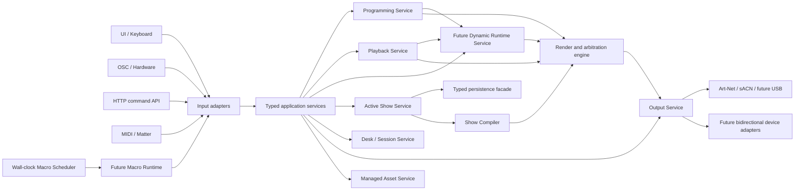
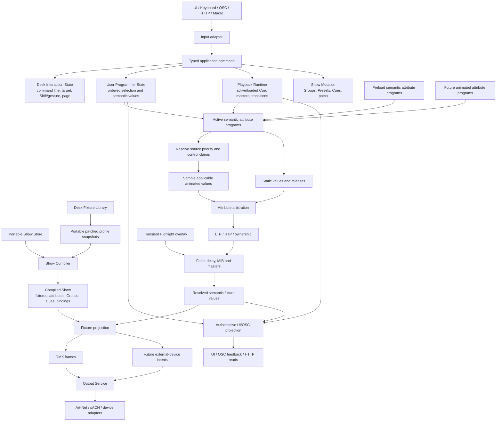

# Major Architecture and Extensibility Refactor

## Goal

Refactor ToskLight around clear, typed capability boundaries so new features can be added without routing every change through the server binary, the global frontend context, or parallel REST, WebSocket, OSC, and persistence implementations.

The refactor preserves:

- the visible desk layout, labels, geometry, gestures, and hardware/software behavior;
- exact OSC paths, feedback, aliases, and desk-sharing semantics;
- existing show, desk, fixture-profile, and layout data; and
- documented Programmer, Playback, Group, Cue, Highlight, Preload, Move in Black, and output behavior.

Internal Rust and TypeScript APIs and the REST/WebSocket v1 implementation may break during the coordinated release. The resulting architecture must make Dynamics, Timecode, bidirectional REST-controlled fixtures, ATEM or sound-mixer integrations, and future programmable Macros possible without another application-wide rewrite. These future features are extension tests for the architecture, not part of this refactor's implementation scope.

## Current architectural pressure

- `crates/server/src/main.rs` is currently the application as well as the process entry point. It combines startup, 93 routes, sessions, Programmer, Playback, show mutation, migration, OSC, Matter, output, media, files, events, and more than eight thousand lines of inline tests.
- `apps/control-ui/src/api/ServerContext.tsx` combines transport, authentication, reconnection, event routing, cached server state, optimistic mutations, errors, and almost every feature command in one context exposed to most of the UI.
- Rust wire types, handwritten TypeScript types, generic JSON show objects, string WebSocket commands, and OSC paths form parallel interfaces that can drift.
- REST, WebSocket, command-line, OSC, MIDI mappings, Matter, and UI paths frequently reproduce orchestration instead of adapting into one authoritative application action.
- Fixture, Programmer, Playback, Show, Control, Output, and Engine crates contain useful domains, but their public facades expose mutable internals or mix stable models with transport and runtime adapters.

The objective is not merely to shorten these files. The refactor must create ownership boundaries that prevent unrelated features from converging in new global modules.

## Core responsibilities and interfaces

### Application layer

- Add `light-application` as the shared use-case layer.
- Define bounded command families such as `ProgrammerCommand`, `PlaybackCommand`, `ShowCommand`, `DeskCommand`, and `OutputCommand`. Future capabilities add their own bounded families instead of extending a universal god enum.
- Every action carries an `ActionContext` containing desk, user, session, source surface, correlation or request identity, and the applicable expected revision.
- UI, OSC, HTTP, MIDI, Matter, Macros, Cues, and Timecodes call the same application services. Adapters parse, authenticate, normalize addressing, and translate; they do not implement business rules.
- Replace the server's shared state bag with service-owned state and locks. Services expose commands and immutable query projections rather than their underlying mutexes or registries.
- Define and document six state lifetimes:
  - portable show;
  - desk installation;
  - desk interaction;
  - user Programmer;
  - connection or session; and
  - transient runtime.
- Every new state field or object must declare its lifetime, persistence location, migration policy, reconnect behavior, restart behavior, Save As behavior, and deletion behavior.

### Server and wire contracts

- Make `crates/server/src/main.rs` a thin configuration and lifecycle entry point.
- Move routers, startup, shutdown, scheduling, OSC, WebSocket, Matter, media, files, and output orchestration into feature-owned server-library modules.
- Add `light-wire` containing versioned request, response, command, outcome, error, and event DTOs plus schemas.
- Generate checked-in TypeScript definitions from the wire contract and verify the generated files in CI.
- Validate decoded server responses and events at the frontend transport boundary. Keep wire DTOs separate from frontend feature and view models.
- Replace internal string-plus-JSON commands and events with discriminated types. Serialization belongs only in transport adapters.
- Keep OSC exactly compatible. REST/WebSocket v1 may remain temporary adapters and be removed after the UI and tests migrate to the replacement interfaces.

### Show management and persistence

- Introduce `ActiveShowService` as the only application boundary for active-show mutation.
- Centralize candidate decoding and migration, validation, compilation, backup, atomic revisioned persistence, runtime replacement, adapter reconciliation, audit, and event publication.
- Keep generic JSON object storage internal to `light-show`. Application code uses typed objects and repositories or codecs at the capability boundary.
- Split desk and portable-show schemas, stores, and migration modules inside `light-show` while preserving their current physical separation and data formats.
- Preserve unknown show objects during load, Save As, revision creation, and export so older or newer shows are not destructively normalized.
- Add `SelectiveShowImportService` for loading selected objects from another show. It previews dependencies and conflicts, preserves IDs where possible, skips identical objects, rewrites references when duplicating, and applies the complete import atomically.
- Macros, Dynamics, Presets, Groups, fixture-related objects, and future Timecodes use this general selective-import workflow rather than implementing feature-specific copy paths.

## Programmer and value flow

The flow enforces these rules:

- Desk interaction state owns unfinished command-line text, the current command target, Shift and gesture context, and the desk page.
- Programmer state owns the user's ordered selection expression, semantic values, timing, modes, and undo/redo history.
- Groups, Presets, Cues, patching, and other portable definitions live in the show.
- Programmer, Playback, Preload, and future Dynamics produce semantic attribute values; they never write DMX directly.
- Highlight remains a transient overlay and is never recorded into Programmer or Cue data.
- Programmer LTP and Playback arbitration remain distinct.
- Recording and Update pass through `ActiveShowService`; the render engine never writes persistence.
- The render engine receives immutable compiled-show and contribution snapshots.
- UI and OSC feedback derive from authoritative projections, never client-local approximations.

### Extensible semantic values

Every resolved value is addressed by fixture or logical head plus attribute. The internal value boundary must be able to grow from today's static values into future animated values without changing transport, storage, fixture projection, or output adapters.

Conceptually, future values may include static, animated, fixed or stomping, and release variants. The refactor does not define or implement the future Dynamics data model, `FAT` command, or pause behavior. It only ensures that the value and contribution interfaces are not restricted to stateless numeric producers.

This is sufficient for the planned Dynamics behavior:

- a Group or ordered selection can receive a Dynamic through Programmer;
- the same semantic assignment can be staged in Preload or recorded into a Cue;
- combined Dynamics can produce independent values for multiple attributes;
- different Playbacks can own independent runtime instances; and
- a future fixed value can suppress or control an animated value at the normal fixture/head-and-attribute arbitration boundary.

Whether a suppressed Dynamic freezes, continues hidden, or restarts remains inside a future Dynamic runtime policy and does not require another application-wide architectural change.

## Fixture management

```mermaid
flowchart LR
  PACKAGE["Fixture package<br/>profile, modes, channels, assets"] --> LIB["Desk Fixture Library"]
  LIB --> REV["Immutable profile revision"]
  REV --> PATCH["Patch fixture into show"]
  PATCH --> SNAPSHOT["Portable show profile snapshot<br/>one per immutable revision"]
  SNAPSHOT --> FIXTURE["PatchedFixture<br/>snapshot ID + selected mode ID"]
  FIXTURE --> SHOW["Show Store"]

  SHOW --> COMPILER["Show Compiler"]
  COMPILER --> CF["Compiled Fixture"]
  CF --> ATTR["Semantic attributes and logical heads"]
  CF --> BINDING{"Output binding"}

  BINDING -->|DMX| DMX["Universe/address/splits/multipatch"]
  BINDING -->|None| UNPATCHED["Unpatched but programmable"]
  BINDING -->|Future external| EXT["REST/ATEM/mixer adapter binding"]

  ATTR --> ENGINE["Programmer and render engine"]
  ENGINE --> BINDING
  EXT --> OBSERVED["Observed device state"]
  OBSERVED --> UI["Runtime projection and UI feedback"]
```

- `FixtureLibraryService` owns desk-wide fixture packages, immutable revisions, validation, photographs, icons, GLB assets, and import/export.
- `ShowPatchService` owns fixture numbers, stable IDs, selected mode, logical heads, addresses, split patching, multipatch instances, stage transforms, Highlight overrides, and external-device binding references.
- On first use, patching copies the immutable profile revision into a portable show-level snapshot keyed by stable revision identity and verified by content digest. Each `PatchedFixture` stores only the snapshot reference and selected mode ID; fixtures using the same revision never inline duplicate profiles or modes. Later library revisions never silently alter an existing show; upgrading a patched fixture is an explicit revisioned show mutation.
- `ShowCompiler` converts portable patch objects into `CompiledFixture` instances containing semantic attributes and output bindings.
- An unpatched fixture receives no output binding but remains selectable, programmable, groupable, recordable, and visible.
- Logical heads and multipatch instances retain stable identity across recompilation and migration.
- The render engine knows semantic attributes and compiled bindings, not SQLite, REST, fixture-library UI, or network connection details.
- Future bidirectional fixtures use the same Programmer, Preset, Dynamic, Cue, and Playback paths. Desired desk state and observed device state remain separate runtime concepts until their authority policy is specified.

### Patch mutation performance contract

- `ShowPatchService` exposes one revisioned `PatchFixtures` command for a batch of one or more fixtures. It resolves each unique profile revision once, validates fixture numbers, virtual fixture numbers, addresses, splits, and conflicts against the complete candidate batch, and either applies the complete batch or applies nothing.
- `ActiveShowService` processes a patch batch as one show transaction: one candidate migration and validation pass, one backup, one atomic persistence revision, one `ShowCompiler` run, one runtime replacement, and one patch-change event. A fixture count must never become a loop of generic show-object requests, backups, or full-show compilations.
- The command request refers to a library profile revision and selected mode instead of sending the fixture catalog or a complete profile per fixture. Its size is proportional to the number of fixtures plus the number of unique profile revisions first introduced into the show, never fixtures multiplied by profile modes.
- The command outcome and patch-change event contain the created or changed fixture projections, their IDs, and the resulting show and patch revisions. The Patch frontend store applies that delta directly. Patching must not refresh bootstrap, Playbacks, show lists, configuration, media state, fixture profiles, or the fixture catalog; those caches refresh only for their own versioned events.
- Legacy shows with inline `definition.profile_snapshot` data remain loadable. Migration canonicalizes byte-equivalent snapshots into show-level revision objects, preserves selected mode identity and patched behavior, and retains unknown data. Save As, export, selective import, and fixture transfer include every referenced snapshot and asset so portability never depends on the desk library.
- Contract tests patch one and many fixtures from a profile containing at least 2,000 modes and assert one stored snapshot per unique revision, no inline profile copies, one transaction, backup, compile, runtime swap, and event per batch, zero fixture-catalog reads, atomic failure, and request/response growth linear in fixture count. A focused frontend network test asserts that Add sends one batch request and performs no unrelated refresh requests.
- A warm release-build benchmark on documented reference hardware must keep a single-fixture patch below 250 ms server-side and visible in the Patch UI below 500 ms at p95; a 100-fixture batch must remain below 500 ms server-side and use the same single transaction and compile path. Record payload bytes and phase timings so regressions identify serialization, persistence, compilation, or projection refresh separately.

## Engine, Playback, Programmer, Control, and Output boundaries

- Refactor the engine into compiled show, contribution sources, merge and arbitration, transitions, fixture projection, DMX rendering, and visualization modules.
- Replace `Engine::playback()` and other mutable-lock exposure with typed commands, queries, and immutable runtime projections.
- Keep stateful animation outside the deterministic render core. The engine samples immutable values or batches supplied for the current render instant.
- Split Playback into persisted model, Cue tracking, runtime, controls, transitions, phasers or future Dynamics integration, and contribution production.
- Split Programmer into state, selection, Groups, Presets, Preload, history, and registry or service modules.
- Split `light-control` stable action and mapping models from MIDI, OSC, RTP-MIDI, UDP, and timecode transports.
- Split stable output models from Art-Net/sACN codecs, sockets, scheduler, health, and delivery adapters.
- Make rendered output a two-stage result: resolved semantic fixture values become DMX frames and, later, typed external-device intents.
- External device adapters own connection, authentication, requests, feedback, retries, health, and shutdown. They never participate directly in Programmer or Cue storage.

### Output performance contract

Efficiency is a hard architecture requirement, not a post-refactor polish item. The render, arbitration, fixture projection, and output scheduler paths must be designed and benchmarked against fully packed universes with multiple simultaneous contribution sources, including future Effects/Dynamics, overlapping Playback and Programmer values, and optional sound-to-light analysis.

- Hard acceptance floor: the server must generate complete output for at least 32 fully packed DMX universes at 100 Hz, including all contribution arbitration and output frame production for every universe on each tick.
- Target performance goal: 64 fully packed universes at 120 Hz on slower ordinary show-control hardware, not only on a high-end development laptop.
- Low-power goal: on very slow hardware such as a Raspberry Pi-class device, the output engine should still sustain 40 Hz across 4 to 8 universes.
- Output benchmarks must run against release builds, document the reference hardware, and report p50, p95, p99, dropped/deferred ticks, CPU usage, allocation rate, and time split between contribution sampling, arbitration, fixture projection, protocol encoding, socket delivery, and optional sound-to-light analysis.
- The render loop must avoid per-tick full-show cloning, broad mutex contention, JSON serialization, frontend projection work, fixture-library reads, persistence, or network adapter backpressure on the timing-critical output path.
- Effects, future Dynamics, Macros, Timecode, sound-to-light detection, and external-device adapters may schedule or submit contributions, but they must not block output frame generation.
- If the system cannot keep the configured output rate, it must report actionable output health and overload diagnostics rather than silently producing stale or irregular frames.

## Future Macro architecture

Macros belong above the domain services in the application layer, never inside the render loop.

- `MacroDefinition` is a portable show object with stable identity, source, future language identifier, declared capabilities, dependencies, and revision.
- No Macro language is selected during this refactor.
- A language-neutral `MacroRuntime` port allows a future Lua, JavaScript, custom DSL, or other sandboxed implementation.
- `MacroService` supervises short- and long-running Macro instances.
- A future Macro host API can query fixtures, positions, Groups, Presets, Dynamics, Cues, Playbacks, and authoritative runtime state and can submit typed application commands.
- Long-running Macros may wait for timers, application events, or typed operator input without blocking the render loop.
- HTTP/HTTPS access goes through an application-owned port providing cancellation, limits, errors, and audit even when arbitrary URLs are allowed.
- Cue and Timecode references execute a Macro by stable ID. Those are ordinary Macro executions, not scheduled Macros.
- `MacroSchedule` is a separate portable show object for daily or one-time wall-clock execution, with explicit timezone and per-schedule skip or catch-up behavior.
- Selective cross-show import loads Macro definitions and their dependencies into the current show.

## Timecode and managed assets

- Introduce a monotonic runtime clock and scheduler boundary distinct from wall-clock metadata and external timecode input.
- Keep Cue fades, Chasers, Move in Black, future Dynamics, Macro timers, and Timecode scheduling on the same deterministic timing foundation.
- Add a `ManagedAssetStore` before Timecode implementation for stable asset identity, import and validation, streaming, copying with a show, export, missing-state reporting, revision retention, and cleanup.
- A future Timecode runtime calls the same typed Playback and Macro services as manual operation.
- Timecode audio, timeline editing, seek behavior, missed events, and restart reconstruction remain future product decisions rather than refactor requirements.

## Frontend and desktop structure

- `transport/light`: validated HTTP/WebSocket DTOs and typed events.
- `session`: authentication, reconnect, and explicit primary/secondary-screen ownership.
- `features/{programmer,playback,show,patch,fixture-library,stage,screens,files,...}`: model, ports, store/hooks, and UI.
- `workspace`: panes, windows, modal presentation, and local layout only.
- `platform/desktop`: typed `DesktopBridge` with Tauri and browser-test adapters.
- `shared/ui`: proven presentation primitives only.
- `control-surface-contracts`: keypad IDs, layout, typed intents, and shared OSC action mapping.
- Retain `useServer()` temporarily as a migration facade and delete it after callers use narrow feature hooks.
- Replace DOM-based SET, Store, and Update routing with typed interaction workflows.
- Model primary and secondary-screen session roles so only the primary owns session creation and destruction.
- Split hardware-controls into an OSC bridge, feedback reducer, controller hook, and separate playback, programmer, grid, and settings surfaces.
- UI actions should feel immediate. A user-visible action either updates the visible state promptly, shows an explicit pending state, or opens an actionable loading/progress modal for work that legitimately takes time such as loading, importing, validating, compiling, or migrating a large show.
- Background work must publish success, progress, cancellation or retry options where applicable, and actionable errors. The UI must not leave the operator guessing whether an action was accepted, still running, failed, or completed.

## Command-line HTTP API

Add supported v2 endpoints scoped to the authenticated session's desk:

- `GET /api/v2/desks/{desk_id}/command-line` returns text, target, pristine state, revision, and pending choice.
- `PUT /api/v2/desks/{desk_id}/command-line` replaces the visible shared command line using `If-Match`.
- `POST /api/v2/desks/{desk_id}/command-line/keys` accepts a logical key, press or release phase, and request ID.
- `POST /api/v2/desks/{desk_id}/command-line/execute` executes the current line or an optional supplied full line atomically and returns the typed outcome and resulting command state.

The same `ProgrammingService` processes UI keys, complete HTTP command strings, individual HTTP keys, OSC keys, hardware keys, and future Macro actions.

## Staged migration

Each stage must leave the application buildable, testable, and usable.

### 1. Establish public test boundaries

- Inventory every Playwright and integration test by action and observation surface.
- Add the command-line HTTP adapter over the existing command implementation.
- Migrate Playwright actions to visible UI, exact OSC, command-line HTTP, or explicit deterministic bench controls.
- Move other cross-module integration tests to process-level public boundaries where practical.
- Retain focused same-module unit tests for parsing, arbitration, migrations, scheduling, and codecs.
- Capture current OSC, persistence, command, Playback, output, multi-screen, and UI behavior before structural movement.

### 2. Introduce composition and typed contracts

- Create `light-application` and `light-wire`.
- Move process startup, shutdown, routers, schedulers, and adapters into the server library.
- Introduce typed commands, outcomes, errors, and events behind temporary compatibility adapters.
- Add automated Rust and TypeScript dependency-direction checks to CI.

### 3. Migrate the first cross-surface slice

- Migrate command-line editing and execution, selection, Programmer values, Groups, and Presets through `ProgrammingService`.
- Migrate Playback addressing and actions through `PlaybackService`, including current-page and explicit-page resolution.
- Route UI, keyboard, OSC, attached hardware, HTTP, and compatibility WebSocket through the same services.
- Preserve exact command grammar, keypad layout, partial desk command state, request ordering, and source attribution.

### 4. Separate frontend state ownership

- Extract connection, session, and event routing from `ServerContext`.
- Introduce narrow Programmer, Playback, Show, Patch, Screens, Files, Configuration, and Output stores and hooks.
- Separate workspace presentation state from authoritative desk and show state.
- Add explicit primary and secondary-screen ownership.
- Introduce `DesktopBridge` and modularize the Tauri hosts.

### 5. Establish Show, fixture, and persistence boundaries

- Implement `ActiveShowService`, `ShowPatchService`, typed codecs, and `ShowCompiler`.
- Introduce the atomic `PatchFixtures` command, show-level deduplicated profile snapshots, targeted patch projections, and migration from legacy inline snapshots before moving Patch UI callers off generic show-object mutation.
- Migrate Groups and Presets, Cuelists and Playbacks, fixtures and patch, routes, layouts, MVR, Record, Update, undo, migrations, and startup recovery.
- Add `SelectiveShowImportService`.
- Remove generic show-object mutation from frontend features.

### 6. Refactor domain and engine internals

- Refactor Engine, Programmer, Playback, Fixture, Show, Control, and Output behind stable facades.
- Remove mutable lock exposure and direct transport dependencies from the render domain.
- Introduce immutable contribution batches, compiled fixtures, monotonic scheduling, and rendered-output batches.
- Keep existing Cue Phaser behavior compatible while ensuring future stateful animated-value sources fit the contribution boundary.
- Add release-build output benchmarks and profiling hooks for the hard 32-universe 100 Hz floor, the 64-universe 120 Hz target, and the 4-to-8-universe 40 Hz low-power goal.

### 7. Prove future extension seams

These are architectural tests using fakes, not production feature implementations.

- Add a fake stateful animated attribute source that can be applied through Programmer, Preload, and Playback/Cue projections without changing transport or output code.
- Use a two-attribute fake value to prove combined Intensity and Tilt animation fits ordinary attribute resolution.
- Add a fake fixed contribution to prove a future stomp or `FAT` value can control the overlapping animated attribute without special-casing Groups, Cues, fixtures, or DMX output.
- Add a fake bidirectional external-fixture adapter without changing DMX delivery.
- Add a fake language-neutral Macro runtime that queries fixtures, performs a revisioned position change, waits for typed input, triggers a Playback, and makes a mocked HTTP request.
- Add fake daily and one-time Macro schedules with skip and catch-up policies.
- Add a fake managed asset and timeline operation to prove the Timecode seams.

### 8. Remove compatibility facades and document the result

- Remove REST/WebSocket v1 and `useServer()` compatibility layers after all callers migrate.
- Move giant inline server tests into feature-local unit tests and public-boundary integration tests.
- Add an architecture overview, state-ownership matrix, code tour, extension recipes, and test map under `docs/engineering`.
- Repair stale feature-plan links and document selective cross-show import.

## Verification and acceptance

- Playwright scenarios use UI, OSC, command-line HTTP, or explicit bench controls rather than implementation objects.
- Exact OSC paths, aliases, feedback indices, desk sharing, and current-page versus explicit-page semantics remain unchanged.
- Desk geometry, labels, gestures, focus behavior, software layout, and hardware-connected layout remain unchanged.
- Existing show, desk, fixture-profile, patched-fixture, Cue Phaser, and layout data remains loadable and migratable.
- Single and batch patching meet the Patch mutation performance contract, remain atomic, and never reload unchanged fixture-library or unrelated desk state.
- Output generation meets the hard 32 fully packed universes at 100 Hz acceptance floor with multiple simultaneous contribution sources and optional sound-to-light analysis enabled or explicitly accounted for in benchmark results.
- Benchmark evidence records progress toward the 64 fully packed universes at 120 Hz target and the Raspberry Pi-class 4-to-8-universe 40 Hz low-power goal.
- Timing-critical output work is isolated from persistence, fixture-library access, frontend projection refresh, JSON transport serialization, and blocking external-device or sound-to-light adapters.
- Operator-facing UI actions are immediate or show explicit pending, loading, progress, success, failure, cancellation, and retry states appropriate to the operation.
- Invalid active shows still enter actionable recovery without destroying the original.
- Preserve unpatched fixtures, stored-empty Groups, missing Group IDs, ordered selections, Programmer LTP, Playback arbitration, Preload, Highlight, Update, Move in Black, route termination, safe shutdown, and first post-restart output.
- Add contract coverage for command concurrency, primary/secondary session closure, reconnect gaps, atomic revision failure, unknown stored objects, fixture-profile upgrades, selective imports, and adapter lifecycle.
- A fake animated value source, fake external-device adapter, and fake Macro runtime must plug in without modifying existing transport adapters, render arbitration, or output drivers.
- At every stage run formatting, Clippy, Rust tests, TypeScript checks, frontend tests and build, focused UI/API/OSC coverage, and desktop smoke tests.
- Socket-based CITP and output tests run in normal CI or an unrestricted local environment.
- Methods and modules are split by responsibility, abstraction level, ownership, and test boundary rather than an arbitrary line limit.

## Assumptions and deferred decisions

- Dynamics, Timecode, Macros, scheduled Macros, a `FAT` command, and bidirectional external fixtures are not implemented during this refactor.
- The architecture supports future static and stateful animated attribute values, but does not choose the Dynamics schema or pause behavior.
- No Macro language or sandbox runtime is selected.
- Macro source is expected to belong to the show and be selectively importable with dependencies.
- Future Macros may perform arbitrary HTTP/HTTPS requests through an application-owned auditable port.
- Device-observed versus desk-desired value authority remains a future fixture-feature decision.
- Internal Rust and TypeScript APIs and REST/WebSocket v1 may break. Visible UI behavior, OSC, and persisted user data remain compatibility surfaces.
- Existing unrelated working-tree changes must remain untouched and be excluded from refactor commits.
